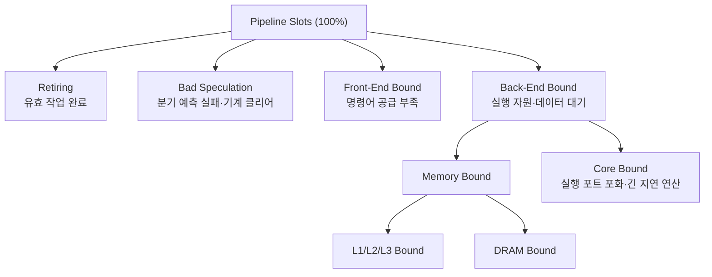

<strong>하드웨어 성능 카운터(hardware performance counter)</strong>는 CPU 안에 내장된 PMU(Performance Monitoring Unit)가 사이클·명령어·캐시 미스·분기 예측 실패 같은 마이크로아키텍처 이벤트를 실리콘 수준에서 세어 주는 레지스터입니다. 샘플링 프로파일러가 "코드의 어디가 느린가"를 알려준다면, 카운터는 **"왜 느린가"** — 파이프라인이 명령어를 못 받아서인지, 메모리를 기다려서인지, 예측이 틀려서인지 — 를 알려줍니다. µs 단위 지연을 다루는 엔지니어에게 카운터는 사실상 유일한 인과 진단 도구지만, 카운터 슬롯보다 많은 이벤트를 동시에 요청하면 커널이 시분할(멀티플렉싱)로 추정치를 만들어내기 때문에, 숫자를 읽는 법을 모르면 정밀해 보이는 오답을 얻게 됩니다. 이 장은 PMU의 물리적 구조, 핵심 지표의 해석 규칙, Top-down Microarchitecture Analysis(TMA) 방법론, 그리고 멀티플렉싱 함정의 회피법을 다룹니다.

## 이 장을 읽기 전에

**선행 챕터**: 이 장은 [Linux perf 고급](/post/profiling-analysis/linux-perf-advanced/)에서 다룬 `perf stat`·`perf record`의 기본 조작과, [샘플링 프로파일링: perf·VTune 원리](/post/profiling-analysis/sampling-profiling-perf-vtune/)에서 다룬 "카운터 오버플로 → 인터럽트 → 샘플" 메커니즘을 전제로 합니다. 트랙 전체 지도는 [이 트랙의 인트로](/post/profiling-analysis/getting-started-profiling-performance-analysis-fundamentals/)를 참고하세요.

**이 장의 깊이**: 심화입니다. 카운터가 "무엇을 세는지"를 넘어 "어떻게 세는지"(고정/범용 카운터, 이벤트 셀렉트, 시분할)까지 내려가고, 그 구조가 측정값의 신뢰도에 어떤 제약을 거는지를 다룹니다.

**다루지 않는 것**: perf의 명령어 옵션 일반론은 [Linux perf 고급](/post/profiling-analysis/linux-perf-advanced/)에, VTune GUI에서의 TMA 뷰 조작은 [Intel VTune 심화](/post/profiling-analysis/intel-vtune-deep-dive/)에, AMD 고유의 IBS(Instruction-Based Sampling)와 uProf 활용은 [AMD μProf 활용](/post/profiling-analysis/amd-uprof-profiling/)에 위임합니다. 측정값의 분산·신뢰 구간 처리는 [통계적 벤치마킹](/post/profiling-analysis/statistical-benchmarking/)에서 다룹니다.

## 당신의 수준에 맞는 경로

| 수준 | 읽을 부분 | 핵심 목표 |
|------|---------|---------|
| **중급자** | "PMU의 구조" ~ "IPC·캐시 미스·분기 예측 실패 읽는 법" | 카운터의 물리 구조와 3대 지표의 올바른 해석 |
| **심화 학습자** | "Top-down Microarchitecture Analysis" | 개별 이벤트 대신 TMA 트리로 병목을 계층적으로 좁히기 |
| **전문가** | "멀티플렉싱" ~ "비판적 시각" | 시분할 추정의 오차 모델을 이해하고 이벤트 그룹으로 통제 |

---

## 소프트웨어가 하드웨어를 세기 시작한 역사

성능 카운터는 1993년 Intel Pentium이 모델 특정 레지스터(MSR) 형태의 이벤트 카운터를 탑재하면서 x86에 등장했고, P6(Pentium Pro) 세대에서 사용자 공간이 카운터를 직접 읽는 `RDPMC` 명령이 추가되면서 저오버헤드 측정의 기반이 마련되었습니다. 초기에는 문서화가 빈약해 벤더 도구(Intel VTune)나 연구용 패치(perfctr, perfmon2, oprofile)로만 접근할 수 있었지만, 2009년 Linux 2.6.31에 `perf_events` 서브시스템이 병합되면서 커널이 카운터 가상화·프로세스별 컨텍스트 스위칭·시분할을 표준 시스템 콜([perf_event_open(2)](https://man7.org/linux/man-pages/man2/perf_event_open.2.html))로 제공하게 되었습니다.

해석 방법론의 전환점은 2014년입니다. Intel의 Ahmad Yasin이 ISPASS 2014에서 발표한 논문 "A Top-Down Method for Performance Analysis and Counters Architecture"는 수백 개의 개별 이벤트를 나열하는 대신, 파이프라인 슬롯이라는 단일 예산을 4개 카테고리로 계층 분해하는 TMA 방법론을 제시했고, 이후 VTune·perf·toplev의 표준 분석 프레임이 되었습니다. TMA 트리는 지금도 개정 중이어서 [pmu-tools](https://github.com/andikleen/pmu-tools) 기준 2025–2026년 현재 5.x 버전대에 이르며, 트리 노드가 120개를 넘고 이를 12가지 대표 병목으로 요약하는 Bottlenecks View가 추가되었습니다.

## PMU의 구조: 고정 카운터와 범용 카운터

PMU는 코어(하이퍼스레드) 단위로 두 종류의 카운터를 가집니다. <strong>고정 카운터(fixed counter)</strong>는 세는 대상이 하드와이어된 카운터로, 통상 "리타이어된 명령어 수", "코어 사이클", "레퍼런스 사이클" 3종이 기본이고 최신 Intel 코어(Ice Lake 이후)에는 TMA 최상위 분해를 위한 슬롯 카운터가 추가되었습니다. <strong>범용 카운터(general-purpose/programmable counter)</strong>는 이벤트 셀렉트 레지스터에 이벤트 코드와 umask를 써 넣어 무엇을 셀지 프로그래밍하는 카운터로, 세대에 따라 스레드당 4–8개 수준이며 SMT(하이퍼스레딩)를 켜면 물리 코어의 카운터를 두 스레드가 나눠 쓰는 구현도 있습니다. 정확한 개수·구성은 CPU 세대마다 다르므로 구현 정의로 취급해야 합니다.

perf 같은 도구가 `cache-misses` 같은 일반 이름을 보여주지만, 그 밑에는 항상 벤더 문서의 이벤트 코드가 있습니다. 예컨대 Intel Skylake 계열에서 `MEM_LOAD_RETIRED.L1_MISS`는 이벤트 0xD1, umask 0x08이며, perf에서는 다음처럼 심볼 이름 또는 raw 인코딩으로 지정할 수 있습니다.

```bash
# 커널이 아는 이벤트 목록(하드웨어 이벤트·벤더 이벤트 별칭 포함)
perf list hw cache pmu | head -40

# 심볼 이름과 raw 인코딩은 같은 카운터를 프로그래밍한다 (Skylake 계열 예시)
perf stat -e mem_load_retired.l1_miss ./app
perf stat -e cpu/event=0xd1,umask=0x08/ ./app
```

같은 이름의 이벤트라도 세대에 따라 코드·의미가 달라질 수 있으므로, 정밀 분석에서는 벤더의 이벤트 레퍼런스로 정의를 확인하는 습관이 필요합니다. 카운터를 읽는 방식도 두 갈래입니다. **카운팅 모드**는 구간의 총합만 읽으므로 오버헤드가 거의 없고(`perf stat`), **샘플링 모드**는 카운터 오버플로 시 인터럽트를 걸어 "그 이벤트가 어디서 났는지"를 기록합니다(`perf record -e ...`). 샘플링 모드의 스키드(skid)와 이를 줄이는 PEBS/IBS는 [샘플링 프로파일링 챕터](/post/profiling-analysis/sampling-profiling-perf-vtune/)에서 다뤘으므로, 이 장은 카운팅 모드 중심으로 진행합니다.

## 실습 준비: 캐시 미스를 인위적으로 만드는 벤치마크

지표 해석을 연습하려면 병목의 정체를 이미 아는 워크로드가 필요합니다. 아래 프로그램은 같은 배열을 두 가지 방식으로 순회합니다. 선형 사슬은 하드웨어 프리페처가 완벽히 예측할 수 있는 접근이고, Sattolo 알고리즘으로 만든 단일 사이클 순열은 매 로드가 LLC보다 큰 작업 집합 위의 임의 위치로 향하는 의존적 포인터 추적(pointer chase)이라 캐시 미스와 메모리 지연이 그대로 실행 시간이 됩니다.

```cpp
// pmu_bench.cpp — g++ -O2 -std=c++17 -o pmu_bench pmu_bench.cpp
#include <algorithm>
#include <chrono>
#include <cstdint>
#include <cstdio>
#include <numeric>
#include <random>
#include <vector>

int main(int argc, char** argv) {
  const bool random_access = (argc > 1 && argv[1][0] == 'r');
  const std::size_t n = std::size_t{1} << 26;      // 64Mi * 4B = 256MiB > LLC
  std::vector<std::uint32_t> next(n);
  if (random_access) {
    std::iota(next.begin(), next.end(), 0u);
    std::mt19937_64 rng(42);
    for (std::size_t i = n - 1; i > 0; --i) {      // Sattolo: 단일 사이클 순열
      std::uniform_int_distribution<std::size_t> d(0, i - 1);
      std::swap(next[i], next[d(rng)]);
    }
  } else {
    std::iota(next.begin(), next.end(), 1u);       // 선형 사슬: i -> i+1
    next.back() = 0;
  }
  std::uint32_t idx = 0;
  std::uint64_t sum = 0;
  const auto t0 = std::chrono::steady_clock::now();
  for (std::size_t i = 0; i < n; ++i) { idx = next[idx]; sum += idx; }
  const auto t1 = std::chrono::steady_clock::now();
  const auto ms = std::chrono::duration_cast<std::chrono::milliseconds>(t1 - t0).count();
  std::printf("sum=%llu elapsed_ms=%lld\n",
              static_cast<unsigned long long>(sum), static_cast<long long>(ms));
  return 0;
}
```

두 모드 모두 `idx = next[idx]`라는 의존 체인이므로 명령어 수준 병렬성이 낮다는 점은 같고, 차이는 오직 로드가 어느 캐시 계층에서 해소되느냐뿐입니다. 즉 두 실행의 카운터 차이는 순수하게 메모리 계층 효과로 귀속됩니다. 초기화 구간(iota·셔플)도 카운터에 함께 잡히므로 정밀 측정에서는 관심 구간만 계측해야 하는데, 구간 격리 설계는 [Microbenchmark 설계 원칙](/post/profiling-analysis/microbenchmark-design-principles/)의 주제입니다.

## IPC·캐시 미스·분기 예측 실패 읽는 법

<strong>IPC(Instructions Per Cycle)</strong>는 사이클당 리타이어된 명령어 수로, `instructions / cycles`로 계산됩니다. 최신 x86 코어의 이론적 상한은 디코드·리타이어 폭에 따라 4–8 수준이지만(세대별 상이), 실무 해석은 절대값보다 방향입니다. 의존 체인이 짧고 캐시에 잘 맞는 코드는 2–4, 메모리 지연에 갇힌 코드는 0.5 미만으로 떨어지는 경향이 있습니다. 위 벤치마크를 `perf stat` 기본 이벤트로 돌려 보면 대비가 극명합니다.

```bash
perf stat -e cycles,instructions,branches,branch-misses,LLC-loads,LLC-load-misses ./pmu_bench      # 선형
perf stat -e cycles,instructions,branches,branch-misses,LLC-loads,LLC-load-misses ./pmu_bench r    # 임의
```

```text
# 임의 접근(r) 실행 예시 — x86-64, Linux 6.x, 수치는 플랫폼·주파수·메모리 구성에 따라 다름
 Performance counter stats for './pmu_bench r':

    31,842,910,552      cycles
     1,613,224,876      instructions              #    0.05  insn per cycle
       270,113,458      branches
           412,199      branch-misses             #    0.15% of all branches
        68,433,120      LLC-loads
        66,921,004      LLC-load-misses           #   97.79% of all LLC-loads

       9.412030571 seconds time elapsed
```

이 출력에서 읽을 것은 세 가지입니다. 첫째, IPC 0.05는 코어가 사이클의 대부분을 놀고 있다는 뜻이고, 둘째, LLC 로드의 98%가 미스라는 것은 그 놀고 있는 이유가 DRAM 접근임을 가리키며, 셋째, 분기 미스율 0.15%는 분기 예측이 병목이 아님을 배제해 줍니다. 같은 명령을 선형 모드로 돌리면 IPC가 1 후반–2 수준으로 올라가고 LLC 미스가 수십 분의 일로 줄어드는 것을 확인할 수 있습니다(프리페처가 DRAM 지연을 숨기기 때문).

캐시 미스는 비율보다 **밀도**로 읽는 편이 안전합니다. 관례적으로 **MPKI(Misses Per Kilo-Instructions)** — `미스 수 / (instructions / 1000)` — 를 쓰는데, 미스율(%)은 분모(접근 수)의 정의가 이벤트·세대마다 흔들리는 반면 MPKI는 "명령어 1000개당 몇 번 메모리 계층에서 미끄러지는가"라는 코드 고유의 밀도라 워크로드 간 비교가 됩니다. 분기 예측 실패는 비율(%)과 절대 빈도를 함께 봅니다. 미스 1회는 파이프라인 플러시로 대략 15–20사이클급 손실(마이크로아키텍처마다 다름)이므로, 미스율이 1%라도 분기가 조밀한 코드에서는 상당한 비용이 될 수 있습니다.

## Top-down Microarchitecture Analysis (TMA)

개별 이벤트를 하나씩 뒤지는 방식의 문제는, 이벤트가 수백 개이고 어떤 이벤트가 "느림"과 인과적으로 연결되는지 사전 지식 없이는 알 수 없다는 점입니다. TMA는 이 문제를 예산 분해로 바꿉니다. 매 사이클 코어의 프런트엔드는 파이프라인 폭만큼의 **슬롯(slot)** — 예컨대 4-wide 코어라면 사이클당 4개 — 을 발행할 수 있고, 전체 슬롯 예산(폭 × 사이클)을 네 가지 운명으로 남김없이 분류합니다. 슬롯이 유효한 명령어로 리타이어되면 **Retiring**, 잘못된 예측 경로의 작업으로 버려지면 **Bad Speculation**, 프런트엔드가 명령어를 공급하지 못해 비면 **Front-End Bound**, 명령어는 있는데 백엔드 자원(실행 포트·로드 버퍼·메모리)이 없어 받지 못하면 **Back-End Bound**입니다.



TMA의 사용 규칙은 두 가지입니다. 첫째, **지배적인 가지만 내려간다** — 최상위에서 Back-End Bound가 60%라면 그 하위(Memory Bound vs Core Bound)로 내려가고, 15%짜리 Front-End Bound의 하위 항목은 병목이 아니므로 읽지 않습니다. 둘째, **Retiring이 높다고 끝이 아니다** — Retiring 100%는 "파이프라인이 낭비 없이 돌았다"는 뜻이지 "필요한 최소 일만 했다"는 뜻이 아니므로, 그 다음은 알고리즘·벡터화 차원의 검토([Tr.03 어셈블리 레벨 코드 생성 분석](/post/compiler-optimization/code-generation-analysis-assembly/))로 넘어갑니다. TMA의 개념과 실전 워크스루는 Denis Bakhvalov의 [Top-Down performance analysis methodology](https://easyperf.net/blog/2019/02/09/Top-Down-performance-analysis-methodology) 글이 좋은 1차 참고 자료입니다.

도구는 세 층위가 있습니다. perf는 메트릭 그룹으로 L1 분해를 제공하고, pmu-tools의 toplev는 전체 트리를 자동으로 내려가 주며, VTune은 같은 트리를 GUI로 보여줍니다([Intel VTune 심화](/post/profiling-analysis/intel-vtune-deep-dive/) 참고).

```bash
# perf 메트릭 그룹 (perf·CPU 세대에 따라 그룹 이름이 TopdownL1 또는 tma_* 접두사)
perf stat -M TopdownL1 ./pmu_bench r

# pmu-tools toplev: 레벨 2까지 자동 분해, 단일 스레드 워크로드 가정
git clone https://github.com/andikleen/pmu-tools
./pmu-tools/toplev -l2 --single-thread ./pmu_bench r
```

```text
# toplev -l2 출력 예시 (요약, 실제 포맷·수치는 버전·CPU에 따라 다름)
BE             Backend_Bound                        % Slots   71.4
BE/Mem         Backend_Bound.Memory_Bound           % Slots   63.8  <==
BE/Core        Backend_Bound.Core_Bound             % Slots    7.6
RET            Retiring                             % Slots   21.3
FE             Frontend_Bound                       % Slots    5.1
BAD            Bad_Speculation                      % Slots    2.2
```

`<==` 표시가 toplev가 지목한 병목 경로입니다. 이 결과는 앞 절에서 개별 이벤트로 내린 "DRAM 접근이 병목"이라는 결론을, 이벤트 이름을 하나도 몰라도 도달할 수 있는 형태로 재현합니다. 다만 TMA 트리의 노드 정의는 Intel 이벤트에 기반하므로, AMD에서는 uProf의 Pipeline Utilization 뷰([AMD μProf 활용](/post/profiling-analysis/amd-uprof-profiling/)), ARM Neoverse에서는 ARM 고유의 topdown 방법론을 써야 하고 트리 구조·항목이 서로 다릅니다.

## 멀티플렉싱: 카운터보다 이벤트가 많을 때

TMA 레벨 2–3까지 내려가면 필요한 이벤트가 수십 개인데 범용 카운터는 스레드당 4–8개뿐입니다. perf_events는 이 간극을 <strong>멀티플렉싱(multiplexing)</strong>으로 메웁니다. 커널이 이벤트 집합을 타이머 틱 주기로 돌아가며 카운터에 태우고, 각 이벤트에 대해 "활성화되어 있던 시간(time_enabled)"과 "실제로 카운터에 올라 있던 시간(time_running)"을 기록한 뒤, 최종값을 `측정값 × time_enabled / time_running`으로 외삽합니다([perf_event_open(2)](https://man7.org/linux/man-pages/man2/perf_event_open.2.html)의 PERF_FORMAT_TOTAL_TIME_ENABLED/RUNNING). `perf stat` 출력의 각 행 끝에 붙는 백분율이 바로 `time_running / time_enabled`, 즉 그 이벤트가 실제로 측정된 시간 비율입니다.

```bash
# 카운터 슬롯을 초과하는 10개 이벤트 요청 → 멀티플렉싱 발생
perf stat -e cycles,instructions,cache-references,cache-misses,branches,branch-misses,L1-dcache-loads,L1-dcache-load-misses,LLC-loads,LLC-load-misses ./pmu_bench r
```

```text
    31,922,481,003      cycles                       (49.98%)
     1,608,110,542      instructions                 (62.51%)
       921,004,118      cache-references             (62.53%)
       688,213,772      cache-misses                 (62.55%)
       268,994,203      branches                     (62.51%)
           409,118      branch-misses                (49.99%)
       804,112,336      L1-dcache-loads              (49.97%)
        70,182,004      L1-dcache-load-misses        (49.96%)
        67,921,340      LLC-loads                    (37.44%)
        66,433,801      LLC-load-misses              (37.45%)
```

이 외삽은 **워크로드가 측정 구간 내내 통계적으로 균질하다**는 가정 위에서만 유효합니다. 초기화 후 계산으로 넘어가는 프로그램, 주기적 버스트가 있는 서버, 수십 ms짜리 짧은 실행에서는 각 이벤트가 서로 다른 국면(phase)을 보고 외삽되므로, 개별 값이 틀릴 뿐 아니라 **서로 다른 시간대에 측정된 두 이벤트의 비율(IPC, 미스율)은 아예 정의가 흔들립니다**. 위 출력에서도 cycles는 50% 구간, instructions는 62% 구간에서 측정되었으므로 둘을 나눈 IPC는 같은 시간을 본 값이 아닙니다. 관측 시간이 40% 아래로 내려간 행은 추정 오차가 크다고 보고 재측정하는 편이 안전합니다.

대처법은 측정 설계로 해결하는 것이 원칙입니다. 첫째, **이벤트 그룹**(`-e '{A,B}'`)으로 비율을 만들 이벤트끼리 묶으면 그룹 단위로 같은 시간에 스케줄되므로 그룹 내부 비율은 항상 정합합니다(그룹이 카운터 수를 초과하면 스케줄 자체가 실패하므로 그룹 크기는 범용 카운터 수 이내로). 둘째, **실행을 나눠** 한 번에 카운터 수 이하의 이벤트만 요청하고 여러 번 돌립니다 — 실행 간 변동은 [통계적 벤치마킹](/post/profiling-analysis/statistical-benchmarking/)의 반복·신뢰 구간으로 처리합니다. 셋째, instructions·cycles처럼 고정 카운터에 올라가는 이벤트는 범용 카운터를 소모하지 않으므로 이들을 기준 지표로 삼습니다. toplev도 기본값은 멀티플렉싱을 허용하되 `--no-multiplex` 옵션으로 이벤트 집합별 재실행 방식을 지원합니다.

```bash
# 비율을 만들 이벤트를 그룹으로 묶기: 그룹 내부는 동일 구간에서 측정됨
perf stat -e '{cycles,instructions}','{LLC-loads,LLC-load-misses}' ./pmu_bench r

# 반복 실행으로 실행 간 변동까지 확인
perf stat --repeat 10 -e '{cycles,instructions}' ./pmu_bench r
```

그룹화는 정합성을 사는 대신 한 번에 볼 수 있는 이벤트 수를 줄이는 트레이드오프입니다. 탐색 단계에서는 멀티플렉싱을 허용해 넓게 훑고, 결론을 내릴 지표가 정해지면 그룹·재실행으로 좁혀 확정하는 2단계 운용이 실무 표준입니다.

## 흔한 오개념 교정

**"IPC가 높을수록 좋은 코드다."** IPC는 파이프라인 활용도이지 일의 효율이 아닙니다. 스핀 대기 루프는 IPC 3–4를 찍으면서 아무 일도 하지 않고, 반대로 AVX-512로 벡터화한 코드는 명령어 수 자체가 줄어 IPC가 낮아져도 벽시계 시간은 몇 배 빨라질 수 있습니다. 비교 대상이 같은 명령어 스트림일 때만 IPC 상승을 개선으로 읽을 수 있으며, 최종 판정 지표는 항상 시간(사이클)입니다.

**"캐시 미스율(%)이 낮으면 메모리는 문제없다."** 미스율의 분모인 '접근 수'는 이벤트 정의에 따라 크게 달라지고(로드만인지, RFO·프리페치를 포함하는지), 접근이 극단적으로 많은 코드는 미스율 2%로도 절대 미스 수가 수억 회일 수 있습니다. MPKI와 절대 미스 수, 그리고 그 미스가 실제로 실행을 막았는지(TMA의 Memory Bound)를 함께 봐야 합니다. 프리페처가 미스를 숨기는 경우 미스 카운트는 높아도 지연 기여는 작을 수 있다는 점도 미스율만으로는 구분되지 않습니다.

**"멀티플렉싱 외삽값도 어차피 비례 보정이니 정확하다."** 외삽은 균질성 가정이 깨지는 순간 체계적 오차가 됩니다. 특히 짧은 실행에서는 어떤 이벤트가 어느 국면에 스케줄되었는지가 사실상 복권이라, 같은 명령을 반복해도 값이 널뛰면서 각 실행은 그럴듯한 유효숫자를 보여줍니다. `perf stat` 끝의 백분율이 100%가 아니면 그 값은 측정치가 아니라 추정치라고 읽는 습관이 필요합니다.

## 판단 기준: 카운터를 언제 믿고 언제 의심할까

| 상황 | 권장 | 이유·주의 |
|------|------|-----------|
| "왜 느린가"의 1차 진단 | TMA L1 분해(perf -M, toplev) | 개별 이벤트 나열보다 빠르고 누락 없음 |
| 두 이벤트의 비율 지표(IPC, 미스율) | 이벤트 그룹으로 묶어 측정 | 멀티플렉싱 시 비율의 시간 정합성 붕괴 |
| 짧은(수십 ms 이하) 실행 측정 | 이벤트 수 ≤ 카운터 수, 반복 실행 | 외삽 오차가 가장 큰 조건 |
| 코드 위치 귀속이 필요할 때 | 카운팅이 아닌 샘플링 모드 | [샘플링 챕터](/post/profiling-analysis/sampling-profiling-perf-vtune/)·[Flame Graph](/post/profiling-analysis/flame-graph-analysis/)로 위임 |
| 클라우드 VM·컨테이너 환경 | vPMU 노출 여부 먼저 확인 | 미노출 시 hardware 이벤트가 `<not supported>` |
| AMD·ARM 플랫폼 | 벤더 방법론 사용 | Intel TMA 트리를 그대로 이식하지 말 것 |
| 개선 확정·회귀 게이트 | 벽시계 시간 + 고정 카운터 지표 | 카운터는 원인 설명용, 판정은 시간으로 |

## 비판적 시각: 카운터의 한계

카운터는 정밀해 보이지만 결정적(deterministic)이지 않습니다. `instructions` 고정 카운터조차 인터럽트·페이지 폴트 처리에 따라 실행마다 수천–수만 카운트가 흔들리고, 일부 이벤트는 세대별 에라타(잘못 세거나 과대 계상하는 조건)가 벤더 문서에 공식적으로 실려 있습니다. 카운터 값을 유효숫자 6자리로 비교하는 것은 측정 도구의 분해능을 넘는 해석이며, 의미 있는 차이인지는 반복 측정의 분산과 함께 판단해야 합니다.

TMA도 만능이 아닙니다. 슬롯 분해는 SMT가 켜진 상태에서 두 스레드가 자원을 공유하면 귀속이 흐려지고, 국면이 뚜렷한 워크로드에서는 "전 구간 평균 60% Memory Bound"가 어느 구간의 이야기인지 알려주지 않습니다. 또한 트리 정의가 Intel 마이크로아키텍처에 결박되어 있어 벤더 간 비교 지표로 쓸 수 없고, 하위 레벨로 내려갈수록 필요한 이벤트가 늘어 멀티플렉싱 오차가 커지는 자기모순적 구조를 가집니다. 마지막으로 보안 측면의 제약도 커지는 추세입니다. 카운터가 사이드 채널로 악용될 수 있어 `rdpmc`의 사용자 공간 노출과 `perf_event_paranoid` 기본값이 보수화되었고, 클라우드 환경에서는 vPMU가 아예 비활성인 인스턴스가 많아 프로덕션 상시 계측은 [지속적 프로파일링](/post/profiling-analysis/continuous-profiling-production/) 같은 별도 전략이 필요합니다.

## 마무리: 이 장에서 확인할 것

- [ ] 고정 카운터와 범용 카운터의 차이, 그리고 SMT·세대에 따라 카운터 수가 달라진다는 사실을 설명할 수 있다.
- [ ] IPC·MPKI·분기 미스율을 각각 어떤 분모·맥락에서 읽어야 하는지 말할 수 있다.
- [ ] TMA의 슬롯 개념과 4대 카테고리를 설명하고, toplev 또는 `perf stat -M`으로 지배적 병목 가지를 좁힐 수 있다.
- [ ] `perf stat` 출력의 백분율이 멀티플렉싱 관측 비율임을 알고, 비율 지표는 이벤트 그룹으로 묶어 재측정할 수 있다.
- [ ] 카운터 결과를 "원인 설명"에 쓰고, 개선 판정은 벽시계 시간·반복 측정으로 내리는 역할 분담을 지킬 수 있다.

**이전 장**: [Linux perf 고급](/post/profiling-analysis/linux-perf-advanced/)

**다음 장에서는** 카운터가 설명하는 "평균적인 왜"에서 벗어나, 평균은 멀쩡한데 p99·p999가 무너지는 현상을 다룹니다. 히스토그램 기반 지연 분포 수집과 꼬리를 만드는 시스템 요인(코디네이티드 오미션, 인터럽트, 페이지 폴트)의 추적법은 [Tail Latency(꼬리 지연) 분석](/post/profiling-analysis/tail-latency-analysis/)에서 이어집니다.
