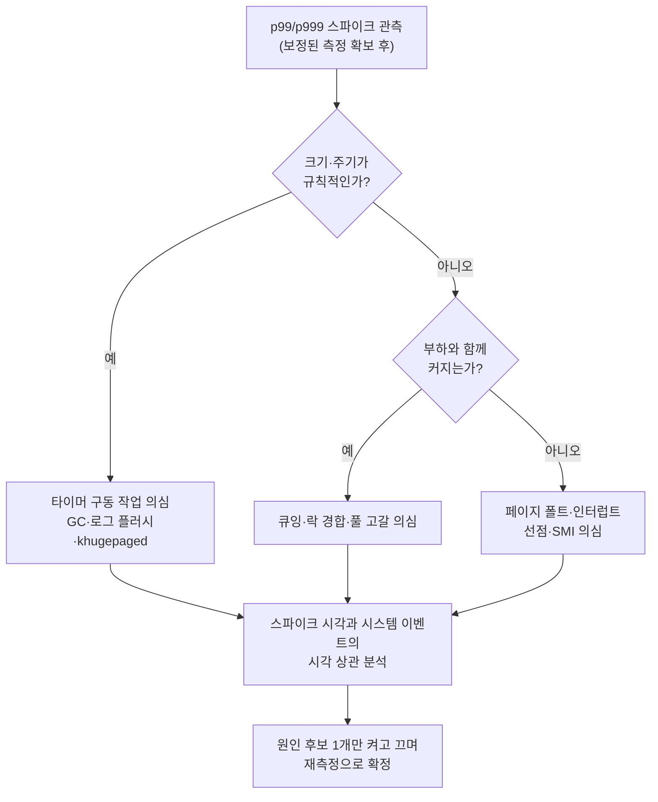

**Tail Latency(꼬리 지연) 분석**이란 지연시간 분포의 오른쪽 끝 — p95, p99, p999 같은 상위 백분위(percentile) — 를 정확히 측정하고, 그 꼬리를 만드는 원인을 시스템 이벤트 단위로 분해하는 기법입니다. 평균 지연이 5µs인 서비스도 1,000번에 한 번 20ms씩 멈춘다면, 사용자가 체감하는 것은 평균이 아니라 그 20ms입니다. 더 나쁜 것은, 순진하게 짠 측정 코드가 바로 그 20ms를 **기록에서 빠뜨리는** 경향이 있다는 점입니다. 이 장은 백분위를 올바르게 읽는 법, 측정이 거짓말하는 대표적 메커니즘인 coordinated omission과 그 해독제인 HdrHistogram, 그리고 꼬리를 만드는 원인(페이지 폴트·경합·인터럽트·백그라운드 작업)을 좁혀 가는 분해 전략을 다룹니다.

## 이 장을 읽기 전에

**선행 지식**: [이 트랙 인트로](/post/profiling-analysis/getting-started-profiling-performance-analysis-fundamentals/)의 측정→가설→검증 루프와, [Microbenchmark 설계 원칙](/post/profiling-analysis/microbenchmark-design-principles/)에서 다룬 노이즈 통제 개념을 전제합니다. 직전 장인 [하드웨어 성능 카운터](/post/profiling-analysis/hardware-performance-counters/)를 읽었다면 "스파이크의 원인을 카운터로 확인한다"는 마지막 절이 더 자연스럽게 연결됩니다.

**이 장의 깊이**: 심화 난이도입니다. 백분위의 통계적 의미부터 시작하지만, 후반부는 µs 단위 시스템에서 p999 스파이크의 원인을 실제로 추적해 본 경험이 있어야 온전히 소화되는 내용입니다.

**다루지 않는 것**: 신뢰 구간·유의성 검정 등 벤치마크 결과의 통계적 비교는 [다음 장(통계적 벤치마킹)](/post/profiling-analysis/statistical-benchmarking/)이 담당합니다. perf 명령의 상세 사용법은 [Linux perf 고급](/post/profiling-analysis/linux-perf-advanced/), 커널 이벤트를 동적으로 후킹하는 방법은 [BPF 기반 동적 프로파일링](/post/profiling-analysis/bpf-based-profiling-bpftrace-bcc/), 분산 시스템에서 꼬리 지연 요청을 추적하는 방법은 [분산 트레이싱 오버헤드와 µs 탐지](/post/profiling-analysis/distributed-tracing-microsecond-overhead/)로 위임합니다.

## 당신의 수준에 맞는 경로

| 수준 | 읽을 부분 | 핵심 목표 |
|------|---------|---------|
| **중급자** | "백분위 분포 해석" ~ "Coordinated Omission" | 평균이 아닌 분포로 지연을 읽고, 측정 코드의 CO 함정을 식별 |
| **심화** | "HdrHistogram" ~ "원인과 분해 전략" | 보정된 히스토그램 기록과 스파이크 원인 분해 절차 체득 |
| **전문가** | "판단 기준" ~ "비판적 시각" | 어느 백분위를 SLO로 삼을지, 보정의 한계는 무엇인지 판단 |

---

## 꼬리 지연이 문제로 정의되기까지 (역사·배경)

꼬리 지연이 독립된 연구 주제로 자리 잡은 계기는 Jeffrey Dean과 Luiz André Barroso가 2013년 Communications of the ACM에 발표한 ["The Tail at Scale"](https://research.google/pubs/the-tail-at-scale/)입니다. 이 논문은 Google 규모의 분산 시스템에서 개별 서버의 드문 지연 스파이크가 팬아웃(fan-out)을 거치며 어떻게 전체 요청의 지배적 특성이 되는지를 정량적으로 보였고, "지연 변동성은 제거할 수 없으니 tail-tolerant하게 설계하라"는 관점을 제시했습니다. µs 단위 단일 노드 최적화를 하는 입장에서도 이 논문의 산수는 중요합니다 — 내 컴포넌트의 p99가 상위 시스템에서는 p50으로 증폭될 수 있기 때문입니다.

측정 방법론 쪽의 전환점은 Azul Systems의 CTO Gil Tene입니다. 그는 2010년대 초반 부하 생성기 대부분이 서버가 멈춘 구간의 요청을 아예 발행하지 않아 최악의 표본을 체계적으로 누락한다는 사실을 지적하고 이 현상에 **coordinated omission**이라는 이름을 붙였으며, [QCon 2015 발표 "How NOT to Measure Latency"](https://www.infoq.com/presentations/latency-response-time/)로 널리 알렸습니다. 그가 만든 [HdrHistogram](https://github.com/HdrHistogram/HdrHistogram_c)(2012년경 Java로 시작, 이후 C/C++/Rust 등으로 포팅)은 넓은 동적 범위의 지연 값을 고정 메모리·상수 시간으로 기록하는 자료구조이고, [wrk2](https://github.com/giltene/wrk2)(2014)는 CO를 피하는 고정 처리율(constant throughput) 부하 생성기의 참조 구현입니다.

## 백분위 분포 해석: p95/p99/p999

지연시간은 정규분포를 따르지 않습니다. 캐시 적중/미스, 락 획득 성공/대기, 페이지 폴트 유무 같은 이산적 사건들이 겹치면서 분포는 다봉(multimodal)이고 오른쪽으로 두꺼운 꼬리(heavy tail)를 가집니다. 그래서 평균과 표준편차는 이 분포를 요약하는 데 거의 쓸모가 없고, "요청의 99%가 X µs 이내에 끝났다"는 백분위 서술이 표준이 됩니다. pN은 정렬된 표본에서 N% 지점의 값이며, p999는 p99.9(1,000건 중 상위 1건의 경계)를 뜻하는 관용 표기입니다.

백분위를 읽을 때 첫 번째로 확인할 것은 **표본 수**입니다. p99.9는 표본 1,000개당 경계 위쪽에 겨우 1개가 놓이는 통계량이므로, 표본 10,000개로 추정한 p99.9는 상위 10개 값에 좌우되는 매우 불안정한 숫자입니다. 경험적으로 목표 백분위의 초과 확률(1−p) 역수의 100배 이상 — p99.9라면 10^5개 이상 — 의 표본을 모으기 전에는 그 값으로 개선/회귀를 판정하지 않는 것이 안전합니다. 표본이 부족한 상태에서 두 p999 값을 비교하는 것이 왜 위험한지, 어떤 검정으로 보완하는지는 [통계적 벤치마킹](/post/profiling-analysis/statistical-benchmarking/)에서 다룹니다.

두 번째는 **팬아웃 증폭**입니다. "The Tail at Scale"의 예시를 옮기면, 개별 서버가 100번에 1번(1%)만 1초 이상 느려지는 경우에도 한 사용자 요청이 그런 서버 100대의 응답을 모두 기다려야 한다면 전체 요청의 63%(1 − 0.99^100)가 1초를 넘깁니다. 즉 하위 컴포넌트의 p99는 상위 시스템에서 중앙값 근처로 올라옵니다. 단일 함수의 마이크로벤치마크에서 p99 스파이크를 "1%짜리 문제"로 치부하면 안 되는 산술적 이유입니다.

세 번째는 **백분위는 평균낼 수 없다**는 점입니다. 서버 10대의 p99를 산술평균한 값이나, 1분 창(window)별 p99를 평균한 값은 어떤 분포의 백분위도 아닙니다. 여러 소스의 지연을 합산하려면 원시 표본 또는 병합 가능한 히스토그램(아래 HdrHistogram)을 합친 뒤 그 합본에서 백분위를 다시 계산해야 합니다.

## Coordinated Omission: 측정이 거짓말하는 방식

coordinated omission(조율된 누락)은 부하 생성기나 측정 루프가 **시스템이 느려진 바로 그 순간에 표본 수집을 함께 멈추는** 현상입니다. 전형적인 측정 루프는 "요청 전송 → 응답 대기 → 소요 시간 기록 → 다음 요청"의 동기 구조인데, 서버가 20ms 멈추면 그동안 보냈어야 할 요청 수백 개가 발행조차 되지 않습니다. 그 요청들이 겪었을 대기 시간은 기록에서 통째로 빠지고, 스톨 구간의 표본은 단 1개(멈춤을 직접 맞은 요청)만 남습니다. 측정자가 서버의 스톨과 "조율해서" 나쁜 표본을 누락시키는 셈이라 이런 이름이 붙었습니다.

아래는 이 현상을 격리 재현하는 자체 완결 프로그램입니다. 서비스는 대부분 5µs에 끝나지만 1,000번에 1번 20ms 스톨을 일으키고, 부하 생성기는 100µs 간격으로 요청을 보내려고 합니다. `naive`는 실제 발행 시각 기준(전형적인 깨진 측정)이고, `corrected`는 의도된 발행 스케줄 기준(올바른 측정)입니다.

```cpp
// g++ -O2 -std=c++17 co_demo.cpp -o co_demo && ./co_demo
#include <algorithm>
#include <chrono>
#include <cstdint>
#include <cstdio>
#include <thread>
#include <vector>

using Clock = std::chrono::steady_clock;

void spin_service(int i) {  // 1,000번에 1번 20ms 스톨을 흉내 내는 서비스
  auto until = Clock::now() + (i % 1000 == 999 ? std::chrono::microseconds(20000)
                                               : std::chrono::microseconds(5));
  while (Clock::now() < until) { /* busy-wait */ }
}

int main() {
  constexpr auto interval = std::chrono::microseconds(100);  // 의도한 발행 주기
  constexpr int n = 20000;
  std::vector<int64_t> naive, corrected;
  auto intended = Clock::now();  // 이번 요청이 "보내졌어야 할" 시각
  for (int i = 0; i < n; ++i) {
    auto issued = Clock::now();  // 실제 발행 시각: 이전 응답이 끝난 뒤에야 도달
    spin_service(i);
    auto done = Clock::now();
    naive.push_back(std::chrono::duration_cast<std::chrono::microseconds>(done - issued).count());
    corrected.push_back(std::chrono::duration_cast<std::chrono::microseconds>(done - intended).count());
    intended += interval;  // 스케줄은 서버 스톨과 무관하게 전진한다
    if (Clock::now() < intended) std::this_thread::sleep_until(intended);
  }
  auto pct = [](std::vector<int64_t> v, double p) {
    std::sort(v.begin(), v.end());
    return v[static_cast<size_t>(p / 100.0 * (v.size() - 1))];
  };
  std::printf("percentile   naive(us)  corrected(us)\n");
  for (double p : {50.0, 99.0, 99.9})
    std::printf("p%-10g %9lld %14lld\n", p, (long long)pct(naive, p), (long long)pct(corrected, p));
}
```

`spin_service`는 스톨을 결정적으로 재현하려고 busy-wait를 쓰므로 코어 하나를 점유합니다 — 유휴 코어가 있는 머신에서 돌리고, 절대 수치보다 두 열의 **차이**에 주목하세요. 제 환경(Linux, x86-64, GCC 13, `-O2`) 기준 출력 형태는 다음과 같고, 수치는 플랫폼·부하에 따라 달라집니다.

```text
percentile   naive(us)  corrected(us)
p50                  6              9
p99                  7          16210
p99.9            19987          19960
```

해석하면, naive 측정은 p99가 7µs라고 보고합니다 — 20ms 스톨이 1,000번에 1번(0.1%)만 발생했으니 p99에는 안 잡힌다는 논리입니다. 그러나 corrected 열은 p99가 약 16ms임을 보여줍니다. 스톨 1번이 그 뒤에 예정돼 있던 요청 200개(20ms ÷ 100µs)를 연쇄적으로 지연시키므로, 100µs 간격으로 도착하는 실제 클라이언트 관점에서는 전체 요청의 약 20%가 밀린 대기를 겪기 때문입니다. naive 측정은 이 대기를 존재하지 않는 것으로 만듭니다. 이것이 "부하 테스트에서는 p99가 좋았는데 프로덕션 p99는 나쁘다"는 흔한 미스터리의 정체 중 하나입니다.

교정 방법은 세 층위가 있습니다. 첫째, **부하 생성 자체를 고정 처리율로**: 이전 응답과 무관하게 스케줄대로 요청을 발행(비동기·다중 연결)하고 지연을 의도된 발행 시각부터 잽니다. wrk2가 이 방식의 참조 구현입니다.

> "wrk2 is wrk modified to produce a constant throughput load, and accurate latency details to the high 9s." — Gil Tene, [wrk2 README](https://github.com/giltene/wrk2) (2014)

둘째, **기록 시점 보정**: 동기 루프를 못 바꾸는 상황이라면, 기대 간격(expected interval)보다 큰 표본이 관측될 때 그 사이에 있었어야 할 가상 표본들을 히스토그램에 함께 채워 넣습니다. HdrHistogram이 이 보정을 API로 제공합니다(아래 절). 셋째, **서버 측 측정 병행**: 클라이언트 측정은 CO 외에도 네트워크·클라이언트 스케줄링 노이즈를 포함하므로, 서버 내부 타임스탬프 기반 측정과 교차 검증합니다. 프로덕션에서 이를 상시화하는 방법은 [지속적 프로파일링](/post/profiling-analysis/continuous-profiling-production/) 장의 몫입니다.

## HdrHistogram: 꼬리를 기록하는 자료구조

꼬리를 보려면 표본을 많이, 오래, 싸게 모아야 합니다. 원시 표본을 전부 배열에 쌓으면 메모리가 표본 수에 비례해 자라고 백분위 계산마다 정렬이 필요하며, 고정 폭 버킷 히스토그램은 1µs~1시간처럼 동적 범위가 넓은 지연 값에서 꼬리 해상도가 무너집니다. **HdrHistogram(High Dynamic Range Histogram)**은 로그 스케일로 버킷 크기를 늘리되 각 구간 안에서는 선형 세분화를 두는 log-linear 버킷 구조로, 지정한 유효숫자(1~5자리)의 상대 오차를 전체 범위에서 보장하면서 기록을 상수 시간·고정 메모리로 처리합니다. 값 범위와 유효숫자를 정하면 메모리 사용량이 그 자리에서 결정되고(수 KB~수 MB), 히스토그램끼리 병합이 가능해 "백분위는 평균낼 수 없다" 문제의 실용적 해법이 됩니다.

C/C++ 프로젝트에서는 공식 C 포트인 [HdrHistogram_c](https://github.com/HdrHistogram/HdrHistogram_c)를 씁니다. 아래는 1µs~1시간 범위를 유효숫자 3자리로 기록하면서, 동기 측정 루프의 CO를 `hdr_record_corrected_value`로 보정하는 최소 예제입니다.

```cpp
// git clone https://github.com/HdrHistogram/HdrHistogram_c && cd HdrHistogram_c
// cmake -B build -DCMAKE_BUILD_TYPE=Release && cmake --build build && sudo cmake --install build
// g++ -O2 -std=c++17 hdr_demo.cpp -lhdr_histogram -o hdr_demo
#include <hdr/hdr_histogram.h>
#include <cstdint>
#include <cstdio>

int main() {
  hdr_histogram* h = nullptr;
  hdr_init(1, INT64_C(3600000000), 3, &h);  // 1µs ~ 1시간(µs 단위), 유효숫자 3자리

  const int64_t expected_interval_us = 100;  // 의도한 발행 주기
  int64_t sample_us[] = {5, 6, 5, 20000, 7};  // 실측 지연(동기 루프에서 수집됐다고 가정)
  for (int64_t v : sample_us) {
    // v가 expected_interval보다 크면, 누락됐을 가상 표본
    // (v-100, v-200, ...)을 함께 기록해 CO를 보정한다.
    hdr_record_corrected_value(h, v, expected_interval_us);
  }

  std::printf("p50  = %lld us\n", (long long)hdr_value_at_percentile(h, 50.0));
  std::printf("p99  = %lld us\n", (long long)hdr_value_at_percentile(h, 99.0));
  std::printf("p999 = %lld us\n", (long long)hdr_value_at_percentile(h, 99.9));
  std::printf("max  = %lld us, mem = %zu bytes\n", (long long)hdr_max(h), hdr_get_memory_size(h));
  hdr_close(h);
}
```

`hdr_record_corrected_value`의 보정은 "측정 루프가 고정 주기로 돌고 있었다"는 모델을 가정한 **근사**입니다 — 실제로 발행되지 않은 요청의 지연을 만들어 넣는 것이므로, 고정 처리율 부하 생성(wrk2 방식)이 가능하다면 그쪽이 항상 더 정확합니다. 또한 기록 값의 상대 오차가 유효숫자 설정(위 예에서는 0.1%)만큼 존재하므로, 두 히스토그램의 p999가 0.05% 차이 난다고 개선을 주장할 수는 없습니다.

## 꼬리 지연의 원인과 분해 전략

측정이 정직해졌다면 다음 질문은 "꼬리는 어디서 오는가"입니다. µs 단위 시스템에서 반복적으로 등장하는 원인은 몇 가지 계열로 정리됩니다. **런타임 계열**: GC 일시정지(JVM·Go 사이드카나 인접 프로세스 포함), malloc의 아레나 잠금·매핑 반환, 지연 초기화가 첫 요청에 몰리는 콜드 패스. **메모리 계열**: minor/major 페이지 폴트, Transparent Huge Page의 compaction·khugepaged 스톨, 스왑, NUMA 원격 접근. **경합 계열**: 락 컨보이, 공유 캐시라인(false sharing), 큐 포화 시의 대기. **OS·하드웨어 계열**: 타이머·네트워크 인터럽트와 softirq, 스케줄러 선점과 코어 마이그레이션, cpufreq 전환, TLB shootdown, 펌웨어가 일으키는 SMI(System Management Interrupt). 각 원인의 상세 메커니즘과 제거 기법은 해당 전문 트랙의 몫이고, 이 장의 관심사는 **관측된 스파이크를 이 후보들 중 하나로 좁히는 절차**입니다.

분해의 첫 단계는 스파이크의 **시그니처**를 읽는 것입니다. 크기가 일정하고 주기가 규칙적이면 타이머 구동 작업(GC, 로그 플러시, cron, khugepaged)을, 부하가 오를 때만 나타나면 큐잉과 경합을, 부하와 무관하게 산발적이면 페이지 폴트·인터럽트·SMI 계열을 먼저 의심합니다. 다음 단계는 **시각 상관(temporal correlation)**입니다 — 요청별 타임스탬프 로그에서 스파이크 발생 시각을 뽑고, 같은 시각의 시스템 이벤트(컨텍스트 스위치, 폴트, 인터럽트)를 겹쳐 봅니다.



시각 상관의 가장 가벼운 도구는 이벤트 카운터의 전후 비교입니다. 스파이크가 재현되는 구간을 사이에 두고 폴트·스위치 수를 재면 어느 계열인지 1차 판별이 됩니다.

```bash
# 스파이크 재현 구간 동안 원인 계열별 카운터 수집 (상세는 Linux perf 고급 장 참조)
perf stat -e task-clock,context-switches,cpu-migrations,minor-faults,major-faults \
  -p "$(pgrep -x my_server)" -- sleep 10
```

```text
      10,001.23 msec task-clock        #    1.000 CPUs utilized
          1,842      context-switches  #  184.2 /sec
             12      cpu-migrations    #    1.2 /sec
          9,310      minor-faults      #  930.9 /sec
              3      major-faults      #    0.3 /sec
```

이 출력에서 major-faults가 0이 아니라는 것은 디스크 I/O를 동반한 페이지 폴트가 요청 경로 어딘가에서 일어난다는 뜻이고(mlock·사전 폴트 검토 대상), 초당 930건의 minor-faults는 핫패스에서 새 페이지를 계속 만지고 있음(할당기 동작 검토 대상)을 시사합니다. 여기서 "어떤 스택이 폴트를 일으켰는가"로 내려가려면 [Linux perf 고급](/post/profiling-analysis/linux-perf-advanced/)의 이벤트별 샘플링, 오프-CPU 시간까지 포함해 "느린 그 요청"이 어디서 기다렸는지 보려면 [BPF 기반 동적 프로파일링](/post/profiling-analysis/bpf-based-profiling-bpftrace-bcc/), Windows라면 [Windows ETW 성능 분석](/post/profiling-analysis/windows-etw-performance-analysis/)으로 이어집니다. 마이크로아키텍처 레벨(캐시 미스·TLB) 확인은 [하드웨어 성능 카운터](/post/profiling-analysis/hardware-performance-counters/) 장의 도구를 그대로 씁니다.

마지막 단계는 **격리 재측정**입니다. 후보 원인을 하나만 끄거나(예: THP를 `madvise`로 제한, IRQ affinity 이동, 할당기 교체) 켠 상태로 같은 측정을 반복해, 꼬리 백분위가 유의미하게 움직이는지 확인합니다. 한 번에 한 변수만 바꾸는 원칙은 [Microbenchmark 설계 원칙](/post/profiling-analysis/microbenchmark-design-principles/)과 동일하며, "유의미하게"의 판정은 다음 장의 통계 도구가 제공합니다.

## 흔한 오개념 교정

**"평균과 표준편차면 충분하다."** 지연 분포는 다봉·heavy tail이라 평균은 어떤 실제 요청의 경험도 대표하지 않고, 표준편차는 정규성 가정 없이는 해석이 곤란합니다. 평균 5µs·p999 20ms인 시스템과 평균 8µs·p999 40µs인 시스템 중 low-latency 관점의 승자는 대개 후자입니다. 요약 통계가 필요하면 p50/p99/p999/max의 묶음을 쓰세요.

**"백분위는 집계 구간·서버끼리 평균내면 된다."** 창별 p99의 평균, 서버별 p99의 평균은 수학적으로 아무 백분위도 아니며, 대개 실제 전역 p99를 심하게 과소평가합니다. 병합 가능한 히스토그램을 합친 뒤 재계산하는 것이 유일하게 올바른 집계입니다.

**"p99는 사용자 1%만 겪는 문제다."** 한 사용자 세션이 요청 수십~수백 개로 구성되고 한 요청이 여러 컴포넌트로 팬아웃되는 순간, 개별 p99를 건드릴 확률은 사용자 단위에서 급격히 누적됩니다(1 − 0.99^100 ≈ 63%). p99는 "1%의 문제"가 아니라 "거의 모든 사용자가 세션 중 한 번은 겪는 경험"에 가깝습니다.

**"타임아웃 난 요청은 통계에서 빼면 된다."** 타임아웃·에러 표본 제외는 CO와 같은 방향의 왜곡 — 가장 나쁜 표본의 선택적 삭제 — 입니다. 타임아웃은 최소한 타임아웃 값 이상의 지연으로 기록하거나 별도 비율로 함께 보고해야 분포가 정직해집니다.

## 판단 기준

| 상황 | 권장 | 이유 |
|------|------|------|
| SLO 대상 백분위 선택 | 트래픽×팬아웃으로 사용자 체감 확률을 계산해 결정 | p99/p999는 팬아웃에 따라 체감 빈도가 달라짐 |
| p999 판정에 필요한 표본 | 최소 10^5개, 가능하면 그 이상 | 상위 소수 표본에 좌우되는 통계량 |
| 동기 루프 측정 | HdrHistogram 보정 기록 또는 고정 처리율 발행으로 교체 | CO로 꼬리가 통째로 누락됨 |
| 부하 테스트 도구 선택 | 고정 처리율 모드(wrk2 계열) 지원 여부 확인 | "최대 처리량 모드"는 CO를 내장 |
| 여러 소스의 지연 집계 | 히스토그램 병합 후 백분위 재계산 | 백분위의 평균은 무의미 |
| 스파이크 원인 탐색 | 시그니처(주기성·부하 상관) → 시각 상관 → 격리 재측정 순서 | 도구부터 잡으면 후보가 좁혀지지 않음 |
| max 값 취급 | 버리지 말고 항상 함께 보고 | 꼬리의 끝은 max가 유일하게 보여줌 |

## 비판적 시각: 한계와 트레이드오프

**보정은 모델이지 관측이 아닙니다.** `hdr_record_corrected_value`는 고정 주기 가정 아래 가상 표본을 합성합니다. 실제 트래픽이 버스트·재시도·백오프를 포함하면 이 가정은 어긋나고, 보정치는 실제보다 나쁘게도 좋게도 치우칠 수 있습니다. 반대로 "고정 처리율이 진짜 워크로드냐"는 반문도 성립합니다 — 실사용 클라이언트는 느려진 서버에 요청을 덜 보내기도 하므로(배압), 어떤 발행 모델이 사용자 경험을 대표하는지는 시스템마다 별도로 논증해야 합니다.

**꼬리 추격에는 한계 효용이 있습니다.** p999를 100µs에서 50µs로 깎는 비용(코어 격리, 메모리 고정, 커널 튜닝)은 p50을 개선하는 비용보다 훨씬 가파르게 오릅니다. 네트워크 왕복이 수 ms인 서비스에서 서버 내부 p999 50µs는 사용자에게 보이지 않을 수 있습니다. Dean과 Barroso가 강조했듯 규모가 커지면 변동성 제거가 아니라 헤징(hedged request 등) 같은 tail-tolerant 설계가 더 싼 해법일 수 있고, 그 층위의 선택은 이 트랙의 범위 밖입니다.

**백분위 SLO는 게이밍이 가능합니다.** p99만 목표로 잡으면 상위 1%를 의도적으로 포기하는 최적화(셰딩·타임아웃 조기 반환)가 지표를 개선시킵니다. 그래서 성숙한 팀은 p99와 함께 p999·max·에러율을 묶어 봅니다. 또한 측정 자체의 오버헤드 — 타임스탬프 수집, 히스토그램 기록, 로그 — 가 µs 시스템에서는 꼬리를 만들 수 있다는 점도 잊으면 안 됩니다. HdrHistogram 기록은 수십 ns 수준으로 싸지만, 요청별 로깅은 그렇지 않습니다.

## 마무리

이 장의 달성 목표를 스스로 점검해 보세요.

- [ ] 평균·표준편차 대신 p50/p99/p999/max 묶음으로 지연을 서술하고, 각 백분위에 필요한 표본 수를 말할 수 있다.
- [ ] 팬아웃 산수(1 − p^n)로 컴포넌트 백분위가 시스템 체감으로 증폭되는 정도를 계산할 수 있다.
- [ ] 동기 측정 루프에서 coordinated omission이 발생하는 메커니즘을 코드 수준에서 설명하고, 고정 처리율 발행·보정 기록 중 적절한 교정을 고를 수 있다.
- [ ] HdrHistogram의 log-linear 구조가 왜 넓은 동적 범위·고정 메모리·병합 가능성을 동시에 주는지 설명할 수 있다.
- [ ] 스파이크의 시그니처(주기성·부하 상관)로 원인 계열을 좁히고, 시각 상관과 격리 재측정으로 확정하는 절차를 수행할 수 있다.

**다음 장에서는** [통계적 벤치마킹](/post/profiling-analysis/statistical-benchmarking/)을 다룹니다. 이 장에서 "표본이 부족한 p999로 판정하지 말라"고 미뤄 둔 질문 — 두 측정의 차이가 노이즈인지 진짜 개선인지 — 를 신뢰 구간과 유의성 검정으로 답합니다. 꼬리를 정직하게 기록하는 법(이 장)과 그 기록을 비교하는 법(다음 장)이 합쳐져야 "개선했다"는 주장이 완성됩니다.
