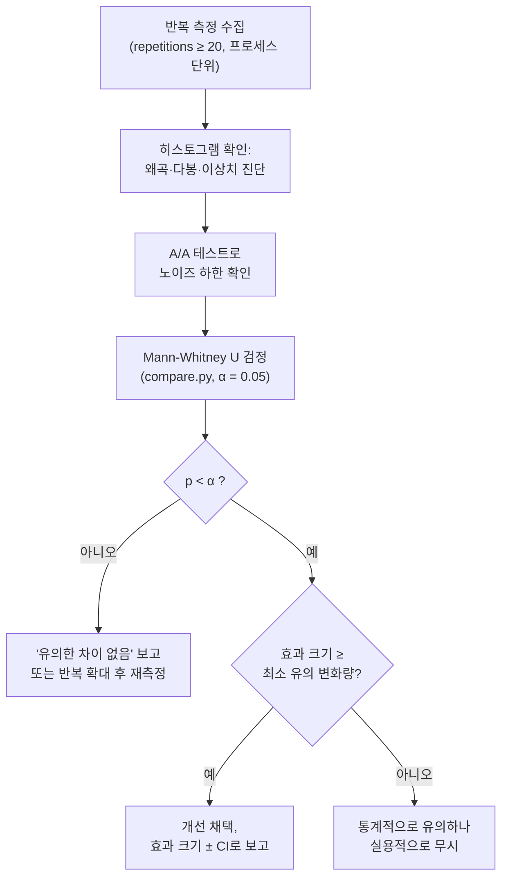

**통계적 벤치마킹(statistical benchmarking)**이란 벤치마크 실행 결과를 "1234 ns"라는 단일 숫자가 아니라 **확률 분포에서 뽑은 표본**으로 취급하고, 두 버전의 차이가 노이즈로 설명되는지 아닌지를 통계적 절차로 판정하는 방법론입니다. µs 단위 최적화에서 이것이 필수인 이유는 간단합니다. 3% 개선을 주장하고 싶은데 실행 간 변동(run-to-run variance)이 5%라면, 한 번씩 돌려 비교한 숫자는 동전 던지기와 다를 바 없기 때문입니다. 이 장은 [Microbenchmark 설계 원칙](/post/profiling-analysis/microbenchmark-design-principles/)에서 노이즈를 **줄이는** 법을 배운 뒤에도 남는 변동을 **다루는** 법 — 분포와 이상치 해석, 신뢰 구간, Mann-Whitney U 검정 같은 유의성 검정, 최소 유의 변화량 설정, 반복 횟수 설계 — 을 다룹니다.

## 이 장을 읽기 전에

**선행 챕터**: [Microbenchmark 설계 원칙](/post/profiling-analysis/microbenchmark-design-principles/)에서 다룬 노이즈 통제(CPU 고정, 주파수 고정, 워밍업)와 [Google Benchmark 실전](/post/profiling-analysis/google-benchmark-practical/)의 기본 사용법을 전제로 합니다. 통계 지식은 고등학교 수준(평균·중앙값·표준편차)이면 출발할 수 있고, 필요한 개념은 본문에서 정의합니다.

**이 장의 깊이**: 심화. 검정 이론을 수학적으로 유도하지 않고, "벤치마크 데이터에 어떤 통계 도구를 왜 골라야 하는가"라는 실무 판단에 집중합니다.

**다루지 않는 것**: p99·p999 같은 꼬리 지연 백분위 해석은 [Tail Latency 분석](/post/profiling-analysis/tail-latency-analysis/)이 담당합니다. 이 장의 통계를 CI 게이트와 프로덕션 트래픽 실험에 연결하는 일은 각각 [지속적 프로파일링](/post/profiling-analysis/continuous-profiling-production/)과 [성능 A/B 테스트 방법론](/post/profiling-analysis/performance-ab-testing/)에서 다룹니다.

## 당신의 수준에 맞는 경로

| 수준 | 읽을 부분 | 핵심 목표 |
|------|---------|---------|
| **중급자** | "벤치마크 분포는 정규분포가 아니다" ~ "신뢰 구간" | 평균±표준편차 요약이 왜 오도하는지 이해하고 중앙값+신뢰 구간으로 전환 |
| **심화** | "유의성 검정" ~ "반복 횟수 설계" | compare.py의 U 검정 출력을 해석하고 반복 횟수를 근거 있게 정함 |
| **전문가** | "흔한 오개념" ~ "비판적 시각" | 효과 크기·최소 유의 변화량 기준을 팀 표준으로 설계 |

---

## 역사·배경: 양조장에서 벤치마크 CI까지

벤치마크 통계의 뿌리는 성능 공학이 아니라 품질 관리에 있습니다. 1908년 기네스(Guinness) 양조장의 화학자 윌리엄 고셋(William Sealy Gosset)이 "Student"라는 필명으로 발표한 t-분포는 **작은 표본으로 평균 차이를 판정하는** 최초의 실용적 도구였고, 오늘날까지 t-검정이라는 이름으로 쓰입니다. 그러나 t-검정은 데이터가 정규분포에 가깝다는 가정에 기대는데, 뒤에서 보듯 벤치마크 시간 분포는 이 가정을 대체로 위반합니다. 이 문제를 우회하는 비모수(non-parametric) 검정이 1945년 프랭크 윌콕슨(Frank Wilcoxon)의 순위합 검정과 1947년 헨리 맨(Henry Mann)·도널드 휘트니(Donald Whitney)의 U 통계량으로 정립되었습니다. 두 검정은 수학적으로 동등하며, 데이터의 값 대신 **순위(rank)**만 사용하므로 분포 모양에 대한 가정이 거의 없습니다.

이 고전 통계가 시스템 성능 측정과 정면으로 만난 계기는 2009년 Mytkowicz 등의 ASPLOS 논문 "Producing Wrong Data Without Doing Anything Obviously Wrong!"입니다. 이들은 링크 순서나 환경 변수 크기 같은 무관해 보이는 요인이 SPEC 벤치마크 결과를 수 퍼센트씩 흔들어, 잘못된 결론(측정 편향, measurement bias)으로 이어질 수 있음을 보였습니다. 2020년 Kalibera와 Jones는 프로그래밍 언어 분야 논문 다수가 측정 불확실성을 보고하지 않음을 지적하고, **효과 크기 신뢰 구간(effect size confidence interval)** — "A가 B보다 5.5% ± 2.5% 빠르다(95% 신뢰)" 형식 — 을 표준 보고 방식으로 제안했습니다([arXiv:2007.10899](https://arxiv.org/abs/2007.10899)). 참고로 두 사람이 2013년에 먼저 발표한 논문 "Rigorous Benchmarking in Reasonable Time"(OOPSLA/ISMM)은 다층 랜덤화와 회귀 벤치마킹으로 측정 편향을 억제하는 별개의 방법론을 다룹니다. 2016년 Chen과 Revels는 Julia의 BenchmarkTools를 설계하며 노이즈 환경에서 강건한 추정 전략을 정리했고([arXiv:1608.04295](https://arxiv.org/abs/1608.04295)), 2019년 Laurence Tratt는 최소값 요약의 위험을 반례로 보였습니다([Minimum Times Tend to Mislead When Benchmarking](https://tratt.net/laurie/blog/2019/minimum_times_tend_to_mislead_when_benchmarking.html)). 오늘날 Google Benchmark의 `compare.py`가 Mann-Whitney U 검정을 기본 판정 도구로 내장한 것은 이 논쟁들이 도구에 수렴한 결과입니다.

## 벤치마크 분포는 정규분포가 아니다

통계 교과서의 기본 도구(평균, 표준편차, t-검정)는 대부분 정규분포 또는 대칭 분포를 가정합니다. 그런데 실행 시간 분포에는 구조적인 비대칭이 있습니다. 코드에는 캐시가 전부 적중하고 인터럽트가 없을 때 도달하는 **물리적 하한**이 존재하는 반면, 위쪽으로는 컨텍스트 스위치·인터럽트·페이지 폴트·주파수 전환·SMT 간섭 같은 노이즈가 **더해지기만** 합니다. 결과적으로 분포는 하한 근처에 몸통이 있고 오른쪽으로 긴 꼬리가 뻗은 **우측 왜곡(right-skewed)** 형태가 되며, CPU 마이그레이션이나 터보 상태 변화가 끼면 봉우리가 여러 개인 **다봉(multimodal)** 분포도 흔합니다.

이 모양이 함의하는 바는 세 가지입니다. 첫째, **평균은 꼬리에 끌려 올라가므로** "전형적인 실행"을 대표하지 못하고, 표준편차는 비대칭 분포에서 ±로 대칭 해석하면 오도합니다. 둘째, 요약 통계를 보기 전에 **히스토그램부터 그려야** 합니다. 다봉 분포에서 중앙값 하나만 보면 두 모드 사이의 무의미한 값을 얻을 수 있고, 다봉이라는 사실 자체가 "벤치마크 환경이 두 상태를 오간다"는 진단 신호입니다(원인 통제는 [Microbenchmark 설계 원칙](/post/profiling-analysis/microbenchmark-design-principles/) 참조). 셋째, 이상치(outlier)를 기계적으로 제거하면 안 됩니다. 마이크로벤치마크에서 외부 인터럽트로 튄 값은 제거할 노이즈지만, 실제 워크로드에서 주기적으로 나타나는 느린 실행은 사용자도 겪는 신호이며 이는 [Tail Latency 분석](/post/profiling-analysis/tail-latency-analysis/)의 영역입니다. "이 이상치는 내 코드 밖에서 왔다"고 설명할 수 있을 때만 제거하고, 제거 기준(예: median의 5배 초과)을 보고서에 명시하는 것이 원칙입니다.

위치 추정량(location estimator) 선택도 분포 모양에서 따라 나옵니다. **중앙값(median)**은 꼬리에 강건해 기본 선택지로 적합합니다. **최소값(minimum)**은 "노이즈는 항상 양수로 더해진다"는 가정 아래 코드의 순수 비용을 가장 잘 근사한다는 입장(Chen & Revels)이 있지만, 해시 시드나 메모리 배치처럼 프로그램에 **내재한** 비결정성이 있으면 최소값은 실사용에서 거의 나오지 않는 운 좋은 실행만 보여준다는 반론(Tratt)이 있습니다. 절충은 이렇습니다 — 입력·배치가 완전히 고정된 순수 CPU 마이크로벤치마크에서는 최소값이 유용한 하한 정보이고, 그 외에는 중앙값을 주 지표로, 최소값과 p90을 보조 지표로 함께 보고합니다.

## 신뢰 구간: 숫자 하나 대신 범위를 보고하기

중앙값 1420 ns라는 점 추정(point estimate)은 "다시 20번 측정하면 얼마나 다른 값이 나올 수 있는가"를 말해주지 않습니다. **신뢰 구간(confidence interval, CI)**은 이 불확실성을 범위로 표현합니다. 95% 신뢰 구간의 정확한 의미는 "같은 절차를 반복하면 구간의 95%가 참값을 포함한다"이며, "참값이 이 구간에 있을 확률이 95%"라는 직관적 해석과는 미묘하게 다르지만 실무 판단에는 "구간이 넓으면 측정이 불안정하고, 두 버전의 구간이 크게 겹치면 차이를 주장하기 어렵다"는 독법으로 충분합니다.

교과서의 t-기반 구간(평균 ± t × 표준오차)은 정규성 가정 때문에 벤치마크 데이터에 잘 맞지 않습니다. 실무 표준은 **부트스트랩(bootstrap)**입니다. 관측한 n개 표본에서 복원 추출로 n개를 다시 뽑아 중앙값을 계산하는 일을 수천 번 반복하면 중앙값의 분포가 생기고, 그 2.5%·97.5% 백분위가 95% 신뢰 구간이 됩니다. 분포 모양에 대한 가정이 없고 중앙값·p90 등 어떤 통계량에도 적용된다는 것이 장점입니다. 아래는 벤치마크 JSON에서 뽑은 반복 측정값에 그대로 적용할 수 있는 구현입니다.

```python
import numpy as np

def bootstrap_median_ci(samples, n_boot=10_000, level=0.95, seed=42):
    """반복 측정값 배열에서 중앙값의 부트스트랩 신뢰 구간을 계산한다."""
    rng = np.random.default_rng(seed)
    samples = np.asarray(samples, dtype=float)
    boot = np.empty(n_boot)
    for i in range(n_boot):
        boot[i] = np.median(rng.choice(samples, size=len(samples), replace=True))
    lo, hi = np.percentile(boot, [(1 - level) / 2 * 100, (1 + level) / 2 * 100])
    return np.median(samples), lo, hi

# 예: Google Benchmark --benchmark_repetitions=20 결과의 real_time 값들
base = [1420, 1418, 1431, 1425, 1419, 1502, 1422, 1417, 1428, 1421,
        1424, 1419, 1433, 1420, 1426, 1418, 1441, 1423, 1420, 1425]
print(bootstrap_median_ci(base))   # (1422.5, 1419.0, 1427.0) 형태
```

주의할 점은 부트스트랩이 **표본이 독립적**이라는 가정 위에 서 있다는 것입니다. 한 프로세스 안에서 연속 측정한 값들은 캐시·주파수 상태를 공유해 상관되기 쉬우므로, 신뢰 구간의 입력은 프로세스를 재시작한 **반복(repetition) 단위** 값이어야 하고 반복 내부의 이터레이션 평균을 표본 하나로 취급합니다. 이 구분은 아래 "반복 횟수 설계"에서 다시 다룹니다.

## 유의성 검정: Mann-Whitney U와 compare.py

두 버전 A(기준)·B(변경)를 각각 20회 측정했을 때, B의 중앙값이 3% 낮다는 사실만으로는 부족합니다. **유의성 검정(significance test)**은 "두 버전이 실제로는 같은 분포인데(귀무가설) 우연히 이 정도 차이가 관측될 확률", 즉 **p-value**를 계산합니다. p-value가 미리 정한 유의수준 α(관례적으로 0.05)보다 작으면 "우연으로 보기 어렵다"고 판정합니다.

벤치마크 데이터에는 t-검정 대신 **Mann-Whitney U 검정**을 씁니다. 이 검정은 두 표본을 합쳐 순위를 매긴 뒤 순위의 배치가 한쪽으로 쏠렸는지만 보므로, 왜곡·이상치·비정규성에 강건합니다. 정확히 말하면 U 검정의 귀무가설은 "A에서 뽑은 값이 B에서 뽑은 값보다 클 확률과 작을 확률이 같다"(확률적 동등성)이며, "중앙값이 같다"와는 다릅니다 — 이 구분이 문제되는 경우는 비판적 시각 절에서 다룹니다. Google Benchmark 저장소의 [compare.py 도구](https://github.com/google/benchmark/blob/main/docs/tools.md)가 바로 이 검정을 내장하고 있어, 직접 통계 라이브러리를 다루지 않아도 됩니다. 다음은 기준 바이너리와 변경 바이너리를 비교하는 전체 워크플로우입니다.

```bash
# 1) 기준(base) 바이너리: 반복 20회, JSON으로 저장
./bench_base --benchmark_repetitions=20 \
             --benchmark_out=base.json --benchmark_out_format=json

# 2) 변경(contender) 바이너리: 동일 조건으로 측정
./bench_new --benchmark_repetitions=20 \
            --benchmark_out=contender.json --benchmark_out_format=json

# 3) Google Benchmark 저장소의 tools/compare.py로 U 검정 비교
python3 benchmark/tools/compare.py benchmarks base.json contender.json
```

compare.py 문서는 검정이 의미를 가지려면 반복이 충분해야 한다고 경고합니다.

> "requires **LARGE** (no less than 9) number of repetitions to be meaningful!" — Google Benchmark, [docs/tools.md](https://github.com/google/benchmark/blob/main/docs/tools.md)

9회는 U 검정이 α=0.05에서 작동하기 위한 하한일 뿐이고, 작은 차이를 안정적으로 검출하려면 20회 이상이 필요합니다(아래 반복 횟수 설계 참조). 출력은 다음 형태입니다.

```text
Comparing base.json to contender.json
Benchmark                                Time    CPU   Time Old  Time New   CPU Old  CPU New
--------------------------------------------------------------------------------------------
BM_ParseQuote/1024                    -0.0310 -0.0312      1424      1380      1423     1379
BM_ParseQuote/1024                    -0.0290 -0.0291      1421      1380      1420     1379
...(반복 횟수만큼 행 반복)...
BM_ParseQuote/1024_pvalue              0.0002  0.0002   U Test, Repetitions: 20 vs 20
BM_ParseQuote/1024_mean               -0.0301 -0.0302      1423      1380      1422     1379
BM_ParseQuote/1024_median             -0.0305 -0.0306      1422      1379      1421     1378
```

읽는 순서는 이렇습니다. 먼저 `_pvalue` 행을 봅니다 — 0.0002 < 0.05이므로 두 분포의 차이는 우연으로 설명하기 어렵습니다. 그 다음에야 `_median` 행의 -0.0305, 즉 "중앙값 기준 약 3.05% 빨라짐"이라는 효과 크기를 신뢰하고 읽습니다. p-value가 α를 넘으면 중앙값 차이가 몇 %로 찍혀 있든 그 숫자는 노이즈일 수 있으므로 개선 주장에 쓰지 않습니다.

측정 대상이 되는 벤치마크 자체는 [Google Benchmark 실전](/post/profiling-analysis/google-benchmark-practical/)의 규칙을 따르면 됩니다. 이 장의 실험을 재현할 수 있는 최소 스켈레톤은 다음과 같습니다(GCC 13 / Clang 18, `-O2 -std=c++17`, Linux x86-64에서 확인, 절대 수치는 플랫폼·플래그에 따라 다름).

```cpp
// bench.cpp — g++ -O2 -std=c++17 bench.cpp -lbenchmark -lpthread -o bench_base
#include <benchmark/benchmark.h>
#include <string>
#include <string_view>
#include <vector>

// 측정 대상 예시: 시세 메시지 한 줄을 필드로 분할
static std::vector<std::string_view> split(std::string_view s, char delim) {
  std::vector<std::string_view> out;
  size_t start = 0;
  while (start <= s.size()) {
    size_t pos = s.find(delim, start);
    if (pos == std::string_view::npos) { out.push_back(s.substr(start)); break; }
    out.push_back(s.substr(start, pos - start));
    start = pos + 1;
  }
  return out;
}

static void BM_ParseQuote(benchmark::State& state) {
  std::string line(static_cast<size_t>(state.range(0)), 'x');
  for (size_t i = 7; i < line.size(); i += 8) line[i] = ',';
  for (auto _ : state) {
    auto fields = split(line, ',');
    benchmark::DoNotOptimize(fields.data());
  }
}
BENCHMARK(BM_ParseQuote)->Arg(1024);

BENCHMARK_MAIN();
```

이 스켈레톤을 변경 전후 두 바이너리로 빌드해 위의 compare.py 워크플로우에 넣으면 이 장의 전체 파이프라인이 재현됩니다. 단, 두 바이너리를 **같은 코어 고정·같은 governor·같은 부하 상태**에서 측정하지 않으면 검정은 코드 차이가 아니라 환경 차이를 검출한다는 점을 기억해야 합니다.

## 효과 크기와 최소 유의 변화량

p-value는 "차이가 존재하는가"만 답하고 "차이가 중요한가"는 답하지 않습니다. 반복을 200회로 늘리면 0.1% 차이도 통계적으로 유의해지지만, 그 0.1%가 배포 가치가 있는지는 별개 문제입니다. 그래서 통계적 유의성과 별도로 **효과 크기(effect size)** — 중앙값 변화율 또는 Kalibera-Jones 방식의 "5.5% ± 2.5%" 형태 — 를 항상 함께 보고하고, 팀 차원에서 **최소 유의 변화량(minimum meaningful change)**을 정해 둡니다. 이 문턱보다 작은 변화는 p-value와 무관하게 "실용적으로 무시"로 처리합니다.

최소 유의 변화량을 정하는 근거는 두 가지입니다. 첫째는 **비즈니스 근거**로, 주문 경로 전체가 5 µs인 시스템에서 50 ns 개선은 1%이므로 의미가 있지만, 전체가 5 ms인 서비스에서 같은 50 ns는 노력 대비 무의미합니다. 둘째는 **측정 시스템의 노이즈 하한**입니다. 이를 재는 가장 실용적인 방법이 **A/A 테스트**입니다 — 완전히 같은 바이너리를 두 번 측정해 compare.py에 넣어 보는 것입니다. 같은 코드인데도 ±1.5%의 중앙값 차이가 관측된다면, 그 환경에서 1.5% 미만의 개선 주장은 어떤 통계를 들이대도 방어할 수 없습니다. A/A에서 p < 0.05가 자주 나온다면(20번 중 1번 이상 꼴을 훨씬 넘는다면) 환경 자체가 불안정하다는 뜻이므로 통계 이전에 [Microbenchmark 설계 원칙](/post/profiling-analysis/microbenchmark-design-principles/)의 노이즈 통제로 돌아가야 합니다.

```bash
# A/A 테스트: 같은 바이너리를 두 번 측정해 노이즈 하한을 잰다
./bench_base --benchmark_repetitions=20 --benchmark_out=aa1.json --benchmark_out_format=json
./bench_base --benchmark_repetitions=20 --benchmark_out=aa2.json --benchmark_out_format=json
python3 benchmark/tools/compare.py benchmarks aa1.json aa2.json
# 여기서 관측되는 중앙값 차이의 크기 ≈ 이 환경에서 검출 가능한 변화의 하한
```

A/A 테스트는 비용이 거의 없으면서 "우리 측정 파이프라인이 몇 %까지 구별할 수 있는가"를 정직하게 알려주므로, 새 벤치마크 머신을 들일 때와 CI 러너를 바꿀 때마다 한 번씩 돌려 기록해 두는 것을 권합니다. 이 하한이 목표 효과 크기보다 크면 반복을 늘리거나 환경을 바꾸기 전에는 실험을 시작할 이유가 없습니다.

## 반복 횟수 설계: 어디를 몇 번 반복할 것인가

"몇 번 돌려야 하나"라는 질문은 사실 **어느 계층을** 반복하느냐는 질문과 붙어 있습니다. 벤치마크 실행에는 최소 세 계층이 있습니다 — (1) 한 프로세스 안에서 측정 루프를 도는 **이터레이션(iteration)**, (2) 통계의 표본 단위가 되는 **반복(repetition)**, (3) 프로세스·부팅을 새로 시작하는 **실행(run)**. Google Benchmark에서 이터레이션 수는 목표 측정 시간을 채우도록 자동 결정되고(`--benchmark_min_time`), `--benchmark_repetitions=N`이 통계용 표본 N개를 만듭니다. 중요한 것은 각 계층이 잡아내는 변동이 다르다는 점입니다. 이터레이션 반복은 타이머 해상도와 순간 노이즈를 평균화할 뿐이고, 캐시·주소 공간 배치·JIT류 상태처럼 **프로세스 수명 동안 고정되는** 요인의 변동은 프로세스를 새로 띄우는 반복에서만 드러납니다. Mytkowicz의 측정 편향(링크 순서·환경 변수)이나 Kalibera-Jones의 다층 랜덤화 논의가 겨냥하는 것이 바로 이 계층 구조입니다. 따라서 이터레이션을 아무리 늘려도 표본은 1개이며, 통계에 필요한 n은 **반복(가능하면 프로세스 재시작 단위)**의 개수입니다.

반복 횟수 자체는 검출하려는 효과 크기와 노이즈의 비율이 결정합니다. 검정력(power) 이론의 핵심 결론만 가져오면, 필요한 표본 수는 대략 **(노이즈/효과 크기)²에 비례**합니다. 노이즈(반복 간 변동계수)가 2%인 환경에서 5% 차이를 검출하는 데 10~15회면 충분하지만, 같은 환경에서 1% 차이를 검출하려면 수십~수백 회가 필요해집니다. 실무 규칙으로 정리하면 다음과 같습니다.

| 상황 | 권장 반복 횟수 | 근거 |
|------|--------------|------|
| U 검정이 성립하는 최소한 | 9회 이상 | compare.py 문서의 하한 |
| 일상적 비교(효과 ≥ 노이즈 2배) | 20회 | 부트스트랩 CI도 안정되는 실용 하한 |
| 효과 크기 ≈ 노이즈 수준 | 50~100회 이상 | n ∝ (노이즈/효과)² 스케일링 |
| 효과 크기 < A/A 노이즈 하한 | 반복 증가로 해결 불가 | 환경 개선 또는 측정 설계 변경이 먼저 |

전체 판정 흐름을 하나로 묶으면 다음과 같습니다.



이 흐름에서 자주 빠지는 함정은 마지막 분기입니다. p-value가 통과했다는 이유로 0.3% 개선을 채택 목록에 올리면, 다음 사람이 그 코드를 단순화하려 할 때 "성능 회귀"라는 이유로 막히는 부채가 됩니다. 채택 문턱은 통계가 아니라 팀의 최소 유의 변화량이 결정해야 합니다.

## 흔한 오개념 교정

**오개념 1: "평균 ± 표준편차로 요약하면 충분하다."** 우측 왜곡 분포에서 평균은 꼬리 이벤트 몇 개에 끌려 올라가고, 표준편차의 ± 해석은 대칭 분포에서만 성립합니다. 20회 중 1회 인터럽트로 2배 느린 값이 끼면 평균은 5% 부풀지만 중앙값은 거의 움직이지 않습니다. 기본 보고는 중앙값 + 부트스트랩 신뢰 구간으로 하고, 평균은 "총 처리량 예산"처럼 합계가 의미 있는 문맥에서만 씁니다.

**오개념 2: "p < 0.05가 나왔으니 의미 있는 개선이다."** p-value는 효과의 크기도, 재현 가능성도 보증하지 않습니다. 반복을 늘리면 무의미하게 작은 차이도 유의해지고, 반대로 벤치마크 스위트에서 20개 벤치마크를 α=0.05로 동시에 검정하면 아무 변경이 없어도 평균 1개는 우연히 유의하게 나옵니다(다중 비교 문제). 스위트 단위 판정에서는 유의한 벤치마크의 개수가 아니라 개별 효과 크기를 보고, 필요하면 α를 벤치마크 수로 나누는(Bonferroni) 보수적 보정을 적용합니다.

**오개념 3: "최소값이 코드의 진짜 성능이다."** 노이즈가 순수하게 가산적(additive)인 고정 입력 마이크로벤치마크에서는 최소값이 코드 비용의 좋은 하한 추정이라는 Chen & Revels의 관점이 성립합니다. 그러나 해시 시드, 메모리 배치, 스레드 스케줄처럼 프로그램 **내부의** 비결정성이 성능에 영향을 주는 순간, 최소값은 "운 좋은 배치를 뽑은 실행"일 뿐이며 실제 배포에서 재현되지 않는다는 것이 Tratt의 반례입니다. 최소값은 "이 코드가 얼마나 빨라질 수 있는가"라는 하한 질문에, 중앙값과 분포는 "사용자가 무엇을 겪는가"라는 질문에 답한다고 역할을 나눠 이해하면 논쟁이 정리됩니다.

## 판단 기준: 상황별 통계 도구 선택

| 질문 | 권장 도구 | 피할 것 |
|------|----------|--------|
| 이 측정은 안정적인가? | 히스토그램 + A/A 테스트 | 한 번 실행한 숫자 신뢰 |
| 대표값은 무엇으로? | 중앙값(+ 보조로 최소값·p90) | 이상치 섞인 평균 단독 보고 |
| 불확실성 표현은? | 부트스트랩 95% CI | 비대칭 분포에 ±표준편차 |
| A와 B가 다른가? | Mann-Whitney U (compare.py, 반복 ≥ 20) | 반복 9회 미만 검정, t-검정 기본 사용 |
| 차이가 중요한가? | 효과 크기 vs 최소 유의 변화량 | p-value 단독 채택 판정 |
| 여러 벤치마크 동시 판정? | 효과 크기 중심 + 다중 비교 보정 | "20개 중 1개 유의" 개선 주장 |
| 꼬리(p99+)가 관심사? | [Tail Latency 분석](/post/profiling-analysis/tail-latency-analysis/)의 백분위 방법론 | 중앙값 검정으로 꼬리 결론 |

이 표에서 한 줄만 남긴다면 "검정 전에 A/A, 채택 전에 효과 크기"입니다. 이 두 단계가 통계적 벤치마킹 실패 사례의 대부분 — 노이즈를 개선으로 착각, 무의미한 차이를 회귀로 차단 — 을 걸러냅니다.

## 비판적 시각: 통계가 해결해 주지 않는 것

**p-value 중심주의의 한계.** 미국통계학회(ASA)는 2016년 성명에서 p-value가 가설이 참일 확률도, 효과의 크기나 중요성도 측정하지 않으며, 과학적 결론이 p < 0.05 같은 문턱 통과 여부만으로 내려져서는 안 된다는 원칙을 공식화했습니다. 벤치마크 맥락에서도 같습니다 — 이 장이 U 검정을 소개했지만, 검정은 "노이즈 필터"이지 "채택 판정기"가 아닙니다. 효과 크기 신뢰 구간을 주 보고 형식으로 삼자는 Kalibera-Jones의 제안이 학계 표준으로 완전히 자리 잡지 못한 것도, 통계 절차의 엄밀함과 실무 비용(다층 랜덤화, 실행 계획 설계) 사이의 긴장이 여전히 살아 있음을 보여줍니다.

**U 검정의 귀무가설은 생각보다 약하다.** Mann-Whitney U는 "중앙값이 같다"가 아니라 확률적 동등성을 검정하므로, 두 분포의 모양이 다르면(예: A는 단봉, B는 다봉) 중앙값이 같아도 유의하게 나올 수 있습니다. 벤치마크에서 분포 모양의 변화는 대개 그 자체로 조사할 신호이므로 실무 피해는 작지만, "U 검정 유의 = 중앙값 차이"로 기계적으로 번역하면 안 됩니다.

**통계는 잘못 설계된 측정을 구제하지 못한다.** 워밍업이 부족하거나, 컴파일러가 측정 대상을 상수 접기로 제거했거나, 기준과 변경을 다른 부하 상태에서 측정했다면, 그 데이터에 어떤 검정을 적용해도 결론은 그럴듯한 쓰레기입니다. Mytkowicz의 교훈은 통계 기법이 아니라 실험 설계(링크 순서·환경까지 통제 또는 랜덤화)가 측정 편향의 해답이라는 것입니다. 또한 이 장의 방법론은 통제된 벤치마크 환경을 전제하므로, 노이즈가 훨씬 큰 공유 CI 러너에서는 검출 하한이 수 %까지 올라가 "CI에서 1% 회귀 감지" 같은 목표는 전용 머신 없이 달성하기 어렵습니다 — 이 운영 문제는 [지속적 프로파일링](/post/profiling-analysis/continuous-profiling-production/)에서 이어집니다.

## 마무리

이 장을 제대로 소화했는지는 다음 기준으로 확인할 수 있습니다.

- [ ] 벤치마크 시간 분포가 왜 우측 왜곡·다봉이 되는지 설명하고, 평균·중앙값·최소값의 용도를 구분할 수 있다.
- [ ] 반복 측정값에서 부트스트랩으로 중앙값의 95% 신뢰 구간을 계산하고 해석할 수 있다.
- [ ] compare.py의 `_pvalue`·`_median` 행을 올바른 순서로 읽고, U 검정의 귀무가설을 정확히 말할 수 있다.
- [ ] A/A 테스트로 측정 환경의 노이즈 하한을 재고, 그 하한과 비즈니스 근거로 최소 유의 변화량을 정할 수 있다.
- [ ] 검출하려는 효과 크기와 노이즈 비율로부터 반복 횟수를 근거 있게 정하고, 이터레이션·반복·실행 계층의 차이를 설명할 수 있다.

**다음 장에서는** 이 장의 통계를 일회성 실험에서 상시 운영으로 확장합니다. 프로덕션에서 낮은 오버헤드로 프로파일을 상시 수집하고 시간 축에서 회귀를 감지하는 [지속적 프로파일링 (Continuous Profiling)](/post/profiling-analysis/continuous-profiling-production/)으로 이어집니다. 이전 장인 [Tail Latency(꼬리 지연) 분석](/post/profiling-analysis/tail-latency-analysis/)의 백분위 방법론과 이 장의 검정을 결합하면, "p99가 정말 나빠졌는가"라는 질문에도 같은 절차를 적용할 수 있습니다.
