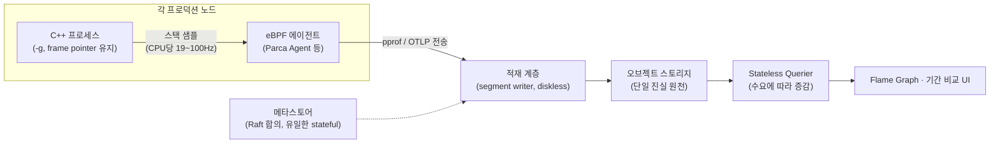

<strong>지속적 프로파일링(continuous profiling)</strong>이란 프로덕션 환경에서 프로파일러를 끄지 않고 상시 저빈도 샘플링으로 스택 트레이스를 수집·저장하고, 시간 축을 따라 조회·비교할 수 있게 만드는 운영 체계를 말합니다. 개발 머신에서 `perf record`를 잠깐 돌리는 것과 달리, 지속적 프로파일링은 "그 새벽 3시 배포 직후 p99가 튀었을 때 CPU가 어디에 쓰이고 있었는가"라는 **과거형 질문**에 답할 수 있습니다. µs 단위 지연을 다루는 시스템에서 성능 회귀는 재현이 어려운 경우가 많고, 재현을 시도하는 순간 이미 프로덕션과 다른 조건이 됩니다. 이 장에서는 상시 프로파일링이 1% 미만 오버헤드로 가능해진 메커니즘(저빈도 샘플링, eBPF 기반 스택 수집, pprof 포맷), Grafana Pyroscope 2.0과 Parca를 중심으로 한 아키텍처, 그리고 도입 판단 기준을 다룹니다.

## 이 장을 읽기 전에

이 장은 [03장: 샘플링 프로파일링 — perf·VTune 원리](/post/profiling-analysis/sampling-profiling-perf-vtune/)에서 다룬 샘플링 프로파일러의 기본 원리(주기적 인터럽트, 스택 언와인딩, 통계적 근사)와 [05장: Flame Graph 분석](/post/profiling-analysis/flame-graph-analysis/)의 플레임 그래프 읽는 법을 전제로 합니다. 지속적 프로파일링의 UI는 결국 "시간 범위를 골라 뽑아낸 플레임 그래프"이기 때문입니다.

**이 장의 깊이**: 심화 난이도로, 단일 실행 프로파일링을 이미 할 줄 아는 독자가 그것을 **운영 인프라로 확장**하는 관점을 다룹니다. **다루지 않는 것**: eBPF 프로그램 자체의 작성·동작 원리와 uprobe/USDT 연계는 [16장: BPF 기반 동적 프로파일링](/post/profiling-analysis/bpf-based-profiling-bpftrace-bcc/)이, 요청 단위 지연 추적(트레이싱)은 [04장](/post/profiling-analysis/tracing-profiling-perfetto-tracy/)과 [17장: 분산 트레이싱 오버헤드와 µs 탐지](/post/profiling-analysis/distributed-tracing-microsecond-overhead/)가, 힙 할당 추적은 [20장: 메모리 프로파일링](/post/profiling-analysis/memory-profiling-heap-analysis/)이 담당합니다.

## 당신의 수준에 맞는 경로

| 수준 | 읽을 부분 | 핵심 목표 |
|------|---------|---------|
| **중급자** | "역사" ~ "저오버헤드 샘플링의 산수" | 상시 프로파일링이 왜 싸게 가능한지 원리 이해 |
| **심화 학습자** | "pprof 포맷" ~ "도구 지형" | pprof 데이터 모델과 Pyroscope 2.0·Parca 아키텍처 파악 |
| **운영 책임자** | "오버헤드를 직접 측정하기" ~ "비판적 시각" | 자기 워크로드에서 오버헤드를 검증하고 도입 여부 판단 |

---

## 역사: 데이터센터 프로파일링 30년

지속적 프로파일링은 최근 유행어처럼 보이지만 아이디어 자체는 오래됐습니다. 1997년 DEC의 연구진(Jennifer Anderson, Lance Berc 등)은 SOSP에 DCPI(Digital Continuous Profiling Infrastructure)를 발표하며, 하드웨어 성능 카운터 인터럽트 기반 샘플링으로 프로덕션 머신 전체를 1–3% 오버헤드로 상시 프로파일링할 수 있음을 보였습니다. 이 계보를 대규모로 산업화한 것이 2010년 Google의 GWP(Google-Wide Profiling)입니다. Gang Ren, Tipp Moseley, Robert Hundt 등이 IEEE Micro에 발표한 이 시스템은 전체 서버군에서 극히 일부 머신·일부 시간만 순환 샘플링하는 방식으로 데이터센터 전체의 CPU 소비 지도를 상시 유지했고, 여기서 쓰인 프로파일 데이터 표현이 오늘날의 **pprof 포맷**으로 이어졌습니다.

오픈소스 생태계는 2020년대에 형성됐습니다. Pyroscope는 2021년 오픈소스로 공개된 뒤 2023년 3월 Grafana Labs에 인수되어 자체 프로젝트 Phlare와 통합됐고, 2026년 4월 [Pyroscope 2.0](https://grafana.com/blog/pyroscope-2-0-release/)으로 저장 계층을 전면 재설계했습니다. Parca는 2021년 Polar Signals(Frederic Branczyk)가 공개한 eBPF 기반 프로젝트로, "코드 수정 없는 전 노드 상시 프로파일링"이라는 현재의 표준 패턴을 정착시켰습니다. 표준화 축에서는 OpenTelemetry Profiling SIG가 pprof와 호환되는 프로파일 시그널을 설계해 왔고, 2026년 3월 [공개 알파](https://opentelemetry.io/blog/2026/profiles-alpha/)에 도달했습니다. 즉 이 분야는 지금 "도구는 성숙, 와이어 포맷 표준은 수렴 중"인 단계입니다.

## 저오버헤드 샘플링의 산수

상시 프로파일링이 성립하는 이유는 단순한 산수입니다. 샘플링 프로파일러의 비용은 대략 `샘플링 주파수 × 샘플당 비용(스택 캡처·기록)`인데, 개발 중 프로파일링이 CPU당 1,000Hz–4,000Hz를 쓰는 반면 지속적 프로파일링은 CPU당 19–100Hz 수준으로 낮춥니다. 예컨대 [Parca Agent](https://www.parca.dev/docs/parca-agent/)는 논리 CPU당 초당 19회 스택을 캡처합니다. 샘플 하나의 처리 비용이 수 µs라면 코어당 초당 수십–수백 µs, 즉 1% 미만의 CPU 점유로 수렴합니다(정확한 수치는 스택 깊이·언와인딩 방식·플랫폼에 따라 다릅니다).

낮은 주파수로도 쓸모가 있는 이유는 **집계 시간이 길기 때문**입니다. 마이크로벤치마크가 수 초 안에 통계를 만들어야 하는 것과 달리([01장](/post/profiling-analysis/microbenchmark-design-principles/) 참조), 지속적 프로파일링은 수 시간–수 주에 걸쳐 샘플을 쌓습니다. 19Hz라도 100코어 클러스터에서 하루면 약 1억 6천만 개 샘플이 모이고, 이 정도면 전체 CPU의 0.1%를 쓰는 함수도 통계적으로 안정되게 드러납니다. 반대로 이 산수는 한계도 정의합니다. 지속적 프로파일링은 "누적 CPU 시간을 어디에 쓰는가"를 보는 도구이지, 한 요청이 왜 300µs 느렸는지 같은 **개별 이벤트**를 잡는 도구가 아닙니다. 그 질문은 [09장: Tail Latency 분석](/post/profiling-analysis/tail-latency-analysis/)과 [17장](/post/profiling-analysis/distributed-tracing-microsecond-overhead/)의 영역입니다.

수집 방식은 크게 두 갈래입니다. **인프로세스(in-process) SDK** 방식은 런타임 내장 프로파일러(Go의 runtime/pprof, JVM의 async-profiler 등)가 프로세스 안에서 샘플을 만들어 주기적으로 서버에 push합니다. **eBPF 에이전트** 방식은 노드마다 에이전트 하나가 커널의 perf 이벤트에 eBPF 프로그램을 붙여 모든 프로세스의 유저·커널 스택을 수집합니다. C++ 서비스에는 후자가 사실상 표준입니다. 런타임에 프로파일러 훅이 없어도 되고, 코드 수정·재시작 없이 노드 전체가 커버되기 때문입니다. 대신 eBPF 방식은 스택 언와인딩과 심볼화가 프로세스 밖에서 일어나므로, 프레임 포인터가 없는 바이너리에서는 DWARF 기반 언와인딩 테이블을 에이전트가 따로 만들어야 하는 부담이 생깁니다. C++ 바이너리를 `-fno-omit-frame-pointer`로 빌드해 두면 이 비용이 크게 줄어들며, Fedora 38·Ubuntu 24.04 등 주요 배포판이 시스템 패키지를 프레임 포인터 유지로 빌드하는 쪽으로 전환한 것도 같은 이유입니다.

## pprof 포맷: 상시 프로파일링의 공용어

수집된 샘플은 결국 어딘가로 전송·저장되어야 하고, 이때의 사실상 표준이 [pprof의 profile.proto](https://github.com/google/pprof/blob/main/proto/README.md)입니다. gzip으로 압축된 프로토콜 버퍼이며, 데이터 모델은 프로파일링 도메인에 맞게 정규화되어 있습니다. 샘플(sample)은 위치(location) ID의 배열과 측정값(value)으로 표현되고, 위치는 함수·파일·행 정보로, 모든 문자열은 프로파일 내 문자열 테이블의 인덱스로 중복 제거됩니다. 같은 스택이 수만 번 잡혀도 위치 목록은 한 번만 저장되므로, 상시 수집에도 전송량이 감당 가능한 수준으로 유지됩니다. 측정값에는 타입과 단위(예: `cpu`/`nanoseconds`, `alloc_space`/`bytes`)가 붙어 CPU 외에 힙·락 경합 프로파일도 같은 포맷에 담깁니다.

OpenTelemetry의 프로파일 시그널도 이 모델과의 호환을 전제로 설계됐습니다. 2026년 3월 공개 알파에는 스택 중복 제거와 사전(dictionary) 테이블 기반 인코딩, Collector의 pprof 수신기, eBPF 프로파일러의 Collector 수신기화가 포함됐습니다. 다만 OTel 공식 발표 스스로 알파 상태의 시그널을 중요 프로덕션 워크로드에 쓰지 말라고 명시하고 있으므로, 2026년 중반 현재 실전 배포는 여전히 Pyroscope·Parca의 네이티브 경로가 기본이고 OTLP 프로파일은 병행 관찰 대상으로 보는 것이 맞습니다.

## 상시 프로파일링 아키텍처와 도구 지형

지속적 프로파일링 시스템은 수집(에이전트) → 적재(ingest) → 저장 → 조회의 4계층으로 구성됩니다. 이 구조가 어떻게 연결되는지 보면 각 도구가 어느 계층을 혁신했는지가 명확해집니다.



**Grafana Pyroscope 2.0**(2026-04 발표)은 이 중 저장·조회 계층을 재설계한 사례입니다. v1이 Cortex 계열의 3중 복제·로컬 디스크 모델을 썼던 것과 달리, 2.0은 적재 경로의 segment writer를 **diskless**로 만들어 오브젝트 스토리지를 단일 진실 원천으로 삼고, 읽기 경로를 **stateless**로 만들어 어떤 querier든 어떤 쿼리든 처리할 수 있게 했습니다. 상태를 가진 컴포넌트는 Raft 합의로 복제되는 메타스토어 하나뿐입니다. Grafana Labs는 이 재설계로 쓰기 경로의 3배 복제 증폭이 사라지고 심볼 저장 공간이 최대 95% 줄었으며, v1에서 8–12시간 걸리던 배포 롤아웃이 수 분으로 단축됐다고 밝혔습니다. Grafana Cloud Profiles가 2025년 4월부터 이 아키텍처로 운영되며 19.5PB의 프로파일 데이터를 처리했다는 점에서, "프로파일 데이터는 로그·메트릭처럼 무거운 상태 계층 없이도 대규모로 운영 가능하다"는 주장의 실증 사례로 볼 수 있습니다(수치는 모두 Grafana 발표 기준).

**Parca**는 수집 계층의 대표 사례입니다. Kubernetes에서는 DaemonSet으로 노드당 하나씩 배포되어 eBPF로 해당 노드의 모든 프로세스를 자동 발견·샘플링하고, pprof 형식 프로파일을 중앙 Parca 서버로 전송합니다. C/C++/Go/Rust 같은 네이티브 컴파일 언어를 우선 지원하며, 커널 4.18 이상을 요구합니다. Polar Signals는 같은 에이전트 계보에서 eBPF 기반 GPU(CUDA) 프로파일링과 USDT 프로브 연계까지 확장하고 있는데, 이 부분은 [16장](/post/profiling-analysis/bpf-based-profiling-bpftrace-bcc/)에서 BPF 관점으로 다룹니다.

두 도구의 실행은 다음과 같이 시작할 수 있습니다. Pyroscope는 단일 바이너리 모드로 로컬 검증이 가능하고, Parca Agent는 루트 권한(eBPF 로드)으로 노드에서 실행합니다.

```bash
# Pyroscope 서버: 단일 바이너리 모드로 로컬 실행 (UI: http://localhost:4040)
docker run -it -p 4040:4040 grafana/pyroscope

# Parca Agent: 노드의 모든 프로세스를 eBPF로 샘플링해 원격 저장소로 전송
sudo parca-agent \
  --node=prod-node-01 \
  --remote-store-address=parca.example.com:7070 \
  --remote-store-insecure   # TLS 미사용 환경에서만; 프로덕션에서는 제거
```

에이전트를 띄우기 전에 확인할 것은 서버 주소가 아니라 **바이너리 쪽 준비**입니다. C++ 서비스가 심볼 없이(`strip`) 배포되고 프레임 포인터도 생략되어 있으면, 에이전트가 아무리 샘플을 모아도 플레임 그래프는 16진수 주소 덩어리가 됩니다. 최소한의 준비는 다음과 같습니다.

```bash
# 프로파일링 친화적 릴리스 빌드: 최적화는 유지하되 심볼과 프레임 포인터를 남긴다
g++ -O2 -g -fno-omit-frame-pointer -o server server.cpp

# 배포 파이프라인에서 strip이 필요하면 심볼을 분리 보관해 서버 측 심볼화에 사용
objcopy --only-keep-debug server server.debug
strip --strip-debug server
```

`-g`는 코드 생성에 영향을 주지 않으므로 릴리스 빌드에 넣어도 성능 손해가 없고, `-fno-omit-frame-pointer`는 레지스터 하나를 프레임 포인터로 묶는 대신 eBPF 에이전트의 언와인딩을 값싸고 정확하게 만듭니다(일반적인 x86-64 서버 워크로드에서 한 자릿수 % 미만의 영향으로 보고되지만, 레지스터 압박이 심한 핫루프에서는 더 클 수 있으므로 자기 워크로드에서 측정이 원칙입니다). 분리한 심볼 파일은 Pyroscope·Parca 모두 서버 측 심볼화 입력으로 쓸 수 있습니다.

## 오버헤드를 직접 측정하기

"오버헤드 1% 미만"은 벤더 공통의 주장이지만, µs 단위 시스템에서는 평균 1%보다 **꼬리 지연에 주는 영향**이 문제입니다. 샘플링 인터럽트는 짧지만 주기적으로 실행 중인 스레드를 선점하므로, 도입 전 자기 워크로드로 p99를 비교하는 절차를 권장합니다. 아래는 고정 워크로드의 반복 지연 분포를 출력하는 측정 스켈레톤입니다.

```cpp
// workload.cpp — 에이전트 유무에 따른 지연 분포 비교용 고정 워크로드
// 빌드: g++ -O2 -g -fno-omit-frame-pointer -std=c++17 -o workload workload.cpp
// 환경 예: x86-64 Linux 6.x, GCC 13 (수치는 플랫폼·플래그에 따라 다름)
#include <algorithm>
#include <chrono>
#include <cstdint>
#include <cstdio>
#include <vector>

int main() {
  std::vector<std::uint64_t> v(1u << 20);
  std::uint64_t x = 88172645463325252ULL;
  for (auto& e : v) { x ^= x << 13; x ^= x >> 7; x ^= x << 17; e = x; }

  std::vector<double> lat_ms;
  lat_ms.reserve(200);
  for (int iter = 0; iter < 200; ++iter) {
    auto t0 = std::chrono::steady_clock::now();
    std::sort(v.begin(), v.end());
    for (auto& e : v) { x ^= x << 13; x ^= x >> 7; x ^= x << 17; e = x; }
    auto t1 = std::chrono::steady_clock::now();
    lat_ms.push_back(std::chrono::duration<double, std::milli>(t1 - t0).count());
  }
  std::sort(lat_ms.begin(), lat_ms.end());
  std::printf("p50=%.3f ms  p90=%.3f ms  p99=%.3f ms\n",
              lat_ms[99], lat_ms[179], lat_ms[197]);
}
```

측정은 "에이전트 없음 → 에이전트 실행 → 다시 없음"의 A/B/A 순서로 하고, 각 조건을 여러 번 반복해 분포로 비교합니다. 단일 실행의 p99 두 개를 비교하는 것은 [10장: 통계적 벤치마킹](/post/profiling-analysis/statistical-benchmarking/)에서 본 것처럼 노이즈에 결론을 맡기는 일이며, 두 조건의 차이가 실행 간 변동 폭 안에 있다면 "오버헤드가 관측 한계 이하"라고 결론 내리는 것이 올바른 서술입니다. 결과 형태의 예시는 다음과 같습니다(실측이 아닌 형태 예시이며, 절대값은 하드웨어·커널·에이전트 설정에 따라 달라집니다).

```text
# baseline (agent 없음, 5회 실행)
p50=41.2~41.6 ms  p99=43.1~44.0 ms
# parca-agent 실행 중 (19Hz, 5회 실행)
p50=41.3~41.8 ms  p99=43.4~44.6 ms
```

이런 결과라면 p50 차이는 실행 간 변동과 구분되지 않고 p99가 소폭 상향된 정도로 읽습니다. 반대로 p99만 수 % 이상 벌어진다면 샘플링 인터럽트가 임계 구간과 충돌하고 있다는 신호이므로, 샘플링 주파수를 낮추거나 지연 임계 코어를 에이전트 대상에서 제외하는(CPU 격리 환경이라면 흔한 선택) 조정이 필요합니다. 격리 코어에서 busy-poll하는 초저지연 스레드가 있다면, 그 코어만큼은 상시 샘플링 대신 필요 시 [07장의 perf 고급 기법](/post/profiling-analysis/linux-perf-advanced/)으로 단발 관찰하는 절충이 현실적입니다.

## 흔한 오개념 교정

**오개념 1: "프로파일러는 오버헤드 때문에 프로덕션에서 켜면 안 된다."** 계측(instrumentation) 기반 프로파일러(Callgrind류, [15장](/post/profiling-analysis/valgrind-callgrind-cache-simulation/))라면 맞는 말이지만, 저빈도 샘플링에는 적용되지 않습니다. 오버헤드는 샘플링 주파수에 비례하는 조절 가능한 파라미터이며, 1997년 DCPI 이래 "상시 켜도 되는 수준"이 반복 실증되어 왔습니다. 금지 규칙이 아니라 측정으로 답할 질문입니다.

**오개념 2: "지속적 프로파일링이 있으면 마이크로벤치마크는 필요 없다."** 둘은 답하는 질문이 다릅니다. 지속적 프로파일링은 "전체 CPU 예산이 어디에 쓰이는가"를 알려주지만, 관측된 핫스팟의 개선안 A/B를 통제 조건에서 비교하는 것은 [01장](/post/profiling-analysis/microbenchmark-design-principles/)·[02장](/post/profiling-analysis/google-benchmark-practical/)의 마이크로벤치마크 몫입니다. 실무 루프는 "상시 프로파일로 후보 발견 → 벤치마크로 개선 검증 → 배포 후 상시 프로파일로 효과 확인"의 왕복입니다.

**오개념 3: "19Hz 샘플링으로는 µs 단위 이벤트를 못 보니 저지연 시스템엔 무의미하다."** 절반만 맞습니다. 개별 µs 이벤트를 못 보는 것은 사실이지만, 지속적 프로파일링의 목적은 이벤트 포착이 아니라 **누적 CPU 소비의 구조 변화 감지**입니다. 배포 전후로 특정 함수의 CPU 점유율이 3%에서 9%로 뛰었다면 그것이 꼬리 지연 회귀의 원인 후보이고, 이 신호는 19Hz로도 충분히 잡힙니다. 개별 느린 요청의 해부는 트레이싱([17장](/post/profiling-analysis/distributed-tracing-microsecond-overhead/))으로 넘기는 역할 분담이 정답입니다.

## 판단 기준: 언제 도입하고 언제 미루는가

지속적 프로파일링은 인프라 투자이므로, "좋은 도구인가"가 아니라 "지금 우리 질문에 맞는 도구인가"로 판단해야 합니다.

| 상황 | 권장 | 이유 |
|------|------|------|
| 배포가 잦고 성능 회귀 원인 추적에 시간을 쓰고 있다 | 도입 | 배포 전후 기간 비교(diff)가 회귀 분석을 분 단위로 단축 |
| 다수 노드·서비스에서 CPU 비용(클라우드 요금)을 줄여야 한다 | 도입 | 전 서비스 CPU 소비 지도를 상시 확보, 최적화 우선순위 결정 |
| 서비스가 1–2개, 성능 문제는 연 몇 회, 재현 가능 | 보류 | 필요 시 perf 단발 실행으로 충분, 저장·운영 비용이 더 큼 |
| busy-poll 격리 코어의 µs 지연 그 자체가 문제 | 부분 적용 | 상시 샘플링은 일반 코어만, 격리 코어는 단발 관찰로 절충 |
| 개별 요청의 지연 원인 분해가 필요 | 다른 도구 | 트레이싱(04·17장)·tail latency 분석(09장)이 맞는 도구 |

도입을 결정했다면 최소 체크리스트는 세 가지입니다. 첫째, 바이너리가 심볼화 가능한가(`-g` 또는 분리 심볼, 프레임 포인터 정책). 둘째, 오버헤드를 자기 워크로드의 p99로 검증했는가. 셋째, 저장 계층 비용 모델을 이해했는가 — Pyroscope 2.0처럼 오브젝트 스토리지 중심 설계는 이 세 번째 항목의 부담을 크게 낮춘 것이 핵심 진전입니다.

## 비판적 시각: 한계와 트레이드오프

**오버헤드는 0이 아니고, 평균이 아니라 꼬리로 갚는다.** 샘플링 인터럽트는 임계 구간·락 보유 구간을 선점할 수 있고, DWARF 기반 언와인딩은 스택이 깊을 때 샘플당 비용이 늘어납니다. "평균 1% 미만"이라는 문구는 p99.9에 대한 보증이 아니므로, 지연 SLO가 빡빡한 시스템일수록 A/B/A 측정 없이 전면 배포하지 않는 것이 원칙입니다.

**보이는 것은 CPU on-CPU 시간뿐이다.** 기본 CPU 프로파일은 블로킹 I/O·락 대기·스케줄링 지연 같은 off-CPU 시간을 보여주지 않습니다. "CPU 프로파일은 깨끗한데 지연은 나쁜" 상황은 흔하며, 이때 지속적 프로파일링 대시보드만 보고 있으면 문제를 영영 못 찾습니다. off-CPU 분석은 BPF 기반 접근([16장](/post/profiling-analysis/bpf-based-profiling-bpftrace-bcc/))이 필요합니다.

**데이터 거버넌스 문제가 따라온다.** 스택 트레이스는 함수 이름·소스 경로, 경우에 따라 내부 아키텍처를 드러내는 정보 자산입니다. 전사 프로파일 저장소는 접근 제어·보존 기간 정책 없이 운영하면 안 되며, 멀티테넌트 SaaS 백엔드에 보낼 때는 심볼 정보의 외부 반출 여부를 보안 검토에 포함해야 합니다.

**표준은 아직 수렴 중이다.** OTel 프로파일 시그널은 알파이고, 발표문 스스로 중요 프로덕션 사용을 경고합니다. 지금 pprof 네이티브 경로로 구축해도 pprof 호환이 OTel 설계 전제이므로 이행 비용은 크지 않겠지만, "OTLP 하나로 통일"을 전제로 한 아키텍처 결정은 2026년 중반 기준으로는 이릅니다.

## 마무리: 이 장의 달성 목표

- [ ] 지속적 프로파일링이 저오버헤드로 성립하는 산수(주파수 × 샘플 비용, 긴 집계 시간)를 설명할 수 있다.
- [ ] pprof 포맷의 데이터 모델(샘플→위치 참조, 문자열 테이블, 값 타입)이 상시 수집에 적합한 이유를 말할 수 있다.
- [ ] Pyroscope 2.0의 diskless·stateless 설계가 v1 대비 무엇을 바꿨는지(복제 제거, 오브젝트 스토리지 단일화, stateless 읽기)를 요약할 수 있다.
- [ ] C++ 바이너리를 프로파일링 친화적으로 빌드(-g, 프레임 포인터, 분리 심볼)할 수 있다.
- [ ] A/B/A 절차로 에이전트 오버헤드를 자기 워크로드의 p99 기준으로 검증할 수 있다.
- [ ] 지속적 프로파일링·트레이싱·마이크로벤치마크의 역할 분담을 상황별로 배정할 수 있다.

**이전 장**: [통계적 벤치마킹](/post/profiling-analysis/statistical-benchmarking/)

## 다음 장에서는

상시 프로파일링으로 "배포 전후에 무엇이 달라졌는가"를 볼 수 있게 되었다면, 다음 질문은 "그 변경이 정말 개선인가"를 프로덕션 트래픽으로 판정하는 방법입니다. 다음 장에서는 트래픽을 나눠 두 버전의 성능 분포를 비교하는 **성능 A/B 테스트 방법론** — 실험 설계, 표본 크기, 지연 분포 비교의 함정 — 을 다룹니다.

→ [성능 A/B 테스트 방법론](/post/profiling-analysis/performance-ab-testing/)
