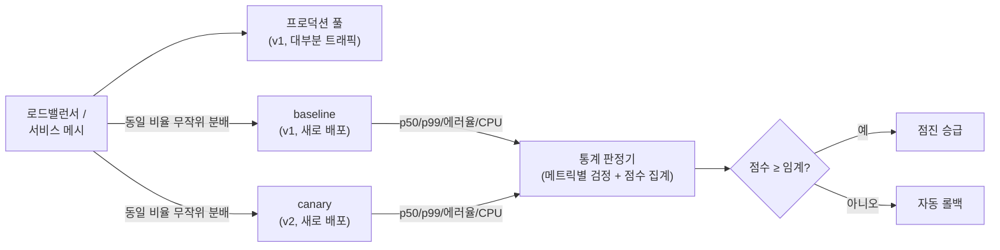

<strong>성능 A/B 테스트(performance A/B testing)</strong>란 성능 변경(코드·플래그·설정)을 두 개 이상의 실험군으로 나눠 실제 또는 실제에 가까운 트래픽 위에서 동시에 실행하고, 지연·처리량 지표의 차이를 통계적으로 판정하는 방법론입니다. 마이크로벤치마크가 "이 함수가 빨라졌는가"에 답한다면, 성능 A/B 테스트는 "이 변경이 프로덕션 워크로드에서 p99를 실제로 낮추는가"에 답합니다. 두 질문의 답은 자주 어긋납니다 — 벤치마크에서 20% 빨라진 코드가 프로덕션에서는 캐시 압력을 높여 꼬리 지연을 악화시키는 일이 드물지 않기 때문입니다. 이 장에서는 카나리(canary)·섀도 트래픽(shadow traffic)이라는 두 가지 실험 인프라, 무작위화·표본 크기라는 실험 설계의 축, 그리고 시스템 노이즈 속에서 µs–ms 단위 차이를 판정하는 통계적 절차를 다룹니다.

## 이 장을 읽기 전에

이 장은 [10장: 통계적 벤치마킹](/post/profiling-analysis/statistical-benchmarking/)의 신뢰 구간·유의성 검정 개념과 [09장: Tail Latency 분석](/post/profiling-analysis/tail-latency-analysis/)의 분위수(p95/p99) 해석을 전제로 합니다. 두 장을 읽지 않았다면 "p-value가 무엇인지", "왜 평균이 아니라 p99를 보는지"는 알고 있어야 합니다. 프로덕션 메트릭 수집 파이프라인(Prometheus 등)이 이미 있다는 가정 하에 서술하며, 그 인프라 자체는 [11장: 지속적 프로파일링](/post/profiling-analysis/continuous-profiling-production/)에서 다뤘습니다.

**이 장의 깊이**: 중급. 실험 설계의 원칙과 판정 절차를 실무 수준으로 다루되, 검정력 분석(power analysis)의 수학적 유도나 순차 검정(sequential testing) 이론의 증명은 다루지 않습니다. **다루지 않는 것**: 오프라인 벤치마크의 통계 처리([10장](/post/profiling-analysis/statistical-benchmarking/)), 요청 단위 지연 계측 인프라([17장: 분산 트레이싱](/post/profiling-analysis/distributed-tracing-microsecond-overhead/)), 그리고 비즈니스 지표(전환율 등) 중심의 제품 A/B 테스트 일반론입니다.

## 당신의 수준에 맞는 경로

| 수준 | 읽을 부분 | 핵심 목표 |
|------|---------|---------|
| **초보자** | "무작위 실험에서 카나리 분석까지" ~ "카나리와 섀도 트래픽" | 카나리·섀도의 구조와 역할 차이 이해 |
| **중급자** | "실험 설계: 무작위화·표본 크기" ~ "통계적 판정" | 노이즈 속에서 유의미한 차이를 판정하는 절차 습득 |
| **전문가** | "흔한 오개념" ~ "비판적 시각" | A/B 테스트가 답할 수 없는 질문과 µs 단위의 한계 판단 |

---

## 무작위 실험에서 카나리 분석까지 (역사·배경)

무작위 대조 실험의 이론적 기초는 1935년 Ronald A. Fisher의 *The Design of Experiments*로 거슬러 올라갑니다. Fisher가 농업 실험에서 정식화한 무작위화(randomization)·반복(replication)·블로킹(blocking)의 세 원칙은 90년이 지난 지금도 성능 실험 설계의 뼈대 그대로입니다. 이 원칙이 소프트웨어로 넘어온 것은 2000년대 웹 서비스의 온라인 통제 실험(online controlled experiment)이었고, Microsoft의 Ron Kohavi 등이 정리한 실무 체계(Kohavi·Tang·Xu, *Trustworthy Online Controlled Experiments*, 2020)가 사실상의 표준 교과서가 되었습니다. 다만 이 계보는 클릭률·전환율 같은 비즈니스 지표가 중심이었습니다.

성능 지표를 위한 A/B 검증은 배포 파이프라인 쪽에서 별도로 발전했습니다. 광산의 카나리아 새에서 이름을 딴 <strong>카나리 릴리스(canary release)</strong>는 Jez Humble과 David Farley의 *Continuous Delivery*(2010)를 통해 널리 알려졌고, 처음에는 "일부 트래픽에 신버전을 먼저 노출해 장애를 조기 발견"하는 안전장치였습니다. 이것이 통계적 실험으로 진화한 계기는 2018년 Netflix가 Google과 함께 공개한 **Kayenta** — Spinnaker의 자동 카나리 분석(Automated Canary Analysis, ACA) 엔진 — 입니다. Kayenta는 사람이 대시보드를 눈으로 비교하던 관행을 "메트릭별 비모수 검정 → 점수 집계 → 자동 승급/롤백"이라는 재현 가능한 판정 절차로 바꿨습니다. 코드베이스는 2025년 12월 독립 저장소가 아카이브되고 Spinnaker 모노레포로 통합되었지만, 그 판정 모델은 [Argo Rollouts](https://argoproj.github.io/argo-rollouts/features/canary/) 등 2026년 현재 활발히 유지보수되는 진행형 배포(progressive delivery) 도구들에 그대로 계승되어 있습니다.

## 카나리와 섀도 트래픽: 두 가지 실험 인프라

성능 A/B 테스트의 인프라는 크게 두 갈래입니다. 어느 쪽이든 핵심은 같습니다 — **같은 시간, 같은 종류의 트래픽, 같은 환경에서 두 버전을 나란히 실행**해야 시간대 효과·워크로드 변동 같은 교란 변수(confounder)가 양쪽에 동일하게 작용합니다.

**카나리 분석**은 실제 트래픽의 일부(보통 1–10%)를 신버전 인스턴스로 라우팅하고, 나머지를 처리하는 기존 버전과 지표를 비교합니다. 여기서 널리 합의된 모범 사례가 하나 있습니다. 신버전(canary)을 **기존에 오래 돌던 프로덕션 풀과 직접 비교하면 안 되고**, 같은 시점에 새로 배포한 구버전 인스턴스(baseline)와 비교해야 합니다. 오래 돈 프로세스는 JIT 워밍업·페이지 캐시·커넥션 풀 상태가 다르기 때문에, "신버전 vs 기존 풀" 비교는 버전 차이가 아니라 프로세스 나이 차이를 측정하게 됩니다. [Spinnaker의 카나리 문서](https://spinnaker.io/docs/guides/user/canary/)가 이 baseline 재배포 원칙을 권고의 첫머리에 두는 이유입니다.

<strong>섀도 트래픽(트래픽 미러링)</strong>은 실제 요청을 복제해 신버전에도 보내되, 신버전의 응답은 버리고 사용자에게는 기존 버전의 응답만 돌려줍니다. 사용자 영향이 0이므로 위험한 변경(할당자 교체, 자료구조 전면 개편)을 실제 워크로드 분포로 검증할 수 있다는 것이 최대 장점입니다. 대신 두 가지 비용이 있습니다. 첫째, 상태를 변경하는 요청(쓰기·결제·외부 API 호출)은 그대로 복제하면 부작용이 두 번 실행되므로, 미러 경로에서 부작용을 차단하거나 읽기 요청만 미러링해야 합니다. 둘째, 미러링 자체가 프록시·네트워크에 부하를 더하므로 측정 대상 시스템의 지연 분포를 바꿀 수 있습니다 — 관측이 대상을 교란하는 문제는 프로파일링 오버헤드([03장](/post/profiling-analysis/sampling-profiling-perf-vtune/))와 동일한 구조입니다.



다이어그램의 핵심은 baseline과 canary가 **대칭**이라는 점입니다. 배포 시점, 인스턴스 수, 트래픽 비율, 하드웨어 세대까지 같아야 하고, 다른 것은 코드 버전 하나여야 합니다. 이 대칭이 깨진 만큼 판정은 오염됩니다.

## 실험 설계: 무작위화·표본 크기

인프라를 갖췄다면 다음은 Fisher의 첫 번째 원칙, 무작위화입니다. <strong>무작위화 단위(unit of randomization)</strong>를 무엇으로 잡느냐가 실험의 통계적 성질을 결정합니다. 요청 단위 무작위화는 표본을 가장 많이 확보하지만, HTTP keep-alive·커넥션 풀 때문에 같은 커넥션의 요청들이 같은 인스턴스로 쏠리면 표본 간 독립성이 깨집니다. 호스트 단위 무작위화(카나리의 기본 형태)는 구현이 단순한 대신 사실상의 표본 크기가 "요청 수"가 아니라 "호스트 수"에 가까워지는 클러스터 무작위화 문제를 안습니다 — canary 인스턴스가 2대라면, 그중 1대가 noisy neighbor를 만난 순간 실험 전체가 기울어집니다. 실무 절충은 인스턴스를 4대 이상씩 두고 호스트 간 분산을 판정에 반영하는 것입니다.

**표본 크기**는 "얼마나 작은 차이를 잡아내고 싶은가(효과 크기)"와 "분위수가 얼마나 깊은가"의 함수입니다. 평균이라면 수천 샘플로 충분한 상황에서도, p99는 100개 중 1개, p99.9는 1000개 중 1개의 관측치만이 추정에 실질적으로 기여하므로 필요 표본이 두 자릿수 배로 늘어납니다. 대략적인 감각으로, p99 추정치가 안정되려면 임계 초과 관측이 수백 개는 필요하고 이는 총 수만 건의 요청을 뜻합니다. 초당 100 요청을 받는 canary라면 몇 분이 아니라 **몇 시간** 단위의 실험이 필요하다는 계산이 나옵니다. 정확한 검정력 계산 절차는 [10장](/post/profiling-analysis/statistical-benchmarking/)의 방법을 그대로 쓰면 됩니다.

실험을 시작하기 전에 반드시 거쳐야 할 관문이 **A/A 테스트**입니다. baseline과 canary에 **같은 버전**을 배포하고 판정 파이프라인을 돌려서, 차이가 없어야 할 상황에서 판정기가 "차이 있음"을 얼마나 자주 내는지(거짓 양성률) 측정합니다. A/A에서 20%씩 "회귀 감지"가 뜨는 파이프라인이라면 임계값·표본 기간·메트릭 구성을 고치기 전에는 A/B 결과를 신뢰할 수 없습니다. A/A 테스트는 판정 시스템 자체의 캘리브레이션이며, 건너뛰는 팀이 가장 많이 후회하는 단계입니다.

## 시스템 노이즈 대응

프로덕션의 지연 분포는 코드 이외의 요인으로 끊임없이 출렁입니다. 시간대에 따른 워크로드 변화, 이웃 VM의 CPU·캐시 간섭(noisy neighbor), 하드웨어 세대 차이, GC·컴팩션 주기, 배포 직후의 워밍업. 이 노이즈들을 다루는 원칙은 세 가지로 정리됩니다.

첫째, **시간 노이즈는 동시 실행으로 상쇄**합니다. baseline과 canary가 같은 시각의 트래픽을 받으면 시간대 효과는 양쪽에 공통으로 작용해 차이 계산에서 소거됩니다. "지난주 지표와 이번 주 지표 비교"가 실험이 될 수 없는 이유가 여기 있습니다. 둘째, **공간 노이즈는 블로킹과 반복으로 줄입니다**. 같은 가용 영역·같은 인스턴스 타입·가능하면 같은 하드웨어 세대에 배치하고(블로킹), 인스턴스를 여러 대 두어 개별 호스트의 이상치가 평균되게 합니다(반복). 클라우드에서는 같은 인스턴스 타입도 CPU 모델이 다를 수 있으므로, 판정 전에 양쪽 풀의 하드웨어 구성을 확인하는 절차를 파이프라인에 넣어둘 가치가 있습니다. 셋째, **수명 주기 노이즈는 대칭 배포로 제거**합니다 — 앞서 말한 baseline 재배포 원칙이 바로 이것입니다.

그래도 남는 노이즈가 판정을 흔든다면, 그것은 통계가 처리할 몫입니다. 노이즈를 더 줄이려 통제를 강화할수록 실험 환경이 프로덕션에서 멀어지는 역설이 있기 때문에 — 완전히 통제된 환경은 이미 프로덕션이 아닙니다 — 어느 지점부터는 "노이즈를 없애는" 대신 "노이즈보다 큰 차이만 믿는" 쪽으로 전략을 바꿔야 합니다.

## 통계적 판정: 지연 지표에 맞는 검정

지연 데이터에 교과서의 t-검정을 그대로 쓰면 안 되는 이유는 분포의 모양에 있습니다. 지연 분포는 정규분포가 아니라 오른쪽으로 긴 꼬리를 가진 왜곡 분포이고, 이상치가 평균과 표준편차를 지배합니다. 그래서 성능 A/B 판정의 실무 표준은 **비모수(nonparametric) 검정**입니다. Kayenta의 기본 판정기가 메트릭별 분류에 Mann-Whitney U 검정 기반 모듈(`kayenta-mannwhitney`)을 쓰는 것이 대표적입니다. Mann-Whitney U는 두 표본의 순위(rank)만 사용하므로 분포 가정이 없고 이상치에 강건하며, "canary 표본이 baseline 표본보다 체계적으로 큰 경향이 있는가"라는, 지연 회귀 판정에 정확히 부합하는 질문에 답합니다.

다만 U 검정은 "차이가 있다/없다"만 말할 뿐 **차이가 얼마인지**는 말하지 않습니다. p99가 3µs 나빠진 것과 300µs 나빠진 것은 통계적으로 둘 다 유의할 수 있지만 의사결정은 정반대입니다. 그래서 검정과 함께 **분위수 차이의 신뢰 구간**을 부트스트랩(bootstrap)으로 추정해, "p99 차이의 95% 신뢰 구간이 [+2µs, +8µs]" 같은 크기 정보를 판정에 포함해야 합니다. 아래는 baseline·canary 지연 표본에서 p99 차이의 부트스트랩 신뢰 구간을 계산하는 골격입니다. 실전에서는 표본을 파일·메트릭 저장소에서 읽겠지만, 여기서는 재현 가능하도록 합성 분포로 대체했습니다.

```cpp
// g++ -O2 -std=c++17 boot_p99.cpp -o boot_p99   (x86-64 Linux, GCC 13에서 확인)
#include <algorithm>
#include <cstdio>
#include <random>
#include <vector>

double quantile(std::vector<double> v, double q) {
  size_t idx = static_cast<size_t>(q * (v.size() - 1));
  std::nth_element(v.begin(), v.begin() + idx, v.end());
  return v[idx];
}

std::vector<double> resample(const std::vector<double>& src, std::mt19937_64& rng) {
  std::uniform_int_distribution<size_t> pick(0, src.size() - 1);
  std::vector<double> out(src.size());
  for (auto& x : out) x = src[pick(rng)];
  return out;
}

int main() {
  std::mt19937_64 rng(42);
  std::lognormal_distribution<double> base_d(3.0, 0.5), canary_d(3.0, 0.55);
  std::vector<double> base(50000), canary(50000);          // 지연 표본(µs) 5만 건씩
  for (auto& x : base)   x = base_d(rng);
  for (auto& x : canary) x = canary_d(rng);

  std::vector<double> diffs(2000);                          // 부트스트랩 2000회
  for (auto& d : diffs)
    d = quantile(resample(canary, rng), 0.99) - quantile(resample(base, rng), 0.99);
  std::sort(diffs.begin(), diffs.end());

  std::printf("p99 diff: %.1f us, 95%% CI [%.1f, %.1f] us\n",
              quantile(canary, 0.99) - quantile(base, 0.99),
              diffs[static_cast<size_t>(0.025 * diffs.size())],
              diffs[static_cast<size_t>(0.975 * diffs.size())]);
}
```

```text
p99 diff: +9.8 us, 95% CI [+7.4, +12.6] us
```

이 출력(예시 수치, 시드·플랫폼에 따라 다름)의 해석은 "canary의 p99가 baseline보다 약 10µs 높고, 신뢰 구간이 0을 포함하지 않으므로 노이즈로 설명하기 어렵다"입니다. 신뢰 구간이 [-3µs, +5µs]처럼 0을 걸치면 "이 표본으로는 판정 불가 — 표본을 늘리거나 회귀 아님으로 간주"가 됩니다. 주의할 점은 부트스트랩이 표본의 독립성을 가정한다는 것입니다. 커넥션 쏠림·시계열 자기상관이 강한 데이터라면 블록 부트스트랩 같은 변형이 필요하고, 이 수준의 논의는 [10장](/post/profiling-analysis/statistical-benchmarking/)에 위임합니다.

메트릭이 여러 개라면 **다중 비교(multiple comparison) 문제**가 등장합니다. 20개 메트릭을 각각 유의수준 5%로 검정하면 아무 차이가 없어도 평균 1개는 "유의"하게 나옵니다. Kayenta 계열 판정기가 개별 메트릭의 합격/불합격을 바로 쓰지 않고 가중 점수로 집계한 뒤 전체 점수에 임계값을 적용하는 것은 이 문제에 대한 실용적 방어입니다. 직접 파이프라인을 짠다면 최소한 핵심 메트릭(p99, 에러율)과 참고 메트릭(CPU, 메모리)을 구분하고, 판정은 핵심 메트릭에만 걸어야 합니다.

도구 쪽에서는 Argo Rollouts가 이 판정 루프를 Kubernetes 리소스로 선언하는 방식을 제공합니다. `AnalysisTemplate`에 메트릭 질의와 성공 조건을 정의하면, 롤아웃 단계마다 자동으로 평가해 승급·중단을 결정합니다.

```yaml
# Argo Rollouts AnalysisTemplate 발췌: canary p99가 baseline 대비 10% 이내면 통과
metrics:
  - name: p99-latency-ratio
    interval: 1m
    failureLimit: 3
    provider:
      prometheus:
        address: http://prometheus:9090
        query: |
          histogram_quantile(0.99, sum(rate(http_request_duration_seconds_bucket{pod=~"canary.*"}[5m])) by (le))
          / histogram_quantile(0.99, sum(rate(http_request_duration_seconds_bucket{pod=~"baseline.*"}[5m])) by (le))
    successCondition: result[0] < 1.10
```

이런 비율 기반 조건은 구현이 쉽지만 신뢰 구간 개념이 없다는 한계가 있습니다 — 표본이 적은 초기 단계에서 비율이 우연히 1.10을 넘어 오탐이 나기 쉬우므로, `failureLimit`(연속 실패 허용 횟수)과 단계별 최소 관찰 시간을 함께 조정해 사실상의 표본 크기 요건을 확보해야 합니다.

## 흔한 오개념 교정

**"카나리 대시보드에서 p99가 낮게 보이면 개선된 것이다."** 아닙니다. 첫째, canary는 인스턴스 수가 적어 분위수 추정의 분산이 크고, 둘째, 로드밸런서의 분배가 완전히 균등하지 않으면 canary가 받는 트래픽 믹스 자체가 다를 수 있습니다. A/A 테스트에서 같은 버전끼리도 p99가 수 % 차이 나는 것이 보통입니다. 눈으로 본 차이는 가설이지 결론이 아니며, 결론은 검정과 신뢰 구간이 만듭니다.

**"섀도 트래픽은 사용자에게 안 보이니 완전히 안전하다."** 응답은 버려져도 부작용은 버려지지 않습니다. 미러된 쓰기 요청이 DB에 두 번 기록되고, 미러 경로의 다운스트림 호출이 외부 API 요금과 사내 서비스 부하를 두 배로 만들며, 공유 캐시를 오염시켜 오히려 프로덕션 지연을 바꿔놓을 수 있습니다. 섀도는 "사용자 응답 경로에서 안전"일 뿐이며, 상태·부하·캐시 격리는 설계자가 직접 보장해야 합니다.

**"평균 지연이 유의하게 개선됐으니 배포해도 된다."** 평균과 꼬리는 독립적으로 움직입니다. 핫패스의 분기 하나를 줄여 평균을 낮추면서, 드물게 실행되는 슬로우패스(할당·락 경합)를 늘려 p99.9를 악화시키는 변경은 실제로 흔합니다. [The Tail at Scale](https://research.google/pubs/the-tail-at-scale/)(Dean·Barroso, CACM 2013)이 정리했듯 분산 시스템에서 사용자 체감을 지배하는 것은 꼬리이므로, 판정 메트릭에는 반드시 꼬리 분위수가 포함되어야 합니다. 어떤 분위수를 볼지는 [09장](/post/profiling-analysis/tail-latency-analysis/)의 기준을 따릅니다.

## 판단 기준: 어떤 검증 수단을 언제 쓰는가

세 가지 검증 수단은 대체 관계가 아니라 파이프라인의 단계입니다. 오프라인에서 싸게 거를 수 있는 회귀를 프로덕션 실험까지 끌고 가는 것도, 프로덕션에서만 보이는 회귀를 벤치마크로 잡으려는 것도 비용 낭비입니다.

| 상황 | 권장 수단 | 이유 |
|------|----------|------|
| 함수·자료구조 단위 변경의 1차 검증 | 마이크로벤치마크 ([01장](/post/profiling-analysis/microbenchmark-design-principles/)·[02장](/post/profiling-analysis/google-benchmark-practical/)) | 빠르고 저렴, 원인 격리 가능 |
| 워크로드 의존적 변경(할당자·캐시 정책·동시성 구조) | 섀도 트래픽 | 실제 요청 분포 필요, 사용자 위험 0 |
| 배포 전 최종 관문, ms–수십 µs 수준의 회귀 감지 | 카나리 + 자동 판정 | 실제 환경·실제 부하에서의 최종 검증 |
| 단일 µs 이하 차이의 검증 | 카나리로는 불가 — 하드웨어 카운터([08장](/post/profiling-analysis/hardware-performance-counters/))·통제 벤치마크 | 프로덕션 노이즈가 효과보다 큼 |
| 쓰기 위주 트래픽, 부작용 격리 불가 | 카나리(소규모)만, 섀도 배제 | 미러링의 부작용 위험이 이득보다 큼 |

실험을 시작하기 전 체크리스트: (1) baseline을 canary와 같은 시점에 재배포했는가, (2) A/A 테스트로 거짓 양성률을 측정해 뒀는가, (3) 목표 효과 크기와 필요 표본(실험 시간)을 계산했는가, (4) 판정 메트릭에 꼬리 분위수가 포함되어 있는가, (5) 자동 롤백 조건이 판정과 연결되어 있는가. 다섯 중 하나라도 "아니오"면 그 실험의 결과는 일화(anecdote)이지 증거가 아닙니다.

## 비판적 시각: 한계와 트레이드오프

성능 A/B 테스트의 가장 근본적인 한계는 **검출 한계와 이 시리즈의 관심 영역이 부분적으로 어긋난다**는 점입니다. 프로덕션 노이즈 바닥은 잘 통제해도 수 %·수십 µs 수준이고, 그보다 작은 개선 — 예컨대 핫패스에서 200ns를 깎는 변경 — 은 현실적인 실험 기간 안에 카나리로 검출되지 않습니다. 이런 변경의 검증은 통제된 벤치마크와 하드웨어 카운터의 영역이며, A/B 테스트는 "그 미시적 개선들이 모여 시스템 수준에서 의미 있는 차이를 만들었는가"를 확인하는 마지막 단계로 보는 것이 정직한 위치 설정입니다.

둘째, 카나리는 엄밀한 의미의 무작위 실험이 아닌 경우가 많습니다. 호스트 단위 배치는 클러스터 무작위화이고, 트래픽 분배는 라우팅 정책의 산물이며, 실험 도중 오토스케일링·재배포가 개입하면 표본의 동질성이 깨집니다. 관찰된 차이가 버전 때문인지 배치 운(運) 때문인지 구분하려면 결국 반복 — 여러 번의 독립적인 카나리 — 이 필요한데, 배포 주기가 이를 허용하지 않는 조직이 많습니다. 자동 판정 점수는 이 불확실성을 숫자 하나로 눌러 담은 것이므로, 점수의 정밀해 보이는 외양을 실험 설계의 엄밀함으로 착각하면 안 됩니다.

셋째, **실험 기간과 위험 노출의 트레이드오프**는 통계로 해소되지 않습니다. 표본을 늘리려 카나리를 오래 돌리면 그만큼 사용자 일부가 잠재적 회귀에 오래 노출되고, 짧게 끝내면 검출력이 떨어집니다. 순차 검정으로 "충분히 명확해지는 즉시 중단"을 자동화할 수 있지만, 조기 중단은 효과 크기를 과대추정하는 편향(winner's curse)을 낳습니다. 마지막으로 도구 수명의 문제도 있습니다 — 이 분야의 상징이던 Kayenta의 독립 저장소가 2025년 말 아카이브된 데서 보듯, 특정 도구에 파이프라인을 결합하기보다 "대칭 배포, A/A 캘리브레이션, 비모수 검정 + 효과 크기"라는 방법론 자체를 팀의 자산으로 삼는 편이 오래갑니다.

## 마무리

이 장을 제대로 소화했는지는 다음 기준으로 확인합니다.

- [ ] 카나리와 섀도 트래픽의 구조·장단점을 비교하고, 주어진 변경에 어느 쪽이 적합한지 고를 수 있다.
- [ ] baseline 재배포 원칙이 왜 필요한지 프로세스 수명 주기 관점에서 설명할 수 있다.
- [ ] A/A 테스트의 목적(거짓 양성률 캘리브레이션)을 설명하고 파이프라인에 배치할 수 있다.
- [ ] 지연 지표에 t-검정 대신 비모수 검정과 분위수 신뢰 구간을 쓰는 이유를 분포의 성질로 설명할 수 있다.
- [ ] 목표 분위수 깊이(p99 vs p99.9)에 따라 필요한 표본 규모와 실험 시간을 추정할 수 있다.
- [ ] 카나리로 검출 가능한 효과 크기의 하한을 인지하고, 그 이하의 검증을 적절한 도구로 위임할 수 있다.

**이전 장**: [지속적 프로파일링 (Continuous Profiling)](/post/profiling-analysis/continuous-profiling-production/) — 이 장의 A/B 판정에 공급되는 프로덕션 메트릭·프로파일 수집 기반을 다뤘습니다.

**다음 장에서는** 플랫폼별 프로파일러로 돌아가 **AMD μProf**를 다룹니다. AMD CPU의 IBS(Instruction-Based Sampling) 기반 분석과 최신 버전의 기능을 활용해, 이 장에서 "카나리로는 못 잡는다"고 판정한 미시적 회귀를 하드웨어 수준에서 추적하는 방법을 정리합니다.

→ [AMD μProf 활용](/post/profiling-analysis/amd-uprof-profiling/)
