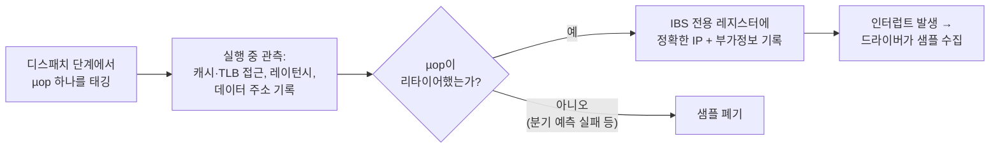

**AMD μProf(uProf)는 AMD가 자사 Zen 계열 CPU(Ryzen·EPYC·Threadripper)를 위해 제공하는 공식 프로파일러로, 시간·이벤트 기반 샘플링에 더해 AMD 고유의 IBS(Instruction-Based Sampling)와 전력·열 분석까지 하나의 도구로 묶은 성능 분석 스위트다.** EPYC 서버가 저지연 시스템의 주류 배포 대상 중 하나가 된 지금, "perf는 돌아가는데 이벤트 이름이 Intel 문서와 다르고, VTune은 하드웨어 분석이 아예 안 된다"는 상황을 겪은 엔지니어가 많을 것입니다. AMD 마이크로아키텍처에서 캐시 미스 한 건이 정확히 어느 로드 명령에서 났는지, 그 로드가 몇 사이클을 기다렸는지를 µs 단위 최적화의 근거로 삼으려면, Intel 중심 도구의 대응물이 아니라 AMD 하드웨어가 실제로 제공하는 관측 메커니즘을 이해해야 합니다. 이 장은 uProf의 수집·해석 워크플로우를 IBS 중심으로 파고들고, 2026년 5월 공개된 uProf 5.3의 변화(DuckDB 백엔드, vIBS, Zen 4/5 신규 메트릭)와 perf·VTune 대비 역할 분담 기준까지 정리합니다.

## 이 장을 읽기 전에

이 장은 [03장: 샘플링 프로파일링: perf·VTune 원리](/post/profiling-analysis/sampling-profiling-perf-vtune/)에서 다룬 샘플링 프로파일러의 기본 동작(인터럽트 기반 수집, 스키드 개념)과 [08장: 하드웨어 성능 카운터](/post/profiling-analysis/hardware-performance-counters/)의 PMU(Performance Monitoring Unit) 기초를 전제로 합니다. perf 명령어의 기본 사용법은 [07장: Linux perf 고급](/post/profiling-analysis/linux-perf-advanced/)과 겹치는 부분이 있어 이 장에서는 AMD IBS 관련 부분만 다룹니다.

**이 장의 깊이**: 심화 수준입니다. IBS의 하드웨어 메커니즘(fetch/op 태깅, 스키드 제거 원리)을 내부 동작 수준에서 서술하고, uProf CLI로 수집→리포트→해석하는 전체 루프를 실습 가능한 형태로 제공합니다. **다루지 않는 것**: 플레임 그래프 해석 일반론([05장](/post/profiling-analysis/flame-graph-analysis/)), VTune 자체의 심화 기능([06장](/post/profiling-analysis/intel-vtune-deep-dive/)), PMC 이벤트 일반 이론([08장](/post/profiling-analysis/hardware-performance-counters/)), 그리고 uProf의 GPU/Instinct 가속기 프로파일링(이 시리즈의 범위 밖)입니다.

## 당신의 수준에 맞는 경로

| 수준 | 읽을 부분 | 핵심 목표 |
|------|---------|---------|
| **초보자(AMD 첫 분석)** | "uProf의 구성" ~ "실전: 수집과 리포트" | TBP→IBS 순서로 핫스팟을 찾는 기본 루프 습득 |
| **중급자** | "IBS의 내부 동작" ~ "전력·열 분석" | 스키드 없는 샘플과 EBS 샘플의 차이를 해석에 반영 |
| **전문가** | "uProf 5.3의 변화" ~ "비판적 시각" | perf/VTune/uProf 역할 분담과 IBS 편향·한계 판단 |

## 역사·배경: CodeAnalyst에서 uProf까지, 그리고 IBS의 탄생

AMD의 프로파일러 계보는 2000년대의 CodeAnalyst에서 시작해 2012년 공개된 통합 도구 CodeXL을 거쳐, Zen 아키텍처 시대에 CPU 프로파일링 기능을 승계한 uProf로 이어졌습니다. 도구 이름은 바뀌었지만 핵심 자산은 하드웨어 쪽에 있습니다. 2007년 AMD Family 10h(Barcelona) 프로세서와 함께 도입된 **IBS(Instruction-Based Sampling)**가 그것으로, 당시 AMD의 Paul Drongowski가 발표한 기술 문서(2007)에서 "카운터 오버플로 기반 샘플링의 스키드 문제를 하드웨어 태깅으로 제거한다"는 설계 목표가 제시되었습니다. Intel이 비슷한 목적으로 PEBS(Precise Event-Based Sampling)를 발전시켜 온 것과 대칭을 이루지만, 두 메커니즘은 설계 철학이 다릅니다. PEBS가 "이벤트가 N번 발생하면 그 시점의 상태를 기록"하는 이벤트 중심이라면, IBS는 "명령(µop) 하나를 무작위로 골라 그 일생을 추적"하는 명령 중심입니다.

이 차이는 실무에 직접적인 영향을 줍니다. IBS 샘플 하나에는 해당 명령의 정확한 IP, 접근한 데이터 주소, 캐시 계층 어디에서 데이터를 받았는지, 로드가 완료되기까지 걸린 레이턴시가 함께 기록됩니다. 즉 "이 함수에서 캐시 미스가 많다"가 아니라 "이 로드 명령이 DRAM에서 평균 240사이클을 기다렸다" 수준의 진술이 가능해집니다. µs 단위 지연 예산을 다루는 입장에서 이것은 추정과 측정의 차이입니다.

## uProf의 구성: 세 개의 분석 축

uProf는 하나의 GUI/CLI 아래 성격이 다른 세 가지 분석을 묶어 놓았습니다. 첫째 축은 **CPU 프로파일링**으로, 타이머 인터럽트 기반의 TBP(Time-Based Profiling), 코어 PMC(Zen 기준 코어당 6개의 프로그래머블 카운터)를 쓰는 EBP(Event-Based Profiling), 그리고 IBS 기반 정밀 분석이 여기에 속합니다. 둘째 축은 **전력·열 분석**으로, 소켓·코어 단위 에너지 카운터와 온도·유효 주파수(effective frequency)·P-state를 시계열로 수집하는 timechart 기능입니다. 셋째 축은 **시스템 분석**(AMDuProfPcm)으로, IPC·메모리 대역폭·PCIe 대역폭 같은 소켓 수준 지표를 관찰합니다. 각 축의 수집 주체가 다르므로(각각 OS 타이머·코어 PMU·IBS, 에너지 MSR, 언코어/데이터 패브릭 카운터) 오버헤드와 권한 요구도 다릅니다.

세 축의 사용 순서에는 자연스러운 계층이 있습니다. TBP로 "어디에 시간이 쓰이는가"를 좁히고, EBP로 "그 구간에서 어떤 이벤트가 비정상적으로 높은가"를 확인한 뒤, IBS로 "정확히 어느 명령이 왜 느린가"까지 내려가는 순서입니다. 처음부터 IBS를 켜면 샘플은 정밀하지만 어디를 봐야 할지 모르는 상태에서 데이터만 쌓입니다. 이 계층적 접근은 [00장에서 정의한 측정→가설→검증 루프](/post/profiling-analysis/getting-started-profiling-performance-analysis-fundamentals/)의 도구별 구체화이기도 합니다.

## IBS의 내부 동작: 태깅이 스키드를 없애는 원리

일반적인 EBS/EBP는 "캐시 미스 카운터가 10만이 되면 인터럽트를 걸고 그 시점의 IP를 기록"합니다. 문제는 인터럽트가 걸리는 시점과 이벤트를 일으킨 명령 사이에 수십 명령의 거리(스키드, skid)가 생긴다는 점입니다. 비순차(out-of-order) 실행 폭이 넓은 최신 코어일수록 이 거리가 커져서, 핫스팟이 실제 원인 명령의 몇 줄 아래로 표시되는 일이 흔합니다. IBS는 접근을 뒤집습니다. 이벤트를 세는 대신, **디스패치 시점에 µop 하나를 태깅하고 그 µop이 파이프라인을 통과하는 동안 발생하는 모든 일을 하드웨어가 전용 레지스터에 기록**합니다. 기록되는 IP는 태깅된 바로 그 명령의 것이므로 정의상 스키드가 없습니다.

IBS는 두 개의 독립 PMU로 제공됩니다. **IBS Fetch**는 프런트엔드의 명령 인출 단계를 샘플링해 ITLB 미스, 명령 캐시(IC)/op 캐시 히트 여부, 인출 레이턴시를 기록합니다. **IBS Op**는 실행 단계를 샘플링해 로드/스토어의 데이터 소스(L1/L2/L3/DRAM/원격 소켓), DC(Data Cache) 미스 레이턴시, 데이터 주소, 분기 결과를 기록합니다. AMD 공식 문서는 op 샘플링에 대해 분기 예측 실패 등으로 폐기된 µop은 기록에서 제외되고 리타이어(완료)한 µop만 집계된다고 명시합니다([AMD uProf Getting Started Guide: Introduction to IBS](https://docs.amd.com/r/en-US/68658-uProf-getting-started-guide/Introduction-to-IBS-Instruction-Based-Sampling)). 즉 IBS Op 프로파일은 "실제로 아키텍처 상태에 반영된 작업"의 표본입니다.



이 구조에는 대가도 있습니다. 태깅은 한 번에 µop 하나만 가능하므로 IBS는 **샘플링 전용**이며 카운팅 모드가 없습니다. 또 태깅이 특권 수준을 가리지 않기 때문에 user/kernel 필터링이 불가능하고, Linux에서 IBS 수집에는 CAP_SYS_ADMIN 또는 CAP_PERFMON 권한이 필요합니다([man7: perf-amd-ibs(1)](https://man7.org/linux/man-pages/man1/perf-amd-ibs.1.html)). 참고로 Linux perf도 `ibs_op//`·`ibs_fetch//` PMU로 같은 하드웨어를 직접 쓸 수 있고, AMD에서 `perf mem`·`perf c2c`가 동작하는 기반도 IBS입니다. perf 쪽 활용은 [07장](/post/profiling-analysis/linux-perf-advanced/)에서 다루고, 이 장은 uProf를 통한 수집·해석에 집중합니다.

## 실전: 수집과 리포트

uProf의 실전 워크플로우는 CLI(AMDuProfCLI)로 수집하고 GUI 또는 CLI 리포트로 해석하는 형태가 기본입니다. 서버는 대부분 headless이므로 수집은 CLI, 해석은 로컬 GUI로 세션 디렉터리를 열어 보는 분업이 실무 표준입니다. 아래는 Linux(EPYC, Ubuntu 24.04 기준)에서 TBP→IBS 순서로 좁혀 가는 명령입니다.

```bash
# 1) 시간 기반 프로파일(TBP)로 전체 시간 분포 파악
AMDuProfCLI collect --config tbp -o /tmp/uprof-tbp ./pointer_chase

# 2) 핫 구간이 메모리 병목으로 의심되면 IBS로 정밀 수집
AMDuProfCLI collect --config ibs -o /tmp/uprof-ibs ./pointer_chase

# 3) 수집 세션에서 리포트 생성 (핫 함수·소스 라인·IBS 파생 메트릭 포함)
AMDuProfCLI report -i /tmp/uprof-ibs/<세션 디렉터리> -o /tmp/uprof-report
```

`--config ibs`는 fetch/op 샘플링을 미리 정의된 간격으로 켜는 프리셋이며, GUI에서는 Investigate Instruction Access(fetch 중심)·Investigate Data Access(op 중심) 같은 사전 구성으로 노출됩니다([AMD uProf User Guide: Analysis with IBS](https://docs.amd.com/r/en-US/57368-uProf-user-guide/Analysis-with-Instruction-Based-Sampling)). 리포트에서 실제로 마주치는 출력은 대략 다음 형태입니다(수치는 예시이며 플랫폼·워크로드에 따라 다릅니다).

```text
FUNCTION                     IBS_OP_SAMPLES  IBS_DC_MISS_RATE(%)  IBS_AVG_DC_MISS_LAT(cycles)
main                                 48,213                41.7                        212.4
std::mt19937::operator()              3,102                 0.9                         14.1
__memmove_avx_unaligned               1,845                12.3                         88.7
```

이 출력을 읽는 순서는 샘플 수→미스율→레이턴시입니다. `main`이 op 샘플의 대부분을 차지하고 DC 미스율 41.7%에 평균 미스 레이턴시가 212사이클이라면, 이 워크로드의 병목은 연산이 아니라 DRAM 왕복이라는 결론이 즉시 나옵니다. 같은 데이터를 EBP로 수집했다면 "캐시 미스가 많다"까지는 알 수 있지만, 미스 한 건당 몇 사이클을 기다렸는지(그래서 프리페치로 숨길 수 있는 수준인지, NUMA 원격 접근이 섞여 있는지)는 IBS 레이턴시 분포가 있어야 판단할 수 있습니다.

### 검증용 워크로드: 컴파일 가능한 포인터 추적 벤치마크

IBS 해석을 연습할 때는 병목의 정답을 아는 워크로드로 시작하는 것이 좋습니다. 아래 코드는 L3를 초과하는 배열에서 무작위 포인터 추적(pointer chasing)을 수행해 거의 모든 로드를 캐시 미스로 만드는, 정답이 "DRAM 레이턴시 바운드"인 프로그램입니다.

```cpp
// g++ -O2 -g -fno-omit-frame-pointer -std=c++17 pointer_chase.cpp -o pointer_chase
// 검증 환경 예: EPYC 9004(Zen 4) / Ubuntu 24.04 / GCC 13 — 수치는 플랫폼에 따라 다름
#include <algorithm>
#include <cstdint>
#include <cstdio>
#include <numeric>
#include <random>
#include <vector>

int main() {
  constexpr std::size_t kNodes = std::size_t{1} << 24;  // 16M x 4B = 64MiB, 일반적 L3 초과
  std::vector<std::uint32_t> next(kNodes);
  std::iota(next.begin(), next.end(), 0u);
  std::mt19937 rng(42);
  std::shuffle(next.begin(), next.end(), rng);  // 무작위 순회 → 프리페처 무력화

  std::uint32_t idx = 0;
  std::uint64_t sum = 0;
  for (std::uint64_t step = 0; step < 100'000'000ULL; ++step) {
    idx = next[idx];  // 의존 로드 사슬: 매 반복이 이전 로드 결과를 기다림
    sum += idx;
  }
  std::printf("%llu\n", static_cast<unsigned long long>(sum));
  return 0;
}
```

이 프로그램을 `--config ibs`로 수집하면 `next[idx]` 로드 한 줄에 op 샘플이 집중되고 DC 미스 레이턴시가 로컬 DRAM 왕복(플랫폼에 따라 대략 100~300사이클대)에 몰리는 분포를 관찰할 수 있습니다. 반대로 같은 지점을 EBP 캐시 미스 이벤트로 수집해 보면 샘플 IP가 로드 다음 명령들로 번져 있는 스키드를 직접 확인할 수 있어, 두 메커니즘의 차이를 몸으로 익히는 데 유용합니다. `-g -fno-omit-frame-pointer`는 소스 라인 귀속과 콜스택 전개를 위한 것으로, 릴리스 빌드 프로파일링에서도 유지할 가치가 있는 플래그입니다.

## 전력·열 분석: timechart

저지연 시스템에서 전력 분석이 필요한 이유는 전기 요금이 아니라 **주파수 안정성**입니다. Zen 계열의 부스트 알고리즘은 전력·온도 여유에 따라 코어 주파수를 수시로 조정하므로, 열 제한(thermal throttling)이나 소켓 전력 한도에 걸린 코어는 같은 코드를 실행해도 지연 분포의 꼬리가 길어집니다. uProf의 timechart는 소켓·코어 에너지 카운터(Intel RAPL에 대응하는 AMD 에너지 MSR)와 온도, 유효 주파수, P-state를 주기적으로 읽어 시계열로 기록합니다.

```bash
# 100ms 간격으로 10초간 전력·주파수·온도 시계열 수집
AMDuProfCLI timechart --event power --interval 100 --duration 10 -o /tmp/power-trace
AMDuProfCLI timechart --event frequency,thermal --interval 100 --duration 10 -o /tmp/freq-trace
```

해석의 핵심은 지연 스파이크 시각과 주파수 하락 시각의 상관입니다. p99 지연이 튀는 순간마다 해당 코어의 유효 주파수가 함께 떨어진다면, 코드가 아니라 전력·열 예산이 원인이므로 최적화 방향이 완전히 달라집니다(코어 고정·전력 프로파일 조정·냉각 개선). 다만 에너지 MSR 기반 측정은 모델 추정치가 섞여 있어 절대값의 정확도에는 한계가 있고, 코어 간 비교나 시간 축 상관 분석 같은 상대적 용도에 적합하다는 점을 기억해야 합니다. 꼬리 지연 자체의 통계적 분석은 [09장: Tail Latency 분석](/post/profiling-analysis/tail-latency-analysis/)에서 다룹니다.

## uProf 5.3의 변화 (2026-05)

2026년 5월 공개된 uProf 5.3은 대규모 세션 처리 성능에 초점을 맞춘 릴리스입니다([AMD uProf Release Notes 5.3](https://docs.amd.com/r/en-US/63856-uProf-release-notes/uProf-Release-Notes)). 실무 관점에서 의미 있는 변화는 다음과 같습니다.

- **DuckDB 기본 백엔드**: 프로파일 데이터 저장·분석 백엔드가 SQLite에서 DuckDB로 교체되었습니다(호환용으로 SQLite도 유지). 분석형(OLAP) 컬럼 저장 엔진 특성상 대규모 세션의 리포트 생성·집계 질의가 빨라졌으며, 장시간 프로덕션 수집 세션을 다루는 팀일수록 체감이 큽니다.
- **vIBS(KVM 가상화 IBS) 지원**: Zen 5 세대부터 게스트 VM 안에서도 IBS 샘플링이 가능해지는 가상화 IBS를 uProf가 지원합니다. 클라우드·VM 환경에서 "IBS는 베어메탈 전용"이라는 오랜 제약이 하드웨어·하이퍼바이저(KVM) 지원을 전제로 풀리기 시작했다는 의미입니다.
- **Zen 4/5 신규 IBS 메트릭**: L1 DTLB 리필 레이턴시 계열 메트릭(IBS_[LD,ST]_L1_DTLB_REFILL_LAT)이 추가되어, TLB 미스가 유발하는 로드/스토어 지연을 IBS 정밀도로 분리할 수 있게 되었습니다. huge page 적용 판단의 근거 데이터로 유용합니다.
- **수집·해석 파이프라인 개선**: 인라인 함수가 많은 모듈의 심볼 변환 고속화, 장시간 Python 프로파일링 오버헤드 감소, MPI per-rank 분석과 OpenMP 리포트 개선, 세션 이름 지정 CLI 옵션, Linux 환경 점검 유틸리티(AMDSystemCheck) 동봉 등이 포함됩니다.

버전 의존성이 있는 기능이므로, vIBS나 DTLB 레이턴시 메트릭을 전제로 워크플로우를 설계한다면 대상 장비의 세대(Zen 5 여부)와 uProf 버전(5.3 이상)을 먼저 확인해야 합니다.

## perf·VTune과의 역할 분담

세 도구는 경쟁 관계라기보다 관측 계층이 다릅니다. perf는 커널에 내장된 범용 인터페이스로 AMD에서도 IBS PMU(`ibs_op//`, `ibs_fetch//`)를 직접 노출하며, Zen 4 이상에서는 L3 미스 샘플만 남기는 필터링(`ibs_op/l3missonly=1/`)도 지원합니다([man7: perf-amd-ibs(1)](https://man7.org/linux/man-pages/man1/perf-amd-ibs.1.html)). 반면 VTune의 하드웨어 이벤트 기반 분석(마이크로아키텍처 탐색, 메모리 접근 분석)은 Intel PMU 전용이라 AMD CPU에서는 동작하지 않고, 드라이버 없이 도는 user-mode 샘플링 핫스팟 정도만 쓸 수 있습니다. AMD 장비에서 VTune으로 마이크로아키텍처를 분석하려는 시도는 출발부터 성립하지 않는다는 뜻입니다.

| 관점 | uProf | Linux perf | VTune |
|------|-------|-----------|-------|
| 대상 CPU | AMD 전용(Zen 최적) | 범용(AMD IBS 지원 포함) | 하드웨어 분석은 Intel 전용 |
| IBS 활용 | 프리셋·파생 메트릭·GUI 해석 | raw PMU 직접 제어, perf mem/c2c | 불가(AMD에서) |
| 전력·열 | timechart 내장 | 별도 도구 조합 필요 | Intel 플랫폼 한정 |
| 스크립팅·자동화 | CLI 중심, CI 연동 가능 | 가장 유연(스크립트·BPF 연계) | GUI 중심 |
| Zen 세대별 메트릭 | 가장 빠르게 반영 | 커널 버전에 의존 | 해당 없음 |

실무 기준은 단순합니다. AMD 장비에서 Zen 고유 메트릭(IBS 파생 지표, DTLB 리필 레이턴시, 전력 시계열)이 필요하면 uProf, 기존 perf 기반 자동화 파이프라인·플레임 그래프 도구체인에 끼워 넣을 때는 perf의 IBS PMU, Intel 장비 분석은 [06장](/post/profiling-analysis/intel-vtune-deep-dive/)의 VTune입니다. 참고로 샘플링 기반 PGO(AutoFDO)를 AMD에서 돌릴 때도 LBR 대신 IBS 샘플을 쓰는데, 이 연결은 [Tr.03 15장: AutoFDO 워크플로우](/post/compiler-optimization/autofdo-workflow-sampling-based/)에서 다룹니다.

## 흔한 오개념 교정

**오개념 1: "IBS는 perf의 cycles 샘플링과 같은 방식이고 그냥 더 정밀할 뿐이다."** 방식 자체가 다릅니다. 카운터 오버플로 샘플링은 이벤트 발생 횟수 기반이고, IBS는 µop 개체 추적 기반입니다. 이 차이 때문에 IBS에는 카운팅 모드가 없고, user/kernel 필터링이 불가능하며, 태깅 확률에 따른 편향(µop을 많이 생성하는 명령이 더 자주 표본에 잡히는 경향)이라는 고유한 통계 특성이 생깁니다. "더 정밀한 같은 것"이 아니라 "다른 질문에 답하는 다른 메커니즘"으로 이해해야 해석 오류가 없습니다.

**오개념 2: "VTune이 업계 표준이니 AMD 서버에서도 VTune으로 분석하면 된다."** VTune의 핵심 가치인 하드웨어 이벤트 기반 마이크로아키텍처 분석은 Intel PMU 드라이버에 묶여 있어 AMD CPU에서 동작하지 않습니다. AMD 장비에서 캐시·TLB·분기 수준 분석이 필요하면 선택지는 uProf 또는 perf+IBS이지, VTune이 아닙니다. 혼합 벤더 환경이라면 도구 두 벌을 유지하는 비용을 처음부터 계획에 넣어야 합니다.

**오개념 3: "uProf는 GUI 도구라서 headless 서버·CI에는 부적합하다."** 수집·리포트 모두 AMDuProfCLI로 완결되며, 세션 디렉터리를 아티팩트로 남겨 로컬 GUI에서 열어 보는 분업이 표준 워크플로우입니다. 5.3의 DuckDB 백엔드와 세션 이름 지정 옵션은 오히려 이런 자동화 시나리오(야간 수집, 대규모 세션 일괄 분석)를 겨냥한 개선입니다.

## 판단 기준: 언제 uProf(IBS)를 꺼내는가

- [ ] **대상이 AMD Zen 계열인가?** 아니라면 이 장의 도구 선택은 성립하지 않는다(Intel → [06장](/post/profiling-analysis/intel-vtune-deep-dive/), 범용 → [07장](/post/profiling-analysis/linux-perf-advanced/)).
- [ ] **TBP/EBP로 핫 구간을 이미 좁혔는가?** IBS는 "어느 명령이 왜"에 답하는 마지막 단계 도구다. 탐색 단계부터 켜면 데이터만 쌓인다.
- [ ] **질문이 명령 단위 귀속을 요구하는가?** 함수 단위 시간 분포면 TBP로 충분하다. 소스 한 줄·로드 하나의 레이턴시 분포가 필요할 때 IBS를 쓴다.
- [ ] **권한과 환경 제약을 확인했는가?** IBS는 관리자 권한(CAP_PERFMON 이상)이 필요하고, VM에서는 Zen 5 + vIBS 지원 스택이 아니면 노출되지 않는 경우가 많다.
- [ ] **지연 변동이 코드 밖(전력·열)에서 올 가능성이 있는가?** 그렇다면 IBS 이전에 timechart로 주파수·온도 시계열부터 확인하는 편이 빠르다.
- [ ] **결과를 재현 가능한 형태로 남기는가?** 세션 디렉터리·uProf 버전·커널 버전을 함께 기록해야 [18장의 팀 워크플로우](/post/profiling-analysis/profiling-workflow-team-guide/)에 편입할 수 있다.

## 비판적 시각: IBS와 uProf의 한계

IBS의 정밀함은 공짜가 아닙니다. 첫째, **표본 편향**이 있습니다. op 샘플링은 리타이어한 µop만 집계하므로 예측 실패로 버려진 작업(실제로 파이프라인 자원을 소모한)은 보이지 않고, µop 수 기준 태깅은 마이크로코드화된 명령을 과대 표집할 수 있습니다. 통계적으로 충분한 샘플 수를 확보하고 [10장의 통계적 벤치마킹](/post/profiling-analysis/statistical-benchmarking/) 관점으로 분포를 다뤄야 하는 이유입니다. 둘째, **필터링 부재와 권한 요구**는 멀티테넌트 환경에서 실질적 장벽입니다. user/kernel을 나눠 볼 수 없고 관리자 권한이 필요하므로, 권한이 통제된 프로덕션에서는 [11장의 지속적 프로파일링](/post/profiling-analysis/continuous-profiling-production/) 인프라와 별도로 승인 절차를 설계해야 합니다. 셋째, **벤더 종속**입니다. IBS 파생 메트릭 이름과 의미는 Zen 세대마다 달라질 수 있고, uProf의 해석 로직에 의존할수록 크로스 플랫폼 비교(예: Intel 장비와의 A/B)는 어려워집니다. 마지막으로 5.3의 DuckDB 백엔드 전환처럼 도구 내부가 크게 바뀐 직후에는, 기존 세션 호환성·서드파티 후처리 스크립트(SQLite 스키마를 직접 읽던 도구)가 깨질 수 있으므로 팀 표준 버전을 올릴 때 검증 기간을 두는 편이 안전합니다.

도구 차원의 비판도 하나 더해 두면, uProf는 perf만큼의 생태계(플레임 그래프 도구체인, BPF 연계, 스크립팅 문화)를 갖고 있지 않습니다. 그래서 성숙한 팀일수록 "탐색·자동화는 perf, Zen 정밀 분석·전력은 uProf"라는 이원 구성으로 수렴하는 경향이 있고, 이 장의 권장도 그 선을 따릅니다.

## 마무리

이 장의 목표를 달성했는지 아래 기준으로 확인하세요.

- [ ] IBS가 카운터 오버플로 샘플링과 달리 µop 태깅으로 스키드를 제거하는 원리를 설명할 수 있다.
- [ ] IBS Fetch와 IBS Op가 각각 어느 파이프라인 단계의 무엇을 기록하는지 구분할 수 있다.
- [ ] TBP→EBP→IBS 순서로 좁혀 가는 uProf 수집 루프를 CLI로 수행하고, DC 미스 레이턴시 출력을 병목 판단으로 연결할 수 있다.
- [ ] timechart의 주파수·온도 시계열을 꼬리 지연 스파이크와 상관 분석하는 이유를 설명할 수 있다.
- [ ] uProf 5.3의 DuckDB 백엔드·vIBS·DTLB 레이턴시 메트릭이 각각 어떤 실무 시나리오를 겨냥하는지 말할 수 있다.
- [ ] AMD/Intel/혼합 환경에서 uProf·perf·VTune의 역할 분담을 근거와 함께 결정할 수 있다.

**이전 장**: [성능 A/B 테스트 방법론](/post/profiling-analysis/performance-ab-testing/)

**다음 장에서는** Windows 플랫폼의 시스템 전역 관측 인프라인 **ETW(Event Tracing for Windows)**를 다룹니다. Linux 중심의 perf·uProf와 달리 커널이 제공하는 이벤트 트레이싱 파이프라인 위에서 CPU 샘플링·컨텍스트 스위치·I/O를 통합 분석하는 방법을 정리합니다. → [Windows ETW 성능 분석](/post/profiling-analysis/windows-etw-performance-analysis/)
