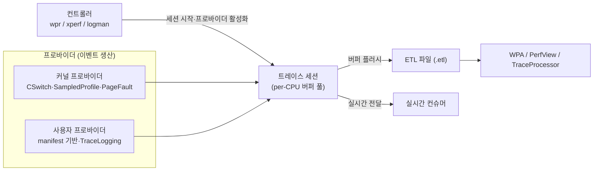

**ETW(Event Tracing for Windows) 성능 분석**이란 Windows 커널에 내장된 고성능 이벤트 트레이싱 인프라를 이용해, 커널·애플리케이션 이벤트를 낮은 오버헤드로 수집하고 CPU 사용·대기(wait)·스케줄링 지연을 시간축 위에서 재구성하는 기법입니다. Linux에서 perf와 ftrace가 하는 일을 Windows에서는 ETW 하나의 인프라가 담당합니다. [샘플링 프로파일링](/post/profiling-analysis/sampling-profiling-perf-vtune/)이 "어느 코드가 CPU를 쓰는가"에 답한다면, ETW는 여기에 더해 "내 스레드가 왜 CPU를 못 받았는가"까지 답할 수 있습니다. µs 단위 지연을 다루는 엔지니어에게 이 두 번째 질문이 결정적인 이유는, 저지연 시스템의 꼬리 지연 상당수가 코드 실행 시간이 아니라 컨텍스트 스위치·스케줄러 대기·페이지 폴트 같은 OS 레벨 사건에서 오기 때문입니다. 이 장에서는 ETW의 아키텍처(프로바이더·세션·컨슈머), WPR/WPA 워크플로우, CPU 샘플링과 Wait 분석의 차이, xperf 저수준 제어, 그리고 TraceLogging 기반 커스텀 계측을 다룹니다.

## 이 장을 읽기 전에

**선행 챕터**: [샘플링 프로파일링: perf·VTune 원리](/post/profiling-analysis/sampling-profiling-perf-vtune/)에서 다룬 샘플링의 통계적 성격과, [트레이싱 프로파일링: Perfetto·Tracy](/post/profiling-analysis/tracing-profiling-perfetto-tracy/)에서 다룬 "샘플링 vs 트레이싱" 구분을 전제로 합니다. ETW는 두 성격을 모두 가진 인프라이므로 이 구분이 서 있어야 각 기능의 위치가 잡힙니다. 스택을 읽는 법은 [Flame Graph 분석](/post/profiling-analysis/flame-graph-analysis/)을 함께 보면 좋습니다.

**전제 지식**: Windows에서 C++ 빌드(MSVC)와 관리자 권한 터미널 사용이 가능해야 하고, 컨텍스트 스위치·스레드 상태(Running/Ready/Waiting)의 기본 개념을 알아야 합니다.

**이 장의 깊이**: 심화. ETW 아키텍처의 내부 동작(버퍼링·스택 워킹·이벤트 유실)까지 서술하되, µs 지연 분석에 필요한 부분에 집중합니다.

**다루지 않는 것**: 힙 할당 추적(`wpr -heaptracingconfig` 등)은 [메모리 프로파일링: 힙 분석](/post/profiling-analysis/memory-profiling-heap-analysis/)으로, PMU 카운터의 의미론은 [하드웨어 성능 카운터](/post/profiling-analysis/hardware-performance-counters/)로, VTune이 Windows에서 ETW를 활용하는 방식은 [Intel VTune 심화](/post/profiling-analysis/intel-vtune-deep-dive/)로 위임합니다. ETW를 보안 텔레메트리(EDR)로 쓰는 주제는 이 트랙의 범위 밖입니다.

## 당신의 수준에 맞는 경로

| 수준 | 읽을 부분 | 핵심 목표 |
|------|---------|---------|
| **초보자** | "ETW 아키텍처" ~ "WPR/WPA 워크플로우" | 프로바이더·세션·컨슈머 모델과 기본 캡처·분석 절차 이해 |
| **중급자** | "CPU 샘플링과 Wait 분석" ~ "xperf" | Sampled/Precise 테이블을 구분하고 Ready Time으로 스케줄링 지연을 진단 |
| **전문가** | "TraceLogging 커스텀 계측" ~ "비판적 시각" | µs 구간을 커스텀 이벤트로 계측하고 ETW의 한계·오버헤드를 판단 |

---

## ETW의 역사: 25년 된 커널 트레이싱 인프라

ETW는 **Windows 2000**(2000년 출시)에서 커널 수준 트레이싱 기능으로 처음 도입되었습니다. 설계 논문 격인 Microsoft의 문서들은 처음부터 "재부팅 없이 프로덕션 환경에서 동적으로 켜고 끌 수 있는 저오버헤드 트레이싱"을 목표로 명시했고, 이 목표가 이후 25년간 아키텍처를 지배했습니다. Windows Vista(2006)에서 manifest 기반 프로바이더와 통합 이벤트 로깅(Unified Event Logging)이 추가되며 OS 자체의 표준 텔레메트리 통로가 되었고, 오늘날 Windows에는 수천 개의 시스템 프로바이더가 등록되어 있습니다.

분석 도구의 계보도 함께 정리해 둘 필요가 있습니다. **xperf**는 Windows Vista/Server 2008 시기의 Windows Performance Toolkit(WPT)과 함께 등장한 커맨드라인 캡처·후처리 도구입니다. <strong>WPR(Windows Performance Recorder)</strong>과 <strong>WPA(Windows Performance Analyzer)</strong>는 Windows 8 ADK(2012)에서 xperf의 후계로 도입되어, 프로파일(.wprp) 기반 기록과 GUI 분석을 담당합니다. **TraceLogging**은 Windows 10(2015)에서 추가된, manifest 없이 자기서술(self-describing) 이벤트를 쓰는 최신 프로바이더 API입니다. WPA는 현재 [Microsoft Store로 배포](https://apps.microsoft.com/detail/9n0w1b2bxgnz?hl=en-US&gl=US)되어 ADK 릴리스 주기와 분리된 업데이트를 받고 있으며(2026년 1월에도 갱신됨), 최근에는 WPR/WPA에 NPU(Neural Processing Unit) 사용량 프로파일 분석이 추가되는 등 CPU 밖의 실행 자원으로 범위를 넓히는 중입니다.

## ETW 아키텍처: 프로바이더·세션·컨트롤러·컨슈머

ETW를 처음 접할 때 가장 중요한 것은 도구 이름이 아니라 역할 모델입니다. WPR, xperf, logman, PerfView가 전부 달라 보여도 모두 같은 네 가지 역할 위에서 동작하기 때문입니다. Microsoft 공식 문서는 ETW를 이렇게 정의합니다.

> "Event Tracing for Windows (ETW) is an efficient kernel-level tracing facility that lets you log kernel or application-defined events to a log file." — Microsoft, [About Event Tracing](https://learn.microsoft.com/en-us/windows/win32/etw/about-event-tracing) (Microsoft Learn)

네 가지 역할은 다음과 같습니다. <strong>프로바이더(provider)</strong>는 이벤트를 생산하는 주체로, 커널 자신(컨텍스트 스위치, 페이지 폴트, 디스크 I/O)일 수도 있고 여러분의 애플리케이션일 수도 있습니다. <strong>세션(session)</strong>은 커널이 관리하는 이벤트 수집 파이프라인으로, per-CPU 버퍼 풀을 가지며 이벤트를 파일(.etl)로 흘리거나 실시간 컨슈머에게 전달합니다. <strong>컨트롤러(controller)</strong>는 세션을 시작·중지하고 어떤 프로바이더를 어떤 키워드·레벨로 활성화할지 결정합니다(wpr, xperf, logman이 여기에 해당). <strong>컨슈머(consumer)</strong>는 ETL 파일이나 실시간 세션에서 이벤트를 읽어 해석합니다(WPA, PerfView, TraceProcessor 라이브러리).



이 구조에서 성능상 핵심은 **per-CPU 버퍼링**입니다. 프로바이더가 이벤트를 쓸 때 전역 락을 잡는 것이 아니라 현재 CPU에 배정된 버퍼에 기록하므로, 멀티코어에서 이벤트 기록 경합이 거의 없습니다. 버퍼가 차면 플러시 스레드가 파일로 내리며, 생산 속도가 소비 속도를 넘으면 이벤트가 <strong>유실(lost events)</strong>됩니다. 유실은 조용히 일어나고 세션 통계에 카운트만 남으므로, 캡처 후 `wpr -status`나 WPA의 진단 메시지에서 dropped event 수를 확인하는 습관이 필요합니다. 또 하나의 하드 리밋으로, 헤더를 포함한 단일 이벤트 크기는 64KB를 넘을 수 없습니다.

프로바이더는 네 종류가 있으며, 새로 작성하는 코드라면 사실상 두 가지만 고려하면 됩니다.

| 프로바이더 유형 | 이벤트 정의 방식 | 동시 세션 | 현재 위상 |
|---|---|---|---|
| MOF (classic) | MOF 클래스 | 1개 | 레거시 |
| WPP | 소스 전처리(.pdb 내 TMF) | 1개 | 드라이버 디버그 로깅 |
| Manifest 기반 | XML manifest 등록 | 최대 8개 | OS·대형 앱 표준 |
| TraceLogging | 자기서술 이벤트 | 최대 8개 | 신규 코드 권장 |

manifest 기반은 이벤트 스키마를 시스템에 등록해야 하는 대신 도구 호환성이 넓고, TraceLogging은 등록 없이 이벤트 자체에 스키마를 실어 배포가 단순합니다. µs 계측 목적의 애플리케이션 이벤트라면 TraceLogging이 기본 선택입니다(뒤에서 코드로 다룹니다).

## WPR/WPA 워크플로우: 기록에서 분석까지

가장 자주 쓰는 경로는 WPR로 기록하고 WPA로 여는 것입니다. WPR은 "프로파일(.wprp)"이라는 XML 선언으로 어떤 프로바이더·키워드·스택 캡처를 켤지 묶어두고, 커맨드라인에서는 프로파일 이름만 지정합니다. 내장 프로파일만으로도 CPU 분석은 충분히 시작할 수 있습니다.

```powershell
# 관리자 권한 터미널에서: CPU 프로파일(샘플링+컨텍스트 스위치+스택) 기록 시작
wpr -start CPU -filemode

# ... 여기서 측정 대상 워크로드 실행 ...

# 기록 중지 및 ETL 저장 (설명 문자열은 선택이지만 권장)
wpr -stop trace.etl "order engine p99 spike repro"

# WPA로 열기
wpa trace.etl
```

`-filemode`는 메모리 모드 대신 파일로 직접 기록하는 옵션입니다. 기본인 메모리 모드는 링 버퍼처럼 최근 구간만 유지하므로 "문제가 발생한 순간 stop"하는 사후 캡처에 적합하고, 파일 모드는 처음부터 끝까지 남기므로 재현 가능한 벤치마크 구간 기록에 적합합니다. 반대로 파일 모드는 디스크가 찰 때까지 무한히 자랄 수 있다는 점을 주의해야 합니다. 전체 옵션은 [WPR Command-Line Options](https://learn.microsoft.com/en-us/windows-hardware/test/wpt/wpr-command-line-options) 문서가 1차 출처입니다.

기록보다 분석에서 더 자주 막히는 것이 **심볼 설정**입니다. WPA는 스택 주소를 함수 이름으로 해석하기 위해 PDB가 필요하므로, 분석 전에 심볼 경로를 환경 변수로 지정해 둡니다.

```powershell
# Microsoft 공개 심볼 서버 + 로컬 빌드 PDB 경로
$env:_NT_SYMBOL_PATH = "srv*C:\Symbols*https://msdl.microsoft.com/download/symbols;C:\MyApp\build\Release"
wpa trace.etl
```

WPA에서 Trace → Load Symbols를 실행하면 첫 로드는 심볼 다운로드 때문에 수 분이 걸릴 수 있습니다. 자체 빌드 바이너리는 릴리스 빌드에서도 `/Zi`(PDB 생성)와 `/DEBUG:FULL` 링크 옵션을 켜 두어야 스택이 해석됩니다 — 최적화에는 영향이 없고 PDB 파일만 커집니다. 어떤 최적화 플래그가 스택 워킹에 영향을 주는지는 [Tr.03의 어셈블리 레벨 코드 생성 분석](/post/compiler-optimization/code-generation-analysis-assembly/)과 함께 보면 좋습니다.

팀에서 반복 사용할 캡처라면 내장 프로파일 대신 커스텀 .wprp를 만들어 저장소에 커밋하는 편이 재현성에 좋습니다. 아래는 CPU 샘플링·디스패처 이벤트와 커스텀 TraceLogging 프로바이더를 함께 켜는 최소 프로파일입니다.

```xml
<?xml version="1.0" encoding="utf-8"?>
<WindowsPerformanceRecorder Version="1.0">
  <Profiles>
    <SystemCollector Id="SC" Name="NT Kernel Logger">
      <BufferSize Value="1024"/> <BufferCount Value="64"/>
    </SystemCollector>
    <EventCollector Id="EC" Name="UserCollector">
      <BufferSize Value="256"/> <BufferCount Value="32"/>
    </EventCollector>
    <SystemProvider Id="SP">
      <Keywords>
        <Keyword Value="ProcessThread"/> <Keyword Value="Loader"/>
        <Keyword Value="SampledProfile"/> <Keyword Value="CSwitch"/>
        <Keyword Value="ReadyThread"/>
      </Keywords>
      <Stacks>
        <Stack Value="SampledProfile"/> <Stack Value="CSwitch"/>
        <Stack Value="ReadyThread"/>
      </Stacks>
    </SystemProvider>
    <EventProvider Id="EP_Order" Name="*MyCompany-OrderEngine"/>
    <Profile Id="OrderLat.Verbose.File" Name="OrderLat" Description="Order engine latency"
             DetailLevel="Verbose" LoggingMode="File">
      <Collectors>
        <SystemCollectorId Value="SC"><SystemProviderId Value="SP"/></SystemCollectorId>
        <EventCollectorId Value="EC"><EventProviders><EventProviderId Value="EP_Order"/></EventProviders></EventCollectorId>
      </Collectors>
    </Profile>
  </Profiles>
</WindowsPerformanceRecorder>
```

`Name="*MyCompany-OrderEngine"`의 별표는 "프로바이더 이름을 해시해 GUID를 만든다"는 TraceLogging 관례로, GUID를 직접 관리하지 않아도 이름만으로 프로바이더를 지정할 수 있게 해 줍니다. 이 프로파일은 `wpr -start orderlat.wprp!OrderLat`으로 시작합니다. 버퍼 크기·개수는 이벤트 유실이 관측되면 늘리되, 그만큼 논페이지드 메모리를 소비한다는 트레이드오프가 있습니다.

## CPU 샘플링과 Wait 분석: Sampled vs Precise

WPA의 CPU 분석에는 이름이 비슷하지만 데이터 원천이 완전히 다른 두 테이블이 있습니다. <strong>CPU Usage (Sampled)</strong>는 프로파일 인터럽트가 주기적으로 각 CPU에서 실행 중인 스택을 찍은 결과이고, <strong>CPU Usage (Precise)</strong>는 커널 스케줄러가 남긴 컨텍스트 스위치(CSwitch)·ReadyThread 이벤트를 재구성한 결과입니다. Sampled는 "CPU 위에서 어떤 코드가 돌았는가"를 통계적으로 보여주고, Precise는 "스레드가 언제 CPU를 얻고 잃었는가"를 스위치 단위로 정확히 보여줍니다. 이 구분과 각 컬럼의 의미는 Microsoft의 [CPU Analysis](https://learn.microsoft.com/en-us/windows-hardware/test/wpt/cpu-analysis) 문서가 표준 레퍼런스입니다.

µs 관점에서 중요한 수치 하나: WPR의 기본 샘플링 간격은 10000×100ns = **1ms**이며, `wpr -setprofint`로 최소 1221×100ns ≈ **122µs**까지 줄일 수 있습니다(약 8.2kHz). 즉 샘플링만으로는 수십 µs짜리 단일 사건을 포착할 수 없고, 1ms 간격에서 100µs 함수는 10번 실행돼야 평균 1개의 샘플을 얻습니다. 샘플 수가 적을 때의 통계적 해석은 [통계적 벤치마킹](/post/profiling-analysis/statistical-benchmarking/)에서 다룬 신뢰 구간 논리가 그대로 적용됩니다.

반면 **Wait 분석**은 Precise 테이블의 영역입니다. 스레드가 블로킹에서 깨어나 다시 실행되기까지는 "대기 → Ready(깨어났지만 CPU 대기) → Running"의 두 단계가 있는데, Precise 테이블은 이를 컬럼으로 분리해 줍니다.

```text
NewProcess      NewThreadStack (요약)            Count   Waits (us) Max  Ready (us) Max
--------------- -------------------------------- ------ --------------- -----------
order_engine.exe WaitForSingleObject              1,204        18,340.2       912.6
  └ RecvLoop::Wait                                 1,204        18,340.2       912.6
order_engine.exe SleepConditionVariableSRW           88           410.9     3,206.4
```

이 출력(예시)을 읽는 법: 첫 행은 네트워크 수신 대기가 최대 18.3ms까지 늘어졌다는 뜻으로, 이는 상대가 늦게 보낸 것이므로 내 코드 문제가 아닐 수 있습니다. 두 번째 행이 진짜 신호입니다 — 대기 자체(Waits)는 짧은데 **Ready Time**이 최대 3.2ms라는 것은, 조건 변수가 signal된 뒤에도 스레드가 3.2ms 동안 CPU를 배정받지 못했다는 뜻입니다. 원인은 코어 포화, 우선순위 역전, 잘못된 어피니티 등 스케줄링 쪽에 있으며, 이때 **ReadyThreadStack** 컬럼을 펼치면 "누가 내 스레드를 깨웠는지"까지 스택으로 확인할 수 있습니다. 이 Ready Time이야말로 다른 샘플링 프로파일러가 보여주지 못하는, ETW Wait 분석의 고유 가치이며 [Tail Latency 분석](/post/profiling-analysis/tail-latency-analysis/)에서 다룬 꼬리 지연의 흔한 범인입니다.

정리하면 사용 순서는 이렇습니다. CPU-bound 병목은 Sampled로 시작해 [Flame Graph](/post/profiling-analysis/flame-graph-analysis/) 형태로 훑고, "CPU는 놀고 있는데 느리다"는 증상은 Precise의 Waits·Ready로 넘어갑니다. 두 테이블을 같은 시간축에 놓고 비교하는 습관이 WPA 분석의 핵심 기술입니다.

## xperf: 커널 플래그를 직접 제어하는 저수준 경로

xperf는 WPR보다 오래된 도구지만, 커널 그룹 플래그와 스택 워킹 대상을 인라인으로 정밀 제어할 수 있어 여전히 쓰입니다. WPR 프로파일 XML을 만들 것도 없이 한 줄로 "무엇을 켤지"를 명시하고 싶을 때, 그리고 스크립트에서 캡처를 자동화할 때 유용합니다.

```powershell
# 프로세스/이미지 로드 + 1ms 샘플링 + 디스패처 이벤트, 세 종류 이벤트에 스택 캡처
xperf -on PROC_THREAD+LOADER+PROFILE+CSWITCH+DISPATCHER -stackwalk Profile+CSwitch+ReadyThread -f kernel.etl

# ... 워크로드 실행 ...

# 중지 및 병합(심볼 식별 정보 주입) — merged.etl을 WPA로 연다
xperf -stop -d merged.etl
```

`-stackwalk` 인자가 ETW 스택 캡처의 실체를 잘 보여줍니다. ETW는 "모든 순간"의 스택을 찍는 것이 아니라 **지정한 이벤트가 발생하는 순간**의 스택을 커널 모드에서 걷어 이벤트에 첨부합니다. 스택 캡처는 이벤트당 수 µs 수준의 추가 비용을 만들 수 있으므로(플랫폼·스택 깊이에 따라 다름), 컨텍스트 스위치가 초당 수십만 번 일어나는 시스템에서 CSwitch 스택을 켜면 관측 오버헤드와 이벤트 유실이 급증할 수 있습니다. 필요한 이벤트에만 스택을 켜는 것이 원칙입니다.

xperf에는 후처리 기능도 있습니다. `xperf -i merged.etl -o out.csv -a dumper` 같은 액션(action)으로 이벤트를 텍스트로 덤프해 스크립트 파이프라인에 물릴 수 있고, GUI 없이 회귀 검증을 자동화할 때는 이 경로 또는 .NET의 TraceProcessor 라이브러리가 실용적입니다. 프로그램 방식 분석을 팀 워크플로우에 넣는 설계는 [프로파일링 워크플로우 가이드](/post/profiling-analysis/profiling-workflow-team-guide/)에서 다룹니다.

## TraceLogging으로 커스텀 계측: µs 구간에 마커 박기

샘플링 간격(최소 ~122µs)보다 짧은 구간을 다루는 저지연 코드에서는, 결국 관심 구간의 시작·끝을 애플리케이션이 직접 이벤트로 남기는 **커스텀 계측**이 필요합니다. ETW에서 이를 위한 현대적 API가 TraceLogging입니다. manifest 등록 없이 헤더 하나로 동작하고, 이벤트에 스키마가 내장되어 WPA·PerfView가 즉시 디코딩합니다. API 개요는 [TraceLogging 공식 문서](https://learn.microsoft.com/en-us/windows/win32/tracelogging/trace-logging-portal)를 참고하세요.

아래는 핫패스 한 구간의 지연을 µs로 측정해 ETW 이벤트로 남기는 완결된 예제입니다. MSVC에서 `cl /O2 /EHsc order_trace.cpp advapi32.lib`로 빌드됩니다.

```cpp
// order_trace.cpp — TraceLogging으로 구간 지연을 ETW 이벤트로 기록
#include <windows.h>
#include <TraceLoggingProvider.h>
#include <cstdint>

// 프로바이더 정의: 이름 "MyCompany-OrderEngine", GUID는 이름 해시와 일치시키거나 고정 GUID 사용
TRACELOGGING_DEFINE_PROVIDER(
    g_hProvider,
    "MyCompany-OrderEngine",
    (0x6e5e5cbc, 0x8359, 0x46c9, 0x9b, 0x35, 0xa6, 0x0f, 0x3c, 0x36, 0x8f, 0x27));

static double ProcessOrder(uint64_t orderId) {
    // 실제로는 주문 파싱·검증·가격 계산 등 핫패스 로직이 들어간다.
    return 100.0 + double(orderId % 7);
}

int wmain() {
    TraceLoggingRegister(g_hProvider);
    LARGE_INTEGER freq, t0, t1;
    QueryPerformanceFrequency(&freq);

    for (uint64_t id = 0; id < 100'000; ++id) {
        QueryPerformanceCounter(&t0);
        double px = ProcessOrder(id);
        QueryPerformanceCounter(&t1);
        const double us = double(t1.QuadPart - t0.QuadPart) * 1e6 / double(freq.QuadPart);
        TraceLoggingWrite(g_hProvider, "OrderProcessed",
            TraceLoggingValue(id, "order_id"),
            TraceLoggingValue(us, "latency_us"),
            TraceLoggingValue(px, "price"));
    }
    TraceLoggingUnregister(g_hProvider);
    return 0;
}
```

주의점 두 가지. 첫째, `TraceLoggingWrite`는 프로바이더가 어떤 세션에도 활성화되지 않았으면 내부의 enabled 체크에서 몇 ns 만에 반환하므로, 계측 코드를 프로덕션 바이너리에 상시 포함해도 비활성 시 비용은 사실상 분기 하나입니다. 활성화 시에는 이벤트당 대략 수백 ns~수 µs가 들며(페이로드 크기·스택 캡처 여부·플랫폼에 따라 다름), 초당 수백만 이벤트급 핫패스라면 이벤트를 샘플링(N건당 1건)하거나 링 버퍼에 모아 배치로 쓰는 완화가 필요합니다. 둘째, 위처럼 QPC로 구간을 직접 재는 방식과 별개로, 시작·끝을 각각 이벤트로 남기고(WPA의 Generic Events에서 두 이벤트 간 시간을 보게) 하는 방식도 있는데, 후자는 이벤트 수가 2배가 되는 대신 구간 도중의 컨텍스트 스위치·대기와 시간축에서 겹쳐볼 수 있다는 장점이 있습니다. 캡처는 앞서 만든 .wprp의 `*MyCompany-OrderEngine` 항목으로 하면 되고, 기록된 이벤트는 WPA의 Generic Events 테이블에서 `latency_us` 컬럼으로 정렬·히스토그램화할 수 있습니다.

이 패턴은 [Microbenchmark 설계 원칙](/post/profiling-analysis/microbenchmark-design-principles/)에서 다룬 "격리 측정"과 상호 보완적입니다. 벤치마크는 통제된 환경에서 코드 조각의 비용을 재고, TraceLogging 계측은 실제 실행 맥락(다른 스레드·OS 활동 포함)에서 같은 구간의 분포를 잽니다. 둘의 수치가 크게 어긋난다면 그 차이 자체가 "환경 요인이 지연을 지배한다"는 정보입니다.

## 흔한 오개념 교정

**오개념 1: "샘플링 프로파일이 있으니 µs 병목도 보일 것이다."** 기본 1ms(최소 ~122µs) 간격의 샘플링은 통계적 집계이지 개별 사건의 기록이 아닙니다. 50µs짜리 지연 스파이크가 하루 몇 번 발생하는 문제라면 샘플에 잡힐 확률이 극히 낮습니다. 이런 문제는 Precise(컨텍스트 스위치) 데이터나 커스텀 이벤트처럼 **모든 발생을 기록하는** 트레이싱 데이터로 잡아야 합니다. 샘플링은 "총 CPU 시간을 어디에 쓰는가"용, 트레이싱은 "그 한 번이 왜 느렸는가"용입니다.

**오개념 2: "CPU Usage (Sampled)와 (Precise)는 같은 데이터의 정밀도 차이다."** 이름 탓에 흔한 오해지만 데이터 원천이 다릅니다. Sampled는 프로파일 인터럽트(주기적), Precise는 스케줄러 이벤트(발생 기반)입니다. 그래서 Precise는 CPU 시간을 100ns 단위로 정확히 계산하고 대기·Ready를 보여주지만, **두 스위치 사이에 CPU에서 어떤 함수가 돌았는지는 모릅니다**. 반대로 Sampled는 실행 중 코드 위치를 알지만 대기는 전혀 보지 못합니다. 하나가 다른 하나의 상위 호환이 아니라 서로 직교하는 관점입니다.

**오개념 3: "ETW는 무거워서 프로덕션에서 못 쓴다."** ETW는 처음부터 프로덕션 상시 사용을 전제로 설계되었고, Windows 자체가 부팅 직후부터 다수의 autologger 세션을 상시 가동합니다. 오버헤드는 ETW라는 인프라가 아니라 **무엇을 켰는가**의 함수입니다. 저빈도 커스텀 이벤트 몇 개는 사실상 공짜에 가깝고, 전체 CSwitch에 스택 캡처를 붙이면 부하가 큽니다. "ETW를 켠다/끈다"가 아니라 "어떤 프로바이더·키워드·스택을 켠다"로 사고해야 하며, 이는 [지속적 프로파일링](/post/profiling-analysis/continuous-profiling-production/)의 오버헤드 예산 논의와 같은 프레임입니다.

## 판단 기준: 언제 ETW를 쓰고, 언제 다른 도구로 갈 것인가

| 상황 | 권장 접근 |
|------|-----------|
| Windows에서 CPU-bound 핫스팟 탐색 | WPR CPU 프로파일 → WPA Sampled + [Flame Graph](/post/profiling-analysis/flame-graph-analysis/) |
| "CPU는 여유 있는데 느리다" (블로킹·스케줄링 의심) | WPA Precise의 Waits·Ready Time·ReadyThreadStack — ETW가 최적인 영역 |
| 샘플링 간격보다 짧은 구간의 지연 분포 | TraceLogging 커스텀 이벤트 + Generic Events 분석 |
| 마이크로아키텍처 원인(캐시 미스·분기 예측) 규명 | ETW PMC보다 [VTune](/post/profiling-analysis/intel-vtune-deep-dive/)·[하드웨어 카운터](/post/profiling-analysis/hardware-performance-counters/) 경로가 해석에 유리 |
| 게임·프레임 루프의 구간별 시각화 | [Tracy 같은 인앱 트레이서](/post/profiling-analysis/tracing-profiling-perfetto-tracy/)가 반복 작업엔 가벼움 |
| Linux 동일 작업 | [perf 고급](/post/profiling-analysis/linux-perf-advanced/)·[BPF 기반 프로파일링](/post/profiling-analysis/bpf-based-profiling-bpftrace-bcc/)으로 대응 |
| 힙 할당 추적 | ETW heap 세션은 무겁다 — [힙 분석 챕터](/post/profiling-analysis/memory-profiling-heap-analysis/)의 도구 선택 기준 참조 |

체크리스트로 요약하면: (1) 관리자 권한을 얻을 수 있는가(ETW 세션 제어에 필요), (2) 질문이 "실행 시간"인가 "대기 시간"인가, (3) 대상 사건의 지속 시간이 샘플링 간격보다 긴가 짧은가, (4) 캡처를 일회성 GUI 분석으로 볼 것인가 자동화 파이프라인에 넣을 것인가(후자면 xperf 액션·TraceProcessor). 이 네 답이 정해지면 위 표에서 경로가 하나로 좁혀집니다.

## 비판적 시각: ETW의 한계와 트레이드오프

ETW의 가장 큰 비용은 성능이 아니라 **학습 곡선과 마찰**입니다. 프로바이더 GUID·키워드·레벨·세션이라는 개념 부채가 크고, WPA는 강력하지만 첫 화면에서 무엇을 클릭해야 할지 알 수 없는 UI라는 비판을 오래 받아 왔습니다. 심볼 로딩은 느리고 실패 시 원인 진단이 어려우며, verbose 캡처의 ETL 파일은 수 분 만에 수 GB에 달해 공유·보관이 부담스럽습니다. Linux의 perf가 단일 바이너리에 man 페이지 문화로 접근성을 확보한 것과 대비되는 지점입니다.

기술적 한계도 명확합니다. 이벤트는 64KB를 넘을 수 없고, 고부하에서 버퍼가 포화하면 이벤트가 조용히 유실되며 유실 여부를 사후에 통계로만 알 수 있습니다. 실시간 컨슈머는 처리 속도가 밀리면 역시 이벤트를 놓칩니다. 커널 이벤트의 상당수는 시스템 전역 단위로만 켜지므로 멀티테넌트 서버에서 "내 프로세스만" 깔끔하게 격리하기 어렵고, 세션 제어에 관리자 권한이 필요해 권한이 제한된 환경(잠긴 프로덕션, 고객사 장비)에서는 워크플로우 자체가 성립하지 않을 수 있습니다. 또한 ETW 타임스탬프 해상도(기본 QPC)와 이벤트 기록 경로의 지연 때문에, 수백 ns 이하의 사건 순서를 ETW 이벤트 순서로 단정하는 것은 위험합니다.

마지막으로 생태계 관점의 트레이드오프가 있습니다. ETW는 Windows 전용이므로, 크로스 플랫폼 코드베이스는 결국 perf/BPF(Linux)와 ETW(Windows)를 이중으로 다루거나 Tracy·Perfetto 같은 크로스 플랫폼 계측 레이어를 추가로 얹게 됩니다. 후자를 택하면 도구는 단순해지지만 ETW 고유의 강점인 커널 스케줄러 가시성(Ready Time, ReadyThreadStack)은 포기하게 됩니다. "어느 쪽 가시성이 지금 문제에 필요한가"가 선택 기준이지, 어느 한쪽이 항상 옳은 것은 아닙니다.

## 마무리

이 장의 목표를 달성했는지 다음 기준으로 확인하세요.

- [ ] 컨트롤러·프로바이더·세션·컨슈머의 역할과 per-CPU 버퍼링, 이벤트 유실 조건을 설명할 수 있다.
- [ ] `wpr -start/-stop`으로 캡처하고 심볼을 설정해 WPA에서 스택을 해석할 수 있다.
- [ ] CPU Usage (Sampled)와 (Precise)의 데이터 원천 차이를 설명하고, Ready Time으로 스케줄링 지연을 진단할 수 있다.
- [ ] xperf로 커널 플래그·스택 워킹 대상을 직접 지정해 캡처를 자동화할 수 있다.
- [ ] TraceLogging으로 µs 구간 커스텀 이벤트를 계측하고 활성/비활성 시 오버헤드 특성을 판단할 수 있다.

**다음 장에서는** 실행 환경을 시뮬레이터 위로 옮깁니다. [Valgrind·Callgrind: 캐시 시뮬레이션과 호출 그래프](/post/profiling-analysis/valgrind-callgrind-cache-simulation/)에서 실제 하드웨어 대신 명령어 단위 시뮬레이션으로 캐시 동작과 호출 비용을 결정론적으로 재는 방법을 다룹니다. ETW·perf 같은 실측 도구와 시뮬레이션 도구가 각각 무엇을 보고 무엇을 못 보는지 대비하며 읽으면 도구 지도가 완성됩니다. 이전 장은 [AMD μProf 활용](/post/profiling-analysis/amd-uprof-profiling/)입니다.
