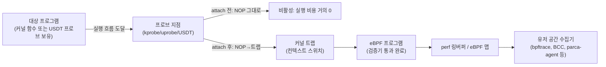

**BPF 기반 동적 프로파일링**이란 커널을 재컴파일하거나 대상 프로그램을 재시작하지 않고도, 실행 중인 커널 함수와 유저 공간 함수에 프로브를 동적으로 붙여 지연시간·호출 빈도·인자값을 관찰하는 기법을 말합니다. `perf`나 VTune 같은 샘플링 프로파일러가 "어디에 시간이 쓰이는가"를 통계적으로 보여준다면, bpftrace·BCC는 "이 특정 함수가 호출될 때 정확히 무슨 일이 일어나는가"를 이벤트 단위로 캡처합니다. 프로덕션 시스템에서 재현이 어려운 간헐적 지연 스파이크, 특정 syscall의 꼬리 지연, 혹은 GPU 커널 실행 시간처럼 애플리케이션 코드 수정 없이는 계측점을 심기 어려운 경로를 다룰 때 이 접근이 필요해집니다.

## 이 장을 읽기 전에

**선행 챕터**: [Valgrind·Callgrind: 캐시 시뮬레이션과 호출 그래프](/post/profiling-analysis/valgrind-callgrind-cache-simulation/)에서 정적 계측 기반 프로파일링(캐시 시뮬레이션)을 다뤘습니다. 이 장은 그와 대비되는 **동적 계측**(실행 중 프로브 삽입)을 다룹니다.

**전제 지식**: [03장: 샘플링 프로파일링](/post/profiling-analysis/sampling-profiling-perf-vtune/)에서 다룬 "샘플링 vs 계측(instrumentation)"의 차이, 리눅스 프로세스·syscall의 기본 동작, C/C++ 함수 심볼과 스택 프레임 개념을 전제로 합니다.

**이 장의 깊이**: 이 장은 **전문가** 난이도입니다. kprobe·uprobe·USDT의 동작 원리, bpftrace와 BCC의 역할 차이, 그리고 이 두 도구로 커버하지 못하는 GPU 커널 내부를 USDT 브리지로 관찰하는 프로덕션 사례(Polar Signals의 CUDA 상시 프로파일링)까지 다룹니다. **다루지 않는 것**: `perf`의 고급 옵션 전반([07장](/post/profiling-analysis/linux-perf-advanced/)), 하드웨어 성능 카운터의 세부 이벤트 선정([08장](/post/profiling-analysis/hardware-performance-counters/)), 상시 프로파일링 인프라 자체의 운영 설계([11장](/post/profiling-analysis/continuous-profiling-production/)), 분산 트레이싱 스팬 계측([17장](/post/profiling-analysis/distributed-tracing-microsecond-overhead/))입니다.

## 당신의 수준에 맞는 경로

| 수준 | 읽을 부분 | 핵심 목표 |
|------|---------|---------|
| **중급자** | "역사·배경"~"핵심 개념: kprobe·uprobe·USDT" | 세 프로브 타입이 각각 무엇을 계측하는지, NOP→트랩 치환 메커니즘 이해 |
| **중급자** | "bpftrace vs BCC" | 두 도구의 역할 차이와 선택 기준 이해 |
| **전문가** | "eBPF 기반 GPU 상시 프로파일링" ~ "비판적 시각" | USDT 브리지 설계, 오버헤드 실측 방법, 프로덕션 배포 판단 |

## 역사·배경

<strong>BPF(Berkeley Packet Filter)</strong>는 1992년 Steven McCanne와 Van Jacobson이 네트워크 패킷을 커널 안에서 빠르게 필터링하기 위해 고안한 작은 가상 머신입니다. 이 아이디어는 2014년경 Alexei Starovoitov가 리눅스 커널에 <strong>eBPF(extended BPF)</strong>로 확장하면서 범용 인-커널 가상 머신으로 재탄생했고, 이후 네트워킹뿐 아니라 추적(tracing)·보안·관측성 전반의 기반 기술이 되었습니다. 동적 계측의 계보는 더 오래되었는데, Sun Microsystems가 Solaris용으로 만든 **DTrace**(2004년경, Bryan Cantrill 등)가 "프로덕션에서 상시 켜둘 수 있는 안전한 동적 추적"이라는 목표를 처음 제시했고, 리눅스 진영은 **SystemTap**과 커널의 **kprobes**(리눅스 2.6 계열에 도입)·**uprobes**(리눅스 3.5, 2012년)로 유사한 기능을 따라갔습니다. **USDT(User Statically-Defined Tracing)** 규약은 DTrace/SystemTap 생태계에서 정착된 "애플리케이션이 스스로 의미 있는 계측점을 선언하는" 방식이며, 바이너리의 `.note.stapsdt` ELF 섹션으로 표준화되었습니다. eBPF 기반 도구 중 <strong>BCC(BPF Compiler Collection)</strong>는 Brendan Gregg 등이 주도한 iovisor 프로젝트로 2015년경 등장해 Python으로 스크립트를 작성하고 C 코드를 그때그때 LLVM으로 컴파일하는 방식을 제공했고, **bpftrace**는 2018년 Alastair Robertson이 DTrace·awk 스타일의 고수준 언어로 더 짧은 스크립트를 즉석에서 실행할 수 있도록 만든 후속 도구입니다. 2026년 기준 bpftrace는 활발히 유지보수되고 있으며, libbpf·BTF·CO-RE(Compile Once – Run Everywhere) 기반으로 커널 버전 간 이식성을 개선해 왔습니다.

## 핵심 개념: kprobe·uprobe·USDT

**kprobe**는 커널 함수의 진입(entry)·복귀(return, kretprobe) 지점에 동적으로 계측점을 삽입하는 메커니즘입니다. 커널 함수의 첫 명령을 브레이크포인트(또는 아키텍처에 따라 ftrace 기반 트램폴린)로 바꿔두고, 실행이 그 지점에 도달하면 등록된 핸들러로 제어를 넘긴 뒤 원래 명령을 실행하고 복귀시킵니다. **uprobe**는 같은 메커니즘을 유저 공간 바이너리의 임의 주소(함수 심볼, 라이브러리 오프셋)에 적용한 것으로, 대상 프로세스를 재시작하거나 재컴파일할 필요가 없다는 점이 정적 계측과 다릅니다.

**USDT**는 uprobe의 특수한 형태로 볼 수 있는데, 애플리케이션 개발자가 `sys/sdt.h`의 `DTRACE_PROBE` 계열 매크로로 소스 코드에 "여기서 이런 인자를 관찰할 수 있다"는 지점을 미리 선언해 둔 것입니다. 비활성 상태에서 USDT 프로브는 **NOP(No Operation) 명령 한 줄**로 컴파일되어 실행 비용이 사실상 없고, 프로파일러가 uprobe로 그 지점을 attach하면 커널이 NOP을 인터럽트(트랩)로 치환해 eBPF 서브시스템으로 점프하도록 만듭니다. 이 치환·트랩·복귀 왕복은 시스템 콜과 비슷한 규모의 컨텍스트 스위치 비용을 수반하므로, "USDT는 항상 공짜"라는 말은 프로브가 꺼져 있을 때만 성립합니다. bpftrace·BCC 모두 uprobe에 refcount 기반 세마포어 지원이 있는 환경에서는 프로브가 실제로 attach된 프로세스에서만 활성화되도록 최적화합니다.

세 프로브 타입은 계측 대상의 위치만 다를 뿐 이후 파이프라인은 동일합니다. eBPF 프로그램이 검증기(verifier)를 통과해 커널에 로드되고, 이벤트가 발생할 때마다 실행되어 필요한 데이터를 맵(map)에 집계하거나 **perf 링버퍼**를 통해 유저 공간 수집기로 전달합니다.



## bpftrace vs BCC

**bpftrace**는 awk·DTrace를 닮은 고수준 DSL을 한 줄(one-liner) 또는 짧은 스크립트로 작성하면 내부적으로 LLVM을 통해 eBPF 바이트코드로 컴파일해 실행하는 도구입니다. 즉석에서 "이 커널 함수가 초당 몇 번 호출되는가"를 확인하는 탐색적 조사에 적합합니다.

```bash
# 어떤 프로세스가 vfs_read를 가장 많이 호출하는지 실시간 집계 (kprobe)
sudo bpftrace -e 'kprobe:vfs_read { @count[comm] = count(); }'

# malloc() 호출의 지연시간 히스토그램 (uprobe + uretprobe 쌍)
sudo bpftrace -e '
uprobe:/usr/lib/x86_64-linux-gnu/libc.so.6:malloc { @start[tid] = nsecs; }
uretprobe:/usr/lib/x86_64-linux-gnu/libc.so.6:malloc /@start[tid]/ {
  @latency_ns = hist(nsecs - @start[tid]);
  delete(@start[tid]);
}'
```

**BCC**는 Python 프론트엔드에서 C로 작성한 eBPF 프로그램 텍스트를 스크립트 실행 시점에 LLVM으로 컴파일하는 프레임워크입니다. bpftrace보다 코드량이 많지만, 복잡한 상태 머신이나 여러 맵을 조합하는 로직, 팀에서 장기적으로 유지보수할 도구를 만들 때 Python의 제어 흐름을 그대로 쓸 수 있다는 이점이 있습니다.

```python
from bcc import BPF

program = r"""
int trace_read_entry(struct pt_regs *ctx) {
    u64 pid = bpf_get_current_pid_tgid();
    bpf_trace_printk("read() entry pid=%d\n", pid);
    return 0;
}
"""

b = BPF(text=program)
b.attach_kprobe(event="vfs_read", fn_name="trace_read_entry")
b.trace_print()
```

두 도구는 경쟁 관계가 아니라 <strong>탐색적 원라이너(bpftrace) vs 재사용 가능한 도구(BCC 또는 libbpf 기반 CO-RE 프로그램)</strong>라는 용도 분리로 이해하는 편이 실무에 맞습니다.

## USDT로 애플리케이션에 계측점 선언하기

kprobe·uprobe는 이미 존재하는 함수 심볼에 의존하므로, 컴파일러가 인라이닝하거나 심볼을 제거하면 계측점이 사라질 수 있습니다. 애플리케이션이 "이 지점은 항상 관찰 가능해야 한다"고 보장하고 싶다면 USDT 매크로로 직접 선언하는 편이 안정적입니다. 아래 예제는 `sys/sdt.h`(Debian/Ubuntu 계열은 `systemtap-sdt-dev` 패키지)를 사용해 주문 처리 함수에 프로브를 심은 뒤, bpftrace로 그 프로브를 관찰합니다.

```cpp
#include <sys/sdt.h>
#include <chrono>
#include <thread>

// USDT 프로브 이름: orderapp:order_processed, 인자 2개(order_id, amount)
extern "C" void process_order(int order_id, double amount) {
  std::this_thread::sleep_for(std::chrono::microseconds(50));  // 처리 로직 자리
  DTRACE_PROBE2(orderapp, order_processed, order_id, amount);
}

int main() {
  for (int i = 0; i < 1000; ++i) process_order(i, i * 1.5);
}
```

`g++ -g order.cpp -o order_app` (systemtap-sdt-dev 필요)로 빌드한 뒤, 프로브가 실제로 심겼는지는 `readelf -n order_app`에서 `stapsdt` 노트를 확인하면 됩니다. 관찰은 다음처럼 합니다.

```bash
sudo bpftrace -e '
usdt:./order_app:orderapp:order_processed
{
  printf("order=%d amount=%.2f\n", arg0, arg1);
}'
```

**주의점**: USDT 프로브는 바이너리에 심는 순간부터 존재하지만, attach되지 않은 상태에서는 NOP이라 런타임 비용이 거의 없습니다. 다만 매크로가 인자를 준비하는 과정(여기서는 `order_id`, `amount` 레지스터 적재) 자체는 프로브 활성 여부와 무관하게 실행되므로, 인자 계산이 무거운 표현식이라면 아주 미세한 상수 비용이 항상 남습니다.

## eBPF 기반 GPU(CUDA) 상시 프로파일링: Polar Signals 사례

USDT와 eBPF의 조합이 가장 두드러지는 최근 사례는 GPU 커널 실행을 애플리케이션 코드 수정 없이 상시 관찰하는 문제입니다. NVIDIA CUDA는 커널 실행 타이밍을 얻는 표준 API로 <strong>CUPTI(CUDA Profiling Tools Interface)</strong>를 제공하지만, CUPTI 콜백을 커널 이벤트마다 파일에 기록하면 컨테이너 환경에서 상시 켜두기엔 I/O·직렬화 비용이 부담스럽습니다. Polar Signals는 `parcagpu`라는 얇은 shim 라이브러리를 `CUDA_INJECTION64_PATH` 메커니즘으로 대상 프로세스에 무수정 주입해 CUPTI 콜백을 구독하고, 커널 실행이 발생할 때마다 두 개의 USDT 프로브(`cuda_correlation`으로 실행 상관관계 ID를 노출하고, `kernel_executed`로 디바이스·스트림·커널명과 타이밍을 노출)를 발화시키는 구조를 만들었습니다. parca-agent는 이 두 프로브에 uprobe를 attach해 eBPF 프로그램으로 타이밍 데이터를 perf 링버퍼에 쌓고, 상관관계 ID로 비동기 실행 순서를 재조립합니다. 파일시스템 I/O나 직렬화 없이 공유 메모리 경로만 쓰기 때문에, 이 구조는 CUDA 그래프처럼 커널 실행이 얽힌 복잡한 워크로드에서도 상시(always-on) 프로덕션 프로파일링이 가능하다고 보고됩니다.

이 사례가 보여주는 일반화 가능한 패턴은 "관찰하고 싶은 계층(여기서는 GPU 드라이버 콜백)이 커널 프로브만으로는 닿지 않을 때, USDT를 유저 공간 브리지로 세워 eBPF 파이프라인에 연결한다"는 것입니다. 다만 이 사례는 부속 라이브러리(`parcagpu`)와 상관관계 ID 재조립 로직이라는 별도 엔지니어링을 요구하므로, 단순한 함수 지연시간 측정보다 구축 비용이 훨씬 큽니다. 상시 GPU 프로파일링 인프라 자체를 운영하는 문제(수집 주기, 저장소, 대시보드)는 [11장: 지속적 프로파일링](/post/profiling-analysis/continuous-profiling-production/)의 범위입니다.

## 흔한 오개념 교정

<strong>"eBPF는 항상 완전히 공짜(zero-cost)다"</strong>는 절반만 맞습니다. attach되지 않은 kprobe·uprobe·USDT는 원본 명령(또는 NOP) 그대로 실행되어 비용이 없지만, 일단 attach되면 매 호출마다 트랩·컨텍스트 스위치·eBPF 프로그램 실행·맵 갱신이라는 실제 비용이 발생합니다. 이 비용은 이벤트 발생 빈도에 비례해 누적되므로, 초당 수백만 번 호출되는 함수에 무분별하게 붙이면 프로덕션 지연시간 예산을 눈에 띄게 잠식할 수 있습니다.

<strong>"BCC와 bpftrace는 같은 도구의 다른 이름"</strong>도 흔한 오해입니다. 둘 다 eBPF·libbpf를 기반으로 하지만, BCC는 스크립트 실행 시점에 C 코드를 LLVM으로 컴파일하는 Python 프레임워크이고 bpftrace는 자체 DSL을 갖춘 독립 실행 파일입니다. 짧은 탐색적 질의에는 bpftrace가, 복잡한 로직이나 팀 표준 도구화에는 BCC(또는 libbpf 기반 CO-RE 프로그램)가 더 적합한 경우가 많습니다.

<strong>"kprobe로 커널 함수를 추적해도 시스템은 항상 안전하다"</strong>는 절반의 진실입니다. eBPF 검증기(verifier)가 무한 루프나 잘못된 메모리 접근 같은 크래시 유발 코드를 커널 로드 시점에 거부하는 것은 맞지만, 검증기는 "오버헤드가 감당할 만한가"까지는 판단하지 않습니다. 고빈도 함수에 무거운 핸들러를 붙이면 시스템이 죽지는 않아도 지연시간이 눈에 띄게 늘어날 수 있으므로, 배포 전 실측이 필요합니다.

## 오버헤드를 직접 측정하는 방법

"eBPF 프로브의 오버헤드는 작다"는 주장을 그대로 받아들이기보다, 대상 함수를 마이크로벤치마크로 감싸고 프로브를 attach한 상태와 아닌 상태를 비교하는 편이 안전합니다. 아래는 [02장: Google Benchmark 실전](/post/profiling-analysis/google-benchmark-practical/)에서 다룬 패턴을 그대로 재사용한 스켈레톤입니다. 함수를 `extern "C"`와 `noinline`으로 선언해 심볼 이름이 그대로 남도록 하는 점이 핵심입니다.

```cpp
#include <benchmark/benchmark.h>

extern "C" __attribute__((noinline)) int target_function(int x) {
  benchmark::DoNotOptimize(x);
  return x + 1;
}

static void BM_TargetFunction(benchmark::State& state) {
  int x = 0;
  for (auto _ : state) {
    x = target_function(x);
  }
}
BENCHMARK(BM_TargetFunction)->Repetitions(10);
BENCHMARK_MAIN();
```

`g++ -O2 -g bench.cpp -lbenchmark -lpthread -o bench` (x86-64, GCC 13 기준)로 빌드한 뒤, 먼저 프로브 없이 `./bench --benchmark_repetitions=10`을 실행해 p50 기준선을 기록합니다. 그다음 별도 터미널에서 `sudo bpftrace -e 'uprobe:./bench:target_function { @c = count(); }'`를 실행해 uprobe를 attach한 채로 같은 벤치마크를 다시 실행하고 두 결과를 비교합니다. 정확한 배율은 커널 버전(멀티 uprobe 배치 지원 여부)·아키텍처·핸들러 복잡도에 따라 달라지므로, 이 절차 자체를 재현 가능한 회귀 테스트로 남겨두고 해당 환경에서 직접 수치를 얻는 것이 이 장의 핵심 권장 사항입니다.

## 판단 기준

| 상황 | 권장 | 비권장 |
|------|------|--------|
| 커널·유저 이벤트를 빠르게 한 번 확인 | bpftrace 원라이너 | BCC로 매번 새 스크립트 작성 |
| 팀 표준 도구·복잡한 상태 로직 | BCC 또는 libbpf 기반 CO-RE 프로그램 | 긴 로직을 bpftrace 한 줄에 압축 |
| 상시 프로덕션 GPU/CUDA 관찰 | USDT + eBPF 브리지(parca-agent류 아키텍처) | 커널 이벤트마다 파일 로그 기록 |
| 초당 수백만 회 호출되는 함수 계측 | 배치·샘플링 비율 조정, 실측 후 결정 | 무분별한 전면 kprobe 배포 |
| 애플리케이션이 계측점을 스스로 보장 | USDT 매크로로 명시 선언 | 인라이닝될 수 있는 내부 함수 심볼에 uprobe 의존 |
| 오래된 커널(멀티 uprobe·BTF 미지원) | 기능 축소를 가정하고 폴백 확인 | 최신 커널 기능이 항상 있다고 가정 |

## 비판적 시각: 한계와 트레이드오프

eBPF 검증기는 크래시를 막아주지만 완전한 안전망은 아닙니다. 스택 크기 제한(전통적으로 512바이트), 제한된 루프 허용 범위, 헬퍼 함수 화이트리스트 등으로 복잡한 로직은 여러 개의 작은 프로그램(tail call)으로 쪼개야 하는 경우가 있고, 이는 도구 자체의 복잡도를 높입니다. 커널 버전 의존성도 실무에서 자주 부딪히는 벽입니다. 멀티 uprobe 배치 attach 같은 최적화는 비교적 최근 커널(6.6 이후)에서만 제공되고, BTF·CO-RE 지원 여부에 따라 동일한 bpftrace 스크립트가 오래된 커널에서는 그대로 동작하지 않을 수 있습니다. 권한 측면에서도 `CAP_BPF`·`CAP_PERFMON` 또는 사실상 root 권한이 필요해, 컨테이너·쿠버네티스 환경에서는 특권 컨테이너나 사이드카 배포가 불가피한 경우가 많고 이는 보안 검토 대상이 됩니다. 마지막으로, 이 장의 도구들은 "관찰 가능성의 마지막 수단"이지 첫 번째 선택지가 아닙니다. 애플리케이션 코드를 수정할 수 있다면 [04장의 트레이싱 계측](/post/profiling-analysis/tracing-profiling-perfetto-tracy/)이나 명시적 로깅이 더 낮은 유지보수 비용으로 같은 정보를 줄 수 있고, BPF 기반 동적 프로파일링은 코드 수정이 불가능하거나(서드파티 바이너리) 재현이 극히 드문 현상을 커널 경계에서 붙잡아야 할 때 쓰는 편이 합리적입니다.

## 마무리

- [ ] kprobe·uprobe·USDT가 각각 무엇을 계측하는지, 프로브가 NOP에서 트랩으로 바뀌는 attach 메커니즘을 설명할 수 있다.
- [ ] bpftrace와 BCC의 역할 차이를 판단 기준에 따라 상황별로 고를 수 있다.
- [ ] USDT + eBPF로 GPU(CUDA) 상시 프로파일링이 어떻게 구성되는지(Polar Signals 사례 기반)를 설명할 수 있다.
- [ ] 프로덕션에 동적 프로파일링을 배포하기 전에 마이크로벤치마크로 오버헤드를 직접 실측하는 절차를 설계할 수 있다.
- [ ] eBPF 검증기·커널 버전·권한이라는 세 가지 제약이 실무 배포에 어떤 제한을 거는지 판단할 수 있다.

**다음 장**에서는 커널 경계를 벗어나 서비스 간 호출을 잇는 **분산 트레이싱**을 다룹니다. OpenTelemetry 기반 스팬이 µs 단위 지연을 어떻게 놓치거나 왜곡하는지, 그리고 이 장에서 다룬 저수준 프로브가 분산 트레이싱의 계측 공백을 메우는 데 어떻게 쓰일 수 있는지 이어집니다.

→ [분산 트레이싱 오버헤드와 µs 탐지](/post/profiling-analysis/distributed-tracing-microsecond-overhead/)
