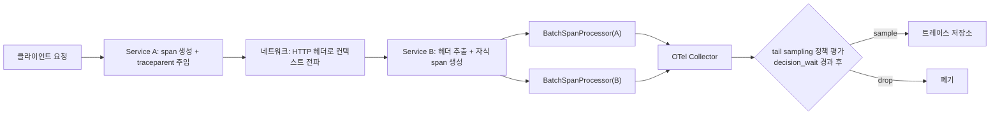

**분산 트레이싱 오버헤드**란 OpenTelemetry 같은 계측 프레임워크가 하나의 요청이 여러 서비스를 가로지르는 동안 스팬(span)을 생성하고, 그 컨텍스트를 다음 서비스로 전파하고, 완성된 스팬을 수집기(collector)로 내보내는 과정에서 애플리케이션에 추가로 부과하는 지연을 말합니다. µs 단위로 동작하는 서비스에서는 이 계측 자체가 측정 대상보다 더 큰 비용이 될 위험이 있습니다 — 트레이싱을 켜서 "느린 이유"를 찾으려다가 트레이싱 때문에 "느려지는" 역설이 흔히 발생합니다. 이 장은 스팬 생성·컨텍스트 전파·익스포트라는 세 단계 각각에서 비용이 어디서 생기는지 분해하고, 그 비용을 hot path에서 격리하는 방법과, 모든 요청을 다 수집하는 대신 의미 있는 요청(에러·꼬리 지연)만 남기는 head-based/tail-based 샘플링 전략을 다룹니다.

## 이 장을 읽기 전에

**완전한 초보자?** 이 장은 [04장: 트레이싱 프로파일링 — Perfetto·Tracy](/post/profiling-analysis/tracing-profiling-perfetto-tracy/)에서 다룬 "스팬 기반으로 실행을 표현한다"는 개념과, [09장: Tail Latency 분석](/post/profiling-analysis/tail-latency-analysis/)의 p95/p99 개념을 전제로 합니다. 단일 프로세스 안의 트레이서(Tracy 등)와 여러 서비스에 걸친 분산 트레이싱(OpenTelemetry)이 다른 문제라는 것만 구분할 수 있으면 충분합니다.

**이 장의 깊이**: 이 장은 **심화** 난이도입니다. OpenTelemetry 계측이 스팬 생성·컨텍스트 전파·익스포트 각 단계에서 어떤 종류의 비용을 추가하는지 분해하고, µs 단위 서비스에서 head-based와 tail-based 샘플링 중 무엇을 선택할지 판단하는 기준을 다룹니다. **다루지 않는 것**: Perfetto·Tracy 같은 단일 프로세스 트레이서의 사용법 자체([04장](/post/profiling-analysis/tracing-profiling-perfetto-tracy/)), p95/p99 계산과 신뢰구간 같은 통계적 해석([09장](/post/profiling-analysis/tail-latency-analysis/), [10장: 통계적 벤치마킹](/post/profiling-analysis/statistical-benchmarking/)), 계측 코드 없이 커널 이벤트로 관찰하는 eBPF 기반 프로파일링([16장: BPF 기반 동적 프로파일링](/post/profiling-analysis/bpf-based-profiling-bpftrace-bcc/))입니다. 이 장은 애플리케이션에 "계측 코드로" 트레이싱을 심을 때 그 계측 자체가 추가하는 비용에 집중합니다.

## 당신의 수준에 맞는 경로

| 수준 | 읽을 부분 | 핵심 목표 |
|------|---------|---------|
| **중급자** | "분산 트레이싱의 탄생과 계측 오버헤드 문제" ~ "컨텍스트 전파 비용" | 스팬 생성과 컨텍스트 전파가 어디서 비용을 만드는지 이해 |
| **심화자** | "익스포트 파이프라인 오버헤드" ~ "샘플링 전략: head-based와 tail-based" | 배치·비동기 익스포트로 hot path 비용을 분리하고 샘플링 전략을 선택 |
| **전문가** | "판단 기준" ~ "비판적 시각" | tail-based sampling의 라우팅·메모리 트레이드오프를 설계에 반영 |

---

## 분산 트레이싱의 탄생과 계측 오버헤드 문제 (역사·배경)

분산 트레이싱은 2010년 Google이 공개한 Dapper 논문(Sigelman 등, Google Technical Report)에서 사실상 지금의 형태를 확립했습니다. Dapper의 설계 목표는 낮은 오버헤드(low overhead), 애플리케이션 코드에 대한 투명성(application-level transparency), 대규모 환경에서의 전면 배포(ubiquitous deployment)였고, 트레이스를 스팬들의 트리로 표현하는 모델도 이 논문에서 정립되었습니다. 이후 Twitter의 Zipkin, Uber의 Jaeger가 각각 독립적으로 유사한 시스템을 만들었고, 계측 API 표준화 시도였던 OpenTracing과 메트릭·트레이싱 통합 시도였던 OpenCensus가 2019년 CNCF 산하에서 합쳐져 지금의 OpenTelemetry가 되었습니다. 서비스 간 트레이스 컨텍스트를 어떤 헤더 형식으로 전달할지도 벤더마다 제각각이었는데, 이 문제는 W3C Trace Context 사양이 `traceparent`/`tracestate` 헤더 형식을 표준화하면서 정리되었습니다. Dapper가 "낮은 오버헤드"를 첫 번째 설계 목표로 못 박은 것은 우연이 아닙니다 — 계측이 관찰 대상 시스템의 동작을 바꿀 만큼 무거우면, 측정값 자체가 계측 없는 프로덕션의 실제 지연을 대표하지 못하게 됩니다.

## 계측 파이프라인의 세 가지 비용

하나의 요청이 서비스 A에서 서비스 B로 넘어갈 때, 계측 코드는 최소 세 지점에서 일을 합니다. 서비스 A는 스팬을 시작·종료하고 그 컨텍스트를 아웃바운드 요청 헤더에 실어야 하며, 네트워크를 건너간 서비스 B는 헤더에서 컨텍스트를 복원해 자식 스팬을 만들어야 하고, 양쪽 서비스 모두 완성된 스팬을 언젠가 수집기로 내보내야 합니다. 이 세 지점의 비용 성격이 서로 달라서, 어디를 최적화해야 하는지는 "지금 hot path에 얹혀 있는 것이 무엇인가"에 달려 있습니다.



### 스팬 생성 비용

스팬을 하나 만드는 비용은 트레이서 구현체를 통한 함수 호출, 타임스탬프 읽기, 속성(attribute)·이벤트를 담을 객체 할당, 그리고 부모-자식 관계를 연결하는 포인터/참조 갱신으로 구성됩니다. OpenTelemetry 공식 성능 벤치마크 사양은 이 비용을 측정할 때 부모 없는 단일 스팬을 만들고 즉시 종료하며, 스팬에 64비트 정수 속성 1개와 이벤트 1개를 붙인 구성을 기준으로 삼고, 처리량은 "논리 코어당 1초에 생성·OTLP 익스포트 가능한 스팬 수"로 보고하도록 규정합니다([OpenTelemetry Performance Benchmark 사양](https://opentelemetry.io/docs/specs/otel/performance-benchmark/)). 이 사양 문서 자체가 강조하듯 애플리케이션 처리량, 하드웨어, 계측 대상, SDK 설정이라는 여러 변수가 실제 수치에 영향을 주므로, 벤더가 공개한 절대 수치를 그대로 자신의 환경에 대입해서는 안 되고 아래 벤치마크 스켈레톤으로 직접 재현해야 합니다.

### 컨텍스트 전파 비용

W3C Trace Context 사양은 `traceparent` 헤더를 `version(1바이트)-trace-id(16바이트)-parent-id(8바이트)-trace-flags(1바이트)`로 정의하며, 이 사양은 `traceparent`가 "요청이 트레이스 그래프 안에서 차지하는 위치를, 이식 가능하고 고정된 길이의 형식으로 서술한다"고 명시합니다("`traceparent` describes the position of the incoming request in its trace graph in a portable, fixed-length format" — [W3C Trace Context](https://www.w3.org/TR/trace-context/)). 하이픈을 포함해 55자 고정 길이 문자열이므로 인코딩·디코딩 자체는 단순한 16진수 변환이라 비용이 작지만, 실무에서 체감되는 전파 비용은 대개 헤더 파싱이 아니라 **프로세스 내부 전파**에서 나옵니다. 스레드 풀에 작업을 넘기거나 코루틴으로 실행을 이어갈 때 "현재 활성 컨텍스트"는 스레드 로컬 상태로 유지되므로, 명시적으로 캡처해 넘기지 않으면 워커 스레드에서 시작한 자식 스팬이 부모를 잃고 고아 스팬이 됩니다. 아래는 이 캡처·복원 패턴을 보여주는 개념 스케치입니다.

```text
// 개념 스케치: 실제 opentelemetry-cpp의 Context/RuntimeContext/Token API 세부 동작(특히
// 소멸자에서 자동 detach가 일어나는지)은 버전마다 다를 수 있으므로, 정확한 시그니처는
// 사용 중인 opentelemetry-cpp 버전의 공식 문서로 재확인한다.
submit_to_thread_pool(work):
  captured_ctx = RuntimeContext.GetCurrent()      // 현재 span을 포함한 컨텍스트를 캡처
  thread_pool.post(() => {
    token = RuntimeContext.Attach(captured_ctx)   // 워커 스레드에 캡처한 컨텍스트를 부착
    work()                                        // 이 안에서 만든 span은 captured_ctx의 자식이 됨
    RuntimeContext.Detach(token)                  // 컨텍스트를 원래 상태로 되돌림
  })
```

이 캡처·부착 자체도 공짜는 아닙니다 — OpenTelemetry의 Context는 보통 불변(immutable) 구조로 구현되어 있어 값을 하나 추가할 때마다 새 객체가 만들어지고, baggage(요청 전역에 실어 나르는 키-값 쌍)를 많이 쓸수록 이 복사·전파 비용이 함께 커집니다. 그래서 baggage는 꼭 필요한 소수의 키로 제한하는 것이 권장됩니다.

### 익스포트 파이프라인 오버헤드

완성된 스팬을 네트워크로 내보내는 작업은 직렬화와 I/O를 동반하므로 세 단계 중 가장 비쌉니다. OpenTelemetry SDK 사양은 이 비용을 요청 처리 hot path에서 떼어내기 위해 `BatchSpanProcessor`를 기본값으로 두는데, 기본 설정은 큐 최대 크기(`maxQueueSize`) 2048, 배치 전송 주기(`scheduledDelayMillis`) 5000ms, 배치 하나의 최대 스팬 수(`maxExportBatchSize`) 512, 익스포트 타임아웃(`exportTimeoutMillis`) 30000ms입니다([OpenTelemetry Specification: Trace SDK](https://github.com/open-telemetry/opentelemetry-specification/blob/main/specification/trace/sdk.md)). 이 구조에서 hot path가 실제로 지불하는 비용은 완성된 스팬을 큐에 밀어 넣는 연산 하나뿐이고, 직렬화·네트워크 전송은 별도 스레드가 백그라운드에서 처리합니다. 큐가 가득 차면 사양이 명시한 대로 새 스팬은 그냥 버려지므로, 처리량이 급증하는 구간에서는 "스팬이 조용히 사라지는" 현상이 익스포트 실패가 아니라 정상적인 큐 오버플로일 수 있습니다. 반대로 `SimpleSpanProcessor`는 스팬이 끝나는 즉시 동기적으로 내보내므로 구현은 단순하지만, 그 순간의 네트워크 지연이 고스란히 요청 처리 시간에 더해져 µs 단위 hot path에는 적합하지 않습니다.

## 오버헤드를 직접 측정하기

수치를 문서에서 그대로 가져오는 대신, "계측 없음"과 "SDK 미초기화 상태의 기본(no-op) 트레이서로 스팬만 만들기"를 같은 조건에서 비교하면 스팬 생성 자체의 순수 비용을 격리할 수 있습니다. 아래는 Google Benchmark와 OpenTelemetry C++ API로 이 비교를 구성하는 벤치마크 스켈레톤입니다.

```cpp
#include <benchmark/benchmark.h>
#include <opentelemetry/trace/provider.h>
#include <opentelemetry/trace/tracer.h>

// 베이스라인: 계측 없이 정수 연산만 반복해 측정 자체의 바닥(noise floor)을 잡는다.
static void BM_NoInstrumentation(benchmark::State& state) {
  volatile long sum = 0;
  for (auto _ : state) {
    sum += 1;
    benchmark::DoNotOptimize(sum);
  }
}
BENCHMARK(BM_NoInstrumentation);

// SDK를 초기화하지 않은 기본(no-op) TracerProvider로 span 생성·종료 비용만 측정한다.
// 실제 SDK(BatchSpanProcessor + exporter)를 SetTracerProvider로 등록하면
// 속성 복사·큐 push까지 포함한 "진짜" 오버헤드를 같은 코드로 잴 수 있다.
static void BM_NoopSpan(benchmark::State& state) {
  auto tracer = opentelemetry::trace::Provider::GetTracerProvider()->GetTracer("bench");
  for (auto _ : state) {
    auto span = tracer->StartSpan("op");
    span->End();
    benchmark::DoNotOptimize(span);
  }
}
BENCHMARK(BM_NoopSpan);

BENCHMARK_MAIN();
```

Linux x86-64, GCC 13 기준으로 `g++ -std=c++17 -O2 bench_span.cpp -lbenchmark -lpthread -lopentelemetry_trace -lopentelemetry_common -o bench_span`로 빌드합니다(링크할 opentelemetry-cpp 라이브러리 이름은 빌드 옵션·버전에 따라 달라지므로, CMake로 빌드했다면 해당 타깃이 요구하는 링크 목록을 그대로 따릅니다). 실행 결과는 대략 다음과 같은 형식으로 나옵니다.

```text
---------------------------------------------------------
Benchmark                    Time             CPU
---------------------------------------------------------
BM_NoInstrumentation       ~1-3 ns          ~1-3 ns
BM_NoopSpan               ~수십-수백 ns     ~수십-수백 ns
---------------------------------------------------------
```

절대 수치는 CPU·컴파일러·opentelemetry-cpp 버전에 따라 달라지므로 위 표는 형식 예시일 뿐이며, 실제 배율은 반드시 자신의 빌드에서 재현해 확인해야 합니다. 여기서 중요한 것은 `BM_NoopSpan`이 실제 SDK 없이도 어느 정도의 고정 비용(디스패치, shared_ptr 참조 카운트, 타임스탬프 읽기)을 갖는다는 점이고, 여기에 `TracerProvider`를 실제 SDK로 교체하면 속성 저장과 `BatchSpanProcessor` 큐 push 비용이 추가로 얹힙니다. 두 벤치마크의 차이가 "계측을 아예 하지 않았을 때"와 "계측했지만 아직 아무것도 내보내지 않았을 때"의 간극이고, 여기에 다시 실 SDK를 붙였을 때의 증가분이 "익스포트 파이프라인이 hot path에 남기는 진짜 비용"입니다.

## 샘플링 전략: head-based와 tail-based

모든 요청을 다 트레이싱하고 다 내보내는 것은 µs 단위 서비스에서는 대개 감당할 수 없는 비용이므로, 실무에서는 일부만 남기는 샘플링을 씁니다. OpenTelemetry 공식 문서는 두 전략을 이렇게 구분합니다. **head-based sampling**은 트레이스 ID와 목표 비율만으로 "가능한 한 이른 시점에" 샘플링 여부를 결정하는 방식으로, 이해하기 쉽고 설정이 간단하며 파이프라인 어느 지점에서도 적용 가능하지만 에러나 높은 지연처럼 트레이스가 끝나야만 알 수 있는 조건으로는 결정할 수 없습니다. **tail-based sampling**은 트레이스에 속한 스팬 대부분(또는 전부)을 살펴본 뒤에 샘플링 여부를 결정하는 방식으로, 에러 포함 여부나 지연 시간 같은 정교한 기준을 쓸 수 있지만 구현과 운영이 복잡하고 상태를 유지해야 하며 리소스 소비가 크다는 트레이드오프를 가집니다([OpenTelemetry: Sampling](https://opentelemetry.io/docs/concepts/sampling/)). OpenTelemetry Collector의 tail sampling processor는 이 결정을 내리기 위해 같은 `trace_id`의 스팬을 메모리에 모아 두고 `decision_wait`(기본 30초) 동안 추가 스팬 도착을 기다린 뒤 정책을 평가하며, 정책에는 `latency`(지연 기준), `status_code`(에러 여부), `probabilistic`(확률), `rate_limiting`/`bytes_limiting`(토큰 버킷), `and`/`composite` 같은 조합 정책이 포함됩니다([opentelemetry-collector-contrib: tailsamplingprocessor](https://github.com/open-telemetry/opentelemetry-collector-contrib/blob/main/processor/tailsamplingprocessor/README.md)). 아래는 "에러이거나 100ms를 넘긴 트레이스만 남긴다"는 정책을 구성한 예시입니다.

```yaml
processors:
  tail_sampling:
    decision_wait: 10s
    num_traces: 100000
    policies:
      - name: errors-policy
        type: status_code
        status_code: { status_codes: [ERROR] }
      - name: slow-policy
        type: latency
        latency: { threshold_ms: 100 }
```

`decision_wait`을 짧게 잡으면 메모리 사용은 줄지만 늦게 도착하는 스팬을 놓칠 위험이 커지고, 길게 잡으면 반대의 트레이드오프가 생깁니다. 또한 이 처리기는 같은 트레이스에 속한 모든 스팬이 **동일한 collector 인스턴스**에 도착해야 정확히 동작하므로, collector를 여러 대로 수평 확장할 때는 trace ID 기준 라우팅(로드밸런서의 trace-ID-aware 라우팅)을 함께 설계해야 합니다.

## 흔한 오개념 바로잡기

**"트레이싱을 켜면 항상 눈에 띄게 느려진다"**는 절반만 맞습니다. 스팬을 끝날 때마다 동기적으로 내보내는 `SimpleSpanProcessor`를 hot path에 쓰면 네트워크 지연이 그대로 요청 지연에 더해지지만, `BatchSpanProcessor`로 큐 push만 hot path에 남기고 실제 전송은 백그라운드 스레드로 미루면 체감 오버헤드는 크게 줄어듭니다. 오버헤드의 크기는 계측 여부가 아니라 익스포트 파이프라인 설계에 달려 있습니다.

**"샘플링은 데이터 손실이니 tail-based가 항상 정답이다"**도 과도한 단순화입니다. tail-based sampling은 트레이스가 끝날 때까지 모든 스팬을 collector 메모리에 붙잡아 둬야 하고, 같은 트레이스를 같은 인스턴스로 몰아주는 라우팅 제약까지 추가로 요구합니다. 처리량이 아주 높은 환경에서는 오히려 head-based sampling에 "에러는 항상 100% 샘플링"이라는 별도 규칙을 얹는 하이브리드 구성이, 운영 복잡도 대비 효과가 더 나을 때가 많습니다.

**"`traceparent` 헤더만 전달하면 컨텍스트 전파는 끝난다"**는 서비스 경계에서는 맞지만 프로세스 내부에서는 틀립니다. 스레드 풀·비동기 콜백·코루틴 경계를 넘을 때 활성 컨텍스트를 명시적으로 캡처·부착하지 않으면, 헤더는 정확히 전달됐는데도 프로세스 내부에서 부모-자식 연결이 끊긴 고아 스팬이 생깁니다. 이 실수는 에러를 던지지 않고 조용히 트레이스 트리를 망가뜨리기 때문에 발견하기 어렵습니다.

## 판단 기준

| 상황 | 권장 | 비권장 |
|------|------|--------|
| 함수 내부 hot path(µs 단위) 계측 | 04장의 in-process 트레이서 또는 계측 생략 | 호출마다 분산 트레이싱 span 생성 |
| 서비스 경계(RPC) 계측 | `BatchSpanProcessor` + 낮은 head 샘플링 비율 | `SimpleSpanProcessor`(동기 익스포트) |
| 에러·이상치를 놓치지 않아야 할 때 | tail-based sampling(`status_code`·`latency` 정책) | 균일 확률 샘플링만 사용 |
| collector를 수평 확장할 때 | trace-ID 기준 라우팅으로 같은 트레이스를 한 인스턴스로 | 임의 라운드로빈 라우팅 |
| 스레드 풀·비동기 경계를 넘는 계측 | 컨텍스트 명시적 캡처·부착 | 암묵적 스레드 로컬 컨텍스트만 신뢰 |
| baggage(전역 컨텍스트 데이터) 사용 | 꼭 필요한 소수 키만, 크기 제한 | 임의 크기 baggage 남용 |

## 비판적 시각: 한계와 트레이드오프

tail-based sampling은 에러·꼬리 지연을 놓치지 않는다는 강점이 있지만, 모든 스팬이 도착할 때까지 상태를 유지해야 하는 구조적 비용을 인프라 쪽으로 떠넘기는 방식이기도 합니다. `decision_wait` 동안 트레이스 전체를 메모리에 쌓아야 하고, 같은 트레이스는 반드시 같은 collector로 라우팅되어야 한다는 제약은 collector 계층의 수평 확장을 복잡하게 만듭니다. 이런 비용을 줄이려는 대안(예: 트레이스 전체를 버퍼링하지 않고 소급 적용하는 retroactive 샘플링 방식)이 커뮤니티에서 논의되고 있지만, 이 글 작성 시점 기준으로는 아직 초기 단계의 제안이라 프로덕션 표준으로 자리 잡았다고 보기는 이릅니다. 또한 W3C Trace Context 같은 텍스트 기반 헤더 표준은 상호운용성을 크게 높였지만, 인메모리 RPC나 커널 우회 네트워킹처럼 극단적으로 낮은 지연을 요구하는 경로에서는 16진수 문자열 인코딩·파싱 자체가 무시할 수 없는 상대적 비용이 될 수 있습니다 — 이런 극단적 환경에서는 표준 헤더 대신 자체 경량 상관관계 ID를 쓰는 절충이 더 합리적일 수 있습니다. 마지막으로 OpenTelemetry 공식 성능 벤치마크 사양이 스스로 인정하듯, 처리량·하드웨어·SDK 설정에 따라 실제 오버헤드 편차가 크므로 어떤 벤더·버전의 벤치마크 수치도 "우리 환경에서 그대로 재현된다"고 가정해서는 안 됩니다.

## 마무리

- [ ] 스팬 생성·컨텍스트 전파·익스포트 세 단계 각각에서 오버헤드가 어디서 생기는지 설명할 수 있다.
- [ ] `BatchSpanProcessor`와 `SimpleSpanProcessor`의 차이와 hot path에 미치는 영향을 판단할 수 있다.
- [ ] W3C Trace Context의 구조와, 헤더 전파와 프로세스 내부 컨텍스트 전파가 서로 다른 비용을 갖는 이유를 설명할 수 있다.
- [ ] head-based와 tail-based 샘플링의 트레이드오프를 비교하고 상황에 맞게 선택할 수 있다.
- [ ] tail-based sampling의 라우팅·메모리 제약을 인지하고 collector 확장 설계에 반영할 수 있다.
- [ ] 계측 오버헤드를 문서 수치가 아니라 직접 만든 벤치마크로 재현·검증할 수 있다.

**이전 장**: [BPF 기반 동적 프로파일링](/post/profiling-analysis/bpf-based-profiling-bpftrace-bcc/) (16장)에서는 계측 코드 없이 커널 이벤트로 관찰하는 방법을 다뤘습니다. 이 장에서 다룬 계측 오버헤드와 샘플링 판단을, 다음 장에서는 개인의 분석 습관이 아니라 팀 전체의 프로세스로 표준화합니다. **측정→가설→변경→검증** 루프를 팀 단위로 운영하는 방법과, 이 트랙에서 다룬 도구들을 언제 무엇으로 조합할지 정리합니다.

→ [프로파일링 워크플로우 가이드](/post/profiling-analysis/profiling-workflow-team-guide/) (18장)
