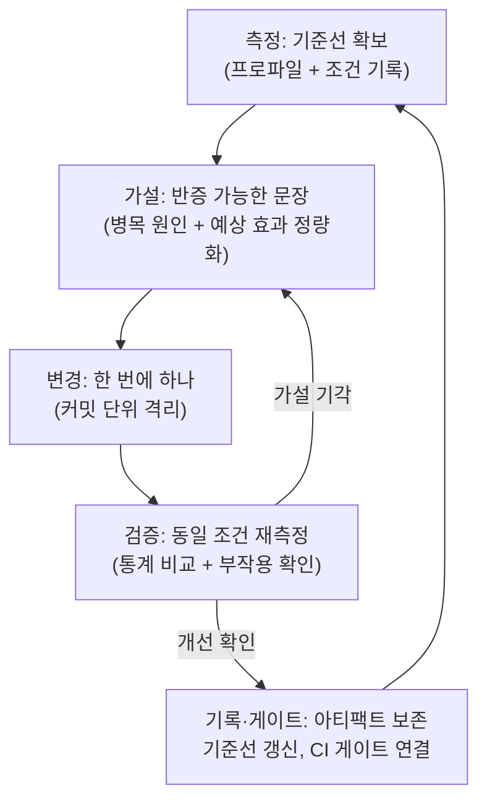

**프로파일링 워크플로우(profiling workflow)**란 측정→가설→변경→검증의 루프를 개인의 감이 아니라 팀이 공유하는 반복 가능한 프로세스로 만드는 것을 말합니다. µs 단위 최적화에서 가장 흔한 실패는 도구를 몰라서가 아니라, "그때 그 머신에서 빨라졌던" 변경이 어떤 조건에서 측정됐는지 아무도 재현할 수 없어서 발생합니다. 이 장에서는 루프의 각 단계를 실전 절차로 구체화하고, 프로파일 아티팩트(perf.data, 벤치마크 JSON, 환경 메타데이터)를 관리하는 방법, 측정 환경을 표준화하는 방법, 그리고 개인의 측정을 팀 표준과 회귀 게이트로 승격시키는 방법을 다룹니다.

## 이 장을 읽기 전에

**전제 지식**: [01장 Microbenchmark 설계 원칙](/post/profiling-analysis/microbenchmark-design-principles/)의 노이즈 통제 개념과 [03장 샘플링 프로파일링](/post/profiling-analysis/sampling-profiling-perf-vtune/)의 perf 기본 사용법을 전제합니다. [05장 Flame Graph 분석](/post/profiling-analysis/flame-graph-analysis/)을 읽었다면 가설 수립 단계가 더 구체적으로 와닿습니다.

**이 장의 깊이**: 중급. 개별 도구의 심화 기능이 아니라 도구들을 **하나의 프로세스로 엮는 방법**을 다룹니다. **다루지 않는 것**: 프로파일러 출력에서 병목 후보를 읽어내는 해석 패턴은 [19장](/post/profiling-analysis/profiler-output-interpretation-practice/)에서, 신뢰 구간·유의성 검정의 수학은 [10장](/post/profiling-analysis/statistical-benchmarking/)에서, 프로덕션 상시 프로파일링 운영은 [11장](/post/profiling-analysis/continuous-profiling-production/)에서 다룹니다. CI 회귀 게이트의 구축 상세는 Tr.12(성능 회귀 방지 트랙)의 주제이며, 이 장은 그 게이트에 "무엇을 넘겨줄지"까지만 책임집니다.

## 당신의 수준에 맞는 경로

| 수준 | 읽을 부분 | 핵심 목표 |
|------|---------|---------|
| **초보자** | "측정→가설→변경→검증 루프" 절 | 루프 각 단계의 산출물과 실패 조건 이해 |
| **중급자** | "프로파일 아티팩트 관리" ~ "재현 환경 표준화" | 아티팩트·환경 스냅샷을 남기는 습관 정착 |
| **전문가** | "팀 표준 프로세스" ~ "비판적 시각" | 팀 플레이북 설계와 회귀 게이트 연결 판단 |

---

## 방법론의 계보: 왜 "루프"인가 (역사·배경)

성능 분석을 프로세스로 정형화하려는 시도는 오래됐습니다. Donald Knuth는 1974년 논문 "Structured Programming with go to Statements"에서 프로그램의 극히 일부가 실행 시간 대부분을 차지하므로 측정으로 그 지점을 찾은 뒤에만 최적화해야 한다고 주장했고, 이것이 "측정 먼저"라는 원칙의 고전적 출발점입니다. 그러나 실무 현장은 오랫동안 방법론 없이 움직였습니다. Brendan Gregg는 2012년 ACM Queue에 발표한 "Thinking Methodically about Performance"에서 당시 실무를 지배하던 접근을 **안티 방법론(anti-methodology)**으로 명명했습니다. 익숙한 도구부터 켜고 보는 "가로등 안티 방법(streetlight anti-method)", 아무 설정이나 바꿔보는 "무작위 변경 안티 방법" 같은 것들입니다. 그가 대안으로 제시한 [USE Method](https://www.brendangregg.com/usemethod.html)는 모든 자원에 대해 사용률(Utilization)·포화(Saturation)·오류(Errors)를 체크리스트처럼 점검하는 방법론으로, "무엇을 볼지"를 도구가 아니라 절차가 결정하게 만들었다는 점에서 이 장의 문제의식과 정확히 겹칩니다.

이 장이 다루는 측정→가설→변경→검증 루프는 과학적 방법(scientific method)을 성능 작업에 적용한 것입니다. 핵심은 가설이 **반증 가능(falsifiable)**해야 한다는 것과, 검증이 **재현 가능(reproducible)**해야 한다는 것입니다. 프로파일링 도구는 2010년대 이후 비약적으로 좋아졌지만(Flame Graph 2011, 상시 프로파일링 2020년대), 도구가 좋아질수록 역설적으로 "그럴듯한 그래프를 보고 확신하는" 오류도 쉬워졌습니다. 워크플로우는 도구의 출력과 의사결정 사이에 검증 단계를 강제로 끼워 넣는 장치입니다.

## 측정→가설→변경→검증 루프

루프의 각 단계는 명확한 산출물을 남겨야 다음 단계가 성립합니다. 측정 없이 세운 가설은 추측이고, 가설 없이 한 변경은 도박이며, 검증 없이 병합한 변경은 미래의 회귀입니다. 전체 흐름을 먼저 그림으로 보면 다음과 같습니다.



### 1단계 — 측정: 기준선 없이는 아무것도 시작하지 않는다

측정 단계의 산출물은 **기준선(baseline)**입니다. 기준선은 숫자 하나가 아니라 "이 커밋의, 이 시나리오를, 이 환경에서, 이 도구로 잰 결과 + 그 조건의 기록" 전체입니다. 변경을 시작하기 전에 현재 상태를 프로파일하고 아티팩트로 저장합니다. 도구 선택은 상황에 따라 다릅니다 — 함수 단위 핫패스 식별이면 샘플링([03장](/post/profiling-analysis/sampling-profiling-perf-vtune/)), 이벤트 순서·대기 분석이면 트레이싱([04장](/post/profiling-analysis/tracing-profiling-perfetto-tracy/)), 격리된 코드 조각의 비용이면 마이크로벤치마크([02장](/post/profiling-analysis/google-benchmark-practical/))입니다.

기준선 측정에서 가장 자주 빠지는 함정은 **한 번만 재는 것**입니다. 반복 측정으로 변동성(분산)까지 기록해야 나중에 "개선"이 노이즈 범위 안인지 판별할 수 있습니다. 아래는 이 장 전체에서 예시로 쓸 벤치마크 스켈레톤입니다(x86-64 Linux, GCC 13, `-O2` 기준; 수치는 플랫폼·플래그에 따라 다릅니다).

```cpp
#include <benchmark/benchmark.h>
#include <numeric>
#include <vector>

// 가설 검증 대상이 되는 핫패스 함수(예시)
static long hot_path(const std::vector<int>& v) {
  return std::accumulate(v.begin(), v.end(), 0L);
}

static void BM_HotPath(benchmark::State& state) {
  std::vector<int> v(static_cast<size_t>(state.range(0)), 1);
  for (auto _ : state) {
    long r = hot_path(v);
    benchmark::DoNotOptimize(r);
  }
  state.SetItemsProcessed(state.iterations() * state.range(0));
}
// Repetitions(10): compare.py의 Mann-Whitney U 검정은 9회 이상 반복을 요구
BENCHMARK(BM_HotPath)->Arg(1 << 16)->Repetitions(10);

BENCHMARK_MAIN();
```

빌드와 기준선 저장은 다음과 같이 합니다. `--benchmark_out`으로 남긴 JSON이 이후 검증 단계와 회귀 게이트의 입력이 됩니다.

```bash
g++ -O2 -std=c++17 bench.cpp -lbenchmark -lpthread -o bench
./bench --benchmark_out=baseline-$(git rev-parse --short HEAD).json \
        --benchmark_out_format=json
```

JSON 파일명에 커밋 해시를 넣는 것은 사소해 보이지만, "이 기준선이 어느 코드의 것인가"라는 질문을 원천 차단하는 가장 싼 방법입니다. 반복 횟수 10회는 뒤에서 쓸 통계 비교 도구의 최소 요구(9회)를 넘기기 위한 값입니다.

### 2단계 — 가설: 반증 가능한 문장으로 쓴다

가설 단계의 산출물은 **문장**입니다. "이 함수가 느린 것 같다"는 가설이 아닙니다. 좋은 가설은 원인·변경·예상 효과를 정량적으로 담아 나중에 기각될 수 있는 형태를 갖춥니다. 예를 들어 "`hot_path`의 캐시 미스가 전체 사이클의 30%를 차지하므로(perf 결과 첨부), 자료 배치를 SoA로 바꾸면 p50 처리 시간이 15% 이상 줄어들 것이다"처럼 씁니다. 프로파일 출력에서 이런 후보를 읽어내는 패턴은 [19장](/post/profiling-analysis/profiler-output-interpretation-practice/)의 주제이고, 하드웨어 카운터로 원인을 좁히는 방법은 [08장](/post/profiling-analysis/hardware-performance-counters/)에서 다룹니다.

가설을 문장으로 강제하는 이유는 두 가지입니다. 첫째, 예상 효과를 숫자로 쓰는 순간 "얼마나 좋아지면 채택할지"라는 기준이 변경 전에 확정되어, 결과를 보고 기준을 움직이는 사후 합리화를 막습니다. 둘째, 기각된 가설도 기록으로 남아 팀의 지식이 됩니다 — "SoA 전환은 이 워크로드에서 효과 없음(2026-07, 측정 링크)"이라는 한 줄이 다음 사람의 일주일을 아낍니다.

### 3단계 — 변경: 한 번에 하나, 커밋 단위로 격리한다

변경 단계의 규칙은 단순합니다. **한 루프에 한 가설, 한 가설에 한 변경**. 자료 배치 변경과 인라이닝 힌트를 한 커밋에 섞으면, 개선이 나와도 어느 쪽 덕인지 알 수 없고 회귀가 나와도 어느 쪽 탓인지 알 수 없습니다. 변경을 커밋 단위로 격리하면 검증 단계에서 "기준선 커밋 vs 변경 커밋"이라는 깨끗한 비교쌍이 생기고, 나중에 이 커밋만 revert하는 것도 가능해집니다.

### 4단계 — 검증: 같은 조건, 통계적 비교, 부작용 확인

검증 단계의 산출물은 **채택/기각 판정과 그 근거**입니다. 기준선과 동일한 환경·입력·도구로 재측정한 뒤, 두 결과를 통계적으로 비교합니다. Google Benchmark 저장소의 [compare.py](https://github.com/google/benchmark/blob/main/docs/tools.md)가 이 용도의 표준 도구입니다.

> "compare.py uses Mann–Whitney U test, with a null hypothesis being that there's no difference in performance." — [Google Benchmark 공식 문서, tools.md](https://github.com/google/benchmark/blob/main/docs/tools.md)

즉 단일 실행의 평균 차이가 아니라 반복 측정 분포 간의 유의성을 검정하며, 이것이 1단계에서 반복 10회를 요구한 이유입니다. 실행은 다음과 같습니다.

```bash
# 기준선 커밋과 변경 커밋의 JSON을 비교
python3 tools/compare.py benchmarks \
    baseline-a1b2c3d.json changed-e4f5a6b.json
```

출력은 대략 이런 형태입니다(예시 수치).

```text
Benchmark                     Time      CPU     Time Old  Time New
----------------------------------------------------------------
BM_HotPath/65536_pvalue      0.0002   0.0002
BM_HotPath/65536_mean       -0.1812  -0.1810      41302     33818
BM_HotPath/65536_median     -0.1805  -0.1803      41250     33805
```

읽는 법: `_pvalue` 행이 유의수준(관례적으로 0.05) 미만이면 두 분포는 통계적으로 다르고, `_mean`/`_median` 행의 음수는 개선 비율입니다. 위 예시는 "p=0.0002로 유의미하며 중앙값 기준 약 18% 개선"으로 읽습니다 — 가설이 "15% 이상"이었다면 채택입니다. p-value가 크면 개선처럼 보여도 노이즈일 수 있으므로 기각합니다(상세한 해석과 함정은 [10장](/post/profiling-analysis/statistical-benchmarking/)).

검증에는 부작용 확인이 포함됩니다. 목표 지표(p50)가 좋아져도 메모리 사용량([20장](/post/profiling-analysis/memory-profiling-heap-analysis/))이나 꼬리 지연([09장](/post/profiling-analysis/tail-latency-analysis/))이 나빠졌다면 채택 판정을 다시 해야 합니다. 마이크로벤치마크에서 확인된 개선이 실제 서비스 지표로 이어지는지는 [12장의 성능 A/B 테스트](/post/profiling-analysis/performance-ab-testing/)로 닫습니다.

## 프로파일 아티팩트 관리

루프를 한 바퀴 돌 때마다 아티팩트가 생깁니다: perf.data, 벤치마크 JSON, Flame Graph SVG, 그리고 측정 조건 메타데이터. 이것들을 버리면 루프는 일회성 이벤트가 되고, 보존하면 팀의 성능 이력 데이터베이스가 됩니다. 관리의 원칙은 세 가지입니다 — **식별 가능**(어느 커밋·시나리오·환경의 것인지 파일명과 메타데이터로 알 수 있다), **이동 가능**(수집한 머신이 아닌 곳에서도 분석할 수 있다), **보존 기한 명시**(무한정 쌓지 않는다).

식별 가능성은 명명 규칙으로 해결합니다. `{날짜}-{호스트}-{커밋해시}-{시나리오}` 형태가 실용적입니다. 이동 가능성은 perf의 경우 build-id 문제를 해결해야 합니다 — perf.data는 심볼 해석에 필요한 바이너리를 담고 있지 않아서, 다른 머신에서 열면 주소만 보이기 십상입니다. 이를 위한 표준 도구가 perf archive입니다.

> "Create archive with object files with build-ids found in perf.data file." — [perf-archive(1) man page](https://man7.org/linux/man-pages/man1/perf-archive.1.html)

수집·보관을 한 번에 하는 절차는 다음과 같습니다. `--call-graph dwarf`와 소수(prime) 샘플링 주파수 선택의 근거는 [07장 Linux perf 고급](/post/profiling-analysis/linux-perf-advanced/)에서 다룹니다.

```bash
COMMIT=$(git rev-parse --short HEAD)
TAG="$(date +%Y%m%d)-$(hostname -s)-${COMMIT}-standard"

perf record -F 499 -g --call-graph dwarf \
    -o "perf-${TAG}.data" -- ./app --scenario standard

# 심볼 해석용 오브젝트 파일을 build-id 기준으로 묶는다
perf archive "perf-${TAG}.data"   # perf-<TAG>.data.tar.bz2 생성
```

이렇게 만든 `.data` + `.tar.bz2` 쌍은 다른 머신에서 tar를 `~/.debug`에 풀면 심볼까지 온전히 열립니다. 메타데이터는 perf가 이미 상당 부분 기록해 줍니다 — `perf report --header-only -i perf-<TAG>.data`를 실행하면 다음과 같은 헤더를 확인할 수 있습니다.

```text
# captured on    : Sun Jul 12 10:23:41 2026
# hostname : bench-node-01
# os release : 6.12.0-generic
# arch : x86_64
# nrcpus avail : 32
# cpudesc : AMD Ryzen 9 7950X 16-Core Processor
# cmdline : perf record -F 499 -g --call-graph dwarf -o perf-...
```

해석: 이 헤더만으로 "언제, 어느 머신, 어떤 커널, 어떤 수집 옵션"이 복원되므로, 몇 달 뒤 아티팩트를 열어도 비교 가능 여부를 즉시 판단할 수 있습니다. 다만 헤더에는 애플리케이션 커밋 해시와 빌드 플래그가 없으므로, 그 부분은 다음 절의 환경 스냅샷으로 보완합니다. 보존 기한은 팀 규칙으로 정합니다 — 실용적인 출발점은 "기준선 아티팩트는 무기한, 실험 아티팩트는 90일"입니다.

## 재현 환경 표준화

검증 단계의 전제인 "동일 조건 재측정"은 환경이 통제되지 않으면 성립하지 않습니다. CPU 주파수 스케일링, 터보 부스트, ASLR, 다른 프로세스의 간섭은 모두 실행 시간을 흔들며, 이 노이즈가 측정하려는 효과(수 %~수십 %)보다 커지는 일은 드물지 않습니다. [LLVM 벤치마킹 가이드](https://llvm.org/docs/Benchmarking.html)는 주파수 고정·터보 비활성화·ASLR 비활성화·코어 격리·SMT 비활성화·tmpfs 사용을 조합하면 실행 간 변동을 크게 줄일 수 있다고 안내합니다. 최소 세트는 다음과 같습니다(root 필요, Intel pstate 경로는 Intel CPU 기준이며 AMD·커널 버전에 따라 경로가 다릅니다).

```bash
# 측정 세션 동안만 적용하고, 끝나면 원복한다
sudo cpupower frequency-set -g performance          # governor 고정
echo 1 | sudo tee /sys/devices/system/cpu/intel_pstate/no_turbo   # 터보 OFF
echo 0 | sudo tee /proc/sys/kernel/randomize_va_space             # ASLR OFF
```

주의할 점 두 가지입니다. 첫째, ASLR 비활성화는 보안 완화 장치를 끄는 것이므로 공용·프로덕션 머신에서는 하지 않고, 전용 벤치 머신에서 세션 단위로만 적용합니다. 둘째, 이 표준화는 **절대 성능의 예측이 아니라 A/B 비교의 공정성**을 위한 것입니다 — 터보를 끈 머신의 수치는 실제 배포 환경의 수치와 다르며, 그 간극은 [09장 꼬리 지연 분석](/post/profiling-analysis/tail-latency-analysis/)과 [11장 지속적 프로파일링](/post/profiling-analysis/continuous-profiling-production/)이 메웁니다.

표준화의 나머지 절반은 **환경을 기록하는 것**입니다. 통제했다고 믿는 것과 통제됐음을 증명하는 것은 다릅니다. 측정 직전에 환경 스냅샷을 찍어 아티팩트 옆에 저장합니다.

```bash
#!/usr/bin/env bash
# env-snapshot.sh — 측정 환경 스냅샷을 아티팩트와 함께 저장
{
  echo "commit:   $(git rev-parse HEAD)"
  echo "kernel:   $(uname -r)"
  echo "compiler: $(g++ --version | head -1)"
  echo "governor: $(cat /sys/devices/system/cpu/cpu0/cpufreq/scaling_governor 2>/dev/null)"
  echo "no_turbo: $(cat /sys/devices/system/cpu/intel_pstate/no_turbo 2>/dev/null)"
  echo "aslr:     $(cat /proc/sys/kernel/randomize_va_space)"
  echo "loadavg:  $(cut -d' ' -f1-3 /proc/loadavg)"
} > "env-${TAG}.txt"
```

이 스냅샷은 검증 단계에서 "기준선과 변경 측정의 환경이 정말 같았는가"를 기계적으로 diff할 수 있게 해 줍니다. governor가 `performance`가 아니거나 loadavg가 높게 찍혀 있으면 그 측정은 비교에 쓰지 않습니다.

## 팀 표준 프로세스 수립

개인이 루프를 돌 줄 아는 것과 팀이 루프를 도는 것은 다른 문제입니다. 팀 표준의 목표는 "성능 주장에는 항상 같은 형식의 근거가 붙는다"는 문화를 만드는 것이고, 이를 위해 필요한 문서는 딱 두 개입니다 — **플레이북**과 **보고 템플릿**.

플레이북은 다음 네 가지 질문에 대한 팀의 합의를 적은 짧은 문서입니다. (1) **언제 프로파일하는가**: 핫패스 코드 변경 시 필수, 신규 기능은 목표 지연 예산 초과 시. (2) **표준 도구 세트는 무엇인가**: 예를 들어 "샘플링은 perf, 벤치마크는 Google Benchmark, 시각화는 Flame Graph"처럼 1차 도구를 고정해야 아티팩트가 비교 가능해집니다. (3) **표준 시나리오·입력은 무엇인가**: 재현 가능한 대표 워크로드를 버전 관리되는 스크립트로 정의합니다. (4) **채택 기준은 무엇인가**: p-value 임계, 최소 효과 크기(예: 중앙값 5% 이상), 부작용 지표 목록.

보고 템플릿은 PR 설명이나 이슈에 붙이는 정형 양식입니다. 아래처럼 루프의 산출물을 그대로 항목화하면 됩니다.

```text
## 성능 변경 보고
- 가설: [반증 가능한 문장 + 예상 효과 수치]
- 기준선: [커밋, 아티팩트 링크, env 스냅샷 링크]
- 변경: [커밋, 한 줄 요약]
- 검증: [compare.py 출력 요약, p-value, 효과 크기]
- 부작용: [메모리/p99/바이너리 크기 확인 결과]
- 판정: 채택 / 기각 (기각 사유)
```

이 템플릿의 가치는 리뷰어가 "빨라졌대요"가 아니라 근거의 각 항목을 검토할 수 있다는 데 있고, 기각된 보고조차 검색 가능한 팀 지식으로 남는다는 데 있습니다. 처음 도입할 때는 핫패스 디렉터리에 대한 PR에만 필수로 걸고, 범위를 점진적으로 넓히는 편이 저항이 적습니다.

## 회귀 게이트로의 연결

루프의 마지막 단계는 채택된 개선을 **지키는 것**입니다. 검증까지 통과한 개선도 게이트가 없으면 몇 커밋 뒤에 조용히 사라집니다. 이 장에서 만든 산출물은 그대로 게이트의 부품이 됩니다 — 기준선 JSON은 저장소(또는 아티팩트 스토리지)에 커밋된 비교 기준이 되고, compare.py는 CI 단계에서 "현재 브랜치 vs 기준선"을 검정하는 판정기가 되며, 플레이북의 채택 기준은 게이트의 실패 임계가 됩니다. 핵심 설계 판단은 두 가지입니다. 첫째, CI 러너는 노이즈가 크므로 게이트 임계는 로컬 채택 기준보다 느슨하게(예: 유의성 + 10% 이상 악화 시 실패) 잡고, 정밀 판정은 전용 벤치 머신의 야간 잡에 맡깁니다. 둘째, 게이트가 잡는 것은 마이크로벤치마크 회귀까지이고, 서비스 수준 회귀는 [11장의 지속적 프로파일링](/post/profiling-analysis/continuous-profiling-production/)과 [12장의 A/B 테스트](/post/profiling-analysis/performance-ab-testing/)가 담당합니다. 게이트 파이프라인 구축의 상세(기준선 갱신 정책, 노이즈 대응, 알림 설계)는 Tr.12(성능 회귀 방지·유지보수 트랙)에서 다루며, 시리즈 내 위치는 [시리즈 개요](/post/low-latency-optimization-series/getting-started-low-latency-optimization-series-overview/)를 참고하세요.

## 흔한 오개념 교정

**"프로파일링은 성능 문제가 터졌을 때 하는 소방 활동이다."** 그렇지 않습니다. 문제가 터진 뒤의 프로파일링은 기준선이 없어서 "언제부터, 무엇 때문에 나빠졌는지"를 알 수 없는 최악의 조건에서 시작합니다. 루프를 변경 단위로 상시 돌리면 회귀는 도입 시점의 커밋 하나로 좁혀지고, 원인 규명 비용은 수십 분의 일로 줄어듭니다. 소방 활동이 필요 없어지는 것이 아니라, 소방 활동이 쉬워지는 것입니다.

**"벤치마크 수치가 좋아졌으면 검증은 끝났다."** 두 가지가 빠져 있습니다. 첫째, 단일 실행의 수치 차이는 노이즈일 수 있으므로 반복 측정과 유의성 검정 없이는 "좋아졌다"고 말할 수 없습니다 — compare.py가 9회 이상 반복을 요구하는 이유입니다. 둘째, 목표 지표의 개선이 다른 지표(메모리, 꼬리 지연, 바이너리 크기, 컴파일 시간)의 악화를 동반하지 않는지 확인해야 검증이 닫힙니다.

**"환경을 표준화하면 프로덕션 성능을 예측할 수 있다."** 표준화의 목적은 예측이 아니라 **비교**입니다. 터보를 끄고 코어를 격리한 벤치 머신의 절대 수치는 프로덕션과 다르며, 다르다는 것이 문제가 아닙니다 — A와 B를 같은 조건에서 재서 상대 비교의 공정성을 확보하는 것이 목적입니다. 프로덕션의 절대 수치는 지속적 프로파일링과 실서비스 지표로 따로 확인합니다.

## 판단 기준: 전체 루프 vs 간이 측정

모든 변경에 전체 루프를 요구하면 프로세스가 무시되기 시작합니다. 비용을 어디에 쓸지 정하는 기준이 필요합니다.

| 상황 | 권장 절차 |
|------|----------|
| 핫패스(프로파일 상위 함수) 코드 변경 | 전체 루프 + 보고 템플릿 필수 |
| 목표 지연 예산이 있는 신규 기능 | 기준선 측정 + 예산 대비 검증 |
| 콜드패스·설정·문서 변경 | 게이트 통과만 확인, 루프 생략 |
| "느려진 것 같다"는 막연한 제보 | 재현 시나리오 확보 → 기준선과 비교부터 |
| 라이브러리·컴파일러·커널 업그레이드 | 표준 시나리오 전체 재측정, 기준선 갱신 검토 |
| 원인 불명의 프로덕션 지연 | 이 장의 루프가 아니라 11장·17장의 운영 도구부터 |

체크리스트로 요약하면: 변경이 핫패스를 건드리는가, 측정 없이 채택하면 되돌리기 어려운가, 이 둘 중 하나라도 예라면 전체 루프를 돕니다.

## 비판적 시각: 한계와 트레이드오프

**프로세스 비용은 실재합니다.** 보고 템플릿·아티팩트 보존·환경 스냅샷은 모두 시간이 들고, 2~3인 팀이 모든 PR에 이를 요구하면 프로세스가 형식주의로 전락합니다. 워크플로우는 팀·코드베이스 규모에 비례해 도입해야 하며, 시작점은 "핫패스 변경에만 적용"입니다. 프로세스가 지켜지지 않는다면 프로세스가 과했을 가능성부터 의심해야 합니다.

**표준화된 환경은 현실과 체계적으로 다릅니다.** 저노이즈 벤치 머신은 캐시 경합·주파수 전이·이웃 프로세스 간섭이라는 프로덕션의 상수를 제거한 환경이며, 그 환경에서의 18% 개선이 프로덕션에서 재현된다는 보장은 없습니다. 특히 꼬리 지연은 표준화 환경에서 가장 심하게 왜곡되는 지표입니다. 마이크로벤치마크 검증과 프로덕션 검증(A/B, 지속적 프로파일링)은 대체 관계가 아니라 직렬 관계입니다.

**아티팩트는 쌓이고, 기준선은 썩습니다.** dwarf 콜그래프를 담은 perf.data는 쉽게 수백 MB가 되고, 보존 정책 없는 아티팩트 스토리지는 비용 문제가 됩니다. 더 미묘한 문제는 기준선의 노화입니다 — 컴파일러·커널·하드웨어가 바뀌면 옛 기준선과의 비교는 무의미해지므로, 기준선 갱신을 트리거하는 이벤트 목록(툴체인 업그레이드, 벤치 머신 교체)을 플레이북에 명시해야 합니다.

**루프는 국소 최적화에 갇힐 수 있습니다.** 한 번에 한 변경이라는 규칙은 인과 규명에는 옳지만, 아키텍처 수준의 재설계(자료 구조 전면 교체, 스레딩 모델 변경)처럼 여러 변경이 결합해야 효과가 나는 개선을 놓치게 만들 수 있습니다. 이런 경우는 루프를 버리는 것이 아니라 비교 단위를 "커밋"에서 "브랜치 전체"로 올려서 같은 규율을 적용합니다.

## 마무리

이 장을 제대로 소화했다면 다음을 스스로 확인할 수 있어야 합니다.

- [ ] 측정→가설→변경→검증 각 단계의 산출물(기준선, 반증 가능한 문장, 격리된 커밋, 채택/기각 판정)을 말할 수 있다.
- [ ] 반복 측정 + compare.py의 유의성 검정으로 "개선이 노이즈가 아님"을 판별할 수 있다.
- [ ] perf archive와 명명 규칙으로 다른 머신·다른 시점에서도 열리는 프로파일 아티팩트를 남길 수 있다.
- [ ] 환경 표준화(governor·터보·ASLR)와 환경 스냅샷의 목적이 절대값 예측이 아니라 비교 공정성임을 설명할 수 있다.
- [ ] 팀 플레이북의 4개 합의 항목과 보고 템플릿을 자기 팀 상황에 맞게 초안할 수 있다.
- [ ] 어떤 변경에 전체 루프를 요구하고 어떤 변경에 생략할지 기준을 제시할 수 있다.

**이전 장**: [분산 트레이싱 오버헤드와 µs 탐지](/post/profiling-analysis/distributed-tracing-microsecond-overhead/)

**다음 장에서는** 이 장의 가설 단계를 지탱하는 기술, 즉 샘플링·트레이싱 리포트를 병목 후보로 연결하는 해석 패턴을 다룹니다. perf report의 self/children 컬럼, Flame Graph의 plateau, 벤치마크 카운터를 "다음에 시도할 변경"으로 번역하는 실전 훈련입니다.

→ [프로파일러 출력 해석 실전](/post/profiling-analysis/profiler-output-interpretation-practice/) (다음 장)
