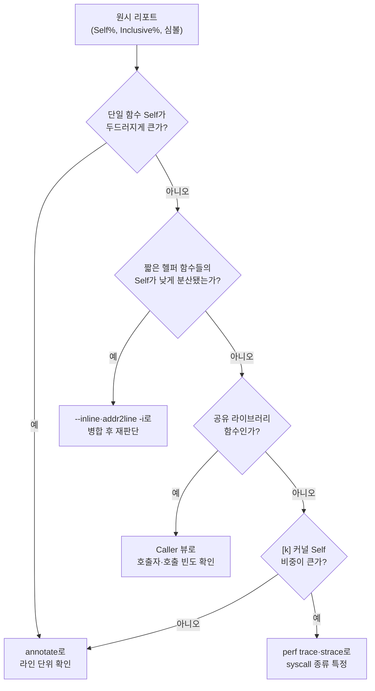

**프로파일러 출력 해석**이란 `perf report`나 VTune이 뱉어내는 self·inclusive 백분율과 심볼 목록을 문자 그대로 읽는 것이 아니라, 그 숫자들을 "다음에 무엇을 바꿔볼지"에 대한 구체적이고 반증 가능한 가설로 번역하는 기술을 말합니다. 같은 리포트를 보고도 어떤 엔지니어는 5분 만에 정확한 병목 후보를 짚어내고, 어떤 엔지니어는 몇 시간을 엉뚱한 함수를 갈아내며 보냅니다. 차이는 도구가 아니라 해석 패턴에 있습니다 — self와 inclusive가 서로 다른 질문에 답한다는 것, 인라이닝이 진짜 비용을 여러 호출자에게 흩뿌려 놓는다는 것, 커널 self-time이 커널의 결함이 아니라 유저 코드의 습관을 가리킨다는 것, 그리고 겉보기엔 그럴듯한 숫자 몇 가지가 실제로는 잘못된 결론으로 가는 지름길이라는 것을 압니다. 이 장에서는 이 네 가지 축을 중심으로, 리포트의 한 줄을 근거 있는 다음 행동으로 바꾸는 실전 패턴을 정리합니다.

## 이 장을 읽기 전에

**전제 지식**: [03장 샘플링 프로파일링: perf·VTune 원리](/post/profiling-analysis/sampling-profiling-perf-vtune/)에서 다룬 Self/Children의 기본 정의와 콜스택 언와인딩(fp/DWARF/LBR) 개념, [18장 프로파일링 워크플로우 가이드](/post/profiling-analysis/profiling-workflow-team-guide/)에서 다룬 "가설은 반증 가능한 문장이어야 한다"는 원칙을 전제합니다. [05장 Flame Graph 분석](/post/profiling-analysis/flame-graph-analysis/)을 먼저 읽었다면 self/inclusive가 시각적으로 어떻게 나타나는지 감을 잡은 상태라 이 장의 패턴이 더 구체적으로 와닿습니다.

**이 장의 깊이**: 중급. 리포트의 숫자·심볼을 "읽는 법"에 집중하며, 도구 자체의 수집 옵션이나 원리는 다루지 않습니다. **다루지 않는 것**: 언와인딩 방식별 트레이드오프와 수집 명령어([03장](/post/profiling-analysis/sampling-profiling-perf-vtune/)), Flame Graph 시각화 자체([05장](/post/profiling-analysis/flame-graph-analysis/)), `perf`의 이벤트 선택·`--latency` 등 고급 옵션([07장](/post/profiling-analysis/linux-perf-advanced/)), 하드웨어 카운터가 측정하는 마이크로아키텍처 이벤트의 의미([08장](/post/profiling-analysis/hardware-performance-counters/)), 반복 측정의 통계적 유의성 판정([10장](/post/profiling-analysis/statistical-benchmarking/))입니다.

## 당신의 수준에 맞는 경로

| 수준 | 읽을 부분 | 핵심 목표 |
|------|---------|---------|
| **초보자** | "Self와 Inclusive" ~ "인라이닝된 심볼 읽기" | 두 지표가 답하는 질문의 차이와 인라이닝이 숫자를 흩어 놓는 이유 이해 |
| **중급자** | "커널 vs 유저 시간" ~ "잘못된 결론으로 이끄는 함정들" | [k]/[.] 분리와 대표적인 오독 패턴을 실제 사례로 식별 |
| **전문가** | "판단 기준" ~ "비판적 시각" | 해석 체크리스트를 팀 리뷰 기준으로 운영하고 한계를 설명 |

---

## 해석 규범의 계보: gprof에서 인라인 디버그 정보까지 (역사·배경)

self와 cumulative(누적)를 구분해 함수별 비용을 표로 보여주는 규범은 도구 자체보다 오래됐습니다. Susan Graham·Peter Kessler·Marshall McKusick이 1982년 발표한 gprof의 flat profile은 각 함수를 "self seconds"(그 함수 코드 자신이 쓴 시간)와 "cumulative seconds"(self seconds에 더해 그 함수 위 테이블에 있는 모든 함수의 시간을 합친 것)로 나눠 보여주는 형식을 확립했습니다. [GNU gprof 매뉴얼](https://sourceware.org/binutils/docs/gprof/Flat-Profile.html)은 지금도 이 두 컬럼을 "the number of seconds accounted for by this function alone"와 "the cumulative total number of seconds the computer spent executing this functions, plus the time spent in all the functions above this one in this table"로 정의합니다 — 오늘날 `perf report`의 Self/Children이나 VTune의 Self Time/Total Time은 이름만 바뀐 같은 개념입니다. 인라이닝된 코드의 위치를 사후에 복원하는 능력은 DWARF 디버그 정보 표준에 기대는데, DWARF는 최초 버전부터 `DW_TAG_inlined_subroutine` 태그로 "이 코드 범위는 원래 어떤 서브루틴이 인라인된 것"이라는 관계를 기록해 왔고, 컴파일러가 `-g`와 함께 이 정보를 남기면 `perf report --inline`이나 `addr2line -i`가 최적화로 사라진 함수 이름을 사후에 되살릴 수 있습니다. 커널/유저 시간의 구분은 더 오래된 관례에서 옵니다 — Unix는 1970년대부터 `time` 명령으로 real/user/sys 세 가지 시간을 구분해 왔고, `perf`는 이 구분을 이벤트 모디파이어 `:u`/`:k`로 계승해 특정 이벤트를 유저 공간 또는 커널 공간에서만 세도록 제한할 수 있게 했습니다.

## Self와 Inclusive: 두 숫자가 답하는 서로 다른 질문

Self는 "샘플링 순간 instruction pointer가 이 함수 자신의 코드 안에 있었던 비율"이고, Inclusive(perf의 Children, VTune의 Total Time)는 "이 함수 또는 이 함수가 (직접·간접으로) 부른 모든 함수 안에 있었던 비율"입니다. 최적화 대상을 고를 때는 거의 항상 **Self가 큰 함수**를 먼저 봐야 합니다 — Inclusive가 커도 Self가 작다면 그 함수는 단지 무거운 하위 호출을 향해 가는 통로일 뿐이고, 실제로 시간을 태우는 코드는 그 안쪽 어딘가에 있습니다. 문제는 재귀 함수를 만나는 순간 이 직관이 흔들린다는 점입니다. 아래 예제는 트리를 재귀적으로 순회하며 각 노드에서 해시 하나를 계산합니다.

```cpp
// recursive_demo.cpp — 재귀 호출에서 self/inclusive를 관찰하기 위한 예제 (GCC/Clang, x86-64 Linux)
#include <cstdint>
#include <cstdio>
#include <vector>

struct Node { int value; std::vector<Node> children; };

// 각 노드에서 반복 호출되는 hot leaf: 여기 self-time이 몰려야 정상이다.
uint64_t raw_hash(uint64_t x) {
  x ^= x >> 33; x *= 0xff51afd7ed558ccdULL;
  x ^= x >> 33; x *= 0xc4ceb9fe1a85ec53ULL;
  return x ^ (x >> 33);
}

uint64_t sum_tree(const Node& n) {
  uint64_t total = raw_hash(static_cast<uint64_t>(n.value));
  for (const auto& c : n.children) total += sum_tree(c);  // 재귀 호출
  return total;
}

Node build_tree(int depth, int fanout, int& counter) {
  Node n{counter++, {}};
  if (depth > 0)
    for (int i = 0; i < fanout; ++i) n.children.push_back(build_tree(depth - 1, fanout, counter));
  return n;
}

int main() {
  int counter = 0;
  Node root = build_tree(12, 3, counter);  // 약 79만 노드
  uint64_t total = 0;
  for (int iter = 0; iter < 20; ++iter) total += sum_tree(root);
  std::printf("%llu\n", static_cast<unsigned long long>(total));
}
```

`g++ -O2 -g -fno-omit-frame-pointer recursive_demo.cpp -o recursive_demo`로 빌드하고 `perf record -F 999 -g ./recursive_demo && perf report --stdio`를 실행하면 대략 다음과 같은 형태를 봅니다(예시 수치이며 컴파일러·CPU에 따라 비율은 달라집니다).

```text
# Children      Self  Symbol
    99.80%      2.15%  [.] sum_tree
    97.40%     97.40%  [.] raw_hash
```

읽는 법의 핵심은 두 가지입니다. 첫째, `sum_tree`의 Self가 겨우 2%인데 Children이 99.8%인 것은 정상입니다 — `sum_tree` 자신은 루프와 함수 호출만 반복할 뿐이고, 실제 계산은 `raw_hash`에서 일어나기 때문입니다. 최적화 대상은 Self가 큰 `raw_hash`이지 Inclusive가 큰 `sum_tree`가 아닙니다. 둘째, `sum_tree`의 Children 99.8%는 재귀 호출 전체를 통틀어 "이 함수 또는 그 하위 호출 어딘가에 있었던 샘플의 비율"이라는 뜻이지, "재귀 깊이 각 단계마다 99.8%씩 누적됐다"는 뜻이 아닙니다. 재귀 함수의 Inclusive는 깊이와 무관하게 사실상 프로그램 전체에 수렴하는 경향이 있어서, "어느 재귀 깊이가 비싼가"라는 질문에는 답하지 못합니다. 그 질문에는 `perf annotate`로 라인 단위까지 내려가거나, 재귀를 반복문으로 바꿔 깊이별 계측을 추가하는 편이 낫습니다. Flame Graph에서는 이 Self/Inclusive 관계가 "폭"이라는 시각 언어로 나타나는데, 정확한 대응 관계는 [05장 Flame Graph 분석](/post/profiling-analysis/flame-graph-analysis/)에서 그림으로 확인할 수 있습니다.

## 인라이닝된 심볼 읽기: 사라진 함수를 찾아서

`-O2` 이상에서 컴파일러는 작고 자주 호출되는 함수를 호출자 코드 안에 그대로 풀어 넣습니다. 이때 리포트에 나타나는 것은 원래 함수 이름이 아니라 **그 함수를 삼킨 호출자**이고, 진짜 비용은 그 호출자의 Self 시간 안에 섞여 들어갑니다. 문제는 같은 헬퍼 함수가 열 곳에서 호출되면 비용도 열 조각으로 흩어진다는 점입니다 — 헬퍼 하나가 전체 실행 시간의 15%를 쓰더라도, 각 호출자에는 1–2%씩만 나뉘어 붙어 있으니 상위 목록 어디에도 "15%짜리 핫스팟"은 보이지 않습니다. 아래는 이런 상황을 만드는 전형적인 예입니다 — 대소문자 무관 비교에 쓰이는 작은 헬퍼가 서로 다른 여러 함수에서 반복 호출됩니다.

```cpp
// inlined_helper.cpp — 여러 호출자에 흩어지는 인라인 헬퍼 예제 (GCC/Clang, x86-64)
#include <string_view>

// 짧고 뜨거워서 -O2에서 거의 항상 인라인되는 헬퍼
inline char to_lower_ascii(char c) {
  return (c >= 'A' && c <= 'Z') ? static_cast<char>(c - 'A' + 'a') : c;
}

bool ieq(std::string_view a, std::string_view b) {
  if (a.size() != b.size()) return false;
  for (size_t i = 0; i < a.size(); ++i)
    if (to_lower_ascii(a[i]) != to_lower_ascii(b[i])) return false;  // 호출 지점 1
  return true;
}

size_t count_prefix_matches(std::string_view needle, const std::vector<std::string_view>& haystack) {
  size_t hits = 0;
  for (auto s : haystack)
    if (s.size() >= needle.size() && ieq(s.substr(0, needle.size()), needle)) ++hits;  // 호출 지점 2 (간접)
  return hits;
}
```

`perf report --stdio`를 옵션 없이 돌리면 `to_lower_ascii`는 목록 어디에도 등장하지 않고, `ieq`의 Self 시간만 눈에 띄게 큰 상태로 나타납니다. 이 지점에서 흔한 실수는 "`ieq`의 비교 로직 자체가 느리다"고 성급히 결론짓는 것입니다. 실제로는 `ieq`의 Self 시간 대부분이 인라인된 `to_lower_ascii` 두 번 호출이 차지하고 있을 수 있고, 이는 `perf report --inline`이나 `addr2line -i -f -e <binary> <주소>`로 확인할 수 있습니다. [perf-report(1) 매뉴얼](https://man7.org/linux/man-pages/man1/perf-report.1.html)은 이 옵션을 "if a callgraph address belongs to an inlined function, the inline stack will be printed"으로 설명하며, 기본값으로 켜져 있고 `--no-inline`으로 끌 수 있습니다. VTune에서는 같은 문제를 그룹화 방식으로 접근합니다 — Bottom-up 뷰의 Grouping을 Source Function이나 Function/Call Stack 단위로 바꾸면 여러 호출 경로에 흩어진 동일 인라인 함수의 인스턴스를 하나로 합쳐서 볼 수 있습니다. 두 도구 모두 전제 조건은 같습니다: 디버그 정보(`-g`)가 최적화 빌드(`-O2` 이상)와 함께 있어야 인라인 위치 정보가 바이너리에 남고, 디버그 정보 없이 배포된 바이너리에서는 인라인 함수가 영구히 호출자 안에 묻힌 채로 보입니다. 인라이닝을 언제 유도하고 언제 억제할지의 설계 판단은 [Tr.02 인라이닝 유도 기법](/post/cpp-optimization/inlining-techniques/)이 다루고, 이 장은 그 결과로 생긴 리포트를 읽는 법만 책임집니다.

## 커널 vs 유저 시간: [k]와 [.]의 의미

`perf report`의 심볼 앞에 붙는 `[.]`은 유저 공간 코드, `[k]`는 커널 공간 코드를 뜻하고, DSO(공유 오브젝트) 컬럼에는 그 심볼이 어느 바이너리 또는 `[kernel.kallsyms]`에 속하는지가 표시됩니다. 이 구분이 중요한 이유는 원인 소재가 완전히 다르기 때문입니다 — 유저 공간 Self 시간은 대개 알고리즘·자료구조·캐시 지역성의 문제이고, 커널 Self 시간은 대개 **유저 코드가 커널에 얼마나 자주, 얼마나 비싼 방식으로 요청했는가**의 문제입니다. 두 경로가 얼마나 다른 리포트를 만드는지 보기 위해, 순수 계산 루프와 시스템 콜을 남발하는 루프를 나란히 실행합니다.

```cpp
// syscall_vs_compute.cpp — 커널 vs 유저 self-time 대비용 예제 (Linux, x86-64)
#include <cstdint>
#include <fcntl.h>
#include <unistd.h>

// 유저 공간에서만 도는 계산 경로
uint64_t compute_heavy(uint64_t n) {
  uint64_t sum = 0;
  for (uint64_t i = 0; i < n; ++i) sum += i * i;
  return sum;
}

// write(2)를 1바이트씩 반복 호출해 커널 self-time을 인위적으로 만드는 경로
void syscall_heavy(int fd, int iterations) {
  char buf[1] = {'x'};
  for (int i = 0; i < iterations; ++i) write(fd, buf, 1);
}

int main() {
  int fd = open("/dev/null", O_WRONLY);
  uint64_t s = compute_heavy(200'000'000ULL);
  syscall_heavy(fd, 4'000'000);
  close(fd);
  return static_cast<int>(s & 0xff);
}
```

`perf record -g -F 999 ./syscall_vs_compute && perf report --stdio`의 결과는 대략 다음 형태입니다(예시 수치, 커널 버전·파일시스템에 따라 달라짐).

```text
# Children      Self  Command             Shared Object     Symbol
    52.30%     52.30%  syscall_vs_compute  syscall_vs_compute  [.] compute_heavy
    41.85%      0.02%  syscall_vs_compute  syscall_vs_compute  [.] syscall_heavy
    41.60%     41.60%  syscall_vs_compute  [kernel.kallsyms]   [k] entry_SYSCALL_64
     6.80%      6.80%  syscall_vs_compute  [kernel.kallsyms]   [k] ksys_write
```

`syscall_heavy` 자신의 Self는 0.02%로 무시할 만큼 작지만, 그 호출이 만들어낸 커널 쪽 비용(`entry_SYSCALL_64`, `ksys_write` 등)은 전체의 40%를 넘습니다. 여기서 흔한 오독은 "커널 진입 경로(`entry_SYSCALL_64`)의 Self가 크니 이 커널 코드를 고쳐야 한다"고 읽는 것인데, 실제 원인은 유저 코드가 write를 400만 번이나 1바이트씩 쪼개 호출한 습관에 있습니다. 고칠 곳은 커널이 아니라 `syscall_heavy` — 버퍼링해서 호출 횟수를 줄이는 것입니다. `perf record -e cycles:u`처럼 이벤트에 `:u`/`:k` 모디파이어를 붙이면 유저 또는 커널 한쪽만 집계할 수 있는데, [perf-list(1) 매뉴얼](https://man7.org/linux/man-pages/man1/perf-list.1.html)은 이 모디파이어를 "u - user-space counting"과 "k - kernel counting"으로 설명합니다. 어떤 syscall이 범인인지 이름 단위로 더 정밀하게 좁히려면 `perf trace -s ./syscall_vs_compute`나 `strace -c`로 호출 횟수·누적 시간을 syscall별로 집계하는 편이 `perf report`의 콜스택 트리보다 빠릅니다.

## 잘못된 결론으로 이끄는 함정들

**비대표 워크로드로 프로파일링한다.** 벤치마크 입력이나 작은 합성 데이터셋으로 프로파일을 뜨면, 그 입력이 우연히 캐시에 다 들어가거나 특정 분기만 타는 바람에 프로덕션 트래픽에서는 지배적이지 않은 경로가 상위 핫스팟으로 나타납니다. 프로파일을 뜨기 전에 "이 입력이 실제 트래픽의 크기·분포를 대표하는가"를 먼저 확인해야 하며, 대표성 자체를 검증하는 절차는 [18장의 표준 시나리오 정의](/post/profiling-analysis/profiling-workflow-team-guide/)를 참고합니다.

**심볼 해석 갭을 OS 오버헤드로 오해한다.** 디버그 심볼이 없는 서드파티 라이브러리, strip된 바이너리, JIT 코드는 리포트에 `[unknown]`이나 16진수 주소로만 나타납니다. 이 비중이 크면 "정체불명의 시스템 오버헤드가 있다"고 결론짓기 쉽지만, 실제로는 대부분 디버그 심볼 패키지 미설치나 `perf buildid-cache` 미등록 같은 수집 환경 문제입니다. `[unknown]`이 몇 % 이상 보이면 결론을 내리기 전에 디버그 심볼을 갖춰 재수집하는 것이 먼저입니다.

**공유 라이브러리의 Self 시간을 라이브러리 탓으로 돌린다.** `memcpy`나 `malloc` 같은 libc 함수가 Self 상위에 자주 오르는데, 이 함수들 자체를 최적화할 방법은 응용 코드 쪽에 없습니다. 진짜 정보는 **누가, 어떤 크기로, 얼마나 자주** 이 함수를 부르는가에 있고, 이는 `perf report -g caller`나 GUI의 Callers 뷰로 호출 스택을 뒤집어야 보입니다. 작은 객체를 수백만 번 `malloc`하는 패턴이 원인이라면 고칠 곳은 `malloc` 구현이 아니라 호출자의 할당 전략입니다.

**CPU를 100% 쓰는 스핀락을 코드 최적화 대상으로 착각한다.** 락 경합 시 바쁜 대기(busy-wait) 방식으로 구현된 스핀락은 뮤텍스처럼 잠들지 않고 CPU를 계속 쓰므로, cycles 샘플링에서 명백히 on-CPU Self 시간으로 잡힙니다. 이 함수를 "핫하다"고 판단해 루프 내부를 미세 최적화해도 문제는 사라지지 않습니다 — 진짜 원인은 락 경합 자체이고, 해법은 임계 구역 축소나 자료구조 분할 같은 동시성 설계 변경입니다. Self 시간이 크다고 항상 "이 코드를 더 빠르게 만들어라"는 뜻은 아니라는 점이 이 함정의 핵심입니다.

## 흔한 오개념 교정

**"Self와 Children(Inclusive)의 합이 딱 100%로 맞아떨어져야 정상적인 프로파일이다."** 그렇지 않습니다. 인라이닝으로 여러 함수의 비용이 한 심볼에 뭉쳐 보이거나, 재귀로 인해 여러 스택 프레임에 같은 함수가 중첩되거나, 샘플링 자체의 통계적 오차가 있으면 컬럼들의 합은 자연스럽게 어긋납니다. 합이 딱 맞지 않는다고 수집이 잘못됐다고 의심하기보다, 왜 어긋났는지(인라이닝인지 재귀인지)를 먼저 물어야 합니다.

**"커널 Self 시간이 높으면 커널이 병목이다."** 커널 코드의 Self 시간은 커널 자체의 결함이 아니라 대부분 유저 코드가 커널에게 얼마나 자주·비싸게 요청하는지의 결과입니다. `syscall_heavy` 예제처럼, 고쳐야 할 지점은 언제나 커널 진입을 유발한 유저 코드 쪽에 있는 경우가 압도적으로 많습니다.

## 판단 기준: 리포트 신호를 다음 행동으로 연결하기

리포트를 본 직후 "무엇을 먼저 확인할지"를 정하는 순서를 그림으로 먼저 보면 다음과 같습니다. 여러 신호가 동시에 보이면 위에서부터 순서대로 배제해 나가는 편이 헛수고를 줄입니다.



이 흐름을 표로도 정리하면 다음과 같습니다.

| 관찰된 신호 | 다음 행동 |
|------|----------|
| 단일 함수 Self가 두드러지게 큼(수십 %) | `perf annotate`로 라인·명령 단위까지 확인, 재귀 여부 확인 |
| 여러 짧은 헬퍼 함수의 Self가 낮게 분산됨 | `--inline`/`addr2line -i`로 병합해 실제 총합 재계산 |
| libc·공유 라이브러리 함수 Self가 상위권 | Caller 뷰로 뒤집어 호출자의 호출 빈도·크기 확인 |
| `[k]` 커널 심볼 Self 비중이 큼 | `perf trace -s`/`strace -c`로 syscall 종류·횟수 특정 |
| CPU 사용률은 높은데 처리량은 낮음 | 락 경합 의심, `perf lock`이나 futex 카운터로 동시성 문제 확인 |
| `[unknown]`·16진수 주소 비중이 큼 | 디버그 심볼 설치·`perf buildid-cache` 확인 후 재수집 |

## 비판적 시각: 한계와 트레이드오프

**해석 패턴은 발견법(heuristic)이지 알고리즘이 아닙니다.** 위 표는 흔한 경우를 빠르게 배제하는 순서일 뿐, 기계적으로 답을 내주지 않습니다. 두 함정이 겹쳐 있을 때(예: 인라인된 헬퍼가 하필 libc 함수를 감싼 래퍼일 때)는 사람이 직접 `annotate`와 소스를 대조해야 합니다.

**인라인 병합 도구는 완벽하지 않습니다.** `addr2line -i`와 `perf report --inline`은 디버그 정보에 의존하는데, 최적화가 코드를 심하게 재배열하면(루프 언롤링, 명령 재스케줄링) 하나의 명령 주소가 여러 소스 라인에 걸쳐 있는 것처럼 보이는 근사 매핑이 나올 수 있습니다. 디버그 정보의 정확도는 컴파일러·최적화 수준에 따라 다르므로, 병합된 숫자도 참고치로 다뤄야 합니다.

**커널/유저의 이분법은 원인 소재를 완전히 가르지 못합니다.** `entry_SYSCALL_64`의 Self 시간이 유저 코드의 syscall 빈도 때문이라는 이 장의 설명이 항상 성립하는 것은 아닙니다 — 페이지 폴트, TLB 샷다운, NUMA 원격 접근처럼 커널 쪽 코드가 실제로 비효율적이어서 시간이 걸리는 경우도 있고, 이를 가려내려면 하드웨어 카운터([08장](/post/profiling-analysis/hardware-performance-counters/))로 더 내려가야 합니다.

**이 장의 패턴은 단일 스냅샷에 적용되는 가설 생성 도구입니다.** 리포트 하나를 잘 읽어 좋은 가설을 세웠다고 해서 그 가설이 곧 검증된 사실이 되는 것은 아닙니다. 노이즈·비대표성으로부터 가설을 지키려면 [18장의 측정→가설→변경→검증 루프](/post/profiling-analysis/profiling-workflow-team-guide/)와 [10장의 통계적 유의성 검정](/post/profiling-analysis/statistical-benchmarking/)으로 반드시 이어져야 합니다.

## 마무리

이 장을 소화했다면 다음을 스스로 확인할 수 있어야 합니다.

- [ ] Self와 Inclusive(Children)가 답하는 질문의 차이를 설명하고, 재귀 함수에서 Inclusive가 왜 정보를 잃는지 말할 수 있다.
- [ ] `--inline`/`addr2line -i`로 인라인 함수에 흩어진 비용을 병합해 진짜 총합을 재구성할 수 있다.
- [ ] `[.]`/`[k]` 표시와 이벤트 `:u`/`:k` 모디파이어로 유저·커널 시간을 분리하고, 커널 Self 시간의 원인이 대개 유저 코드에 있음을 설명할 수 있다.
- [ ] 비대표 워크로드, 심볼 해석 갭, 공유 라이브러리 오귀속, 스핀락 오판이라는 네 가지 함정을 실제 리포트에서 식별할 수 있다.
- [ ] 리포트 신호를 표의 다음 행동으로 연결하고, 그 결과를 검증 루프로 넘길 수 있다.

**이전 장**: [프로파일링 워크플로우 가이드](/post/profiling-analysis/profiling-workflow-team-guide/)

**다음 장에서는** 이 장에서 다루지 않은 마지막 축, 즉 CPU 시간이 아니라 메모리 그 자체를 들여다봅니다. 힙 스냅샷과 할당 추적으로 핫패스의 할당 비용을 진단하고, 이 장의 self-time 해석 패턴을 "어디서 얼마나 할당했는가"라는 질문에 대응시키는 방법을 다룹니다.

→ [메모리 프로파일링: 힙 분석](/post/profiling-analysis/memory-profiling-heap-analysis/) (다음 장)
