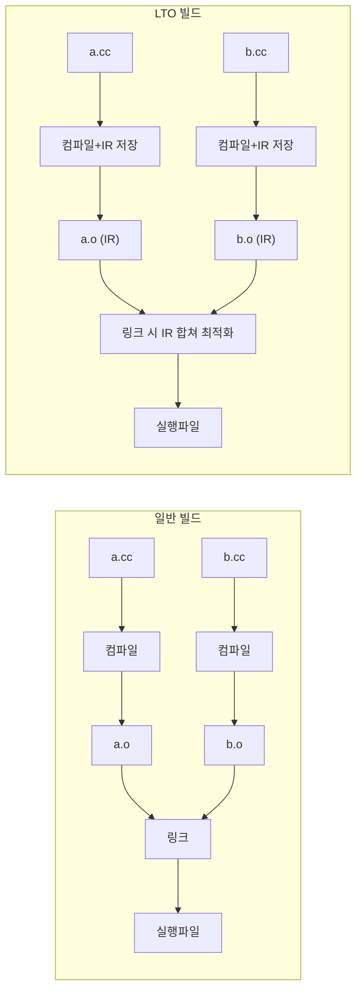

**LTO(Link-Time Optimization)**는 링크 시점에 여러 **번역 단위(TU)**를 합쳐 **크로스-TU 인라이닝**·상수 전파·데드 코드 제거 등을 적용하는 최적화입니다. 코드를 바꾸지 않고도 작은 헬퍼가 여러 TU에 흩어져 있는 구조에서 성능 이득을 얻을 수 있으며, **ThinLTO**는 빌드 시간·메모리를 줄이면서 그 이득의 대부분을 유지합니다. 이 챕터에서는 LTO/ThinLTO 개념, GCC/Clang/MSVC에서의 활성화 방법, **언제 쓸지/피할지** 판단 기준, LTO on/off 성능·크기 검증을 다룹니다.

## 왜 LTO인가 (동기)

일반 빌드에서는 각 TU가 독립적으로 컴파일되므로, 컴파일러는 **다른 TU에 있는 함수의 구현**을 보지 못합니다. 그 결과 **크로스-TU 인라이닝**이 불가능하고, 작은 함수가 여러 TU에서 호출될 때마다 호출 비용이 그대로 남습니다. LTO는 컴파일 시 **IR**을 오브젝트에 넣어 두고 링크 시점에 이를 모아 최적화하므로, TU 경계를 넘는 인라이닝·상수 전파가 가능해집니다. Course 01(인라이닝 유도)과 함께 쓰면 시너지가 큽니다.

## 정의: LTO와 ThinLTO

- **LTO(Link-Time Optimization)**: 컴파일 단계에서 **중간 표현(IR)**을 오브젝트에 넣어 두고, **링크 시점**에 링커(또는 LTO 플러그인)가 이 IR을 모두 모아 하나의 큰 단위처럼 최적화하는 방식입니다. **Full LTO**는 전체 프로그램을 한 덩어리로 처리합니다.
- **ThinLTO**: 전체 프로그램을 한 덩어리로 합치지 않고 **모듈 단위**로 나누어 병렬에 가깝게 처리하는 LTO 방식입니다. 빌드 시간과 링크 시 메모리가 줄어들지만, 일부 크로스 모듈 최적화 기회는 포기합니다.

## 일반 빌드 vs LTO 빌드 흐름



## LTO 활성화 방법

- **GCC**: 컴파일과 링크 **모두**에 **-flto**를 넣습니다. 예: `g++ -flto -O2 a.cc b.cc -o app`. Make/CMake에서는 **CXXFLAGS**와 **LDFLAGS** 모두에 `-flto`가 들어가야 합니다.
- **Clang**: 동일하게 **-flto**를 컴파일·링크 단계에 둡니다. **-flto=full**(기본), **-flto=thin**(ThinLTO)으로 모드를 나눌 수 있습니다.
- **MSVC**: **/LTCG**(Link-Time Code Generation)가 LTO에 해당합니다. 프로젝트 속성 "Link Time Optimization"을 켜거나 링커 옵션에 /LTCG를 추가합니다.

LTO를 켜면 오브젝트 파일이 IR을 담은 형태로 커지고 **링크 시간**이 크게 늘어나며, 링커 메모리 사용량도 증가합니다.

## ThinLTO

**ThinLTO**는 Clang에서 **-flto=thin**으로 켭니다. GCC 9부터 **-flto=auto** 등으로 비슷한 방식을 지원합니다.

- **장점**: Full LTO 대비 **빌드 시간**과 **링크 시 메모리**가 줄어들어 대형 프로젝트에서 실용적입니다. 대부분의 경우 LTO를 끈 것보다 훨씬 나은 성능을 줍니다.
- **단점**: 일부 크로스 모듈 최적화는 포기하므로, 극한의 수치만 필요하면 full LTO와 벤치마크로 비교해 볼 만합니다.

## 예시: 빌드 명령

```bash
# GCC: LTO 적용
g++ -flto -O2 a.cc b.cc -o app

# Clang: ThinLTO
clang++ -flto=thin -O2 a.cc b.cc -o app

# CMake: LTO 전역 적용
set(CMAKE_INTERPROCEDURAL_OPTIMIZATION TRUE)
# 또는
add_compile_options(-flto)
add_link_options(-flto)
```

## LTO on/off 성능·크기 비교

동일 소스·동일 -O2/-O3에 대해 **LTO 없이** 빌드한 바이너리와 **LTO(또는 ThinLTO)** 적용 바이너리를 만들고, **같은 벤치마크**로 실행 시간과 바이너리 크기를 측정합니다. 작은 함수가 여러 TU에 흩어져 있을수록 LTO 이득이 크고, 이미 대부분 인라인되거나 단일 TU에 몰려 있으면 차이가 작을 수 있습니다. 회귀 테스트에서 LTO on을 기본으로 두고, 변경이 성능에 영향을 주지 않는지 확인하는 것을 권장합니다.

## 빌드 캐시(ccache 등)와 LTO

**ccache**는 컴파일러 호출 결과를 캐시합니다. LTO를 쓰면 **오브젝트에 IR**이 들어가 소스만 같아도 플래그(-O2 vs -O3, -flto 유무)에 따라 오브젝트 내용이 달라지므로 ccache hit이 줄어들 수 있습니다. LTO 빌드와 비-LTO 빌드를 섞어 쓰면 캐시 키가 달라져 효과가 반감됩니다. CI에서는 "LTO 한 가지 설정"으로 통일하고 캐시 키에 플래그를 포함하는 것이 안전합니다.

## 역사·배경

LTO는 2000년대 전반에 연구·도입되었고, GCC는 **-flto**를 4.5(2009년경)부터 공식 지원했습니다. GCC 매뉴얼에서는 LTO에 대해 다음과 같이 설명합니다.

> "Link-time optimization (LTO) allows the compiler to perform various optimizations across translation units. The compiler generates a GIMPLE representation of the program and writes it to special ELF sections in the object files. The linker runs the compiler again and reads the GIMPLE representation to perform whole-program optimizations." — [GCC Manual, Option Summary](https://gcc.gnu.org/onlinedocs/gcc/Option-Summary.html) Clang/LLVM은 **Gold 플러그인**을 통한 LTO와 이후 **ThinLTO**를 도입해 대형 프로젝트에서의 빌드 시간 문제를 완화했습니다. MSVC의 **/LTCG**는 그 이전부터 링크 시점 코드 생성으로 제공되어 왔습니다.

## 한눈에 보기: LTO vs 비-LTO vs ThinLTO

| 항목 | 비-LTO | Full LTO | ThinLTO |
|------|--------|----------|---------|
| 크로스-TU 인라이닝 | 없음 | 있음 | 대부분 있음 |
| 링크 시간 | 짧음 | 김 | 중간 |
| 링커 메모리 | 적음 | 많음 | 중간 |
| 빌드 캐시(ccache) | 유리 | 불리 | 불리 |
| 권장 | 작은 프로젝트·빠른 반복 | 극한 성능 필요 시 | **대부분 릴리즈** |

## 판단 기준: 언제 쓸지 / 언제 피할지

| 상황 | 권장 | 비권장 |
|------|------|--------|
| 일반 릴리즈 | ThinLTO (또는 Full LTO) | LTO 없음(성능 포기) |
| 대형 프로젝트·빌드 시간 중요 | ThinLTO | Full LTO(링크 메모리·시간) |
| 디버그 빌드 | LTO 끔 (-O0 등) | LTO 켬(디버깅 어려움) |
| ccache hit 극대화 | LTO 한 설정으로 통일 | LTO on/off 혼용 |

**적용 체크리스트**: (1) 릴리즈에는 ThinLTO(또는 Full LTO)를 켜고, 동일 벤치마크로 LTO on/off를 비교해 이득을 확인한다. (2) CI에서 LTO 설정을 고정하고 캐시 키에 포함한다. (3) 링크 메모리·시간이 문제되면 ThinLTO로 전환한다.

## 용어 정리

| 용어 | 설명 |
|------|------|
| **IR** | Intermediate Representation; 컴파일러가 내부적으로 사용하는 중간 표현. LTO 시 오브젝트에 저장됨 |
| **Full LTO** | 전체 프로그램 IR을 한 덩어리로 합쳐 최적화하는 방식; 링크 시간·메모리 큼 |
| **크로스-TU 인라이닝** | 서로 다른 번역 단위에 있는 함수끼리 인라이닝하는 것; 일반 빌드에서는 불가, LTO에서 가능 |

## 자주 하는 실수

- **컴파일만 -flto, 링크에는 미적용**: LTO가 동작하지 않습니다. CXXFLAGS와 LDFLAGS **둘 다**에 -flto를 넣어야 합니다.
- **LTO와 비-LTO 오브젝트 혼합**: 링크 시 오류나 비일관된 최적화가 나올 수 있으므로, 한 빌드에서는 LTO를 전부 켜거나 전부 끕니다.
- **디버그 빌드에 LTO**: 디버그 정보와 최적화가 맞지 않아 단계 실행·변수 조사가 어긋날 수 있으므로, 디버그 시에는 LTO를 끕니다.

## 비판적 시각

LTO는 **항상 이득**인 것은 아닙니다. TU가 적고 이미 대부분 인라인되는 구조에서는 차이가 미미할 수 있고, 링크 시간·메모리가 치명적인 환경에서는 ThinLTO도 부담일 수 있습니다. "LTO = 켜두는 것"이 아니라, **자신의 프로젝트에서 LTO on/off를 측정한 뒤** 선택하는 것이 좋습니다.

## 학습 성과 목표

- **LTO**와 **ThinLTO**의 정의와 차이를 설명할 수 있다.
- GCC/Clang/MSVC에서 LTO를 활성화하는 방법을 적용할 수 있다.
- LTO on/off 성능·크기 차이를 동일 벤치마크로 검증할 수 있다.
- 빌드 캐시와 LTO의 상충 관계를 설명하고, CI에서 LTO 설정을 통일할 수 있다.

## 핵심 요약

| 항목 | 요약 |
|------|------|
| LTO | 링크 시점에 IR을 합쳐 크로스-TU 인라이닝·상수 전파 적용 |
| ThinLTO | 모듈 단위 병렬 처리로 빌드 시간·메모리 절감, 대부분 릴리즈 권장 |
| 검증 | 동일 벤치마크로 LTO on/off 비교, 회귀 없을 때 LTO 채택 |
| 캐시 | LTO 사용 시 ccache hit 감소; CI에서는 LTO 한 설정으로 통일 |

## 다음 장에서는

**PGO(Profile-Guided Optimization)** 3단계 워크플로우, 프로파일 수집·대표성, PGO 전/후 검증을 다룹니다.

→ [PGO 고급 워크플로우](/collection/optimization-02-compiler/03-pgo-workflow/) (챕터 03)
