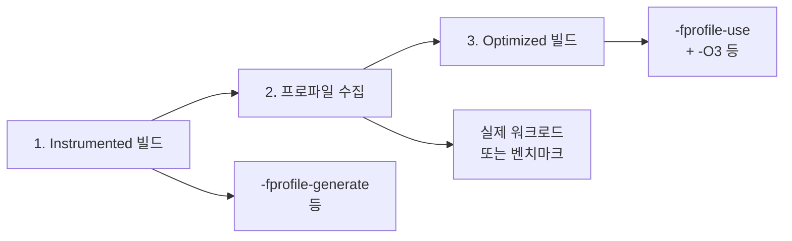

**PGO(Profile-Guided Optimization)**는 실제 실행 **프로파일**을 수집한 뒤 그 정보로 재컴파일해 분기·인라이닝·코드 배치 등을 더 잘 맞춥니다. 같은 소스라도 5~15% 정도 빨라지는 경우가 많지만, **프로파일 대표성**이 부족하면 오히려 성능이 나빠질 수 있습니다. 이 챕터에서는 3단계 워크플로우, 프로파일 수집·대표성, PGO 전/후 검증, **언제 쓸지/피할지** 판단 기준을 다룹니다.

## Profile-Guided Optimization 개념

**PGO(Profile-Guided Optimization)**는 "실제로 어떻게 실행되는지"를 한 번 실행해서 수집한 **프로파일**을, 그다음 컴파일 단계에서 사용하는 방식입니다.

## 역사·배경

PGO는 1990년대 후반부터 연구·상용화되었습니다. 컴파일러 문서에서는 프로파일 기반 최적화의 목적을 다음과 같이 설명합니다.

> "Profile-guided optimization (PGO) uses the results of program execution to guide the optimizer. By using profile information, the compiler can make better decisions about inlining, branch prediction, and other optimizations." — [Clang documentation on Profile-Guided Optimization](https://clang.llvm.org/docs/UsersManual.html#profile-guided-optimization) GCC는 **-fprofile-generate** / **-fprofile-use** 형태로 프로파일 기반 최적화를 지원했고, Microsoft는 Visual C++에서 **/LTCG**와 연계한 PGO를 제공해 왔습니다. Clang/LLVM은 **-fprofile-instr-generate**·**-fprofile-instr-use**와 샘플링 기반 AutoFDO 등으로 진화했습니다. 오늘날에는 서버·게임·데스크톱 앱 등에서 핫 경로가 분명한 워크로드에 PGO를 적용해 5~15% 수준의 이득을 얻는 사례가 많습니다. 컴파일러는 프로파일을 보고 자주 실행되는 경로·핫 함수·루프를 알 수 있으므로, 분기 배치·인라이닝 우선순위·루프 최적화·코드 배치 등을 프로파일 없이 할 때보다 더 잘 맞출 수 있습니다. 그 결과 동일 소스라도 PGO 적용 후 5~15% 정도 빨라지는 경우가 많고, 분기가 많은 코드일수록 이득이 커질 수 있습니다.

## 3단계 워크플로우

1. **Instrumented 빌드**: 프로파일 수집을 위해 **계측 코드**가 삽입된 바이너리를 만듭니다. GCC는 **-fprofile-generate**, Clang은 **-fprofile-instr-generate**, MSVC는 **/GENPROFILE** 등을 사용합니다. 이 단계에서는 최적화를 -O2 수준으로 두는 경우가 많습니다.
2. **프로파일 수집**: 위 바이너리를 **실제 워크로드**나 **대표 벤치마크**로 실행합니다. 실행이 끝나면 .gcda(GCC) 또는 .profraw(Clang) 등 프로파일 파일이 생성됩니다. 이 파일에는 함수/엣지/블록별 실행 횟수 등이 기록됩니다.
3. **Optimized 빌드**: 프로파일을 사용해 **다시 컴파일**합니다. GCC는 **-fprofile-use**, Clang은 **-fprofile-instr-use**, MSVC는 **/USEPROFILE** 등을 사용하고, 이때 -O3를 쓰는 경우가 많습니다. 컴파일러는 프로파일을 읽어 핫 경로를 우선 인라인하고, 분기를 예측하기 좋게 재배치합니다.

소스나 빌드 설정이 바뀌면 프로파일이 무효화되므로, 큰 변경 후에는 1~3단계를 다시 수행해야 합니다.

## 3단계 워크플로우 (Mermaid)

## 프로파일 수집 방법과 대표성

프로파일은 **실제 서비스 트래픽에 가까운 입력**으로 수집하는 것이 이상적입니다. 그래야 "실제로 자주 타는 경로"가 반영됩니다. 현실적으로는 다음을 조합합니다.

- **통합/시스템 테스트**: 자주 쓰는 시나리오를 자동화해 실행하고, 그 실행으로 프로파일을 모읍니다.
- **벤치마크 스위트**: 대표적인 부하를 만드는 벤치마크를 돌려서 프로파일을 냅니다. 벤치마크가 실제 사용 패턴을 잘 커버해야 PGO 이득이 제대로 나옵니다.
- **샘플링 프로파일러**: perf, VTune 등으로 수집한 샘플 기반 프로파일을 일부 컴파일러가 사용할 수 있습니다(AutoFDO 등). 이 경우 별도 instrumented 빌드 없이 기존 바이너리 실행만으로 프로파일을 만들 수 있습니다.

**대표성이 부족한** 프로파일(예: 한두 개의 극단적인 테스트만 돌린 경우)을 쓰면, 실제 트래픽과 다른 경로가 "핫"으로 잡혀 오히려 성능이 나빠질 수 있으므로, 가능한 한 다양한·대표적인 워크로드로 수집하는 것이 중요합니다.

## PGO 전/후 성능 검증

PGO를 적용한 뒤에는 **동일한 벤치마크**로 PGO 적용 전·후 실행 시간을 측정합니다. 수치적으로 개선이 나와야 하고, 중요한 지표(지연 시간, 처리량)가 나빠지면 프로파일 대표성이나 빌드 설정을 점검해야 합니다. 회귀 테스트 파이프라인에 "PGO 빌드 + 벤치마크"를 넣어 두면, 변경이 PGO 이득을 깨뜨리지 않는지 계속 확인할 수 있습니다.

## CI/자동화에서 PGO 적용 시 고려사항

- **캐시**: 프로파일 파일(.gcda, .profraw 등)과 PGO 최적화 빌드 산출물은 캐시해 두면 다음 빌드에서 3단계만 재실행하거나 프로파일 재수집을 건너뛸 수 있습니다. 캐시 키에는 소스 해시·빌드 플래그·프로파일 입력 식별자를 넣어야 합니다.
- **재현성**: 프로파일이 환경(입력 데이터, 실행 순서)에 따라 달라지므로, CI에서 같은 입력·같은 순서로 프로파일을 수집해 두면 재현 가능한 PGO 빌드를 만들 수 있습니다.
- **비용**: 3단계 워크플로우는 빌드·실행·재빌드로 이어져 CI 시간이 길어집니다. 주 브랜치나 릴리즈 브랜치에만 PGO 빌드를 두고, PR에서는 일반 -O2/-O3만 돌리는 식으로 정책을 나누는 경우가 많습니다.

## 판단 기준: 언제 PGO를 쓸지 / 피할지

| 상황 | 권장 | 비권장 |
|------|------|--------|
| 핫패스가 분기·인라이닝에 민감 | PGO 적용, 대표 워크로드로 수집 | 대표성 없는 입력으로만 수집 |
| 실제 트래픽과 유사한 벤치 보유 | PGO + 회귀 테스트 | 한두 테스트만으로 프로파일 |
| CI 시간·비용 제약 | 릴리즈/주 브랜치만 PGO | 모든 PR에 PGO |
| 소스·빌드 자주 변경 | 프로파일 재수집 주기 정책 | 변경 후 프로파일 미갱신 |

**적용 체크리스트**: (1) 프로파일은 실제 서비스에 가까운·대표적인 워크로드로 수집한다. (2) PGO 적용 후 동일 벤치마크로 전/후 성능을 측정해 회귀가 없는지 확인한다. (3) 소스·의존성·빌드 옵션이 바뀌면 프로파일을 다시 수집한다.

## 자주 하는 실수

- **프로파일 미갱신**: 소스·의존성·빌드 플래그가 바뀐 뒤에도 예전 프로파일로 Optimized 빌드를 하면, 잘못된 핫 경로에 맞춰 최적화되어 성능이 나빠질 수 있다. 변경이 있을 때마다 1~3단계를 다시 수행하는 습관을 들인다.
- **대표성 없는 입력으로만 수집**: 한두 개의 극단적인 테스트나 실제 트래픽과 다른 벤치만 돌려 프로파일을 만들면, 실제로 자주 타는 경로가 반영되지 않아 PGO가 역효과를 낸다. 가능한 한 다양한·대표적인 워크로드로 수집한다.
- **PGO 빌드로만 성능 판단**: PGO 적용 후 숫자가 좋아졌다고 해서, "PGO가 무조건 이득"이라고 일반화하면 안 된다. 워크로드·대표성에 따라 이득이 없거나 손해일 수 있으므로, 전/후 측정과 회귀 테스트로 검증한다.

## PGO 도입·프로파일 재수집 시 주의

PGO를 처음 도입하거나, 기존 프로젝트에 PGO를 넣을 때 다음을 지키면 실수를 줄일 수 있다.

- **소스·빌드 변경 시 재수집**: 함수 추가/삭제·호출 경로 변경·최적화 플래그 변경이 있으면 기존 프로파일은 무효다. Instrumented 빌드 → 프로파일 수집 → Optimized 빌드 3단계를 다시 수행한다.
- **CI 캐시 무효화**: 프로파일 파일(.gcda, .profraw 등)이나 PGO 최적화 빌드 산출물을 캐시할 때, **캐시 키**에 소스 해시·빌드 플래그·프로파일 입력 식별자를 넣어야 한다. 키에 플래그나 소스가 빠지면 이전 프로파일로 잘못 빌드된 결과가 재사용될 수 있다.
- **점진적 도입**: 한 번에 전체 빌드에 PGO를 걸지 말고, 핵심 라이브러리나 실행 파일부터 적용한 뒤 벤치로 이득을 확인하고, 그다음 범위를 넓히는 방식을 권장한다.

## 용어 정리

| 용어 | 설명 |
|------|------|
| **Instrumented 빌드** | 프로파일 수집을 위해 계측 코드가 삽입된 빌드; -fprofile-generate 등 사용 |
| **.gcda / .profraw** | GCC·Clang에서 생성하는 프로파일 파일; 함수/엣지/블록별 실행 횟수 등 기록 |
| **프로파일 대표성** | 수집한 프로파일이 실제 배포 환경·트래픽을 얼마나 잘 반영하는지; 대표성 부족 시 PGO가 역효과 |

## 학습 성과 목표

- **PGO** 3단계(Instrumented 빌드 → 프로파일 수집 → Optimized 빌드)를 설명하고 적용할 수 있다.
- 프로파일 **대표성**이 부족할 때 성능이 나빠질 수 있음을 설명하고, 다양한·대표적인 워크로드로 수집할 수 있다.
- PGO 전/후 성능 검증과 CI 연동 시 캐시·재현성·비용을 고려할 수 있다.

## 비판적 시각: 한계와 트레이드오프

PGO는 **만능이 아니다**. 프로파일 대표성이 부족하면 성능이 나빠지고, 3단계 워크플로우와 CI 비용이 든다. "PGO를 켜면 무조건 빨라진다"는 오해를 피하고, 다음을 명심한다.

- **상황에 따른 선택**: 워크로드가 고정적이고 핫 경로가 분명할 때 이득이 크다. 입력이 매우 다양하거나 경로가 균등하면 이득이 작거나 없을 수 있어, 측정으로 판단해야 한다.
- **트레이드오프**: 빌드·실행·재빌드로 CI 시간이 길어지고, 프로파일 저장·캐시 관리 비용이 든다. 릴리즈/주 브랜치에만 PGO를 두고 PR에서는 일반 -O2/-O3만 쓰는 식으로 비용과 이득을 나눈다.
- **한계**: 프로파일은 "한 번 찍은 스냅샷"이다. 배포 후 사용 패턴이 바뀌면 그때의 프로파일과 맞지 않을 수 있으므로, 주기적 재수집이나 대표 시나리오 다각화를 고려한다.

## 핵심 요약

| 항목 | 요약 |
|------|------|
| PGO | 실행 프로파일로 분기·인라이닝·배치를 맞춤; 5~15% 이득 가능 |
| 대표성 | 프로파일은 실제 트래픽에 가까운 입력으로 수집해야 함 |
| 검증 | PGO 적용 후 동일 벤치마크로 전/후 측정, 회귀 방지 |
| CI | 캐시·재현성·비용 고려; 릴리즈/주 브랜치에 PGO 빌드 권장 |

## 다음 장에서는

**GCC vs Clang vs MSVC** 최적화 차이, 벡터화·인라이닝·루프 영역별 비교, 플랫폼별 선택을 다룹니다.

→ [컴파일러 비교: GCC vs Clang vs MSVC](/collection/optimization-02-compiler/04-compiler-comparison/) (챕터 04)
