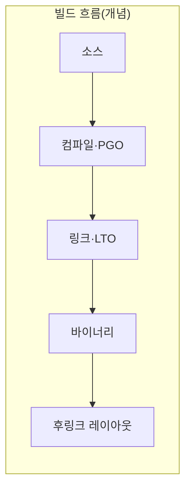

본 장은 **전문** 난이도입니다. **후링크(post-link) 최적화**는 이미 링크가 끝난 실행 파일(또는 공유 라이브러리)을 입력으로 받아, **코드·데이터 배치**를 바꿔 I-cache·분기 예측·TLB 압력을 완화하는 계열의 기법입니다. 대표적으로 LLVM 생태계에서는 **BOLT**가 이 역할을 논의할 때 자주 등장합니다. 여기서는 특정 버전 문서를 따라가기보다, **파이프라인에서 어디에 놓이는지**와 **무엇이 깨지기 쉬운지**를 정리합니다.

## 후링크가 하는 일(직관)

컴파일러와 링커는 이미 **함수 단위 배치**, **섹션 배치**, **LTO** 등으로 레이아웃을 결정합니다. 그런데 프로덕션 프로파일을 보면 “자주 함께 실행되는 코드 조각”이 물리적으로 멀리 떨어져 있어 **I-cache 미스**나 **분기 타깃 혼잡**을 키우는 경우가 있습니다. 후링크 도구는 **실행 빈도·호출 그래프** 같은 입력을 바탕으로 **기계어 블록의 순서·인접 배치**를 다시 잡습니다.

핵심은 **소스를 다시 컴파일하지 않고도** 레이아웃만 손본다는 점입니다. 대신 **심볼·재배치 정보·디버그 정보**가 어떻게 남아 있는지, **스트립(strip)** 여부, **PIE**·**ASLR** 정책 등과 상호작용하므로 “빌드 한 줄 추가” 수준으로 생각하면 운영 사고로 이어지기 쉽습니다.

## PGO·LTO와의 순서 감각

실무에서 자주 하는 질문은 “**PGO 다음에 BOLT인가, 그 반대인가**”입니다. 둘 다 **프로파일**을 쓰지만 역할이 다릅니다.

- **PGO**(이 트랙 챕터 03): 컴파일 타임에 **인라이닝·분기 힌트·레지스터 할당** 등 **코드 생성** 자체를 프로파일에 맞춥니다.
- **LTO**(챕터 02): TU 경계를 넘은 **최적화·제거·중복 제거**를 링크 단계에서 수행합니다.
- **후링크**: “이미 생성된 기계어”의 **배치**를 다시 짭니다.

그래서 흔한 이야기는 **코드 생성 최적화(PGO/LTO)를 먼저 안정화**하고, 그 결과물에 대해 **레이아웃만 추가로 다듬는** 쪽이 논리적으로 맞다는 것입니다. 다만 팀의 빌드 파이프라인이 **재현 가능한 프로파일 수집**을 전제로 하지 않으면, 어느 단계를 넣어도 숫자만 흔들립니다.

## 프로파일 대표성이 전부에 가깝다

후링크는 **입력 프로파일이 무엇을 보여 주느냐**에 따라 이득도 손해도 극단적으로 갈립니다.

- **워크로드 불일치**: 벤치에선 hot인데 프로덕션에선 cold인 코드를 앞으로 당기면 I-cache를 오히려 망칠 수 있습니다.
- **버전 드리프트**: 프로파일을 낸 바이너리와 레이아웃을 적용할 바이너리가 조금이라도 다르면(심볼·오프셋) 결과가 불안정해질 수 있습니다.
- **다중 프로파일 병합**: 서비스가 여러 모드(배치·온라인·관리 RPC)를 가지면 단일 프로파일이 모드를 왜곡합니다.

따라서 도입 검토 문서에는 **“평균 지연 몇 %”**보다 **“어떤 트래픽 믹스로 수집했는지”**와 **“꼬리(p99/p999)를 볼 것인지”**를 먼저 적는 편이 안전합니다. Tr.05의 측정 관점과 직결됩니다.

## CI·릴리즈 파이프라인에서의 현실적인 걱정

- **재현성**: 동일 커밋에서도 프로파일 입력이 달라지면 산출 바이너리 해시가 달라질 수 있습니다. “성능은 좋아졌는데 바이너리가 매번 다르다”는 감사·보안 팀과의 대화가 필요할 수 있습니다.
- **디버깅**: 레이아웃 재배치는 **스택 트레이스와 어셈블리 주소 매핑**을 낯설게 만니다. 심볼 서버·디버그 정보 정책을 같이 설계해야 합니다.
- **검증 비용**: 후링크 on/off를 **동일 벤치·동일 하드웨어**로 비교하지 않으면 회귀 원인을 찾기 어렵습니다.

## 적용 판단 체크리스트

아래를 **대부분 예**에 가깝게 맞출 때만 우선순위를 높이는 것을 권합니다.

1. PGO/LTO까지 적용했는데도 **I-cache miss** 또는 **명령 fetch 관련 병목**이 프로파일에서 뚜렷하다.  
2. 프로파일 수집 경로가 **자동화**되어 있고, 트래픽 믹스가 문서화되어 있다.  
3. 릴리즈 산출물에 대해 **후링크 전후 바이너리**를 보존·비교할 수 있다.  
4. 성능 이슈가 **단일 프로세스·장기 실행** 형태로 재현된다(극단적 다중 테넌트·초단수명 프로세스는 이득이 희미할 수 있음).

## 이 트랙 안에서의 위치

- **챕터 06(코드 생성 분석)**: “무슨 명령이 나왔는가”에 가깝습니다.  
- **본 장**: “그 명령이 메모리상 어디에 모여 있는가”에 가깝습니다.  
- **Tr.06(CPU)**: 캐시 미스 **원인**을 하드웨어 카운터로 해석합니다.  
- **Tr.01(ABI)**: 공개 API 경계·심볼 가시성이 레이아웃 도구와 충돌할 수 있습니다.

## 흔한 오해

- **“후링크가 PGO를 대체한다”**: 역할이 다릅니다. 둘 다 프로파일을 쓰지만 최적화 대상 층이 다릅니다.  
- **“디버그 빌드에도 켜도 된다”**: 보통 의미가 없거나 디버깅 경험만 나빠집니다.  
- **“한 번 튜닝하면 영구적이다”**: 코드·라이브러리·컴파일러·링커가 바뀔 때마다 프로파일과 파이프라인을 다시 맞춰야 합니다.

## 마무리

BOLT 같은 후링크 최적화는 **니치하지만 강력한 레버**입니다. 성공 조건은 도구 문법이 아니라 **프로파일 거버넌스**와 **릴리즈 파이프라인 계약**에 있습니다. 숫자는 Tr.05에서, 빌드 단계 책임은 이 트랙의 앞선 챕터들에서 이미 다뤘으므로, 본 장은 **“언제 손대고 언제 멈출지”**를 닫는 역할로 쓰면 됩니다.

## 부록: 문서화에 넣을 한 페이지 분량

팀 위키에 아래 소제목만 채워도 도입 논의가 빨라집니다.

1. **대상 바이너리**: 서버 바이너리인지, 공유 라이브러리인지, 플러그인인지.  
2. **프로파일 수집 방법**: 샘플링인지 인스트루먼트인지, 기간·샘플 수.  
3. **트래픽 믹스**: 대표 시나리오와 비대표 시나리오.  
4. **검증 벤치**: 평균·꼬리·처리량 지표 각각.  
5. **롤백**: 후링크 단계만 끄는 스위치와 바이너리 보존 정책.  
6. **보안·규정**: 바이너리 재작성이 감사 범위에 어떻게 보고되는지(Tr.09와 연계).

## 부록: 용어 정리

- **Layout**: 실행 파일 안에서 함수·베이식 블록의 배치.  
- **Basic block**: 분기 없이 연속 실행되는 명령 묶음(개념 수준 정의).  
- **Post-link**: 링크 산출물을 입력으로 하는 후처리 단계.  
- **Profile**: 엣지 빈도, 샘플 PC, LBR 등 도구가 요구하는 형식은 제각각이므로 “우리 파이프라인의 profile”을 하나로 정의합니다.
