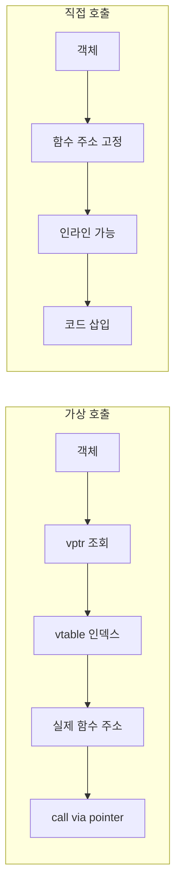

---
collection_order: 3
date: 2026-03-10
lastmod: 2026-07-10
draft: false
image: wordcloud.png
title: "[Optimization(C++) 03] 추상화 비용 분석"
slug: abstraction-cost
description: "가상 함수, RTTI, 예외 처리의 정량적 비용을 마이크로벤치마크로 측정하고, devirtualization 등으로 비용을 줄이는 방법을 다룹니다. Low-latency C++ 트랙의 핵심 진입 챕터이며, 평가 기준·판단 기준·비판적 시각과 다음 장 링크를 제공합니다."
tags:
  - C++
  - Performance
  - Optimization
  - 성능
  - 최적화
  - Profiling
  - 프로파일링
  - Benchmark
  - Memory
  - 메모리
  - Compiler
  - 컴파일러
  - CPU
  - Cache
  - Code-Quality
  - 코드품질
  - Implementation
  - 구현
  - Best-Practices
  - Clean-Code
  - 클린코드
  - Software-Architecture
  - 소프트웨어아키텍처
  - Abstraction
  - 추상화
  - Polymorphism
  - 다형성
  - OOP
  - 객체지향
  - Interface
  - 인터페이스
  - Encapsulation
  - 캡슐화
  - Design-Pattern
  - 디자인패턴
  - Data-Structures
  - 자료구조
  - Time-Complexity
  - 시간복잡도
  - Complexity-Analysis
  - 복잡도분석
  - Testing
  - 테스트
  - Debugging
  - 디버깅
  - Refactoring
  - 리팩토링
  - Type-Safety
  - Readability
  - Maintainability
  - Modularity
  - Error-Handling
  - 에러처리
  - Edge-Cases
  - 엣지케이스
  - Pitfalls
  - 함정
  - Documentation
  - 문서화
  - Git
  - CI-CD
  - Linux
  - Windows
  - OS
  - 운영체제
  - Concurrency
  - 동시성
  - Latency
  - Throughput
  - Async
  - 비동기
  - Backend
  - 백엔드
  - Embedded
  - 임베디드
  - Advanced
  - Deep-Dive
  - 실습
  - Guide
  - 가이드
  - Reference
  - 참고
  - Case-Study
  - Technology
  - 기술
  - Tutorial
  - 튜토리얼
---

**추상화 비용**이란 가상 함수, RTTI, 예외처럼 "편의성·유연성"을 주는 언어 메커니즘이 런타임에 치르는 대가를 말합니다. 본 챕터에서는 이 세 가지의 정량적 비용을 마이크로벤치마크로 측정하고, **devirtualization**·인라이닝 유도 등으로 그 비용을 줄이는 방법을 다룹니다. Low-latency 경로에서는 추상화 한 번이 전체 지연의 상당 부분을 차지할 수 있으므로, 비용을 수치로 알고 상황에 맞게 대체하는 것이 목표입니다.

### 추상화 비용이 중요한 이유 (배경)

가상 함수는 C++에 처음 도입된 이래(1980년대) 다형성과 캡슐화의 핵심 수단이 되어 왔고, RTTI와 예외 역시 표준화 과정에서 "편의성 vs 비용" 트레이드오프로 논의되어 왔습니다. Itanium C++ ABI 등으로 **zero-cost exception** 모델이 정착한 뒤에도, "예외를 던지는 경로"의 비용은 여전히 크기 때문에, 트레이딩·게임·임베디드 등 지연이 중요한 도메인에서는 **언제 가상 호출을 쓸지**, **RTTI 대신 무엇을 쓸지**, **예외 대신 에러 코드/expected를 쓸지**를 선택할 수 있어야 합니다. 이 챕터는 그 선택을 정량적으로 뒷받침하기 위해 "추상화 1개" 단위 비용을 측정하고 대안을 비교하는 방법을 다룹니다.

## 이 장을 읽기 전에

**완전한 초보자?** 이 장에서 쓰는 "핫패스·추상화 비용·격리 측정" 용어는 앞선 [01장: C++ 실행 모델·µs 최적화 어휘](/post/cpp-optimization/cpp-execution-model-microsecond-vocabulary-fundamentals/)와 [02장: Smart Pointer 비용 기초](/post/cpp-optimization/smart-pointer-cost-fundamentals/)에서 정리했습니다. 두 기초 장을 건너뛰었더라도 이 장에서 필요한 용어는 본문에서 그때그때 짚으므로 그대로 읽어도 됩니다. 가상 함수가 무엇인지(기반 클래스 포인터로 파생 객체의 함수를 호출하는 것)와 `dynamic_cast`·예외가 문법적으로 무엇을 하는지 정도만 알면 충분합니다.

**이 장의 깊이**: 이 장은 **중급~전문가**를 포괄합니다. 가상 호출·RTTI·예외의 "한 번당 비용"을 마이크로벤치마크로 측정하는 것부터 시작해, 전문가 구간에서는 devirtualization 유도(`final`·LTO)와 어셈블리 수준에서 간접/직접 호출을 구분하는 방법까지 다룹니다. **다루지 않는 것**: 컴파일러 인라이닝 리포트·진단 플래그의 깊은 사용법(Tr.03 컴파일러 트랙)과 CPU 분기 예측·캐시 미스의 하드 분석(CPU 트랙)입니다. 인라이닝 유도 자체는 [12장: 인라이닝 유도 기법](/post/cpp-optimization/inlining-techniques/)에서 이어집니다.

## 당신의 수준에 맞는 경로

| 수준 | 읽을 부분 | 핵심 목표 |
|------|---------|---------|
| **초보자** | "가상 함수 호출 비용" ~ "예외 처리의 정량적 비용" | 가상 호출·RTTI·예외가 왜 비용을 부르는지 이해 |
| **중급자** | "Devirtualization" ~ "측정과 검증" | 추상화별 비용을 격리 측정·해석 |
| **전문가** | "판단 기준" ~ "비판적 시각" | devirtualization 유도와 적용/회피 판단 |

---

## 가상 함수 호출 비용

C++에서 **가상 함수**는 **vtable(가상 테이블)**을 통해 동작합니다. 객체 내부에 **vptr**(가상 테이블 포인터)가 있고, 호출 시 vptr → vtable → 실제 함수 주소로 **간접 호출**이 일어납니다. 이로 인해 다음 비용이 발생합니다.

1. **간접 분기**: CPU는 호출 직전까지 실제 타깃을 알 수 없어 분기 예측이 어렵고, 예측 실패 시 파이프라인 플러시 비용이 듭니다. 여러 파생 타입이 섞여 호출되면 예측 실패가 늘어납니다.
2. **인라이닝 불가**: 컴파일러가 호출 지점에서 구현을 알 수 없으므로 대부분 인라인하지 못하고, 호출/반환 오버헤드와 레지스터 저장·복원이 남습니다. 인라인되면 상수 전파·루프 최적화 등 추가 최적화 기회가 생기므로, 인라인 불가는 그 기회까지 잃는 결과가 됩니다.
3. **캐시**: vtable과 여러 파생 클래스 구현이 흩어지면 I-cache·D-cache 미스가 늘어날 수 있습니다. 서로 다른 파생 타입 객체를 번갈아 접근하면 캐시 라인이 자주 바뀌어 비용이 누적될 수 있습니다.

**vtable과 vptr**: 각 다형 클래스마다 컴파일러가 **vtable**(가상 함수 주소 배열)을 생성하고, 객체에는 그 vtable을 가리키는 **vptr**이 보통 객체 선두에 배치됩니다. 호출 시 `*(obj->vptr + offset)`으로 함수 주소를 읽어 `call *reg` 형태의 간접 호출을 수행합니다. 다중 상속·가상 상속이 있으면 vptr가 여러 개일 수 있어 오프셋 계산과 캐시 동작이 더 복잡해질 수 있습니다.

### 가상 호출 vs 직접 호출 흐름

가상 호출은 간접 참조를 거치고, 직접 호출(인라인)은 호출부에서 바로 코드가 펼쳐집니다. 구조 차이는 아래와 같습니다.



### 가상 vs 직접 호출 마이크로벤치마크 (Google Benchmark)

동일한 `compute()` 로직을 기반 포인터를 통한 가상 호출과 같은 TU에 정의된 직접 호출로 나누어 측정합니다. `benchmark::DoNotOptimize`로 컴파일러가 결과를 버리거나 루프를 통째로 제거하지 못하게 막아, "가상 호출 1개"의 비용을 격리합니다. 아래 코드는 그대로 컴파일·실행할 수 있습니다(`-O2 -lbenchmark`).

```cpp
#include <benchmark/benchmark.h>

struct Base {
  virtual int compute(int x) const { return x * 2 + 1; }
  virtual ~Base() = default;
};
struct Derived final : Base {
  int compute(int x) const override { return x * 2 + 1; }
};

// 직접 호출(인라인 후보): 같은 TU에 정의되어 인라인 가능
inline int compute_direct(int x) { return x * 2 + 1; }

static void BM_VirtualCall(benchmark::State& state) {
  Derived d;
  Base* p = &d;  // 기반 포인터를 통해 간접(가상) 호출을 강제
  int x = 0;
  for (auto _ : state) {
    x = p->compute(x);
    benchmark::DoNotOptimize(x);
  }
}
BENCHMARK(BM_VirtualCall);

static void BM_DirectCall(benchmark::State& state) {
  int x = 0;
  for (auto _ : state) {
    x = compute_direct(x);
    benchmark::DoNotOptimize(x);
  }
}
BENCHMARK(BM_DirectCall);

// 다형(polymorphic) 호출: 서로 다른 파생 타입을 번갈아 호출해
// 매번 실제 타깃이 바뀌게 만든다 (분기 예측기의 타깃 캐시가 misprediction을 겪기 쉬움).
struct Derived2 final : Base {
  int compute(int x) const override { return x * 3 - 1; }
};

static void BM_VirtualCallPolymorphic(benchmark::State& state) {
  Derived d1;
  Derived2 d2;
  Base* objs[2] = {&d1, &d2};
  int x = 0;
  for (auto _ : state) {
    x = objs[x & 1]->compute(x);   // 실제 타입이 매 호출 바뀜 → 간접 분기 예측 실패 유발
    benchmark::DoNotOptimize(x);
  }
}
BENCHMARK(BM_VirtualCallPolymorphic);

BENCHMARK_MAIN();
```

위 `BM_VirtualCall`은 언제나 같은 `Derived` 객체 하나만 호출하는 **단형(monomorphic)** 케이스이고, `BM_VirtualCallPolymorphic`은 `Derived`·`Derived2`를 번갈아 호출해 분기 예측기가 타깃을 매번 갱신해야 하는 **다형(polymorphic)** 케이스입니다. 아래 자릿수 표의 "단형"·"다형" 행은 각각 이 두 벤치마크에 대응합니다.

`Derived`를 `final`로 두고 LTO를 켜면 많은 컴파일러가 `p->compute(x)`를 직접 호출로 바꿔(devirtualization) 두 벤치마크의 차이가 거의 사라질 수 있습니다. `-S`로 어셈블리를 뽑으면 가상 호출 경로는 `call *rax`(간접), 직접/devirtualized 경로는 `call _ZNK7Derived7computeEi` 같은 직접 호출로 나타납니다. (측정값은 CPU·플래그에 따라 다름)

**벤치마크 해석**: 두 경우의 차이가 크면(예: 2배 이상) 해당 경로가 핫패스일 때 devirtualization·구체 타입 사용을 검토할 가치가 있습니다. 차이가 작으면(예: 10% 미만) 다른 병목(메모리 접근, 분기 예측 등)을 먼저 살펴봅니다. LTO·final 적용 후 다시 측정해, 개선과 어셈블리 변화를 함께 확인합니다.

## RTTI 비용

**RTTI(Run-Time Type Information)**는 `typeid`와 `dynamic_cast`에 사용됩니다. RTTI를 쓰면 컴파일러는 타입 정보를 오브젝트 파일에 남기고, `dynamic_cast` 시 상속 계층을 따라가며 타입을 검사합니다.

- **typeid**: 타입 정보 조회. 가상 함수가 있는 클래스에서는 vtable을 통해 타입 정보를 가져오며, 비교·이름 조회 비용이 있습니다.
- **dynamic_cast**: 포인터/참조에 대해 다운캐스트·크로스캐스트를 수행하며, 실패 시 null 또는 예외. 상속 깊이·다중 상속에 따라 검사 비용이 증가합니다.

RTTI 사용 시점은 "실제로 런타임에 타입을 알아야 할 때"로 한정하는 것이 좋습니다. 타입 집합이 컴파일 타임에 고정되어 있으면 아래처럼 `std::variant`와 `std::visit`로 RTTI 없이 디스패치할 수 있고, 인라이닝·분기 예측에도 유리합니다.

```cpp
#include <variant>
#include <string>
#include <type_traits>

using Var = std::variant<int, double, std::string>;

int get_tag(const Var& v) {
  return std::visit([](const auto& x) -> int {
    using T = std::decay_t<decltype(x)>;
    if constexpr (std::is_same_v<T, int>) return 0;
    else if constexpr (std::is_same_v<T, double>) return 1;
    else return 2;
  }, v);
}
// 컴파일러가 visit를 switch 또는 인라인된 분기로 최적화할 수 있음.
// 타입 집합이 고정되면 dynamic_cast + typeid 대신 이 패턴이 RTTI 비용을 제거함.
```

**RTTI 대안 선택 가이드**: 타입 집합이 컴파일 타임에 고정되고 개수가 적으면(예: 2~10개) `std::variant` + `std::visit`가 단순하고 인라이닝에 유리합니다. 타입별 연산(방문)이 많고 타입 추가가 드물면 Visitor 패턴이, 단순히 정수 태그로 구분하면 될 때는 열거형 + switch가 가장 저렴합니다. 타입 집합이 열려 있거나 플러그인 경계에서는 RTTI 사용을 받아들이고, 그 사용을 경계 밖으로 두는 것이 현실적입니다. `-fno-rtti`(GCC/Clang)로 RTTI를 끄면 타입 정보가 오브젝트에 포함되지 않아 코드 크기가 줄지만, RTTI에 의존하는 라이브러리와는 함께 쓸 수 없습니다.

## 예외 처리의 정량적 비용

C++ 예외는 정상 경로에서의 오버헤드를 최소화하는 **zero-cost exception** 모델을 목표로 합니다.

> "With zero-cost exception handling, the cost of adding exception handling to a program is negligible when no exception is thrown; the cost is paid when an exception is thrown." — Itanium C++ ABI: Exception Handling, 문서 개정 이력상 최초 초안 1999년(990909)·최신 개정 2005년(050504)으로 확인됨 (https://itanium-cxx-abi.github.io/cxx-abi/abi-eh.html)

즉, 예외를 던지지 않는 경로에서는 추가 분기나 테이블 조회 비용을 최소화합니다. 반면 **예외가 발생한 경로**에서는 스택 언와인딩, landing pad 탐색, catch 블록 타입 매칭 등으로 상당한 비용이 듭니다.

| 경로 | 비용 특성 |
|------|-----------|
| 정상 경로 (예외 미발생) | zero-cost 목표: 추가 분기·테이블 조회 최소화 |
| 예외 경로 (throw ~ catch) | 스택 언와인딩, 소멸자 호출, landing pad 탐색, 타입 매칭 — 스택 깊이·프레임 수에 비례 |

핫패스에서 실패가 나올 수 있으면 예외 대신 에러 코드나 `std::expected`를 쓰는 편이 예측 가능한 비용을 줍니다. 예외 throw는 "실패 경로"에서만 비용이 크고, 에러 코드/`std::expected`는 호출부에서 한 번의 분기로 처리됩니다.

```cpp
#include <expected>   // C++23
#include <string_view>

// 에러 코드 경로: 반환값으로 성공/실패 전달. 핫패스에서 실패 가능하면 비용 예측 가능.
std::expected<int, int> parse_expected(std::string_view s) {
  if (s.empty()) return std::unexpected(-1);
  int v = 0;
  for (char c : s) {
    if (c < '0' || c > '9') return std::unexpected(-2);
    v = v * 10 + (c - '0');
  }
  return v;
}
// 호출부: auto r = parse_expected(input); if (!r) return r.error(); int x = *r;
```

실제 선택 시에는 챕터 11(noexcept·예외 경로 비용), 챕터 13(std::expected)를 참고해, "정상만 있는 경로"와 "실패가 가끔 나오는 경로"를 구분해 설계합니다.

## Devirtualization

**Devirtualization**은 컴파일러가 가상 호출을 제거하고 직접 호출(또는 인라인)로 바꾸는 최적화입니다. 다음 조건에서 가능성이 높아집니다.

- **final**: 클래스나 메서드가 `final`이면 더 이상 오버라이드가 없으므로, 해당 호출을 직접 호출로 고정할 수 있습니다.
- **단일 구현**: 링크/번역 단위에서 파생 클래스가 하나만 보이면 그 구현으로 고정할 수 있습니다.
- **LTO(Link Time Optimization)**: 링크 시점에 전체 프로그램을 보므로, 실제로 사용되는 타입이 하나로 좁혀지면 devirtualization이 더 많이 일어납니다.

확인 방법으로는 **어셈블리 출력**(`-S`, `objdump -d`)에서 가상 호출이 `call *rax`가 아니라 `call _ZNK7Derived7computeEi` 같은 직접 호출로 나오는지 보거나, **컴파일러 최적화 리포트**(`-fopt-info-inline`, Clang `-Rpass=inline`)를 사용할 수 있습니다.

| 어셈블리 패턴 | 의미 |
|--------------|------|
| `call *reg` (예: `call *rax`) | 간접 호출 — 가상 호출 유지 |
| `call _ZNK7Derived7computeEi` | 직접 호출 — devirtualization 적용 |

**캡슐화 경계와 DLL**: 다른 번역 단위(.cpp)나 **DLL/공유 라이브러리** 경계를 넘어서 호출하면, 컴파일러는 내부에 파생 클래스 구현이 있는지 알 수 없어 devirtualization을 하지 못합니다. 따라서 핫패스에 있는 인터페이스는 같은 번역 단위에 구현을 두거나, final·LTO로 보완하는 것이 좋습니다.

## 측정과 검증

이 트랙의 기본 원칙은 **"추상화 1개" 단위로 비용을 분리 측정**하는 것입니다. "가상 함수 한 번", "dynamic_cast 한 번", "예외 throw 한 번"을 격리한 마이크로벤치마크를 두고, 동일 조건에서 대안(직접 호출, variant, 에러 코드)과 비교합니다.

**측정 순서**: (1) 프로파일러로 핫패스와 그 안의 가상 호출·RTTI·예외 사용처를 파악한다. (2) 해당 연산 하나만 격리한 벤치마크로 나노초(또는 사이클)를 측정한다. (3) 대안(final·variant·expected)을 적용한 동일 벤치마크로 차이를 비교한다. (4) 개선안을 실제 코드에 반영한 뒤 동일 벤치마크로 회귀가 없는지 확인한다. `-fopt-info-inline`·`-S`로 devirtualization·인라이닝 적용 여부를 함께 보면 "왜 차이가 났는지"를 설명할 수 있습니다.

## 한눈에 보기: 추상화 메커니즘별 비용과 대안

| 메커니즘 | 주요 비용 | 대안·완화 |
|----------|-----------|-----------|
| 가상 함수 | 간접 분기, 인라이닝 불가, 캐시 분산 | final, LTO, 같은 TU에 구현, 직접 호출 설계 |
| RTTI (typeid/dynamic_cast) | 타입 정보 조회·상속 탐색 | variant+visit, Visitor, 타입 태그+switch, -fno-rtti |
| 예외 (throw 경로) | 스택 언와인딩, landing pad 탐색 | 예외는 예외 상황에만, 핫패스는 에러 코드/expected |

아래는 "추상화 1개" 단위로 격리 측정했을 때 흔히 관찰되는 상대적 차이를 정성적으로 요약한 것입니다. 실제 수치는 플랫폼·컴파일러·데이터에 따라 다르므로, 반드시 대상 환경에서 마이크로벤치마크로 확인합니다.

| 비교 대상 | 일반적 관찰 (상대적) |
|-----------|----------------------|
| 가상 호출 vs 직접 호출 (인라인) | 직접 호출이 수 배~수십 배 빠를 수 있음; final·LTO 시 차이 축소 |
| dynamic_cast vs variant visit | variant가 타입 수가 적을 때 더 예측 가능하고 인라이닝 유리 |
| 예외 throw vs 에러 코드 반환 | throw 경로는 스택 깊이에 비례해 비용; 에러 코드는 분기 1회 수준 |

위 표가 정성적인 이유는 절대 수치가 환경마다 크게 달라지기 때문입니다. 다만 "정량"을 표방하는 트랙인 만큼, 한 번은 **예시 수치**로 자릿수 감각을 잡아 두면 좋습니다. 아래는 같은 로직을 직접 호출 vs 가상 호출, throw vs 에러 코드로 바꿔 Google Benchmark로 잰 **예시 측정값**입니다(x86-64, GCC 13, `-O2`, 단일 객체 타입). 절대값이 아니라 **자릿수와 상대 배수**만 의미가 있으며, 본인 환경에서 재현해야 합니다.

| 연산 (1회당) | 예시 시간 | 상대 배수 | 메모 |
|---|---|---|---|
| 직접 호출(인라인됨) | ~0.3 ns | 1.0× | 호출이 사라져 산술만 남음 |
| 단형(monomorphic) 가상 호출 | ~1.5 ns | ~5× | 타깃 예측이 잘 맞아도 인라인 차단 |
| 다형(여러 파생 혼합) 가상 호출 | ~6 ns | ~20× | 간접 분기 예측 실패가 추가됨 |
| 에러 코드 반환(정상 경로) | ~0.3 ns | 1.0× | 분기 1회 수준 |
| 예외 throw + catch(실패 경로) | ~1,500 ns | ~5,000× | 스택 언와인딩·landing pad 탐색 |

여기서 두 가지가 핵심입니다. 첫째, 가상 호출의 비용은 "한 번당 나노초"가 아니라 **인라이닝이 막혀 주변 최적화(상수 전파·벡터화)까지 사라지는 2차 효과**에서 더 크게 나타나며, 단형과 다형의 차이(약 5× vs 20×)는 분기 예측 성공률에서 옵니다. 둘째, 예외는 **정상 경로가 0에 가깝다는 zero-cost 모델**이 맞지만 throw가 실제로 발생하면 직접 호출 대비 수천 배가 들 수 있어, 핫패스의 "흔한 실패"에는 부적합합니다. 이 자릿수는 "가상 호출을 무조건 없애라"가 아니라, **핫패스에서 호출 횟수 × 1회 비용이 전체 예산의 유의미한 비중일 때만** 대체를 검토하라는 판단 근거로 씁니다.

## 평가 기준 (학습 성과 목표)

이 글을 읽은 후 다음을 할 수 있어야 합니다.

- 가상 함수 호출이 **vtable·vptr·간접 호출**로 동작하는 방식을 설명하고, 인라이닝 불가·분기 예측 불리함이 왜 비용이 되는지 설명할 수 있다.
- **RTTI**와 **variant/Visitor/타입 태그**의 차이를 구분하고, "런타임에 타입을 꼭 알아야 할 때"만 RTTI를 쓴다고 판단할 수 있다.
- **zero-cost exception**의 의미(정상 경로 vs 예외 경로 비용)를 설명하고, 핫패스에서 예외 대신 에러 코드/expected를 선택할 수 있다.
- **Devirtualization**이 일어나는 조건(final, 단일 구현, LTO)을 나열하고, 어셈블리 또는 최적화 리포트로 확인할 수 있다.
- "추상화 1개" 단위 마이크로벤치마크를 설계하고, 변경 전/후 회귀 검증을 수행할 수 있다.

## 판단 기준 (언제 쓰고 언제 피할지)

| 상황 | 권장 | 비권장 |
|------|------|--------|
| 핫패스(µs 단위)에 다형성 필요 | final + LTO, 또는 같은 TU 구현으로 devirtualization 유도 | 경계 넘는 가상 호출, 불필요한 가상화 |
| 런타임에 구체 타입만 가끔 필요 | variant + visit, Visitor, 타입 태그 | dynamic_cast·typeid 남발 |
| 에러 처리 (핫패스에서 실패 가능) | 에러 코드, std::expected | 예외 throw (실패 경로 비용 큼) |
| 바이너리 크기·ABI 단순화 | -fno-rtti 설계, RTTI 미사용 | RTTI 의존 설계 |

### 자주 하는 실수

- **가상 호출을 없애려다 ABI·캡슐화를 과도하게 깨는 경우**: 인터페이스와 구현을 같은 TU에 두면 devirtualization이 잘 되지만 헤더 의존성과 컴파일 시간이 늘 수 있습니다. 필요한 구간만 구체 타입을 쓰고 나머지는 인터페이스로 유지합니다.
- **RTTI를 무조건 금지하는 경우**: 플러그인·외부 라이브러리 경계에서는 타입 집합이 고정되지 않아 RTTI가 실용적입니다. 사용을 그 경계로 한정하고, 핫패스 안쪽에서는 variant·Visitor를 씁니다.
- **예외를 전역 금지하는 경우**: 예외는 리소스 정리와 오류 전파를 맞추는 데 유리합니다. 핫패스·실패 경로만 분리하고, 실패 경로 비용이 문제될 때만 해당 모듈에서 expected·에러 코드로 대체합니다.

## 비판적 시각: 한계와 트레이드오프

- **가상 함수**: 다형성과 캡슐화는 유지보수·테스트에 유리하다. "무조건 제거"가 아니라, 핫패스 구간만 격리 측정한 뒤 비용이 클 때만 대체하는 것이 합리적이다. 테스트에서 mock을 주입하려면 가상 인터페이스가 필요할 수 있으므로, 핫패스와 테스트 경로를 분리한다.
- **RTTI**: 타입 집합이 컴파일 타임에 고정되지 않는 경우에는 RTTI가 실용적일 수 있다. `-fno-rtti`는 RTTI를 쓰는 서드파티와 호환되지 않을 수 있으므로 빌드 옵션과 의존성을 함께 검토한다.
- **예외**: 예외는 오류 전파와 스택 언와인딩을 일치시켜 리소스 정리를 안전하게 해준다. 레거시가 예외를 전파하면 경계에서 catch한 뒤 expected/에러 코드로 변환하는 어댑터 레이어로 핫패스 안쪽 비용을 피할 수 있다.

## 핵심 요약

| 항목 | 요약 |
|------|------|
| 가상 함수 | vtable 간접 호출 → 인라이닝 불가·분기 비용; final·LTO·같은 TU로 완화 |
| RTTI | typeid/dynamic_cast 비용·코드 크기; variant/Visitor로 대체 가능 시 사용 |
| 예외 | 정상 경로는 zero-cost, throw 경로는 비쌈; 핫패스 실패 시 expected·에러 코드 고려 |
| 검증 | 추상화 1개 단위 벤치마크 + 회귀 검증 |

### 용어 정리

| 용어 | 설명 |
|------|------|
| **vtable** | 가상 함수 주소 배열; 클래스별로 하나 생성됨 |
| **vptr** | 객체 내부의 vtable 포인터; 보통 객체 선두에 배치 |
| **devirtualization** | 컴파일러가 가상 호출을 직접 호출(또는 인라인)로 바꾸는 최적화 |
| **RTTI** | Run-Time Type Information; typeid·dynamic_cast에 사용되는 타입 정보 |
| **zero-cost exception** | 예외가 발생하지 않을 때 추가 비용을 거의 두지 않는 예외 모델 |
| **landing pad** | 예외 발생 시 스택 언와인딩 중 제어가 넘어가는 지점 |

### 자주 묻는 질문 (FAQ)

**Q: 가상 함수를 전부 제거해야 하나요?**  
A: 아니요. 핫패스에서 측정했을 때 비용이 전체 지연의 일부 이상일 때만 대체를 검토합니다. 나머지 경로는 가상 함수로 다형성과 테스트 용이성을 유지하는 것이 좋습니다.

**Q: RTTI를 끄면(-fno-rtti) 서드파티 라이브러리가 깨질 수 있나요?**  
A: 네. RTTI를 사용하는 라이브러리는 typeid·dynamic_cast를 쓰므로 함께 쓸 수 없을 수 있습니다. RTTI 사용을 핫패스 밖으로 한정하고, 라이브러리 경계에서는 RTTI를 허용하는 방식이 현실적입니다.

**Q: 예외를 쓰지 말고 전부 expected로 바꿔야 하나요?**  
A: 아니요. 예외는 오류 전파와 리소스 정리에 유리합니다. 핫패스에서 실패가 가끔 나오는 경우에만 expected·에러 코드를 쓰고, 나머지는 예외를 유지해도 됩니다.

**Q: final을 남발하면 확장성이 떨어지지 않나요?**  
A: 확장이 필요 없는 구체 타입(내부 구현 클래스)에만 final을 붙이고, 외부에 공개되는 인터페이스 기반 클래스는 필요 시 final을 생략합니다.

### 적용 체크리스트 (실무용)

- [ ] 핫패스에 가상 호출이 있는지 프로파일러로 확인했는가?
- [ ] 가상 호출이 있으면 "가상 한 번" 격리 벤치마크로 나노초를 측정했는가?
- [ ] final·LTO 적용 후 동일 벤치마크에서 개선이 나왔는가? 어셈블리에서 직접 호출로 바뀌었는가?
- [ ] RTTI 사용처가 있는지 검색하고, 타입 집합이 고정이면 variant·Visitor 대체를 검토했는가?
- [ ] 핫패스에서 예외를 던지는지 확인하고, 실패 가능 시 expected·에러 코드 도입을 검토했는가?
- [ ] 변경 후 관련 벤치마크로 회귀 검증을 했는가?

## 더 읽을 거리

- [cppreference: dynamic_cast](https://en.cppreference.com/w/cpp/language/dynamic_cast) — RTTI 기반 다운캐스트·크로스캐스트의 정확한 동작 규칙과 실패 시 처리(포인터는 null, 참조는 예외)를 정리한 1차 레퍼런스입니다. "RTTI 비용" 절의 배경 문서로 함께 보면 좋습니다.
- [cppreference: typeid](https://en.cppreference.com/w/cpp/language/typeid) — `typeid` 연산자가 다형 타입과 비다형 타입에서 각각 어떻게 동작하는지, 반환되는 `std::type_info`의 의미를 설명합니다.

## 다음 장에서는

**이전 장**: [Smart Pointer 비용 기초](/post/cpp-optimization/smart-pointer-cost-fundamentals/) (챕터 02)

**STL 컨테이너 비용**을 다룹니다. vector, map, unordered_map의 비용 모델과 캐시 효율성, 컨테이너 선택에 따른 메모리 레이아웃·접근 패턴 차이를 마이크로벤치마크로 측정하는 방법을 정리합니다. 추상화 비용(03)과 컨테이너 비용(04)을 구분해, 프로파일러에서 보인 병목이 "가상 호출"인지 "컨테이너 접근"인지에 따라 참고하면 됩니다.

→ [STL 컨테이너 비용](/post/cpp-optimization/stl-container-cost/) (챕터 04)
