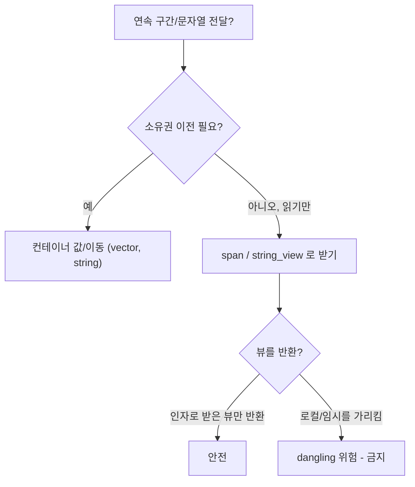

---
collection_order: 14
date: 2026-03-10
lastmod: 2026-07-10
draft: false
image: wordcloud.png
title: "[Optimization(C++) 14] std::span과 뷰 패턴"
slug: span-and-views
description: "안전한 뷰 패턴으로 std::span, std::string_view 활용과 성능 이점을 다룹니다. 불필요한 복사·할당 없이 연속 메모리를 참조하는 방식과 API 경계에서의 사용 기준을 정리하며, 수명·null 처리 주의점과 대안을 제시합니다."
tags:
  - C++
  - Performance
  - Optimization
  - 성능
  - 최적화
  - String
  - 문자열
  - Memory
  - 메모리
  - Data-Structures
  - 자료구조
  - Array
  - 배열
  - Implementation
  - 구현
  - Code-Quality
  - 코드품질
  - Best-Practices
  - Clean-Code
  - 클린코드
  - Type-Safety
  - Profiling
  - 프로파일링
  - Benchmark
  - Time-Complexity
  - 시간복잡도
  - Space-Complexity
  - 공간복잡도
  - Testing
  - 테스트
  - Debugging
  - 디버깅
  - Refactoring
  - 리팩토링
  - Readability
  - Maintainability
  - Modularity
  - Compiler
  - 컴파일러
  - Git
  - CI-CD
  - Linux
  - Windows
  - Latency
  - Throughput
  - Backend
  - 백엔드
  - API
  - Embedded
  - 임베디드
  - Advanced
  - Deep-Dive
  - 실습
  - Guide
  - 가이드
  - Reference
  - 참고
  - Case-Study
  - Technology
  - 기술
  - Tutorial
  - 튜토리얼
  - Edge-Cases
  - 엣지케이스
  - Pitfalls
  - 함정
  - Software-Architecture
  - 소프트웨어아키텍처
  - Interface
  - 인터페이스
  - Documentation
  - 문서화
  - Comparison
  - 비교
---

**뷰 패턴**이란 연속 메모리나 문자열을 **소유하지 않고 참조만** 하는 non-owning 타입으로 전달해 복사·할당을 줄이는 방식을 말합니다. 본 챕터에서는 **std::span**과 **std::string_view** 활용, API 경계에서의 전달 기준, 수명·안전성을 정리합니다.

## 이 장을 읽기 전에

**완전한 초보자?** 이 장은 앞서 [05장: 문자열 최적화](/post/cpp-optimization/string-optimization/)에서 소개한 `string_view`를 전제로 합니다. 값/참조/뷰 전달 비용의 일반 비교는 뒤의 [17장: Parameter Passing 전략](/post/cpp-optimization/parameter-passing/)에서 더 깊이 다루지만, 이 장은 뷰 전달에 필요한 만큼만 짚으므로 **순서대로 읽어도 됩니다**. "포인터 + 크기"로 배열을 가리킨다는 개념만 알면 충분합니다.

**이 장의 깊이**: 이 장은 **중급~전문가**를 포괄합니다. `span`·`string_view`로 복사 없이 전달하는 법부터 시작해, 전문가 구간에서는 API 경계에서 뷰를 받을지/소유 타입을 받을지, 그리고 댕글링 등 수명·안전성 함정을 다룹니다. **다루지 않는 것**: 컨테이너 자체의 비용([04장](/post/cpp-optimization/stl-container-cost/))과 ranges 뷰의 지연 평가([09장](/post/cpp-optimization/modern-cpp-features/))입니다.

## 당신의 수준에 맞는 경로

| 수준 | 읽을 부분 | 핵심 목표 |
|------|---------|---------|
| **초보자** | "std::span" | non-owning 뷰가 복사를 없애는 원리 이해 |
| **중급자** | "std::string_view와 수명" ~ "API 경계에서의 전달" | 뷰를 받는 API 설계 |
| **전문가** | "수명과 안전성" ~ "비판적 시각" | 댕글링 위험과 뷰 vs 소유 선택 판단 |

---

## std::span과 뷰 타입 도입 (역사·배경)

**std::span**은 C++20에서 표준에 추가되었습니다. "포인터 + 크기" 쌍을 타입 안전하게 감싼 non-owning 뷰로, 배열 붕괴를 막고 API를 단순화합니다. **std::string_view**는 C++17에서 도입되어 문자열의 non-owning 뷰를 제공합니다. 둘 다 읽기 전용 전달 시 복사를 제거하고, 수명은 호출자가 보장해야 합니다.

## std::span

**std::span**은 **연속 메모리**를 가리키는 **non-owning** 뷰입니다. 내부적으로는 포인터와 크기(또는 시작·끝 반복자)를 갖고, 복사·할당 비용이 거의 없습니다. const correctness는 `span<const T>`로 읽기 전용 뷰를 표현하면 됩니다. 배열이나 **vector**를 함수에 넘길 때 "포인터 + 크기" 두 인자로 넘기던 패턴을 **span 하나**로 대체할 수 있어, API가 단순해지고 배열 붕괴(array decay)를 막을 수 있습니다.

`std::span<const int>` 하나로 `std::vector`, C 스타일 스택 배열, `std::array`를 모두 받을 수 있습니다. 세 컨테이너 모두 연속 메모리를 보장하므로 동일한 함수에 그대로 전달됩니다.

```cpp
#include <span>
#include <vector>
#include <array>
#include <cstdio>

long sum(std::span<const int> data) {   // 포인터+크기 두 인자를 하나로
    long s = 0;
    for (int x : data) s += x;          // 크기를 알고 있으니 range-for 가능
    return s;
}

int main() {
    std::vector<int> v{1, 2, 3};
    int raw[]{4, 5, 6};
    std::array<int, 3> arr{7, 8, 9};

    std::printf("%ld %ld %ld\n",
        sum(v),     // std::vector 에서 구성
        sum(raw),   // C 스타일 스택 배열에서 구성
        sum(arr));  // std::array 에서 구성
}
```

레거시 C API가 `(ptr, size)`를 요구하면 `span.data()`, `span.size()`로 넘기면 됩니다.

## std::string_view와 수명

**문자열 의미**(길이·부분 문자열 연산)가 필요하면 **std::string_view**가 적합하고, 단순 바이트 범위면 `span<const std::byte>`를 쓸 수 있습니다. string_view는 복사 없이 부분 문자열·접두/접미 제거를 O(1)로 처리하지만, **참조만** 하므로 가리키는 버퍼의 수명을 호출자가 보장해야 합니다.

아래 BAD 예시는 함수 내부 로컬 `std::string`의 뷰를 반환합니다. 함수가 끝나면 `local`이 파괴되어 반환된 뷰는 해제된 메모리를 가리키는 dangling이 됩니다. GOOD 예시는 입력으로 받은 뷰가 가리키던 버퍼를 그대로 참조하므로, 호출자의 버퍼 수명 안에서 안전합니다.

```cpp
#include <string>
#include <string_view>

// BAD: 로컬 std::string 의 뷰를 반환 → 함수 종료 시 dangling
std::string_view bad() {
    std::string local = "temporary";
    return local;   // local 파괴 후 뷰는 해제된 메모리를 가리킴 (UB)
}

// GOOD: 입력 뷰가 가리키던 버퍼를 그대로 참조 → 복사 없음, 수명은 호출자 책임
std::string_view trim_prefix(std::string_view sv, std::string_view prefix) {
    if (sv.substr(0, prefix.size()) == prefix)
        sv.remove_prefix(prefix.size());
    return sv;
}
```

## API 경계에서의 전달

- **읽기만** 할 때: 호출자 버퍼를 **span** 또는 **string_view**로 받으면 복사·소유 없이 전달할 수 있습니다. 인자가 이미 `vector`나 배열이면 `span<const T>`가 자연스럽습니다.
- **소유권 전달**이 필요할 때만 **컨테이너**(vector 등)나 **스마트 포인터**를 사용합니다.
- **레거시 API**가 `(T* ptr, size_t size)` 형태라면 `span`의 `data()`, `size()`로 연동합니다.

## 수명과 안전성

뷰를 쓸 때 가장 중요한 것은 **뷰가 참조하는 메모리의 수명**을 호출자·설계자가 보장하는 것입니다. 반환값으로 뷰를 줄 경우, **임시**나 **함수 내 로컬 버퍼**를 가리키지 않도록 해야 합니다. 컴파일러나 정적 분석 도구가 일부 dangling을 경고할 수 있지만, 완전히 자동으로 잡기 어렵기 때문에 코딩 규칙(예: "뷰를 반환하지 않거나, 반환 시에는 인자로 받은 뷰만 반환")으로 보완하는 것이 좋습니다. 검증 빌드에서는 도구별 역할을 구분해야 합니다. <strong>AddressSanitizer(`-fsanitize=address`)</strong>는 댕글링 뷰가 가리키는 <strong>해제된 메모리 접근(use-after-free)</strong>을 잡는 데 유용하지만, span의 **인덱스 경계 자체를 검사하지는 않습니다**. 경계 검사는 **UBSan의 `-fsanitize=bounds`**(고정 크기 배열)나 표준 라이브러리 하드닝 모드(libstdc++ `-D_GLIBCXX_ASSERTIONS`/`-D_GLIBCXX_DEBUG`, libc++ `-D_LIBCPP_HARDENING_MODE`)로 켜야 `span::operator[]`·`at` 범위 위반을 디버그/테스트 빌드에서 잡을 수 있습니다.



## 비판적 시각: 한계와 트레이드오프

- 뷰는 **수명**을 호출자가 책임집니다. 잘못 쓰면 dangling으로 미정의 동작이 되므로, API 계약과 코딩 규칙으로 보완해야 합니다.
- **span**은 연속 메모리만 다루므로, 비연속 구조(리스트·트리)에는 사용할 수 없습니다.

## 핵심 요약

| 항목 | 비용·이점 | 활용 기준 |
|------|-----------|-----------|
| span | non-owning, 타입 안전, array decay 방지 | 연속 구간 읽기 전달 |
| string_view | 복사 없음, O(1) 부분 문자열 | 문자열 뷰, null 종료 확인 |
| 수명 | 뷰는 원본보다 짧게 | 인자로만 받기 권장 |

### 자주 묻는 질문 (FAQ)

**Q: span vs 포인터+크기?**  
A: span은 연속 메모리의 non-owning 뷰로, 포인터+크기를 타입 안전하게 묶고 array decay를 방지합니다. 코드 생성은 포인터+크기를 직접 넘기는 것과 **동등한 경우가 많고**, 크기를 타입으로 들고 다녀 `range-for`·`subspan`·경계 검사를 안전하게 쓸 수 있다는 점이 추가 이점입니다. 컨테이너를 값으로 받던 핫 루프를 `span<const T>`로 바꾸면 복사·할당이 사라지는 만큼 유리해집니다.

**Q: string_view 수명 주의점은?**  
A: string_view가 참조하는 문자열이 뷰보다 먼저 파괴되면 안 됩니다. API 경계에서 수명을 보장하거나, null 종료가 필요하면 string으로 복사합니다.

**Q: 뷰를 반환해도 되나요?**  
A: 인자로 받은 뷰(호출자가 소유한 버퍼)를 그대로 반환하는 것은 안전합니다. 함수 내 로컬·임시를 가리키는 뷰를 반환하면 dangling이 됩니다.

### 적용 체크리스트

- [ ] 연속 구간 전달에 span/string_view를 사용했는가?
- [ ] API 경계에서 뷰 수명이 원본보다 짧지 않게 설계했는가?
- [ ] string_view 사용 시 null 종료 필요 여부를 확인했는가?
- [ ] 포인터+크기 대신 span으로 타입 안전성을 높였는가?

### 더 읽을 거리

- [cppreference: std::span](https://en.cppreference.com/w/cpp/container/span) — C++20에 추가된 non-owning 뷰의 표준 레퍼런스로, 생성자·`subspan`·`extent` 등 정확한 인터페이스를 확인할 수 있습니다.
- [cppreference: std::basic_string_view](https://en.cppreference.com/w/cpp/string/basic_string_view) — `string_view`의 멤버 함수와 null 종료 여부, `remove_prefix`/`remove_suffix` 동작을 확인할 수 있습니다.

## 다음 장에서는

**이전 장**: [std::variant/optional/expected](/post/cpp-optimization/variant-optional-expected/) (챕터 13)

**람다 표현식 성능**을 다룹니다. 캡처 비용(by-value vs by-reference), 클로저 크기·인라이닝, std::function과의 비교를 정리합니다. → [람다 표현식 성능](/post/cpp-optimization/lambda-performance/) (챕터 15)
