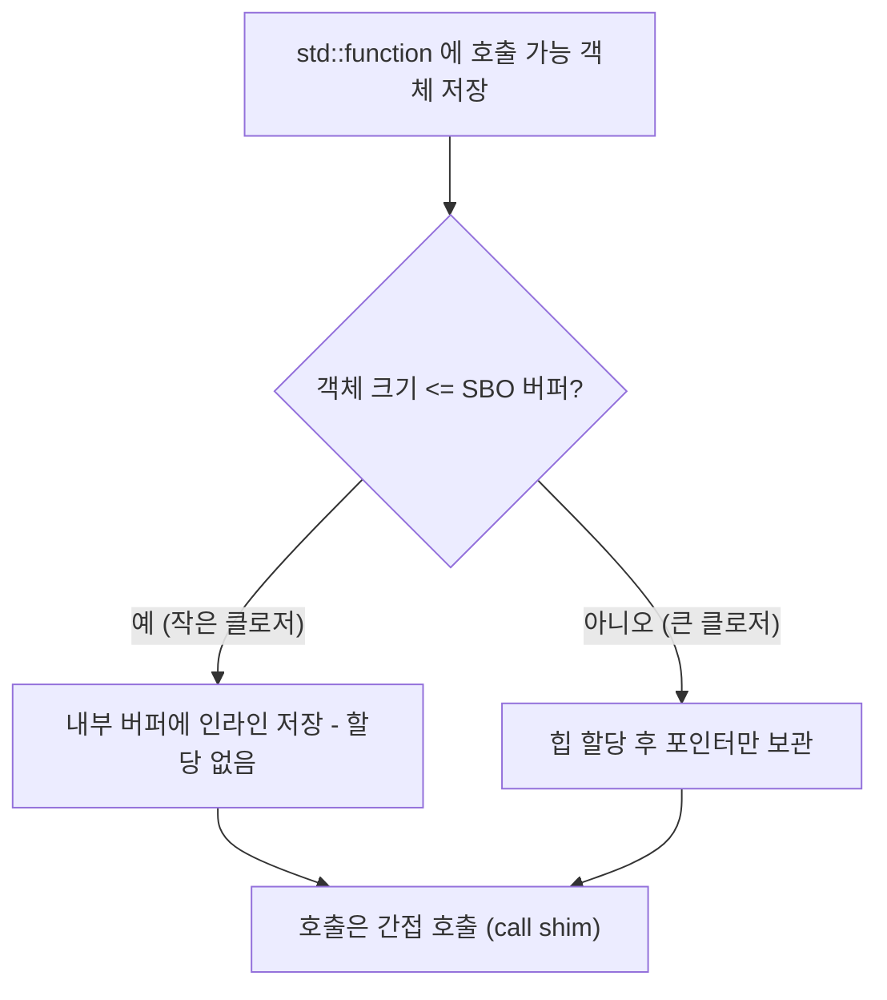

---
collection_order: 16
date: 2026-03-10
lastmod: 2026-07-10
draft: false
image: wordcloud.png
title: "[Optimization(C++) 16] Small Buffer Optimization"
slug: small-buffer-optimization
description: "SBO(Small Buffer Optimization) 패턴 상세와 std::function, std::any 등 타입 소거 타입의 내부 구조를 다룹니다. 작은 객체일 때 힙 할당을 피하는 메커니즘과 성능·ABI 영향을 정리하며, 버퍼 크기 선택과 이식성 주의점을 제시합니다."
tags:
  - C++
  - Performance
  - Optimization
  - 성능
  - 최적화
  - Memory
  - 메모리
  - Data-Structures
  - 자료구조
  - Implementation
  - 구현
  - Code-Quality
  - 코드품질
  - Best-Practices
  - Clean-Code
  - 클린코드
  - Type-Safety
  - Profiling
  - 프로파일링
  - Benchmark
  - Time-Complexity
  - 시간복잡도
  - Space-Complexity
  - 공간복잡도
  - OOP
  - 객체지향
  - Abstraction
  - 추상화
  - Polymorphism
  - 다형성
  - Testing
  - 테스트
  - Debugging
  - 디버깅
  - Refactoring
  - 리팩토링
  - Readability
  - Maintainability
  - Modularity
  - Compiler
  - 컴파일러
  - Git
  - CI-CD
  - Linux
  - Windows
  - Latency
  - Throughput
  - Backend
  - 백엔드
  - Embedded
  - 임베디드
  - Advanced
  - Deep-Dive
  - 실습
  - Guide
  - 가이드
  - Reference
  - 참고
  - Case-Study
  - Technology
  - 기술
  - Tutorial
  - 튜토리얼
  - Edge-Cases
  - 엣지케이스
  - Pitfalls
  - 함정
  - Software-Architecture
  - 소프트웨어아키텍처
  - Design-Pattern
  - 디자인패턴
  - Interface
  - 인터페이스
  - Documentation
  - 문서화
  - Comparison
  - 비교
---

<strong>SBO(Small Buffer Optimization)</strong>는 "작은 객체는 내부 버퍼에 직접 저장하고, 큰 객체만 힙에 올린다"는 패턴입니다. 본 챕터에서는 SBO 개념과 **std::function**·**std::any** 등 타입 소거 타입의 내부 구조, 성능·ABI 영향을 정리합니다.

## 이 장을 읽기 전에

**완전한 초보자?** 이 장은 [05장: 문자열 최적화](/post/cpp-optimization/string-optimization/)의 SSO와 [15장: 람다 표현식 성능](/post/cpp-optimization/lambda-performance/)의 클로저 크기 개념을 전제로 합니다. "작은 객체는 내부에 두고 큰 객체만 힙에 둔다"는 한 줄만 떠올릴 수 있으면 충분합니다.

**이 장의 깊이**: 이 장은 **심화–전문가**를 포괄합니다. SBO 패턴 개념부터 시작해, 전문가 구간에서는 `std::function`·`std::any`의 내부 버퍼 구조와 ABI·성능 영향, 버퍼 크기 선택·이식성 주의점을 다룹니다. **다루지 않는 것**: 타입 소거 패턴의 호출 비용 일반론([19장](/post/cpp-optimization/type-erasure-cost-patterns/))과 커스텀 할당자(Tr.04 메모리 트랙)입니다.

## 당신의 수준에 맞는 경로

| 수준 | 읽을 부분 | 핵심 목표 |
|------|---------|---------|
| **초보자** | "SBO 패턴 개념" | 내부 버퍼로 힙을 피하는 원리 이해 |
| **중급자** | "std::function 내부" ~ "std::any 내부" | 표준 타입의 SBO 동작 파악 |
| **전문가** | "타입 소거와 ABI·성능" ~ "비판적 시각" | 버퍼 한도·ABI·이식성 판단 |

---

## SBO 패턴과 표준 타입 (역사·배경)

**std::string**의 SSO(챕터 05)와 마찬가지로, **std::function**·**std::any** 등 타입 소거를 쓰는 표준 타입은 구현체마다 **내부 버퍼 크기**를 두어, 그 안에 들어가는 객체는 힙 할당 없이 인라인 저장합니다. 이 한계를 넘으면 힙에 할당해 포인터만 보관합니다. 표준은 "어떤 크기까지 SBO인지"를 규정하지 않으므로, 구현체·ABI 문서를 참고해 "작은 클로저는 할당 없음"을 기대할 수 있고, 큰 클로저는 할당이 발생할 수 있음을 인지해야 합니다.

## SBO 패턴 개념

<strong>Small Buffer Optimization(SBO)</strong>은 "작은 객체는 **내부 버퍼**에 직접 저장하고, 그보다 큰 객체만 **힙**에 올린다"는 패턴입니다. 타입 소거 타입(여러 구체 타입을 하나의 타입으로 담아야 하는 경우)에서, **크기·정렬 제한** 안에 들어오는 객체는 할당 없이 인라인 저장하고, 그렇지 않으면 힙에 두고 포인터만 보관합니다. 이렇게 하면 **할당 비용**을 줄이고, 작은 객체일 때 **캐시 친화성**을 유지할 수 있습니다.



## std::function 내부

**std::function**은 호출 가능 객체(함수 포인터, 람다, 함수 객체 등)를 **타입 소거**해 저장합니다. 내부적으로는 **작은 객체**는 객체 자체를 <strong>내부 버퍼(SBO)</strong>에 넣고, **큰 객체**는 힙에 할당해 포인터만 보관합니다.

아래 예시에서 캡처 없는 람다는 대부분 SBO에 들어가 할당이 없습니다. 반면 256바이트짜리 `std::array`를 값으로 캡처한 클로저는 SBO 한계를 넘어 힙 할당이 발생할 수 있습니다(`BigObject` 같은 미정의 타입 대신 크기가 명확한 타입을 사용했습니다).

```cpp
#include <functional>
#include <array>
#include <cstdio>

int main() {
    std::function<int()> small = [] { return 1; };  // 캡처 없음 → SBO, 할당 없음

    std::array<char, 256> payload{};                 // 256바이트 상태
    std::function<int()> big =                        // SBO 한계 초과 → 힙 할당 가능
        [payload] { return payload[0]; };

    std::printf("%d %d\n", small(), big());
}
```

SBO 크기 임계값은 구현체마다 다르며, **구현 정의**입니다. 표준 문서 어디에도 구체적인 바이트 수가 없으므로, "대략 16–32바이트"처럼 남이 측정한 수치를 그대로 믿기보다는 아래처럼 **전역 `operator new`를 오버라이드해 할당 횟수를 세는 방식**으로 대상 컴파일러·표준 라이브러리에서 직접 확인하는 것이 정확합니다.

```cpp
#include <functional>
#include <cstdio>
#include <cstdlib>

static int g_allocs = 0;
void* operator new(std::size_t sz) { ++g_allocs; return std::malloc(sz); }
void operator delete(void* p) noexcept { std::free(p); }

template <std::size_t N>
bool sbo_holds() {
    struct Padded { char buf[N]{}; int operator()() const { return buf[0]; } };
    g_allocs = 0;
    std::function<int()> f = Padded{};
    return g_allocs == 0;   // 힙 할당이 0이면 이 크기는 SBO 버퍼 안에 들어간 것
}

int main() {
    std::printf("16B fits SBO: %d\n", sbo_holds<16>());
    std::printf("32B fits SBO: %d\n", sbo_holds<32>());
    std::printf("64B fits SBO: %d\n", sbo_holds<64>());
}
```

이 방식으로 확인한 **예시** 결과는 libstdc++·libc++·MSVC STL이 서로 다른 값을 보고하는 경우가 흔합니다(대체로 16–32바이트 범위). "우리 프로젝트가 실제로 쓰는 컴파일러·표준 라이브러리 조합"에서 이 코드를 한 번 돌려 보는 것이 문서의 대략적인 수치보다 신뢰할 수 있습니다. **호출**은 저장된 객체의 `operator()`를 **간접 호출**로 수행합니다. **이동·복사** 시에는 내부 버퍼 또는 포인터만 다루므로, 저장된 객체가 크면 이동이 저렴하고 복사는 호출 가능 객체의 복사 비용이 따릅니다.

## std::any 내부

**std::any**는 **임의의 타입**의 값을 하나 담습니다. 내부적으로는 **type_id**(타입 식별)와 **저장소**를 갖고, 저장소는 **SBO**이거나 **힙**입니다. **any_cast**로 값을 꺼낼 때는 **타입이 일치하는지** 확인하고, 일치하면 저장된 객체에 접근하며, 일치하지 않으면 예외를 던지거나(포인터 오버로드) null을 반환합니다. 타입 확인과 저장소 접근 비용이 있으므로, "타입을 모르는 값"을 넘길 때만 사용하고, 타입이 컴파일 타임에 알려지면 **variant**나 **템플릿**이 더 효율적입니다.

## 타입 소거와 ABI·성능

**ABI 안정성**: std::function, std::any의 **내부 버퍼 크기**는 구현이 정한 값이므로, 버퍼 크기를 바꾸면 **바이너리 호환**이 깨질 수 있습니다. 그래서 구현체는 한 번 정한 SBO 크기를 쉽게 바꾸지 않습니다. **성능** 측면에서는 **SBO가 성공**하면 할당이 없고 호출만 간접 호출 비용이 있고, **SBO가 실패**하면 힙 할당 + 간접 호출이 추가됩니다. 설계 시 "우리 타입 소거에 넣을 객체는 대부분 이 크기 이하"를 의식하고, 한계를 넘는 객체가 많으면 variant·템플릿 대안을 고려합니다.

## SBO를 vector에 적용한 서드파티 라이브러리

지금까지 다룬 SBO는 "호출 가능 객체·임의 타입 하나"를 담는 `std::function`·`std::any` 중심이었지만, 같은 아이디어를 **가변 길이 시퀀스**에 적용한 라이브러리도 널리 쓰입니다. `llvm::SmallVector<T, N>`, `boost::container::small_vector<T, N>`, `folly::small_vector<T, N>`은 모두 요소 수가 N 이하인 동안은 객체 내부 버퍼에 저장하고, N을 넘으면 일반 `vector`처럼 힙으로 전환(spill)하는 **하이브리드 컨테이너**입니다. 컴파일러(LLVM 자체가 대표 사용처), 게임 엔진, 서버 인프라 코드에서 "대부분 짧지만 가끔 길어지는" 리스트(함수 인자 목록, 짧은 경로 조각 등)에 흔히 쓰입니다.

이 라이브러리들은 **작으면 할당 없음, 크면 자동으로 힙 전환**이라는 점에서 04장에서 다룬 `std::inplace_vector`(C++26)와 목적이 겹치지만 결정적으로 다릅니다. `std::inplace_vector`는 **용량 상한을 절대 넘을 수 없는(넘으면 예외/UB) 고정 용량** 컨테이너인 반면, `SmallVector` 계열은 **N을 넘으면 자동으로 힙에 재할당**해 크기 제한이 없습니다. 즉 "상한이 확실히 존재"하면 `inplace_vector`, "대부분 작지만 가끔 커질 수 있다"면 `SmallVector` 계열이 더 맞는 선택입니다.

## 흔한 오해

<strong>"std::function은 할당이 없다"</strong>는 흔한 오해입니다. 캡처가 SBO 버퍼(구현체별 대략 16–32바이트)를 넘으면 힙 할당이 발생하며, "람다니까 가볍다"고 가정하고 큰 상태(예: 배열, 여러 개의 `shared_ptr`)를 캡처하면 핫패스에서 예상치 못한 할당이 생깁니다.

<strong>"SBO 임계값은 표준이 정한 값이다"</strong>도 오해입니다. 표준은 SBO의 존재나 크기를 규정하지 않으며 순전히 구현체 선택입니다. libstdc++·libc++·MSVC가 서로 다른 값을 쓰므로, 크로스 플랫폼 코드에서 "이 크기까지는 안전하다"고 하드코딩하면 다른 컴파일러에서는 같은 코드가 힙 할당 경로로 넘어갈 수 있습니다.

## 비판적 시각: 한계와 트레이드오프

- **SBO 크기**는 구현체마다 다르고 ABI로 고정되므로, "이 크기면 SBO"라고 단정하면 이식성에 영향을 줄 수 있습니다. "작을수록 유리" 정도로만 의식하는 것이 안전합니다.
- **std::any**는 타입이 런타임에만 알려질 때 유용합니다. 타입이 컴파일 타임에 알려지면 variant나 템플릿이 더 효율적입니다.

## 핵심 요약

| 항목 | 비용·이점 | 활용 기준 |
|------|-----------|-----------|
| SBO | 작은 객체 내부 버퍼·힙 회피 | 객체가 한도(~16–32B) 이하 |
| std::function | 타입 소거, SBO 또는 힙, 간접 호출 | 콜백 저장 |
| std::any | type_id+저장소, any_cast 비용 | 런타임에만 타입을 아는 값 |

### 자주 묻는 질문 (FAQ)

**Q: SBO란?**  
A: Small Buffer Optimization. std::function·std::any 등이 작은 객체를 내부 버퍼에 저장해 힙 할당을 피하는 패턴입니다. 버퍼 크기는 구현 정의이며 대략 16–32바이트가 흔합니다.

**Q: std::function이 언제 힙 할당하나요?**  
A: 저장하는 호출 가능 객체(클로저 등)가 내부 버퍼 크기를 넘으면 힙에 할당합니다. 람다 캡처가 많거나 크면 SBO를 벗어날 수 있습니다(챕터 15).

**Q: 타입 소거와 SBO의 관계는?**  
A: 타입 소거로 하나의 타입(function, any)에 저장하려면 객체를 어딘가에 두어야 합니다. 작으면 내부 버퍼(SBO), 크면 힙입니다.

### 적용 체크리스트

- [ ] std::function·std::any 사용 시 SBO 한도(구현체별, ~16–32B)를 인지했는가?
- [ ] 큰 클로저를 function에 저장할 때 할당이 발생할 수 있음을 인지했는가?
- [ ] 필요 시 클로저 크기를 줄이거나 할당 비용을 수용했는가?
- [ ] ABI·구현체 차이로 이식 시 주의했는가?

### 더 읽을 거리

- [cppreference: std::function](https://en.cppreference.com/w/cpp/utility/functional/function) — 호출 가능 객체를 타입 소거해 담는 표준 래퍼의 인터페이스와, SBO 크기가 구현 정의임을 언급하는 노트를 확인할 수 있습니다.
- [cppreference: std::any](https://en.cppreference.com/w/cpp/utility/any) — 임의 타입을 담는 컨테이너의 `any_cast`·저장소 관련 명세를 확인할 수 있습니다.
- [LLVM Programmer's Manual: SmallVector](https://llvm.org/docs/ProgrammersManual.html#llvm-adt-smallvector-h) — 가변 길이 시퀀스에 SBO를 적용한 대표 구현체의 설계 문서.
- [챕터 04: STL 컨테이너 비용](/post/cpp-optimization/stl-container-cost/) — `std::inplace_vector`(C++26)와 SmallVector 계열의 차이를 다룹니다.

## 다음 장에서는

**이전 장**: [람다 표현식 성능](/post/cpp-optimization/lambda-performance/) (챕터 15)

**Parameter Passing 전략**을 다룹니다. by value, const reference, rvalue reference의 정량적 분석과 객체 크기·복사/이동 비용에 따른 전달 전략을 정리합니다. → [Parameter Passing 전략](/post/cpp-optimization/parameter-passing/) (챕터 17)
