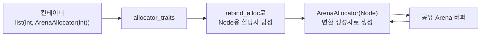

**커스텀 할당자(Custom Allocator)**란 표준이 정의한 Allocator 요구사항을 충족하는 사용자 정의 타입으로, `std::vector`·`std::list`·`std::map` 같은 컨테이너가 메모리를 얻고 반환하는 지점을 가로채 그 정책을 바꾸는 장치입니다. [이전 장](/post/memory-optimization/pool-arena-allocation-strategy/)이 "왜 풀·아레나로 할당 횟수를 줄여야 하는가"라는 정책 차원을 다뤘다면, 이 장은 그 정책을 C++ 타입 시스템 안에서 실제로 구현해 컨테이너에 연결하는 방법을 다룹니다. `malloc`/`new`를 감싸는 함수 몇 개로 끝나지 않는 이유는, 표준 컨테이너가 `Allocator`라는 이름의 계약(멤버 타입·표현식·동등성 규칙)을 통해서만 메모리를 요청하기 때문입니다. 이 계약을 정확히 지키지 않으면 컴파일이 되고 테스트도 통과하다가, 컨테이너를 복사·이동·swap하는 특정 경로에서만 조용히 미정의 동작으로 이어지는 버그가 생깁니다.

## 이 장을 읽기 전에

이 장은 [02장: 할당 전략 — 풀·아레나](/post/memory-optimization/pool-arena-allocation-strategy/)에서 다룬 "할당 횟수를 줄이는 정책"을 전제로, 그 정책을 표준 라이브러리가 요구하는 `Allocator` 형태로 감싸는 방법을 다룹니다. [01장: 컨테이너 비용 모델](/post/memory-optimization/container-cost-model-selection/)에서 다룬 컨테이너별 할당 패턴(연속 버퍼 vs 노드 기반)도 전제로 삼습니다. C++ 템플릿 문법(클래스 템플릿, 멤버 템플릿, `noexcept`)에 익숙하다고 가정합니다.

**이 장의 깊이**: **심화** 챕터로, `Allocator` 요구사항의 핵심 표현식(`value_type`, `allocate`, `deallocate`, `rebind`, 동등성)을 실제로 구현하고, 선형(아레나)·풀·스택 세 가지 패턴을 STL 컨테이너에 연결하는 데 집중합니다. **다루지 않는 것**: 타입 소거 기반의 범용 인터페이스인 `std::pmr::polymorphic_allocator`([04장](/post/memory-optimization/pmr-polymorphic-allocator-practical/)에서 다룹니다), 정렬·패딩의 세부 규칙([07장](/post/memory-optimization/struct-padding-alignment-optimization/)), NUMA 지역성을 고려한 할당 배치([09장](/post/memory-optimization/numa-memory-allocation-locality/)), 그리고 프로세스 전역 `malloc`/`new` 자체를 jemalloc·tcmalloc으로 교체하는 문제([16장](/post/memory-optimization/global-allocator-jemalloc-tcmalloc-tuning-expert/))입니다.

## 당신의 수준에 맞는 경로

| 수준 | 읽을 부분 | 핵심 목표 |
|------|---------|---------|
| **초보자** | "Allocator 요구사항의 역사" ~ "핵심 멤버와 표현식" | 컨테이너가 할당자를 왜, 어떤 표현식으로 호출하는지 이해 |
| **중급자** | "선형(아레나) 할당자 구현" ~ "STL 컨테이너 연동과 rebind" | 실제로 컴파일되는 커스텀 할당자를 작성하고 컨테이너에 연결 |
| **전문가** | "깨진 코드" ~ "비판적 시각" | equality·propagate 정책 버그를 진단하고 언제 이 패턴을 피할지 판단 |

---

## Allocator 요구사항의 역사 (역사·배경)

C++98의 `std::allocator` 모델은 사실상 무상태(stateless)를 가정했습니다. 표준은 커스텀 할당자를 금지하지 않았지만, 서로 다른 값을 갖는 상태 있는 할당자를 컨테이너에 넣었을 때의 동작은 구현 정의였고, 많은 초기 구현체는 할당자 매개변수를 사실상 무시했습니다. 이 상황은 C++11에서 바뀝니다. cppreference의 Allocator named requirement 문서는 이렇게 정리합니다.

> "a stateful allocator type can have unequal values which denote distinct memory resources" — [cppreference: C++ named requirements: Allocator](https://en.cppreference.com/w/cpp/named_req/Allocator) 문서. 같은 문서는 C++11부터 할당자가 상태를 가져도 정식으로 허용된다고 설명합니다.

C++11은 `propagate_on_container_copy_assignment`·`propagate_on_container_move_assignment`·`propagate_on_container_swap`·`is_always_equal` 같은 트레잇을 도입해, 상태 있는 할당자가 컨테이너의 복사·이동·swap에서 정확히 어떻게 다뤄져야 하는지를 표준화했습니다. C++17에서는 `std::allocator<T>` 자체의 `construct`/`destroy` 멤버가 deprecated되었고 C++20에서 제거되었습니다 — 대신 `std::allocator_traits`가 `std::construct_at` 기반의 기본 구현을 제공합니다. C++23은 실제 확보한 개수를 함께 돌려주는 `allocate_at_least`를 추가했고, C++26에는 최소 사용 조건만 모아 놓은 exposition-only `simple-allocator` 개념이 추가되었습니다. 이 흐름 전체를 관통하는 원칙은 하나입니다 — **커스텀 할당자가 직접 구현해야 하는 표현식은 최소화하고, 나머지는 `std::allocator_traits`의 기본값에 위임한다**는 것입니다.

## 핵심 멤버와 표현식

`Allocator` 요구사항에서 실제로 필수인 멤버 타입은 `value_type` 하나뿐입니다. `pointer`, `const_pointer`, `void_pointer`, `size_type`, `difference_type` 같은 나머지는 모두 선택 사항이며, 지정하지 않으면 `std::allocator_traits`가 각각 `T*`, `std::size_t` 등의 합리적인 기본값을 채워 넣습니다. 컨테이너는 할당자를 직접 호출하지 않고 항상 `std::allocator_traits<A>`를 경유하므로, 커스텀 할당자가 `construct`/`destroy`/`max_size` 같은 표현식을 생략해도 표준 컨테이너와 아무 문제 없이 동작합니다.

실제로 구현해야 하는 핵심 표현식은 세 가지로 좁혀집니다. `a.allocate(n)`은 `T[n]`을 위한 저장 공간만 확보하고 원소를 생성하지 않습니다(예외를 던질 수 있고, `n == 0`이면 반환값은 unspecified). `a.deallocate(p, n)`은 이전에 같은 할당자로부터 `allocate(n)`으로 받은 `p`를 반환하며, `noexcept`여야 합니다. 그리고 `a1 == a2`는 "`a1`이 할당한 메모리를 `a2`로 해제할 수 있을 때만" `true`를 반환해야 하고, 반사·대칭·추이 관계를 만족해야 합니다. 이 동등성 규칙은 뒤에서 다룰 사고의 근원이므로 지금 정확히 기억해 둘 가치가 있습니다.

`rebind`는 조금 다른 이유로 필요합니다. `std::vector<T, A>`는 `T`를 그대로 할당하지만, `std::list<T, A>`나 `std::map<K, V, C, A>`는 내부적으로 `T` 자체가 아니라 이전/다음 포인터를 포함한 노드 타입 `Node<T>`를 할당합니다. 컨테이너 입장에서는 사용자가 넘긴 `A`(원소 타입 `T`용 할당자)로부터 "같은 정책을, 원소 타입만 `Node<T>`로 바꾼" 할당자를 얻어야 하는데, 이를 담당하는 것이 `A::rebind<U>::other`입니다. cppreference는 각주에서 이렇게 명시합니다 — `rebind`는 할당자가 `SomeAllocator<T, Args...>` 형태의 템플릿일 때만 선택 사항이며, 이 경우 `std::allocator_traits`가 자동으로 합성해 줍니다. 즉 클래스 템플릿 하나로 할당자를 만들고 "다른 타입 `U`로부터의 변환 생성자"만 추가하면, `rebind`를 직접 작성하지 않아도 됩니다.

## 선형(아레나) 할당자 구현

**선형(Linear/Arena) 할당자**는 미리 확보한 버퍼 위에서 오프셋을 앞으로만 증가시키는 방식으로 동작합니다. `deallocate`는 개별 반환을 지원하지 않고 보통 아무 일도 하지 않으며, 버퍼 전체를 한 번에 재사용하거나 폐기하는 시점(요청 하나의 처리 종료, 프레임 하나의 종료)에 일괄 회수합니다. 아래는 그대로 컴파일되는 최소 구현입니다(`-std=c++17`).

```cpp
#include <cstddef>
#include <new>

// 여러 ArenaAllocator<T> 인스턴스가 공유하는 상태: 고정 버퍼 위의 오프셋만 전진한다.
struct Arena {
  explicit Arena(std::size_t bytes)
      : buffer(::operator new(bytes)), capacity(bytes), offset(0) {}
  ~Arena() { ::operator delete(buffer); }
  Arena(const Arena&) = delete;

  void* buffer;
  std::size_t capacity;
  std::size_t offset;
};

template <typename T>
class ArenaAllocator {
 public:
  using value_type = T;

  explicit ArenaAllocator(Arena& arena) noexcept : arena_(&arena) {}
  template <typename U>
  ArenaAllocator(const ArenaAllocator<U>& other) noexcept : arena_(other.arena_) {}

  T* allocate(std::size_t n) {
    std::size_t bytes = n * sizeof(T);
    std::size_t aligned = (arena_->offset + alignof(T) - 1) & ~(alignof(T) - 1);
    if (aligned + bytes > arena_->capacity) throw std::bad_alloc();
    arena_->offset = aligned + bytes;
    return reinterpret_cast<T*>(static_cast<char*>(arena_->buffer) + aligned);
  }
  void deallocate(T*, std::size_t) noexcept {
    // 아레나는 일괄 해제만 지원한다: 개별 블록 반환은 의도적으로 아무 일도 하지 않는다.
  }

  template <typename U> struct rebind { using other = ArenaAllocator<U>; };

  friend bool operator==(const ArenaAllocator& a, const ArenaAllocator& b) noexcept {
    return a.arena_ == b.arena_;
  }
  friend bool operator!=(const ArenaAllocator& a, const ArenaAllocator& b) noexcept {
    return !(a == b);
  }

 private:
  template <typename U> friend class ArenaAllocator;
  Arena* arena_;
};
```

`allocate`는 `alignof(T)` 경계에 맞춰 오프셋을 올림한 뒤 버퍼를 넘지 않는지 확인하고 포인터를 반환합니다. 동등성 연산자는 "같은 `Arena`를 가리키는가"로 정의했는데, 이것이 규칙에 맞는 유일한 정의입니다 — 서로 다른 아레나를 가리키는 두 할당자는 서로의 메모리를 해제할 수 없으므로 반드시 다른 값으로 비교되어야 합니다.

```cpp
#include <vector>

int main() {
  Arena arena(1 << 20);  // 1MiB: 요청 하나가 끝나면 통째로 버릴 임시 버퍼
  std::vector<int, ArenaAllocator<int>> v{ArenaAllocator<int>(arena)};
  for (int i = 0; i < 1000; ++i) v.push_back(i);
  // arena가 파괴되는 시점에 버퍼 전체가 한 번에 회수된다.
}
```

`reserve` 없이 `push_back`을 반복하면 `vector`는 여전히 내부적으로 재할당·이동을 반복합니다. 아레나는 "힙에 개별 요청을 보내는 비용"만 없앨 뿐, 반복 재할당 자체의 복사·이동 비용은 없애지 않으므로 [04장](/post/memory-optimization/pmr-polymorphic-allocator-practical/)의 `reserve` 패턴과 함께 씁니다.

## 풀 할당자와 스택 할당자

**풀(Pool) 할당자**는 고정 크기 블록만 다루며, 반환된 블록의 앞부분 몇 바이트를 "다음 빈 블록을 가리키는 포인터"로 재사용하는 **내장 free-list**로 O(1) 할당·해제를 구현합니다. 아레나와 달리 개별 블록을 실제로 반환받아 재사용할 수 있어서, `std::list`·`std::map`처럼 노드를 반복해서 만들고 지우는 컨테이너에 유리합니다.

```cpp
#include <cstddef>
#include <new>

// 고정 크기 블록 전용 풀: 빈 블록의 첫 sizeof(void*) 바이트를 free-list 링크로 사용한다.
class FixedBlockPool {
 public:
  FixedBlockPool(std::size_t block_size, std::size_t block_count)
      : block_size_(block_size < sizeof(void*) ? sizeof(void*) : block_size) {
    storage_ = ::operator new(block_size_ * block_count);
    char* p = static_cast<char*>(storage_);
    free_list_ = nullptr;
    for (std::size_t i = 0; i < block_count; ++i, p += block_size_) {
      *reinterpret_cast<void**>(p) = free_list_;
      free_list_ = p;
    }
  }
  ~FixedBlockPool() { ::operator delete(storage_); }

  void* allocate() {
    if (!free_list_) throw std::bad_alloc();
    void* block = free_list_;
    free_list_ = *reinterpret_cast<void**>(free_list_);
    return block;
  }
  void deallocate(void* p) noexcept {
    *reinterpret_cast<void**>(p) = free_list_;
    free_list_ = p;
  }

 private:
  std::size_t block_size_;
  void* storage_;
  void* free_list_;
};
```

이 `FixedBlockPool`을 STL `Allocator`로 노출하는 `PoolAllocator<T>`는 위 `ArenaAllocator<T>`와 보일러플레이트(`value_type`, 변환 생성자, `rebind`, 동등성)가 사실상 동일하고, `allocate`/`deallocate` 본문만 `FixedBlockPool::allocate()`/`deallocate(p)` 호출로 바뀝니다. 반복되는 보일러플레이트를 매번 새로 쓰는 대신, Howard Hinnant가 정리한 [C++11 Allocator Boilerplate](https://howardhinnant.github.io/allocator_boilerplate.html) 템플릿에서 필요한 부분만 채우는 방식을 권장합니다. **스택(Stack) 할당자**는 여기서 한 단계 더 규율을 강제한 변형으로, "가장 마지막에 할당한 블록만 해제할 수 있다"는 LIFO 순서를 요구합니다.

```text
StackAllocator:
  allocate(n):  아레나처럼 offset을 전진시키고, 반환한 포인터를 "마지막 할당" 기록으로 저장
  deallocate(p, n):
    assert(p == 마지막 할당 포인터)   // 순서를 어기면 프로그램을 즉시 중단시켜 알린다
    offset -= n * sizeof(T)          // 되감기(rewind)
  checkpoint() / rewind(mark): 중첩된 스코프 단위로 여러 블록을 한 번에 되감을 때 사용
```

스택 할당자는 재귀 하강 파서의 임시 버퍼처럼 "할당·해제가 정확히 중첩된 순서로 일어난다"는 것이 코드 구조상 보장될 때만 안전합니다. 순서가 어긋나면 `assert`가 즉시 잡아주므로, 아레나보다 오용을 더 빨리 발견할 수 있다는 것이 실질적인 장점입니다.

## STL 컨테이너 연동과 rebind

`std::vector<int, ArenaAllocator<int>>`는 `int`를 그대로 할당하므로 `rebind`가 사실상 드러나지 않지만, `std::list`는 사정이 다릅니다.

```cpp
#include <list>

int main() {
  Arena arena(1 << 20);
  std::list<int, ArenaAllocator<int>> lst{ArenaAllocator<int>(arena)};
  for (int i = 0; i < 100; ++i) lst.push_back(i);
  // list는 int가 아니라 prev/next 포인터를 포함한 노드 구조체를 할당한다.
  // std::allocator_traits<ArenaAllocator<int>>::rebind_alloc<Node>가
  // ArenaAllocator<Node>를 합성하며, 이는 위에서 정의한 변환 생성자
  // template<typename U> ArenaAllocator(const ArenaAllocator<U>&) 덕분에 가능하다.
}
```

아래 다이어그램은 `list`가 원소 타입 `int`용으로 넘겨받은 할당자에서 노드 타입용 할당자를 얻어내는 경로를 보여줍니다.



`ArenaAllocator<Node>`는 원본 `ArenaAllocator<int>`가 가리키던 `arena_` 포인터를 그대로 복사해 오므로, 두 할당자는 같은 버퍼를 공유합니다 — `rebind`가 "정책을 복제"하는 것이지 "새 자원을 만드는" 것이 아니라는 점이 핵심입니다.

## 깨진 코드: 잘못된 equality가 부르는 사고

커스텀 할당자에서 가장 흔하고 가장 늦게 발견되는 버그는 동등성 연산자입니다. 아래처럼 "우리 할당자는 항상 같다"고 단순화하고 싶은 유혹이 자주 생깁니다.

```cpp
// 깨진 버전: arena_가 달라도 무조건 true를 반환
friend bool operator==(const ArenaAllocator&, const ArenaAllocator&) noexcept {
  return true;
}
```

**원인**: 표준은 `a1 == a2`가 "`a1`이 할당한 메모리를 `a2`로 해제할 수 있을 때만" `true`를 반환하도록 요구합니다. 서로 다른 아레나·풀을 가리키는 두 할당자가 항상 같다고 답하면, `propagate_on_container_swap`이 `false`인 상태에서 두 컨테이너를 `swap`하거나, 할당자가 다른 컨테이너를 이동 배정할 때 표준 라이브러리 구현은 "할당자가 같으니 버퍼 포인터만 교환하면 된다"고 판단할 수 있습니다. 그 결과 한 아레나/풀에서 나온 포인터가 다른 아레나/풀의 `deallocate`로 넘어갑니다. `deallocate`가 아무 일도 하지 않는 순수 아레나에서는 당장 증상이 나타나지 않을 수 있지만, `FixedBlockPool::deallocate`처럼 free-list를 실제로 조작하는 할당자에서는 엉뚱한 포인터가 free-list에 섞여 들어가고, 이후 `allocate()`가 손상된 메모리를 정상 블록인 것처럼 반환하는 힙 손상으로 이어집니다.

**올바른 구현**은 위 "선형(아레나) 할당자 구현" 절에서 이미 보인 `a.arena_ == b.arena_`이며, 풀 할당자라면 같은 `FixedBlockPool` 인스턴스를 가리키는지로 비교합니다. **검증**은 서로 다른 아레나/풀로 만든 두 컨테이너를 만들어 `swap`한 뒤 각 원소에 접근하거나 컨테이너를 정상 소멸시키는 재현 코드를 AddressSanitizer로 빌드해 확인합니다.

```bash
g++ -std=c++17 -fsanitize=address,undefined -g -O1 alloc_swap_test.cpp -o alloc_swap_test && ./alloc_swap_test
```

동등성이 잘못된 채로 두 개의 서로 다른 풀을 가리키는 컨테이너를 `swap`하면, 이 실행에서 AddressSanitizer가 heap-buffer-overflow 또는 use-after-free를 보고하는 것이 정상적으로 기대되는 결과입니다. 아무 보고 없이 통과한다면 재현 코드가 실제로 문제의 경로(스왑·이동 배정 후 양쪽 컨테이너를 모두 사용하는 경로)를 타지 않았다는 뜻이므로 재현 시나리오부터 다시 점검합니다.

## 측정: 아레나 vs 기본 할당자의 노드 할당 비용

`std::list`는 원소 하나마다 노드 하나를 할당하므로, 커스텀 할당자의 효과가 가장 뚜렷하게 드러나는 컨테이너 중 하나입니다. 위에서 정의한 `Arena`/`ArenaAllocator`를 그대로 사용해 기본 힙 할당자와 비교합니다.

```cpp
#include <benchmark/benchmark.h>
#include <list>

static void BM_ListPushBackDefaultAlloc(benchmark::State& state) {
  for (auto _ : state) {
    std::list<int> lst;
    for (int i = 0; i < 10000; ++i) lst.push_back(i);
    benchmark::DoNotOptimize(lst);
  }
}
BENCHMARK(BM_ListPushBackDefaultAlloc);

static void BM_ListPushBackArenaAlloc(benchmark::State& state) {
  for (auto _ : state) {
    Arena arena(4 << 20);  // 4MiB: 반복마다 새로 만들어 측정을 단순화(재사용 X)
    std::list<int, ArenaAllocator<int>> lst{ArenaAllocator<int>(arena)};
    for (int i = 0; i < 10000; ++i) lst.push_back(i);
    benchmark::DoNotOptimize(lst);
  }
}
BENCHMARK(BM_ListPushBackArenaAlloc);

BENCHMARK_MAIN();
```

`g++ -O2 -std=c++17 bench.cpp -lbenchmark -lpthread`로 빌드해 실행하면(x86-64, GCC 13, `-O2` 기준 예시 수치), 노드 할당이 지배적인 이 워크로드에서 아레나 버전이 기본 힙 할당자보다 대략 2~5배 빠르게 나오는 경우가 흔합니다 — 차이의 폭은 플랫폼의 `malloc` 구현(glibc ptmalloc, musl, jemalloc 등)과 아레나 크기·정렬에 따라 크게 달라지므로 반드시 대상 환경에서 직접 재현해 확인합니다. 벤치마크에서 아레나를 매 반복 새로 만든 것은 측정을 단순하게 유지하기 위함이며, 실제 서비스에서는 아레나를 재사용하는 쪽이 유리합니다.

## 흔한 오개념

**"커스텀 할당자는 항상 무상태여야 한다"**는 오개념입니다. C++11부터 상태 있는 할당자가 정식으로 지원되며, 아레나·풀 할당자는 거의 예외 없이 "어느 버퍼/풀을 가리키는가"라는 상태를 가집니다. 다만 상태가 있다면 동등성과 `propagate_on_container_*` 정책을 정확히 지정해야 하며, 이를 생략하면 앞서 본 사고로 이어집니다.

**"할당자는 `construct`/`destroy`를 직접 구현해야 한다"**도 오개념입니다. 표준 `std::allocator`의 `construct`/`destroy` 멤버는 C++17에서 deprecated, C++20에서 제거되었고, `std::allocator_traits`가 배치 `new`(`std::construct_at`)와 소멸자 호출을 기본으로 대신 처리합니다. 커스텀 할당자도 대부분 `allocate`/`deallocate`만 정의하면 충분하며, 원소 생성 방식 자체를 바꾸고 싶을 때만 `construct`를 추가로 정의합니다.

**"커스텀 할당자를 붙이면 항상 빨라진다"**는 것도 지나친 일반화입니다. 노드 기반 컨테이너(`list`/`map`/`set`)는 반복되는 소형 할당이 지배적이라 풀·아레나가 뚜렷한 효과를 내지만, `vector`처럼 연속 버퍼를 쓰는 컨테이너는 재할당 시 원소 복사·이동 비용이 지배적인 경우가 많아 아레나만으로는 근본 비용을 없애지 못합니다. `reserve`와 함께 쓰거나, 애초에 재할당 자체를 줄이는 것이 우선입니다.

## 판단 기준

| 상황 | 권장 | 비권장 |
|------|------|--------|
| 요청·프레임 단위로 일괄 해제되는 임시 버퍼 | 선형(아레나) 할당자 | 풀 할당자(개별 반환 오버헤드만 추가) |
| 노드 기반 컨테이너의 반복 소형 할당 제거 | 고정 크기 풀 할당자 | 아레나 단독(재사용 불가) |
| 엄격한 LIFO 순서의 임시 버퍼 | 스택 할당자(`assert`로 순서 강제) | 순서 보장 없는 아레나 |
| 컨테이너마다 다른 정책을 타입 없이 유연하게 교체 | `std::pmr::polymorphic_allocator`([04장](/post/memory-optimization/pmr-polymorphic-allocator-practical/)) | 매번 새 템플릿 클래스 작성 |
| 프로세스 전역 힙 자체를 교체 | jemalloc·tcmalloc 전역 교체([16장](/post/memory-optimization/global-allocator-jemalloc-tcmalloc-tuning-expert/)) | 컨테이너별 커스텀 할당자 난립 |
| 멀티스레드에서 공유되는 아레나·풀 | 락 또는 스레드-로컬 인스턴스로 분리 | 동기화 없는 공유 상태 |

## 비판적 시각: 한계와 트레이드오프

C++ `Allocator` 인터페이스는 표현식·트레잇 수가 많고 대부분 선택 사항이라, 어디까지 구현해야 안전한지 판단하기 어렵습니다. 표준위원회 안에서도 이 인터페이스가 지나치게 장황하다는 지적이 있었고, `std::pmr::polymorphic_allocator`는 상속 기반 타입 소거로 이 복잡도의 상당 부분을 감춘 대안입니다. 동등성·`propagate_on_container_*` 정책을 하나만 놓쳐도 컴파일은 되지만 특정 복사/이동/swap 경로에서만 미정의 동작이 나타나므로, 일반적인 유닛 테스트로는 잡히지 않는 경우가 많고 AddressSanitizer나 장시간 스트레스 테스트로만 드러나기도 합니다. 스레드 안전성은 표준이 강제하지 않으며 전적으로 구현자의 책임이라, 아레나·풀을 여러 스레드가 공유하면 직접 동기화(락, 스레드-로컬 인스턴스, 락-프리 free-list)를 설계해야 합니다. 마지막으로 커스텀 할당자 버그는 일반적인 힙 오류와 증상이 다르게 나타나는 경우가 많아, 처음 접하면 원인 추적에 시간이 오래 걸린다는 점도 실무적인 비용입니다.

## 마무리

- [ ] `value_type`만 필수이고 나머지 멤버는 `std::allocator_traits`가 기본값을 채운다는 것을 설명할 수 있다.
- [ ] 선형(아레나)·풀·스택 할당자의 allocate/deallocate 정책 차이와 각각이 적합한 상황을 구분할 수 있다.
- [ ] `rebind`가 왜 필요한지(노드 기반 컨테이너의 내부 할당 타입)와 변환 생성자로 어떻게 합성되는지 설명할 수 있다.
- [ ] `operator==`와 `propagate_on_container_*` 정책을 잘못 구현했을 때 어떤 실패 경로로 이어지는지 진단할 수 있다.
- [ ] 이 장의 패턴, 02장의 정책, 04장의 pmr, 16장의 전역 할당자 교체 중 상황에 맞는 것을 선택할 수 있다.

**이전 장**: [할당 전략: 풀·아레나](/post/memory-optimization/pool-arena-allocation-strategy/) (챕터 02)

**다음 장**에서는 `std::pmr::polymorphic_allocator`를 다룹니다. 이 장에서 본 `Allocator` 요구사항의 보일러플레이트(멤버 템플릿, `rebind`, 컨테이너별 타입 재작성)를 상속 기반 타입 소거로 줄이면서도, 여기서 만든 아레나·풀의 정책 자체는 `memory_resource` 구현체로 거의 그대로 재사용할 수 있습니다.

→ [std::pmr 실전 활용](/post/memory-optimization/pmr-polymorphic-allocator-practical/) (챕터 04)
