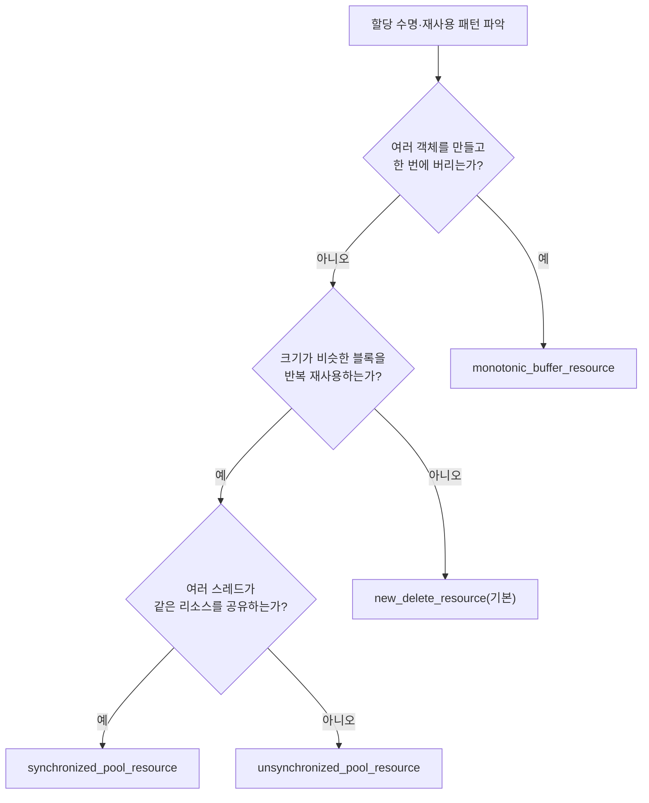

**std::pmr 실전 활용**이란 C++17 `<memory_resource>` 헤더가 제공하는 `std::pmr::polymorphic_allocator`와 `memory_resource` 계층(`monotonic_buffer_resource`, `synchronized_pool_resource` 등)을 컨테이너에 조립해 핫패스의 할당 위치와 시점을 코드 몇 줄로 재구성하는 것을 말합니다. 이전 장에서 다룬 커스텀 할당자는 "어떻게 만드는가"의 문제였다면, 이 장은 표준이 이미 만들어 둔 부품을 "어떻게 골라 끼우는가"의 문제를 다룹니다. 같은 컨테이너 타입을 유지한 채 런타임에 할당 정책만 바꿀 수 있다는 것이 pmr의 핵심 동기이며, 이 유연성이 정확히 어디서 오고 어떤 대가를 요구하는지를 이번 장에서 짚습니다.

## 이 장을 읽기 전에

**전제 지식**: [챕터 03: 커스텀 할당자 구현 패턴](/post/memory-optimization/custom-allocator-patterns/)에서 다룬 "표준 Allocator 요구사항과 그 한계"를 이해하고 있어야 이 장의 동기가 명확해집니다. [챕터 02: 할당 전략 — 풀·아레나](/post/memory-optimization/pool-arena-allocation-strategy/)에서 다룬 풀/아레나 개념도 `pool_resource` 절에서 그대로 재사용됩니다. `std::vector`가 내부적으로 할당자를 통해 메모리를 얻는다는 사실만 알면 충분하며, 자세한 컨테이너별 비용은 [챕터 01: 컨테이너 비용 모델](/post/memory-optimization/container-cost-model-selection/)을 참고하십시오.

**이 장의 깊이**: 이 장은 **중급**입니다. `memory_resource`와 `polymorphic_allocator`의 역할 분리, 표준이 제공하는 세 가지 `memory_resource` 구현체(`monotonic_buffer_resource`, `synchronized_pool_resource`, `unsynchronized_pool_resource`)의 실전 사용법, 컨테이너 통합 시 전파(propagation) 함정을 다룹니다. **다루지 않는 것**: `memory_resource`를 상속해 직접 구현하는 방법(챕터 03), 데이터 레이아웃 자체의 설계([챕터 05: AoS vs SoA](/post/memory-optimization/aos-vs-soa-data-layout/)), 프로세스 전역 `malloc` 경로를 교체하는 문제([챕터 16: 전역 할당자·jemalloc·tcmalloc](/post/memory-optimization/global-allocator-jemalloc-tcmalloc-tuning-expert/))입니다. pmr은 국소적 조립 도구이지 전역 할당기 대체재가 아니라는 경계를 이 장 내내 유지합니다.

## 당신의 수준에 맞는 경로

| 수준 | 읽을 부분 | 핵심 목표 |
|------|---------|---------|
| **초보자** | "왜 또 다른 할당자가 필요한가" ~ "memory_resource와 polymorphic_allocator의 역할 분리" | pmr이 해결하는 문제(템플릿 할당자의 타입 폭발)를 이해 |
| **중급자** | "monotonic_buffer_resource 실전 활용" ~ "pool_resource 계열" | 요청/프레임 단위 스크래치 버퍼 패턴을 직접 구현 |
| **전문가** | "컨테이너 통합과 전파 함정" ~ "비판적 시각" | non-propagation·수명 함정을 설계 단계에서 회피 |

## 왜 또 다른 할당자가 필요한가

C++11까지의 표준 Allocator 모델은 컴파일 타임 다형성에만 의존했습니다. `std::vector<T, Alloc>`에서 `Alloc`이 타입 매개변수인 이상, 서로 다른 할당자를 쓰는 두 벡터는 서로 다른 타입이 되어 함수 시그니처·ABI 경계를 넘나들 수 없었습니다. 별도 컴파일 단위를 넘나드는 라이브러리 인터페이스에서 "할당 정책만 바꾸고 컨테이너 타입은 그대로 유지"하고 싶다는 요구는 오래전부터 있었지만, 템플릿 기반 할당자로는 근본적으로 불가능했습니다. Pablo Halpern은 2014년 [N3916: Polymorphic Memory Resources](https://isocpp.org/blog/2014/02/n3916)에서 이 문제를 런타임 다형성으로 우회하는 설계를 제안했고, 이 제안은 Library Fundamentals TS를 거쳐 C++17에 `std::pmr`(Polymorphic Memory Resource) 네임스페이스와 `<memory_resource>` 헤더로 채택되었습니다. 이후 벡터 성장 전략을 다루는 P0339 같은 후속 제안들이 세부 동작을 다듬었지만, 골격은 N3916에서 정한 그대로입니다.

## memory_resource와 polymorphic_allocator의 역할 분리

pmr 생태계는 두 계층으로 나뉩니다. **`memory_resource`**는 순수 가상 함수 `do_allocate`, `do_deallocate`, `do_is_equal`을 가진 추상 기반 클래스로, "메모리가 어디서 오는가"라는 정책만 표현합니다. **`polymorphic_allocator<T>`**는 `memory_resource*` 포인터 하나를 감싸서 표준 Allocator 요구사항을 만족시키는 얇은 어댑터입니다. 컨테이너 입장에서는 `polymorphic_allocator<T>`라는 하나의 구체 타입만 보이고, 실제로 어떤 `memory_resource`가 뒤에 물려 있는지는 런타임에 결정됩니다. 그 결과 `std::pmr::vector<T>`(= `std::vector<T, std::pmr::polymorphic_allocator<T>>`)는 항상 같은 타입이면서도, 생성 시 넘긴 리소스에 따라 완전히 다른 할당 경로를 탈 수 있습니다.

이 유연성은 공짜가 아닙니다. `do_allocate` 호출은 가상 함수 호출이므로, 컴파일 타임에 인라인될 수 있는 `std::allocator`나 커스텀 템플릿 할당자와 달리 매 할당마다 간접 호출 비용이 붙습니다. 또한 `polymorphic_allocator::construct`는 uses-allocator construction을 수행하므로, `std::pmr::vector<std::pmr::string>`처럼 중첩된 pmr 컨테이너는 바깥 벡터와 안쪽 문자열이 **같은 memory_resource를 공유**합니다. 이 전파는 자동이며 별도로 할당자를 넘겨줄 필요가 없다는 점이 `std::pmr`이 일반 allocator-aware 컨테이너보다 실전에서 편한 이유입니다.

```cpp
#include <memory_resource>
#include <string>
#include <vector>
#include <array>

void build_batch() {
  std::array<std::byte, 4096> buffer{};
  std::pmr::monotonic_buffer_resource mono{buffer.data(), buffer.size()};

  std::pmr::vector<std::pmr::string> names{&mono};
  names.emplace_back("order-book-snapshot");  // string도 같은 mono에서 할당
  names.emplace_back("trade-tick-buffer");
  // names가 소멸돼도 mono가 살아 있으면 buffer는 계속 재사용 가능한 상태로 남는다.
}
```

이 코드는 `names`와 그 안의 각 `pmr::string`이 스택 위 `buffer` 하나만으로 채워진다는 것을 보여줍니다. 다만 `buffer`가 `mono`보다 먼저 파괴되면 안 되고, `mono`는 `names`보다 먼저 파괴되면 안 됩니다 — pmr은 이 수명 순서를 대신 관리해 주지 않습니다.

## monotonic_buffer_resource 실전 활용

`monotonic_buffer_resource`는 몇 개의 객체를 빠르게 만들고 한꺼번에 버리는 상황을 위한 특수 목적 리소스입니다. 초기 버퍼를 생성 시 넘길 수 있고, 버퍼가 소진되면 생성 시 지정한 **upstream 리소스**에서 추가 버퍼를 얻으며, 이때 새로 요청하는 버퍼 크기는 기하급수적으로 증가합니다. 중요한 특징은 `deallocate` 호출이 사실상 아무 일도 하지 않는다는 것입니다 — 개별 객체 단위 회수는 없고, `release()`를 호출하거나 리소스 자체가 파괴될 때만 전체 버퍼가 한 번에 반환됩니다. 이 리소스는 스레드 안전을 보장하지 않으므로 스레드마다 별도 인스턴스를 두어야 합니다.

저지연 시스템에서 가장 흔한 활용은 "요청 하나, 프레임 하나, 틱 하나"를 처리하는 동안 여러 임시 컨테이너를 만들었다가 처리가 끝나면 통째로 버리는 스크래치 버퍼 패턴입니다. 스택이나 정적 버퍼 위에 `monotonic_buffer_resource`를 얹고 매 반복마다 `release()`로 되돌리면, 반복 횟수가 아무리 많아도 힙 할당 횟수를 버퍼가 소진될 때 한 번(또는 upstream을 `null_memory_resource()`로 두어 아예 발생하지 않도록)으로 제한할 수 있습니다.

```cpp
#include <array>
#include <cstddef>
#include <memory_resource>
#include <vector>

constexpr int kElements = 256;

void process_one_request() {
  alignas(std::max_align_t) std::array<std::byte, 8192> buffer{};
  // upstream을 null_memory_resource()로 두면 buffer 초과 시 곧바로 bad_alloc이 던져져
  // "버퍼 크기 가정이 깨졌다"는 사실을 즉시 알 수 있다.
  std::pmr::monotonic_buffer_resource mono{buffer.data(), buffer.size(),
                                            std::pmr::null_memory_resource()};

  std::pmr::vector<int> scratch{&mono};
  scratch.reserve(kElements);
  for (int i = 0; i < kElements; ++i) scratch.push_back(i);
  // scratch를 소비하는 로직...
  mono.release();  // 다음 요청을 위해 buffer 전체를 재사용 가능 상태로 되돌림
}
```

이 패턴을 실제로 직접 검증하려면, 매 반복 힙에서 `std::vector`를 새로 만드는 경로와 위처럼 `monotonic_buffer_resource`를 `release()`로 재사용하는 경로를 Google Benchmark로 나란히 측정합니다.

```cpp
#include <array>
#include <benchmark/benchmark.h>
#include <memory_resource>
#include <vector>

constexpr int kElements = 256;

static void BM_HeapVectorPerIteration(benchmark::State& state) {
  for (auto _ : state) {
    std::vector<int> v;
    v.reserve(kElements);
    for (int i = 0; i < kElements; ++i) v.push_back(i);
    benchmark::DoNotOptimize(v.data());
  }
}
BENCHMARK(BM_HeapVectorPerIteration);

static void BM_PmrMonotonicVectorReused(benchmark::State& state) {
  alignas(std::max_align_t) std::array<std::byte, 8192> buffer{};
  std::pmr::monotonic_buffer_resource mono{buffer.data(), buffer.size(),
                                            std::pmr::null_memory_resource()};
  for (auto _ : state) {
    std::pmr::vector<int> v{&mono};
    v.reserve(kElements);
    for (int i = 0; i < kElements; ++i) v.push_back(i);
    benchmark::DoNotOptimize(v.data());
    mono.release();
  }
}
BENCHMARK(BM_PmrMonotonicVectorReused);

BENCHMARK_MAIN();
```

`g++ -O2 -std=c++17 bench.cpp -lbenchmark -lpthread -o bench`로 빌드해 실행합니다. 힙 `malloc`/`free` 왕복은 구현체·요청 크기에 따라 수십~수백 ns의 오버헤드를 동반하는 경우가 흔한 반면, `monotonic_buffer_resource`의 `release()` 재사용 경로는 포인터를 버퍼 시작으로 되돌리는 정도의 비용만 지불하므로 반복 횟수가 늘수록 격차가 커지는 경향이 있습니다. 정확한 배율은 플랫폼·컴파일러·기본 할당자 구현(glibc malloc, mimalloc 등)에 따라 달라지므로, 위 코드를 대상 환경에서 그대로 실행해 확인해야 합니다.

## pool_resource 계열: 재사용이 필요할 때

`monotonic_buffer_resource`가 "쌓았다 한 번에 버리는" 패턴에 맞다면, 크기가 비슷한 블록을 계속 만들고 지우는 패턴에는 `synchronized_pool_resource`와 `unsynchronized_pool_resource`가 맞습니다. 두 클래스 모두 `pool_options`(청크당 최대 블록 수, 풀로 관리할 최대 블록 크기)를 생성자에 넘겨 내부 풀 크기를 조정할 수 있고, 해제된 블록을 같은 크기 풀에 되돌려 재사용합니다. 차이는 락 유무뿐입니다 — `unsynchronized_pool_resource`는 동기화가 없어 단일 스레드/단일 워커 전용이고, `synchronized_pool_resource`는 내부 락으로 여러 스레드가 안전하게 공유할 수 있는 대신 그만큼 오버헤드가 붙습니다. 풀·아레나 설계 자체의 트레이드오프(청크 크기 선택, 프래그멘테이션 패턴)는 [챕터 02](/post/memory-optimization/pool-arena-allocation-strategy/)에서 다뤘으므로 여기서는 pmr 인터페이스로 그 개념을 어떻게 조립하는지만 봅니다.

```cpp
#include <memory_resource>
#include <unordered_map>

void handle_symbol_updates() {
  std::pmr::synchronized_pool_resource pool;  // 여러 워커 스레드가 공유
  std::pmr::unordered_map<int, double> last_price{&pool};

  last_price[101] = 128.5;
  last_price.erase(101);  // 블록은 풀로 반환되어 다음 삽입에 재사용됨
}
```

`monotonic_buffer_resource`와 달리 pool 계열은 개별 블록 해제가 실질적인 의미를 가집니다 — 삭제된 블록은 즉시 같은 크기 풀에 돌아가 다음 삽입 때 재사용되므로, 삽입·삭제가 반복되는 장수명 컨테이너에 더 적합합니다.



## 컨테이너 통합과 전파(propagation) 함정

`polymorphic_allocator`는 일반 allocator-aware 컨테이너가 기대하는 전파 규칙을 따르지 않습니다. cppreference는 이를 다음과 같이 명시합니다.

> "polymorphic_allocator does not propagate on container copy assignment, move assignment, or swap." — [cppreference: std::pmr::polymorphic_allocator](https://en.cppreference.com/w/cpp/memory/polymorphic_allocator)

즉 컨테이너를 복사·이동·스왑해도 할당자(리소스 포인터)는 원본을 따라가지 않고 대상 컨테이너가 원래 갖고 있던 리소스를 그대로 유지합니다. 실무에서 이 규칙이 만드는 결과는 두 가지입니다. 첫째, 서로 다른 리소스를 쓰는 두 pmr 컨테이너를 이동 대입하면 포인터만 훔쳐올 수 없으므로 원소 단위로 이동해야 하고, 이 과정에서 예외가 던져질 수 있습니다. 둘째, `do_is_equal`로 비교했을 때 같지 않은 리소스를 쓰는 두 컨테이너를 `swap`하면 미정의 동작입니다. 같은 리소스 포인터를 공유하는 컨테이너끼리만 값싼 이동/스왑이 보장된다는 뜻이므로, 여러 아레나를 오가며 컨테이너를 주고받는 코드에서는 이 규칙을 설계 단계에서부터 고려해야 합니다.

## 흔한 오개념

- **"pmr 컨테이너는 항상 std::vector보다 빠르다"**: 아닙니다. `polymorphic_allocator`의 이점은 그 뒤에 물린 `memory_resource` 선택(예: monotonic 재사용)에서 나오는 것이지, 가상 함수 호출 자체가 빠른 것이 아닙니다. 기본 `new_delete_resource`를 그대로 쓰면 간접 호출 한 겹만 추가되어 `std::allocator`보다 근소하게 느릴 수 있습니다.
- **"컨테이너를 이동하면 리소스도 함께 옮겨진다"**: 위에서 확인했듯 `polymorphic_allocator`는 복사·이동 대입·스왑에서 전파되지 않습니다. 서로 다른 리소스를 쓰는 컨테이너 간 스왑은 미정의 동작으로 이어질 수 있습니다.
- **"monotonic_buffer_resource도 스레드 안전하다"**: 명시적으로 스레드 안전을 보장하지 않는 클래스입니다. 여러 스레드가 공유해야 한다면 `synchronized_pool_resource`를 쓰거나 스레드마다 별도 인스턴스를 두어야 합니다.

## 판단 기준

| 상황 | 권장 | 이유 |
|------|------|------|
| 요청/프레임 단위로 여러 객체를 만들고 한 번에 버림 | `monotonic_buffer_resource` + 스택/정적 버퍼 | 개별 해제 없이 `release()`로 일괄 회수 |
| 크기가 비슷한 블록을 반복 삽입·삭제 (단일 스레드) | `unsynchronized_pool_resource` | 락 없이 블록 재사용 |
| 같은 패턴을 여러 스레드가 공유 | `synchronized_pool_resource` | 내부 락으로 스레드 안전 확보 |
| 표준 리소스로 표현 안 되는 특수 정책(락프리 슬랩 등) | 커스텀 `memory_resource` ([챕터 03](/post/memory-optimization/custom-allocator-patterns/)) | pmr은 인터페이스일 뿐, 정책은 직접 구현해야 할 때가 있음 |
| 컨테이너를 자주 이동/스왑해야 하는 코드 | 리소스를 공유하도록 설계하거나 기본 `std::allocator` 유지 | non-propagation이 예외·UB로 이어질 수 있음 |
| 프로세스 전역 `malloc` 경로 자체를 바꾸고 싶음 | 전역 할당자 교체 검토 ([챕터 16](/post/memory-optimization/global-allocator-jemalloc-tcmalloc-tuning-expert/)) | pmr은 국소적 조립 도구이지 전역 훅이 아님 |

## 비판적 시각: 한계와 트레이드오프

`memory_resource`의 가상 호출 비용은 할당 횟수가 극단적으로 많은 핫패스에서는 무시할 수 없습니다. 컴파일 타임 할당자라면 인라인·devirtualize될 여지가 있지만 `do_allocate`는 항상 간접 호출이므로, 이미 할당 횟수 자체를 0에 가깝게 줄인 코드에서는 pmr을 씌우는 것 자체가 순오버헤드가 될 수 있습니다. 타입 소거는 또 다른 대가를 만듭니다 — `std::pmr::vector<T>`는 항상 같은 타입이므로 두 인스턴스가 겉보기에 호환되지만, 실제 성능은 뒤에 물린 리소스에 전적으로 달려 있어 타입 시그니처만 보고는 두 벡터의 할당 비용이 같은지 알 수 없습니다. 이는 "같은 타입이면 같은 성능"이라는 일반적인 C++ 직관을 깨뜨리므로 코드 리뷰·팀 컨벤션에서 리소스 선택을 명시적으로 문서화할 필요가 있습니다. 또한 pmr은 할당을 없애는 도구가 아니라 할당이 **언제·어디서** 일어나는지를 재배치하는 도구입니다 — 버퍼가 소진되면 결국 upstream 리소스(대개 전역 `new`/`delete`)로 흘러가므로, 챕터 02의 풀/아레나 설계나 챕터 16의 전역 할당자 튜닝과 배타적이지 않고 함께 조립해야 하는 관계입니다. 마지막으로 리소스와 그 백업 버퍼는 그것을 참조하는 모든 컨테이너보다 오래 살아 있어야 한다는 수명 규칙은 pmr이 대신 관리해 주지 않으므로, `string_view`의 수명 함정과 근본적으로 같은 종류의 위험을 안고 있습니다.

## 마무리

이 장에서 다룬 내용을 아래 기준으로 점검하면 실전 적용 준비가 된 것입니다.

- [ ] `memory_resource`(정책)와 `polymorphic_allocator`(어댑터)의 역할 차이를 설명할 수 있다.
- [ ] `monotonic_buffer_resource`의 "일괄 해제" 의미와 스레드 비안전성을 알고, 스크래치 버퍼 패턴을 구현할 수 있다.
- [ ] `synchronized_pool_resource`와 `unsynchronized_pool_resource`를 워크로드의 스레드 공유 여부로 선택할 수 있다.
- [ ] `polymorphic_allocator`가 복사·이동·스왑에서 전파되지 않는다는 규칙과 그로 인한 예외·UB 위험을 설명할 수 있다.
- [ ] pmr이 할당을 없애는 도구가 아니라 재배치하는 도구라는 한계를 인지하고, 챕터 02·16과의 경계를 구분할 수 있다.

**이전 장**: [커스텀 할당자 구현 패턴](/post/memory-optimization/custom-allocator-patterns/) (챕터 03)

**AoS vs SoA 데이터 레이아웃**을 다룹니다. 할당 경로를 정리한 다음 단계는 그 메모리 안에 데이터를 어떻게 배치할 것인가입니다. 같은 pmr 컨테이너라도 원소를 Array-of-Structures로 두느냐 Structure-of-Arrays로 두느냐에 따라 캐시 라인 소비량이 달라지므로, 이 장의 할당 정책과 다음 장의 레이아웃 설계는 함께 적용할 때 효과가 커집니다.

→ [AoS vs SoA 데이터 레이아웃](/post/memory-optimization/aos-vs-soa-data-layout/) (챕터 05)
