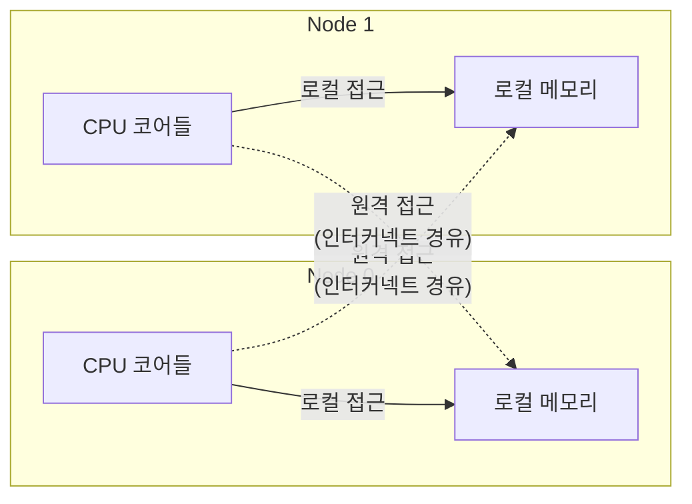
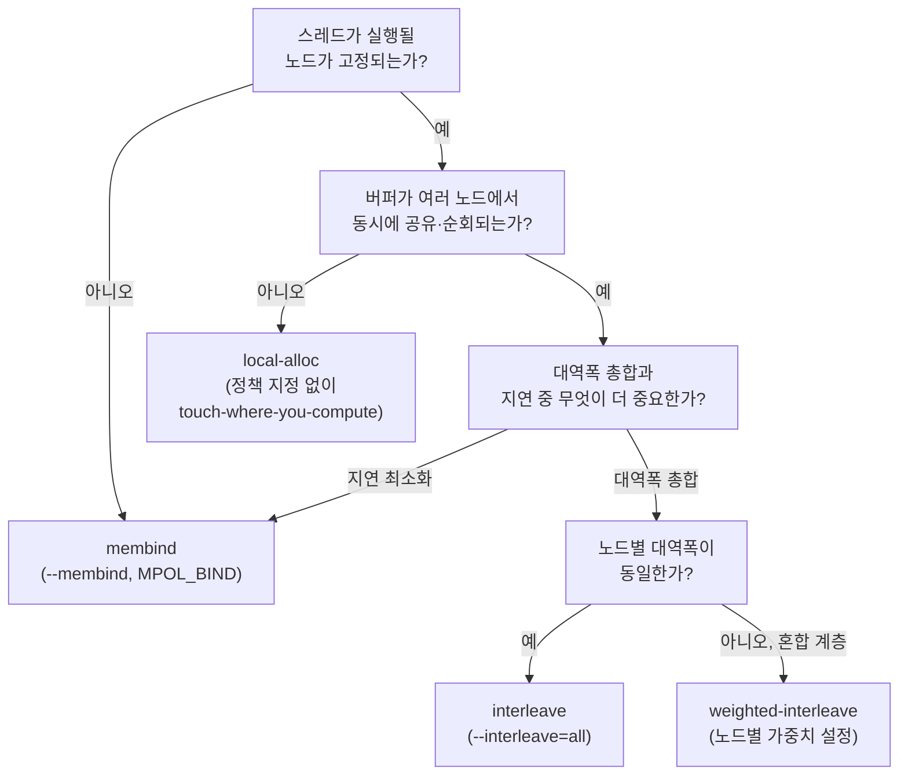

**NUMA(Non-Uniform Memory Access) 메모리 할당·지역성**이란 멀티소켓 서버에서 코어가 어느 메모리 컨트롤러에 물리적으로 가까운지에 따라 같은 `malloc` 호출, 같은 `for` 루프라도 실제로 치르는 지연이 달라지는 현상을 다루는 영역을 말합니다. 단일 소켓 랩탑에서 통과한 벤치마크가 2소켓·4소켓 서버에 배포되는 순간 흔들리는 이유의 상당수는 코드가 틀려서가 아니라, 스레드가 실행되는 코어와 그 스레드가 만지는 페이지가 서로 다른 노드에 놓였기 때문입니다. 이 장은 그 배치가 어떻게 결정되는지, 그리고 그 결정을 어떻게 통제하는지를 다룹니다.

## 이 장을 읽기 전에

**완전한 초보자?** 이 장은 [15장: 메모리·수명·캐시 라인 직관](/post/memory-optimization/memory-lifetime-cache-line-intuition-fundamentals/)에서 잡은 "캐시 라인·지역성" 직관과 [08장: Large Pages·Huge Pages](/post/memory-optimization/huge-pages-large-pages-mthp/)에서 다룬 "가상 주소와 물리 페이지는 즉시 연결되지 않는다"는 개념을 전제로 합니다. 프로세스가 `mmap`이나 `malloc`으로 메모리를 요청해도 실제 물리 페이지는 나중에 배정된다는 점만 알면 충분합니다.

**이 장의 깊이**: 이 장은 **심화** 난이도입니다. NUMA 토폴로지가 지연에 개입하는 경로, Linux의 first-touch 기본 정책, `numactl`·libnuma로 정책을 직접 지정하는 방법, 커널의 자동 밸런싱(AutoNUMA)과 수동 정책의 상호작용을 다룹니다. **다루지 않는 것**: 스레드를 특정 코어에 고정하는 스케줄러 API 자체(`sched_setaffinity`, `taskset` 등은 CPU affinity 트랙에서 다룹니다), 캐시 미스·false sharing의 하드웨어 단 분석([06장: 캐시 친화적 접근 패턴](/post/memory-optimization/cache-friendly-access-patterns/)), 대역폭·CXL 계층형 메모리의 세부 튜닝([11장: 메모리 대역폭 최적화](/post/memory-optimization/memory-bandwidth-optimization-cxl/)), 단편화 분석([10장](/post/memory-optimization/memory-fragmentation-analysis/))입니다.

## 당신의 수준에 맞는 경로

| 수준 | 읽을 부분 | 핵심 목표 |
|------|---------|---------|
| **초보자** | "NUMA 등장 배경" ~ "NUMA 토폴로지와 지역성" | NUMA가 무엇이고 로컬·원격 접근이 왜 갈리는지 이해 |
| **중급자** | "first-touch 정책" ~ "AutoNUMA와 자동 밸런싱" | numactl·libnuma로 정책을 직접 적용하고 first-touch 함정을 피함 |
| **전문가** | "판단 기준" ~ "비판적 시각" | 워크로드별 정책 선택과 자동 밸런싱·컨테이너 환경에서의 한계 판단 |

---

## NUMA 등장 배경 (역사·배경)

**NUMA**는 코어 수가 늘어나면서 모든 코어가 하나의 메모리 버스를 공유하는 **UMA(Uniform Memory Access)** 구조가 대역폭 병목에 부딪히자 나온 해법입니다. 1990년대 Sequent Computer Systems의 NUMA-Q, SGI의 Origin 2000처럼 각 소켓(또는 보드)이 자신의 로컬 메모리 컨트롤러를 갖고, 다른 소켓의 메모리는 전용 인터커넥트를 거쳐 접근하는 **ccNUMA(cache-coherent NUMA)** 설계가 상용화되었습니다. 학계 쪽에서는 Stanford의 DASH 프로젝트(Lenoski·Hennessy 등, 1990년대 초)가 캐시 일관성을 유지하는 분산 공유 메모리의 초기 모델을 제시했고, 이 계보가 오늘날 멀티소켓 x86 서버의 ccNUMA 구조로 이어집니다.

Linux 커널은 2000년대 초반부터 NUMA 인식 페이지 할당자를 갖추기 시작했지만, 초기에는 정적인 정책(어느 노드에 바인딩할지 관리자가 지정)에 의존했습니다. 실행 중 접근 패턴을 관찰해 페이지를 자동으로 옮기는 **자동 밸런싱**은 Andrea Arcangeli(Red Hat)가 2012년 제안한 AutoNUMA 설계를 기반으로, Mel Gorman이 주도한 구현이 Linux 3.8(2013년 초 릴리스) 전후로 커널에 병합되면서 표준 기능이 되었습니다. 이후로도 정책은 계속 진화해, Linux 6.9(2024년)에는 노드별 비중을 지정하는 **가중 인터리브(MPOL_WEIGHTED_INTERLEAVE)**가 추가되었고, `numactl` 2.0.19 이상에서 이를 `--weighted-interleave` 옵션으로 노출합니다. 이는 로컬 DRAM과 CXL 확장 메모리처럼 대역폭이 서로 다른 노드를 섞어 쓰는 2025-2026년의 배포 환경([11장](/post/memory-optimization/memory-bandwidth-optimization-cxl/)에서 다루는 CXL 계층형 메모리)을 겨냥한 변화입니다.

## NUMA 토폴로지와 지역성

**NUMA 노드**는 보통 소켓(또는 소켓 내 서브 도메인) 하나에 대응하며, 각 노드는 자신에게 물리적으로 연결된 CPU 코어 집합과 메모리 채널을 가집니다. 어떤 코어가 **자신의 노드에 있는 메모리**에 접근하면 로컬 접근이고, **다른 노드의 메모리**에 접근하면 소켓 간 인터커넥트(Intel UPI, AMD Infinity Fabric 등)를 한 단계 더 거치는 원격 접근입니다.



원격 접근의 추가 지연은 세대·인터커넥트·NUMA 파티셔닝 모드(예: AMD EPYC의 NPS1/NPS4)에 따라 크게 갈립니다. [chipsandcheese의 최근 측정](https://chipsandcheese.com/p/evaluating-uniform-memory-access)에서는 세대·구성에 따라 노드 간 접근이 노드 내 접근보다 대략 수십~90ns 남짓 더 걸리는 사례를 보고하지만, 이는 특정 칩·구성에서의 관찰치이며 플랫폼·BIOS 설정·펌웨어 버전에 따라 배율이 달라지므로 배포 대상 하드웨어에서 직접 재확인해야 합니다. 이 토폴로지는 `numactl -H`로 직접 확인할 수 있고, 마지막 줄의 "node distances" 행렬이 상대적인 접근 비용을 10 단위 상대값으로 보여줍니다(자기 자신은 10, 원격은 그보다 큰 값).

```text
$ numactl -H
available: 2 nodes (0-1)
node 0 cpus: 0 1 2 3 4 5 6 7
node 0 size: 64656 MB
node 0 free: 51234 MB
node 1 cpus: 8 9 10 11 12 13 14 15
node 1 size: 64703 MB
node 1 free: 58012 MB
node distances:
node   0   1
  0:  10  21
  1:  21  10
```

## first-touch 정책: 가장 흔한 함정

Linux의 기본 메모리 정책은 **local allocation**입니다. `malloc`이나 `mmap`이 반환하는 주소는 처음에는 가상 매핑일 뿐 물리 페이지가 없고, **어떤 스레드가 그 페이지를 처음으로 실제로 읽거나 쓰는 순간**(first-touch) 그 스레드가 실행 중인 노드에 물리 페이지가 배정됩니다. 이 규칙을 모른 채 "메인 스레드가 버퍼를 초기화해 두고 워커 스레드에 넘기는" 흔한 패턴을 쓰면, 초기화 자체가 first-touch가 되어 버퍼 전체가 메인 스레드의 노드에 고정되어 버립니다.

```cpp
#include <cstddef>
#include <vector>

// 깨진 패턴: 메인 스레드에서 값 초기화(=first-touch)까지 끝낸 뒤 워커에 넘긴다.
std::vector<double> make_buffer_bad(std::size_t n) {
  std::vector<double> buf(n, 0.0);  // 생성자의 값 초기화가 곧 first-touch
  return buf;
}

void worker_on_node1(std::vector<double>& buf) {
  // 이 스레드를 numactl --cpunodebind=1 등으로 노드 1에 고정해도,
  // buf의 물리 페이지는 이미 노드 0(메인 스레드 노드)에 있으므로
  // 이 루프의 모든 접근이 원격 접근이 된다.
  for (auto& v : buf) v += 1.0;
}
```

원인은 "누가 먼저 만졌는가"와 "누가 실제로 쓰는가"가 어긋난 것입니다. 고치는 방법은 두 가지입니다. 하나는 **touch-where-you-compute**, 즉 초기화를 워커 스레드 내부로 옮겨 first-touch가 계산이 실제로 일어날 노드에서 일어나게 하는 것이고, 다른 하나는 `mbind`/`numa_alloc_onnode`처럼 **누가 먼저 만지든 상관없이 노드를 강제로 고정**하는 API를 쓰는 것입니다.

```cpp
#include <numa.h>
#include <cstddef>
#include <stdexcept>
#include <new>

// 올바른 구현: numa_alloc_onnode는 내부적으로 mbind(MPOL_BIND)를 걸어,
// 이후 어느 스레드가 이 메모리를 먼저 읽고 쓰든 물리 페이지는 target_node로 고정된다.
double* make_buffer_bound(std::size_t n, int target_node) {
  if (numa_available() < 0) throw std::runtime_error("NUMA not available on this host");
  double* buf = static_cast<double*>(
      numa_alloc_onnode(n * sizeof(double), target_node));
  if (!buf) throw std::bad_alloc();
  for (std::size_t i = 0; i < n; ++i) buf[i] = 0.0;  // 어느 노드에서 실행되든 target_node에 배치됨
  return buf;  // 사용이 끝나면 numa_free(buf, n * sizeof(double))로 해제
}
```

수정이 실제로 효과가 있었는지는 추측 대신 확인해야 합니다. 실행 중인 프로세스의 노드별 페이지 분포는 `numastat -p <pid>`나 `/proc/<pid>/numa_maps`로 볼 수 있고, 개선 전후로 이 값을 비교하면 물리 페이지가 어느 노드로 옮겨갔는지 그대로 드러납니다.

```bash
# 실행 중인 프로세스의 노드별 메모리 페이지 분포 확인
numastat -p $(pgrep -f my_app)
# 또는 가상주소 구간별 정책·노드 정보를 직접 확인
cat /proc/$(pgrep -f my_app)/numa_maps
```

## 메모리 정책과 numactl

libnuma·커널이 노출하는 메모리 정책은 로컬 배치 외에도 여러 가지가 있으며, 워크로드 성격에 따라 골라 씁니다. [커널 문서(NUMA Memory Policy)](https://docs.kernel.org/admin-guide/mm/numa_memory_policy.html)가 정의하는 주요 모드는 다음과 같습니다.

- **MPOL_BIND**: 지정한 노드 집합에서만 할당하고, 그 노드들에 여유가 없으면 실패합니다. 지역성을 절대 포기하지 않는 대신, 용량 부족 시 우아하게 물러나지 않습니다.
- **MPOL_PREFERRED**: 지정 노드를 우선 시도하고, 부족하면 다른 노드로 넘어갑니다. 실패 대신 성능 저하를 감수하는 절충안입니다.
- **MPOL_INTERLEAVE**: 페이지를 여러 노드에 라운드로빈으로 분산합니다. 여러 스레드가 고르게 접근하는 큰 읽기 전용 데이터셋에서 특정 노드의 대역폭에 몰리는 것을 막습니다.
- **MPOL_WEIGHTED_INTERLEAVE**: 인터리브를 노드별 가중치대로 분산합니다(Linux 6.9+). 로컬 DRAM과 대역폭이 다른 CXL 메모리를 섞어 쓸 때, 가중치를 대역폭 비율에 맞추면 단순 라운드로빈보다 총 대역폭을 더 뽑아낼 수 있습니다.

프로세스 단위로는 코드를 건드리지 않고 [`numactl`](https://man7.org/linux/man-pages/man8/numactl.8.html)로 이 정책들을 적용할 수 있습니다.

```bash
# CPU 실행과 메모리 할당을 모두 노드 0에 고정 (지역성 최우선, 용량 부족 시 실패)
numactl --cpunodebind=0 --membind=0 ./app

# 큰 읽기 전용 데이터셋을 여러 노드에 고르게 분산 (총 대역폭 우선)
numactl --interleave=all ./app

# 노드별 가중치를 먼저 설정한 뒤 가중 인터리브 적용 (numactl ≥ 2.0.19, 커널 ≥ 6.9)
echo 5 | sudo tee /sys/kernel/mm/mempolicy/weighted_interleave/node0
echo 2 | sudo tee /sys/kernel/mm/mempolicy/weighted_interleave/node1
numactl --weighted-interleave=0,1 ./app
```

코드 안에서 컨테이너·버퍼별로 다른 정책을 적용하고 싶다면 `numactl`(프로세스 전체 단위)보다 세밀한 [libnuma API](https://man7.org/linux/man-pages/man3/numa.3.html)(`numa_alloc_onnode`, `numa_run_on_node`, `numa_tonode_memory`)를 직접 호출합니다. 이 API는 [04장: std::pmr 실전 활용](/post/memory-optimization/pmr-polymorphic-allocator-practical/)에서 다룬 `polymorphic_allocator`의 업스트림 리소스로 감싸면, 특정 컨테이너만 노드에 고정하고 나머지는 기본 할당자를 쓰는 식으로 조합할 수 있습니다.

## AutoNUMA와 자동 밸런싱

명시적 정책을 지정하지 않으면, 커널의 **자동 NUMA 밸런싱**이 백그라운드에서 페이지 접근 패턴을 관찰해 "자주 접근하는 노드로 페이지를 옮기는" 마이그레이션을 시도합니다. 접근 패턴이 안정적인 워크로드(같은 스레드가 계속 같은 데이터를 만지는 경우)에서는 수동 튜닝 없이도 시간이 지나며 지역성이 개선되는 효과를 볼 수 있습니다. 반대로 요청마다 처리 스레드가 바뀌는 워크로드(예: 네트워크 I/O 완료 코어와 처리 스레드가 매번 다른 노드로 갈리는 경우)에서는 페이지가 이 노드 저 노드로 계속 옮겨 다니며 마이그레이션 자체의 오버헤드가 이득을 갉아먹을 수 있습니다.

자동 밸런싱은 `/proc/sys/kernel/numa_balancing`에 0 또는 1을 써서 끄고 켤 수 있고, `numactl --balancing` 옵션은 `--membind`와 함께 쓸 때만 의미가 있습니다(단독으로는 무시됩니다). 명시적으로 `mbind`/`numactl --membind`로 특정 노드에 강하게 묶은 영역을 자동 밸런싱이 얼마나 존중하는지는 커널 버전에 따라 세부 동작이 달라질 수 있으므로("구현 정의"로 취급), 수동 정책과 자동 밸런싱을 동시에 켜 둔 채 배포하기 전에는 대상 커널에서 `numastat`로 실제 마이그레이션 카운트를 관찰해 서로 상충하지 않는지 확인하는 편이 안전합니다.

## CPU affinity와의 관계

메모리 정책만 고정하고 스레드가 어느 코어에서 실행될지는 스케줄러에 맡기면, 스케줄러가 스레드를 다른 노드의 코어로 옮기는 순간 애써 고정한 로컬리티가 깨집니다. 반대로 스레드만 코어에 고정하고 메모리 정책을 그대로 두면 first-touch가 예측 불가능한 노드에서 일어날 수 있습니다. 따라서 실무에서는 **"어느 코어에서 실행할 것인가"**와 **"어느 노드에 메모리를 둘 것인가"**를 한 쌍으로 결정해야 합니다. 이 장은 메모리 쪽 정책(`--membind`, `mbind`, `numa_alloc_onnode`)까지만 다루고, `sched_setaffinity`·`taskset`·cgroup `cpuset`처럼 스레드를 코어에 고정하는 메커니즘 자체는 CPU affinity를 다루는 트랙(Tr.07)에 위임합니다. 컨테이너·Kubernetes 환경에서는 `cpuset.mems`(또는 파드의 topology manager 설정)가 프로세스가 볼 수 있는 노드 자체를 제한할 수 있다는 점도 함께 염두에 둡니다.

## 벤치마크로 직접 확인하기

**측정 없이 "원격이 느리다"만 외우면 실제 배포 환경에서 효과를 예측할 수 없습니다.** 아래는 같은 코어에 고정된 채로 버퍼를 로컬 노드 또는 원격 노드에 강제 배치해 접근 지연을 비교하는 최소 스켈레톤입니다.

```cpp
// numa_locality_bench.cpp
// 빌드: g++ -O2 -std=c++17 numa_locality_bench.cpp -lnuma -o numa_locality_bench
// (Linux 전용, libnuma-devel/libnuma-dev 필요. 단일 노드 시스템에서는 차이가 나타나지 않음)
// 실행: numactl --cpunodebind=0 ./numa_locality_bench 0   (로컬 배치)
//       numactl --cpunodebind=0 ./numa_locality_bench 1   (원격 배치, 노드 1에 강제)
#include <numa.h>
#include <chrono>
#include <cstdio>
#include <cstdlib>

int main(int argc, char** argv) {
  if (numa_available() < 0) { std::fprintf(stderr, "NUMA unavailable\n"); return 1; }
  int alloc_node = (argc > 1) ? std::atoi(argv[1]) : 0;
  constexpr std::size_t kElems = 64ull * 1024 * 1024;  // 512MiB: LLC보다 크게 잡아 캐시 효과를 배제

  double* buf = static_cast<double*>(numa_alloc_onnode(kElems * sizeof(double), alloc_node));
  for (std::size_t i = 0; i < kElems; ++i) buf[i] = 0.0;  // first-touch를 alloc_node로 강제

  volatile double sum = 0.0;
  auto t0 = std::chrono::steady_clock::now();
  for (std::size_t i = 0; i < kElems; i += 16) sum += buf[i];  // 캐시 라인 간격 stride
  auto t1 = std::chrono::steady_clock::now();

  std::printf("alloc_node=%d elapsed=%.3f ms sum=%f\n", alloc_node,
              std::chrono::duration<double, std::milli>(t1 - t0).count(), sum);
  numa_free(buf, kElems * sizeof(double));
  return 0;
}
```

실행 코어는 `--cpunodebind=0`으로 고정한 채 인자만 0/1로 바꿔 비교하면, 같은 코드·같은 코어에서 **버퍼가 어느 노드에 있었는가**만 다른 두 결과를 얻습니다. 두 실행의 차이(밀리초 단위 총 시간, 필요하면 `perf stat -e node-loads,node-load-misses`로 원격 접근 횟수까지)를 직접 재고, 위에서 인용한 chipsandcheese 수치 같은 일반론에 기대지 말고 대상 하드웨어에서 확인하는 것이 중요합니다. 결과는 소켓 수·인터커넥트 세대·BIOS의 NUMA 파티셔닝 설정에 따라 달라집니다.

## 흔한 오개념

**"malloc이 반환되는 순간 물리 페이지가 그 노드에 배치된다"**는 틀렸습니다. 가상 매핑과 물리 페이지 배정은 분리되어 있고, 배정은 first-touch 시점에 일어납니다. 할당 시점의 코드만 보고 배치를 추론하면 위 "깨진 패턴"과 같은 함정에 빠집니다.

**"--membind로 노드에 묶으면 항상 더 빠르다"**도 절반만 맞습니다. 작업 집합이 로컬 캐시에 대부분 들어가는 워크로드라면 NUMA 배치가 지연에 미치는 영향 자체가 작고, 오히려 `--membind`는 그 노드의 용량이 부족할 때 **할당 실패**로 이어져 가용성 문제를 만들 수 있습니다. 용량 여유가 확실치 않다면 `--preferred`처럼 물러날 수 있는 정책이 더 안전한 경우가 많습니다.

**"AutoNUMA가 켜져 있으니 수동 튜닝은 불필요하다"**도 워크로드에 따라 깨집니다. 스레드-데이터 결합이 자주 바뀌는 워크로드에서는 자동 밸런싱의 마이그레이션 비용 자체가 병목이 될 수 있고, 이런 경우 명시적 정책이 자동 밸런싱보다 예측 가능한 성능을 냅니다.

## 판단 기준



| 상황 | 권장 | 비권장 |
|------|------|--------|
| 스레드-데이터가 1:1로 고정, 용량 확실 | local-alloc + touch-where-you-compute | 메인 스레드에서 미리 초기화 후 전달 |
| 스레드-데이터 고정, 용량이 빠듯할 수 있음 | `--preferred` 또는 `numa_alloc_onnode` 후 폴백 처리 | `--membind` (할당 실패 위험) |
| 여러 노드가 같은 대용량 읽기 전용 데이터를 순회 | `--interleave=all` | 노드 0에만 몰아서 배치 |
| 로컬 DRAM + CXL처럼 노드별 대역폭이 다름 | 가중 인터리브(`--weighted-interleave`) | 단순 라운드로빈 인터리브 |
| 접근 패턴이 실행 중 계속 바뀜 | AutoNUMA(자동 밸런싱) 활성 유지 | 정적 바인딩 고정 후 방치 |
| 요청마다 처리 스레드-데이터 결합이 매번 바뀜 | 설계 단계에서 결합을 고정 + 명시적 정책 | AutoNUMA에 맡기고 방치 |

## 비판적 시각: 한계와 트레이드오프

NUMA 튜닝의 효과는 하드웨어·가상화 계층에 강하게 의존합니다. 클라우드 VM 환경에서는 하이퍼바이저가 보여주는 vNUMA 토폴로지가 실제 물리 배치와 어긋나는 **vNUMA 오정렬**이 흔한 함정이며, 이 경우 게스트 안에서 아무리 `numactl`을 정교하게 적용해도 하이퍼바이저 단의 실제 배치를 통제할 수 없습니다. 컨테이너·Kubernetes 환경도 마찬가지로, `cpuset.mems`나 topology manager 설정이 없으면 컨테이너가 여러 노드에 걸쳐 스케줄링되어 애플리케이션 코드의 바인딩 노력이 무력화될 수 있습니다.

`--membind`처럼 강한 정책은 지역성을 보장하는 대신 **용량 부족 시 우아하게 물러나지 않는다**는 트레이드오프를 가지므로, 트래픽이 늘어 메모리 사용량이 예측을 넘는 상황에서는 서비스 중단으로 이어질 수 있습니다. 또한 이 장에서 인용한 원격 접근 지연 수치는 특정 세대·구성에서의 관찰치일 뿐이며, 최신 세대일수록 NUMA 파티셔닝 모드(NPS1 vs NPS4 등)에 따라 격차가 좁혀지거나 넓어지는 방향이 뒤바뀔 수 있으므로, "NUMA가 항상 큰 문제"라는 가정보다 대상 하드웨어에서 앞서 본 벤치마크 스켈레톤 같은 것으로 직접 재현하는 습관이 더 중요합니다.

## 마무리

- [ ] first-touch 정책이 물리 페이지 배치를 언제 결정하는지 설명할 수 있다.
- [ ] "메인 스레드가 초기화 후 전달" 패턴이 왜 원격 접근을 만드는지, 어떻게 고치는지 설명할 수 있다.
- [ ] `numactl`의 `--membind`·`--interleave`·`--weighted-interleave`가 각각 어떤 상황에 맞는지 구분할 수 있다.
- [ ] AutoNUMA가 도움이 되는 워크로드와 오히려 손해가 되는 워크로드를 구분할 수 있다.
- [ ] NUMA 정책과 CPU affinity가 왜 한 쌍으로 결정되어야 하는지 말할 수 있다.
- [ ] `numastat`·`numa_maps`로 정책 적용 전후의 실제 페이지 분포를 확인할 수 있다.

**다음 장에서는** 지금까지 다룬 할당·레이아웃·NUMA 배치가 장시간 실행되는 프로세스에서 어떻게 **단편화**로 누적되는지를 다룹니다. 풀·아레나·전역 할당자가 반복 할당·해제를 거치며 메모리를 어떻게 흩어 놓는지, 그리고 이를 진단·완화하는 방법을 정리합니다.

→ [메모리 단편화 분석·대응](/post/memory-optimization/memory-fragmentation-analysis/)
