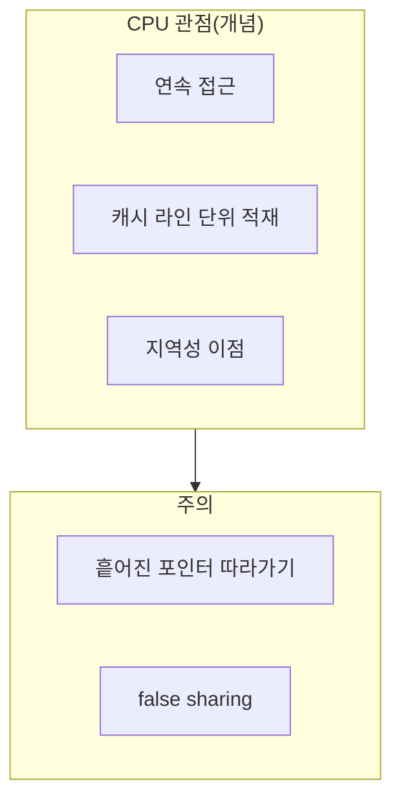

본 장은 **기초** 난이도입니다. 이 트랙의 본문 챕터들은 할당기·풀·레이아웃 등으로 빠르게 들어가는데, 독자마다 **“메모리가 왜 비싼가”**에 대한 머릿속 그림이 다르면 같은 조언도 다르게 읽힙니다. 여기서는 수식 대신 **직관**만 맞춥니다.

## 스택과 힙을 한 문장으로

- **스택**: 호출이 살아 있는 동안만 의미 있는 **프레임 단위** 저장소. 되돌리기 쉽고, 일반적으로 힙보다 관리 비용이 작습니다.  
- **힙**: 수명을 프로그램이(또는 런타임이) 결정하는 **더 일반적인** 저장소. 유연하지만 **할당기·동기화·메타데이터** 비용이 붙을 수 있습니다.

“힙이 나쁘다”가 아니라 **핫패스에서 힙을 얼마나 자주 치느냐**가 문제입니다. Tr.01의 실행 모델 장과 같은 말을 다른 각도에서 반복합니다.

## 수명(lifetime)이 성능에 들어오는 방식

C++에서 **수명**은 UB를 피하기 위한 규칙이기도 하지만, 성능 논의에서는 다음으로 연결됩니다.

- **스코프 끝에서 바로 파괴**되는 객체는 스택·RAII와 잘 맞고, **장기간 살아 있는** 객체는 캐시·NUMA·동시성과 맞물립니다.  
- **공유 포인터·글로벌 캐시**는 수명을 늘리는 대신 **동기화·할당**을 끌고올 수 있습니다.  
- **뷰(view) 타입**(`string_view` 등)은 수명 전제가 틀리면 성능 이전에 정확성이 무너집니다.

즉 “빠른 타입 고르기” 전에 **누가 언제까지 유효한가**를 그림으로 그려 보는 것이 기초입니다.

## 캐시 라인 직관

CPU는 메모리를 바이트 하나씩이 아니라 **캐시 라인**(흔히 64바이트) 덩어리로 가져옵니다.

- **공간 지역성**: 인접 주소를 순서대로 읽으면 한 라인을 여러 번 활용하기 쉽습니다.  
- **시간 지역성**: 같은 주소를 짧은 간격으로 다시 읽으면 히트 확률이 올라갑니다.  
- **false sharing**: 서로 다른 코어가 **같은 캐시 라인**에 있는 서로 다른 데이터를 쓰면, 캐시 일관성 때문에 성능이 무너질 수 있습니다(심화에서 자주 등장).

이 장에서는 “왜 컨테이너 재배치·패딩 이야기가 나오는가”의 **배경**만 제공합니다.

## 할당 “한 번”의 비용이 커지는 이유

할당기는 단순히 주소를 돌려주는 함수가 아니라, **메타데이터·락·페이지·arena 상태**를 갱신할 수 있습니다. µs 예산에서는 다음이 자주 쟁점입니다.

- 루프 안에서 **매번 작은 객체를 새로 만들기**  
- **문자열 연결**을 반복하기  
- **컨테이너 재할당**이 예상보다 자주 일어나기  

기초 단계에서는 “도구 이름”보다 **패턴**을 보는 연습이 중요합니다.

## 이 트랙·타 트랙과의 연결

- **Tr.01**: 추상화 비용·컨테이너·문자열에서 할당이 어떻게 드러나는지.  
- **Tr.06**: 캐시 미스·스토어 포워딩 등 **하드웨어 증거**로 설명.  
- **본 트랙(심화)**: 풀링·커스텀 할당기·레이아웃.  
- **본 트랙(전문)**: 챕터 16에서 전역 할당자 교체·튜닝으로 이어집니다.

## 스스로에게 묻는 질문 12

1. 이 객체는 **어느 저장소**(스택/힙/정적)에 사는가?  
2. 수명은 **어느 스코프**에 묶여 있는가?  
3. 다른 스레드가 **동시에 쓰는가**?  
4. 데이터가 **한 덩어리로 순회** 가능한가?  
5. 컨테이너가 **재할당**할 타이밍이 있는가?  
6. 포인터가 **캐시 친화적인지** 흩어져 있는가?  
7. false sharing 후보인 **핫 카운터**가 있는가?  
8. 할당이 **루프 안**에 있는가 바깥에 있는가?  
9. **이동**으로 복사를 줄일 수 있는가?  
10. **소형 벡터 최적화** 같은 구현 디테일에 기대는가?  
11. 디버그·ASan 빌드에서만 드러나는 **과도한 검사**는 없는가?  
12. 측정(Tr.05) 없이 결론을 내리고 있지는 않은가?

## 마무리

메모리 성능은 곧바로 “할당기 브랜드”로 가기 쉽지만, 그 전에 **수명·지역성·캐시 라인** 세 가지를 스케치할 수 있어야 합니다. 이 장을 지나면 같은 문장을 읽을 때 **같은 그림**을 공유할 수 있습니다.

## 부록: 읽기 순서 제안

1. Tr.01 기초 장(실행 모델 어휘) 또는 본 장(15)  
2. Tr.01 본 챕터들에서 **할당이 보이는 지점** 표시  
3. Tr.06에서 **캐시 카운터**로 가설 검증  
4. 본 트랙 심화로 내려가며 패턴을 도구로 치환

## 부록: 용어 한글·영문 대응

- **allocator**: 할당기  
- **arena / bump pointer**: (문맥에 따라) 구역 할당·범프 포인터 방식  
- **working set**: 작업 집합, 실행 중 자주 닿는 페이지·라인의 합  
- **stride**: 연속 접근 시 주소 간격
