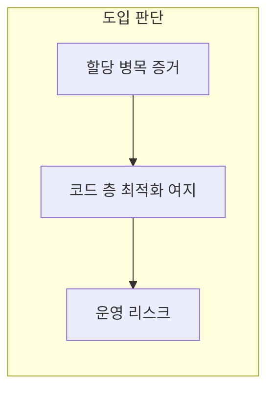

본 장은 **전문** 난이도입니다. **전역 할당자**(프로세스 기본 `malloc`/`free` 계열을 대체하거나 런타임 훅으로 감싸는 방식)를 바꾸면 **다스레드 할당·프레그멘테이션·캐시 지역성**이 함께 움직입니다. **jemalloc**, **tcmalloc** 계열은 자주 언급되지만, “설치하면 빨라진다” 수준으로 접근하면 **회귀·디버깅 지옥**으로 이어지기 쉽습니다.

## 무엇을 바꾸는가

전역 할당자 튜닝은 보통 다음 중 하나 이상을 목표로 합니다.

- **스레드 간 경합 완화**: 중앙 락 병목을 줄이기 위해 per-thread 캐시·arena를 둡니다.  
- **할당 크기별 경로 분리**: 작은 객체와 큰 객체를 다른 경로로 처리합니다.  
- **프레그멘테이션 완화**: 장기 실행 프로세스에서의 **메모리 사용량 추세**를 안정화합니다.  
- **지연 분포 개선**: 평균보다 **꼬리**에서 할당기가 튀는 경우를 줄입니다.

동시에 **Tr.01**에서 논의되는 **문자열 SSO**, **컨테이너의 커스텀 할당자**, **스택 기반 버퍼** 같은 기법과 **경계가 겹칩니다**. 애플리케이션이 이미 할당을 크게 줄였다면 전역 교체 이득이 작아질 수 있습니다.

## 워크로드 의존성

같은 바이너리라도 다음에 따라 결과가 갈립니다.

- **객체 크기 분포**: 작은 할당이 폭주하는지, 드물게 큰 블록이 나오는지.  
- **수명 분포**: 초단수명 vs 장수명 객체 비율.  
- **스레드 수**: per-thread 캐시 설계가 이득인지 오버헤드인지.  
- **NUMA**: 소켓 간 할당이 섞이면 이야기가 달라집니다(Tr.07·Tr.06과 연계).

따라서 “벤치 한 줄”보다 **프로덕션 프로파일에서의 할당 패턴**을 먼저 요약하는 것이 전문가적인 접근입니다.

## 검증 절차(최소한)

1. **기준선**: 기본 할당기에서 할당 카운트·지연 분포·RSS 추세를 기록합니다.  
2. **A/B**: 동일 바이너리·동일 트래픽에서 할당기만 교체합니다.  
3. **회귀 스위치**: 한 플래그로 되돌릴 수 있게 합니다.  
4. **디버그 빌드**: ASan/TSan 등과의 **공존 정책**을 문서화합니다(충돌이 흔합니다).  
5. **장기 soak**: 메모리가 **천천히** 새는지, 프래그멘테이션이 **시간에 따라** 악화되는지 봅니다.

## C++와의 상호작용

- **전역 `new`/`delete` 오버로드**는 모듈 경계·서드파티 라이브러리와 **섞이면** 디버깅이 어렵습니다.  
- **`std::pmr`**, **컨테이너별 allocator**는 전역 교체보다 **국소적**이지만 설계 비용이 있습니다.  
- **메모리 풀**은 전역 할당기와 **중복 캐싱**이 될 수 있어, “이중 관리”를 경계해야 합니다.

## 운영·보안 관점

일부 환경에서는 **바이너리에 비표준 런타임을 끼워 넣는 것** 자체가 정책 검토 대상입니다. 규제 산업에서는 **공급망·감사 로그**에 할당기 버전까지 포함해야 할 수 있습니다(Tr.09).

## 흔한 실패 패턴

- **개발자 랩탑에서만 벤치**: 서버 NUMA·컨테이너 cgroup 한도와 괴리.  
- **p99 무시**: 평균은 개선됐는데 꼬리가 나빠져 SLO 위반.  
- **디버그 이슈**: 크래시 덤프·심볼과 맞지 않는 메타데이터.  
- **플랫폼 혼동**: Linux에서 이득이 Windows에서 손해인 사례.

## 마무리

전역 할당자 튜닝은 **강력한 레버**이지만 **애플리케이션 할당 패턴을 바꾸는 것**만큼 값비싼 변경은 아닙니다. 먼저 Tr.01·본 트랙 기초(챕터 15)에서 **불필요한 할당**을 줄이고, 증거가 남을 때만 본 장의 절차로 들어오는 순서를 권합니다.

## 부록: 체크리스트 20

1. hot 경로에서 `malloc` 빈도가 프로파일 상위인가?  
2. 스레드 수 증가에 할당 지연이 비선형으로 나쁜가?  
3. RSS가 시간과 함께 들쭉날쭉한가?  
4. 커스텀 풀·arena가 이미 있는가?  
5. 서드파티가 자체 할당기를 가정하는가?  
6. 정적 링크 vs 동적 링크 중 무엇인가?  
7. 컨테이너 이미지에 런타임이 포함되는가?  
8. 롤밹 플랜이 있는가?  
9. 성능·메모리 **두 축**을 동시에 볼 것인가?  
10. p99/p999를 계약에 넣을 것인가?  
11. ASan 빌드 파이프라인은?  
12. 크로스 플랫폼 지원 범위는?  
13. jemalloc/tcmalloc **버전 고정** 정책은?  
14. 설정 튜닝(arena 수 등) 문서화는?  
15. 관측 지표(할당 지연 히스토그램)가 있는가?  
16. 메모리 한도 초과 시 OOM 킬 타이밍은?  
17. 샤딩된 프로세스마다 동일 설정인가?  
18. 카나리 배포 가능한가?  
19. 사고 시 원인 분기(앱 vs 할당기)가 가능한가?  
20. 팀 합의(Tr.09)가 있는가?

## 부록: Tr.01과의 경계 문장

**Tr.01**은 “코드가 어떤 타입으로 무엇을 할당하는가”에 가깝고, **본 장**은 “그 요청을 런타임이 어떻게 처리하는가”에 가깝습니다. 둘 다 손대면 효과가 크지만, **동시에** 바꾸면 회귀 원인 분석이 어려우므로 한 번에 하나의 레버를 우선합니다.
