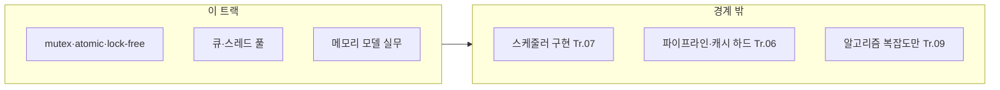

이 트랙은 "스레드가 늘어날수록 느려지는 이유"를 비용 관점으로 설명하고 통제합니다. µs 시스템에서는 lock 경합, cache line ping-pong, 잘못된 atomic 사용이 지연시간의 지배항이 되기 쉽습니다.

## 이 트랙이 책임지는 범위

- `mutex`/`spinlock`/`atomic`의 비용과 선택 기준
- lock-free 설계의 적용 판단(필요/위험/유지보수 비용)
- false sharing 회피, cache line 단위 데이터 분리
- C++ 메모리 모델의 실무적 해석(acquire/release 등)
- 큐/링버퍼(SPSC/MPMC) 등 기본 동시성 구조의 비용 모델

## 이 트랙이 다루지 않는 것 (경계)

- OS 스케줄러 "구현"과 커널 내부 튜닝 (→ OS/런타임 트랙)
- CPU 파이프라인/분기/캐시 계층의 하드 분석 (→ CPU 트랙)
- 알고리즘 자체의 시간 복잡도 선택 (→ 설계/의사결정 트랙 또는 별도)

## 커리큘럼

**난이도 범례**: **기초**(입문) · **중급**(실무 핵심) · **심화**(깊은 분석·전문 주제) · **전문**(극한·니치). **Tr.NN**은 `optimization-NN-*` 트랙을 가리킵니다.

동시성 배경이 약하다면 **01 → 02 → 03 → 18 → 19 → 04** 순서로 진입하는 것을 권장합니다. 01~03은 비용·경합·false sharing의 직관을 만들고, 18~19는 표준 프리미티브의 실제 사용 비용을 체감하게 해 주며, 그다음 04~08의 메모리 모델·lock-free로 들어가면 경사가 훨씬 완만해집니다.

여기서도 **표 순서는 커리큘럼 참조용으로 유지**합니다. 표는 “이 트랙이 어떤 주제를 어디까지 다루는지”를 보여 주는 지도이고, 위 추천 순서는 초심자가 **개념 의존성**에 맞춰 들어오는 경로입니다.

| 챕터 | 제목 | 난이도 | 핵심 내용 |
|------|------|--------|-----------|
| 01 | 동기화 비용 분석 | 기초 | mutex/spinlock/atomic 비용 정량 분석 |
| 02 | Lock 선택 기준 | 기초 | 동기화 프리미티브 선택 가이드 |
| 03 | False Sharing 회피 | 중급 | False sharing 탐지와 해결 |
| 04 | 메모리 모델 실무 | 심화 | C++ 메모리 모델 실무 해석 (acquire/release/seq_cst) |
| 05 | Lock-free 기초 | 심화 | Lock-free 설계 기초와 적용 판단 |
| 06 | Lock-free 자료구조 | 전문 | Lock-free 큐, 스택, 해시맵 구현 |
| 07 | Hazard Pointers/RCU | 전문 | Hazard Pointers와 RCU 패턴 |
| 08 | SPSC/MPMC 큐 | 심화 | SPSC/MPMC 큐와 링버퍼 구현 |
| 09 | C++20 Atomics | 중급 | C++20 atomic wait/notify 활용 |
| 10 | 스레드 풀 최적화 | 중급 | 스레드 풀 최적화와 워크 스틸링 |
| 11 | 코루틴 동시성 | 심화 | 코루틴 기반 동시성 패턴 (Tr.01 코루틴 성능과 연계) |
| 12 | Wait-free 프로그래밍 | 전문 | Wait-free 프로그래밍 기초 |
| 13 | std::jthread와 stop_token | 중급 | C++20 협력적 스레드 취소와 활용 |
| 14 | Seqlock 패턴 | 심화 | Reader-writer 시나리오 최적화를 위한 Seqlock |
| 15 | Thread-local Storage | 중급 | TLS 비용 분석과 활용 패턴 |
| 16 | Executors 기초 | 심화 | C++23/26 Executors 개념과 비동기 실행 모델 |
| 17 | std::execution 병렬 알고리즘 | 중급 | C++17/20 병렬 정책(par, par_unseq)과 실전 성능 특성 |
| 18 | Condition Variable 성능 패턴 | 중급 | condition_variable 비용, spurious wakeup 대응, 대안 비교 |
| 19 | C++20 Barrier/Latch 활용 | 중급 | std::barrier/std::latch 비용과 동기 지점 설계 패턴 |

## 측정과 검증 (이 트랙 기준)

- 경합(락 대기/스핀) 시간을 수치로 분리해서 측정
- 스레드 수 변화에 따른 레이턴시 분포(p50/p95/p99) 확인
- false sharing 개선 전/후를 microbenchmark로 재현/검증
- TSAN, wait trace, 플랫폼 프로파일러로 deadlock·경합·가시성 문제를 별도 확인

## 추천 선행/병행 트랙

- **선행**: Low-latency 프로파일링·성능 분석 (Tr.05)
- **병행**: 메모리·할당·레이아웃 (Tr.03), OS·런타임 (Tr.07)

## 왜 이 트랙인가 (동기)

동시성은 “스레드를 늘리면 빨라진다”로 끝나지 않습니다. µs 도메인에서는 **락 대기 한 번**, **false sharing 한 줄**, **잘못된 memory_order**가 평균이 아니라 **p99·p999**를 망가뜨립니다. 이 트랙은 추상적 패턴 나열이 아니라, **비용을 측정해** 스핀락과 뮤텍스, lock-free, 큐 패턴 중 무엇이 자신의 워크로드에 맞는지 판단하는 훈련을 목표로 합니다.

## Phase별 학습 궤적

**Phase A — 동기화 기초 (챕터 01~04, 18~19)** 비용·락 선택·false sharing·표준 동기화 프리미티브의 사용 감각을 먼저 익히지 않으면, 이후 lock-free를 **맞는지 틀린지조차** 검증하기 어렵습니다.

**Phase B — 구조와 큐 (챕터 08~11, 13~15, 17~19)** SPSC/MPMC·스레드 풀·TLS는 서버·파이프라인 코드에서 바로 적용 빈도가 높습니다. 코루틴 동시성(챕터 11)은 Tr.01 코루틴 성능과 연결해 읽으면 설계 일관성이 좋아집니다. 챕터 17~19의 병렬 알고리즘·condition_variable·barrier/latch는 표준 라이브러리 동시성 프리미티브의 비용과 올바른 사용 패턴을 다루며, lock-free 진입 전에 익히면 기반이 단단해집니다.

**Phase C — lock-free·wait-free·Executors (챕터 05~07, 12, 16)** 표에서 **전문** 난이도가 많습니다. 유지보수·정확성 리스크가 크므로, Tr.05로 경합과 꼬리 지연이 **실제 병목**임을 확인한 뒤 진입하는 것을 권장합니다.

## 이 트랙을 마친 후 달성할 목표

- **측정**: 스레드 수·경합 조건에서 p50/p99 변화를 벤치마크로 재현할 수 있다.
- **선택**: mutex vs spin vs lock-free 후보를 **비용·위험** 기준으로 고를 수 있다.
- **구현**: false sharing·캐시 라인 정렬 등 레이아웃 대응을 코드에 반영할 수 있다.
- **표준 동시성**: std::execution 병렬 정책, condition_variable, barrier/latch의 비용을 이해하고 올바르게 적용할 수 있다.
- **경계**: OS 스케줄러(Tr.07)·CPU 미세구조(Tr.06)와 역할을 나눌 수 있다.

## 평가 기준과 이 장을 읽은 후 확인

- [ ] “동시성 문제”를 경합·가시성·레이아웃 중 어디에 속하는지 구분할 수 있는가?
- [ ] lock-free·wait-free 챕터를 **언제 미루어야 하는지** 말할 수 있는가?
- [ ] Tr.03·Tr.07과 병행할 포인트(메모리 지역성, affinity)를 짚을 수 있는가?

## 범위와 경계

## 심화·전문가 확장 궤적

Hazard pointer·RCU·wait-free·일부 lock-free 자료구조는 **전문** 난이도로 표시했습니다. 운영 중인 시스템에 도입할 때는 코드 리뷰·모델 검증·회귀 벤치마크(Tr.10)를 함께 계획하는 것이 안전합니다.

## 시리즈 전체 로드맵

12개 트랙의 권장 순서·심화 진입 조건은 **[Low-latency 최적화 시리즈 개요](/collection/optimization-00-series-overview/00-introduction/)**를 참고하세요.
