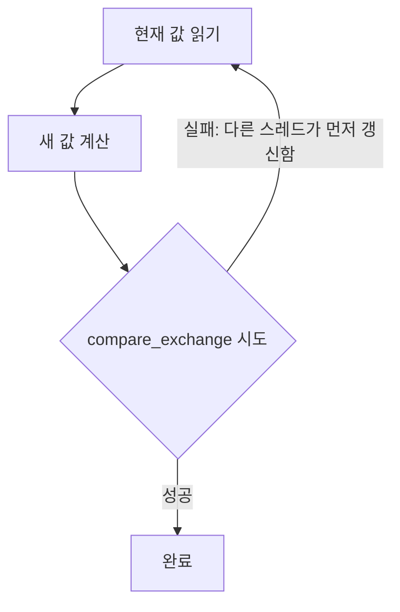
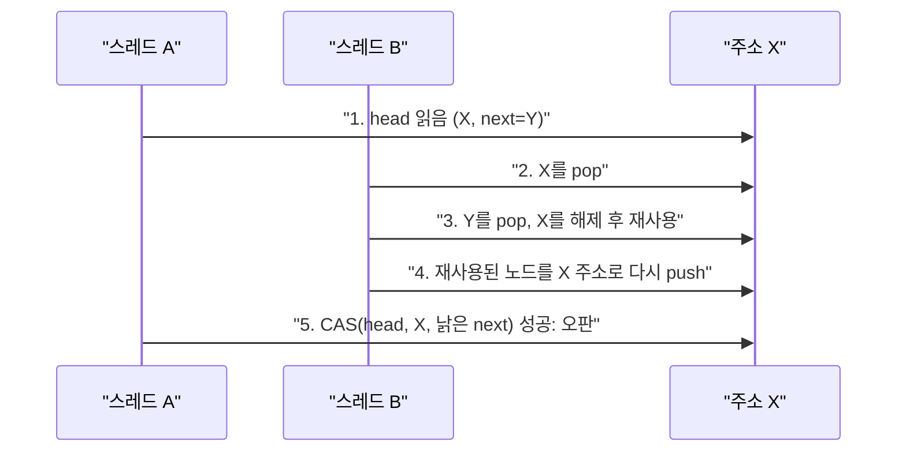

**Lock-free 설계**란 뮤텍스 같은 배타적 락 없이, CPU가 제공하는 원자적 read-modify-write 명령(대표적으로 CAS, compare-and-swap)만으로 여러 스레드가 공유 자료구조를 동시에 갱신하도록 만드는 설계 방식을 말합니다. 락을 쓰지 않으므로 "락을 쥔 스레드가 선점당하면 나머지 스레드가 모두 그 스레드를 기다려야 하는" 문제(priority inversion, convoy effect)에서 원천적으로 자유롭고, 신호 핸들러나 인터럽트 컨텍스트처럼 블로킹이 금지된 곳에서도 쓸 수 있다는 것이 lock-free의 핵심 동기입니다. 하지만 이 자유에는 대가가 따릅니다. CAS 재시도 루프를 직접 설계해야 하고, ABA 문제 같은 락 기반 코드에는 없던 새로운 버그 종류가 생기며, 검증 난이도가 mutex 코드보다 훨씬 높습니다. 이 장은 그 기본 메커니즘과 "언제 이 비용을 감수할 가치가 있는지" 판단하는 기준을 다룹니다.

## 이 장을 읽기 전에

**전제 지식**: 이 장은 [챕터 04: C++ 메모리 모델 실무 해석](/post/concurrency-optimization/cpp-memory-model-acquire-release-seqcst/)에서 다룬 `memory_order_acquire`/`release`/`relaxed`의 의미를 그대로 사용합니다. CAS 호출에 붙는 memory order 인자가 왜 필요한지 다시 설명하지 않으니, acquire/release 쌍이 무엇을 보장하는지 감이 없다면 04장을 먼저 읽는 것을 권합니다. [챕터 01: 동기화 비용 정량 분석](/post/concurrency-optimization/synchronization-primitive-cost-analysis/)과 [챕터 02: Lock 선택 기준](/post/concurrency-optimization/lock-selection-criteria-guide/)도 mutex와의 비용 비교를 이해하는 데 도움이 됩니다.

**이 장의 깊이**: CAS 재시도 루프의 동작 원리, ABA 문제의 발생 조건과 완화 기법, lock-free 적용 여부를 가르는 판단 기준, 그리고 "하드웨어가 이 문제를 대신 풀어줄 것"이라는 기대가 실패한 사례로서 Intel TSX/HTM의 폐기 배경을 다룹니다. **다루지 않는 것**: 실제 프로덕션급 lock-free 큐·스택·해시맵의 완전한 구현과 메모리 재사용 전략은 [챕터 06](/post/concurrency-optimization/lock-free-queue-stack-hashmap/)에서, 안전한 메모리 회수를 위한 hazard pointer·RCU는 [챕터 07](/post/concurrency-optimization/hazard-pointer-rcu-cpp26/)에서, wait-free 진행 보장은 [챕터 12](/post/concurrency-optimization/wait-free-programming-fundamentals/)에서 다룹니다. 이 장은 그 세 챕터로 들어가기 전에 필요한 공통 기초입니다.

## 당신의 수준에 맞는 경로

| 수준 | 읽을 부분 | 핵심 목표 |
|------|---------|---------|
| **초보자** | "CAS와 lock-free의 계보" ~ "CAS 루프: lock-free의 기본 동작" | CAS가 무엇이고 재시도 루프가 어떻게 동작하는지 이해 |
| **중급자** | "ABA 문제" ~ "HTM과 Intel TSX" | ABA 문제의 원인·완화법과 TSX가 대안이 될 수 없는 이유 이해 |
| **전문가** | "판단 기준" ~ "비판적 시각" | lock-free 도입 여부를 비용·위험 기준으로 판단 |

## CAS와 lock-free의 계보 (역사·배경)

**CAS(compare-and-swap)**는 "메모리 위치의 현재 값이 기대값과 같으면 새 값으로 교체하고, 다르면 아무것도 하지 않은 채 실패를 알린다"는 단일 원자적 명령입니다. 이 명령 자체는 오래된 개념으로, IBM System/370(1970년대)에 이미 `CS`(Compare and Swap) 명령이 있었고, x86에는 486부터 `CMPXCHG`가 존재합니다. lock-free 프로그래밍이 학술적으로 정립된 것은 Maurice Herlihy의 1991년 논문 "Wait-Free Synchronization"(ACM TOPLAS)부터로, 이 논문은 동기화 프리미티브를 "합의(consensus) 문제를 몇 개의 프로세스까지 풀 수 있는가"라는 척도로 분류했고, 이후 Herlihy와 Nir Shavit의 저서 *The Art of Multiprocessor Programming*이 lock-free/wait-free/obstruction-free라는 진행 보장(progress guarantee) 용어를 정리해 널리 퍼뜨렸습니다. **lock-free**는 "시스템 전체적으로 최소 하나의 스레드는 유한 시간 내에 진행한다"는 보장이고, **wait-free**는 "모든 개별 스레드가 유한 시간 내에 진행한다"는 더 강한 보장입니다. 이 장에서 다루는 CAS 루프는 lock-free 수준의 보장만 제공하며, wait-free는 [챕터 12](/post/concurrency-optimization/wait-free-programming-fundamentals/)의 주제입니다.

## CAS 루프: lock-free의 기본 동작

**lock-free 알고리즘의 전형적인 형태는 "현재 상태를 읽고, 원하는 다음 상태를 계산한 뒤, CAS로 갱신을 시도하고, 실패하면 처음부터 다시 읽어 반복한다"는 재시도 루프입니다.** 이 루프가 lock-free인 이유는, 한 스레드의 CAS가 실패했다는 것은 반드시 다른 어떤 스레드의 CAS가 그 사이 성공했다는 뜻이기 때문입니다. 즉 개별 스레드는 계속 실패할 수 있어도(그 스레드 입장에서는 wait-free가 아님), 시스템 전체로 보면 매 실패마다 누군가는 진행하고 있으므로 전체가 멈추는 일은 없습니다.

```cpp
#include <atomic>
#include <cstdint>

class RelaxedCounter {
 public:
  void add(std::int64_t delta) noexcept {
    std::int64_t old_value = counter_.load(std::memory_order_relaxed);
    // CAS 실패 시 old_value가 최신 값으로 자동 갱신되므로 그대로 재시도한다.
    while (!counter_.compare_exchange_weak(
        old_value, old_value + delta,
        std::memory_order_relaxed, std::memory_order_relaxed)) {
    }
  }

  std::int64_t load() const noexcept {
    return counter_.load(std::memory_order_relaxed);
  }

 private:
  std::atomic<std::int64_t> counter_{0};
};
```

이 카운터는 단순 증가만 하므로 `memory_order_relaxed`로 충분합니다(어떤 스레드가 먼저 갱신되는지 순서만 원자적으로 보장되면 되고, 이 값을 근거로 다른 메모리 접근을 동기화하지 않기 때문입니다). 실제 lock-free 자료구조에서는 포인터를 교체하므로 성공 시 `acquire`/`release`가 필요한 경우가 대부분이며, 그 근거는 04장에서 다룬 happens-before 규칙 그대로입니다.

`compare_exchange_weak`와 `compare_exchange_strong`의 차이는 **spurious failure(허위 실패)** 허용 여부입니다. cppreference는 `compare_exchange_weak`에 대해 "현재 값이 기대값과 같아도 실패한 것처럼 동작할 수 있다"고 명시하는데, 이는 일부 아키텍처의 load-link/store-conditional 명령이 캐시 라인 단위로 "그 사이 아무도 안 건드렸는가"를 근사 검사하기 때문입니다. 루프 안에서 반복 호출할 때는 `_weak`가 그런 플랫폼에서 더 빠르므로 권장되고, 루프 밖에서 단 한 번만 시도하고 결과를 신뢰해야 한다면 `_strong`을 씁니다.

CAS 루프와 mutex 카운터의 실제 비용 차이는 스레드 수·경합 정도에 따라 달라지므로, 다음과 같은 벤치마크로 직접 재현해 판단하는 것이 안전합니다.

```cpp
#include <benchmark/benchmark.h>
#include <atomic>
#include <cstdint>
#include <mutex>

static std::atomic<std::int64_t> g_cas_counter{0};
static std::int64_t g_mutex_counter = 0;
static std::mutex g_mutex;

static void BM_CasIncrement(benchmark::State& state) {
  for (auto _ : state) {
    std::int64_t old_value = g_cas_counter.load(std::memory_order_relaxed);
    while (!g_cas_counter.compare_exchange_weak(old_value, old_value + 1,
                                                 std::memory_order_relaxed)) {
    }
  }
}
BENCHMARK(BM_CasIncrement)->Threads(1)->Threads(4)->Threads(8);

static void BM_MutexIncrement(benchmark::State& state) {
  for (auto _ : state) {
    std::lock_guard<std::mutex> lock(g_mutex);
    ++g_mutex_counter;
  }
}
BENCHMARK(BM_MutexIncrement)->Threads(1)->Threads(4)->Threads(8);

BENCHMARK_MAIN();
```

`g++ -O2 -std=c++20 bench.cpp -lbenchmark -lpthread -o bench`로 빌드해 스레드 수를 늘려가며 실행하면(x86-64, GCC 13 기준 예시), 스레드 수가 1일 때는 두 방식이 비슷하거나 mutex 쪽이 근소하게 앞서는 경우가 흔하고, 스레드 수가 늘어 경합이 커질수록 CAS 쪽이 상대적으로 유리해지는 경향이 있습니다. 다만 두 방식 모두 같은 캐시 라인 하나를 두고 경쟁하는 구조이므로 극단적으로 스레드 수가 많아지면 CAS 쪽도 재시도가 급증해 성능이 나빠집니다. 정확한 배율은 플랫폼·컴파일러·경합 패턴에 따라 크게 달라지므로 이 수치를 그대로 믿지 말고 자신의 환경에서 재현하고, 세부 비용 모델은 [챕터 01](/post/concurrency-optimization/synchronization-primitive-cost-analysis/)을 참고하세요.



## ABA 문제

**ABA 문제**는 어떤 스레드가 메모리 위치의 값을 A로 읽은 뒤 CAS를 시도하기 전에, 다른 스레드들이 그 값을 A에서 B로, 다시 B에서 A로 되돌려 놓아서, 첫 스레드의 CAS가 "값이 그대로였다"고 오판하고 성공해 버리는 문제입니다. 값 자체는 A로 동일해 보여도 그 사이에 자료구조의 다른 부분이 바뀌었을 수 있고, 특히 포인터가 가리키는 노드가 해제되었다가 같은 주소로 재사용된 경우에는 CAS가 성공한 뒤에도 스레드가 이미 해제된 메모리의 낡은 필드 값을 근거로 다음 동작을 이어가게 됩니다. 아래는 이 문제에 그대로 노출된 lock-free 스택의 `pop` 구현입니다.

```cpp
#include <atomic>

struct Node {
  int value;
  Node* next;
};

class NaiveStack {
 public:
  void push(Node* n) {
    n->next = head_.load(std::memory_order_relaxed);
    while (!head_.compare_exchange_weak(n->next, n, std::memory_order_release,
                                         std::memory_order_relaxed)) {
    }
  }

  // 위험: 아래 pop은 ABA 문제에 그대로 노출되어 있다.
  Node* pop() {
    Node* old_head = head_.load(std::memory_order_acquire);
    while (old_head && !head_.compare_exchange_weak(
                           old_head, old_head->next,
                           std::memory_order_acquire, std::memory_order_relaxed)) {
    }
    return old_head;
  }

 private:
  std::atomic<Node*> head_{nullptr};
};
```

**원인**: 스레드 A가 `pop()`에서 `old_head = X`(`X->next = Y`)를 읽은 직후 스케줄러에 선점당했다고 합시다. 그 사이 스레드 B가 X를 pop하고 Y도 pop한 뒤, 어떤 free-list나 할당자가 X와 같은 주소를 재사용해 새 노드를 만들고 그 노드를 다시 push합니다. 이제 `head_`는 다시 X라는 "같은 주소"를 가리키지만, 그 주소의 내용물(`next` 필드)은 스레드 A가 처음 읽었을 때와 다릅니다. 스레드 A가 재개되어 `compare_exchange_weak(old_head, old_head->next, ...)`를 실행하면, `head_ == X`이므로 CAS는 성공하지만, A가 들고 있던 `old_head->next`는 이미 해제되었을 수도 있는 옛 Y를 가리키는 낡은 값입니다. 결과적으로 스택은 실제로 존재하지 않는 노드를 head로 갖게 되거나, 아직 스택에 남아 있어야 할 노드를 잃어버립니다.

**완화**: 포인터에 버전 태그를 붙여 "주소가 같아도 그 사이 몇 번 바뀌었는지"를 함께 CAS 대상에 포함시키면, 재사용된 주소라도 태그가 다르면 CAS가 실패하게 만들 수 있습니다.

```cpp
#include <atomic>
#include <cstdint>

struct Node {
  int value;
  Node* next;
};

struct TaggedPtr {
  Node* ptr = nullptr;
  std::uint64_t tag = 0;  // pop 성공마다 1씩 증가
};

class TaggedStack {
 public:
  void push(Node* n) {
    TaggedPtr old_head = head_.load(std::memory_order_relaxed);
    do {
      n->next = old_head.ptr;
    } while (!head_.compare_exchange_weak(
        old_head, TaggedPtr{n, old_head.tag + 1}, std::memory_order_release,
        std::memory_order_relaxed));
  }

  Node* pop() {
    TaggedPtr old_head = head_.load(std::memory_order_acquire);
    while (old_head.ptr &&
           !head_.compare_exchange_weak(
               old_head, TaggedPtr{old_head.ptr->next, old_head.tag + 1},
               std::memory_order_acquire, std::memory_order_relaxed)) {
    }
    return old_head.ptr;
  }

 private:
  std::atomic<TaggedPtr> head_;  // is_lock_free() 확인 필요: 플랫폼별 상이
};
```

`std::atomic<TaggedPtr>`는 포인터(8바이트)+태그(8바이트)로 16바이트가 되어, x86-64에서 lock-free로 동작하려면 `CMPXCHG16B` 명령이 필요합니다. GCC/Clang에서는 `-mcx16` 플래그가 없으면 이 원자적 타입이 내부적으로 락으로 폴백될 수 있으므로, 반드시 `head_.is_lock_free()`로 확인해야 합니다. 그리고 태그 기법은 "같은 주소가 재사용됐는지"를 태그로 감지할 뿐, 스레드 A가 이미 해제된 메모리의 `old_head.ptr->next`를 역참조하는 것 자체가 안전한지는 보장하지 않습니다. 즉 이 기법은 ABA의 **증상**(오판된 CAS 성공)은 막지만, 노드를 안전하게 언제 실제로 해제해도 되는지 결정하는 **메모리 회수** 문제는 풀지 못합니다. 회수를 안전하게 미루는 정식 해법(hazard pointer, RCU)은 [챕터 07](/post/concurrency-optimization/hazard-pointer-rcu-cpp26/)에서 다룹니다.



**검증**: 이 CAS 루프 자체의 데이터 레이스나 memory order 누락은 ThreadSanitizer로 잡을 수 있습니다.

```bash
g++ -std=c++20 -fsanitize=thread -g -O1 stack.cpp -o stack_tsan
./stack_tsan
```

다만 ABA는 모든 접근이 원자적으로 이루어진 채로 발생하는 **논리적 오류**이지, TSan이 탐지하는 종류의 데이터 레이스가 아니라는 점에 주의해야 합니다. 즉 위의 `NaiveStack`은 TSan을 통과하더라도 ABA 버그를 그대로 갖고 있을 수 있습니다. 실무에서는 (1) `-fsanitize=address`로 해제된 메모리에 대한 use-after-free를 잡고, (2) 스택 크기·중복 원소 여부 같은 불변식을 다수 스레드로 장시간 스트레스 테스트하며 주기적으로 검사하고, (3) 재현이 어려운 타이밍 문제이므로 스케줄링을 인위적으로 흔드는 지연(`sched_yield`, 랜덤 sleep 삽입)을 테스트 빌드에만 넣어 재현 확률을 높이는 방법을 함께 씁니다.

## HTM과 Intel TSX: 사실상 폐기된 대안

**HTM(Hardware Transactional Memory)**은 CAS 루프를 직접 짜는 대신, "이 코드 블록을 트랜잭션으로 실행해 달라"고 하드웨어에 위임하는 접근입니다. 하드웨어가 트랜잭션 안의 메모리 접근을 캐시 일관성 프로토콜 수준에서 추적하다가, 다른 코어와 충돌이 감지되면 트랜잭션을 되돌리고(abort) 소프트웨어가 재시도하거나 폴백 경로(보통 락)로 넘어가게 합니다. 성공하면 개발자가 직접 CAS 재시도 루프나 ABA 방어 코드를 짜지 않고도 임계구역을 lock-free에 가깝게 실행할 수 있다는 것이 약속이었습니다. Intel은 2013년 Haswell 세대에서 **TSX(Transactional Synchronization Extensions)**를 도입했는데, 레거시 락 코드에 프리픽스만 붙이면 되는 **HLE(Hardware Lock Elision)**와, `XBEGIN`/`XEND`/`XABORT` 같은 새 명령어로 트랜잭션을 명시적으로 구성하는 **RTM(Restricted Transactional Memory)** 두 갈래로 구성되어 있었습니다.

이 약속은 실제로는 지켜지지 못했습니다. TSX는 이후 여러 사이드채널 취약점의 통로가 되었는데, 그중 **TAA(TSX Asynchronous Abort, CVE-2019-11135)**는 MDS(Microarchitectural Data Sampling) 계열 취약점으로, 트랜잭션이 비동기적으로 abort되는 과정에서 다른 실행 흐름의 데이터가 마이크로아키텍처 버퍼를 통해 유출될 수 있었습니다. Intel의 공식 지원 문서는 이에 대한 완화책으로 "Intel® TSX will be disabled by default"라고 명시하며, 2021년 6월 마이크로코드 업데이트(IPU 2021.1)부터 영향받는 프로세서에서 TSX를 기본 비활성화하고 `CPUID`의 `RTM_ALWAYS_ABORT` 비트를 설정해 소프트웨어가 이를 인식하도록 했다고 밝히고 있습니다. Linux 커널 문서 역시 "커널의 기본 동작은 취약한 프로세서에서 `tsx_async_abort=full tsx=off` 완화책을 적용하는 것"이라고 명시해, 애플리케이션이 명시적으로 다시 켜지 않는 한 TSX가 꺼진 채로 부팅되는 것이 사실상의 기본값임을 확인해 줍니다. 이 흐름과 별개로 하드웨어 자체에서도 후퇴가 있었는데, HLE는 2019년 이후 출시된 제품에서 이미 제거되기 시작했고 10세대 Comet Lake·Ice Lake(2020년) 클라이언트 프로세서부터는 TSX/TSX-NI 자체가 하드웨어에서 지원되지 않으며, 12세대 Alder Lake의 공식 데이터시트도 HLE를 "Deprecated Technologies" 항목으로 명시합니다.

정리하면, TSX는 마이크로코드 수준의 기본 비활성화(2021년)와 하드웨어 수준의 단계적 제거(2019~2020년 이후 세대)가 겹치면서 **사실상 폐기**된 상태입니다. 일부 서버용 Xeon 라인은 여전히 하드웨어를 갖고 있지만 커널의 기본 완화 정책이 꺼두는 쪽이므로, 신규 C++ 프로덕션 코드를 TSX 가용성에 의존해 설계하는 것은 2026년 기준으로 비현실적입니다. 이 장에서 다루는 CAS 기반 lock-free가, 하드웨어의 도움 없이 소프트웨어가 직접 정합성을 보장해야 하는 사실상 유일한 표준 경로인 이유가 여기에 있습니다.

## 흔한 오개념

**"lock-free는 항상 mutex보다 빠르다"**는 틀린 생각입니다. 저경합 상황에서는 mutex의 빠른 경로(futex 시스템 콜 없이 사용자 공간 CAS 한 번으로 끝나는 경우)가 오히려 더 단순하고 빠를 수 있고, lock-free 쪽도 결국 같은 캐시 라인을 두고 경쟁하므로 cache line ping-pong 비용은 그대로 남습니다. 실제 차이는 스레드 수·경합 패턴에 따라 달라지므로 항상 벤치마크로 확인해야 합니다(챕터 01 참고).

**"CAS가 실패하면 버그다"**도 오개념입니다. CAS 실패는 "그 사이 다른 스레드가 먼저 갱신했다"는 정상적인 신호이며, 재시도 루프는 이를 전제로 설계됩니다. `compare_exchange_weak`는 심지어 값이 같아도 허위로 실패할 수 있다고 표준이 명시적으로 허용하므로, 루프 안에서 실패는 예외가 아니라 기본 동작입니다.

**"lock-free는 wait-free와 같다"**도 흔한 혼동입니다. lock-free는 시스템 전체의 진행만 보장할 뿐, 특정 스레드가 계속 CAS에서 밀려 무한정 재시도하는 상황(이론적 livelock)을 배제하지 않습니다. 모든 스레드의 유한 시간 내 진행까지 보장하려면 wait-free 알고리즘이 필요하며, 이는 설계·구현 비용이 훨씬 크고 [챕터 12](/post/concurrency-optimization/wait-free-programming-fundamentals/)에서 별도로 다룹니다.

## 판단 기준

| 상황 | 권장 | 비권장·주의 |
|------|------|--------|
| 신호 핸들러·인터럽트 컨텍스트에서 호출 | lock-free 후보 검토 | blocking mutex |
| 매우 짧고 단순한 임계구역(카운터, 플래그) | CAS 기반 lock-free | 매번 mutex 잠금 |
| 노드 삽입·삭제가 있는 연결 자료구조 | lock-free + hazard pointer/RCU 필수(챕터 07) | 자체 회수 전략 없는 lock-free |
| 팀의 동시성 코드 리뷰·검증 역량이 제한적 | mutex/spinlock(챕터 02) | 검증되지 않은 lock-free 자료구조 |
| 다수 스레드가 같은 라인을 매우 자주 갱신 | 샤딩·per-thread 누적 등 설계 재고 | lock-free 전환만으로 해결 시도 |
| 하드웨어 트랜잭션 메모리로 우회하려는 시도 | CAS 기반 lock-free 또는 mutex | Intel TSX 의존(2021년 이후 사실상 비활성) |

## 비판적 시각: 한계와 트레이드오프

lock-free 코드의 가장 큰 비용은 실행 성능이 아니라 **검증·유지보수**입니다. 실패가 타이밍에 의존하므로 디버거로 한 단계씩 실행하면 버그가 재현되지 않는 경우가 흔하고, 코드 리뷰만으로 ABA나 메모리 회수 오류를 걸러내기 어렵습니다. 태그 기법으로 ABA의 증상을 막아도 안전한 메모리 회수라는 더 근본적인 문제는 그대로 남으며, 이를 제대로 풀려면 결국 hazard pointer나 RCU 같은 별도의 인프라가 필요합니다(챕터 07). Intel TSX의 흥망은 "하드웨어가 동시성 문제를 대신 풀어줄 것"이라는 기대가 보안 취약점 앞에서 어떻게 꺾였는지 보여주는 사례이기도 합니다. 결과적으로 lock-free는 측정으로 병목이 확인되고, 회수 전략까지 포함한 총 유지보수 비용을 감당할 수 있을 때만 도입할 가치가 있는 도구이지, 기본 선택지가 되어서는 안 됩니다.

## 마무리

**이전 장**: [C++ 메모리 모델 실무 해석](/post/concurrency-optimization/cpp-memory-model-acquire-release-seqcst/) (챕터 04)

- [ ] CAS 루프가 실패 시 재시도하는 이유와 `compare_exchange_weak`/`_strong`의 차이를 설명할 수 있다.
- [ ] ABA 문제가 발생하는 조건과, 태그·버전 카운터로 완화하는 방법 및 그 한계를 설명할 수 있다.
- [ ] Intel TSX/HTM이 왜 2026년 기준 신규 설계의 대안이 될 수 없는지 근거를 들어 말할 수 있다.
- [ ] 주어진 상황에서 lock-free 도입 여부를 비용·위험 기준으로 판단할 수 있다.
- [ ] lock-free 자료구조의 완전한 구현과 안전한 메모리 회수는 별도 챕터(06, 07)의 몫임을 안다.

**다음 장에서는** 이 장에서 다진 CAS 재시도 루프와 ABA 대응을 바탕으로, 실제로 프로덕션에 투입 가능한 lock-free 큐·스택·해시맵을 구현합니다. 여기서는 문제와 원리를 다뤘다면, 다음 장은 그 원리를 완전한 자료구조로 조립하는 과정과 메모리 재사용 전략을 다룹니다.

→ [Lock-free 자료구조 구현](/post/concurrency-optimization/lock-free-queue-stack-hashmap/) (챕터 06)
