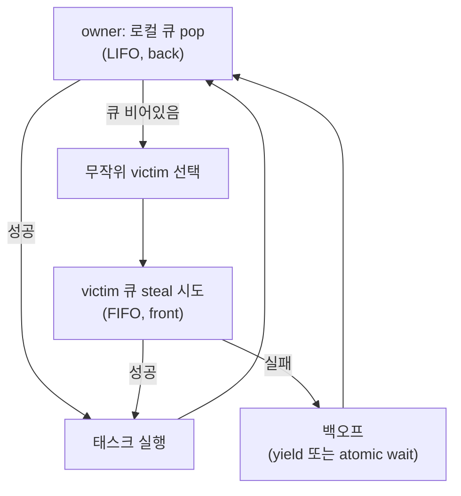

**스레드 풀 최적화**란 작업(task)마다 스레드를 새로 만들고 없애는 대신 미리 띄워 둔 워커 스레드 집합을 재사용하면서, 그 워커들에게 일감을 나눠 주는 큐 구조 자체의 경합(contention)을 줄이는 설계 문제를 말합니다. 스레드 생성 비용을 없애는 것만으로는 충분하지 않은데, 워커가 여러 개일 때 "누가 다음 작업을 가져갈지"를 정하는 큐가 새로운 병목이 되기 때문입니다. 이 장은 단일 큐가 왜 스레드 수에 비례해 느려지는지, 그리고 **워크 스틸링(work-stealing)** — 각 워커가 자기 큐를 갖고 비었을 때만 다른 워커의 큐를 훔치는 방식 — 이 그 병목을 어떻게 완화하는지를 다룹니다.

## 이 장을 읽기 전에

이 장은 [동기화 비용 정량 분석](/post/concurrency-optimization/synchronization-primitive-cost-analysis/)에서 다룬 mutex의 contended 비용과 futex 개입 시점, [False Sharing 탐지와 회피](/post/concurrency-optimization/false-sharing-detection-avoidance/)에서 다룬 캐시 라인 공유 문제를 이미 안다고 전제합니다. 코드에서는 [C++20 jthread와 stop_token](/post/concurrency-optimization/cpp20-jthread-stop-token-cooperative-cancellation/)의 협력적 취소 API를 그대로 사용하므로, 그 문법을 처음 보는 독자는 해당 장을 먼저 참고하는 것이 좋습니다.

**이 장의 깊이**: 중급입니다. 스레드 풀의 큐 아키텍처와 work-stealing 알고리즘의 동작 원리, victim 선택과 로드 밸런싱 정책을 실제로 컴파일되는 코드로 다룹니다. **다루지 않는 것**: 완전히 락 없는 Chase-Lev deque의 CAS·메모리 순서 증명 수준의 구현(뮤텍스로 단순화한 버전만 다루며, 완전한 lock-free 버전은 [Lock-free 자료구조 구현](/post/concurrency-optimization/lock-free-queue-stack-hashmap/)의 패턴을 그대로 적용), 코루틴 기반 스케줄러(다음 장), C++26 `std::execution`·Executors 추상화([Executors 기초](/post/concurrency-optimization/cpp-executors-fundamentals/), [C++26 std::execution](/post/concurrency-optimization/cpp26-std-execution-senders-receivers/)), NUMA를 겨냥한 thread-per-core 설계([thread-per-core 아키텍처](/post/concurrency-optimization/thread-per-core-io-uring-single-issuer/))입니다.

## 당신의 수준에 맞는 경로

| 수준 | 읽을 부분 | 핵심 목표 |
|------|---------|---------|
| **초보자** | "역사와 배경" ~ "Work-Stealing 알고리즘의 동작 원리" | 단일 큐 경합이 왜 병목인지, work stealing이 이를 어떻게 완화하는지 이해 |
| **중급자** | "로드 밸런싱" ~ "측정: 큐 구조에 따른 처리량 비교" | victim 선택·태스크 세분화·백오프를 실제 구현에 반영 |
| **전문가** | "판단 기준" ~ "비판적 시각" | 자체 구현 대신 성숙한 라이브러리를 쓸 시점과 그 한계 판단 |

---

## 역사와 배경

**Work-stealing**의 이론적 기초는 1999년 Robert Blumofe와 Charles Leiserson이 Cilk 런타임을 분석하며 정립했습니다. 이들은 완전 엄격(fully strict)한 다중스레드 계산을 무작위 work-stealing으로 스케줄링하면 기대 실행시간이 $T_p \le T_1/p + O(T_\infty)$ 를 만족함을 [증명했는데](https://www.csd.uwo.ca/~mmorenom/CS433-CS9624/Resources/Scheduling_multithreaded_computations_by_work_stealing.pdf), 여기서 $T_1$은 전체 순차 작업량, $T_\infty$는 의존성 사슬의 임계 경로(critical path) 길이, $p$는 프로세서 수입니다. 이 bound는 "프로세서를 늘릴수록 거의 선형으로 빨라지되, 오버헤드는 병렬성 자체가 아니라 작업의 의존 구조에 의해서만 제한된다"는 것을 뜻하며, 이후 Cilk++·Intel TBB·.NET TPL·Java `ForkJoinPool`·Rust `rayon` 같은 실전 스케줄러 설계의 근거가 되었습니다.

구체적인 자료구조는 2005년 Danny Hendler·Yossi Lev·Doug Lea 등의 계보를 거쳐 David Chase와 Yossi Lev가 제안한 **원형 배열 기반 growable deque**로 정착했습니다. 이 deque는 소유 스레드가 한쪽 끝에서 push/pop하고 다른 스레드들은 반대쪽 끝에서만 steal하도록 설계해, 소유 스레드의 일반적인 push/pop이 대부분 동기화 없이 끝나도록 만듭니다. 다만 이 최적화는 x86의 강한 메모리 모델을 암묵적으로 가정한 원래 논문 그대로는 ARM·POWER 같은 약한 메모리 모델에서 깨질 수 있었고, 2013년 Lê·Pop·Cohen·Zappa Nardelli의 [PPoPP 논문](https://fzn.fr/readings/ppopp13.pdf)이 POWER·ARM 위에서 Chase-Lev deque의 최적화된 구현이 실제로 올바름을 처음 증명하며 C++11 `memory_order`만으로 이식 가능한 버전을 함께 제시했습니다.

이 논문이 강조하는 요점은 이 장 전체에 걸쳐 반복됩니다. work-stealing deque는 "그럴듯해 보이는 CAS 코드"가 특정 아키텍처에서만 우연히 동작하기 쉬운 대표적인 자료구조이며, 메모리 순서를 잘못 완화하면 재현이 어려운 데이터 레이스가 생깁니다. 완전한 lock-free 버전의 CAS·acquire/release 조합은 [Lock-free 자료구조 구현](/post/concurrency-optimization/lock-free-queue-stack-hashmap/)에서 ThreadSanitizer 검증 절차와 함께 다루므로, 이 장에서는 뮤텍스로 단순화한 버전으로 아키텍처와 정책에 집중합니다.

## 스레드 풀 아키텍처: 큐 경합을 줄이는 구조

가장 단순한 스레드 풀은 워커 스레드 수와 무관하게 **작업 큐 하나**를 뮤텍스로 보호합니다. 태스크를 넣는 쪽도, 워커가 태스크를 꺼내는 쪽도 같은 락을 두고 경쟁하므로, 워커 수 $p$가 늘어날수록 이 큐 하나에 대한 경합 확률이 커집니다. [동기화 비용 정량 분석](/post/concurrency-optimization/synchronization-primitive-cost-analysis/)에서 다뤘듯 contended mutex는 futex 시스템 콜과 컨텍스트 스위치를 유발할 수 있고, 큐의 head/tail이 같은 캐시 라인에 있다면 [False Sharing](/post/concurrency-optimization/false-sharing-detection-avoidance/)까지 겹쳐 문제가 배가됩니다. 태스크가 굵고(coarse-grained) 개수가 적으면 이 단일 큐 설계로도 충분하지만, 태스크가 잘게 쪼개져 초당 수백만 건씩 오가는 워크로드에서는 큐 자체가 확장성의 상한선이 됩니다.

**work-stealing 아키텍처**는 이 병목을 구조적으로 없앱니다. 워커마다 자신의 **로컬 큐(deque)**를 갖고, 태스크를 만들면 자기 큐에 넣고 자기 큐에서 꺼내 실행하는 것이 기본 경로입니다. 이 경로는 다른 워커와 전혀 통신하지 않으므로 이상적인 경우 잠금 경합이 없습니다. 워커의 로컬 큐가 비었을 때만 다른 워커의 큐로 손을 뻗어 태스크 하나를 훔쳐 옵니다("steal"). 즉 경합이 발생하는 지점이 "모든 접근"에서 "로드 불균형이 생겼을 때의 steal 시도"로 좁혀지며, 이 좁혀진 지점만 동기화하면 되므로 워커 수가 늘어도 전체 처리량이 상대적으로 잘 유지됩니다.

아래는 로컬 큐를 뮤텍스로 보호한 단순화 버전입니다. 소유 스레드는 뒤쪽(`back`)에서 push/pop해 **LIFO** 순서를 갖고, 도둑(thief) 스레드는 앞쪽(`front`)에서만 steal해 **FIFO** 순서를 갖습니다. 완전한 lock-free 버전에서는 이 뮤텍스 자리를 `top`/`bottom` 인덱스에 대한 CAS와 `memory_order_acquire`/`release` 조합으로 대체하며, 그 구현은 [06장](/post/concurrency-optimization/lock-free-queue-stack-hashmap/)에서 다룹니다.

```cpp
#include <deque>
#include <mutex>
#include <optional>
#include <functional>

class WorkerQueue {
  std::mutex mtx_;
  std::deque<std::function<void()>> tasks_;

 public:
  // 소유 스레드 전용: 뒤쪽에 넣는다.
  void push(std::function<void()> f) {
    std::lock_guard<std::mutex> lk(mtx_);
    tasks_.push_back(std::move(f));
  }

  // 소유 스레드 전용: 뒤쪽에서 꺼낸다 (LIFO).
  std::optional<std::function<void()>> pop() {
    std::lock_guard<std::mutex> lk(mtx_);
    if (tasks_.empty()) return std::nullopt;
    auto f = std::move(tasks_.back());
    tasks_.pop_back();
    return f;
  }

  // 도둑 스레드 전용: 앞쪽에서 훔친다 (FIFO).
  std::optional<std::function<void()>> steal() {
    std::lock_guard<std::mutex> lk(mtx_);
    if (tasks_.empty()) return std::nullopt;
    auto f = std::move(tasks_.front());
    tasks_.pop_front();
    return f;
  }
};
```

이 버전은 각 `WorkerQueue`가 독립된 뮤텍스를 가지므로 경합이 "그 큐의 소유자와 그 순간의 도둑"으로만 국한되고, 워커가 늘어도 서로 다른 큐끼리는 전혀 잠금을 공유하지 않습니다. 다만 뮤텍스 기반이라 steal이 잦은 워크로드에서는 여전히 락 획득 비용이 남으므로, 이 구조가 병목으로 확인되면 06장의 CAS 기반 버전으로 교체하는 것을 고려합니다.

## Work-Stealing 알고리즘의 동작 원리

owner가 **LIFO**로 자기 큐를 다루는 이유는 캐시 지역성 때문입니다. 재귀적으로 태스크를 분할하는 fork-join 패턴(divide-and-conquer)에서는 방금 만든 자식 태스크가 부모보다 먼저 실행되는 것이 데이터·명령 캐시 상태를 가장 최근 워킹 셋에 맞춰 두는 자연스러운 순서이고, 이는 순차 실행(depth-first)에 가장 가까운 실행 순서이기도 합니다. 반대로 도둑이 **FIFO**로 상대의 큐 반대쪽 끝에서 훔치는 이유는 두 가지입니다. 첫째, owner가 방금 접근한 끝과 반대쪽을 노리므로 CAS 경합 지점이 자연스럽게 분리됩니다. 둘째, FIFO로 훔치면 대개 트리의 상위(더 굵은 단위) 태스크를 가져오게 되어, 한 번의 steal로 상대적으로 오래 실행되는 작업을 얻고 steal 시도 빈도 자체를 줄일 수 있습니다.

아래 스레드 풀은 `std::jthread`와 `std::stop_token`([13장](/post/concurrency-optimization/cpp20-jthread-stop-token-cooperative-cancellation/) 참고)으로 협력적 종료를 구현하고, 로컬 큐가 비면 무작위로 고른 다른 워커의 큐를 훔칩니다(`g++ -std=c++20 -pthread`, GCC 11 이상에서 `std::jthread`/`std::stop_token` 지원).

```cpp
#include <vector>
#include <thread>
#include <random>
#include <atomic>

class ThreadPool {
  std::vector<WorkerQueue> queues_;
  std::vector<std::jthread> workers_;

  void run(std::stop_token st, std::size_t idx) {
    std::mt19937 rng(static_cast<unsigned>(idx) + 1);
    while (!st.stop_requested()) {
      if (auto t = queues_[idx].pop()) { (*t)(); continue; }
      std::size_t n = queues_.size();
      std::size_t victim = rng() % n;
      if (victim != idx) {
        if (auto t = queues_[victim].steal()) { (*t)(); continue; }
      }
      std::this_thread::yield();  // 09장 atomic wait/notify로 대체 가능
    }
  }

 public:
  explicit ThreadPool(std::size_t n) : queues_(n) {
    for (std::size_t i = 0; i < n; ++i)
      workers_.emplace_back([this, i](std::stop_token st) { run(st, i); });
  }

  void submit(std::size_t hint, std::function<void()> f) {
    queues_[hint % queues_.size()].push(std::move(f));
  }
};
```

`std::this_thread::yield()`는 실패한 steal 사이 CPU를 계속 태우므로, 실제 배포 코드에서는 [C++20 Atomics 실전](/post/concurrency-optimization/cpp20-atomic-wait-notify/)의 `atomic::wait`/`notify_one`이나 [Condition Variable 성능 패턴](/post/concurrency-optimization/condition-variable-performance-patterns/)에서 다루는 스퓨리어스 웨이크업 대응 조건변수로 대체해, 모든 큐가 연속으로 비어 있을 때만 실제로 잠들도록 합니다. `submit`이 받는 `hint`는 호출자가 어느 로컬 큐에 처음 넣을지 정하는 인자로, 보통 라운드로빈 카운터나 호출한 워커 자신의 인덱스를 씁니다.



## 로드 밸런싱: victim 선택과 태스크 세분화

**victim 선택 정책**은 work-stealing의 실제 확장성을 좌우합니다. 무작위 선택은 모든 도둑이 우연히 같은 바쁜 워커에 몰리는 상황을 확률적으로 피하게 해 주며, 워커 수가 적당할 때(수십 개 이하) 구현이 단순하고 이론적 bound와도 잘 맞습니다. 라운드로빈처럼 결정적인 순서로 victim을 고르면 여러 도둑이 같은 주기로 같은 워커를 노리는 위상 동조(phase correlation)가 생겨, 특정 순간에만 몰리는 편향된 경합 패턴이 나타날 수 있습니다. 워커 수가 수백 개로 늘어나거나 멀티소켓 NUMA 환경이 되면 무작위 선택도 한계가 있는데, 소켓을 건너뛴 steal은 로컬 소켓 내 steal보다 캐시 코히런시·인터커넥트 비용이 훨씬 크기 때문입니다. [oneTBB](https://oneapi-spec.uxlfoundation.org/specifications/oneapi/v1.3-rev-1/elements/onetbb/source/task_scheduler)와 [Taskflow](https://taskflow.github.io/taskflow/icpads20.pdf) 같은 성숙한 스케줄러는 이 문제를 계층적·토폴로지 인지 victim 선택으로 완화하며, 소켓 간 배치까지 고려한 설계는 [thread-per-core 아키텍처](/post/concurrency-optimization/thread-per-core-io-uring-single-issuer/)에서 더 다룹니다.

oneTBB의 task_arena 문서에 따르면 스레드는 태스크를 완료할 때까지 그 태스크에 바인딩되며, 대기 중에는 자신이나 다른 스레드가 만든 무관한 태스크를 대신 실행할 수 있습니다.

> "Once a thread starts running a task, the task is bound to that thread until completion." — oneAPI Specification, *Task Scheduler* (oneTBB) 문서 (WebFetch로 원문 대조).

**태스크 세분화(granularity)**는 Blumofe-Leiserson bound의 $O(T_\infty)$ 항을 실제로 얼마나 작게 만들 수 있는지를 결정합니다. 태스크를 지나치게 잘게 쪼개면 push/pop/steal 자체의 원자적 연산·캐시 라인 접근 오버헤드가 태스크의 실제 작업량을 압도해 버리고, 반대로 너무 굵게 나누면 워커 간 부하 차이가 커져 일부 워커가 놀게 됩니다. 실무에서는 재귀 분할에 컷오프(예: 원소 수가 임계값 이하이면 더 이상 쪼개지 않고 순차 실행)를 두어 이 균형을 맞추고, steal 실패가 반복될 때는 즉시 재시도하는 대신 지수 백오프를 두어 실패한 CAS/락 시도가 캐시 라인 핑퐁을 계속 일으키지 않도록 합니다.

**측정: 큐 구조에 따른 처리량 비교.** 아래는 단일 글로벌 뮤텍스 큐 풀과 로컬 큐+work-stealing 풀에 동일한 수의 작은 태스크를 제출해 처리량을 비교하는 Google Benchmark 골격입니다. 실제 배율은 플랫폼·컴파일러·`-O` 플래그·워커 수·태스크 크기에 따라 크게 달라지므로, 아래 골격을 자신의 환경에서 직접 실행해 확인하는 것을 전제로 합니다.

```cpp
#include <benchmark/benchmark.h>
#include <vector>
#include <mutex>
#include <deque>
#include <functional>
#include <thread>
#include <atomic>

// GlobalQueuePool, StealingPool은 submit(f)와 wait_idle()을 제공한다고 가정.
// (GlobalQueuePool: mutex 하나로 보호되는 단일 std::deque<std::function<void()>>)
// (StealingPool: 본문의 ThreadPool + WorkerQueue)

static void BM_GlobalQueuePool(benchmark::State& state) {
  GlobalQueuePool pool(state.range(0));
  for (auto _ : state) {
    std::atomic<int> done{0};
    for (int i = 0; i < 100000; ++i)
      pool.submit([&done] { done.fetch_add(1, std::memory_order_relaxed); });
    while (done.load(std::memory_order_relaxed) < 100000) std::this_thread::yield();
  }
}
BENCHMARK(BM_GlobalQueuePool)->Arg(4)->Arg(8)->Arg(16);

static void BM_StealingPool(benchmark::State& state) {
  StealingPool pool(state.range(0));
  for (auto _ : state) {
    std::atomic<int> done{0};
    for (int i = 0; i < 100000; ++i)
      pool.submit(i, [&done] { done.fetch_add(1, std::memory_order_relaxed); });
    while (done.load(std::memory_order_relaxed) < 100000) std::this_thread::yield();
  }
}
BENCHMARK(BM_StealingPool)->Arg(4)->Arg(8)->Arg(16);

BENCHMARK_MAIN();
```

`g++ -O2 -std=c++20 -pthread bench.cpp -lbenchmark -lpthread`로 빌드하면, 워커 수가 늘어날수록 `BM_GlobalQueuePool`의 반복당 시간이 `BM_StealingPool`보다 상대적으로 더 가파르게 증가하는 경향을 흔히 관찰할 수 있습니다 — 차이는 단일 큐에 대한 락 경합이 워커 수에 비례해 커지는 반면, 로컬 큐 설계는 그 경합을 대부분 없애기 때문입니다. 다만 태스크 하나의 실행 시간이 매우 짧으면(위 예시의 `fetch_add` 정도) steal·큐 접근 오버헤드 자체가 지배항이 될 수 있으므로, 실제 워크로드의 태스크 크기로 다시 측정하는 것이 중요합니다.

## 흔한 오개념

**"워커 스레드 수를 늘리면 처리량이 계속 오른다"**는 CPU-bound 워크로드에서는 대체로 틀립니다. 물리 코어 수를 넘어서면 컨텍스트 스위치와 캐시 축출이 늘고, 로컬 큐 수가 늘어난 만큼 steal 대상 후보도 늘어 victim 탐색 비용이 커집니다. 보통 `std::thread::hardware_concurrency()` 근처에서 처리량이 정체하거나 오히려 떨어지므로, 스레드 수는 하이퍼파라미터로 두고 직접 스윕해 확인합니다.

**"단일 글로벌 큐는 항상 나쁘고 work-stealing이 항상 낫다"**는 조건부로만 맞습니다. 태스크 수가 적고 각 태스크의 실행 시간이 충분히 길면(예: 태스크당 수백 마이크로초 이상) 락 경합 자체가 발생할 기회가 적어, 단순한 단일 큐 풀이 구현·디버깅 비용 대비 성능 차이가 미미할 수 있습니다. work-stealing의 이득은 태스크가 잘게 쪼개져 개수가 많을 때 뚜렷해지므로, 도입 전에 태스크 크기 분포를 먼저 확인하는 것이 순서입니다.

**"work-stealing은 로드 밸런싱을 공짜로 해결해 준다"**는 틀렸습니다. steal 시도 자체가 원자적 연산과 캐시 라인 접근을 유발하고, 실패한 steal이 반복되면 그 오버헤드만 쌓입니다. 태스크가 극단적으로 작을 때는 steal 비용이 태스크 실행 비용을 넘어서 오히려 단일 큐보다 느려질 수 있으므로, 컷오프와 백오프 정책 없이 무조건 세분화하는 것은 위험합니다.

## 판단 기준

| 상황 | 권장 | 비권장 |
|------|------|--------|
| 태스크 수 적고 실행 시간 김(coarse-grained) | 단순 글로벌 큐 + 뮤텍스 | 불필요하게 복잡한 work-stealing 구현 |
| fine-grained 재귀 분할정복(fork-join) | 로컬 큐 + work-stealing | 단일 글로벌 큐 |
| 프로덕션에 바로 검증된 스케줄러가 필요 | oneTBB task_arena, Taskflow Executor | 자체 CAS deque를 처음부터 구현 |
| 다중 소켓 NUMA, 코어 수 매우 많음 | 계층적·토폴로지 인지 victim 선택([21장](/post/concurrency-optimization/thread-per-core-io-uring-single-issuer/)) | 전역 균일 무작위 스틸링만 사용 |
| steal 실패가 잦고 idle 대기가 필요 | [09장](/post/concurrency-optimization/cpp20-atomic-wait-notify/) atomic wait/notify 또는 [19장](/post/concurrency-optimization/condition-variable-performance-patterns/) 조건변수 기반 백오프 | 무한 busy-yield 스핀 |

## 비판적 시각: 한계와 트레이드오프

직접 구현한 lock-free work-stealing deque는 미묘한 메모리 순서 버그를 낳기 쉬운 대표적인 자료구조입니다. Lê 등의 PPoPP'13 논문 자체가 기존 구현들의 약한 메모리 모델 취약점을 지적하며 나온 결과이므로, 프로덕션에서는 검증된 라이브러리를 우선 검토하고 직접 구현이 불가피하다면 [06장](/post/concurrency-optimization/lock-free-queue-stack-hashmap/)의 ThreadSanitizer 절차를 반드시 거칩니다. owner의 LIFO 로컬 팝은 캐시 지역성에는 유리하지만, 오래 대기하는 태스크의 실행 순서 공정성을 일부 포기하는 트레이드오프이기도 합니다 — 도둑이 전혀 없거나(워커 1개) 극단적으로 불균형한 워크로드에서는 이 트레이드오프가 실제 기아(starvation)로 이어질 수 있습니다. 또한 무작위 victim 선택은 워커 수가 매우 많아지거나 NUMA 토폴로지가 개입하면 성능이 흔들리므로, oneTBB·Taskflow 수준의 계층적 정책 없이 직접 구현한 무작위 스틸링을 대규모로 확장하는 것은 신중해야 합니다. 마지막으로 work-stealing은 만능이 아니어서, 태스크 실행 시간 분산이 극단적으로 크거나 특정 순서 보장이 필요한 워크로드에서는 우선순위 큐나 배치 스케줄링 같은 다른 구조가 더 적합할 수 있습니다.

## 마무리

- [ ] 단일 글로벌 큐가 워커 수에 비례해 경합 병목이 되는 이유를 설명할 수 있다.
- [ ] 로컬 큐 + work-stealing 구조가 경합 지점을 어떻게 좁히는지 설명할 수 있다.
- [ ] owner의 LIFO pop과 도둑의 FIFO steal이 각각 왜 그렇게 설계되었는지 말할 수 있다.
- [ ] 무작위 victim 선택과 라운드로빈의 차이, NUMA에서의 한계를 안다.
- [ ] 태스크 세분화·백오프가 없을 때 work-stealing이 오히려 손해가 되는 조건을 안다.
- [ ] 언제 자체 구현 대신 oneTBB·Taskflow 같은 성숙한 스케줄러를 선택해야 하는지 판단할 수 있다.

**이전 장**: [C++20 Atomics 실전](/post/concurrency-optimization/cpp20-atomic-wait-notify/) (챕터 09)

**다음 장에서는** 코루틴 기반 동시성 패턴을 다룹니다. 스레드 풀이 "누가 실행하는가"의 문제였다면, 코루틴은 "실행을 어떻게 중단·재개하는가"의 문제이며, 이 장에서 다룬 워커·스케줄러 위에 코루틴 태스크를 올리는 방식(코루틴 프레임을 태스크로 감싸 스레드 풀에 제출하는 패턴)으로 자연스럽게 이어집니다.

→ [코루틴 기반 동시성 패턴](/post/concurrency-optimization/coroutine-based-concurrency-patterns/) (챕터 11)
