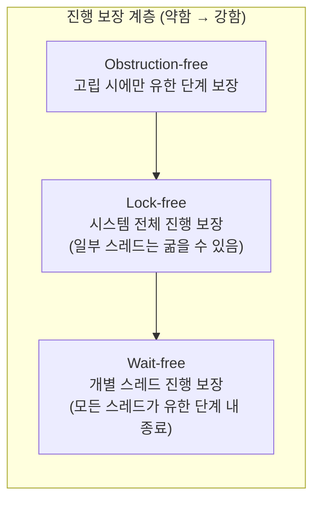

**Wait-free 프로그래밍**이란 공유 자료구조에 접근하는 **모든 스레드**가 다른 스레드의 스케줄링이나 실패와 무관하게 **유한한 단계 수 안에** 자신의 연산을 끝마치도록 보장하는 동시성 설계 기법을 말합니다. 이전 장들에서 다룬 lock-free 설계([05장](/post/concurrency-optimization/lock-free-design-fundamentals/), [06장](/post/concurrency-optimization/lock-free-queue-stack-hashmap/))는 "시스템 전체로는 누군가 진행한다"만 보장할 뿐, 특정 스레드 하나가 계속 손해를 보다 굶는 상황을 막지는 못합니다. 인터럽트 핸들러, 하드 리얼타임 오디오 콜백, 항공전자 소프트웨어처럼 "이 스레드가 유한 시간 안에 끝난다"는 보장 자체가 정확성 요구사항인 영역에서는 lock-free만으로 부족하고, 진행 보장의 다음 단계인 wait-free가 필요해집니다. 이 장은 그 경계가 왜 존재하는지, 왜 wait-free 알고리즘을 설계하기가 유독 어려운지, 그리고 실무에서 이 보장을 언제 실제로 추구해야 하는지를 다룹니다.

## 이 장을 읽기 전에

이 장은 [01장: 동기화 비용 정량 분석](/post/concurrency-optimization/synchronization-primitive-cost-analysis/)에서 다룬 경합 비용 개념과, [05장: Lock-free 설계 기초](/post/concurrency-optimization/lock-free-design-fundamentals/)·[06장: Lock-free 자료구조 구현](/post/concurrency-optimization/lock-free-queue-stack-hashmap/)에서 다룬 CAS 기반 lock-free 패턴을 전제로 합니다. "lock을 쓰지 않는다"와 "진행이 보장된다"가 서로 다른 축의 문제라는 것을 이미 알고 있다면 바로 진입할 수 있습니다. 이 장의 깊이는 **전문가** 구간에 집중되어 있습니다 — 진행 보장의 이론적 계층(obstruction-free/lock-free/wait-free), 이 계층이 왜 존재하는지에 대한 소비자 이론(consensus number), wait-free 알고리즘을 실제로 만드는 helping 메커니즘의 원리, 그리고 언제 이 복잡도를 감수할 가치가 있는지를 다룹니다. **다루지 않는 것**: 구체적인 wait-free 큐·스택 구현 코드 전체(→ [06장](/post/concurrency-optimization/lock-free-queue-stack-hashmap/)), hazard pointer·RCU의 메모리 회수 메커니즘 세부(→ [07장](/post/concurrency-optimization/hazard-pointer-rcu-cpp26/)), SPSC/MPMC 링버퍼의 구현 디테일(→ [08장](/post/concurrency-optimization/spsc-mpmc-ring-buffer-queues/)), C++20/26 atomic API 사용법(→ [09장](/post/concurrency-optimization/cpp20-atomic-wait-notify/))입니다.

## 당신의 수준에 맞는 경로

| 수준 | 읽을 부분 | 핵심 목표 |
|------|---------|---------|
| **중급자** | "진행 보장의 기원" ~ "세 단계 진행 보장" | obstruction-free/lock-free/wait-free의 정의 차이를 구분한다 |
| **전문가** | "wait-free를 만드는 메커니즘" ~ "판단 기준" | helping 메커니즘의 동작 원리를 이해하고 실제 적용 여부를 판단한다 |
| **아키텍트** | "비판적 시각" | wait-free 도입의 실질적 비용과 대안(실무적 lock-free)을 저울질한다 |

---

## 진행 보장의 기원: Herlihy와 consensus 계층 (역사·배경)

진행 보장이라는 개념은 1991년 Maurice Herlihy가 *ACM Transactions on Programming Languages and Systems*에 발표한 "Wait-Free Synchronization" 논문([Herlihy, 1991](https://cs.brown.edu/~mph/Herlihy91/p124-herlihy.pdf))에서 정식화되었습니다. 이 논문은 단순히 "락 없이 구현하는 법"을 다룬 것이 아니라, 공유 메모리 객체 타입들 사이에 **동기화 능력의 서열**이 존재한다는 것을 증명했습니다. 이를 **consensus number**라 부르는데, 어떤 타입이 원자 레지스터와 함께 몇 개의 프로세스까지 wait-free하게 합의(consensus)를 풀어낼 수 있는지를 나타내는 값입니다. 읽기/쓰기 레지스터의 consensus number는 1, test-and-set·swap·fetch-and-add·큐·스택은 2, 그리고 **compare-and-swap(CAS)**은 무한대입니다. CAS가 무한대라는 것은 CAS와 레지스터만으로 임의 개수의 스레드에 대해 어떤 객체든 wait-free하게 구현하는 **universal construction**이 이론적으로 가능하다는 뜻이며, 오늘날 대부분의 CPU가 CAS(또는 LL/SC)를 하드웨어로 제공하는 이유이기도 합니다. 반대로 fetch-and-add나 큐 같은 consensus number 2 타입만으로는 3개 이상 프로세스의 wait-free 합의를 풀 수 없다는 것도 같은 이론에서 나온 결과입니다.

이 계층 이론이 중요한 이유는, "이 자료구조를 wait-free하게 만들 수 있는가"라는 질문이 순전히 구현 실력의 문제가 아니라 **어떤 원자적 연산을 하드웨어가 제공하는가**에 달린 이론적 한계의 문제이기도 하다는 점을 알려주기 때문입니다. CAS 없이 순수 load/store만 가진 하드웨어에서는 애초에 임의 스레드 수의 wait-free 합의가 불가능합니다.

## 세 단계 진행 보장

동시성 알고리즘의 진행 보장은 강도가 다른 세 단계로 나뉩니다. **Obstruction-free**는 "다른 스레드의 간섭이 없는 상태로 고립되어 실행되면 유한 단계 안에 끝난다"만 보장합니다 — 실행 중인 스레드가 방해를 받으면 처음부터 재시작해도 되므로, 여러 스레드가 계속 서로를 방해하면 아무도 못 끝나는 **라이브락**이 이론상 가능합니다. **Lock-free**는 그보다 강해서 "무한히 오래 실행하면 시스템에 있는 스레드 중 **적어도 하나**는 반드시 진행한다"를 보장합니다. 개별 스레드가 CAS 경쟁에서 계속 지면서 굶는 것은 lock-free 정의를 위반하지 않습니다 — 시스템 전체 처리량은 보장되기 때문입니다. **Wait-free**는 여기서 한 걸음 더 나가 "**모든** 연산이, 다른 스레드가 몇 개든 무엇을 하든, 유한하게 정해진 단계 수 안에 끝난다"를 보장합니다. 이 세 정의의 차이는 "시스템이 멈추지 않는다"(lock-free)와 "내가 멈추지 않는다"(wait-free)의 차이로 요약할 수 있습니다.



실무에서 자주 놓치는 지점은, 위 세 단계가 **상호 배타적이지 않고 포함 관계**라는 것입니다. Wait-free 알고리즘은 자동으로 lock-free이기도 하고 obstruction-free이기도 합니다(더 강한 보장이 약한 보장을 함의). 반대로 lock-free라고 표시된 알고리즘을 wait-free로 오해하면, 굶는 스레드가 실제로 나타났을 때 "이론적으로 불가능한 버그"를 찾아 헤매게 됩니다.

## Wait-free를 만드는 메커니즘: helping과 fast-path-slow-path

Wait-free 알고리즘을 어렵게 만드는 근본 원인은, 어떤 스레드 A가 아무리 운이 나빠도 유한 단계 안에 끝나야 한다는 요구를 만족시키려면 **다른 스레드가 A를 대신 도와줘야 하는 경우**가 생긴다는 데 있습니다. 이를 **helping(도움) 메커니즘**이라 부릅니다. 개념적으로는, 스레드가 자신이 하려는 연산을 공유 배열(흔히 announce array라 부릅니다)에 먼저 기록하고, 그 연산에 접근하는 다른 어떤 스레드든 진행 중에 이 배열을 확인해 아직 완료되지 않은 연산을 자기 것처럼 대신 실행해 주는 방식입니다. A가 CAS 경쟁에서 백만 번 지더라도, 경쟁에서 이긴 스레드 중 하나가 결국 A의 연산을 대신 끝내주기 때문에 A는 유한 단계 안에 자신의 결과를 얻습니다.

문제는 이 helping 메커니즘 자체가 비용입니다 — 모든 스레드가 매 연산마다 다른 스레드의 미완료 작업이 있는지 확인하고 대신 실행할 준비를 해야 하므로, 무경합 상황에서도 오버헤드가 붙습니다. Alex Kogan과 Erez Petrank는 2011년 PPoPP에서 실용적인 wait-free 큐를 제시했고, 이어 2012년 논문에서 이를 일반화한 **fast-path-slow-path** 방법론을 제안했습니다([Kogan & Petrank, 2012](https://csaws.cs.technion.ac.il/~erez/Papers/wf-methodology-ppopp12.pdf)). 핵심 아이디어는 평소에는 가볍고 빠른 lock-free 경로(fast path)를 반복 시도하다가, 정해진 횟수 이상 실패한 스레드에게만 helping을 적용하는 느린 경로(slow path)로 전환해 wait-free를 보장하는 것입니다. 이렇게 하면 무경합·저경합 상황의 평균 비용은 순수 lock-free에 가깝게 유지하면서, 고경합 상황에서도 개별 스레드의 종료를 보장할 수 있습니다.

아래 코드는 이 helping 없이도 wait-free가 "공짜로" 성립하는 가장 흔한 경우와, 반대로 lock-free에 그치는 CAS 재시도 패턴을 대조한 것입니다. 사람들이 "재시도가 무한 루프는 아니니까 결국 wait-free 아니냐"고 착각하기 쉬운 지점이라 나란히 두고 비교합니다.

```cpp
#include <atomic>

// (A) 흔한 오해: 아래 CAS 루프는 wait-free가 아니라 lock-free다.
// 다른 스레드가 계속 compare_exchange_weak에 성공하면, 이 스레드는
// old_value를 갱신받아 재시도하기를 이론상 무한히 반복할 수 있다.
// 재시도 횟수에 상한이 없으므로 "유한 단계 보장"을 만족하지 못한다.
void atomic_update_max(std::atomic<long>& target, long value) {
  long old_value = target.load(std::memory_order_relaxed);
  while (old_value < value &&
         !target.compare_exchange_weak(old_value, value,
                                        std::memory_order_relaxed)) {
    // 실패 시 old_value가 최신값으로 자동 갱신되어 루프가 반복된다.
  }
}

// (B) 대조: fetch_add는 재시도 루프가 아예 없다.
// 하드웨어가 원자적 RMW 명령(x86 LOCK XADD, ARMv8.1 LDADD 등)을 제공하면
// 호출당 실행 단계 수가 다른 스레드의 스케줄링과 무관하게 고정되므로
// 사실상 wait-free다. 단, target.is_lock_free()가 false인 구현정의 환경
// (하드웨어가 해당 폭의 원자 RMW를 지원하지 않아 라이브러리가 내부 락으로
// 에뮬레이션하는 경우)에서는 이 보장이 사라진다.
long wait_free_increment(std::atomic<long>& counter) {
  return counter.fetch_add(1, std::memory_order_relaxed);
}
```

(A)와 (B)는 둘 다 "락을 쓰지 않는다"는 점에서는 같지만, 진행 보장의 강도가 다릅니다. 실무에서는 `is_lock_free()`(더 정확히는 C++17의 `is_always_lock_free`)로 컴파일 타임에 하드웨어 지원 여부를 확인하는 것이 첫 단계이고, 그 다음에는 해당 연산이 재시도 루프를 포함하는지(→ lock-free 상한) 아니면 단일 원자 명령으로 끝나는지(→ wait-free에 가까움)를 코드 수준에서 구분해야 합니다.

두 패턴의 진행 보장 차이는 결국 경합이 심해졌을 때의 꼬리 지연시간 차이로 드러납니다. 이를 격리 측정하려면 아래와 같은 스켈레톤으로 스레드 수를 늘려가며 p50/p99를 비교합니다.

```cpp
#include <benchmark/benchmark.h>
#include <atomic>
#include <thread>

static std::atomic<long> g_counter{0};
static std::atomic<long> g_max{0};

static void BM_WaitFreeFetchAdd(benchmark::State& state) {
  for (auto _ : state) {
    benchmark::DoNotOptimize(g_counter.fetch_add(1, std::memory_order_relaxed));
  }
}
BENCHMARK(BM_WaitFreeFetchAdd)->Threads(8)->Threads(32);

static void BM_LockFreeCasMaxLoop(benchmark::State& state) {
  long v = 0;
  for (auto _ : state) {
    v = (v + 1) % 1000;
    long old_value = g_max.load(std::memory_order_relaxed);
    while (old_value < v &&
           !g_max.compare_exchange_weak(old_value, v, std::memory_order_relaxed)) {
    }
  }
}
BENCHMARK(BM_LockFreeCasMaxLoop)->Threads(8)->Threads(32);

BENCHMARK_MAIN();
```

`g++ -std=c++20 -O2 bench.cpp -lbenchmark -lpthread` (x86-64, GCC 13 기준 예시)로 빌드해 스레드 수를 늘려가며 실행하면, 스레드 수가 적을 때는 두 방식의 평균 지연시간 차이가 크지 않지만, 스레드 수가 늘어 CAS 경쟁이 심해질수록 `BM_LockFreeCasMaxLoop`의 **p99 꼬리 지연**이 `BM_WaitFreeFetchAdd`보다 상대적으로 크게 벌어지는 경향이 흔합니다 — 정확한 배율은 코어 수·캐시 토폴로지·컴파일러에 따라 달라지므로 대상 플랫폼에서 직접 재현해 확인해야 합니다. `-fsanitize=thread`(TSan) 빌드는 이 두 함수의 **데이터 레이스 유무**를 검증하는 데는 유용하지만, "유한 단계로 끝나는가"라는 **진행 보장 자체**는 검증하지 못한다는 점에 주의해야 합니다 — TSan은 실행된 한 번의 스케줄을 관찰할 뿐, 적대적 스케줄러가 만들 수 있는 최악의 경우를 증명하지 않습니다.

## 흔한 오개념

**"lock-free면 자동으로 wait-free다"**는 틀렸습니다. lock-free는 시스템 전체 진행만 보장하고 개별 스레드의 종료는 보장하지 않습니다. 06장에서 다룬 lock-free 큐·스택 구현 대부분은 wait-free가 아니라 lock-free입니다 — CAS 경쟁에서 계속 밀리는 스레드가 이론상 존재할 수 있기 때문입니다.

**"재시도 루프에 무한 루프 방지 코드가 없으니 사실상 wait-free다"**도 틀렸습니다. 코드에 `while(true)` 같은 명시적 무한 루프가 없어도, 재시도 **횟수에 상한이 없다**면 진행 보장 관점에서는 여전히 lock-free일 뿐입니다. 실제로 재시도가 수백만 번씩 이어지는 경우는 드물지만, "드물다"는 확률적 관찰이지 wait-free가 요구하는 결정론적 상한이 아닙니다.

**"wait-free 알고리즘이 항상 더 빠르다"**도 흔한 착각입니다. wait-free는 최악의 경우(worst case)에 대한 상한을 보장하는 것이지, 평균적인 경우(average case)의 성능을 개선하는 것이 아닙니다. helping 메커니즘의 오버헤드 때문에 무경합 상황에서는 오히려 순수 lock-free보다 느릴 수 있습니다. Dan Alistarh 등의 연구([Alistarh et al., *Are Lock-Free Concurrent Algorithms Practically Wait-Free?*](https://www.microsoft.com/en-us/research/wp-content/uploads/2016/02/paper-18.pdf))는 저·중 정도의 경합과 충분한 코어 수를 가진 현실적인 조건에서는, 이론적으로 lock-free일 뿐인 알고리즘도 실질적인 응답 시간 분포가 wait-free 알고리즘과 크게 다르지 않을 수 있음을 보였습니다. 즉 "이론적 분류"와 "실무에서 체감하는 지연 분포"는 항상 일치하지 않습니다.

## 판단 기준: 언제 wait-free를 추구하는가

| 상황 | 권장 | 비권장 |
|------|------|--------|
| 인터럽트 핸들러·시그널 핸들러 내부 | wait-free 또는 애초에 락/재시도 없는 설계 | 재시도 루프가 있는 lock-free |
| 하드 리얼타임(항공전자, 의료기기, 오디오 콜백) | 결정론적 상한이 있는 wait-free 자료구조 | "대체로 빠른" lock-free만으로 대체 |
| 단일 생산자·단일 소비자 경로 | SPSC 링버퍼(설계상 경합이 없어 사실상 wait-free, [08장](/post/concurrency-optimization/spsc-mpmc-ring-buffer-queues/)) | 굳이 helping 메커니즘 도입 |
| 저경합 서버·백엔드 워크로드 | 검증된 lock-free 구조([06장](/post/concurrency-optimization/lock-free-queue-stack-hashmap/)) | 오버헤드가 큰 wait-free 커스텀 구현 |
| 읽기 위주 공유 상태 갱신 | RCU 읽기 경로(설계상 wait-free, [07장](/post/concurrency-optimization/hazard-pointer-rcu-cpp26/)) | 매 읽기마다 락 획득 |
| 단순 카운터·통계 누적 | 하드웨어 RMW 기반 연산(fetch_add 등, 사실상 wait-free) | CAS 재시도 루프로 직접 구현 |

이 표에서 "사실상 wait-free"라고 표기한 두 사례(SPSC 링버퍼, RCU 읽기 경로)는 특별한 이유가 있습니다. SPSC 링버퍼는 애초에 프로듀서와 컨슈머가 서로 다른 인덱스만 갱신하고 서로의 값을 CAS로 다투지 않도록 **설계 자체에서 경합을 제거**하기 때문에 helping 메커니즘 없이도 각 연산이 고정된 단계 수 안에 끝납니다. 리눅스 커널 RCU 설계 문서는 RCU가 제공할 수 있는 성질 중 하나로 실시간 용도의 wait-free 읽기 측 프리미티브를 명시적으로 언급합니다([Linux Kernel RCU Requirements](https://docs.kernel.org/RCU/Design/Requirements/Requirements.html)) — RCU 읽기 측이 갱신자를 기다리지 않고 고정된 비용으로 끝나도록 설계되었다는 뜻입니다. 두 경우 모두 알고리즘 발명이 아니라 **역할 분리를 통한 경합 자체의 제거**로 wait-free 성질을 얻었다는 공통점이 있습니다.

## 비판적 시각: 한계와 논란

Wait-free 알고리즘의 가장 큰 실무적 문제는 **복잡도 대비 이득의 불확실성**입니다. Kogan-Petrank류의 fast-path-slow-path 구현은 순수 lock-free 버전보다 코드량과 상태 공간이 늘어나고, 검증·디버깅 난이도가 함께 올라갑니다. 게다가 이론적으로 증명된 "유한 단계 상한"이 실무적으로 의미 있는 크기라는 보장은 없습니다 — 상한이 스레드 수에 비례해 커지는 알고리즘이라면, 스레드가 많은 시스템에서는 이론상 wait-free이지만 실제 지연시간은 순수 lock-free보다 나쁠 수 있습니다. 앞서 언급한 Alistarh 등의 연구가 지적하듯, 현실적인 경합·스케줄링 조건에서는 이 둘의 체감 성능 차이가 이론적 분류만큼 크지 않은 경우가 많아, "이론적으로 더 강한 보장"을 위해 복잡도를 감수할 가치가 있는지는 워크로드별로 따져야 합니다.

검증 측면에서도 wait-free는 lock-free보다 다루기 어렵습니다. TSan 같은 동적 분석 도구는 데이터 레이스를 잡아내지만, "모든 가능한 스케줄에서 유한 단계 안에 끝나는가"라는 진행 보장 자체는 증명하지 못합니다. 학계에서는 모델 체킹이나 수동 증명으로 wait-free 성질을 검증하지만, 이는 일반적인 팀의 코드 리뷰 프로세스에 편입되기 어려운 수준의 형식적 검증입니다. 결과적으로 실무에서 진짜 wait-free 알고리즘을 직접 설계·구현하는 사례는 드물고, 대신 이 장의 판단 기준 표처럼 "설계로 경합 자체를 제거"하거나 "하드웨어가 이미 wait-free하게 제공하는 원자 연산"을 그대로 활용하는 방식이 훨씬 흔합니다.

## 마무리

이 장을 읽은 후 다음을 확인할 수 있어야 합니다.

- [ ] lock-free(시스템 전체 진행)와 wait-free(개별 스레드 진행)의 정의 차이를 예시와 함께 설명할 수 있다.
- [ ] consensus number 개념이 왜 "이 타입으로 wait-free 구현이 가능한가"와 연결되는지 설명할 수 있다.
- [ ] helping 메커니즘과 fast-path-slow-path 방법론이 wait-free 보장을 어떻게 만들어내는지 설명할 수 있다.
- [ ] CAS 재시도 루프(lock-free)와 하드웨어 RMW 연산(사실상 wait-free)을 코드에서 구분할 수 있다.
- [ ] SPSC 링버퍼·RCU 읽기 경로가 "설계로 경합을 제거"해 wait-free를 얻는 사례임을 설명할 수 있다.
- [ ] 자신의 워크로드에서 wait-free를 추구할 가치가 있는지, 아니면 lock-free로 충분한지 판단 기준 표로 결정할 수 있다.

**이전 장**: [코루틴 기반 동시성 패턴](/post/concurrency-optimization/coroutine-based-concurrency-patterns/) (11장)에서는 코루틴으로 동시성을 표현하는 패턴을 다뤘습니다. 다음 장에서는 **std::jthread와 stop_token**을 다룹니다. C++20이 표준화한 협력적 취소 메커니즘이 스레드 생명주기 관리 비용을 어떻게 줄이는지, 그리고 이 장에서 다룬 "진행 보장"과는 별개로 "정상 종료 보장"을 어떻게 설계하는지를 정리합니다.

→ [std::jthread와 stop_token](/post/concurrency-optimization/cpp20-jthread-stop-token-cooperative-cancellation/) (13장)
