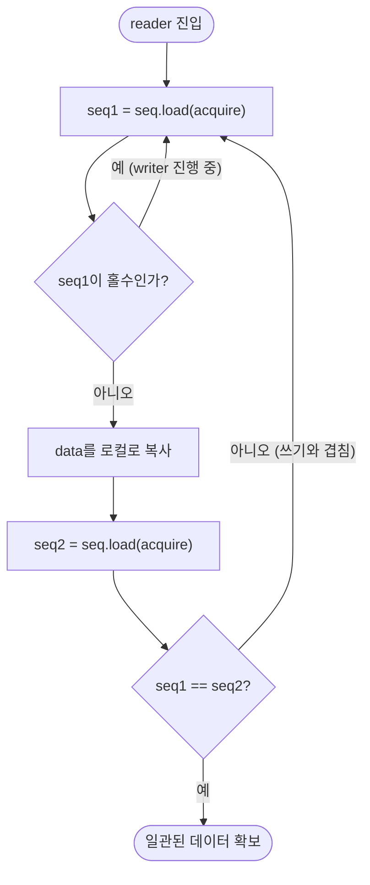

**Seqlock 패턴**은 리더가 락을 전혀 잡지 않고 시퀀스 카운터의 변화만으로 자신이 읽은 데이터가 일관됐는지 사후 검증하는 reader-writer 동기화 기법입니다. mutex나 `shared_mutex`는 리더끼리도 카운터를 갱신하거나 캐시라인을 공유해 경합을 만들지만, Seqlock은 리더가 어떤 원자적 쓰기도 하지 않고 오직 읽기만 하므로 리더 수가 늘어도 리더 간 경합이 원천적으로 생기지 않습니다. 대신 그 대가로 "읽은 데이터가 실제로 일관됐는가"를 매번 재확인해야 하고, 검증에 실패하면 전체 읽기를 재시도합니다. 시세 스냅샷, 타임스탬프, 설정 값처럼 작고 자주 갱신되며 읽기 빈도가 압도적으로 높은 데이터에 이 트레이드오프가 잘 맞습니다.

## 이 장을 읽기 전에

이 장은 [C++ 메모리 모델 실무 해석](/post/concurrency-optimization/cpp-memory-model-acquire-release-seqcst/)(챕터 04)에서 다룬 acquire/release 시맨틱과 happens-before 관계를 전제로 합니다. `std::memory_order`가 무엇을 보장하고 무엇을 보장하지 않는지 모른다면 이 장의 정확성 논의를 따라가기 어려우니 먼저 해당 챕터를 읽는 것을 권합니다. 또한 [False Sharing 탐지와 회피](/post/concurrency-optimization/false-sharing-detection-avoidance/)(챕터 03)의 캐시라인 정렬 개념과 [Lock 선택 기준](/post/concurrency-optimization/lock-selection-criteria-guide/)(챕터 02)의 mutex/spinlock 비용 감각이 있으면 이 장에서 왜 Seqlock을 고려하는지 더 쉽게 이해됩니다.

**이 장의 깊이**: Seqlock의 동작 원리, C++로 정확하게 구현하는 방법, 흔한 구현 함정, 그리고 검증 도구의 한계까지 다룹니다. **다루지 않는 것**: 포인터·가변 크기 데이터를 안전하게 공유하는 lock-free 자료구조 일반론은 [Lock-free 자료구조 구현](/post/concurrency-optimization/lock-free-queue-stack-hashmap/)(챕터 06)에, hazard pointer·RCU 기반의 포인터 안전 재활용은 [Hazard Pointers·RCU](/post/concurrency-optimization/hazard-pointer-rcu-cpp26/)(챕터 07)에 위임합니다. Seqlock은 이 두 챕터가 다루는 문제(포인터 수명 관리)를 애초에 풀지 않는 기법이라는 점이 이 장의 핵심 경계입니다.

## 당신의 수준에 맞는 경로

| 수준 | 읽을 부분 | 핵심 목표 |
|------|---------|---------|
| **중급자** | 도입 ~ "핵심 메커니즘" | Seqlock이 왜 리더를 블로킹하지 않는지, 시퀀스 카운터가 무엇을 검증하는지 이해 |
| **심화** | "흔한 오개념" ~ "구현" | 깨진 구현과 올바른 구현의 차이, ThreadSanitizer 검증의 한계 파악 |
| **전문가** | "판단 기준" ~ "비판적 시각" | mutex/RCU/lock-free 대비 Seqlock의 적용 범위와 표준 준수 리스크 판단 |

---

## Seqlock의 등장 배경

**Seqlock**은 리눅스 커널에서 Andrea Arcangeli의 이전 작업을 바탕으로 Stephen Hemminger가 만들었고 처음에는 "frlock"이라 불렸습니다. 커널과 사용자 공간이 진짜 락을 공유할 수 없는 x86-64 시간 코드(jiffies·타임스탬프 갱신)에서 이 문제를 풀기 위해 도입됐으며, 시맨틱은 커널 2.5.59에서 안정화되어 2.6.x 계열에 자리 잡았습니다. 리눅스 커널은 이 개념을 두 계층으로 분리합니다. **`seqcount_t`**는 카운터만 제공하는 원시 메커니즘으로, 쓰기 측 임계 구역의 직렬화(다중 라이터 배제)는 별도의 외부 락이 책임집니다. **`seqlock_t`**는 이 카운터에 스핀락을 내장해 라이터 직렬화까지 함께 제공합니다. C++에서 Seqlock을 직접 구현할 때는 보통 `seqcount_t`에 해당하는 부분만 만들고, 라이터가 하나뿐이거나 별도 mutex로 라이터를 직렬화하는 전제를 둡니다. 커널 문서는 이 메커니즘이 **포인터를 포함한 데이터에는 쓸 수 없다**고 명시하는데, 라이터가 포인터를 무효화하면 리더가 그 포인터를 따라가는 도중에도 막을 방법이 없기 때문입니다. 이 제약이 이 장을 07장(hazard pointer·RCU)과 분리하는 근본적인 이유입니다.

## 핵심 메커니즘: 시퀀스 카운터 기반 일관성 검증

Seqlock의 규약은 단순합니다. 라이터는 데이터를 쓰기 전에 카운터를 1 증가시켜 **홀수**로 만들고("쓰기 중"이라는 신호), 데이터를 다 쓴 뒤 카운터를 다시 1 증가시켜 **짝수**로 되돌립니다. 리더는 카운터를 읽어(`seq1`) 홀수면 라이터가 진행 중이므로 즉시 재시도하고, 짝수라면 데이터를 복사한 뒤 카운터를 다시 읽어(`seq2`) `seq1 == seq2`인지 확인합니다. 두 조건 중 하나라도 어긋나면 — 카운터가 홀수였거나 읽는 동안 값이 바뀌었다면 — 리더는 자신이 읽은 데이터가 라이터의 쓰기와 겹쳤을 수 있다고 판단하고 처음부터 다시 읽습니다. 이 프로토콜이 성립하려면 두 가지 순서가 CPU와 컴파일러 양쪽에서 모두 지켜져야 합니다. 라이터 쪽에서는 데이터 쓰기가 두 번째 카운터 증가보다 먼저 다른 스레드에 보여야 하고(release 순서), 리더 쪽에서는 카운터 읽기가 데이터 읽기보다 먼저 일어나야 하며 데이터 읽기가 두 번째 카운터 읽기보다 먼저 완료돼야 합니다(acquire 순서). 이 양방향 순서 보장이 없으면 재배치된 명령들이 "카운터는 일치하지만 실제로는 찢어진(torn) 데이터"를 만들어낼 수 있습니다. 리더가 어떤 원자적 RMW도 쓰지 않고 오직 로드만 반복한다는 점 때문에, 리더 경로는 잠금이 아니라 **wait-free에 가까운 재시도 루프**로 동작합니다 — 다만 라이터가 계속 쓰기를 진행하면 이 재시도가 끝나지 않을 수 있다는 점은 뒤에서 다룹니다.



## 흔한 오개념

**"Seqlock은 mutex를 대체하는 일반적인 락이다"**는 틀렸습니다. Seqlock은 라이터의 쓰기 자체를 직렬화하지 않으며(다중 라이터가 있다면 별도 락이 필요합니다), 포인터나 가변 크기 데이터를 안전하게 보호하지도 못합니다. 리눅스 커널 문서가 명시하듯 라이터가 포인터를 무효화하는 순간 리더가 그 포인터를 따라가다 크래시할 수 있어, 대상은 항상 **작고 trivially copyable한 POD 스냅샷**으로 제한됩니다.

**"리더가 절대 블로킹되지 않으니 항상 더 빠르다"**도 과장입니다. 쓰기가 매우 잦거나 임계 구역이 길면 리더는 계속 홀수 카운터를 만나 재시도만 반복하는 상황(사실상의 livelock)에 빠질 수 있고, 카운터 자체도 원자적 스토어이므로 캐시라인 핑퐁 비용은 여전히 남습니다. 읽기 대 쓰기 비율이 압도적으로 읽기 쪽으로 치우친 워크로드에서만 이점이 뚜렷합니다.

**"ThreadSanitizer가 통과하면 구현이 맞다는 뜻이다"**는 이 패턴에서 특히 위험한 착각입니다. 뒤의 구현·검증 절에서 다루듯, TSan은 이 패턴이 의도적으로 남겨두는 "일관성 검사로 사후에 버려지는" 데이터 레이스를 실제 버그로 오탐할 수 있고, 반대로 카운터 갱신을 `relaxed`로 잘못 완화한 진짜 버그가 있어도 특정 실행에서 타이밍이 겹치지 않으면 탐지하지 못하고 통과시킬 수도 있습니다.

## 구현: 깨진 코드 → 원인 → 올바른 구현 → 검증

가장 흔한 실패는 카운터와 데이터를 모두 `std::atomic` 없이 평범한 변수로 두는 것입니다.

```cpp
#include <cstdint>

struct Snapshot { double price; double qty; std::uint64_t ts; };

// 깨짐: seq가 원자적이지 않고, 순서를 강제하는 어떤 장치도 없음
struct BrokenSeqlock {
  unsigned seq = 0;
  Snapshot data{};

  void write(const Snapshot& s) {
    ++seq;      // 홀수 진입: 컴파일러/CPU가 자유롭게 재배치 가능
    data = s;
    ++seq;      // 짝수 복귀
  }

  Snapshot read() const {
    unsigned s1, s2;
    Snapshot out;
    do {
      s1 = seq;   // 평범한 읽기: 다른 스레드의 최신 쓰기가 보인다는 보장이 없음
      out = data; // seq 검사와 무관하게 재배치될 수 있음
      s2 = seq;
    } while (s1 != s2 || (s1 & 1));
    return out;
  }
};
```

이 코드는 두 층위에서 무너집니다. 첫째, `seq`와 `data`에 대한 동시 읽기/쓰기는 C++ 표준상 동기화되지 않은 데이터 레이스이므로 그 자체로 미정의 동작입니다. 둘째, 표준 위반을 눈감아 주더라도 컴파일러는 `data`를 읽는 코드를 `s1`을 확인하는 코드보다 앞이나 뒤로 옮길 근거(의존성)가 없다고 보고 최적화 단계에서 재배치할 수 있고, ARM처럼 로드-로드 재배치를 허용하는 하드웨어에서는 CPU가 한 번 더 순서를 흐트러뜨릴 수 있습니다. 결과는 간헐적이고 플랫폼에 따라 재현 여부가 달라지는 찢어진 읽기입니다.

올바른 구현은 카운터를 `std::atomic`으로 두고, 시퀀스 로드/스토어에는 acquire/release를, 그리고 `data_`처럼 평범한 비원자적 접근이 그 경계를 넘어 재배치되지 않도록 컴파일러 배리어를 추가로 둡니다. 아래 코드는 [rigtorp/Seqlock](https://github.com/rigtorp/Seqlock)(MIT 라이선스, C++11 참조 구현)의 관용구를 그대로 따른 것입니다.

```cpp
#include <atomic>
#include <cstdint>
#include <cstring>
#include <type_traits>

template <typename T>
class Seqlock {
  static_assert(std::is_trivially_copyable_v<T>,
                "Seqlock은 trivially copyable POD 스냅샷만 보호할 수 있다");
  std::atomic<std::uint64_t> seq_{0};
  alignas(64) T data_{};   // 카운터·데이터 false sharing 방지 (03장 참고)

 public:
  void write(const T& value) noexcept {
    seq_.fetch_add(1, std::memory_order_release);          // 홀수 진입: 쓰기 중 신호
    std::atomic_signal_fence(std::memory_order_acq_rel);   // data_ 쓰기가 앞으로 당겨지지 않도록 차단
    std::memcpy(&data_, &value, sizeof(T));
    std::atomic_signal_fence(std::memory_order_acq_rel);   // data_ 쓰기가 뒤로 밀리지 않도록 차단
    seq_.fetch_add(1, std::memory_order_release);          // 짝수 복귀: 쓰기 완료 공개
  }

  T read() const noexcept {
    T out;
    std::uint64_t s1, s2;
    do {
      s1 = seq_.load(std::memory_order_acquire);
      std::atomic_signal_fence(std::memory_order_acq_rel);
      std::memcpy(&out, &data_, sizeof(T));                 // 홀수여도 일단 읽는다 — 버릴지는 아래서 판정
      std::atomic_signal_fence(std::memory_order_acq_rel);
      s2 = seq_.load(std::memory_order_acquire);
    } while (s1 != s2 || (s1 & 1));
    return out;
  }
};
```

여기서 중요한 것은 `read()`가 `s1`이 홀수여도 `memcpy`를 건너뛰지 않고 일단 실행한다는 점입니다. 홀수인 동안 읽었으므로 찢어졌을 수 있는 값이지만, 그 값은 어차피 `while` 조건(`s1 != s2 || (s1 & 1)`)에서 버려지고 재시도되므로 결과에 영향을 주지 않습니다. 반대로 홀수일 때 `memcpy`를 생략하고 곧장 조건 검사로 건너뛰면 아직 값이 채워지지 않은 `out`과 초기화되지 않은 `s2`를 비교하는 코드가 되어 버려, "검증 없이 통과되는 예외 경로"라는 새로운 버그를 만듭니다 — 흔히 저지르는 실수이므로 직접 구현할 때 이 지점을 특히 주의해야 합니다. `std::atomic_signal_fence`는 **컴파일러에게만 재배치 금지를 지시하는 순수 컴파일 타임 배리어**이고 어떤 CPU 명령어도 생성하지 않습니다 — 즉 하드웨어가 스스로 로드/스토어를 재배치하지 않는 x86 TSO 모델에서만 이 코드가 완전합니다. rigtorp의 원 구현 문서도 이 점을 명시하며, ARM·POWER처럼 약한 메모리 모델의 하드웨어로 이식하려면 `atomic_signal_fence` 대신 실제 하드웨어 배리어를 내는 `std::atomic_thread_fence`나 `data_` 자체를 `memory_order_relaxed` 원자적 접근으로 바꿔야 한다고 밝히고 있습니다. `seq_`에 대한 `fetch_add`의 acquire/release는 아키텍처와 무관하게 컴파일러가 올바른 하드웨어 명령을 내도록 표준이 보장하지만, `data_`는 원자적 타입이 아니므로 이 보장 밖에 있다는 차이를 구분해야 합니다.

이 관용구를 검증할 때 ThreadSanitizer는 특유의 함정이 있습니다.

```bash
g++ -std=c++20 -O1 -g -fsanitize=thread seqlock_test.cpp -o seqlock_test
./seqlock_test
```

이렇게 실행하면 TSan은 `write`의 `memcpy(&data_, ...)`와 `read`의 `memcpy(&out, &data_, ...)` 사이를 거의 확실히 "data race"로 보고합니다. TSan의 happens-before 모델에는 "카운터가 불일치하면 결과를 버린다"는 규약을 이해할 방법이 없어서, 알고리즘이 올바르게 동작 중이어도 설계상 남겨둔 이 벤딩 레이스를 실제 버그와 똑같이 취급합니다. 실제로 리눅스 커널의 동적 레이스 탐지기인 KCSAN도 같은 문제를 겪었고, 그 해결책은 일반적인 억제가 아니라 `seqcount` 읽기 임계 구역 안의 접근을 별도로 인식해 의도된 벤딩 레이스로 처리하도록 탐지기 자체에 `data_race()` 주석 규약을 추가하는 것이었습니다 — 즉 "패턴을 아는 도구"가 아니면 이 오탐을 근본적으로 없앨 수 없다는 뜻입니다. 반대 방향의 위험도 있습니다: TSan을 비롯한 동적 레이스 탐지기는 자신이 관찰한 특정 스레드 인터리빙에서만 레이스를 잡아낼 수 있으므로, 카운터의 acquire/release를 잘못 `relaxed`로 완화한 실제 버그가 있어도 테스트 실행에서 우연히 그 타이밍이 겹치지 않으면 탐지되지 않고 통과할 수 있습니다. 이는 이 패턴만의 문제가 아니라 커버리지 기반 동적 분석 전반의 근본적 한계이지만, Seqlock처럼 정상 동작 자체가 레이스를 전제로 하는 코드에서는 그 한계가 더 크게 체감됩니다. 즉 TSan이 깨끗하다는 것은 "명백한 회귀가 없다"는 필요조건이지 "이 구현이 옳다"는 충분조건이 아닙니다. 실무에서는 `memcpy` 호출부만 좁게 지정한 억제 목록으로 알려진 벤딩 레이스를 숨기고, 대신 acquire/release 페어링과 카운터 짝/홀 로직은 코드 리뷰로 별도 검증합니다.

```text
# tsan_suppressions.txt — write/read의 memcpy 벤딩 레이스만 좁게 억제
race:Seqlock<*>::write
race:Seqlock<*>::read
```

이 억제 목록을 지정한 뒤 `TSAN_OPTIONS` 환경 변수로 넘겨 실행하면, 알려진 벤딩 레이스만 숨기고 그 밖의 새 레이스 경고는 그대로 살아 있습니다.

```bash
TSAN_OPTIONS="suppressions=tsan_suppressions.txt" ./seqlock_test
```

억제 목록은 스택 프레임을 넓게 잡을수록 실제 버그까지 함께 가려버릴 위험이 커지므로, 클래스·함수 단위로 최대한 좁게 지정하고 새 레이스 경고가 뜨면 먼저 그것이 이 목록으로 가려지는 범위인지부터 확인합니다.

읽기 성능을 정량 비교하려면 mutex 기반 읽기와 나란히 측정합니다. 아래는 Google Benchmark 스켈레톤이며, `g++ -std=c++20 -O2 bench.cpp -lbenchmark -lpthread`(x86-64 기준)로 빌드합니다. 실제로는 별도 라이터 스레드가 백그라운드에서 계속 값을 갱신하도록 구성해야 경합 상황을 재현할 수 있습니다.

```cpp
#include <benchmark/benchmark.h>
#include <mutex>
#include <cstdint>

struct Snapshot { double price; double qty; std::uint64_t ts; };

Seqlock<Snapshot> g_seq{};  // 위에서 정의한 클래스를 그대로 사용
std::mutex g_mtx;
Snapshot g_guarded{};

static void BM_MutexRead(benchmark::State& state) {
  for (auto _ : state) {
    Snapshot s;
    {
      std::lock_guard<std::mutex> lk(g_mtx);
      s = g_guarded;
    }
    benchmark::DoNotOptimize(s);
  }
}
BENCHMARK(BM_MutexRead)->Threads(8);

static void BM_SeqlockRead(benchmark::State& state) {
  for (auto _ : state) {
    auto s = g_seq.read();
    benchmark::DoNotOptimize(s);
  }
}
BENCHMARK(BM_SeqlockRead)->Threads(8);

BENCHMARK_MAIN();
```

리더 스레드 수가 늘어날수록 mutex 읽기는 잠금 경합으로 지연이 늘어나는 경향이 있는 반면, Seqlock 읽기는 재시도 루프만 반복하므로 리더 간 확장성이 나은 경우가 많습니다. 다만 정확한 배율은 CPU 세대, 컴파일러, 라이터 갱신 빈도, `-O2`/`-O3` 여부에 따라 크게 달라지므로 이 수치를 단정하지 말고 대상 환경에서 라이터를 함께 돌려 직접 측정합니다.

## 판단 기준

| 상황 | 권장 | 비권장 |
|------|------|--------|
| 작은 POD 스냅샷, 읽기가 압도적으로 많음 | Seqlock | mutex/`shared_mutex` |
| 데이터에 포인터·가변 크기 필드 포함 | RCU·hazard pointer([07장](/post/concurrency-optimization/hazard-pointer-rcu-cpp26/)) | Seqlock |
| 쓰기 빈도가 높거나 임계 구역이 김 | mutex/`shared_mutex`([02장](/post/concurrency-optimization/lock-selection-criteria-guide/)) | Seqlock (livelock 위험) |
| 다중 라이터가 동시에 갱신 | Seqlock + 별도 라이터 직렬화 락 | 라이터 보호 없는 단순 Seqlock |
| TSan clean 빌드가 조직 정책상 필수 | 좁은 범위 억제 목록 + 코드 리뷰 병행 | 억제 없이 방치 |
| 임계 구역에서 캐시라인 공유 필요 | 카운터·데이터 정렬 분리([03장](/post/concurrency-optimization/false-sharing-detection-avoidance/)) | 카운터·데이터 같은 캐시라인 방치 |

## 비판적 시각: 한계와 트레이드오프

Seqlock은 "라이터가 리더를 굶기지 않는다"는 장점을 광고하지만, 그 이면에는 "쓰기가 잦으면 리더가 영원히 재시도할 수 있다"는 대칭적인 위험이 있습니다. 커널 문서 역시 라이터의 쓰기 임계 구역이 선점되거나 인터럽트되면 리더가 스케줄러 타임 슬라이스 내내 스핀할 수 있다고 경고합니다. 두 번째 한계는 적용 범위입니다: 포인터·가변 크기 데이터를 다루지 못한다는 제약은 우회할 방법이 없고, 이 범위를 넘어서는 순간 06장·07장의 도구로 옮겨가야 합니다. 세 번째는 표준 준수와 이식성 문제입니다: `data_`에 대한 접근은 C++ 표준이 정의하는 데이터 레이스의 정의를 문자 그대로 충족하는 코드이고, "카운터 검사로 나쁜 값을 버리니 괜찮다"는 논증은 언어 표준 어디에도 formal하게 규정돼 있지 않습니다. 게다가 앞서 본 `atomic_signal_fence` 기반 구현은 x86의 강한 메모리 모델(TSO)에 사실상 의존하므로, ARM·POWER로 그대로 옮기면 컴파일러 재배치는 막아도 하드웨어 재배치까지 막지는 못해 조용히 깨질 수 있습니다 — "한 아키텍처에서 검증됨"과 "이식 가능함"을 구분해야 하는 이유입니다. 마지막으로 검증 도구의 한계입니다: ThreadSanitizer는 이 패턴에서 구조적으로 오탐을 내고, 반대로 실제 순서 버그를 특정 실행에서 우연히 놓칠 수도 있으므로, "정적·동적 분석 도구를 통과했다"는 것만으로 동시성 정확성을 주장해서는 안 되고, 코드 리뷰·다중 아키텍처 스트레스 테스트·좁게 지정한 억제 목록을 함께 운용해야 합니다.

### 더 읽을 거리

- [Linux Kernel Documentation: Sequence counters and sequential locks](https://docs.kernel.org/locking/seqlock.html) — `seqcount_t`/`seqlock_t`의 공식 규약과 실시간 스케줄링 하의 livelock 경고
- [Linux Kernel Documentation: Kernel Concurrency Sanitizer (KCSAN)](https://docs.kernel.org/dev-tools/kcsan.html) — `data_race()` 주석으로 의도된 벤딩 레이스를 탐지기에 알리는 방식
- [rigtorp/Seqlock (GitHub)](https://github.com/rigtorp/Seqlock) — 이 장의 C++ 구현이 따른 MIT 라이선스 참조 구현과 아키텍처별 주의사항
- [Wikipedia: Seqlock](https://en.wikipedia.org/wiki/Seqlock) — Stephen Hemminger·Andrea Arcangeli의 초기 개발 배경과 커널 버전 이력

## 마무리

- [ ] 시퀀스 카운터의 짝/홀 판정이 무엇을 의미하는지 설명할 수 있다.
- [ ] 리더 쪽 두 번의 카운터 읽기와 그 사이의 acquire 배리어가 왜 필요한지 설명할 수 있다.
- [ ] 포인터·가변 크기 데이터에는 Seqlock을 쓸 수 없고 07장의 기법으로 가야 한다는 것을 판단할 수 있다.
- [ ] ThreadSanitizer가 이 패턴에서 오탐·미탐을 모두 낼 수 있다는 한계를 알고, 억제 목록을 좁게 적용할 수 있다.
- [ ] mutex 대비 Seqlock을 선택해야 하는 읽기/쓰기 비율 조건을 판단 기준 표로 설명할 수 있다.

**이전 장**: [std::jthread와 stop_token](/post/concurrency-optimization/cpp20-jthread-stop-token-cooperative-cancellation/) (13장)

**다음 장에서는** 스레드마다 독립된 저장소로 공유 자체를 피하는 TLS를 다룹니다. Seqlock과 정반대 방향의 접근입니다 — "공유하되 검증"이 아니라 "아예 공유하지 않는" 전략의 비용과 함정을 이어서 살펴봅니다.

→ [Thread-local Storage 비용과 패턴](/post/concurrency-optimization/thread-local-storage-cost-patterns/) (15장)
