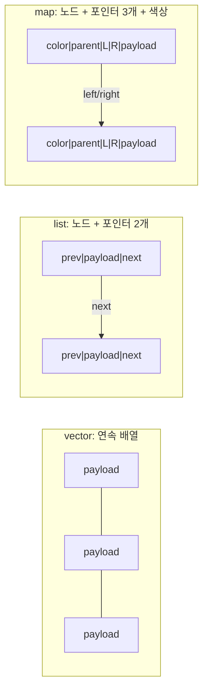
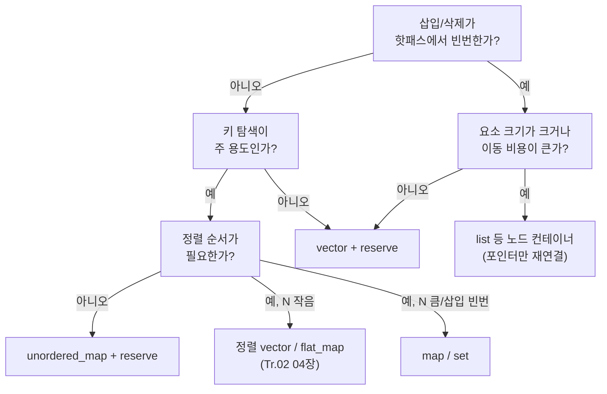

**컨테이너 비용 모델**이란 STL 컨테이너가 삽입·순회·조회 과정에서 실제로 소비하는 자원을 **할당 횟수**, **요소당 메모리 오버헤드**, **이동·복사 비용**이라는 세 축으로 분해해 예측하는 틀을 말합니다. Big-O 표기는 "몇 단계가 걸리는가"만 말해 줄 뿐, "그 한 단계가 malloc을 부르는가", "노드 하나에 포인터가 몇 개 붙는가"는 알려주지 않습니다. 핫패스에서 지연이 새는 지점은 대개 이 세 축 중 하나이므로, 컨테이너를 고르기 전에 이 틀로 먼저 값을 매겨 보는 것이 이 트랙의 출발점입니다.

## 이 장을 읽기 전에

**완전한 초보자?** 이 장은 [이 트랙 인트로](/post/memory-optimization/getting-started-memory-allocation-data-layout-tuning/)와 [15장: 메모리·수명·캐시 라인 직관](/post/memory-optimization/memory-lifetime-cache-line-intuition-fundamentals/)에서 잡은 "힙 할당은 공짜가 아니다"라는 직관을 전제로 합니다. `std::vector`·`std::map`·`std::unordered_map`을 사용해 본 경험과 Big-O 표기만 알면 충분합니다. Tr.02의 [STL 컨테이너 비용](/post/cpp-optimization/stl-container-cost/)에서 다룬 메모리 레이아웃·캐시 효율·복잡도 비교를 이미 읽었다면 이 장이 훨씬 빠르게 읽힙니다.

**이 장의 깊이**: 이 장은 **기초** 난이도입니다. 컨테이너별 "할당이 몇 번 일어나는가", "요소 하나당 몇 바이트가 더 붙는가"를 정량적으로 세는 법을 다루고, 이를 근거로 컨테이너를 고르는 판단 기준까지 정리합니다. **다루지 않는 것**: 캐시 라인·접근 패턴에 따른 지연 차이(Tr.02 [STL 컨테이너 비용](/post/cpp-optimization/stl-container-cost/), 이 트랙 [06장: 캐시 친화적 접근 패턴](/post/memory-optimization/cache-friendly-access-patterns/)), 할당 자체를 없애는 풀·아레나 설계([02장](/post/memory-optimization/pool-arena-allocation-strategy/))와 커스텀 할당자 구현([03장](/post/memory-optimization/custom-allocator-patterns/)), `std::pmr` 적용([04장](/post/memory-optimization/pmr-polymorphic-allocator-practical/)), 구조체 패딩·정렬([07장](/post/memory-optimization/struct-padding-alignment-optimization/))입니다.

## 당신의 수준에 맞는 경로

| 수준 | 읽을 부분 | 핵심 목표 |
|------|---------|---------|
| **초보자** | "비용 모델이라는 관점" ~ "노드 기반 컨테이너의 오버헤드" | 할당 횟수·요소당 오버헤드·이동 비용 세 축을 구분해 이해 |
| **중급자** | "할당 횟수를 직접 세어보기" ~ "판단 기준" | 카운팅 할당자로 실측하고 선택 기준에 적용 |
| **전문가** | "비판적 시각" | 구현체별 차이와 이 모델의 예측 한계를 판단 |

---

## 비용 모델이라는 관점 (배경)

C++ 표준(ISO/IEC 14882, [container.requirements] 절)은 `vector::push_back`이 **상환 상수 시간(amortized constant time)**이어야 한다고만 규정하고, 그 상수 시간을 만들어내는 **성장 인자(growth factor)**나 메모리 배치는 구현체에 맡깁니다. [cppreference: std::vector](https://en.cppreference.com/w/cpp/container/vector)도 capacity·재할당 조건을 "구현 정의"로 남겨 둔다는 점을 그대로 확인해 줍니다. 이 여백 때문에 GCC libstdc++와 Clang libc++는 2배 성장을, MSVC STL은 1.5배 성장을 채택했고, 이 차이는 지금도 유지되고 있습니다. "상환 O(1)"이라는 복잡도 보장 하나만 보면 세 구현체가 동등해 보이지만, 실제로 힙을 두드리는 **횟수**와 그때마다 옮기는 **바이트 수**는 성장 인자에 따라 갈립니다.

이 장에서 쓰는 "비용 모델"은 새로운 이론이 아니라, Tarjan·Cormen 등이 정리한 **상환 분석(amortized analysis)**의 결과를 "할당기 호출 횟수"라는 관찰 가능한 지표로 옮겨 쓰는 실용적 틀입니다. 목표는 증명이 아니라, 컨테이너를 고르기 전에 "이 선택이 힙을 몇 번, 얼마나 두드릴 것인가"를 어림잡는 것입니다.

## 세 가지 비용 축

컨테이너 하나를 고를 때 실제로 갈리는 비용은 다음 세 가지로 나눌 수 있습니다.

- **할당 횟수**: N개를 담는 동안 `allocate`/`deallocate`가 몇 번 호출되는가. vector는 재할당 시점에만, list·map·set은 삽입할 때마다 호출됩니다.
- **요소당 메모리 오버헤드**: 실제 데이터(`sizeof(T)`) 외에 컨테이너가 관리용으로 더 붙이는 바이트. 노드 기반 컨테이너는 포인터·색상 비트 등을 요소마다 추가로 짊어집니다.
- **이동·복사 비용**: 재할당·리해시가 일어날 때 기존 요소를 얼마나 옮기는가. 연속 컨테이너는 재할당 때 전체를 이동하고, 노드 컨테이너는 포인터만 재연결하면 됩니다.

이 세 축은 서로 트레이드오프 관계입니다. vector는 할당 횟수가 적은 대신 재할당 시 이동 비용이 크고, list는 이동 비용이 없는 대신 할당 횟수와 요소당 오버헤드가 큽니다. 아래에서 컨테이너별로 이 세 축의 값을 구체적으로 매겨 봅니다.

## vector: 성장 인자와 할당 횟수

`std::vector`는 용량이 부족해질 때만 재할당하므로, N번의 `push_back` 동안 실제 할당 횟수는 N이 아니라 **성장 인자 k에 대한 log_k(N)** 수준으로 줄어듭니다. 성장 인자가 2인 구현(libstdc++, libc++)에서 백만 개를 채우면 재할당은 대략 20회(⌈log₂ 1,000,000⌉)에 그치고, 성장 인자가 1.5인 MSVC STL에서는 대략 34회(⌈log₁.₅ 1,000,000⌉)로 더 잦습니다. 대신 재할당 한 번마다 옮기는 총 바이트는 등비수열을 이루어, 요소 하나가 일생 동안 옮겨지는 횟수의 기댓값은 **k/(k-1)**로 수렴합니다 — 성장 인자 2에서는 평균 2회 미만, 1.5에서는 평균 3회 미만입니다. 재할당 횟수는 성장 인자가 클수록 줄고, 이동 총량은 성장 인자가 작을수록 줄어드는 셈이라, 어느 쪽이 유리한지는 "이동 비용이 큰 타입인가"에 달려 있습니다.

```text
N = 1,000,000개를 push_back으로 채울 때 (개념 스케치, 구현 정의)

k = 2.0 (libstdc++/libc++): 재할당 ≈ 20회, 요소당 평균 이동 ≈ 2회 미만
k = 1.5 (MSVC STL):        재할당 ≈ 34회, 요소당 평균 이동 ≈ 3회 미만

→ reserve(N)을 미리 부르면 두 구현 모두 재할당 0회, 이동 0회로 수렴
```

이 계산이 알려주는 실무 결론은 하나입니다. **삽입할 개수의 상한을 안다면 `reserve`를 부르는 순간 이 축 전체가 사라진다**는 것입니다. 반대로 상한을 모른 채 반복 삽입을 오래 지속하면, 이동 비용이 큰 타입(문자열·큰 구조체)일수록 성장 인자 차이가 실측 지연 차이로 드러날 수 있으므로 대상 컴파일러·표준 라이브러리에서 직접 확인해야 합니다.

## deque: 청크 단위 할당

`std::deque`는 요소를 하나의 연속 블록이 아니라 **고정 크기 청크(chunk)** 여러 개로 나누어 저장하고, 청크를 가리키는 포인터 배열(맵)을 따로 관리합니다. 앞·뒤에 요소를 추가할 때는 필요한 청크가 없을 때만 새 청크를 할당하므로, 할당 횟수는 **N / (청크당 요소 수)** 수준으로 vector보다는 많고 list보다는 훨씬 적습니다. 청크 자체는 재할당되지 않으므로 기존 요소가 통째로 이동하는 vector식 이동 비용은 없고, 대신 포인터 배열이 가득 차면 그 배열만 재할당됩니다.

이 구조 덕분에 deque는 앞쪽 삽입이 잦은 워크로드(예: 슬라이딩 윈도우, 링 버퍼 대용)에서 vector보다 이동 비용이 훨씬 작습니다. 다만 청크 경계를 넘나드는 순회는 포인터 배열을 한 단계 더 거치므로, 순수 순회 지연은 vector보다 불리한 경우가 많습니다 — 이 캐시 관점은 Tr.02 [STL 컨테이너 비용](/post/cpp-optimization/stl-container-cost/)에서 다룬 내용과 이어집니다.

## 노드 기반 컨테이너의 오버헤드

`std::list`, `std::map`/`std::set`, `std::unordered_map`/`std::unordered_set`은 요소마다 **별도의 힙 노드**를 할당합니다. 이 노드에는 실제 데이터 외에 컨테이너가 관리용으로 붙이는 필드가 있고, 이 필드의 크기가 곧 "요소당 메모리 오버헤드" 축입니다.

- **list**: 노드마다 `prev`/`next` 포인터 2개(64비트에서 16바이트)를 추가로 가집니다. `int` 하나(4바이트, 정렬 후 8바이트)를 담는 노드라면 관리용 바이트가 실제 데이터보다 커, 오버헤드 비율이 100%를 넘는 경우가 흔합니다.
- **map/set**: 보통 레드-블랙 트리 노드로 구현되어 색상 비트(패딩 포함 8바이트)와 부모·좌·우 포인터 3개(24바이트)를 더 가집니다. `map<int, int>`처럼 payload가 작을수록 오버헤드 비율이 커집니다.
- **unordered_map/unordered_set**: 체이닝 구현(libstdc++)에서는 노드마다 캐시된 해시값과 다음 노드 포인터가 붙고, 별도로 버킷 배열(포인터 배열)이 `max_load_factor`를 넘을 때 vector와 비슷하게 재할당(리해시)됩니다. 이 조건은 [cppreference: std::unordered_map](https://en.cppreference.com/w/cpp/container/unordered_map)의 `max_load_factor`·`rehash` 항목에 정리되어 있습니다. 즉 이 컨테이너는 "노드 오버헤드"와 "vector식 배열 재할당"을 동시에 갖습니다.

핵심은 payload(`sizeof(T)`)가 작을수록 이 오버헤드가 상대적으로 커진다는 점입니다. 요소가 이미 큰 구조체(수십~수백 바이트)라면 노드 오버헤드의 비중은 무시할 만하지만, `int`나 작은 `enum`을 담는 컨테이너에서는 오버헤드가 데이터 자체보다 클 수 있습니다.



작은 payload에서 노드 오버헤드를 없애고 싶다면, C++23 `std::flat_map`이나 정렬된 vector처럼 **연속 메모리에 키-값을 직접 늘어놓는** 대안이 있습니다. 이 대안의 삽입·삭제 트레이드오프는 Tr.02 [STL 컨테이너 비용](/post/cpp-optimization/stl-container-cost/)에서 이미 다뤘으므로 여기서는 "오버헤드 축을 0에 가깝게 만드는 선택지가 있다"는 사실만 짚습니다.

## 할당 횟수를 직접 세어보기

세 축 중 "할당 횟수"는 말로 추정하지 않고 직접 셀 수 있습니다. `std::allocator`가 요구하는 최소 인터페이스(`allocate`/`deallocate`, 변환 생성자)만 구현한 **카운팅 할당자**를 만들면, 컨테이너 코드를 한 줄도 바꾸지 않고 템플릿 인자만 바꿔 실제 `allocate` 호출 횟수와 총 바이트를 셀 수 있습니다. 이 패턴은 표준이 정의하는 [AllocatorAwareContainer](https://en.cppreference.com/w/cpp/named_req/AllocatorAwareContainer) 요구사항을 그대로 활용합니다.

```cpp
#include <atomic>
#include <cstddef>
#include <iostream>
#include <list>
#include <map>
#include <unordered_map>
#include <vector>

inline std::atomic<size_t> g_alloc_calls{0};
inline std::atomic<size_t> g_alloc_bytes{0};

template <typename T>
struct CountingAllocator {
  using value_type = T;
  CountingAllocator() = default;
  template <typename U>
  CountingAllocator(const CountingAllocator<U>&) {}

  T* allocate(std::size_t n) {
    g_alloc_calls.fetch_add(1, std::memory_order_relaxed);
    g_alloc_bytes.fetch_add(n * sizeof(T), std::memory_order_relaxed);
    return static_cast<T*>(::operator new(n * sizeof(T)));
  }
  void deallocate(T* p, std::size_t) noexcept { ::operator delete(p); }
};
template <typename T, typename U>
bool operator==(const CountingAllocator<T>&, const CountingAllocator<U>&) { return true; }
template <typename T, typename U>
bool operator!=(const CountingAllocator<T>&, const CountingAllocator<U>&) { return false; }

template <typename Fn>
void measure(const char* label, Fn fn) {
  g_alloc_calls = 0;
  g_alloc_bytes = 0;
  fn();
  std::cout << label << ": allocate() " << g_alloc_calls
            << "회, 총 " << g_alloc_bytes << " 바이트\n";
}

int main() {
  constexpr int N = 100000;

  measure("vector (reserve 없음)", [] {
    std::vector<int, CountingAllocator<int>> v;
    for (int i = 0; i < N; ++i) v.push_back(i);
  });

  measure("vector (reserve 있음)", [] {
    std::vector<int, CountingAllocator<int>> v;
    v.reserve(N);
    for (int i = 0; i < N; ++i) v.push_back(i);
  });

  measure("list", [] {
    std::list<int, CountingAllocator<int>> l;
    for (int i = 0; i < N; ++i) l.push_back(i);
  });

  measure("map", [] {
    std::map<int, int, std::less<int>,
             CountingAllocator<std::pair<const int, int>>> m;
    for (int i = 0; i < N; ++i) m.emplace(i, i);
  });

  measure("unordered_map (reserve 없음)", [] {
    std::unordered_map<int, int, std::hash<int>, std::equal_to<int>,
                        CountingAllocator<std::pair<const int, int>>> um;
    for (int i = 0; i < N; ++i) um.emplace(i, i);
  });
}
```

`g++ -O2 -std=c++17 counting_alloc.cpp -o counting_alloc`로 빌드해 실행하면(x86-64, GCC 13 기준), `vector (reserve 없음)`은 성장 인자에 따른 log 수준의 호출 횟수를, `vector (reserve 있음)`은 정확히 1회를, `list`·`map`·`unordered_map`은 N에 근접하거나(map, 각 삽입마다 노드 1개) N보다 조금 많은(unordered_map, 노드 할당 + 리해시) 호출 횟수를 출력하는 것을 직접 확인할 수 있습니다. 이 카운팅 할당자는 실제 `operator new`/`operator delete`를 그대로 호출하므로 성능 오버헤드는 원자적 카운터 증가뿐이며, 측정 결과는 표준 라이브러리 구현·컴파일러 버전에 따라 달라질 수 있으므로 배포 환경에서 재현하는 것이 안전합니다.

## 흔한 오개념

**"reserve만 하면 vector가 항상 이긴다"**는 절반만 맞습니다. `reserve`는 삽입할 개수의 상한을 미리 알 때만 효과가 있고, 상한을 몰라 과대 추정하면 메모리를 낭비하며, 과소 추정하면 재할당이 그대로 남습니다. 상한을 모르는 채로 반복해서 크기가 바뀌는 컬렉션이라면 애초에 다른 축(청크 기반 deque, 풀 할당)을 검토해야 합니다.

**"노드 기반 컨테이너는 무조건 느리다"**도 과장입니다. 요소가 크고 이동 비용이 비싼 타입(이동 생성자가 없거나 비싸게 구현된 타입)이라면, vector의 재할당이 매번 전체 데이터를 복사하는 것보다 노드 컨테이너가 포인터만 재연결하는 편이 총 비용이 더 낮을 수 있습니다. "캐시가 이긴다"는 일반론은 payload가 작고 이동이 저렴할 때 성립하는 경향이지, 모든 타입에 대한 절대 법칙이 아닙니다.

**"Big-O가 같으면 비용도 같다"**는 이 장 전체가 반박하는 오개념입니다. `vector`와 `deque`의 뒤쪽 삽입은 둘 다 상환 O(1)이지만, 실제 할당 횟수·이동 총량·캐시 동작은 다릅니다. 복잡도는 "몇 단계인가"만 말하고, "그 단계가 얼마나 무거운가"는 이 장의 세 축으로 따로 확인해야 합니다.

## 판단 기준



| 상황 | 권장 | 이 장 기준 근거 |
|------|------|------|
| 삽입 개수 상한을 안다 | vector + reserve(N) | 할당 횟수 1회, 이동 비용 0 |
| 상한 모른 채 장기 누적 | deque 또는 풀 할당(02장) 검토 | 청크 단위 할당으로 이동 비용 분산 |
| payload가 작고(수 바이트) 이동이 저렴 | vector/정렬 vector | 노드 오버헤드 비율이 payload보다 커지는 상황 회피 |
| payload가 크고 이동이 비쌈 | list/map 등 노드 컨테이너 | 재할당 시 대량 이동보다 포인터 재연결이 저렴 |
| 키 탐색 위주, 순서 불필요 | unordered_map + reserve | 리해시 횟수를 미리 줄여 축 두 개(할당·이동) 동시 절감 |
| 할당 횟수 자체가 병목으로 측정됨 | 02장 풀/아레나, 04장 pmr | 컨테이너 선택이 아니라 할당 경로 자체를 바꿔야 하는 단계 |

## 비판적 시각: 한계와 트레이드오프

이 비용 모델은 **어림값**이지 정밀한 예측이 아닙니다. 성장 인자·노드 레이아웃·리해시 조건은 모두 구현체(libstdc++/libc++/MSVC STL) 정의 사항이라, 이 장에서 든 log_k(N)이나 오버헤드 바이트 수는 방향성을 잡는 근사치로만 써야 합니다. 실제 malloc/free 구현(glibc malloc, jemalloc, tcmalloc — [16장](/post/memory-optimization/global-allocator-jemalloc-tcmalloc-tuning-expert/)에서 다룹니다)이 작은 할당을 어떻게 재사용하는지에 따라 "할당 횟수가 많다"는 사실이 실제 지연으로 얼마나 이어지는지도 달라집니다. 또한 이 장은 할당·오버헤드·이동이라는 세 축만 다루고 캐시 미스·프리페치 같은 하드웨어 단의 영향은 의도적으로 배제했으므로, 최종 판단은 반드시 이 장의 카운팅 결과와 Tr.02·이 트랙 06장의 지연 측정을 함께 봐야 신뢰할 수 있습니다.

## 마무리

이 장을 읽고 나면 다음을 확인할 수 있어야 합니다.

- [ ] 컨테이너 비용을 **할당 횟수·요소당 오버헤드·이동 비용** 세 축으로 나눠 설명할 수 있다.
- [ ] vector의 성장 인자가 재할당 횟수와 이동 총량을 어떻게 반대 방향으로 움직이는지 말할 수 있다.
- [ ] `reserve`가 어느 축을 없애고 어느 축은 그대로 두는지 구분할 수 있다.
- [ ] 노드 기반 컨테이너의 요소당 오버헤드가 payload 크기에 따라 상대적으로 커지거나 작아지는 이유를 설명할 수 있다.
- [ ] 카운팅 할당자로 컨테이너별 실제 `allocate` 호출 횟수를 직접 측정할 수 있다.
- [ ] "Big-O가 같아도 비용이 같지 않다"는 이유를 구체적인 축으로 짚을 수 있다.

**다음 장에서는** 이 장에서 확인한 할당 횟수 자체를 줄이는 방법을 다룹니다. 컨테이너를 바꾸는 대신 **할당 경로**를 바꾸는 접근으로, 풀(pool)과 아레나(arena) 할당이 반복 할당·해제 패턴에서 어떻게 malloc 호출 자체를 없애는지 정리합니다.

→ [할당 전략: 풀·아레나](/post/memory-optimization/pool-arena-allocation-strategy/)
