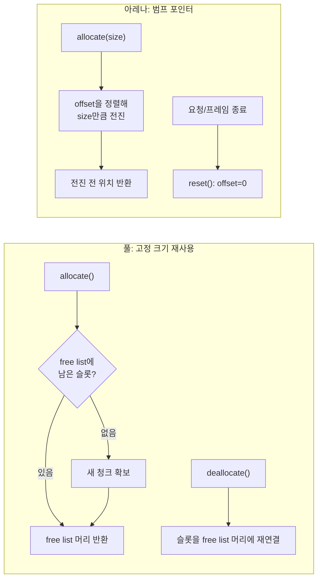

**풀(pool)·아레나(arena) 할당 전략**이란 힙에 매번 요청하는 대신 미리 확보해 둔 메모리 구역에서 객체를 반복적으로 재사용하거나, 한 구역을 통째로 쓰고 한 번에 되돌려주는 방식으로 핫패스의 할당 횟수 자체를 줄이는 설계를 말합니다. `malloc`/`new`는 범용적으로 동작하도록 만들어졌기 때문에 락, 크기별 free list 탐색, 메타데이터 갱신 같은 비용을 매 호출마다 지불합니다. 초당 수백만 번 객체를 만들고 버리는 주문 매칭 엔진이나 패킷 파서 같은 코드에서는 이 "매번 지불하는 비용"이 누적되어 지연 예산을 잠식합니다. 이 장은 그 비용을 구조적으로 없애는 두 가지 기본 패턴, 즉 **고정 크기 블록을 재사용하는 풀**과 **포인터를 앞으로만 밀며 한 번에 반납하는 아레나**의 내부 동작과 선택 기준을 다룹니다.

## 이 장을 읽기 전에

이 장은 [챕터 01: 컨테이너 비용 모델](/post/memory-optimization/container-cost-model-selection/)에서 다룬 "할당은 공짜가 아니다"라는 전제와, [챕터 15: 메모리·수명·캐시 라인 직관](/post/memory-optimization/memory-lifetime-cache-line-intuition-fundamentals/)에서 다룬 스택·힙·수명 개념을 이어받습니다. `new`/`delete`가 내부적으로 힙 메타데이터와 락을 건드린다는 사실, 그리고 객체 수명이 스코프에 묶이는지 더 길게 사는지 구분할 수 있다는 것을 전제로 합니다.

이 장의 깊이는 **중급**입니다. 풀·아레나가 "왜" 할당 횟수를 줄이는지, 내부적으로 어떻게 동작하는지, 언제 쓰고 언제 피할지를 판단할 수 있는 수준까지 다룹니다. **다루지 않는 것**: 이 장의 코드는 개념을 보여주기 위한 최소 구현이며, STL 컨테이너의 `Allocator` 요구사항을 만족하는 실전급 커스텀 할당자 구현은 [챕터 03: 커스텀 할당자 구현 패턴](/post/memory-optimization/custom-allocator-patterns/)에서 다룹니다. 표준 라이브러리가 제공하는 `std::pmr::monotonic_buffer_resource`·`std::pmr::unsynchronized_pool_resource` 같은 완성형 도구의 실전 적용은 [챕터 04: std::pmr 실전 활용](/post/memory-optimization/pmr-polymorphic-allocator-practical/)에서 다룹니다. 풀·아레나로 확보한 메모리를 어떻게 배치해야 캐시에 유리한지는 [챕터 06: 캐시 친화적 접근 패턴](/post/memory-optimization/cache-friendly-access-patterns/)과 [챕터 07: 구조체 패딩과 정렬](/post/memory-optimization/struct-padding-alignment-optimization/)의 영역입니다.

## 당신의 수준에 맞는 경로

| 수준 | 읽을 부분 | 핵심 목표 |
|------|---------|---------|
| **입문** | "역사와 배경" ~ "풀 할당자: free list로 재사용" | 풀이 할당 횟수를 줄이는 원리를 이해 |
| **중급** | "아레나(Arena): 범프 포인터로 한 방향 할당" ~ "벤치마크" | 아레나의 동작과 실측 차이를 확인 |
| **실무 적용** | "흔한 오개념" ~ "판단 기준" | 언제 풀·아레나를 쓰고 언제 `std::pmr`이나 기본 할당자로 남길지 결정 |

---

## 역사와 배경

풀·아레나 패턴은 새로운 아이디어가 아닙니다. GNU C 라이브러리의 [obstack](https://sourceware.org/glibc/manual/latest/html_node/Obstacks.html)(object stack)은 1980년대부터 "마지막에 할당한 객체를 가장 먼저 해제해야 한다"는 LIFO 규율을 대가로 빠른 일괄 할당을 제공해 온 메모리 풀입니다. 서로 다른 obstack 인스턴스는 독립적으로 동작하며, 컴파일러의 파스 트리 노드나 인터프리터의 임시 노드처럼 짧게 살고 한꺼번에 사라지는 객체가 많은 프로그램이 이 패턴의 오래된 사용처였습니다.

같은 아이디어는 오늘날의 컴파일러 인프라에서도 반복됩니다. LLVM의 [`BumpPtrAllocatorImpl`](https://llvm.org/doxygen/classllvm_1_1BumpPtrAllocatorImpl.html)은 계속 자라나는 메모리 풀에서 범프 포인터 방식으로 공간을 내주는 할당자로, 내부적으로는 하나의 무한한 힙 대신 여러 슬래브(slab) 블록을 이어 붙여 관리하지만 사용자 입장에서는 "현재 슬래브의 다음 N바이트를 가리키기만 하면 되는" 범프 포인터 의미론을 그대로 제공합니다. AST 노드, 심볼 테이블 항목처럼 컴파일 단위 하나가 끝나면 통째로 버려도 되는 객체에 이 방식이 널리 쓰입니다.

C++ 표준은 이 두 패턴을 C++17에서 `std::pmr` 네임스페이스로 공식화했습니다. [`std::pmr::monotonic_buffer_resource`](https://en.cppreference.com/w/cpp/memory/monotonic_buffer_resource)는 자원이 파괴될 때만 누적된 메모리를 한꺼번에 반환하는 아레나에 해당하고, [`std::pmr::unsynchronized_pool_resource`](https://en.cppreference.com/w/cpp/memory/unsynchronized_pool_resource)/`std::pmr::synchronized_pool_resource`는 크기별 청크(`pool_options`)를 관리하는 풀에 해당합니다. 즉 이 장에서 다루는 패턴은 이미 표준 라이브러리 수준에서 구현되어 검증된 설계이며, 실전에서는 직접 구현보다 이 표준 타입을 먼저 검토하는 것이 합리적입니다(챕터 04).

## 풀 할당자: free list로 재사용

**풀(pool) 할당자**는 같은 크기의 블록을 미리 여러 개 확보해 두고, 반환된 블록을 힙에 돌려주는 대신 **free list**(다음에 재사용할 블록들의 연결 리스트)에 넣었다가 다음 요청에 그대로 내주는 방식입니다. 핵심은 "크기가 고정되어 있다"는 전제입니다. 크기가 고정되어 있으면 할당기가 매번 "이 크기에 맞는 빈 공간을 찾는" 탐색을 할 필요가 없고, 그냥 free list의 머리(head)를 꺼내 주면 됩니다. 해제도 마찬가지로 블록을 free list 머리에 다시 연결하는 것으로 끝나, 둘 다 상수 시간에 가깝게 동작합니다.

내부 구현은 "빈 블록의 첫 몇 바이트를 다음 빈 블록을 가리키는 포인터로 재활용"하는 트릭을 씁니다. 블록이 아직 미사용 상태일 때는 사용자 데이터가 없으므로, 그 공간에 `next` 포인터를 겹쳐 써도 안전합니다. 아래는 이 트릭을 그대로 보여주는 최소 구현입니다.

```cpp
#include <cstddef>
#include <cstdint>
#include <vector>
#include <new>

// 고정 크기 블록을 free list로 재사용하는 최소 풀 할당자.
// T의 크기·정렬에 맞춘 슬롯을 청크 단위로 미리 확보하고,
// deallocate된 슬롯은 free list 머리에 다시 연결한다.
template <typename T, std::size_t ChunkSize = 256>
class FixedPool {
 public:
  ~FixedPool() {
    for (auto* chunk : chunks_)
      ::operator delete(chunk, std::align_val_t{alignof(T)});
  }

  void* allocate() {
    if (!free_head_) grow();
    void* slot = free_head_;
    free_head_ = *reinterpret_cast<void**>(free_head_);
    return slot;
  }

  void deallocate(void* p) {
    *reinterpret_cast<void**>(p) = free_head_;
    free_head_ = p;
  }

 private:
  static constexpr std::size_t kSlotSize =
      sizeof(T) < sizeof(void*) ? sizeof(void*) : sizeof(T);

  void grow() {
    auto* chunk = static_cast<std::byte*>(
        ::operator new(kSlotSize * ChunkSize, std::align_val_t{alignof(T)}));
    chunks_.push_back(chunk);
    // 청크 안의 슬롯들을 free list로 순서대로 연결한다.
    for (std::size_t i = 0; i < ChunkSize; ++i) {
      void* slot = chunk + i * kSlotSize;
      *reinterpret_cast<void**>(slot) = free_head_;
      free_head_ = slot;
    }
  }

  void* free_head_ = nullptr;
  std::vector<std::byte*> chunks_;
};
```

이 구현은 `T`가 사소한(trivial) 소멸자를 가질 때만 안전합니다. 소멸자가 자원을 해제해야 하는 타입이라면, `deallocate` 전에 반드시 `p->~T()`를 호출해 소멸자를 실행한 뒤 슬롯을 반납해야 합니다. 또한 `ChunkSize`를 너무 작게 잡으면 청크 경계마다 `grow()`가 다시 힙에 요청하므로, "핫패스에서 할당을 없앤다"는 목적이 흐려집니다. 반대로 너무 크게 잡으면 실제로 쓰지 않는 슬롯까지 메모리를 붙잡아 두는 트레이드오프가 생깁니다.

## 아레나(Arena): 범프 포인터로 한 방향 할당

**아레나(arena)** 또는 **범프 포인터(bump pointer) 할당자**는 풀보다 더 단순한 전제를 씁니다. 개별 블록을 해제하지 않고, 요청이 들어올 때마다 커서를 한 방향으로만 밀어서 다음 공간을 내주다가, 한 번에 전부(또는 커서만 되돌려서) 반납하는 방식입니다. 이 패턴이 유리한 경우는 "요청 하나를 처리하는 동안 만든 객체들을 요청이 끝나는 순간 한꺼번에 버려도 되는" 상황입니다. 웹 요청 하나, 파싱 작업 하나, 프레임 하나가 전형적인 단위입니다. 개별 해제가 없으므로 free list 관리 비용 자체가 사라지고, 할당은 정수 덧셈과 정렬 계산 수준으로 줄어듭니다.

```cpp
#include <cstddef>
#include <cstdint>
#include <new>
#include <vector>

// 요청 1건(또는 프레임 1개) 단위로 리셋하는 범프 포인터 아레나.
// 개별 deallocate는 없고, reset()으로만 커서를 되돌린다.
class Arena {
 public:
  explicit Arena(std::size_t capacity)
      : buffer_(static_cast<std::byte*>(::operator new(capacity))),
        capacity_(capacity) {}

  ~Arena() { ::operator delete(buffer_); }

  void* allocate(std::size_t size, std::size_t align) {
    std::size_t aligned = (offset_ + align - 1) & ~(align - 1);
    if (aligned + size > capacity_) return nullptr;  // 상위 자원으로 폴백 필요
    offset_ = aligned + size;
    return buffer_ + aligned;
  }

  void reset() { offset_ = 0; }  // 개별 해제 없이 커서만 되돌림

 private:
  std::byte* buffer_;
  std::size_t capacity_;
  std::size_t offset_ = 0;
};
```

여기서도 소멸자 문제는 그대로 남습니다. 아레나가 반환한 메모리 위에 `placement new`로 객체를 만들었다면, `reset()`을 부르기 전에 그 객체들의 소멸자를 호출할 책임은 여전히 호출자에게 있습니다. 아레나 자체는 "메모리를 어디서 받았는지"만 알 뿐 "그 위에 어떤 객체가 살아 있는지"는 모르기 때문입니다. 이 문제를 표준 방식으로 다루는 것이 `std::pmr::monotonic_buffer_resource`이며, 실전에서 소멸자 추적까지 포함한 안전한 설계는 챕터 03·04에서 이어집니다.



풀은 "개별 반납"을 지원하지만 블록 크기가 고정되어야 하고, 아레나는 크기 제약이 없는 대신 "개별 반납" 자체가 없습니다. 둘 다 공통적으로 "메모리를 커널이 아니라 이미 확보한 구역에서 조달한다"는 전략을 공유하며, 이 덕분에 시스템 콜(`mmap`/`brk`) 경계를 매 할당마다 넘나드는 비용과 범용 할당기의 락·메타데이터 탐색 비용을 함께 피합니다.

## 벤치마크: 할당 횟수 감소가 지연에 미치는 영향

주장을 코드로 검증하는 것이 이 트랙의 원칙입니다. 아래는 "매번 `new`/`delete`"와 "`FixedPool` 재사용"을 같은 반복 횟수로 비교하는 Google Benchmark 골격입니다. 실제 배율은 객체 크기, 힙 상태(단편화 여부), 컴파일러·플래그, 스레드 수에 따라 달라지므로 여러분의 환경에서 재현하는 것을 전제로 읽어야 합니다.

```cpp
#include <benchmark/benchmark.h>
#include <cstdint>

struct Order {  // 예시 페이로드: 주문 매칭 엔진에서 흔한 POD 크기
  std::uint64_t id;
  double price;
  std::uint32_t qty;
  std::uint32_t flags;
};

static void BM_HeapNewDelete(benchmark::State& state) {
  for (auto _ : state) {
    auto* p = new Order{};
    benchmark::DoNotOptimize(p);
    delete p;
  }
}
BENCHMARK(BM_HeapNewDelete);

static void BM_PoolReuse(benchmark::State& state) {
  FixedPool<Order> pool;
  for (auto _ : state) {
    void* mem = pool.allocate();
    auto* p = new (mem) Order{};
    benchmark::DoNotOptimize(p);
    p->~Order();
    pool.deallocate(mem);
  }
}
BENCHMARK(BM_PoolReuse);

BENCHMARK_MAIN();
```

`g++ -O2 bench.cpp -lbenchmark -lpthread`(x86-64, GCC 13, `-O2` 기준 예시)로 빌드해 실행하면, `BM_PoolReuse`가 `BM_HeapNewDelete`보다 유의미하게 빠르게 나오는 경우가 흔합니다 — 차이는 범용 할당기가 매 호출마다 수행하는 크기별 탐색·잠재적 락 획득을 `FixedPool`이 free list 포인터 연산 하나로 대체하기 때문입니다. 다만 이 배율은 힙 구현체(glibc malloc, jemalloc, mimalloc 등, [챕터 16: 전역 할당자·jemalloc·tcmalloc](/post/memory-optimization/global-allocator-jemalloc-tcmalloc-tuning-expert/) 참고)와 객체 크기에 따라 크게 흔들리므로, "항상 몇 배 빠르다"는 숫자를 그대로 옮기지 말고 대상 환경에서 직접 측정해야 합니다. 할당 횟수 자체를 프로파일링으로 확인하는 방법은 [프로파일링 트랙의 메모리 프로파일링: 힙 분석](/post/profiling-analysis/memory-profiling-heap-analysis/)과 [Google Benchmark 실전](/post/profiling-analysis/google-benchmark-practical/)에서 더 다룹니다.

## 흔한 오개념

<strong>"풀·아레나는 malloc보다 항상 빠르다"</strong>는 절반만 맞습니다. 이 패턴이 이기는 이유는 "범용성을 포기하고 특정 패턴에 특화"했기 때문이지, 마법이 아닙니다. 블록 크기가 매번 다르거나 청크 크기 산정이 워크로드와 맞지 않으면, 풀은 오히려 미사용 슬롯을 붙잡아 두는 오버 프로비저닝으로 이어지고 아레나는 용량 초과 시 폴백 경로가 추가되어 이득이 사라질 수 있습니다.

<strong>"아레나는 개별 해제가 없으니 메모리 누수 걱정이 없다"</strong>도 틀렸습니다. 아레나 자체가 통째로 살아 있는 동안에는 그 위에 만든 객체들의 소멸자가 호출되지 않은 채 남아 있을 수 있고, 파일 핸들이나 다른 자원을 들고 있는 타입이라면 그 자원이 `reset()` 전까지(또는 영원히) 새어나갑니다. 아레나가 관리하는 것은 "메모리 공간"이지 "객체의 완전한 생애주기"가 아닙니다.

<strong>"풀은 기본적으로 스레드 안전하다"</strong>도 흔한 착각입니다. 위 `FixedPool` 구현처럼 free list를 단일 포인터로 관리하는 방식은 여러 스레드가 동시에 `allocate`/`deallocate`를 호출하면 데이터 레이스가 납니다. 스레드마다 별도 풀(thread-local pool)을 두거나, `std::pmr::synchronized_pool_resource`처럼 명시적으로 동기화된 구현을 선택해야 하며, 락을 넣는 순간 "할당 비용을 없앤다"는 원래 목적과 다시 저울질해야 합니다.

## 판단 기준

| 상황 | 권장 | 비권장 |
|------|------|--------|
| 같은 크기 객체를 반복 생성·소멸(주문 객체, 이벤트 객체) | 풀(free list) | 매번 `new`/`delete` |
| 요청·프레임 단위로 한꺼번에 버려도 되는 임시 객체 다수 | 아레나(범프 포인터) | 개별 `new`/`delete` 반복 |
| 크기가 요청마다 달라지고 개별 해제가 필요 | `std::pmr::unsynchronized_pool_resource`(챕터 04) 또는 기본 할당자 | 고정 크기 풀 억지 적용 |
| 멀티스레드에서 공유 | thread-local 풀/아레나 또는 `synchronized_pool_resource` | 동기화 없는 단일 free list 공유 |
| 소멸자가 자원을 해제해야 하는 타입 | 명시적 소멸자 호출 + 풀/아레나 | 소멸자 호출 없이 `reset()`/`deallocate` |
| 할당 횟수가 애초에 핫패스 병목이 아님 | 표준 `new`/컨테이너 기본 할당자 | 검증 없이 커스텀 풀 도입 |

### 적용 체크리스트

- [ ] 프로파일러(heaptrack, `perf stat` 등)로 이 경로가 실제 할당 병목인지 먼저 확인했는가?
- [ ] 객체 크기가 고정적인가(풀), 요청 단위로 일괄 폐기되는가(아레나)?
- [ ] 소멸자가 필요한 타입이라면 반납/리셋 전 소멸자 호출 경로를 넣었는가?
- [ ] 멀티스레드 접근이 있다면 동기화 전략(thread-local 또는 명시적 락)을 정했는가?
- [ ] 도입 전후를 벤치마크로 비교했는가, 그리고 그 결과를 대상 환경에서 재현했는가?

## 비판적 시각: 한계와 트레이드오프

풀·아레나는 할당 횟수를 줄이는 대가로 **다른 종류의 복잡도**를 코드에 들여옵니다. 청크 크기·풀 용량을 잘못 추정하면 단편화 문제가 사라지는 게 아니라 형태만 바뀌어 남습니다([챕터 10: 메모리 단편화 분석·대응](/post/memory-optimization/memory-fragmentation-analysis/)과 연결됩니다). 아레나의 "리셋 시점"을 잘못 잡으면 이미 해제된 메모리를 가리키는 use-after-free 부류의 버그가 생기는데, 이는 일반 힙 사용보다 오히려 재현·디버깅이 어려울 수 있습니다 — 힙 할당자는 보통 해제된 블록에 접근하면 ASan 같은 도구가 잡아내지만, 자체 구현한 풀·아레나는 그런 계측이 기본 내장되어 있지 않기 때문입니다. `std::pmr` 리소스를 쓰면 이 계측 공백이 줄어들지만 완전히 사라지지는 않으므로, 커스텀 할당자 도입 시에는 [챕터 14: 메모리 누수 탐지](/post/memory-optimization/memory-leak-detection-valgrind-asan/)에서 다루는 도구로 반드시 검증해야 합니다. 또한 이 장의 최소 구현은 스레드 안전성·정렬 보장·예외 안전성을 의도적으로 단순화했으므로, 프로덕션에 실제로 들여놓을 구현은 챕터 03의 커스텀 할당자 패턴이나 챕터 04의 `std::pmr`을 기반으로 하는 것이 더 안전한 선택입니다.

## 마무리

- **설명**: 풀(free list 재사용)과 아레나(범프 포인터)가 각각 어떻게 힙 할당 횟수를 줄이는지 내부 동작으로 설명할 수 있다.
- **구분**: 개별 해제가 필요한 워크로드(풀)와 일괄 폐기가 가능한 워크로드(아레나)를 구분해 선택할 수 있다.
- **주의**: 소멸자 호출 누락, 스레드 안전성 부재, 크기·용량 오추정이라는 세 가지 흔한 함정을 짚을 수 있다.
- **측정**: 도입 전후 할당 횟수·지연을 벤치마크로 비교하고, 결과를 대상 환경에서 재현할 수 있다.
- **위임**: 실전급 커스텀 할당자 구현과 `std::pmr` 적용은 각각 별도 장에서 다룬다는 것을 안다.

**다음 장에서는** [커스텀 할당자 구현 패턴](/post/memory-optimization/custom-allocator-patterns/)을 다룹니다. 이 장의 `FixedPool`·`Arena`는 개념을 보여주기 위한 최소 구현이었다면, 다음 장은 선형(linear)·풀·스택 방식의 할당자를 STL의 `Allocator` 요구사항에 맞춰 구현하고 컨테이너에 실제로 연결하는 방법을 다룹니다.
