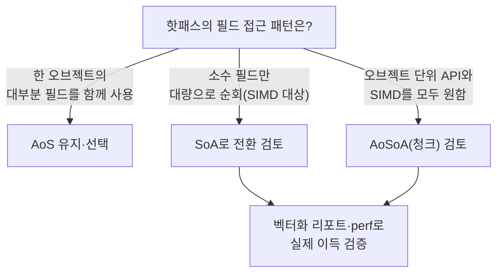

**AoS vs SoA 데이터 레이아웃**은 같은 데이터를 "오브젝트 단위로 묶어 배열로 둘 것인가"(Array of Structures) 아니면 "필드 단위로 쪼개 배열로 둘 것인가"(Structure of Arrays)의 선택이며, 이 결정 하나로 같은 알고리즘의 캐시 미스 횟수와 SIMD 벡터화 가능 여부가 통째로 달라집니다. 이전 장에서 다룬 할당 전략과 `std::pmr`은 "얼마나 자주, 어디서 할당하는가"를 다뤘다면, 이 장은 그렇게 확보한 메모리 안에서 "필드를 어떤 순서로 배치하는가"를 다룹니다. 물리 시뮬레이션의 파티클 배열이든 게임 엔진의 엔티티 컴포넌트든, 핫패스에서 초당 수백만 번 순회하는 배열이 있다면 AoS/SoA 선택은 코드 한 줄 바꾸는 것보다 큰 폭의 성능 차이를 만듭니다.

## 이 장을 읽기 전에

**전제 지식**: 이 장은 [04장: std::pmr 실전 활용](/post/memory-optimization/pmr-polymorphic-allocator-practical/)에서 다룬 컨테이너·할당자 기초와, [15장: 메모리·수명·캐시 라인 직관](/post/memory-optimization/memory-lifetime-cache-line-intuition-fundamentals/)에서 다룬 "CPU는 캐시 라인 단위로 메모리를 가져온다"는 직관을 전제로 합니다. `std::vector`의 연속 메모리 개념과 캐시 라인이 보통 64바이트라는 정도만 알면 충분합니다.

**이 장의 깊이**: **중급**입니다. AoS/SoA의 메모리 배치 차이, 캐시·SIMD에 미치는 영향, 언제 어느 레이아웃을 선택할지 판단 기준, 그리고 실무 타협안인 AoSoA(하이브리드)까지 다룹니다. **다루지 않는 것**: 캐시 라인 자체의 동작 원리와 순차/스트라이드 접근 최적화 일반론은 [06장: 캐시 친화적 접근 패턴](/post/memory-optimization/cache-friendly-access-patterns/)에서, 구조체 내부 패딩·정렬 규칙은 [07장: 구조체 패딩과 정렬](/post/memory-optimization/struct-padding-alignment-optimization/)에서 다루므로 이 장에서는 반복하지 않습니다. SIMD 인트린식을 직접 손으로 작성하는 기법도 이 트랙의 범위 밖입니다.

## 당신의 수준에 맞는 경로

| 수준 | 읽을 부분 | 핵심 목표 |
|------|---------|---------|
| **입문** | "역사와 배경" ~ "AoS와 SoA의 메모리 배치" | 두 레이아웃이 메모리에서 실제로 어떻게 다른지 그림으로 이해 |
| **중급** | "캐시·SIMD에 미치는 영향" ~ "흔한 오개념" | 캐시 미스·벡터화 관점에서 언제 성능 차이가 발생하는지 파악 |
| **실무 적용** | "판단 기준" ~ "비판적 시각" | 접근 패턴에 맞는 레이아웃 선택과 마이그레이션 비용 판단 |

---

## 역사와 배경

**Structure of Arrays**라는 용어와 실천은 1970–80년대 벡터 프로세서(Cray 등) 시절 과학computing에서부터 이어져 왔습니다. 벡터 유닛이 연속된 메모리를 한 번에 읽어 여러 연산을 동시에 수행하려면 데이터가 필드별로 연속해 있어야 했기 때문입니다. 이 관행은 2000년대 이후 게임 업계에서 <strong>데이터 지향 설계(Data-Oriented Design)</strong>라는 이름으로 재조명되었는데, 특히 Insomniac Games의 엔지니어 Mike Acton이 CppCon 2014 발표 "Data-Oriented Design and C++"에서 "하드웨어가 실제로 어떻게 동작하는지에 맞춰 데이터를 배치하라"는 원칙을 강하게 주장하면서 널리 알려졌습니다. 같은 시기 게임 엔진의 **엔티티 컴포넌트 시스템(ECS)** 설계도 컴포넌트별로 배열을 분리해 저장하는 방식을 채택하면서 SoA적 사고방식이 게임/시뮬레이션 코드베이스의 표준 패턴 중 하나로 자리 잡았습니다. 최근에는 C++26에 `<simd>` 헤더가 표준화되면서(P1928, WG21 문서 기준) 명시적 SIMD 프로그래밍이 언어 차원에서 지원되기 시작했고, 이 라이브러리는 연속된 메모리에서 로드/스토어하는 것을 전제로 설계되어 있어 SoA류 레이아웃의 중요성이 다시 부각되고 있습니다. 다만 2026년 중반 기준으로 GCC의 `<simd>` 구현은 일부 기능(`simd.loadstore`, `simd.permute.dynamic` 등)이 아직 미완성 상태이므로, 컴파일러별 지원 범위는 구현 정의로 보고 실제 사용 전 확인이 필요합니다.

## AoS와 SoA의 메모리 배치

<strong>AoS(Array of Structures)</strong>는 하나의 오브젝트가 가진 여러 필드를 하나의 struct로 묶고, 그 struct를 배열(또는 `std::vector`)로 나열하는 방식입니다. <strong>SoA(Structure of Arrays)</strong>는 반대로 각 필드를 독립된 배열로 두고, 같은 인덱스가 "같은 오브젝트"를 가리키는 방식입니다. 아래는 파티클(위치·속도·질량)을 예로 든 개념 배치입니다.

```text
AoS 메모리 (파티클 4개, 필드 x,y,z,mass):
[x0 y0 z0 mass0][x1 y1 z1 mass1][x2 y2 z2 mass2][x3 y3 z3 mass3] ...
  -> 캐시 라인 하나에 "한 파티클의 모든 필드"가 함께 실림

SoA 메모리 (동일 데이터):
x:    [x0 x1 x2 x3 x4 x5 x6 x7 ...]
y:    [y0 y1 y2 y3 y4 y5 y6 y7 ...]
z:    [z0 z1 z2 z3 z4 z5 z6 z7 ...]
mass: [mass0 mass1 mass2 mass3 ...]
  -> 캐시 라인 하나에 "한 필드의 여러 파티클 값"이 함께 실림
```

이 차이는 실제 C++ 타입으로 옮기면 더 분명해집니다. AoS는 `std::vector<ParticleAoS>` 하나면 되지만, SoA는 필드 수만큼 `std::vector`가 늘어나고 이들을 같은 길이로 유지해야 합니다.

```cpp
#include <vector>
#include <cstdint>
#include <cstddef>

// AoS: 파티클 하나 = struct 하나. 오브젝트 단위 접근에 자연스럽다.
struct ParticleAoS {
  float x, y, z;        // 위치
  float vx, vy, vz;     // 속도
  float mass;
  std::uint32_t flags;
};
using ParticlesAoS = std::vector<ParticleAoS>;

// SoA: 필드 단위 배열. 필드별로 독립된 연속 버퍼를 가진다.
struct ParticlesSoA {
  std::vector<float> x, y, z;
  std::vector<float> vx, vy, vz;
  std::vector<float> mass;
  std::vector<std::uint32_t> flags;

  void resize(std::size_t n) {
    x.resize(n); y.resize(n); z.resize(n);
    vx.resize(n); vy.resize(n); vz.resize(n);
    mass.resize(n);
    flags.resize(n);
  }
};
```

SoA 쪽은 `resize`처럼 "모든 배열을 같은 길이로 유지"하는 책임이 코드에 명시적으로 들어간다는 점에 주의합니다. 필드 하나만 `push_back`하고 나머지를 빠뜨리면 인덱스가 어긋나 조용히 잘못된 값을 읽는 버그로 이어집니다.

## 캐시·SIMD에 미치는 영향

두 레이아웃의 실질적 차이는 **한 번의 순회에서 실제로 몇 개의 필드를 쓰는가**에서 갈립니다. 위치 적분(integrate)처럼 `x,y,z,vx,vy,vz`만 쓰고 `mass`, `flags`는 건드리지 않는 루프라면, AoS는 캐시 라인에 실려 온 `mass`, `flags`까지 대역폭을 낭비하지만 SoA는 필요한 필드의 배열만 스트리밍하므로 같은 작업에 더 적은 캐시 라인을 사용합니다. 반대로 "이 파티클의 모든 필드를 한 번씩 다 쓰는" 작업(직렬화, 디버그 출력 등)이라면 AoS가 오브젝트 하나를 한 번의 캐시 라인 접근으로 가져올 수 있어 오히려 유리합니다.

```cpp
// AoS: 오브젝트 단위 순회. 캐시 라인마다 이번 루프에 쓰지 않는 mass·flags도 함께 실려온다.
void integrate_aos(ParticlesAoS& p, float dt) {
  for (auto& particle : p) {
    particle.x += particle.vx * dt;
    particle.y += particle.vy * dt;
    particle.z += particle.vz * dt;
  }
}

// SoA: 필드 단위 순회. 위치·속도 6개 배열만 스트리밍되고 mass·flags는 캐시에 올라오지 않는다.
void integrate_soa(ParticlesSoA& p, float dt) {
  const std::size_t n = p.x.size();
  for (std::size_t i = 0; i < n; ++i) {
    p.x[i]  += p.vx[i]  * dt;
    p.y[i]  += p.vy[i]  * dt;
    p.z[i]  += p.vz[i]  * dt;
  }
}
```

`integrate_soa`의 루프는 각 배열이 유닛 스트라이드(unit-stride, 연속 접근)로 읽히므로 컴파일러 자동 벡터화(auto-vectorization)가 붙기 쉽습니다. `integrate_aos`는 `vx`, `vy`, `vz`가 struct 안에서는 연속이지만 다음 파티클의 `vx`까지는 `sizeof(ParticleAoS)`만큼 건너뛰어야 하므로, SIMD 레지스터를 채우려면 gather 계열 명령이나 셔플이 필요해 자동 벡터화가 되더라도 이득이 작거나 아예 스칼라 코드로 남는 경우가 흔합니다. 다만 AVX2 이후 세대는 gather 명령을 하드웨어로 지원하므로, "AoS는 절대 벡터화되지 않는다"는 말은 과장이며 실제 이득은 컴파일러·타깃 아키텍처에 따라 다릅니다.

**측정 없이는 확신할 수 없는 영역**이므로, 아래는 두 레이아웃의 적분 루프를 비교하는 Google Benchmark 스켈레톤입니다. 벤치마크 설계 자체의 함정(워밍업, `DoNotOptimize`, 반복 횟수)은 [Tr.01: Microbenchmark 설계 원칙](/post/profiling-analysis/microbenchmark-design-principles/)과 [Google Benchmark 실전](/post/profiling-analysis/google-benchmark-practical/)을 참고합니다.

```cpp
#include <benchmark/benchmark.h>
#include <vector>
#include <cstdint>
#include <cstddef>

struct ParticleAoS {
  float x, y, z, vx, vy, vz, mass;
  std::uint32_t flags;
};
using ParticlesAoS = std::vector<ParticleAoS>;

struct ParticlesSoA {
  std::vector<float> x, y, z, vx, vy, vz, mass;
  std::vector<std::uint32_t> flags;
  void resize(std::size_t n) {
    x.resize(n); y.resize(n); z.resize(n);
    vx.resize(n); vy.resize(n); vz.resize(n);
    mass.resize(n); flags.resize(n);
  }
};

static void integrate_aos(ParticlesAoS& p, float dt) {
  for (auto& particle : p) {
    particle.x += particle.vx * dt;
    particle.y += particle.vy * dt;
    particle.z += particle.vz * dt;
  }
}

static void integrate_soa(ParticlesSoA& p, float dt) {
  const std::size_t n = p.x.size();
  for (std::size_t i = 0; i < n; ++i) {
    p.x[i] += p.vx[i] * dt;
    p.y[i] += p.vy[i] * dt;
    p.z[i] += p.vz[i] * dt;
  }
}

static void BM_IntegrateAoS(benchmark::State& state) {
  ParticlesAoS p(static_cast<std::size_t>(state.range(0)));
  for (auto _ : state) {
    integrate_aos(p, 0.016f);
    benchmark::DoNotOptimize(p.data());
  }
}
BENCHMARK(BM_IntegrateAoS)->Arg(1 << 16)->Arg(1 << 20);

static void BM_IntegrateSoA(benchmark::State& state) {
  ParticlesSoA p;
  p.resize(static_cast<std::size_t>(state.range(0)));
  for (auto _ : state) {
    integrate_soa(p, 0.016f);
    benchmark::DoNotOptimize(p.x.data());
  }
}
BENCHMARK(BM_IntegrateSoA)->Arg(1 << 16)->Arg(1 << 20);

BENCHMARK_MAIN();
```

`g++ -O2 -march=native bench.cpp -lbenchmark -lpthread -o bench`로 빌드하고 파티클 수가 캐시 크기를 넘어서는 구간(`1<<20`)에서 실행하면(x86-64, GCC 13 기준 예시), `BM_IntegrateSoA`가 `BM_IntegrateAoS`보다 빠르게 나오는 경우가 흔합니다. 다만 배율은 필드 수·CPU 세대·컴파일러 자동 벡터화 여부에 따라 크게 달라지므로 "몇 배 빠르다"는 값 자체를 외우지 말고, `-fopt-info-vec-optimized`(GCC) 또는 `-Rpass=loop-vectorize`(Clang)로 실제 벡터화 여부를 확인하고 `perf stat -e cache-misses,L1-dcache-load-misses`로 캐시 미스 차이를 직접 재현해 결론을 내립니다.

## AoSoA: 실무 타협안

순수 SoA는 "오브젝트 하나"라는 단위가 코드에서 사라져 API가 불편해지고, 순수 AoS는 SIMD 활용이 제한됩니다. <strong>AoSoA(Array of Structures of Arrays)</strong>는 이 둘 사이에서, 고정 크기 청크(흔히 SIMD 레지스터 폭이나 캐시 라인 크기에 맞춘 4/8/16개 단위) 안에서는 SoA로 배치하고, 청크 자체는 배열로 나열하는 절충안입니다.

```cpp
#include <vector>

// AoSoA: 8개 파티클을 한 블록으로 묶어 블록 내부는 SoA, 블록끼리는 배열로 나열
struct ParticleBlock8 {
  float x[8], y[8], z[8];
  float vx[8], vy[8], vz[8];
};
using ParticlesAoSoA = std::vector<ParticleBlock8>;  // size() * 8개 파티클
```

블록 내부는 연속 배열이라 SIMD 레지스터를 그대로 채울 수 있고, 블록 단위로는 여전히 "8개짜리 묶음"이라는 지역성 있는 단위가 남아 있어 순수 SoA보다 코드 복잡도가 낮습니다. 다만 블록 크기(8, 16 등)를 하드웨어 SIMD 폭에 맞추는 감각이 필요하고, 파티클 개수가 블록 크기의 배수가 아닐 때 마지막 블록을 처리하는 경계 코드가 추가로 필요합니다. 여러 ECS(Entity Component System) 구현이 컴포넌트별 배열을 두는 것도 큰 틀에서는 이 SoA/AoSoA적 사고방식을 실무 아키텍처에 반영한 사례입니다.

## 흔한 오개념

<strong>"SoA가 항상 AoS보다 빠르다"</strong>는 사실이 아닙니다. 알고리즘이 한 오브젝트의 필드 대부분을 함께 쓴다면, AoS가 오브젝트 하나를 캐시 라인 하나(또는 소수)로 가져오는 반면 SoA는 필드 수만큼 서로 다른 캐시 라인을 열어야 해서 오히려 불리할 수 있습니다. Algorithmica의 AoS/SoA 벤치마크는 이런 조건에서 AoS가 SoA보다 최대 16배까지 적은 캐시 라인 페치로 끝나는 사례를 보여주며, 배열 크기가 2의 거듭제곱에 가까울 때 SoA 쪽에서 캐시 연관성(associativity) 충돌로 인한 추가 미스가 발생할 수 있음도 지적합니다.

<strong>"AoS를 SoA로 바꾸는 건 성능에만 영향을 준다"</strong>도 오개념입니다. SoA로 바꾸면 "파티클 하나"를 가리키는 단일 참조가 사라지고 인덱스로만 오브젝트를 가리키게 되므로, 함수 시그니처·직렬화 코드·디버거에서 값 확인하는 방식까지 함께 바뀝니다. 필드를 하나 추가하거나 삭제할 때도 관련된 모든 배열을 동시에 갱신해야 해서 리팩토링 범위가 AoS보다 넓어집니다.

<strong>"SoA로만 바꾸면 자동 벡터화는 저절로 따라온다"</strong>도 성급한 결론입니다. 유닛 스트라이드 접근은 자동 벡터화의 필요조건일 뿐입니다. 포인터 앨리어싱(포인터 두 개가 같은 메모리를 가리킬 수 있다는 가정), 루프 내부의 함수 호출·분기, 정렬되지 않은 시작 주소는 여전히 컴파일러의 벡터화를 막을 수 있으므로, 레이아웃을 바꾼 뒤에는 반드시 컴파일러의 벡터화 리포트나 어셈블리로 확인합니다.

## 판단 기준

| 상황 | 권장 레이아웃 | 이유 |
|------|--------------|------|
| 소수 필드만 대량 순회(물리 적분, 필터링, 집계) | SoA | 필요한 필드만 스트리밍, 자동 벡터화에 유리 |
| 오브젝트 단위로 대부분 필드를 함께 사용(직렬화, 디버그 출력, 게임 로직 한 틱) | AoS | 캐시 라인 하나로 오브젝트 전체 확보 |
| SIMD 커널과 오브젝트 단위 API를 모두 유지해야 함 | AoSoA(청크) | SIMD 폭에 맞춘 블록 내부 SoA + 블록 단위 지역성 |
| 필드 추가/삭제가 잦고 팀 규모가 작아 유지보수 비용이 큼 | AoS | 리팩토링 범위가 좁고 구조가 단순 |
| 파티클/엔티티 수가 적어(수백–수천 개 이하) 캐시에 다 들어감 | 차이가 작음 | 우선 측정 후 결정, 레이아웃보다 다른 병목 확인 |

### 자주 하는 실수

- **측정 없이 SoA로 먼저 리팩토링**: 필드 사용 패턴을 확인하지 않고 "SoA가 빠르다더라"만 믿고 바꾸면, 오브젝트 단위 접근이 많은 코드에서는 오히려 느려지고 복잡도만 늘어납니다.
- **SoA 배열 길이 불일치**: 필드 배열 중 하나만 `resize`/`push_back`하고 나머지를 놓치면 인덱스가 어긋나 조용히 잘못된 값을 읽습니다. 필드 배열을 감싸는 헬퍼(위 `ParticlesSoA::resize`처럼)로 길이를 강제합니다.
- **벡터화 여부를 가정만 함**: SoA로 바꿨다고 자동으로 SIMD가 붙는다고 가정하지 말고, 컴파일러 리포트로 실제 벡터화 여부를 확인합니다.
- **AoSoA 블록 크기를 임의로 선택**: SIMD 레지스터 폭·캐시 라인 크기와 무관한 블록 크기를 고르면 AoSoA의 이점이 사라집니다.

## 비판적 시각: 한계와 트레이드오프

AoS/SoA 논의는 종종 "SoA가 정답"이라는 단순화로 소비되지만, 실제로는 접근 패턴에 강하게 의존하는 트레이드오프입니다. Algorithmica의 실측처럼 오브젝트 단위 접근이 지배적인 워크로드에서는 AoS가 우세할 수 있고, 배열 크기가 2의 거듭제곱 근처일 때 SoA가 캐시 연관성 충돌로 예상보다 느려지는 사례도 보고되어 있습니다. 또한 SoA로의 마이그레이션은 캡슐화를 깨고 인덱스 기반 접근을 강제하므로, 코드 가독성·유지보수 비용이라는 눈에 보이지 않는 대가를 치릅니다. C++26의 `<simd>` 표준화는 명시적 SIMD 프로그래밍의 문턱을 낮추지만, 2026년 중반 기준 컴파일러 구현이 완전하지 않은 상태이므로 이를 근거로 지금 당장 레이아웃을 재설계하는 것은 시기상조일 수 있습니다. 결국 AoS/SoA 선택은 프로파일러가 가리키는 실제 핫패스와, 그 핫패스가 "몇 개의 필드를 얼마나 자주 함께 쓰는가"라는 구체적 질문에 답한 뒤에 내려야 하는 결정입니다.



## 마무리

- [ ] AoS와 SoA의 메모리 배치 차이를 그림으로 그려 설명할 수 있다.
- [ ] 캐시 라인·SIMD 벡터화 관점에서 두 레이아웃의 장단점을 근거를 들어 설명할 수 있다.
- [ ] "SoA가 항상 빠르다" 등 흔한 오개념을 반례와 함께 교정할 수 있다.
- [ ] 접근 패턴(소수 필드 대량 순회 vs 오브젝트 단위 전체 사용)에 따라 AoS·SoA·AoSoA 중 하나를 근거 있게 선택할 수 있다.
- [ ] 레이아웃 변경 전후를 벤치마크·벡터화 리포트·캐시 미스 카운터로 검증하는 절차를 설명할 수 있다.

**이전 장**: [std::pmr 실전 활용](/post/memory-optimization/pmr-polymorphic-allocator-practical/) (챕터 04)

다음 장에서는 **캐시 친화적 접근 패턴**을 다룹니다. 이 장에서 다룬 필드 배치의 이점이 실제로 발휘되려면 순차 접근, stride, batching 같은 접근 패턴 설계가 뒷받침되어야 하므로, AoS/SoA 선택과 접근 패턴 설계를 함께 적용하는 방법을 이어서 살펴봅니다.

→ [캐시 친화적 접근 패턴](/post/memory-optimization/cache-friendly-access-patterns/) (챕터 06)
