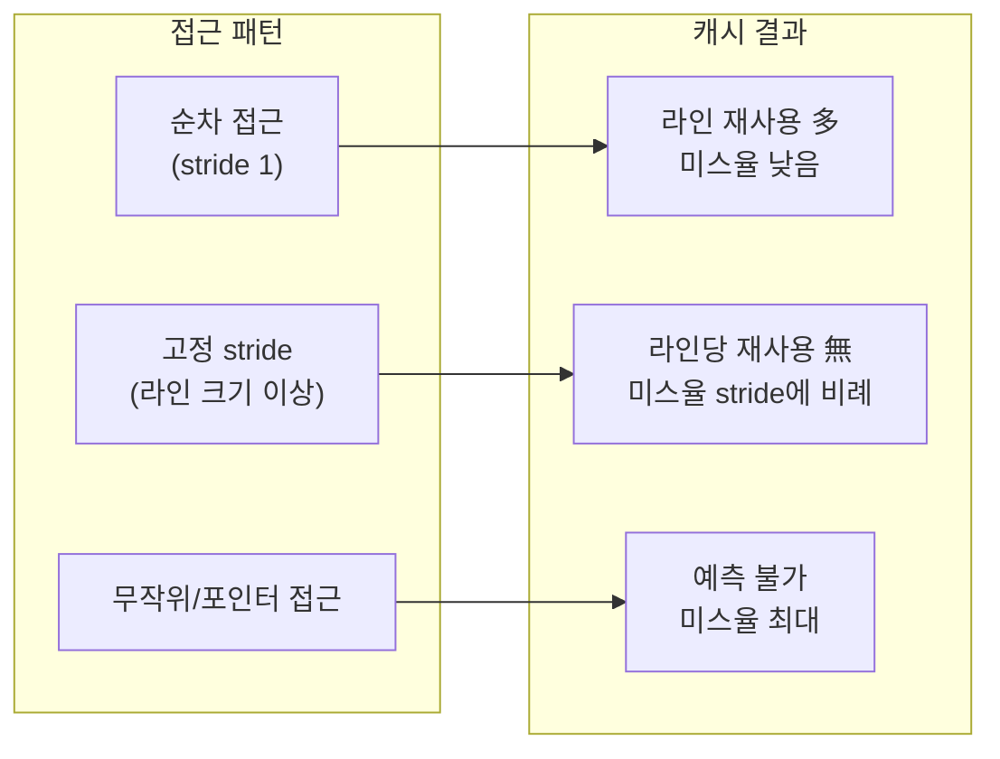

**캐시 친화적 접근 패턴**이란 CPU가 메모리를 캐시 라인 단위로 적재한다는 하드웨어 특성에 맞춰, 데이터를 어떤 순서로 얼마만큼씩 묶어 읽고 쓸지를 설계함으로써 로드·스토어가 캐시 미스를 최소한으로 만나게 하는 기법이다. 같은 자료를 같은 알고리즘으로 처리하더라도 순회 순서 하나만 바꾸면 실행 시간이 몇 배씩 달라지는 경우가 드물지 않은데, 원인은 대개 알고리즘의 시간 복잡도가 아니라 메모리 접근 패턴이 하드웨어 프리페처와 캐시 계층에 얼마나 협조적이었는가에 있다. [05장에서 다룬 AoS/SoA](/post/memory-optimization/aos-vs-soa-data-layout/) 선택이 "데이터를 어떻게 배치할까"를 결정한다면, 이 장은 그렇게 배치된 데이터를 "어떤 순서로, 얼마나 묶어서" 순회해야 그 배치가 실제로 캐시 이득으로 이어지는지를 다룬다.

## 이 장을 읽기 전에

이 장은 [15장: 메모리·수명·캐시 라인 직관](/post/memory-optimization/memory-lifetime-cache-line-intuition-fundamentals/)에서 잡은 "캐시 라인 단위 적재", "공간·시간 지역성" 감각과 [05장: AoS vs SoA 데이터 레이아웃](/post/memory-optimization/aos-vs-soa-data-layout/)의 레이아웃 선택 기준을 전제로 한다. 아직 두 개념이 낯설다면 먼저 읽고 오는 편이 이해가 빠르다. 이 장의 깊이는 **중급**으로, 순차 접근이 빠른 이유·stride가 캐시 미스에 미치는 영향·batching과 루프 타일링으로 캐시 용량 한계를 다루는 전략까지 다룬다. **다루지 않는 것**은 다음과 같다. 필드를 어떻게 나눠 배치할지(AoS/SoA 자체의 선택 기준)는 05장, 구조체 내부의 패딩·정렬 계산은 [07장](/post/memory-optimization/struct-padding-alignment-optimization/)에 위임한다. 소프트웨어 프리페치 인트린식·SIMD 벡터화·분기 예측 같은 명령 수준 튜닝은 이 트랙의 범위 밖(CPU·극한 최적화 트랙)이므로 이 장에서는 개념적 필요성만 짚고 깊이 들어가지 않는다. false sharing과 락 경합은 동시성 트랙의 주제다.

## 당신의 수준에 맞는 경로

| 수준 | 읽을 부분 | 핵심 목표 |
|------|---------|---------|
| **초보자** | "순차 접근과 하드웨어 프리페처" ~ "stride 패턴과 캐시 라인 활용률" | 순차 접근이 빠른 이유와 stride가 미스율을 바꾸는 원리 이해 |
| **중급자** | "batching과 루프 타일링" ~ "흔한 오개념" | 캐시 용량을 넘는 데이터를 블록 단위로 나눠 처리하는 전략 습득 |
| **전문가** | "판단 기준" ~ "비판적 시각" | 패턴 선택의 트레이드오프와 마이크로벤치마크의 한계 판단 |

---

## 배경: 지역성 원리에서 캐시 블로킹까지

<strong>지역성(locality of reference)</strong>은 프로그램이 짧은 시간 동안 좁은 주소 범위에 반복해서 접근하는 경향을 가리키며, Peter Denning이 1960년대 후반 워킹 셋 모델을 정식화하며 함께 다듬은 개념으로 알려져 있다. 이 원리가 있었기에 "자주 쓰는 것을 가까이, 가까운 것을 함께 가져온다"는 캐시 설계가 성립했다. 하드웨어 쪽에서는 1990년대 후반부터 스트림 프리페처(stream prefetcher)가 프로세서에 들어오기 시작해, 순차·정규 stride 접근 패턴을 실행 중에 감지하고 다음에 필요할 캐시 라인을 미리 당겨오는 방식이 일반화되었다. 소프트웨어 쪽에서는 Lam, Rothberg, Wolf가 1991년 ASPLOS에서 발표한 블록 알고리즘의 캐시 성능 연구가 행렬 곱셈 같은 반복적 수치 연산을 캐시 크기에 맞춰 나눠 처리하는 **루프 타일링(loop tiling/blocking)** 기법의 이론적 근거를 제시했다. 이 장에서 다루는 순차 접근·stride·batching은 결국 이 두 축, 즉 "하드웨어 프리페처가 예측할 수 있는 패턴으로 접근하기"와 "캐시 용량을 넘는 데이터는 나눠서 재사용하기"로 수렴한다.

## 순차 접근과 하드웨어 프리페처

CPU의 스트림 프리페처는 최근 몇 번의 메모리 접근 주소를 관찰해 일정한 간격(stride)이 반복되면 그 패턴을 추정하고, 실제 로드 명령이 도착하기 전에 다음 캐시 라인들을 미리 적재한다. 배열을 인덱스 0부터 끝까지 순서대로 읽는 순차 접근은 이 감지가 가장 쉬운 경우이고, 프리페처가 몇 번의 접근만으로 패턴을 확정하면 이후 접근은 대부분 캐시에 이미 올라온 상태에서 이뤄진다. 반대로 포인터를 따라가며 다음 노드의 주소를 그때그때 계산해야 하는 연결 리스트 순회는 프리페처가 다음 주소를 예측할 근거가 없어 매 접근이 메모리 지연을 그대로 드러낸다.

```cpp
#include <vector>
#include <numeric>
#include <random>

// 개념 스케치: 같은 원소 집합을 두 가지 순서로 방문
long sum_sequential(const std::vector<int>& data) {
  long total = 0;
  for (std::size_t i = 0; i < data.size(); ++i) total += data[i];  // 프리페처가 예측하기 쉬운 패턴
  return total;
}

long sum_shuffled(const std::vector<int>& data, const std::vector<std::size_t>& order) {
  long total = 0;
  for (std::size_t idx : order) total += data[idx];  // idx가 무작위 순서라 프리페처가 다음 라인을 예측 못 함
  return total;
}
```

두 함수는 같은 데이터를 같은 횟수만큼 더하지만, `order`를 무작위로 섞어 두면 `sum_shuffled`는 프리페처의 도움을 받지 못해 `sum_sequential`보다 눈에 띄게 느려지는 경우가 흔하다. 다만 이 차이는 데이터 크기가 캐시보다 커서 접근마다 실제로 캐시 미스가 나야 드러나므로, 작은 배열에서는 전부 캐시에 상주해 차이가 거의 없을 수 있다는 점에 주의한다.

## stride 패턴과 캐시 라인 활용률

**stride**는 연속된 두 접근 사이의 주소 간격을 말한다. 캐시 라인이 64바이트이고 4바이트 정수를 stride 1(다음 원소)로 읽으면 한 캐시 라인에 담긴 16개의 정수를 모두 활용하지만, stride가 16 이상(64바이트 이상)이 되면 접근할 때마다 새 캐시 라인을 열어야 해서 라인당 활용률이 1/16로 떨어진다. 구조체 배열(AoS)에서 특정 필드 하나만 순회하는 코드가 캐시 효율이 나쁜 이유도 결국 stride 문제로 환원되는데, 구조체 크기가 캐시 라인보다 크면 필드 하나를 읽기 위해 전체 라인을 적재하고 나머지는 버리게 되기 때문이다. 이 문제를 레이아웃 자체로 해결하는 방법은 05장의 SoA 전환이고, 여기서는 "레이아웃을 바꾸지 않고 순회 순서만 조정할 때 stride가 어떻게 성능에 반영되는지"를 벤치마크로 확인한다.

```cpp
#include <benchmark/benchmark.h>
#include <vector>
#include <cstdint>

// 접근 횟수(touches)를 고정하고 stride만 바꿔가며 접근당 비용을 비교한다.
static void BM_StrideAccess(benchmark::State& state) {
  const std::size_t stride = static_cast<std::size_t>(state.range(0));
  const std::size_t touches = 1 << 20;              // 항상 100만 번 접근
  const std::size_t n = touches * stride + 1024;    // stride에 맞춰 배열을 넉넉히 확보
  std::vector<int32_t> data(n, 1);
  for (auto _ : state) {
    int64_t sum = 0;
    for (std::size_t i = 0; i < touches; ++i) sum += data[i * stride];
    benchmark::DoNotOptimize(sum);
  }
}
BENCHMARK(BM_StrideAccess)->Arg(1)->Arg(4)->Arg(16)->Arg(64)->Arg(256)->Arg(1024);

BENCHMARK_MAIN();
```

`g++ -O2 -std=c++17 stride_bench.cpp -lbenchmark -lpthread`로 빌드해 x86-64 리눅스에서 실행하면(캐시 라인 64바이트, GCC 13 `-O2` 기준 예시), stride 1과 4(각각 4·16바이트 간격)는 한 라인 안에서 여러 원소를 재사용해 접근당 비용이 낮고, stride 16(정확히 64바이트) 근처부터는 접근마다 새 라인을 여는 비용이 고정적으로 붙어 접근당 시간이 계단식으로 늘어난다. stride 1024(4KB, 전형적 페이지 크기와 근접)에서는 캐시 미스에 더해 TLB 미스까지 겹쳐 추가로 느려지는 경우가 있는데, 페이지 단위 접근 비용은 [13장: Virtual Memory 관리 힌트](/post/memory-optimization/virtual-memory-hints-madvise-mte/)에서 더 다룬다. 정확한 배율은 캐시 크기·프리페처 세대·컴파일러 최적화에 따라 달라지므로, 위 스켈레톤을 대상 플랫폼에서 직접 돌려 확인하는 것이 안전하다. 마이크로벤치마크 설계 원칙 자체는 [Tr.01: Microbenchmark 설계 원칙](/post/profiling-analysis/microbenchmark-design-principles/)과 [Google Benchmark 실전](/post/profiling-analysis/google-benchmark-practical/)을 참고한다.



## batching과 루프 타일링

처리할 데이터가 L1·L2 캐시 용량보다 크면, 한 번에 전체를 순회하는 코드는 같은 데이터를 여러 번 다시 읽어야 할 때마다 캐시에서 밀려난 라인을 다시 적재하는 비용을 반복해서 낸다. <strong>배칭(batching)</strong>은 이런 반복 재사용 구간을 캐시 용량 안에 들어오는 작은 블록으로 잘라, 블록 하나를 캐시에 올린 김에 그 안에서 가능한 모든 재사용을 끝내고 다음 블록으로 넘어가는 전략이다. 행렬 곱셈이 이 전략을 설명하는 데 가장 흔히 쓰이는데, 이유는 `k` 루프마다 두 번째 행렬의 열 전체를 stride `n`으로 훑어야 해서 순진한 삼중 루프가 stride 문제를 그대로 가지고 있기 때문이다.

```cpp
#include <vector>
#include <cstddef>

using Matrix = std::vector<double>;  // n x n, row-major 저장

// 순진한 구현: b를 열 방향(stride n)으로 훑어 n이 커지면 매 원소가 새 캐시 라인
void multiply_naive(const Matrix& a, const Matrix& b, Matrix& c, std::size_t n) {
  for (std::size_t i = 0; i < n; ++i)
    for (std::size_t j = 0; j < n; ++j) {
      double sum = 0.0;
      for (std::size_t k = 0; k < n; ++k) sum += a[i * n + k] * b[k * n + j];
      c[i * n + j] = sum;
    }
}
```

`multiply_naive`는 안쪽 `k` 루프에서 `a`는 stride 1로 읽지만 `b`는 stride `n`으로 읽으므로, `n`이 커져 한 행이 캐시 라인 여러 개를 차지하는 순간부터 `b` 접근이 사실상 매번 새 라인을 여는 패턴이 된다. 아래는 같은 계산을 `block` 크기 단위로 잘라, 각 블록이 캐시에 머무는 동안 관련된 부분합을 모두 누적하도록 재구성한 버전이다.

```cpp
#include <vector>
#include <algorithm>
#include <cstddef>

using Matrix = std::vector<double>;

// i0/k0/j0로 순회를 block 크기 타일로 나눠 각 타일이 캐시에 머무는 동안 재사용을 극대화
void multiply_blocked(const Matrix& a, const Matrix& b, Matrix& c, std::size_t n, std::size_t block) {
  for (std::size_t i0 = 0; i0 < n; i0 += block)
    for (std::size_t k0 = 0; k0 < n; k0 += block)
      for (std::size_t j0 = 0; j0 < n; j0 += block)
        for (std::size_t i = i0; i < std::min(i0 + block, n); ++i)
          for (std::size_t k = k0; k < std::min(k0 + block, n); ++k) {
            const double a_ik = a[i * n + k];
            for (std::size_t j = j0; j < std::min(j0 + block, n); ++j) c[i * n + j] += a_ik * b[k * n + j];
          }
}
```

블록 크기 `block`은 `a`·`b`·`c` 세 타일이 동시에 L1(대개 32~48KB)이나 L2 캐시에 들어오도록 정하는데, `double` 기준 `block=32`면 타일 하나가 8KB이므로 세 타일 합이 24KB 안팎이 되어 대부분의 L1에 들어간다. 다만 정확한 최적 크기는 캐시 크기·연관도(way)·다른 스레드와의 캐시 공유에 따라 달라지므로 "이 값이 정답"이라고 단정하지 말고, `perf stat -e cache-misses,cache-references`나 heaptrack 같은 도구로 실제 미스율을 확인하며 블록 크기를 조정하는 편이 안전하다. 타일링은 코드 가독성과 유지보수 비용을 늘리므로, 데이터가 캐시보다 명백히 크고 반복 재사용이 실제로 일어나는 핫패스에서만 적용을 검토한다.

## 흔한 오개념

- **"SoA로 바꾸면 캐시 문제는 끝난다"**: 05장의 레이아웃 전환은 stride를 줄이는 조건을 만들 뿐이며, 그 배열을 무작위 인덱스나 포인터로 흩어서 접근하면 SoA라도 캐시 이득이 사라진다. 레이아웃과 접근 순서는 함께 설계해야 한다.
- **"하드웨어 프리페처가 알아서 다 예측해 준다"**: 스트림 프리페처가 동시에 추적할 수 있는 스트림 개수와 인식 가능한 stride 범위는 유한하고 세대·벤더마다 다르다(구현 정의). 여러 배열을 동시에 순회하거나 stride가 매우 크면 프리페처가 패턴을 놓치는 경우가 흔하다.
- **"벡터를 인덱스로만 접근하면 항상 안전하다"**: `std::vector`를 인덱스로 접근해도 그 인덱스 값 자체가 무작위(예: 정렬 전 permutation, 해시 버킷 순회)라면 포인터 체이싱과 다를 바 없는 접근 패턴이 된다. 컨테이너 타입이 아니라 실제 방문 순서가 캐시 성능을 결정한다.

## 판단 기준

| 상황 | 권장 | 비권장 |
|------|------|--------|
| 대량 데이터를 한 번에 순회 | 연속 컨테이너를 인덱스 증가 순으로 순회 | 포인터 체이싱(연결 리스트 등)으로 순회 |
| 구조체 중 일부 필드만 반복 접근 | 05장의 SoA 분리로 stride 자체를 줄임 | 전체 struct를 로드하고 한 필드만 사용 |
| 처리 데이터가 L1/L2보다 큼 | 캐시에 맞는 블록 단위로 잘라 재사용 극대화 | 전체 범위를 한 번에 순회해 캐시 스레싱 유발 |
| 접근 순서를 코드에서 통제 불가 | 정렬·재배치로 접근 순서를 바꾸는 전처리 검토 | 무대책으로 방치 후 "메모리가 느리다"고 결론 |
| 작은 원소를 반복 호출로 처리 | 배치(batch)로 묶어 호출 횟수·오버헤드 감소 | 원소마다 개별 함수 호출 반복 |

## 비판적 시각: 한계와 트레이드오프

캐시 친화적 패턴의 효과는 마이크로벤치마크에서 가장 극적으로 보이지만, 실제 애플리케이션에는 분기 예측 실패·다른 스레드와의 캐시 공유·시스템 콜 같은 다른 비용이 섞여 있어 벤치마크에서 관측한 배율이 그대로 재현되지 않는 경우가 많다. 루프 타일링처럼 명시적으로 블록을 나누는 최적화는 코드의 조건 분기와 인덱스 계산을 늘려 가독성과 유지보수 비용을 높이므로, 컴파일러가 이미 자동으로 벡터화·재배치를 잘 해내는 단순한 루프에 무리하게 적용하면 오히려 손해가 될 수 있다. 하드웨어 프리페처의 정확한 스트림 개수·인식 알고리즘은 벤더가 상세히 공개하지 않는 구현 세부 사항이라 "이 CPU는 스트림을 N개까지 추적한다"는 식의 단정은 세대가 바뀌면 틀리기 쉽고, 결론은 항상 대상 플랫폼에서의 재측정으로 검증해야 한다.

## 마무리

- 순차 접근이 하드웨어 프리페처와 협조하는 이유를 캐시 라인 단위 적재로 설명할 수 있다.
- stride가 캐시 라인 활용률에 미치는 영향을 계산하고, stride 실험을 벤치마크로 직접 재현할 수 있다.
- 데이터가 캐시 용량을 넘을 때 batching·루프 타일링으로 재사용을 늘리는 방법과 블록 크기 선택 기준을 안다.
- "레이아웃만 바꾸면 끝"이라는 오개념과 프리페처의 한계를 구분해서 설명할 수 있다.
- 순차 접근·SoA 분리·타일링 중 상황에 맞는 전략을 판단 기준 표로 선택할 수 있다.

**다음 장에서는** 구조체 내부의 **패딩과 정렬**을 다룬다. 이 장에서 다룬 stride·캐시 라인 활용률은 구조체 크기와 정렬 방식에 직접 좌우되므로, 필드 순서를 바꾸거나 정렬을 조정해 구조체 하나가 캐시 라인에 몇 개나 들어가는지를 계산하는 방법으로 자연스럽게 이어진다.

→ [구조체 패딩과 정렬 최적화](/post/memory-optimization/struct-padding-alignment-optimization/)

### 더 읽을 거리

- [LWN.net: What every programmer should know about memory, Part 1](https://lwn.net/Articles/250967/) — Ulrich Drepper(Red Hat, 2007)의 원문을 게재한 문서로, 프리페칭과 지연시간 은폐를 다룬 2.2.5절을 포함한다.
- [Intel 64 and IA-32 Architectures Optimization Reference Manual](https://cdrdv2-public.intel.com/814199/356477-Optimization-Reference-Manual-V2-002.pdf) — 1차 수준 데이터 캐시·2차 캐시 하드웨어 프리페처 동작을 설명하는 공식 매뉴얼.
- [Wikipedia: Locality of reference](https://en.wikipedia.org/wiki/Locality_of_reference) — 공간·시간 지역성의 정의와 캐싱·프리페칭과의 연결을 정리한 참고 자료.
