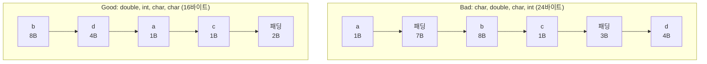

**구조체 패딩과 정렬**이란 컴파일러가 각 멤버를 그 타입이 요구하는 정렬 경계(alignment boundary)에 맞춰 배치하기 위해 멤버 사이와 구조체 끝에 채워 넣는 빈 바이트, 그리고 그 배치 규칙 자체를 가리킨다. 멤버 선언 순서를 조금만 바꿔도 같은 필드 구성의 구조체가 16바이트가 되기도, 24바이트가 되기도 하는데, 그 차이는 논리적으로는 아무 의미가 없는 패딩 바이트에서 나온다. 배열이나 벡터로 이 구조체를 수백만 개 순회하는 핫패스에서는 이 몇 바이트 차이가 캐시 라인 하나에 몇 개의 원소가 들어가는지를 바꾸고, 결국 메모리 대역폭과 실행 시간에 그대로 반영된다. 이 장은 패딩이 왜 생기는지를 정렬 규칙으로 설명하고, `alignas`/`alignof`로 정렬을 직접 제어하는 방법과 필드 재배치만으로 구조체 크기를 줄이는 실전 기법을 다룬다.

## 이 장을 읽기 전에

**전제 지식**: 이 장은 [06장: 캐시 친화적 접근 패턴](/post/memory-optimization/cache-friendly-access-patterns/)에서 다룬 "캐시 라인 단위 적재"와 stride 개념, 그리고 [15장: 메모리·수명·캐시 라인 직관](/post/memory-optimization/memory-lifetime-cache-line-intuition-fundamentals/)의 캐시 라인 감각을 전제로 한다. `sizeof`가 반환하는 값이 항상 멤버 크기의 단순 합이 아니라는 것 정도만 의심해 본 적이 있으면 충분하다.

**이 장의 깊이**: **중급**이다. 정렬 규칙이 패딩을 만드는 원리, 필드 재배치로 구조체 크기를 줄이는 방법, `alignas`/`alignof`의 사용법, `packed` 구조체의 트레이드오프까지 다룬다. **다루지 않는 것**은 다음과 같다. 필드를 어떤 배열 형태(AoS/SoA)로 나눌지의 거시적 레이아웃 선택은 [05장](/post/memory-optimization/aos-vs-soa-data-layout/), 순차·stride 접근 패턴 자체는 [06장](/post/memory-optimization/cache-friendly-access-patterns/)에서 다뤘으므로 반복하지 않는다. `alignas`로 캐시 라인 경계에 맞춰 false sharing을 피하는 기법은 이 장에서 메커니즘만 짚고, 락 경합·메모리 모델과 얽힌 깊은 분석은 동시성 트랙의 몫으로 남긴다. 비트필드의 상세 규칙과 네트워크 프로토콜 직렬화 포맷 설계도 이 장의 범위 밖이다.

## 당신의 수준에 맞는 경로

| 수준 | 읽을 부분 | 핵심 목표 |
|------|---------|---------|
| **초보자** | "정렬 규칙의 역사와 배경" ~ "패딩이 생기는 이유" | 패딩이 왜 필요한지, `sizeof`가 왜 필드 합과 다른지 이해 |
| **중급자** | "필드 재배치로 크기 줄이기" ~ "alignas와 alignof" | 재배치로 구조체를 줄이고 정렬을 직접 제어하는 방법 습득 |
| **전문가** | "packed 구조체와 트레이드오프" ~ "비판적 시각" | packed·ABI 호환성 트레이드오프와 도구 기반 검증 판단 |

---

## 정렬 규칙의 역사와 배경

**정렬(alignment)**은 특정 타입의 객체가 배치될 수 있는 주소가 그 타입의 크기(또는 버스 폭)의 배수여야 한다는 하드웨어 제약에서 출발했다. 초기 RISC 프로세서 다수는 정렬되지 않은 주소에서 멀티바이트 로드·스토어를 수행하면 하드웨어 예외(misaligned access trap)를 던졌고, x86 계열은 정렬되지 않은 접근을 허용하지만 캐시 라인 경계를 걸치면 추가 사이클이 붙는 방식으로 벌칙을 물렸다. 이 제약을 구조체에 적용하면 "각 멤버는 자신의 정렬 요구사항의 배수인 오프셋에 있어야 한다"는 규칙이 되고, 이를 지키려면 멤버 사이에 빈 바이트, 즉 패딩을 끼워 넣어야 하는 경우가 생긴다. C++11 이전에는 표준에 정렬을 직접 지정하는 문법이 없어 컴파일러마다 `__attribute__((aligned(N)))`(GCC/Clang)이나 `__declspec(align(N))`(MSVC) 같은 확장을 썼고, C++11이 이를 표준화한 `alignas` 지정자와 `alignof` 연산자를 도입하면서 컴파일러 확장 없이 이식 가능한 정렬 제어가 가능해졌다. C11도 같은 시기에 `_Alignas`/`_Alignof`를 표준에 추가했다.

이 규칙은 지금도 ISO C++ 표준의 정렬 절([basic.align])에 명시되어 있으며, cppreference의 [alignas 페이지](https://en.cppreference.com/w/cpp/language/alignas)와 [alignof 페이지](https://en.cppreference.com/w/cpp/language/alignof)가 각각 지정자와 연산자의 문법·의미를 정리해 문서화하고 있다.

## 패딩이 생기는 이유: 정렬 규칙

컴파일러가 구조체 멤버를 배치하는 규칙은 두 가지로 요약된다. 첫째, 각 멤버는 자신의 타입이 요구하는 정렬(`alignof(타입)`)의 배수인 오프셋에 위치해야 하므로, 이전 멤버가 끝난 지점이 그 배수가 아니면 그 사이에 패딩 바이트를 채운다. 둘째, 구조체 자체의 정렬은 기본적으로 그 안에 있는 멤버 중 가장 큰 정렬 요구사항을 물려받고, 구조체의 전체 크기는 이 정렬의 배수로 올림된다. 두 번째 규칙이 필요한 이유는 배열이다. `T arr[10]`처럼 구조체를 배열로 나열하면 각 원소가 `arr[0]`와 같은 정렬을 만족해야 하는데, 구조체 크기가 정렬의 배수가 아니면 두 번째 원소부터 정렬이 깨지기 때문에 컴파일러는 구조체 끝에도 필요하면 패딩(꼬리 패딩, tail padding)을 추가한다.

아래는 이 두 규칙이 실제로 얼마나 다른 크기를 만드는지 보여주는 예시다. `Bad`는 멤버를 선언한 순서 그대로 두었고, `Good`은 정렬 요구사항이 큰 멤버부터 배치했을 뿐 필드 구성은 동일하다.

```cpp
#include <cstddef>
#include <cstdint>
#include <cstdio>

struct Bad {
  char a;      // 1바이트
  double b;    // 8바이트 정렬 요구 → a 뒤에 패딩 필요
  char c;      // 1바이트
  int32_t d;   // 4바이트 정렬 요구 → c 뒤에 패딩 필요
};

struct Good {
  double b;    // 정렬 요구가 가장 큰 멤버를 먼저 배치
  int32_t d;
  char a;
  char c;
};

int main() {
  std::printf("sizeof(Bad)=%zu, sizeof(Good)=%zu\n", sizeof(Bad), sizeof(Good));
  std::printf("offsetof(Bad,b)=%zu, offsetof(Bad,c)=%zu, offsetof(Bad,d)=%zu\n",
              offsetof(Bad, b), offsetof(Bad, c), offsetof(Bad, d));
}
```

`Bad`와 `Good`은 필드 하나하나의 의미는 완전히 같지만, `Bad`는 `a`(1바이트) 뒤에 `double`을 8바이트 경계에 놓기 위한 7바이트 패딩이, `c`(1바이트) 뒤에 `int32_t`를 4바이트 경계에 놓기 위한 3바이트 패딩이 끼어든다. `g++ -O2 -std=c++17`로 빌드해 x86-64 Linux(LP64, GCC 13)에서 실행하면 전형적으로 `sizeof(Bad)=24`, `sizeof(Good)=16`이 출력된다 — 같은 4개 필드(합계 14바이트)를 담는 데 필요한 실제 크기가 배치 순서만으로 1.5배 차이 난다. 다만 `alignof(double)`·`alignof(int)`의 정확한 값과 구조체 패킹 세부 규칙은 ABI(Application Binary Interface)에 따른 구현 정의 사항이므로, 다른 플랫폼(32비트, ARM, Windows x64 등)에서는 수치가 달라질 수 있다. 위 코드를 그대로 컴파일해 실제 환경에서 직접 확인하는 것이 가장 정확하다.

패딩이 어디에 얼마나 들어갔는지를 사람이 손으로 계산하는 대신 도구로 확인할 수도 있다. Linux의 `pahole`(dwarves 패키지)은 DWARF 디버그 정보를 읽어 구조체 레이아웃을 홀(hole) 단위로 출력한다.

```text
$ g++ -g -O0 -std=c++17 padding_demo.cpp -o padding_demo
$ pahole -C Bad ./padding_demo
struct Bad {
        char                       a;                    /*     0     1 */

        /* XXX 7 bytes hole, try to pack */

        double                     b;                    /*     8     8 */
        char                       c;                    /*    16     1 */

        /* XXX 3 bytes hole, try to pack */

        int                        d;                    /*    20     4 */

        /* size: 24, cachelines: 1, members: 4 */
        /* sum members: 14, holes: 2, sum holes: 10 */
        /* last cacheline: 24 bytes */
};
```

`pahole`의 정확한 출력 형식은 버전·플랫폼마다 조금씩 다르지만, "어느 멤버 뒤에 몇 바이트 홀이 있는지"와 "전체 크기·캐시라인 수"를 보여준다는 점은 공통적이다. `clang`은 `-Wpadded` 플래그로 컴파일 시점에 패딩이 삽입되는 지점을 경고로 알려주므로, 핫패스 구조체에 습관적으로 켜 두면 재배치 여지를 놓치지 않는 데 도움이 된다.

## 필드 재배치로 크기 줄이기

컴파일러는 표준 레이아웃(standard-layout) 클래스의 멤버 순서를 임의로 바꾸지 않는다. 즉 멤버가 메모리에 나타나는 순서는 프로그래머가 소스에 적은 선언 순서 그대로이고, 컴파일러가 하는 일은 그 순서 안에서 정렬 요구를 만족시키기 위한 패딩을 끼워 넣는 것뿐이다. 따라서 패딩을 줄이는 유일한 손잡이는 **멤버 선언 순서 자체**이며, 일반적인 휴리스틱은 "정렬 요구사항이 큰 멤버부터 작은 멤버 순으로 선언한다"이다. 이렇게 하면 큰 멤버들이 먼저 자연스럽게 정렬된 경계에 놓이고, 작은 멤버들이 뒤에서 서로 빈틈없이 채워지면서 꼬리 패딩만 최소로 남는다. 이 휴리스틱이 항상 수학적으로 최적인 배치를 보장하지는 않지만, 대부분의 실무 구조체에서는 충분히 좋은 결과를 낸다.



이 재배치가 성능에 미치는 영향은 구조체 자체의 크기 감소뿐 아니라, 그 구조체를 배열로 순회할 때 캐시 라인 하나에 몇 개의 원소가 들어가는지로 이어진다. 64바이트 캐시 라인 기준으로 24바이트 구조체는 라인 하나에 2개(48바이트)만 들어가고 16바이트는 남지만, 16바이트 구조체는 정확히 4개가 들어가 라인 활용률이 올라간다. 아래는 이 차이를 실제로 측정하는 Google Benchmark 스켈레톤이다.

```cpp
#include <benchmark/benchmark.h>
#include <vector>
#include <cstdint>

struct Bad {
  char flag;
  double value;
  char kind;
  int32_t count;
};

struct Good {
  double value;
  int32_t count;
  char flag;
  char kind;
};

template <typename T>
static void BM_SumValue(benchmark::State& state) {
  const std::size_t n = 1 << 20;
  std::vector<T> data(n);
  for (std::size_t i = 0; i < n; ++i) data[i].value = static_cast<double>(i);
  for (auto _ : state) {
    double total = 0.0;
    for (const auto& item : data) total += item.value;
    benchmark::DoNotOptimize(total);
  }
}
BENCHMARK_TEMPLATE(BM_SumValue, Bad);
BENCHMARK_TEMPLATE(BM_SumValue, Good);

BENCHMARK_MAIN();
```

`g++ -O2 -std=c++17 layout_bench.cpp -lbenchmark -lpthread`로 빌드해 실행하면(x86-64, GCC 13, `-O2` 기준 예시), `Good`이 `Bad`보다 원소당 접근 시간이 짧게 나오는 경향이 흔하다 — 같은 100만 개 원소를 순회하는데 `Good`은 필요한 캐시 라인 수가 더 적기 때문이다. 다만 이 차이는 배열 전체가 캐시보다 커서 실제로 캐시 미스가 나야 드러나므로, 정확한 배율은 데이터 크기·캐시 계층·컴파일러 최적화에 따라 달라진다. 06장에서 다룬 stride·캐시 라인 활용률 논의를 구조체 크기 관점에서 재확인하는 셈이므로, 결과를 해석할 때는 06장의 벤치마크 원칙을 함께 참고한다.

## alignas와 alignof

`alignof(T)`는 타입 `T`가 요구하는 정렬 값을 컴파일 타임 상수로 돌려주는 연산자이고, `alignas(N)`은 변수나 클래스 선언에 붙여 그 정렬 요구사항을 명시적으로 강화하는 지정자다. `alignas`는 타입의 자연스러운 정렬보다 **약한** 값을 지정해도 무시되고 더 큰 값만 실질적으로 반영되므로, 실수로 정렬을 낮춰 미정의 동작을 일으킬 위험은 표준 차원에서 막혀 있다.

```cpp
#include <cstddef>

struct alignas(16) Vec4 {  // SIMD 레지스터(128비트) 정렬 요구를 맞추기 위해 강제
  float x, y, z, w;
};

static_assert(alignof(Vec4) == 16, "정렬 요구가 16바이트로 강화되었는지 확인");
static_assert(sizeof(Vec4) == 16, "네 float(16바이트)에 꼬리 패딩이 필요 없는 경우");
```

`alignas`를 쓰는 대표적인 이유는 두 가지다. 하나는 SIMD 명령어가 요구하는 레지스터 정렬(예: SSE는 16바이트, AVX는 32바이트)을 맞춰 정렬되지 않은 접근으로 인한 벌칙이나 일부 명령의 폴트를 피하는 것이고, 다른 하나는 자주 갱신되는 변수를 캐시 라인 경계에 단독으로 배치해 인접한 다른 데이터와 같은 라인을 공유하지 않게 만드는 것이다. 두 번째 용도는 C++17의 `std::hardware_destructive_interference_size`(`<new>` 헤더)와 함께 자주 쓰이지만, 그 값이 정확히 무엇을 의미하고 왜 필요한지에 대한 깊은 논의는 락 경합·메모리 모델을 함께 다루는 동시성 트랙의 몫이며 이 장에서는 "정렬을 강제하는 문법"이라는 메커니즘까지만 짚는다.

## packed 구조체와 트레이드오프

`#pragma pack`이나 `__attribute__((packed))`(GCC/Clang 확장, 표준 C++ 문법이 아님)를 쓰면 멤버 사이의 패딩을 강제로 제거해 구조체를 필드 크기의 합에 가깝게 줄일 수 있다. 이 방식은 네트워크 프로토콜 헤더나 파일 포맷처럼 **바이트 단위로 고정된 레이아웃**을 그대로 메모리에 매핑해야 하는 상황, 또는 메모리가 극도로 제한된 임베디드 환경에서 유용하다. 그러나 대가도 명확하다. 정렬되지 않은 멤버에 접근하면 x86에서도 추가 사이클이 붙을 수 있고, 정렬 위반 접근을 하드웨어 예외로 처리하는 일부 ARM 구성이나 엄격한 정렬을 요구하는 아키텍처에서는 이식성 문제로 직결된다. 또한 `packed` 구조체의 멤버 주소에 대한 참조를 만들면 그 참조 자체가 정렬되지 않은 주소를 가리키게 되어, 그 참조를 다시 정렬을 요구하는 함수에 넘기면 미정의 동작이 될 수 있다.

```cpp
#include <cstdint>

#pragma pack(push, 1)
struct WireHeader {  // 네트워크로 그대로 내보낼 고정 바이트 레이아웃
  uint8_t version;
  uint16_t length;
  uint32_t sequence;
};
#pragma pack(pop)

static_assert(sizeof(WireHeader) == 7, "패딩 없이 1+2+4바이트 그대로");
```

`packed`는 핫패스 연산에서 반복적으로 읽고 쓰는 구조체에는 권장하지 않는다. 메모리 절약보다 정렬되지 않은 접근 비용이 더 크게 작용하는 경우가 흔하기 때문이다. 직렬화·역직렬화 경계에서만 `packed` 레이아웃을 쓰고, 이를 파싱한 뒤에는 정렬이 정상인 일반 구조체로 복사해 연산하는 패턴이 일반적이다.

## 흔한 오개념

- **"`sizeof(구조체)`는 멤버 크기의 합과 같다"**: 정렬 규칙 때문에 멤버 사이·구조체 끝에 패딩이 들어가므로, 대부분의 경우 `sizeof`는 멤버 크기 합보다 크다. 정확한 값은 `sizeof`로 직접 확인해야 하며 손으로 계산한 값을 가정해서는 안 된다.
- **"필드 순서를 바꾸면 프로그램 동작이 달라진다"**: 멤버에 대한 코드 접근(`obj.field`)은 이름으로 이뤄지므로, 다른 멤버의 주소나 메모리 오프셋에 직접 의존하지 않는 한 필드 선언 순서를 바꿔도 프로그램의 논리적 동작은 바뀌지 않는다. 바뀌는 것은 메모리 레이아웃(크기·오프셋)뿐이다. 다만 직렬화 포맷이나 다른 프로세스와 공유하는 ABI가 필드 순서에 의존하고 있었다면 그 계약이 깨질 수 있으므로 별개로 확인해야 한다.
- **"packed 구조체가 항상 더 빠르다"**: `packed`는 메모리 사용량과 캐시 라인 점유량을 줄이지만, 정렬되지 않은 멤버 접근 비용이나 일부 플랫폼의 예외 처리 비용이 더해질 수 있다. 메모리 대역폭이 압도적인 병목일 때만 이득이 우세하고, 반복 연산이 많은 핫패스에서는 오히려 손해일 수 있다.

## 판단 기준

| 상황 | 권장 | 비권장 |
|------|------|--------|
| 새 구조체를 설계할 때 | 정렬 요구가 큰 멤버부터 선언(재배치) | 임의 순서로 선언 후 방치 |
| SIMD 벡터·레지스터에 맞춰야 할 때 | `alignas(N)`으로 정렬 명시 | 자연 정렬에만 의존 |
| 배열로 대량 순회하는 핫패스 구조체 | 재배치로 크기를 줄여 캐시 라인 활용률 확보 | 24~32바이트대 구조체를 그대로 방치 |
| 네트워크·파일의 고정 바이트 레이아웃 | 경계에서만 `packed`, 파싱 후 일반 구조체로 복사 | 핫패스 연산 구조체 전체를 `packed`로 유지 |
| 구조체 레이아웃이 ABI·직렬화 계약과 얽힘 | 재배치 전 계약 여부 확인, `static_assert`로 크기·오프셋 고정 | 성능만 보고 레이아웃을 임의로 바꿈 |

## 비판적 시각: 한계와 트레이드오프

필드 재배치는 대체로 "공짜 최적화"에 가깝지만 무조건적인 이득은 아니다. 구조체가 이미 다른 프로세스나 파일 포맷과 바이트 단위로 계약을 맺고 있다면(공유 메모리 IPC, 직렬화된 저장 포맷, C ABI를 넘나드는 인터페이스) 필드 순서 변경이 그 계약을 조용히 깨뜨릴 수 있고, 이는 컴파일 에러 없이 런타임에만 드러나는 경우가 많아 위험하다. 재배치 전에는 그 구조체가 `memcpy`·직렬화·다른 언어와의 FFI 경계에 노출되어 있는지부터 확인해야 한다. 정렬 요구사항 자체도 ABI에 속하는 구현 정의 사항이라, 32비트와 64비트, x86과 ARM, 서로 다른 컴파일러 사이에서 `alignof`·`sizeof` 값이 달라질 수 있다는 점도 감안해야 한다. `packed`의 트레이드오프는 더 극단적이다. 정렬 위반 접근을 트랩으로 처리하는 아키텍처에서는 `packed` 구조체의 멤버를 부주의하게 참조로 넘기는 것만으로 크래시로 이어질 수 있으므로, `packed`는 "이 구조체는 바이트 스트림 경계에서만 산다"는 규율을 함께 지킬 때만 안전하다. 마지막으로, 재배치로 얻는 성능 이득은 구조체가 실제로 캐시 미스를 유발할 만큼 크고 핫패스에서 대량으로 순회될 때만 의미가 있으며, 작은 구조체 몇 개를 다루는 코드에서는 가독성을 해치면서까지 재배치를 강요할 이유가 없다.

## 마무리

- 정렬 규칙(멤버 오프셋은 `alignof`의 배수, 구조체 크기는 자신의 정렬 배수로 올림)이 패딩을 만드는 원리를 설명할 수 있다.
- 멤버를 정렬 요구사항 큰 순서로 재배치해 구조체 크기와 캐시 라인 활용률을 개선할 수 있다.
- `alignas`로 정렬을 강화하고 `alignof`로 정렬 값을 조회하는 방법을 알고, SIMD·캐시 라인 정렬에 쓰이는 이유를 설명할 수 있다.
- `packed` 구조체가 메모리 절약과 정렬 위반 비용 사이에서 만드는 트레이드오프를 판단할 수 있다.
- `sizeof`/`offsetof`, `pahole`, `-Wpadded` 같은 도구로 실제 레이아웃을 확인하고 재배치 전 ABI·직렬화 계약을 점검할 수 있다.

**다음 장에서는** 구조체 하나의 바이트 레이아웃을 넘어, OS가 메모리를 관리하는 단위인 **페이지** 수준으로 시야를 넓힌다. 캐시 라인이 64바이트 단위로 데이터를 옮긴다면 페이지는 보통 4KB(또는 huge page 2MB/1GB) 단위로 가상 주소를 물리 메모리에 매핑하는데, 이 단위가 커지면 TLB 미스가 줄어드는 대신 내부 단편화가 늘어나는 식의 새로운 트레이드오프가 생긴다. mTHP(multi-size Transparent Huge Pages) 같은 2025~2026년 리눅스 커널의 최신 전략까지 함께 다룬다.

→ [Large Pages·Huge Pages](/post/memory-optimization/huge-pages-large-pages-mthp/)
