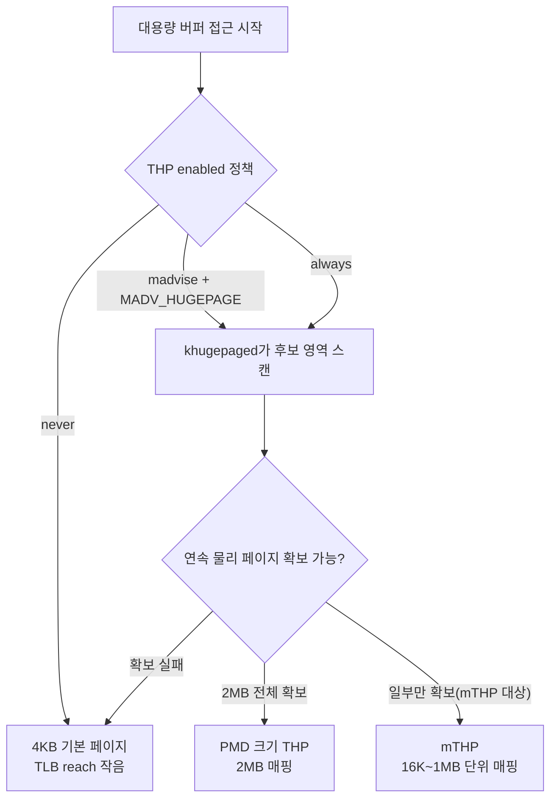

**Large Pages(대형 페이지, Huge Pages)**란 가상 주소를 물리 주소로 변환할 때 TLB(Translation Lookaside Buffer) 엔트리 하나가 담당하는 메모리 범위를 표준 4KB 대신 x86-64 기준 2MB·1GB, 또는 아키텍처별로 정의된 더 큰 단위로 확장해 페이지 테이블 계층을 순회하는 비용과 TLB 미스 빈도를 줄이는 메모리 관리 기법을 말합니다. 핫패스가 수백 메가바이트에서 수 기가바이트 크기의 버퍼를 랜덤에 가깝게 순회할 때, 4KB 페이지 하나로는 TLB가 커버하는 주소 범위(TLB reach)가 금방 바닥나 페이지 워크(page walk)가 접근마다 반복되고, 이 비용은 µs 단위 예산을 조용히 갉아먹는 지연으로 쌓입니다. 이 장에서는 관리자가 정적으로 예약하는 HugeTLB, 커널이 자동으로 관리하는 THP(Transparent Huge Pages), 그리고 2025~2026년 사이 실무 표준으로 자리잡아 가는 mTHP(multi-size THP)를 각각 언제 선택하고 언제 피할지 다룹니다.

## 이 장을 읽기 전에

**완전한 초보자?** 이 장은 [07장: 구조체 패딩과 정렬](/post/memory-optimization/struct-padding-alignment-optimization/)에서 다룬 캐시 라인·정렬 개념과, [15장: 메모리·수명·캐시 라인 직관](/post/memory-optimization/memory-lifetime-cache-line-intuition-fundamentals/)에서 다룬 가상 메모리·페이지의 기본 그림을 전제로 합니다. "페이지 테이블"과 "TLB"가 무엇인지, 가상 주소가 물리 주소로 바뀌는 대략의 흐름만 알면 충분합니다.

**이 장의 깊이**: 이 장은 **심화** 난이도로, HugeTLB와 THP의 구조적 차이부터 시작해 `madvise` 모드별 실전 선택, 그리고 2025~2026년 커널·표준 라이브러리에서 실무 채택이 넓어지고 있는 mTHP까지를 다룹니다. **다루지 않는 것**: NUMA 노드별 대형 페이지 배치는 [09장: NUMA 메모리 할당·지역성](/post/memory-optimization/numa-memory-allocation-locality/)에서, `madvise`의 다른 힌트(`MADV_DONTNEED`, `MADV_FREE` 등)와 ARM MTE는 [13장: Virtual Memory 관리 힌트](/post/memory-optimization/virtual-memory-hints-madvise-mte/)에서, 큰 버퍼를 미리 확보해 두는 아레나 설계 자체는 [02장: 할당 전략](/post/memory-optimization/pool-arena-allocation-strategy/)에서 다룹니다.

## 당신의 수준에 맞는 경로

| 수준 | 읽을 부분 | 핵심 목표 |
|------|---------|---------|
| **초보자** | "Huge Pages 도입 배경" ~ "HugeTLB: 정적 대형 페이지" | TLB reach와 페이지 워크가 지연에 기여하는 원리 이해 |
| **중급자** | "THP: 투명 대형 페이지와 madvise 모드" ~ "측정: TLB 미스와 페이지 폴트로 확인하기" | madvise 모드별 차이와 실측 방법 습득 |
| **전문가** | "mTHP" ~ "비판적 시각" | mTHP 적용 판단과 THP의 tail latency 트레이드오프 평가 |

---

## Huge Pages 도입 배경

HugeTLB는 Linux에서 오래전부터 존재해 온 기능으로, 관리자가 부팅 파라미터나 `/proc/sys/vm/nr_hugepages` sysctl로 대형 페이지 풀을 미리 예약해 두면 `hugetlbfs`를 마운트하거나 `MAP_HUGETLB` 플래그로 그 풀에서 페이지를 떼어 쓰는 방식입니다. 이 모델은 데이터베이스 버퍼 풀이나 대형 공유 메모리 세그먼트처럼 크기가 예측 가능하고 스왑되면 안 되는 워크로드를 겨냥해 설계되었습니다. THP(Transparent Huge Pages)는 이후 Linux 2.6.38(2011)에 메인라인으로 병합되면서 등장했고, 관리자 개입 없이 `khugepaged` 데몬이 백그라운드에서 인접한 4KB 페이지들을 찾아 2MB PMD(Page Middle Directory) 크기로 자동 병합(collapse)하는 방식을 취합니다. 같은 커널 릴리스에서 `madvise(2)`에 `MADV_HUGEPAGE`·`MADV_NOHUGEPAGE` 플래그가 함께 도입되어, 애플리케이션이 특정 영역에 대해서만 THP 후보 여부를 힌트로 줄 수 있게 되었습니다.

전통적 THP는 2MB(x86-64 PMD 크기) 한 가지만 다뤘기 때문에, 4KB보다는 훨씬 크지만 2MB에는 못 미치는 할당(64KB~512KB급 버퍼 등)은 콜랩스 대상이 되지 못하고 그대로 4KB로 남는 경우가 많았습니다. ARM의 Ryan Roberts가 주도한 익명 메모리용 multi-size THP(mTHP) 패치셋이 이 틈을 겨냥해 논의되었고, 2023~2024년 사이 6.x 계열 커널에 단계적으로 병합되며 크기별 sysfs 인터페이스가 추가되었습니다. `khugepaged`가 mTHP 크기도 자동으로 스캔·콜랩스하도록 확장하는 논의가 커널 커뮤니티에서 진행 중입니다. Windows에서도 `VirtualAlloc`에 `MEM_LARGE_PAGES`를 지정하고 `SeLockMemoryPrivilege` 권한을 확보하면 대형 페이지를 예약할 수 있지만, 이는 HugeTLB에 가까운 정적 모델이며 THP처럼 커널이 자동으로 콜랩스해 주는 투명한 메커니즘은 아닙니다.

## HugeTLB: 정적 대형 페이지

**HugeTLB**는 관리자가 미리 정해 둔 개수만큼의 대형 페이지를 부팅 시 또는 런타임에 예약해 두는 풀 기반 메커니즘입니다. `nr_hugepages`로 예약된 페이지는 `HugePages_Rsvd`(예약)와 실제 사용량이 구분되어 관리되며, 한 번 예약된 페이지는 스왑되지 않고(pinned) 다른 용도로 전용되지도 않습니다. 이 예측 가능성 때문에 데이터베이스 버퍼 풀, JVM 힙, RDMA 등록 메모리처럼 "이 크기만큼은 절대 스왑되면 안 된다"는 요구가 있는 워크로드에 적합합니다.

애플리케이션에서는 `hugetlbfs`를 마운트해 그 위에 파일을 만들고 `mmap`하거나, 익명 매핑에 `MAP_HUGETLB` 플래그를 추가해 접근합니다. 아래 코드는 사전에 예약된 HugeTLB 풀에서 256MB를 요청하는 최소 예제입니다.

```cpp
#include <sys/mman.h>
#include <cstdio>
#include <cstdlib>

int main() {
  constexpr size_t kSize = 256ull << 20;  // 256MB, 2MB HugeTLB 페이지 128개에 해당
  void* p = mmap(nullptr, kSize, PROT_READ | PROT_WRITE,
                 MAP_PRIVATE | MAP_ANONYMOUS | MAP_HUGETLB, -1, 0);
  if (p == MAP_FAILED) {
    perror("mmap(MAP_HUGETLB)");  // nr_hugepages 예약이 부족하면 여기서 실패한다
    return EXIT_FAILURE;
  }
  munmap(p, kSize);
  return EXIT_SUCCESS;
}
```

이 코드는 `nr_hugepages`가 요청량만큼 미리 예약되어 있어야만 성공합니다. 예약된 페이지는 실제로 쓰이지 않아도 물리 메모리를 점유하므로, 예약량을 과도하게 잡으면 다른 프로세스가 쓸 수 있는 메모리가 그만큼 줄어든다는 트레이드오프가 있습니다.

## THP: 투명 대형 페이지와 madvise 모드

**THP**는 `/sys/kernel/mm/transparent_hugepage/enabled`가 `always`·`madvise`·`never` 중 무엇으로 설정되어 있는지에 따라 동작 범위가 달라집니다. `always`는 시스템 전역에서 THP를 시도하고, `madvise`는 `MADV_HUGEPAGE`로 명시적으로 표시된 영역에만 적용하며, `never`는 완전히 끕니다. 여기에 `defrag` 설정(`always`/`defer`/`defer+madvise`/`madvise`/`never`)이 더해져, THP를 만들 물리 메모리가 부족할 때 즉시 직접 회수·압축을 수행할지 아니면 백그라운드로 미룰지를 결정합니다. `MADV_COLLAPSE`(Linux 6.1 이상)는 전역 정책과 무관하게 지정한 범위를 동기적으로 즉시 콜랩스하도록 강제하는 별도의 힌트입니다.

애플리케이션 코드에서는 전역 정책이 `madvise`일 때만 의미가 있는 `MADV_HUGEPAGE` 힌트를 특정 버퍼에만 선택적으로 걸어 줄 수 있습니다.

```cpp
#include <sys/mman.h>

void mark_hot_arena_for_thp(void* addr, size_t len) {
  // 전역 정책이 madvise일 때만 유효한 힌트: 이 영역만 THP 후보로 표시한다
  madvise(addr, len, MADV_HUGEPAGE);
}
```

전역 정책이 `never`면 이 힌트는 그냥 무시되고, `always`면 이미 모든 영역이 후보이므로 호출 자체는 무해하지만 별다른 효과도 없습니다. 즉 이 힌트는 "전역은 보수적으로 두고, 정말 큰 이득이 예상되는 버퍼만 골라서 켠다"는 `madvise` 정책과 짝을 이룰 때 가장 유용합니다.



현재 THP로 실제 매핑되어 있는지는 `/proc/<pid>/smaps`의 `AnonHugePages` 필드로 확인할 수 있으며, 이 값은 전통적인 PMD 크기 THP만을 집계합니다.

```bash
cat /sys/kernel/mm/transparent_hugepage/enabled
grep -E 'AnonHugePages|AnonHugePmdMapped' /proc/self/smaps_rollup
```

## mTHP: 여러 크기를 지원하는 THP

**mTHP(multi-size THP)**는 앞서 언급한 "4KB와 2MB 사이의 틈"을 메우기 위해 16KB·32KB·64KB처럼 2의 거듭제곱 크기의 huge page를 개별적으로 켜고 끌 수 있게 확장한 기능입니다. 각 크기는 `/sys/kernel/mm/transparent_hugepage/hugepages-<size>kB/enabled` 경로에서 `always`·`madvise`·`never`·`inherit`(상위 전역 값을 따름) 중 하나로 독립 설정됩니다. 기본값은 PMD 크기만 `inherit`이고 나머지 크기는 `never`이므로, mTHP는 명시적으로 옵트인해야만 동작합니다.

```bash
for f in /sys/kernel/mm/transparent_hugepage/hugepages-*kB/enabled; do
  echo "$f: $(cat "$f")"
done
```

위 스크립트로 나열되는 각 크기별 파일에 원하는 정책을 써 넣으면 되지만, 주의할 점이 있습니다. `MADV_COLLAPSE`는 여전히 PMD 크기 콜랩스만 지원하고 mTHP 콜랩스에는 관여하지 않으며, `khugepaged`가 공유되거나 스왑된 페이지를 만나면 해당 영역의 mTHP 콜랩스를 건너뜁니다. mTHP를 활용해 할당 정책 자체를 크기별로 나누고 싶다면 [16장: 전역 할당자·jemalloc·tcmalloc](/post/memory-optimization/global-allocator-jemalloc-tcmalloc-tuning-expert/)에서 다루는 아레나 단위 튜닝과 함께 검토하는 것이 자연스럽습니다.

## 측정: TLB 미스와 페이지 폴트로 확인하기

Huge page 적용 효과는 주장이 아니라 카운터로 확인해야 합니다. 아래는 큰 익명 매핑을 만들어 랜덤 접근을 반복하면서, 인자로 THP 힌트 사용 여부를 바꿀 수 있게 만든 최소 벤치마크입니다. `-std=c++17` 이상, Linux(x86-64) 기준으로 작성했습니다.

```cpp
#include <sys/mman.h>
#include <chrono>
#include <cstdio>
#include <cstring>
#include <random>
#include <string>

int main(int argc, char** argv) {
  constexpr size_t kSize = 1ull << 31;  // 2GiB
  void* buf = mmap(nullptr, kSize, PROT_READ | PROT_WRITE,
                   MAP_PRIVATE | MAP_ANONYMOUS, -1, 0);
  if (buf == MAP_FAILED) { perror("mmap"); return 1; }

  const bool use_thp = argc > 1 && std::string(argv[1]) == "thp";
  madvise(buf, kSize, use_thp ? MADV_HUGEPAGE : MADV_NOHUGEPAGE);
  std::memset(buf, 0, kSize);  // 페이지 폴트를 미리 유발해 워밍업

  std::mt19937_64 rng(42);
  std::uniform_int_distribution<size_t> dist(0, kSize / 64 - 1);
  volatile uint64_t sink = 0;
  auto* base = static_cast<char*>(buf);

  const auto t0 = std::chrono::steady_clock::now();
  constexpr size_t kIters = 50'000'000;
  for (size_t i = 0; i < kIters; ++i) {
    sink += base[dist(rng) * 64];  // 캐시라인 단위 stride로 TLB reach를 실제로 시험
  }
  const auto t1 = std::chrono::steady_clock::now();

  std::printf("mode=%s elapsed_ms=%ld sink=%lu\n", use_thp ? "thp" : "nothp",
              std::chrono::duration_cast<std::chrono::milliseconds>(t1 - t0).count(),
              static_cast<unsigned long>(sink));
  munmap(buf, kSize);
  return 0;
}
```

`g++ -O2 -std=c++17 thp_bench.cpp -o thp_bench`로 빌드한 뒤, `perf stat`으로 두 모드를 각각 측정해 TLB 미스와 페이지 폴트 수의 차이를 직접 비교합니다.

```bash
perf stat -e dTLB-load-misses,page-faults ./thp_bench nothp
perf stat -e dTLB-load-misses,page-faults ./thp_bench thp
```

아래는 예시 형태의 출력입니다(실제 수치는 CPU 세대·커널 버전·`enabled`/`defrag` 설정·워킹셋 크기에 따라 크게 달라지므로, 반드시 대상 환경에서 재현해야 합니다).

```text
# nothp (예시, 플랫폼·설정에 따라 다름)
       1,842,391,204      dTLB-load-misses
             524,301      page-faults

# thp (예시, 플랫폼·설정에 따라 다름)
         213,558,760      dTLB-load-misses
                 268      page-faults
```

이 벤치마크는 순수 랜덤 stride 접근이라 huge page의 이득이 과장되게 보일 수 있습니다. 실제 서비스의 접근 패턴이 순차에 가깝다면 TLB 미스 자체가 애초에 적어 개선 폭이 훨씬 작을 수 있으니, 프로파일러로 확인한 실제 워킹셋과 접근 패턴을 재현해서 측정하는 것이 중요합니다. 힙 전체의 페이지·할당 프로파일을 함께 보고 싶다면 [Tr.01 ch20: 메모리 프로파일링: 힙 분석](/post/profiling-analysis/memory-profiling-heap-analysis/)에서 다루는 heaptrack 계열 도구와 병행하는 것을 권장합니다.

## 흔한 오개념

**"THP를 켜면 무조건 빨라진다"**는 흔한 오해입니다. `khugepaged`의 스캔·콜랩스 작업 자체가 CPU 사이클을 쓰고, `defrag=always` 조합에서는 THP 확보를 위해 직접 메모리 압축(compaction)이 할당 경로에 끼어들어 지연 스파이크를 유발할 수 있습니다. 이 때문에 저지연을 요구하는 인메모리 데이터베이스·캐시 서버 커뮤니티에서는 THP를 `never`로 끄고, 필요한 버퍼에만 HugeTLB나 `madvise` 기반 힌트를 선택적으로 적용하는 관행이 널리 퍼져 있습니다.

**"Huge Pages는 메모리를 아낀다"**도 정확하지 않습니다. 2MB 페이지 하나에 실제로는 몇 바이트만 쓰이더라도 나머지 공간은 그대로 점유되는 내부 단편화(internal fragmentation)가 발생합니다. 작은 크기의 산발적 할당이 많은 워크로드에 THP나 HugeTLB를 무분별하게 적용하면 오히려 상주 메모리(RSS)가 늘어날 수 있습니다.

**"HugeTLB와 THP는 같은 메커니즘이다"**라는 혼동도 흔합니다. HugeTLB는 관리자가 정적으로 예약해 스왑되지 않는 pinned 풀이고, THP는 커널이 동적으로 콜랩스·디콜랩스하며 필요하면 스왑도 가능한 별개의 서브시스템입니다. 두 메커니즘은 sysfs 인터페이스도, 실패 모드도 다르므로 같은 도구로 취급하면 안 됩니다.

## 판단 기준

| 상황 | 권장 | 비권장 |
|------|------|--------|
| 크기가 고정된 대형 버퍼(DB 버퍼 풀, 공유 메모리, RDMA 등록 영역) | HugeTLB(`hugetlbfs`, `MAP_HUGETLB`) | THP `always`에만 의존 |
| 범용 워크로드, 운영 부담 최소화가 우선 | THP `madvise` + 필요한 버퍼에만 `MADV_HUGEPAGE` | THP `always`(전역 오버커밋 위험) |
| 4KB~2MB 사이 크기의 산발적 버퍼(예: 64KB~512KB) | 대상 크기의 mTHP sysfs 항목을 `madvise`로 활성화 | 전통 THP만 두고 방치(콜랩스 대상이 아님) |
| latency tail이 critical한 서비스(저지연 거래, 실시간 서버) | THP `never` + 명시적 HugeTLB, 필요 시 `madvise`로 특정 아레나만 opt-in | THP `always` + `defrag=always` |
| 메모리 압박이 심한 컨테이너·공유 호스트 | 신중한 opt-in과 cgroup 단위 모니터링 | 무분별한 전역 `always` 적용 |

## 비판적 시각: 한계와 트레이드오프

THP의 `always` 모드가 지연 스파이크를 유발한다는 문제는 오래전부터 알려져 있었고, 그 경험 때문에 여러 저지연 서비스 운영 환경에서는 여전히 THP를 끄고 필요한 곳만 선택적으로 켜는 보수적인 접근을 기본값으로 삼습니다. mTHP는 이 절충안을 세분화한 발전이지만, 2026년 7월 시점에도 커널·배포판 버전에 따라 sysfs 인터페이스의 세부 동작과 `khugepaged`의 자동화 수준이 다르고, 자동 mTHP 콜랩스 확장은 아직 다음 개발 사이클로 진행 중인 단계입니다. 따라서 "mTHP가 실무 표준이 되었다"는 말은 커뮤니티의 관심과 채택이 넓어졌다는 뜻이지, 특정 커널의 기본 설정이 바뀌었다는 뜻은 아니라는 점을 구분해서 받아들여야 합니다.

HugeTLB는 예측 가능하지만 유연성이 떨어집니다. 사전에 크기를 정해 예약해야 하고, 한번 예약된 페이지는 다른 프로세스와 쉽게 공유되지 않으며, 예약량을 잘못 잡으면 유휴 메모리로 낭비되거나 반대로 필요할 때 `mmap`이 실패합니다. 또한 이 장에서 제시한 벤치마크 수치는 접근 패턴(순차 vs 랜덤), 워킹셋 크기, CPU 세대별 TLB 계층 구조에 크게 좌우되므로, 일반화된 "N% 개선" 주장을 그대로 받아들이기보다 항상 대상 환경에서 재현해 검증하는 것이 안전합니다.

## 마무리

- [ ] HugeTLB(정적 예약)와 THP(동적 콜랩스)의 관리 방식 차이를 설명할 수 있는가?
- [ ] THP의 `always`/`madvise`/`never` 정책과 `MADV_HUGEPAGE`/`MADV_COLLAPSE`의 역할을 구분할 수 있는가?
- [ ] mTHP가 해결하는 문제(4KB와 2MB 사이의 틈)와 2025~2026년 기준 옵트인 상태임을 설명할 수 있는가?
- [ ] `perf stat` 등으로 TLB 미스·페이지 폴트 변화를 실측해 huge page 적용 효과를 검증할 수 있는가?
- [ ] latency-critical 워크로드에서 THP를 언제 끄고 언제 선택적으로 켤지 판단할 수 있는가?

다음 장에서는 이 장에서 다룬 huge page 정책이 **NUMA 토폴로지**와 만났을 때 어떤 문제가 생기는지, 메모리를 어느 노드에 배치해야 지역성을 지킬 수 있는지를 다룹니다. HugeTLB·THP·mTHP 모두 NUMA 노드 경계를 넘나드는 배치가 가능하므로, 이 장의 내용과 다음 장의 노드 배치 전략은 함께 적용해야 완전한 그림이 됩니다.

→ [NUMA 메모리 할당·지역성](/post/memory-optimization/numa-memory-allocation-locality/) (챕터 09)
