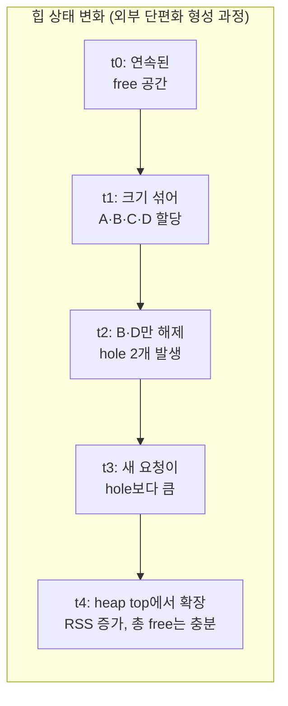

**메모리 단편화(memory fragmentation)**란 힙에 남은 free 공간의 총량은 충분한데도, 그 공간이 요청 크기에 맞게 나뉘어 있지 않거나 살아 있는 객체 사이에 흩어져 있어 새 할당 요청을 만족시키지 못하는 현상을 말합니다. 장기 실행 서비스에서 "트래픽은 그대로인데 RSS(Resident Set Size)가 며칠에 걸쳐 계속 늘어난다"는 증상의 상당수는 메모리 누수가 아니라 단편화입니다. 이 장은 단편화가 왜 생기는지를 내부·외부 두 갈래로 구분해 설명하고, 그 정도를 감이 아니라 수치로 측정하는 방법과 할당자 선택을 통한 대응 전략을 다룹니다.

## 이 장을 읽기 전에

이 장은 [챕터 01: 컨테이너 비용 모델](/post/memory-optimization/container-cost-model-selection/)에서 다룬 "할당은 공짜가 아니다"라는 전제, [챕터 02: 할당 전략: 풀·아레나](/post/memory-optimization/pool-arena-allocation-strategy/)에서 다룬 free list·범프 포인터의 내부 동작, [챕터 15: 메모리·수명·캐시 라인 직관](/post/memory-optimization/memory-lifetime-cache-line-intuition-fundamentals/)에서 다룬 객체 수명 개념을 이어받습니다. 또한 이 트랙에서 바로 앞에 오는 [NUMA 메모리 할당·지역성](/post/memory-optimization/numa-memory-allocation-locality/)이 "메모리가 어디에 있는가"를 다뤘다면, 이 장은 "그 메모리가 얼마나 낭비되고 있는가"를 다룹니다.

이 장의 깊이는 **심화**입니다. 단편화의 두 유형을 구분하고 실제로 측정하는 절차, 그리고 할당자 선택으로 대응하는 판단 기준까지 다룹니다. **다루지 않는 것**: 커스텀 할당자를 실제로 구현하는 세부 코드([챕터 03](/post/memory-optimization/custom-allocator-patterns/)), `std::pmr` 리소스의 실전 적용([챕터 04](/post/memory-optimization/pmr-polymorphic-allocator-practical/)), 전역 할당자를 교체하는 전체 검증 절차([챕터 16](/post/memory-optimization/global-allocator-jemalloc-tcmalloc-tuning-expert/)), `madvise` 등 가상 메모리 힌트의 옵션별 세부사항([챕터 13](/post/memory-optimization/virtual-memory-hints-madvise-mte/)), 누수 탐지 도구의 사용법([챕터 14](/post/memory-optimization/memory-leak-detection-valgrind-asan/))입니다. 이 장은 그 챕터들을 잇는 **진단** 단계에 해당합니다.

## 당신의 수준에 맞는 경로

| 수준 | 읽을 부분 | 핵심 목표 |
|------|---------|---------|
| **입문** | "단편화 문제의 역사와 대응 계보" ~ "내부 단편화와 외부 단편화" | 두 단편화 유형이 왜 다른 원인에서 생기는지 이해 |
| **중급** | "단편화가 누적되는 구조적 원인" ~ "단편화 지표로 측정하기" | 실제로 mallinfo2·jemalloc 통계로 단편화를 확인하는 절차 습득 |
| **실무 적용** | "흔한 오개념" ~ "판단 기준" | 할당자 교체·풀/아레나 도입 중 무엇을 먼저 시도할지 결정 |

---

## 단편화 문제의 역사와 대응 계보

동적 메모리 할당기가 free 공간을 어떻게 나누고 재사용하는지는 컴퓨터 과학에서 오래된 문제입니다. Donald Knuth는 1973년 *The Art of Computer Programming* 1권에서 **버디 시스템(buddy system)**을 정리했습니다. 이 방식은 힙을 2의 거듭제곱 크기로만 나누고, 인접한 "버디" 블록끼리만 병합하도록 제한해 병합 탐색 비용을 낮춥니다. 이 아이디어는 지금도 Linux 커널의 페이지 할당기(`mm/page_alloc.c`)에 그대로 쓰이고 있지만, 요청 크기를 2의 거듭제곱으로 올림하는 대가로 최악의 경우 **50%에 가까운 내부 단편화**를 감수합니다.

Paul Wilson과 동료들은 1995년 발표한 [*Dynamic Storage Allocation: A Survey and Critical Review*](https://csapp.cs.cmu.edu/3e/docs/dsa.pdf)에서 1960~1995년 사이의 할당자 설계를 총정리하며, 단편화가 할당 순서·객체 수명 분포에 강하게 의존하는 **경험적 현상**이라 이론적으로 "최선의 할당 전략"을 증명하기 어렵다는 점을 지적했습니다. 이 관찰은 지금도 유효해서, 특정 워크로드에서 좋은 할당자가 다른 워크로드에서는 더 나쁠 수 있습니다.

실시간·임베디드 진영에서는 다른 접근이 나왔습니다. Masmano 등이 2008년 *Software-Practice & Experience*에 발표한 [TLSF(Two-Level Segregated Fit)](https://pure.york.ac.uk/portal/en/publications/implementation-of-a-constant-time-dynamic-storage-allocator/)는 free 블록을 크기별로 로그 단위와 선형 단위 두 층으로 나눈 분리 리스트(segregated free list)와 비트맵 탐색을 결합해, x86에서 200개 미만의 명령어로 **할당·해제 모두 O(1)**을 보장하면서 외부 단편화도 낮게 유지합니다. 예측 가능한 지연이 핵심 제약인 도메인에서 TLSF 계열 할당자가 선택되는 이유입니다.

## 내부 단편화와 외부 단편화

**내부 단편화(internal fragmentation)**는 할당자가 요청한 크기보다 **더 큰 블록을 내주면서** 남는 자투리 공간입니다. 대부분의 할당자는 관리 오버헤드를 줄이기 위해 요청 크기를 미리 정해 둔 **크기 클래스(size class)**로 올림합니다. glibc의 `malloc`은 64비트 환경에서 청크를 16바이트 배수로 정렬하고 청크 헤더(보통 8~16바이트)를 붙이므로, 20바이트를 요청해도 실제로는 32바이트 안팎이 소비됩니다. jemalloc·tcmalloc은 8, 16, 32, 48, 64, ... 처럼 더 촘촘한 크기 클래스 표를 두어 이 손실을 줄이지만, 클래스 경계와 요청 크기가 어긋나는 한 내부 단편화는 구조적으로 사라지지 않습니다. 객체 하나당 손실은 작아도, 초당 수백만 개의 작은 객체를 다루는 서비스에서는 이 손실이 누적되어 유효 메모리 사용량(RSS)을 실제 데이터보다 눈에 띄게 부풀립니다.

**외부 단편화(external fragmentation)**는 정반대 문제입니다. free 공간의 총합은 요청을 만족시키기에 충분하지만, 그 공간이 **여러 개의 작은 조각으로 흩어져 있어** 하나의 큰 요청을 채울 연속 공간이 없는 상태입니다. 이 현상은 크기와 수명이 다른 객체를 같은 힙 영역에서 섞어 할당·해제할 때 생깁니다. 장수명 객체 사이에 낀 단수명 객체가 해제되면 그 자리에 "구멍(hole)"이 남는데, 양옆이 아직 살아 있는 객체라서 이웃 free 블록과 병합(coalescing)할 수 없습니다. 이런 구멍이 여러 개 쌓이면 할당자는 새 요청마다 맞는 구멍을 찾아 헤매거나, 결국 힙의 끝(top)에서 새로 확장해야 하므로 RSS만 계속 늘어나는 결과로 이어집니다.

## 단편화가 누적되는 구조적 원인

단편화는 한 번의 실수가 아니라 **할당 패턴의 누적**으로 자라납니다. 가장 흔한 세 가지 구조적 원인은 다음과 같습니다.

- **수명이 섞인 할당(interleaved lifetime)**: 요청 처리 초기에 만든 장수명 캐시 항목과 요청 처리 중간에만 쓰고 버리는 임시 객체를 같은 아레나·같은 크기 클래스에서 반복해 할당·해제하면, 단수명 객체가 빠져나간 자리에 장수명 객체로 둘러싸인 구멍이 영구히 남습니다.
- **크기 분포와 크기 클래스의 불일치**: 워크로드의 할당 크기가 할당자의 크기 클래스 경계와 계속 어긋나면, 해제된 블록이 다음 요청에 재사용되지 못하고 새 크기 클래스의 블록이 별도로 확보됩니다.
- **스레드별 아레나 분리로 인한 격차**: jemalloc·tcmalloc처럼 스레드 경합을 줄이기 위해 스레드마다(또는 스레드 그룹마다) 별도 아레나를 두는 설계에서는, 한 스레드의 아레나만 유난히 단편화가 심해질 수 있습니다. 이 문제는 [챕터 16](/post/memory-optimization/global-allocator-jemalloc-tcmalloc-tuning-expert/)에서 다루는 워크로드별 튜닝의 영역과 맞닿아 있습니다.

이 과정을 시간 축으로 펼치면 다음과 같은 흐름이 됩니다. 초기에는 연속된 free 공간이 있지만, 크기가 섞인 할당이 들어오고 그중 일부만 해제되면서 재사용할 수 없는 구멍이 남고, 결국 새 요청은 힙 끝에서 새로 확장하게 됩니다.



## 단편화 지표로 측정하기

단편화는 "느낌"으로 판단할 문제가 아니라 **수치로 확인**해야 하는 문제입니다. glibc(2.33 이상)는 `mallinfo2()`로 현재 힙 상태를 조회할 수 있습니다. `uordblks`는 애플리케이션이 실제로 사용 중인 바이트, `fordblks`는 free list에 남아 있는 바이트, `hblkhd`는 `mmap`으로 별도 확보한 대형 블록의 크기입니다. 아래는 크기가 섞인 할당 1만 개를 만든 뒤 절반만 해제해 의도적으로 구멍을 만들고, 그 전후로 힙 상태를 출력하는 최소 프로그램입니다.

```cpp
#include <cstdio>
#include <cstdlib>
#include <vector>
#include <malloc.h>  // mallinfo2: glibc >= 2.33, Linux 전용

void print_heap_stats(const char* label) {
  struct mallinfo2 mi = mallinfo2();
  std::printf("%-24s uordblks=%6zu KB  fordblks=%6zu KB  hblkhd=%6zu KB\n",
              label, mi.uordblks / 1024, mi.fordblks / 1024, mi.hblkhd / 1024);
}

int main() {
  std::vector<void*> blocks;
  print_heap_stats("초기");

  // 크기를 섞어 할당해 free list에 다양한 크기의 구멍이 생길 여지를 만든다.
  for (int i = 0; i < 10000; ++i) {
    std::size_t size = (i % 7 == 0) ? 4096 : 64;  // 대부분 소블록, 간간이 대블록
    blocks.push_back(std::malloc(size));
  }
  print_heap_stats("전량 할당 후");

  // 짝수 인덱스만 해제: 홀수 인덱스 블록이 양옆을 막아 병합을 방해한다.
  for (std::size_t i = 0; i < blocks.size(); i += 2) {
    std::free(blocks[i]);
    blocks[i] = nullptr;
  }
  print_heap_stats("절반 해제 후 (외부 단편화 유발)");

  for (void* p : blocks) if (p) std::free(p);
  print_heap_stats("전량 해제 후");
  return 0;
}
```

`g++ -O2 frag_demo.cpp -o frag_demo`(Linux, glibc 2.33 이상, x86-64 기준)로 빌드해 실행하면, "절반 해제 후" 단계에서 `uordblks`는 절반 가까이 줄지만 `hblkhd`나 전체 RSS는 크게 줄지 않는 경우가 흔합니다 — glibc의 기본 정책은 힙 꼭대기 근처의 연속된 free 공간만 `malloc_trim`으로 OS에 반환하고, 중간에 흩어진 구멍은 다음 할당 요청을 위해 free list에 그대로 남겨 두기 때문입니다. 더 상세한 사람이 읽기 쉬운 리포트가 필요하면 `malloc_info(3)`이 [XML 형식으로 아레나별 상태](https://man7.org/linux/man-pages/man3/malloc_info.3.html)를 덤프해 줍니다.

jemalloc을 쓰는 경우 `mallctl`로 `stats.allocated`(애플리케이션이 실제로 요청한 바이트), `stats.active`(페이지 단위로 올림된, 애플리케이션에 할당된 바이트), `stats.resident`(실제 물리 메모리에 상주하는 바이트)를 조회할 수 있습니다. [jemalloc 공식 위키](https://github.com/jemalloc/jemalloc/wiki/Use-Case:-Basic-Allocator-Statistics)는 `active`와 `allocated`의 차이가 곧 페이지 단위 내부 단편화이며, `1.0 - allocated/active`로 **외부 단편화 비율**을 근사할 수 있다고 안내합니다. `resident`가 트래픽·연결 수와 무관하게 계속 늘어난다면 단편화(또는 누수)가 진행 중이라는 신호로 봐야 합니다. 애플리케이션 코드 수준의 할당 횟수·크기 분포를 함께 보려면 [프로파일링 트랙의 메모리 프로파일링: 힙 분석](/post/profiling-analysis/memory-profiling-heap-analysis/)에서 다루는 heaptrack·massif 계열 도구를 병행합니다.

## 흔한 오개념

**"RSS가 줄지 않으면 메모리 누수다"**는 절반만 맞습니다. 위 실험에서 보듯 glibc는 free된 블록을 즉시 OS에 반환하지 않고 free list에 보관해 다음 할당에 재사용하려 하므로, 살아 있는 객체 수가 줄었는데도 RSS는 그대로이거나 아주 천천히만 줄어드는 것이 정상적인 동작입니다. 진짜 누수인지 단편화인지 구분하려면 `uordblks`(실제 사용 중)와 RSS를 함께 관찰해야 하며, 확실한 누수 여부는 [챕터 14](/post/memory-optimization/memory-leak-detection-valgrind-asan/)의 도구로 검증합니다.

**"`malloc_trim`을 호출하거나 전부 `free`하면 단편화가 사라진다"**도 틀렸습니다. `malloc_trim`은 힙 꼭대기의 연속된 free 공간만 OS로 반환할 수 있고, 힙 중간에 살아 있는 객체 사이에 낀 구멍은 그 객체들이 모두 해제되기 전까지는 어차피 반환 대상이 아닙니다. 즉 외부 단편화는 "해제"로 없어지는 게 아니라 애초에 "할당 패턴"으로 예방해야 하는 문제입니다.

**"커스텀 풀·아레나를 쓰면 단편화가 사라진다"**도 과장입니다. [챕터 02](/post/memory-optimization/pool-arena-allocation-strategy/)에서 다뤘듯, 청크 크기나 풀 용량을 워크로드와 다르게 잡으면 단편화가 없어지는 게 아니라 "미사용 슬롯을 붙잡아 두는 내부 단편화" 형태로 옮겨 갈 뿐입니다. 도구를 바꾸는 것과 원인을 없애는 것은 다른 문제입니다.

## 대응 전략

단편화 대응은 증거 없이 도구부터 바꾸는 순서가 아니라, 앞서 다룬 지표로 **어느 유형이 문제인지 먼저 확인한 뒤** 그에 맞는 레버를 고르는 순서로 진행하는 것이 합리적입니다.

- **할당자 선택·튜닝**: 내부 단편화가 두드러진다면 크기 클래스 표가 더 촘촘한 할당자(jemalloc, tcmalloc, mimalloc)로 교체하거나 아레나 설정을 조정하는 것이 첫 번째 후보입니다. 실시간·임베디드처럼 예측 가능성이 우선이라면 TLSF 계열을 검토합니다. 교체 절차와 워크로드별 판단은 [챕터 16](/post/memory-optimization/global-allocator-jemalloc-tcmalloc-tuning-expert/)에서 심화로 다룹니다.
- **수명별 분리**: 외부 단편화가 두드러진다면 장수명 객체와 단수명 객체를 같은 아레나에 섞지 않고, 요청·프레임 단위로 아레나를 나눠 한꺼번에 리셋하는 편이 근본적입니다. 이 설계는 [챕터 02](/post/memory-optimization/pool-arena-allocation-strategy/)의 아레나 패턴과 [챕터 04](/post/memory-optimization/pmr-polymorphic-allocator-practical/)의 `std::pmr::monotonic_buffer_resource`가 표준 수준에서 제공합니다.
- **크기별 격리**: 할당 크기가 소수의 고정 크기에 몰린다면 풀 할당자([챕터 02](/post/memory-optimization/pool-arena-allocation-strategy/))로 해당 크기만 따로 관리해 범용 할당자의 크기 클래스 설계에 기대지 않도록 합니다.
- **가상 메모리 힌트**: 이미 확보한 메모리를 즉시 반환하지 않아도 되는 경우, `madvise` 계열 힌트로 OS에 회수 우선순위를 알려줄 수 있습니다. 구체적인 옵션과 트레이드오프는 [챕터 13](/post/memory-optimization/virtual-memory-hints-madvise-mte/)에서 다룹니다.
- **주기적 재시작(운영상의 임시방편)**: 위 설계 변경이 당장 어려운 장기 실행 서비스에서는 워커 프로세스를 주기적으로 재활용해 힙 상태를 리셋하는 실무 관행이 흔히 쓰입니다. 이 방법은 원인을 없애지 않고 증상을 주기적으로 지우는 것이므로, 근본 대응이 준비될 때까지의 임시 조치로만 취급해야 합니다.

## 판단 기준

| 상황 | 권장 | 비권장 |
|------|------|--------|
| 배치·서버리스처럼 프로세스 수명이 짧음 | 단편화 대응 투자 최소화, 기본 할당자 유지 | 정교한 커스텀 아레나 선제 도입 |
| 장기 실행 프로세스에서 RSS가 트래픽과 무관하게 계속 증가 | mallinfo2/jemalloc stats로 먼저 정량화한 뒤 대응 선택 | 증상만 보고 재시작으로만 계속 땜빵 |
| 내부 단편화(active-allocated 격차)가 두드러짐 | 크기 클래스가 촘촘한 할당자로 교체(챕터 16) | 외부 단편화 대응책(아레나 분리)부터 시도 |
| 외부 단편화(구멍은 많은데 큰 요청이 실패)가 두드러짐 | 수명별 아레나 분리(챕터 02·04) | 할당자만 교체하고 수명 혼재는 방치 |
| 할당 크기가 소수의 고정 크기에 몰림 | 풀 할당자로 크기별 격리(챕터 02) | 범용 할당자에 맡긴 채 방치 |
| 예측 가능한 지연이 최우선인 실시간·임베디드 | TLSF류 O(1)·저단편화 할당자 검토 | 단편화가 시간에 따라 악화될 수 있는 범용 할당자 방치 |
| 단편화 여부 자체가 불확실 | 먼저 계측(mallinfo2/jemalloc stats)으로 근거 확보 | 벤치 없이 할당자 교체부터 시도 |

## 비판적 시각: 한계와 트레이드오프

단편화 지표는 도구마다 정의가 다릅니다. glibc의 `mallinfo2`는 프로세스 전체가 아니라 메인 아레나 기준 수치를 주로 노출하고, 멀티스레드 환경에서 스레드별 서브 아레나까지 보려면 `malloc_info`의 XML 덤프를 파싱해야 합니다. jemalloc의 `active/allocated` 비율도 "페이지 단위로 올림된 것"과 "실제 요청 바이트"의 차이일 뿐, 사람이 직관적으로 기대하는 "낭비된 바이트"와 정확히 일치하지 않을 수 있습니다. 서로 다른 할당자·서로 다른 지표를 같은 잣대로 비교하려면 지표의 정의부터 맞춰야 합니다.

내부 단편화와 외부 단편화 사이에는 근본적인 긴장이 있습니다. 크기 클래스를 촘촘하게 나누면 내부 단편화는 줄지만 클래스 종류가 늘어난 만큼 각 클래스의 free list가 얕아져 외부 단편화(어떤 클래스는 구멍이 남고 다른 클래스는 부족한 상태)가 오히려 늘어날 수 있습니다. 버디 시스템처럼 클래스를 성기게 나누면 그 반대가 됩니다. "단편화를 없앤다"는 표현은 정확하지 않고, 실제로는 워크로드에 맞게 **어느 종류의 단편화를 얼마나 감수할지 선택**하는 문제에 가깝습니다.

C++에서는 관리형 런타임(Java, Go)의 **압축(compaction)**, 즉 살아 있는 객체를 이동시켜 free 공간을 하나로 모으는 방식을 기본적으로 쓸 수 없습니다. 압축은 객체의 주소가 바뀌어도 모든 참조가 따라 갱신되어야 하는데, C++ 포인터는 언어 차원에서 그런 간접 계층을 강제하지 않기 때문입니다. 핸들·인덱스 기반 간접 참조로 압축을 흉내 낼 수는 있지만 이는 설계 전체를 바꾸는 결정이므로, 대부분의 실무에서는 압축 대신 이 장에서 다룬 예방적 설계(수명 분리·풀·할당자 선택)로 단편화를 관리하는 쪽을 택합니다.

## 마무리

- **구분**: 내부 단편화(크기 클래스 반올림)와 외부 단편화(구멍의 재사용 불가)가 서로 다른 원인에서 온다는 것을 설명할 수 있다.
- **측정**: `mallinfo2`/`malloc_info` 또는 jemalloc의 `stats.active`/`stats.allocated`/`stats.resident`로 단편화 정도를 수치로 확인할 수 있다.
- **구분**: RSS 증가가 누수인지 단편화인지 구분하는 절차를 설명할 수 있다.
- **선택**: 워크로드의 크기·수명 분포에 따라 할당자 교체·풀/아레나 도입·수명 분리 중 무엇을 먼저 시도할지 판단할 수 있다.
- **비판**: 단편화 대응이 만능이 아니며, 내부·외부 단편화 사이에 트레이드오프가 있고 C++에서는 압축이 기본 선택지가 아님을 안다.

**이전 장**: [NUMA 메모리 할당·지역성](/post/memory-optimization/numa-memory-allocation-locality/)

**다음 장에서는** [메모리 대역폭 최적화](/post/memory-optimization/memory-bandwidth-optimization-cxl/)를 다룹니다. 이 장이 "힙 공간이 얼마나 낭비되는가"를 다뤘다면, 다음 장은 "확보한 메모리를 얼마나 빠르게 읽고 쓸 수 있는가"로 관점을 옮겨 대역폭 병목과 CXL 세대별 배포 현실을 정리합니다.

→ [메모리 대역폭 최적화](/post/memory-optimization/memory-bandwidth-optimization-cxl/)
