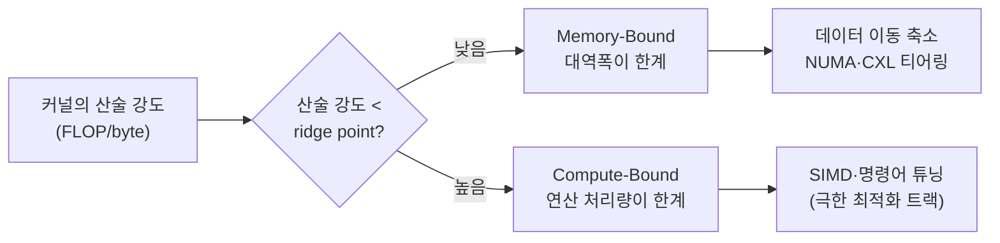

**메모리 대역폭 최적화**란 CPU와 메모리 사이를 오가는 데이터의 초당 전송량(bandwidth, 단위 GB/s)이 실행 시간의 실질적 한계로 작용하는 상황을 진단하고, 그 한계 안에서 데이터 이동량 자체를 줄이거나 여러 메모리 컨트롤러·인터커넥트로 트래픽을 분산해 처리량을 끌어올리는 작업을 말한다. 컨테이너를 바꾸고 레이아웃을 SoA로 정리하고 캐시 친화적으로 순회 순서까지 다듬어도, 처리할 데이터가 캐시보다 훨씬 크고 스레드 여러 개가 동시에 메모리를 두드리는 워크로드에서는 결국 "메모리 컨트롤러가 초당 옮길 수 있는 바이트 수"라는 물리적 천장에 부딪힌다. 이 장은 그 천장을 어떻게 알아채고, 어디까지 늘릴 수 있으며, 늘릴 수 없을 때는 무엇으로 대체하는지를 다룬다. 후반부는 2025년 11월 발표된 CXL 4.0 스펙과 2026년 현재 실제로 서버에 꽂혀 있는 CXL 세대 사이의 간극을 사례로 삼아, "표준이 발표되었다"와 "우리 하드웨어가 그것을 쓸 수 있다"를 구분하는 판단 습관을 다룬다.

## 이 장을 읽기 전에

이 장은 [15장: 메모리·수명·캐시 라인 직관](/post/memory-optimization/memory-lifetime-cache-line-intuition-fundamentals/)의 캐시 라인 감각과 [06장: 캐시 친화적 접근 패턴](/post/memory-optimization/cache-friendly-access-patterns/)에서 다룬 순차 접근·stride·batching을 전제로 한다. 두 장에서 "어떻게 접근해야 캐시 미스를 줄이는가"를 다뤘다면, 이 장은 "그 접근이 캐시를 다 빠져나가 메모리를 두드릴 때, 그 메모리 자체가 얼마나 빨리 응답해 줄 수 있는가"라는 다음 층위를 다룬다. 이 장의 깊이는 **심화**로, 대역폭과 지연시간을 구분하는 개념부터 시작해 STREAM·roofline·perf 언코어 카운터로 병목을 진단하는 방법, 그리고 CXL 스펙과 실제 배포 사이의 괴리를 실무 판단 기준으로 다룬다. **다루지 않는 것**은 다음과 같다. NUMA 노드 간 지역성 설계와 CPU affinity는 [09장: NUMA 메모리 할당·지역성](/post/memory-optimization/numa-memory-allocation-locality/)에 위임하고, huge pages·mTHP가 TLB 미스를 줄여 유효 대역폭에 주는 영향은 [08장: Large Pages·Huge Pages](/post/memory-optimization/huge-pages-large-pages-mthp/)에서, `madvise` 같은 가상 메모리 힌트는 [13장: Virtual Memory 관리 힌트](/post/memory-optimization/virtual-memory-hints-madvise-mte/)에서 다룬다. SIMD 벡터화·소프트웨어 프리페치 인트린식처럼 명령어 수준에서 대역폭을 아끼는 기법은 극한 최적화 트랙의 영역이라 이 장에서는 존재만 짚고 넘어간다.

## 당신의 수준에 맞는 경로

| 수준 | 읽을 부분 | 핵심 목표 |
|------|---------|---------|
| **중급자** | "대역폭과 지연시간은 다른 자원이다" ~ "대역폭 병목 진단하기" | roofline·산술 강도 개념과 STREAM/perf로 병목을 확인하는 절차 이해 |
| **심화 학습자** | "대역폭을 줄이는 설계 기법" ~ "CXL: 스펙과 실제 배포의 괴리" | 데이터 이동 축소 기법과 CXL 세대별 실제 배포 현황 파악 |
| **전문가** | "판단 기준" ~ "비판적 시각" | 언제 대역폭에 투자할지, 언제 CXL 티어링을 검토할지 판단 |

---

## 대역폭과 지연시간은 다른 자원이다 (배경)

<strong>메모리 벽(memory wall)</strong>이라는 용어는 Wm. Wulf와 Sally McKee가 1994년 버지니아 대학교 기술 보고서에서(1995년 *Computer Architecture News*에 정식 게재) 처음 제시했다. 이들은 CPU 클록은 지수적으로 빨라지는 반면 DRAM의 지연시간·대역폭 개선 속도는 연 7–10% 수준에 머무르는 추세가 이어지면, 결국 프로세서가 아무리 빨라져도 메모리를 기다리는 시간이 전체 실행 시간을 지배하게 된다고 지적했다. 이 통찰은 두 갈래로 발전했는데, 하나는 지연시간(하나의 요청이 왕복하는 데 걸리는 시간)을 줄이거나 은폐하는 방향이고, 다른 하나는 대역폭(동시에 진행 중인 여러 요청이 초당 옮기는 총량)을 늘리는 방향이다. John McCalpin이 1990년대 초 만든 [STREAM 벤치마크](https://www.cs.virginia.edu/stream/)는 후자를 정량화하려는 시도로, 캐시보다 훨씬 큰 배열에 대해 Copy·Scale·Add·Triad 네 가지 커널을 실행해 시스템이 실제로 지속 가능한(sustainable) 대역폭을 측정한다. 이후 2009년 Samuel Williams, Andrew Waterman, David Patterson이 제안한 [roofline 모델](https://en.wikipedia.org/wiki/Roofline_model)은 이 두 축을 하나의 그래프로 합쳐, 커널의 <strong>산술 강도(arithmetic intensity, 바이트당 연산 수)</strong>가 낮으면 대역폭이, 높으면 프로세서의 연산 처리량이 성능을 결정한다는 것을 시각적으로 보여준다.

리틀의 법칙(Little's law)을 메모리에 그대로 적용하면 "대역폭 = 동시에 미결 상태인 요청 수 ÷ 요청당 지연시간"이 성립한다. 이 식이 말하는 바는, 지연시간 하나만 줄여서는 대역폭이 자동으로 늘지 않는다는 것이다. 요청을 충분히 많이 동시에 띄워 메모리 컨트롤러의 큐를 채울 수 있어야 지연시간 단축이 대역폭 향상으로 이어진다. 반대로 대역폭이 이미 포화된 구간에서는 지연시간을 아무리 줄여도 총 처리량이 늘지 않는데, 채널이 이미 꽉 찬 상태이기 때문이다. 이 장에서 다루는 진단·설계 기법은 결국 "지금 우리 워크로드가 대역폭 한계에 부딪혔는가, 아니면 아직 지연시간이나 연산이 병목인가"를 구분하는 데서 출발한다.



## 대역폭 병목 진단하기

**대역폭 병목**은 스레드 수를 늘려도 처리량이 더 이상 늘지 않고, CPU 사용률은 높은데 유효 작업량(useful work)은 늘지 않는 형태로 나타난다. 가장 직접적인 확인 방법은 대상 시스템에서 STREAM 같은 벤치마크로 "이 하드웨어가 낼 수 있는 최대 지속 대역폭"을 먼저 재고, 실제 애플리케이션이 그 값의 어느 비율까지 접근하는지 비교하는 것이다. 아래는 STREAM의 Triad 커널(`a[i] = b[i] + scalar * c[i]`)을 Google Benchmark로 재현한 예시로, 배열 크기를 L3 캐시보다 훨씬 크게 잡아 매 반복이 실제로 메인 메모리까지 내려가도록 만든다.

```cpp
#include <benchmark/benchmark.h>
#include <vector>
#include <cstdint>

// STREAM Triad: 로드 2회 + 스토어 1회(24바이트) 대비 FMA 1회.
// 산술 강도가 1/24 FLOP/byte 근처로 매우 낮아 전형적인 memory-bound 커널이다.
void triad(double* a, const double* b, const double* c, double scalar, std::size_t n) {
  for (std::size_t i = 0; i < n; ++i) a[i] = b[i] + scalar * c[i];
}

static void BM_TriadBandwidth(benchmark::State& state) {
  const std::size_t n = 64 * 1024 * 1024;  // 배열 하나당 512MB: L3보다 크게 잡아 메모리까지 내려가게 함
  std::vector<double> a(n, 1.0), b(n, 2.0), c(n, 3.0);
  for (auto _ : state) {
    triad(a.data(), b.data(), c.data(), 3.0, n);
    benchmark::DoNotOptimize(a.data());
  }
  // 반복당 이동 바이트 = (읽기 2회 + 쓰기 1회) * n * sizeof(double)
  state.SetBytesProcessed(state.iterations() * 3 * n * sizeof(double));
}
BENCHMARK(BM_TriadBandwidth)->UseRealTime();

BENCHMARK_MAIN();
```

`g++ -O2 -std=c++17 triad_bench.cpp -lbenchmark -lpthread`로 빌드해 실행하면 `bytes_per_second` 항목이 이 스레드 하나가 낸 지속 대역폭을 보여준다. `->Threads(N)`을 붙여 스레드 수를 늘려 가며 재실행하면, 어느 스레드 수부터 총 대역폭 증가가 멈추는지(대역폭 포화점)를 직접 관찰할 수 있다. 이 값은 채널 수·DDR 세대·소켓 수에 따라 크게 갈리므로(예: 듀얼 채널 DDR4는 대략 30–40GB/s, 듀얼 채널 DDR5는 60–90GB/s대가 흔히 보고되지만 구현 정의이며 플랫폼마다 다르다), 절대 수치를 외우기보다 대상 하드웨어에서 이 스켈레톤을 직접 돌려 기준선을 잡는 것이 안전하다.

애플리케이션 코드를 직접 계측하기 어려울 때는 프로세서의 언코어(uncore) 성능 카운터로 실제 메모리 컨트롤러 트래픽을 확인할 수 있다. Linux에서는 `perf stat`이 `uncore_imc` 계열 이벤트로 읽기·쓰기 캐시라인 수를 노출한다.

```text
$ perf stat -a -e uncore_imc_0/cas_count_read/,uncore_imc_0/cas_count_write/ -- sleep 5

 Performance counter stats for 'system wide':

    12,345,678,901      uncore_imc_0/cas_count_read/
     3,456,789,012      uncore_imc_0/cas_count_write/

       5.001234567 seconds time elapsed

# 대역폭(GB/s) ≈ (read_count + write_count) * 64바이트 / elapsed_seconds / 1e9
```

언코어 PMU 이벤트 이름과 메모리 컨트롤러 개수는 CPU 벤더·세대마다 다른 구현 정의 사항이라, 위 이벤트명을 그대로 다른 플랫폼에 옮겨 쓸 수 없는 경우가 흔하다. [LIKWID](https://github.com/RRZE-HPC/likwid)의 `likwid-bench`·`likwid-perfctr`나 Intel의 Memory Latency Checker·PCM 같은 래퍼 도구를 쓰면 이벤트 이름을 직접 찾지 않고도 MByte/s 단위의 대역폭을 바로 얻을 수 있어 실무에서 더 자주 쓰인다.

## 대역폭을 줄이는 설계 기법

대역폭이 이미 포화 상태라면 남은 선택지는 **옮기는 데이터의 총량을 줄이는 것**과 **여러 메모리 컨트롤러·소켓으로 트래픽을 분산하는 것** 두 가지로 수렴한다. 데이터 이동량을 줄이는 작업의 상당 부분은 이미 다른 장에서 다룬 기법의 연장선에 있다. [05장의 SoA 레이아웃](/post/memory-optimization/aos-vs-soa-data-layout/)은 실제로 쓰는 필드만 로드하게 해 라인당 유효 바이트 비율을 높이고, [06장의 batching·루프 타일링](/post/memory-optimization/cache-friendly-access-patterns/)은 같은 데이터를 캐시에 있는 동안 최대한 재사용해 메모리까지 내려가는 왕복 자체를 줄인다. 이 장에서 추가로 짚을 만한 기법은 다시 읽지 않을 것을 확실히 아는 대량 쓰기에 **비일시적 저장(non-temporal store)** 명령을 써서, 쓰기 전에 캐시 라인을 먼저 읽어 들이는 RFO(Read-For-Ownership) 트래픽을 생략하는 방법이다. 일반 저장 명령은 "쓰기 전에 먼저 그 라인을 캐시로 가져와야" 하므로 큰 배열을 한 번만 채우는 코드에서도 라인마다 불필요한 읽기 트래픽이 따라붙는데, 이 라인을 다시 읽지 않을 것이 확실하면 그 읽기 자체를 생략할 수 있다.

```cpp
#include <immintrin.h>
#include <cstdint>
#include <cstddef>

// 다시 읽지 않을 대량 쓰기: _mm_stream_si32는 캐시를 거치지 않고 메모리에 직접 쓴다.
// 캐시 라인을 먼저 읽어 오는 RFO 트래픽이 없어, 대역폭이 포화된 대량 초기화/복사에서 유리하다.
void fill_streaming(int32_t* dst, std::size_t n, int32_t value) {
  std::size_t i = 0;
  for (; i + 4 <= n; i += 4) {
    _mm_stream_si32(dst + i, value);
    _mm_stream_si32(dst + i + 1, value);
    _mm_stream_si32(dst + i + 2, value);
    _mm_stream_si32(dst + i + 3, value);
  }
  for (; i < n; ++i) dst[i] = value;  // 남은 원소는 일반 저장으로 처리
  _mm_sfence();  // 비일시적 저장은 순서가 약하므로, 이후 코드가 결과를 보기 전에 완료를 보장해야 한다
}
```

`g++ -O2 -mavx -std=c++17`로 컴파일하며, x86 SSE2 이상을 전제로 한다. 다만 비일시적 저장은 곧바로 다시 읽을 데이터에 쓰면 오히려 손해다. 캐시를 거치지 않으므로 직후에 같은 위치를 다시 읽으면 캐시 히트 대신 메모리 왕복이 다시 발생하고, `_mm_sfence()` 없이 다음 코드가 결과를 가정하면 메모리 순서가 어긋날 수 있다. 따라서 "쓰고 나서 한동안 다시 읽지 않는" 패턴에서만 적용을 검토하고, 적용 전후로 STREAM 스켈레톤이나 언코어 카운터로 실제 이득을 확인한다.

여러 소켓·NUMA 노드에 걸친 워크로드는 [09장의 NUMA 지역성 원칙](/post/memory-optimization/numa-memory-allocation-locality/)에 따라 분산해 하나의 메모리 컨트롤러에 트래픽이 몰리지 않게 하는 것도 유효한 축이다. 대역폭은 소켓당 컨트롤러 채널 수에 비례해 늘어나는 자원이므로, 단일 소켓에서 이미 포화된 워크로드를 두 소켓에 걸쳐 지역성 있게 나누면 이론상 총 대역폭이 거의 배가된다.

이 두 축 모두 데이터 자체가 애초에 얼마나 자주, 얼마나 많이 메모리를 오가는지를 줄이는 접근이라는 공통점이 있다. 반대로 huge pages·mTHP로 TLB 미스를 줄이는 것은 대역폭 자체를 늘리진 않지만 페이지 워크에 쓰이던 부수적인 메모리 트래픽을 없애 유효 대역폭을 끌어올리는 효과가 있으며, 이 내용은 [08장](/post/memory-optimization/huge-pages-large-pages-mthp/)에서 더 다룬다. 어느 기법을 적용하든 개선 여부는 반드시 위 STREAM 스켈레톤이나 언코어 카운터로 재측정해 확인해야 하는데, 대역폭 최적화는 워크로드의 산술 강도와 동시성 수준에 따라 효과가 크게 갈리는 영역이기 때문이다.

## CXL: 스펙과 실제 배포의 괴리

<strong>CXL(Compute Express Link)</strong>은 2019년 Intel 주도로 결성된 컨소시엄이 PCIe 물리 계층 위에 캐시 일관성 프로토콜을 얹어 만든 인터커넥트 표준으로, CPU의 로컬 DRAM 채널이 부족할 때 PCIe 슬롯에 메모리 확장 모듈을 꽂아 용량을 늘리거나(Type 3, 메모리 확장), 여러 호스트가 메모리 풀을 공유하는(memory pooling) 것을 목표로 한다. 표준은 1.0(2019)에서 시작해 스위칭·풀링을 실용 수준으로 끌어올린 2.0, 패브릭 지향과 확장성을 강화한 3.0/3.1을 거쳐, 2025년 11월 CXL 컨소시엄이 [CXL 4.0 스펙을 공개](https://computeexpresslink.org/blog/introducing-the-cxl-4-0-specification-webinar-qa-recap-4386/)했다. CXL 4.0은 물리 계층을 PCIe 6.x(64GT/s)에서 PCIe 7.0(128GT/s) 기반으로 옮겨 대역폭을 이전 세대 대비 두 배로 늘리고, 링크 하나를 둘로 쪼개 쓰는 x2 폭 개념과 여러 물리 포트를 하나로 묶는 번들 포트(bundled port)를 도입해 멀티 랙 단위의 메모리 풀링을 겨냥한다.

문제는 **스펙 발표와 그 스펙을 구현한 실리콘이 시장에 나오는 시점 사이에는 늘 수년의 간극이 있다**는 점이다. 2026년 중반 현재 하이퍼스케일러가 실제로 배포하는 CXL Type 3 메모리 모듈, 예를 들어 Micron CZ120이나 Samsung CMM-D는 CXL 2.0 세대 컨트롤러를 쓰고 있고, 이를 지원하는 호스트 CPU(예: Intel Xeon 6 계열)도 세대에 따라 CXL 2.0 또는 3.0까지만 지원한다. CXL 4.0을 구현한 호스트 CPU 실리콘은 아직 출시되지 않았으며, CXL 4.0이 겨냥하는 멀티 랙 풀링 배포는 2026년 말에서 2027년 사이에나 등장할 것으로 업계는 전망한다. 즉 "최신 CXL 스펙이 발표됐다"는 뉴스와 "우리 서버가 그 대역폭·기능을 실제로 쓸 수 있다"는 사실 사이에는 최소 한두 세대의 격차가 항상 존재한다.

| 항목 | CXL 4.0 스펙 (2025-11 발표) | 2026년 실제 배포 세대 |
|------|---------------------------|----------------------|
| 물리 계층 | PCIe 7.0 기반, 128GT/s | 대부분 PCIe 5.0 기반 CXL 2.0(32GT/s), 일부 3.0/3.1 |
| 풀링 범위 | 번들 포트로 멀티 랙 풀링 겨냥 | 단일 노드/랙 내 Type 3 메모리 확장 위주 |
| 호스트 CPU 지원 | 미출시(2026말–2027 예상) | CXL 2.0/3.0 세대 호스트가 주류 |
| 모듈 공급 | 사양만 공개, 대응 실리콘 없음 | Micron CZ120, Samsung CMM-D 등, 대부분 하이퍼스케일러 전량 계약 |

이 괴리를 실무에서 다루는 방법은 벤치마크와 마찬가지로 단순하다. "CXL 4.0이 나왔으니 대역폭이 두 배가 됐겠지"라고 가정하지 말고, 대상 서버의 `lspci`·BIOS 정보로 실제 탑재된 CXL 세대를 확인하고, 그 세대의 실측 대역폭·지연시간을 STREAM이나 언코어 카운터로 직접 재는 것이다. CXL 메모리는 로컬 DRAM보다 지연시간이 높은 대신(정확한 추가 지연은 컨트롤러·토폴로지에 따른 구현 정의이므로 대상 환경에서 측정) 용량과 대역폭을 저렴하게 확장할 수 있어, 자주 안 쓰는 콜드 데이터나 캐시 계층처럼 지연시간에 덜 민감한 워크로드에 적합하다. Meta가 분산 캐시·추론 서비스에 CXL 기반 메모리 계층을 도입해 [서버 대수를 최대 25% 줄이고 분산 캐시 평균 응답 시간을 약 29% 단축](https://www.electronicsweekly.com/news/business/panmesia-and-meta-demo-cxl-2026-07/)했다고 밝힌 사례가 이런 워크로드 적합성을 보여 준다. 다만 이 수치는 특정 캐시·추론 워크로드에서 나온 것이고, 지연시간에 민감한 일반 핫패스에 그대로 적용된다고 단정할 근거는 아니다.

## 흔한 오개념

- **"대역폭이 부족하면 스레드를 더 쓰면 된다"**: roofline 모델의 memory-bound 구간에서는 이미 메모리 컨트롤러가 포화 상태이므로, 스레드를 늘리면 오히려 컨텍스트 스위칭·캐시 경합만 늘고 총 처리량은 그대로거나 줄어든다. 스레드 수를 늘리기 전에 언코어 카운터로 이미 대역폭이 포화됐는지부터 확인한다.
- **"지연시간을 줄이면 대역폭도 자동으로 좋아진다"**: 리틀의 법칙이 보여 주듯 대역폭은 지연시간과 동시 요청 수의 조합으로 결정된다. 지연시간만 개선하고 요청을 충분히 많이 동시에 띄우지 못하면 대역폭은 그대로 남는다.
- **"CXL 4.0 스펙이 나왔으니 우리도 그 대역폭을 쓸 수 있다"**: 스펙 발표는 표준 문서의 공개를 뜻할 뿐, 그것을 구현한 호스트 CPU·컨트롤러 실리콘이 시장에 나오는 것은 별개의 사건이다. 실제 배포 세대는 항상 대상 하드웨어에서 직접 확인해야 한다.

## 판단 기준

| 상황 | 권장 | 비권장 |
|------|------|--------|
| 스레드 확장에도 처리량이 안 늘어남 | 언코어 카운터·STREAM으로 대역폭 포화 여부 확인 | 무조건 스레드 수를 더 늘려 재시도 |
| 산술 강도가 낮은 대량 스트리밍 연산 | 데이터 이동량 축소(SoA, batching)와 NUMA 분산 우선 | SIMD·명령어 튜닝부터 시도 |
| 다시 읽지 않을 대량 쓰기 | 비일시적 저장으로 RFO 트래픽 생략 검토 | 일반 저장 명령으로 캐시를 계속 오염 |
| 콜드 데이터·캐시 계층 확장 필요 | 대상 세대의 CXL 모듈을 실측 후 티어링 검토 | 스펙 최신 버전 수치를 그대로 용량 계획에 사용 |
| 지연시간에 민감한 랜덤 접근 핫패스 | 로컬 DRAM 유지, CXL 계층은 콜드 데이터로 한정 | CXL 메모리를 지연 민감 데이터에 무분별 적용 |

## 비판적 시각: 한계와 트레이드오프

STREAM·roofline 같은 모델은 이상적인 순차 스트리밍 접근을 전제로 하므로, 실제 애플리케이션이 겪는 랜덤 접근·분기·시스템 콜이 섞인 혼합 트래픽에서는 이 모델이 제시하는 이론적 상한에 도달하는 경우가 드물다. roofline 자체도 단일 산술 강도 값으로 커널 하나를 요약하기 때문에, L1·L2·L3·메모리 각 계층에서 재사용률이 다른 실제 코드를 지나치게 단순화한다는 비판을 받으며, 이후 캐시 계층별로 여러 지붕선을 그리는 확장 모델들이 이 한계를 보완하려 시도해 왔다. CXL 도입 효과도 마찬가지로 워크로드 의존적이다. Meta의 캐시·추론 사례가 보여 주는 이득은 콜드 데이터 비중이 높고 지연시간 여유가 있는 워크로드에 특화된 것이며, 모든 서비스가 같은 비율의 서버·지연시간 절감을 얻는다고 일반화할 근거는 없다. 무엇보다 표준 스펙의 발표 시점을 실제 배포 시점과 혼동하는 실수는 CXL에서만 벌어지는 일이 아니라 PCIe·DDR 세대 전환에서도 반복되어 온 패턴이므로, 새 스펙 발표 뉴스를 볼 때마다 "이것이 우리 하드웨어에 언제 도달하는가"를 별도로 확인하는 습관이 CXL 이후에도 유효하다.

## 마무리

- 대역폭과 지연시간이 서로 다른 자원이며, 리틀의 법칙으로 둘의 관계를 설명할 수 있다.
- roofline 모델의 산술 강도로 워크로드가 memory-bound인지 compute-bound인지 구분할 수 있다.
- STREAM 벤치마크와 perf 언코어 카운터로 실제 시스템의 대역폭 포화 여부를 진단할 수 있다.
- 비일시적 저장·NUMA 분산으로 대역폭 자체를 줄이거나 넓히는 설계 기법을 판단 기준에 따라 선택할 수 있다.
- CXL 스펙 발표 시점과 실제 배포 세대(CXL 2.0/3.0) 사이의 간극을 설명하고, 벤치마크로 직접 확인하는 습관을 갖는다.

**이전 장**: [메모리 단편화 분석](/post/memory-optimization/memory-fragmentation-analysis/) (챕터 10)

**다음 장에서는** [Stack vs Heap 할당 비용](/post/memory-optimization/stack-vs-heap-allocation-cost/)을 다룬다. 이 장에서 다룬 대역폭 관점은 스택·힙 중 어디에 데이터를 두느냐와도 무관하지 않은데, 스택 프레임은 이미 캐시에 있을 가능성이 높은 좁은 주소 범위에 몰려 있는 반면 힙 할당은 위치가 흩어지기 쉬워 같은 데이터라도 대역폭 소비 패턴이 달라질 수 있다. 다음 장은 이 차이를 스택·힙 할당 비용 자체의 정량 비교로 좁혀 들어간다.

→ [Stack vs Heap 할당 비용](/post/memory-optimization/stack-vs-heap-allocation-cost/)

### 더 읽을 거리

- [CXL Consortium: Introducing the CXL 4.0 Specification](https://computeexpresslink.org/blog/introducing-the-cxl-4-0-specification-webinar-qa-recap-4386/) — 2025년 11월 발표된 CXL 4.0 스펙의 대역폭·풀링 변경점을 다루는 공식 웨비나 요약 문서.
- [STREAM Benchmark (University of Virginia)](https://www.cs.virginia.edu/stream/) — John McCalpin이 만든 지속 가능 메모리 대역폭 측정 벤치마크의 공식 페이지.
- [Wikipedia: Roofline model](https://en.wikipedia.org/wiki/Roofline_model) — Williams, Waterman, Patterson(2009)이 제안한 산술 강도 기반 성능 모델의 정의와 배경.
- [LIKWID (GitHub)](https://github.com/RRZE-HPC/likwid) — `likwid-bench`·`likwid-perfctr`로 대역폭·캐시 카운터를 측정하는 오픈소스 도구모음.
- [Electronics Weekly: Panmesia and Meta demo CXL's advantages](https://www.electronicsweekly.com/news/business/panmesia-and-meta-demo-cxl-2026-07/) — Meta의 CXL 프로덕션 적용 사례와 서버 절감·지연시간 개선 수치.
