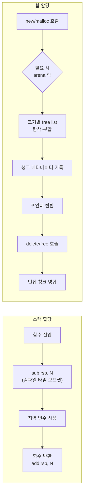

**Stack vs Heap 할당 비용**이란 같은 객체를 함수 스코프의 지역 변수로 둘지, `new`/`malloc`으로 힙에 올릴지에 따라 달라지는 실행 시간과 메모리 안전성의 차이를 정량적으로 이해하고, 상황에 맞게 저장 위치를 고르는 문제를 말합니다. 주문 매칭 엔진처럼 초당 수백만 건의 요청을 처리하는 코드에서는 임시 객체 하나를 스택에 둘지 힙에 올릴지의 선택이 함수 호출 하나마다 반복되므로, 그 작은 차이가 누적되어 지연 예산 전체를 잠식할 수 있습니다. 이 장은 "스택은 빠르고 힙은 느리다"는 통념을 구체적인 내부 동작으로 뜯어보고, 그 통념이 어디까지 맞고 어디서 무너지는지—코루틴 프레임, 탈출 분석의 부재, 스택 크기 제한—를 정량적으로 짚습니다.

## 이 장을 읽기 전에

이 장은 [챕터 15: 메모리·수명·캐시 라인 직관](/post/memory-optimization/memory-lifetime-cache-line-intuition-fundamentals/)에서 잡은 "스택은 프레임 단위 저장소, 힙은 수명을 프로그램이 결정하는 저장소"라는 직관과, [챕터 01: 컨테이너 비용 모델](/post/memory-optimization/container-cost-model-selection/)에서 다룬 "할당은 공짜가 아니다"라는 전제를 이어받습니다. 함수 호출·스코프·RAII의 기본 개념을 안다고 가정합니다.

이 장의 깊이는 **중급**입니다. 스택 프레임 확장과 힙 할당기 내부 동작을 비교해 왜 비용 차이가 나는지 설명하고, 언제 어느 쪽을 선택할지 판단 기준을 세우는 데까지 다룹니다. **다루지 않는 것**: 풀·아레나 직접 구현은 [챕터 02](/post/memory-optimization/pool-arena-allocation-strategy/), STL `Allocator` 요구사항을 만족하는 커스텀 할당자는 [챕터 03](/post/memory-optimization/custom-allocator-patterns/), `std::pmr` 적용은 [챕터 04](/post/memory-optimization/pmr-polymorphic-allocator-practical/), 짧은 문자열·작은 버퍼를 객체 내부에 넣는 SSO/SBO 원리는 [Tr.02 Small Buffer Optimization](/post/cpp-optimization/small-buffer-optimization/), 힙 단편화 자체의 분석·대응은 [챕터 10](/post/memory-optimization/memory-fragmentation-analysis/)에서 각각 다룹니다.

## 당신의 수준에 맞는 경로

| 수준 | 읽을 부분 | 핵심 목표 |
|------|---------|---------|
| **입문** | "스택 할당이 실제로 하는 일" ~ "힙 할당이 실제로 하는 일" | 두 저장소의 내부 동작이 왜 비용 차이를 만드는지 이해 |
| **중급** | "정량 비교: 벤치마크" ~ "스택 크기 제한과 오버플로우" | 실측으로 차이를 확인하고 스택의 한계를 파악 |
| **실무 적용** | "탈출 분석의 부재와 코루틴 프레임" ~ "판단 기준" | 언제 스택·힙을 선택할지, 코루틴 같은 예외 사례를 판단 |

---

## 역사와 배경

스택 기반 함수 호출은 하드웨어 스택 포인터 레지스터(x86의 `rsp`, ARM의 `sp`)와 호출 규약(calling convention)이 정의된 이래로 거의 모든 명령형 언어 구현의 기본 골격이었습니다. 함수가 호출될 때 프레임을 스택에 밀어 넣고 반환할 때 되돌리는 방식은 재귀 호출과 지역 변수 관리를 자연스럽게 지원하며, 별도의 런타임 자료구조 없이 하드웨어 명령 몇 개로 구현됩니다. 반면 힙 할당기는 훨씬 늦게, 그리고 훨씬 더 다양한 형태로 발전했습니다. K&R C 시절의 단순한 free list 기반 `malloc`부터 시작해, Doug Lea의 dlmalloc, 이를 계승한 glibc의 ptmalloc2, 이후 등장한 jemalloc·tcmalloc·mimalloc까지—범용적인 크기·수명 요구를 모두 만족시키기 위해 빈(bin) 분류, 스레드별 아레나, 캐시 등 점점 더 정교한 구조를 쌓아 왔습니다. 이 역사적 비대칭이 "스택은 원래 빠르고 힙은 원래 무겁다"는 체감의 근거입니다.

## 스택 할당이 실제로 하는 일

함수가 호출되면 컴파일러는 그 함수 안에서 쓰일 모든 지역 변수의 크기를 컴파일 타임에 더해 **하나의 오프셋**을 계산하고, 함수 진입부(prologue)에서 스택 포인터를 그 오프셋만큼 한 번에 이동시킵니다(x86-64에서는 대략 `sub rsp, N` 한 명령). 그 프레임 안에 지역 변수를 몇 개 선언하든, 각 변수의 주소는 이미 계산된 오프셋에서 파생되는 상수이므로 "변수 하나를 스택에 만든다"는 행위 자체에는 별도의 런타임 비용이 붙지 않습니다. 검색할 free list도, 갱신할 메타데이터도, 잡아야 할 락도 없습니다. 함수가 반환할 때는 스택 포인터를 되돌리는 것으로 프레임 전체가 한꺼번에 회수됩니다.

이 성질 때문에 스택 할당은 "느리다/빠르다"를 따지기보다 애초에 **할당이라는 별도의 연산이 존재하지 않는다**고 보는 편이 정확합니다. 다만 이 무비용성은 두 가지 전제에 의존합니다. 크기가 컴파일 타임에 알려져야 하고, 그 객체의 수명이 함수 스코프를 벗어나지 않아야 합니다. 이 전제를 벗어나는 순간—크기가 실행 중에 결정되거나, 함수 반환 후에도 값이 필요하거나—힙으로 넘어가야 합니다.

## 힙 할당이 실제로 하는 일

`new`/`malloc`은 요청받은 크기에 맞는 빈 공간을 **찾아야** 합니다. glibc의 ptmalloc2를 예로 들면, 크기별로 분류된 빈(bin) 중 요청 크기에 맞는 청크를 탐색하고, 필요하면 더 큰 청크를 분할하며, 반환하는 포인터 바로 앞에 청크 크기·플래그 같은 **메타데이터**를 기록합니다. 멀티스레드 프로그램에서는 스레드마다 별도 아레나를 두어 경합을 줄이지만, 완전히 없애지는 못합니다([챕터 16: 전역 할당자·jemalloc·tcmalloc](/post/memory-optimization/global-allocator-jemalloc-tcmalloc-tuning-expert/)에서 아레나·스레드 캐시 구조를 더 다룹니다). 요청 크기가 `mmap_threshold`(glibc 기본값 128KiB 부근, 실행 중 동적으로 조정됨)를 넘으면 힙 브레이크를 늘리는 대신 `mmap` 시스템 콜로 직접 페이지를 매핑하는데, 이는 커널 진입이라는 훨씬 무거운 경로입니다. `free`는 반환된 청크를 인접한 빈 청크와 병합(coalescing)해 단편화를 억제하려 시도합니다. 스택과 달리 이 모든 단계가 **런타임에** 일어나며, 요청 크기·현재 힙 상태·스레드 경합 상황에 따라 소요 시간이 달라집니다.



## 정량 비교: 벤치마크

두 경로의 차이를 직접 재현하면 다음과 같습니다. 아래는 같은 크기의 POD 페이로드를 매 반복마다 스택 지역 변수로 만드는 경우와, `std::make_unique`로 힙에 올리는 경우를 비교하는 Google Benchmark 골격입니다. 스택 쪽은 매 반복 같은 프레임 공간을 재사용하므로 사실상 "할당 자체가 없는" 경로를, 힙 쪽은 매 반복 실제 `new`/`delete` 쌍을 호출하는 경로를 대표합니다.

```cpp
#include <benchmark/benchmark.h>
#include <cstdint>
#include <memory>

constexpr std::size_t kSize = 256;  // SSO/캐시 임계를 넘는 크기

struct Payload {
  std::uint64_t data[kSize];
};

static void BM_StackAllocate(benchmark::State& state) {
  for (auto _ : state) {
    Payload p;  // 매 반복 같은 스택 프레임 공간을 재사용
    p.data[0] = 1;
    benchmark::DoNotOptimize(p.data[0]);
  }
}
BENCHMARK(BM_StackAllocate);

static void BM_HeapAllocate(benchmark::State& state) {
  for (auto _ : state) {
    auto p = std::make_unique<Payload>();  // 매 반복 new/delete 왕복
    p->data[0] = 1;
    benchmark::DoNotOptimize(p->data[0]);
  }
}
BENCHMARK(BM_HeapAllocate);

BENCHMARK_MAIN();
```

`g++ -O2 bench.cpp -lbenchmark -lpthread`(x86-64, GCC 13, `-O2` 기준 예시)로 빌드해 실행하면, `BM_HeapAllocate`가 `BM_StackAllocate`보다 한 자릿수–두 자릿수 배 느리게 나오는 경우가 흔합니다. 차이의 원인은 힙 경로가 매 반복 free list 탐색·메타데이터 기록·(멀티스레드라면) 락 획득을 실제로 수행하는 반면, 스택 경로는 컴파일 타임에 이미 확보된 프레임 공간의 주소만 재사용하기 때문입니다. 다만 이 배율은 할당기 구현(ptmalloc, jemalloc, tcmalloc, mimalloc)과 객체 크기·스레드 수에 따라 크게 흔들리므로 단정적인 숫자로 인용하지 말고 대상 환경에서 재현해야 합니다. 시스템 콜 수준의 차이를 직접 확인하려면 두 경로를 각각 별도 실행 파일로 만들어 `strace`로 세어 보는 방법이 있습니다.

```text
# 힙 경로: mmap_threshold를 넘는 큰 할당을 반복하면 mmap 호출이 관찰됨
$ strace -c -e trace=mmap,munmap,brk ./heap_heavy
% time     seconds  usecs/call     calls    errors syscall
------ ----------- ----------- --------- --------- ----------------
 41.2%    0.000812          27        30           mmap
 18.5%    0.000365          12        30           munmap
...

# 스택만 쓰는 경로: 힙 관련 시스템 콜이 거의 나타나지 않음
$ strace -c -e trace=mmap,munmap,brk ./stack_only
% time     seconds  usecs/call     calls    errors syscall
------ ----------- ----------- --------- --------- ----------------
  0.0%    0.000000           0         1           brk
```

## 탈출 분석의 부재와 코루틴 프레임

Java·Go 같은 언어의 런타임은 <strong>탈출 분석(escape analysis)</strong>을 통해 "이 객체가 함수 밖으로 나가지 않는다"는 것을 증명할 수 있으면 힙 할당을 자동으로 스택 할당으로 승격시킵니다. C++ 컴파일러는 일반적으로 이런 보장을 제공하지 않습니다. `new`로 만든 객체는 컴파일러가 스코프를 증명할 수 있어도 원칙적으로 힙에 남으며, 이는 표준이 요구하는 것이 아니라 구현이 선택하지 않은 최적화입니다.

유일한 예외에 가까운 것이 C++20 코루틴의 <strong>HALO(Heap Allocation eLision Optimization)</strong>입니다. 코루틴 프레임은 기본적으로 힙에 할당되지만, 컴파일러가 코루틴의 램프 함수(ramp function)와 관련 글루 코드를 인라인할 수 있고 그 결과 호출자의 스택 프레임 안에 코루틴 프레임을 안전하게 넣을 수 있다고 증명하면, 힙 할당을 완전히 생략할 수 있습니다. 이 최적화의 조건은 [Gor Nishanov와 Richard Smith의 P0981R0](https://www.open-std.org/jtc1/sc22/wg21/docs/papers/2018/p0981r0.html)에서 처음 제안되었고, 핵심은 "코루틴 프레임이 호출자보다 오래 살지 않는다"는 것을 컴파일러가 같은 번역 단위 안에서 증명할 수 있어야 한다는 점입니다. Clang/LLVM은 이를 `CoroElide`라는 이름으로, MSVC도 유사한 elision을 구현하고 있습니다.

문제는 이 최적화가 "보장된 계약"이 아니라 "적용되면 좋은 최적화"라는 점입니다. 2026년 시점에도 단순한 코루틴에서는 잘 작동하지만 복잡한 비동기 체인이나 가상 함수 호출을 거치는 경로에서는 적용되지 않는 경우가 흔히 보고됩니다. Microsoft의 개발자 블로그는 반대 방향의 함정도 지적합니다. HALO가 적용되어 코루틴 프레임이 스택으로 옮겨지더라도, 최적화 단계에서 이미 죽은 변수로 판명된 임시 버퍼(`__coro_elision_buffer`)의 공간을 컴파일러가 회수하지 못해 실제로는 쓰지 않는 스택 공간을 여전히 예약해 두는 경우가 있었고, 이는 큰 지역 변수를 가진 코루틴에서 예상치 못한 스택 오버플로우로 이어질 수 있었습니다.

> "it fails to realize that the `__coro_elision_buffer` is now a dead variable, so the function allocates stack space for a buffer it never uses." — Raymond Chen, [The Old New Thing: "Why does calling a coroutine allocate a lot of stack space even though the coroutine frame is on the heap?"](https://devblogs.microsoft.com/oldnewthing/20231115-00/?p=109020) (2023, 이후 MSVC에서 수정됨)

핫패스에 코루틴을 쓴다면 HALO가 적용될지 여부를 컴파일러 버전·최적화 수준·번역 단위 경계에 기대지 말고, 프레임 크기가 큰 코루틴은 [챕터 03의 커스텀 할당자 패턴](/post/memory-optimization/custom-allocator-patterns/)으로 프레임 할당 자체를 직접 통제하는 편이 안전합니다.

## 스택 크기 제한과 오버플로우

스택은 무한하지 않습니다. 프로세스(또는 스레드)마다 정해진 상한이 있고, 이를 넘으면 커널이 `SIGSEGV`를 보냅니다. 리눅스에서 메인 스레드의 기본 스택 한도는 흔히 8MiB(`ulimit -s`, `RLIMIT_STACK`으로 조정 가능) 근처이고, `pthread_create`로 만드는 스레드도 별도로 지정하지 않으면 비슷한 기본값을 물려받는 경우가 많습니다. 반면 Windows는 스레드 기본 스택 크기가 1MiB로 훨씬 작고, 링커의 `/STACK` 옵션이나 스레드 생성 API로 늘려야 합니다. 스레드를 수천 개 띄우는 서버라면 스레드당 기본 스택 크기만으로도 수 GiB의 가상 메모리를 예약하게 되므로, 필요한 만큼만 줄여 지정하는 것이 실무에서 흔한 튜닝 포인트입니다. `RLIMIT_STACK` 한도에 닿으면 커널이 곧바로 `SIGSEGV`를 보내는데, 이 신호를 프로세스 안에서 처리하려면 `sigaltstack`으로 별도의 대체 시그널 스택을 마련해야 합니다. 스택이 이미 넘친 상태에서는 시그널 핸들러조차 스택 공간이 필요하기 때문입니다.

이 한도는 재귀 함수와 큰 지역 배열에서 특히 문제가 됩니다. 재귀 깊이와 프레임 크기를 곱한 값이 한도를 넘으면 오버플로우가 나고, 이는 종종 입력 크기에 의존하는 재귀(트리 순회, 파서의 재귀 하강)에서 운영 환경의 입력이 테스트보다 클 때 발생합니다. 실행 시점에 크기가 정해지는 가변 길이 배열(VLA, GNU 확장)이나 `alloca`도 같은 위험을 안고 있으며, 여기에 더해 표준 C++이 아니라는 점과 크기 값이 외부 입력에서 오면 오버플로우 검사 없이 스택을 밀어붙인다는 보안 문제까지 겹칩니다.

## 흔한 오개념

<strong>"스택 할당은 항상 공짜다"</strong>는 절반만 맞습니다. 이미 확보된 프레임 공간을 재사용하는 한 맞지만, 함수가 처음 그 스택 페이지 영역에 닿을 때는 아직 매핑되지 않은 페이지에 대한 소프트 페이지 폴트가 발생할 수 있고, 큰 지역 배열을 여러 개 겹쳐 선언하면 위에서 본 스택 한도에 그만큼 빨리 다가갑니다. "공짜"는 할당 알고리즘이 없다는 뜻이지, 물리적으로 아무 비용이 없다는 뜻은 아닙니다.

<strong>"컴파일러가 escape analysis로 힙 할당을 스택으로 자동 승격해 준다"</strong>는 C++에서는 대체로 틀립니다. 이는 Java/Go 계열 런타임의 특성이며, C++ 컴파일러는 코루틴 프레임이라는 좁은 예외(HALO)에서만 유사한 최적화를 시도하고, 그마저도 앞서 본 것처럼 안정적으로 보장되지 않습니다. `new`로 만든 객체가 함수 밖으로 나가지 않는다고 해서 컴파일러가 알아서 스택으로 옮겨 줄 것이라고 기대하면 안 됩니다.

<strong>"재귀나 VLA는 스택에 있으니 크기 걱정이 없다"</strong>도 흔한 착각입니다. 스택은 유한한 자원이고, 입력에 의존하는 재귀 깊이나 실행 시점 크기의 VLA는 정상적인 입력 범위 안에서도 스택 한도를 넘을 수 있습니다. 크기가 예측 불가능하다면 처음부터 힙 기반 자료구조(명시적 스택을 흉내 낸 `std::vector` 등)로 반복문을 구성하는 편이 안전합니다.

## 판단 기준

| 상황 | 권장 | 비권장 |
|------|------|--------|
| 크기가 컴파일 타임에 알려진 작은/중간 객체, 함수 스코프 안에서만 사용 | 지역 변수(스택) | 굳이 `new`로 힙에 올리기 |
| 함수 반환 후에도 값이 필요(참조·포인터가 스코프 밖으로 탈출) | 힙 또는 값으로 반환(이동/복사 생략에 의존) | 스택 객체의 주소·참조를 반환 |
| 크기가 실행 중 결정되거나 매우 큰 배열 | 힙 기반 컨테이너(`std::vector`, `std::unique_ptr<T[]>`) | VLA·`alloca` |
| 입력에 의존하는 깊은 재귀 | 반복문 + 힙 기반 명시적 스택으로 전환 | 무제한 재귀에 지역 배열 추가 |
| 스레드를 다수 생성하는 서버 | 필요한 만큼만 스레드 스택 크기 지정 | 기본 스택 크기 그대로 수천 스레드 생성 |
| 핫패스의 코루틴 | 프레임 크기를 직접 설계하거나 커스텀 할당자로 통제 | HALO가 항상 적용될 것이라 가정 |

### 적용 체크리스트

- [ ] 객체 크기가 컴파일 타임에 확정되고 스코프가 함수 안에 갇혀 있는가? 그렇다면 우선 지역 변수로 둔다.
- [ ] 반환 후에도 값이 필요하다면 스택 객체의 주소가 아니라 값·소유권을 반환하는 경로로 설계했는가?
- [ ] 재귀 깊이나 VLA 크기가 외부 입력에 의존한다면, 힙 기반 반복 구조로 바꾸는 것을 검토했는가?
- [ ] 스레드를 다수 생성하는 코드에서 스레드 스택 크기를 필요한 만큼으로 줄였는가?
- [ ] 핫패스 코루틴에서 HALO 적용 여부를 가정하지 않고 실제 어셈블리·프로파일로 확인했는가?
- [ ] 스택/힙 전환 전후를 벤치마크로 비교하고 대상 환경에서 재현했는가?

## 비판적 시각: 한계와 트레이드오프

스택이 빠른 이유는 마법이 아니라 **범용성을 포기한 대가**입니다. 크기가 컴파일 타임에 확정되고 수명이 스코프에 묶인다는 제약을 지키는 한에서만 무비용에 가깝고, 이 제약을 우회하려는 시도(스택 객체 주소 반환, 입력 의존 VLA)는 곧바로 정확성 문제로 이어집니다. 힙은 그 반대급부로 유연성을 얻는 대신 락 경합([챕터 16](/post/memory-optimization/global-allocator-jemalloc-tcmalloc-tuning-expert/))과 단편화([챕터 10](/post/memory-optimization/memory-fragmentation-analysis/))라는 다른 종류의 비용을 함께 들여옵니다. HALO는 "코루틴은 항상 힙"이라는 통념을 깨뜨리는 흥미로운 사례이지만, 컴파일러·최적화 수준·번역 단위 경계에 따라 적용 여부가 갈리는 비보장 최적화라는 점에서 신뢰할 수 있는 설계 도구라기보다는 "적용되면 보너스"에 가깝습니다. 실무에서 지연 예산이 타이트한 코드는 이런 비보장 최적화에 기대기보다, 저장 위치를 명시적으로 설계하고 [Google Benchmark 실전](/post/profiling-analysis/google-benchmark-practical/)과 [메모리 프로파일링: 힙 분석](/post/profiling-analysis/memory-profiling-heap-analysis/)으로 검증하는 편이 안전합니다.

## 마무리

- **설명**: 스택 프레임 확장(컴파일 타임 오프셋)과 힙 할당기 내부 동작(free list 탐색·메타데이터·락·mmap)의 비용 차이를 근거로 설명할 수 있다.
- **측정**: 스택 지역 변수와 힙 할당을 벤치마크로 비교하고, 배율이 할당기·크기·스레드 수에 따라 달라짐을 이해한다.
- **판단**: 크기 확정 여부·수명 탈출 여부·재귀 깊이를 기준으로 스택/힙 중 무엇을 선택할지 결정할 수 있다.
- **경계**: C++ 컴파일러가 일반적인 escape analysis를 보장하지 않는다는 것과, 코루틴 프레임의 HALO가 예외적이면서도 불안정한 최적화라는 것을 구분한다.
- **위험 인지**: 스택 크기 한도(Linux ~8MiB, Windows 1MiB 기본값)와 재귀·VLA로 인한 오버플로우 위험을 실무 설계에 반영할 수 있다.

**이전 장**: [메모리 대역폭 최적화](/post/memory-optimization/memory-bandwidth-optimization-cxl/) (챕터 11)

**다음 장에서는** 가상 메모리 관리 힌트를 다룹니다. `madvise` 같은 힌트로 커널에게 메모리 사용 패턴을 알려 페이지 관리를 최적화하는 방법과, ARM MTE(Memory Tagging Extension)처럼 하드웨어 수준에서 메모리 안전성을 검증하는 최신 기법을 정리합니다. 이 장에서 다룬 "스택 페이지가 처음 닿을 때 폴트가 난다"는 직관은 다음 장의 가상 메모리 관리와 바로 이어집니다.

→ [Virtual Memory 관리 힌트](/post/memory-optimization/virtual-memory-hints-madvise-mte/) (챕터 13)
