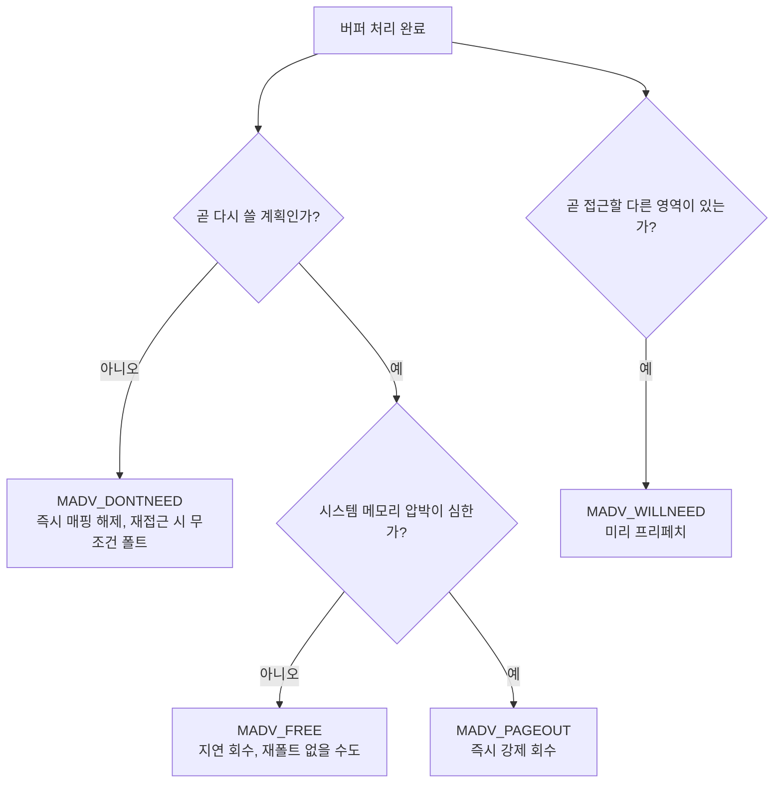

**Virtual Memory 관리 힌트**란 애플리케이션이 커널에게 "이 영역을 앞으로 어떻게 쓸 것인지" 또는 "이 영역이 언제까지 저장소와 일치해야 하는지"를 알려주어, 커널이 페이지 회수·프리페치·write-back 시점을 애플리케이션의 실제 접근 패턴에 맞추도록 하는 시스템 콜 계열을 말합니다. 커널은 기본적으로 보수적인 범용 정책으로 페이지를 관리하므로, 핫패스에서 반복적으로 재사용될 버퍼를 무심코 즉시 반환하거나, 반대로 다시는 쓰지 않을 거대한 스크래치 버퍼를 계속 상주시켜 두면 그 차이가 지연과 상주 메모리(RSS) 양쪽에 누적됩니다. 이 장에서는 `madvise`로 페이지 회수 우선순위를 조정하고 `msync`로 페이지 캐시와 저장소의 동기화 시점을 통제하는 방법을 다룬 뒤, 같은 "메모리를 하드웨어 수준에서 어떻게 다루는가"라는 축에서 최근 실용화가 빠르게 진행되고 있는 <strong>ARM MTE(Memory Tagging Extension)</strong>의 동작 원리와 오버헤드 추이를 살펴봅니다.

## 이 장을 읽기 전에

**완전한 초보자?** 이 장은 [12장: Stack vs Heap 할당 비용](/post/memory-optimization/stack-vs-heap-allocation-cost/)에서 다룬 할당 비용 감각과, [15장: 메모리·수명·캐시 라인 직관](/post/memory-optimization/memory-lifetime-cache-line-intuition-fundamentals/)에서 다룬 가상 주소·페이지 폴트의 기본 그림을 전제로 합니다. "페이지"가 커널이 메모리를 다루는 최소 단위이고, 접근하지 않은 페이지는 물리 메모리를 실제로 점유하지 않을 수 있다는 것만 알면 충분합니다.

**이 장의 깊이**: 이 장은 **심화** 난이도로, `madvise`의 회수 관련 힌트(`MADV_DONTNEED`, `MADV_FREE`, `MADV_COLD`, `MADV_PAGEOUT`, `MADV_WILLNEED`)와 `msync`의 동기화 힌트를 실전 코드로 다룬 뒤, ARM MTE의 태깅 메커니즘과 2025–2026년 사이 좁혀진 오버헤드 수치를 정리합니다. **다루지 않는 것**: `MADV_HUGEPAGE`·`MADV_COLLAPSE`와 THP/mTHP는 [08장: Large Pages·Huge Pages](/post/memory-optimization/huge-pages-large-pages-mthp/)에서, NUMA 노드별 배치 힌트는 [09장: NUMA 메모리 할당·지역성](/post/memory-optimization/numa-memory-allocation-locality/)에서, Valgrind·AddressSanitizer 같은 소프트웨어 기반 메모리 오류 탐지 도구는 [14장: 메모리 누수 탐지](/post/memory-optimization/memory-leak-detection-valgrind-asan/)에서 다룹니다.

## 당신의 수준에 맞는 경로

| 수준 | 읽을 부분 | 핵심 목표 |
|------|---------|---------|
| **초보자** | "가상 메모리 힌트의 역사와 배경" ~ "madvise: 커널에 회수 우선순위를 알려주는 힌트" | 힌트가 커널 정책을 어떻게 바꾸는지 원리 이해 |
| **중급자** | "msync: 페이지 캐시와 저장소 동기화 시점 제어" ~ "측정: MADV_DONTNEED vs MADV_FREE 재접근 비용" | madvise/msync를 실제 코드에 적용하고 실측하는 방법 습득 |
| **전문가** | "ARM MTE" ~ "비판적 시각" | MTE 도입 여부와 모드 선택, 하드웨어 세대별 오버헤드 판단 |

---

## 가상 메모리 힌트의 역사와 배경

`madvise`는 BSD 계열 유닉스에서 오래전부터 존재해 온 시스템 콜로, POSIX는 이를 `posix_madvise(3)`로 표준화하면서 `POSIX_MADV_NORMAL`·`POSIX_MADV_SEQUENTIAL`·`POSIX_MADV_RANDOM`·`POSIX_MADV_WILLNEED`·`POSIX_MADV_DONTNEED` 다섯 가지 힌트를 정의했습니다. Linux는 이 표준 힌트 위에 자체 확장을 계속 추가해 왔는데, 회수 성향을 지연시키는 `MADV_FREE`는 Linux 4.5(2016)에서 병합되었고, 압박이 없을 때는 페이지를 회수 후보로만 표시하는 `MADV_COLD`와 즉시 강제로 스왑·write-back을 유발하는 `MADV_PAGEOUT`은 Linux 5.4(2019)에서 추가되었습니다. `msync`는 mmap된 파일과 페이지 캐시 간의 동기화를 다루는 훨씬 오래된 POSIX 표준 API로, `MS_SYNC`·`MS_ASYNC`·`MS_INVALIDATE` 세 플래그의 의미는 수십 년간 크게 바뀌지 않았습니다.

ARM MTE는 이 흐름과는 결이 다른, 하드웨어 자체가 메모리 접근을 검사하는 기능입니다. ARM은 2019년 Armv8.5-A 아키텍처 확장으로 MTE를 처음 명세했고, 포인터의 상위 비트에 4비트 태그를 심고 16바이트 단위 메모리 조각(granule)마다 같은 태그를 붙여, 포인터가 가리키는 태그와 메모리에 저장된 태그가 어긋나면 하드웨어가 폴트를 일으키는 방식으로 use-after-free와 buffer-overflow 계열 버그를 잡아냅니다. 실제 소비자 하드웨어에는 2023년 10월 출시된 Google Pixel 8 계열에서 처음 탑재되었고, Android NDK는 `-fsanitize=memtag` 컴파일러 플래그와 `AndroidManifest.xml`의 `android:memtagMode` 속성으로 이를 노출합니다. 초기 소프트웨어 스택과 구형 코어에서는 SPEC 계열 벤치마크 기준 동기 모드(SYNC)가 6배 이상 느려지는 사례가 보고되며 "MTE는 오버헤드 때문에 실무에 못 쓴다"는 인식이 굳어졌지만, 2025–2026년 사이 발표된 서버급 하드웨어 최적화 연구는 이 그림을 상당히 바꿔 놓았습니다. 자세한 수치는 뒤의 "ARM MTE" 절에서 다룹니다.

## madvise: 커널에 회수 우선순위를 알려주는 힌트

`madvise`는 이미 매핑된 가상 주소 범위에 대해 커널의 메모리 관리 정책을 조정하는 힌트입니다. 중요한 점은 힌트가 대부분 **강제가 아니라 우선순위 조정**이라는 것입니다 — 커널은 힌트를 참고하되 실제 회수·프리페치 시점은 시스템 전체의 메모리 압박 상황에 따라 달라집니다. 회수 관련 힌트 중 가장 자주 비교되는 두 가지는 `MADV_DONTNEED`와 `MADV_FREE`입니다. `MADV_DONTNEED`는 해당 범위의 매핑을 즉시 해제하고, 이후 그 주소에 다시 접근하면 무조건 새 페이지 폴트가 발생해 익명 매핑이면 0으로 채워진 페이지를, 파일 매핑이면 파일에서 다시 읽어온 내용을 돌려받습니다. `MADV_FREE`는 그보다 느슨해서, 해당 범위를 "필요하면 회수해도 되는 후보"로만 표시해 두고 실제 회수는 시스템이 메모리 압박을 받을 때까지 미룹니다 — 압박이 오기 전에 같은 주소에 다시 쓰기(write)를 하면 회수 표시가 취소되어 폴트 없이 그대로 재사용됩니다.

이 차이 때문에 `MADV_FREE`는 재사용 가능성이 있는 버퍼를 반납할 때 재폴트 비용을 피할 수 있어 `jemalloc` 등 여러 할당자가 이를 선호하지만, 대가로 **관찰성(observability) 문제**가 따라옵니다. `MADV_FREE`로 표시된 페이지는 실제 회수 전까지 `/proc/<pid>/status`의 RSS 통계에 여전히 상주 메모리로 잡히므로, "메모리를 반납했는데 RSS가 줄지 않는다"는 오해로 이어지기 쉽습니다. 이 관찰성 문제는 [16장: 전역 할당자·jemalloc·tcmalloc](/post/memory-optimization/global-allocator-jemalloc-tcmalloc-tuning-expert/)에서 다루는 할당자별 purge 정책과 직결되므로, 전역 할당자의 RSS 추세를 볼 때는 이 지연 회수 특성을 함께 감안해야 합니다.

`MADV_COLD`(Linux 5.4 이상)는 페이지를 즉시 회수하지 않고 "회수 후보 목록의 앞쪽으로 옮기는" 비파괴적 힌트이고, `MADV_PAGEOUT`(Linux 5.4 이상)은 그 반대로 익명 페이지는 스왑으로, dirty한 파일 캐시 페이지는 write-back으로 즉시 밀어내는 강제 회수입니다. `MADV_WILLNEED`는 반대 방향의 힌트로, 곧 접근할 범위를 미리 커널에 알려 프리페치를 유도해 최초 접근 시의 폴트 지연을 앞당겨 숨깁니다.

```cpp
#include <sys/mman.h>
#include <cstdio>
#include <cstring>

void release_scratch_buffer(void* addr, size_t len, bool will_reuse_soon) {
  if (will_reuse_soon) {
    // 곧 다시 쓸 예정: 압박 전까지는 재폴트 없이 그대로 재사용될 수 있다
    madvise(addr, len, MADV_FREE);
  } else {
    // 다시 안 쓸 버퍼: 즉시 매핑을 반납해 RSS를 바로 줄인다
    madvise(addr, len, MADV_DONTNEED);
  }
}

void warm_up_before_access(void* addr, size_t len) {
  madvise(addr, len, MADV_WILLNEED);  // 곧 접근할 대용량 영역을 미리 커널에 알림
}
```

두 힌트 모두 실패해도(예: 잘못된 정렬이나 잠긴 페이지) 애플리케이션 정합성에는 영향이 없지만, 반환값을 무시하면 힌트가 조용히 적용되지 않은 채로 넘어갈 수 있으므로 로깅 정도는 남겨 두는 편이 디버깅에 유리합니다.

## msync: 페이지 캐시와 저장소 동기화 시점 제어

`mmap`으로 연 파일에 쓰기를 하면 그 변경은 먼저 페이지 캐시에만 반영되고, 커널은 dirty 페이지를 자체 스케줄에 따라 나중에 저장소로 write-back합니다. `msync`는 이 write-back 시점을 애플리케이션이 직접 통제할 수 있게 해 주는 호출로, `MS_SYNC`는 write-back이 끝날 때까지 블로킹하고, `MS_ASYNC`는 write-back을 예약만 해 두고 즉시 반환합니다. Linux 2.6.19 이후로는 커널이 dirty 페이지를 알아서 추적해 필요할 때 flush하므로 `MS_ASYNC`는 사실상 아무 일도 하지 않는 no-op에 가깝지만, 이는 Linux 고유의 동작이므로 이식성이 필요한 코드에서는 `MS_ASYNC`가 "즉시 완료를 보장한다"고 가정하면 안 됩니다. `MS_INVALIDATE`는 같은 파일의 다른 매핑들도 방금 쓴 값으로 갱신되도록 무효화하는 플래그로, 여러 프로세스가 같은 파일을 공유 매핑(`MAP_SHARED`)할 때만 의미가 있습니다.

`msync` 없이도 `munmap`이나 프로세스 종료 시점에는 커널이 dirty 페이지를 저장소에 반영하므로, "매핑 해제 전에 반드시 `msync`를 호출해야 한다"는 것은 사실이 아닙니다. `msync(MS_SYNC)`가 실제로 필요한 시점은 **정전이나 크래시에도 특정 시점까지의 쓰기가 디스크에 반영되었음을 보장해야 하는 체크포인트**처럼, 프로세스가 정상 종료되지 않을 가능성까지 고려해야 하는 상황입니다.

```cpp
#include <sys/mman.h>
#include <fcntl.h>
#include <unistd.h>
#include <cstdio>
#include <cstring>

int checkpoint_write(const char* path, const char* payload, size_t len) {
  int fd = open(path, O_RDWR | O_CREAT, 0644);
  if (fd < 0) { perror("open"); return -1; }
  if (ftruncate(fd, len) != 0) { perror("ftruncate"); close(fd); return -1; }

  void* p = mmap(nullptr, len, PROT_READ | PROT_WRITE, MAP_SHARED, fd, 0);
  if (p == MAP_FAILED) { perror("mmap"); close(fd); return -1; }

  std::memcpy(p, payload, len);        // 여기까지는 페이지 캐시에만 반영된 상태
  if (msync(p, len, MS_SYNC) != 0) {   // 저장소 반영을 실제로 기다린 뒤에만 리턴
    perror("msync");
  }

  munmap(p, len);
  close(fd);
  return 0;
}
```

크래시 안전성이 필요 없는 일반적인 파일 갱신에서 매 쓰기마다 `MS_SYNC`를 호출하면 블로킹 비용이 그대로 지연 예산에 반영되므로, 체크포인트 주기를 배치로 묶거나 `MS_ASYNC` + 주기적 `MS_SYNC` 조합으로 빈도를 조절하는 것이 일반적입니다.

## 측정: MADV_DONTNEED vs MADV_FREE 재접근 비용

두 힌트의 차이는 주장이 아니라 재접근 시의 페이지 폴트 횟수로 직접 확인할 수 있습니다. 아래는 256MiB 버퍼를 한 번 전부 커밋한 뒤, 인자로 받은 힌트를 적용하고 다시 페이지 단위로 훑는 최소 벤치마크입니다. Linux(x86-64), `-std=c++17` 기준으로 작성했습니다.

```cpp
#include <sys/mman.h>
#include <chrono>
#include <cstdint>
#include <cstdio>
#include <cstring>
#include <string>

int main(int argc, char** argv) {
  constexpr size_t kSize = 1ull << 28;  // 256MiB
  void* buf = mmap(nullptr, kSize, PROT_READ | PROT_WRITE,
                   MAP_PRIVATE | MAP_ANONYMOUS, -1, 0);
  if (buf == MAP_FAILED) { perror("mmap"); return 1; }

  std::memset(buf, 1, kSize);  // 전체 페이지를 한 번 커밋(첫 워밍업)

  const std::string mode = argc > 1 ? argv[1] : "none";
  if (mode == "dontneed") {
    madvise(buf, kSize, MADV_DONTNEED);  // 즉시 매핑 해제: 재접근 시 무조건 폴트
  } else if (mode == "free") {
    madvise(buf, kSize, MADV_FREE);      // 지연 회수: 압박 전이면 폴트 없을 수도
  }
  // mode == "none": 힌트 없이 그대로 재접근(대조군)

  const auto t0 = std::chrono::steady_clock::now();
  volatile uint8_t sink = 0;
  auto* base = static_cast<uint8_t*>(buf);
  for (size_t i = 0; i < kSize; i += 4096) {
    sink += base[i];  // 페이지당 1바이트만 건드려 폴트 발생 여부만 관찰
  }
  const auto t1 = std::chrono::steady_clock::now();

  std::printf("mode=%s elapsed_us=%ld sink=%u\n", mode.c_str(),
              std::chrono::duration_cast<std::chrono::microseconds>(t1 - t0).count(),
              sink);
  munmap(buf, kSize);
  return 0;
}
```

`g++ -O2 -std=c++17 madvise_bench.cpp -o madvise_bench`로 빌드한 뒤, `perf stat`으로 폴트 횟수를 함께 측정합니다.

```bash
perf stat -e page-faults ./madvise_bench none
perf stat -e page-faults ./madvise_bench dontneed
perf stat -e page-faults ./madvise_bench free
```

세 모드를 순서대로 실행하면 `page-faults` 카운터가 힌트별로 뚜렷하게 갈리는 것을 볼 수 있습니다.

```text
# none (대조군, 이미 커밋된 페이지 재접근 — 예시 형태, 실제 수치는 환경마다 다름)
                   4      page-faults

# dontneed (모든 페이지가 새로 폴트)
              65,536      page-faults

# free (메모리 압박이 없는 상태라면 재폴트가 거의 발생하지 않을 수 있음)
                  12      page-faults
```

`free` 모드의 결과는 벤치마크 실행 시점의 시스템 메모리 압박 상태에 크게 좌우됩니다. 압박이 있는 환경에서 재현하면 `MADV_FREE`도 `MADV_DONTNEED`에 가까운 폴트 수를 보일 수 있으므로, "MADV_FREE가 항상 공짜"라고 일반화하지 말고 대상 서버의 실제 메모리 여유 상태에서 재현하는 것이 중요합니다. 힙 전체의 할당·회수 흐름을 더 넓게 보고 싶다면 [Tr.01 ch20: 메모리 프로파일링: 힙 분석](/post/profiling-analysis/memory-profiling-heap-analysis/)에서 다루는 heaptrack 계열 도구와 병행하는 것을 권장합니다.



## ARM MTE: 하드웨어 태그로 메모리 안전성을 검사하다

<strong>MTE(Memory Tagging Extension)</strong>는 소프트웨어 힌트가 아니라 CPU가 직접 메모리 접근을 검사하는 하드웨어 기능입니다. 64비트 포인터의 최상위 바이트 일부에 4비트 태그를 저장하고, 그 포인터가 가리키는 16바이트 단위 메모리 조각(granule)마다 같은 태그를 별도로 기록해 둡니다. `IRG` 명령이 무작위 태그를 생성해 포인터에 심고, `STG`류 명령이 그 태그를 실제 메모리 조각에 씁니다. 이후 그 포인터로 메모리에 접근할 때마다 CPU가 포인터의 태그와 메모리 조각에 기록된 태그를 비교해, 둘이 어긋나면 태그 불일치 폴트를 일으킵니다. 이 메커니즘은 free된 메모리를 재할당할 때 새 태그를 부여하는 것만으로 use-after-free를, 배열 경계를 벗어난 접근이 다음 조각의 다른 태그와 부딪히는 것으로 buffer-overflow를 감지합니다.

MTE는 검사 시점에 따라 세 모드로 동작합니다. **동기(SYNC)** 모드는 태그 불일치가 발생한 바로 그 로드/스토어 명령에서 즉시 `SIGSEGV`(코드 `SEGV_MTESERR`)를 일으켜 정확한 폴트 주소와 접근 정보를 남기므로 디버깅에 유리하지만 그만큼 매 접근마다 검사 비용이 붙습니다. **비동기(ASYNC)** 모드는 불일치를 즉시 알리지 않고 다음 커널 진입(시스템 콜이나 타이머 인터럽트) 시점까지 미뤄 두어, 정확한 폴트 위치 정보는 잃는 대신 성능 오버헤드를 크게 줄입니다. 이 둘을 절충한 **비대칭(ASYMM)** 모드는 읽기는 비동기로, 쓰기는 동기로 검사해 두 목표 사이의 균형을 잡습니다. Android는 `AndroidManifest.xml`의 `android:memtagMode` 속성이나 NDK의 `-fsanitize=memtag -fsanitize-memtag-mode=sync|async` 컴파일러 플래그로 이를 노출하며, Pixel 8 계열(2023년 10월 출시)부터 지원 기기가 늘어나고 있습니다.

```bash
# Android NDK 빌드에서 MTE 계측을 켜는 컴파일러/링커 플래그(ARMv8.5+ 대상)
APP_CFLAGS := -fsanitize=memtag -fno-omit-frame-pointer -march=armv8-a+memtag
APP_LDFLAGS := -fsanitize=memtag -fsanitize-memtag-mode=sync -march=armv8-a+memtag
```

초기 MTE 성능 평가는 주로 SPEC 계열 벤치마크에서 동기 모드가 6배 이상, 비동기 모드도 2배 가까이 느려지는 사례를 보고했고, 이 수치가 "MTE는 실무에 못 쓴다"는 인식을 굳혔습니다. 그러나 2025년 11월 공개된 AmpereOne 프로세서 대상 연구(Kaushik 외, Ampere Computing, arXiv:2511.17773, ISCA 2026 발표 확정)는 태그 저장에 별도 메모리 용량 오버헤드가 들지 않는 하드웨어 설계를 적용해, SPEC CPU 2017 기준 SPECrate geomean 오버헤드를 한 자릿수%대인 약 **7.6%**(약 1.08배) 수준까지 낮췄다고 보고합니다. 한편 memcached가 한때 최대 **1.40배**까지 느려졌다가 리눅스 커널의 MTE 처리 경로에 있던 성능 결함이 패치된 뒤 약 1.05배 수준으로 좁혀졌다는 결과는 같은 연구가 아니라 별도 연구(Noh 외, "ARM MTE Performance in Practice", arXiv:2601.11786, UT Austin·UC Berkeley)에서 보고된 것입니다. 즉 "MTE 오버헤드가 한 자릿수%대까지, memcached 같은 실제 워크로드는 1.40배에서 1.05배까지 낮아졌다"는 흐름은 서로 다른 두 연구가 각각 보고한 결과이며, 하드웨어 세대가 올라가고 커널 지원이 성숙해지면서 나타난 개선이지 모든 ARM 코어에 즉시 적용되는 보편적 수치는 아닙니다.

## 자주 하는 오해 정정

<strong>"madvise를 호출하면 그 순간 메모리가 반환된다"</strong>는 정확하지 않습니다. `MADV_DONTNEED`는 즉시 매핑을 해제하지만, `MADV_FREE`는 회수 후보로만 표시해 둘 뿐 실제 회수는 시스템 압박이 올 때까지 미뤄지고, 그동안 RSS 통계에는 여전히 잡힙니다. "반납했는데 RSS가 안 줄어든다"는 관찰은 버그가 아니라 `MADV_FREE`의 설계된 동작입니다.

<strong>"mmap 파일에 쓴 뒤 msync를 안 하면 데이터가 위험하다"</strong>도 과장된 통념입니다. 커널은 dirty 페이지를 스스로 추적해 `munmap`이나 프로세스 종료 시점에 알아서 write-back하므로, 정상 종료 경로에서는 `msync`가 필수가 아닙니다. `msync(MS_SYNC)`가 정말 필요한 순간은 프로세스가 비정상 종료되거나 시스템이 정전될 가능성까지 고려해 "이 시점까지의 쓰기는 반드시 디스크에 있어야 한다"고 보장해야 하는 체크포인트뿐입니다. 또한 Linux에서 `MS_ASYNC`는 2.6.19 이후로 사실상 no-op이므로 "MS_ASYNC가 즉시 flush를 예약해 준다"고 기대해서도 안 됩니다.

<strong>"ARM MTE는 오버헤드 때문에 프로덕션에 쓸 수 없다"</strong>는 통념도 최신 하드웨어 기준으로는 재검토가 필요합니다. 초기 소프트웨어 에뮬레이션이나 구형 코어 기준의 6배 이상 수치와, 태그 저장 오버헤드를 없앤 최신 서버급 하드웨어에서 SPEC CPU 2017 기준 geomean 한 자릿수%대(memcached는 커널 패치 후 1.05배)로 보고되는 수치는 전혀 다른 이야기입니다. 다만 이 개선은 특정 세대 하드웨어와 커널 버전에 국한되므로, 대상 배포 환경의 CPU 세대와 커널 버전을 먼저 확인하지 않은 채 "MTE는 이제 싸다"고 일반화하는 것도 같은 종류의 오해입니다.

## 판단 기준

| 상황 | 권장 | 비권장 |
|------|------|--------|
| 큰 버퍼를 다 쓰고 다시는 안 씀, RSS를 즉시 낮춰야 함 | `MADV_DONTNEED` | 힌트 없이 `free()`만 호출 |
| 곧 재사용할 가능성이 있는 버퍼, 재폴트 비용을 피하고 싶음 | `MADV_FREE` (압박이 크지 않은 환경) | 매번 `MADV_DONTNEED`로 재폴트 유발 |
| 곧 접근할 대용량 파일·버퍼를 미리 준비 | `MADV_WILLNEED` | 접근 시점의 첫 폴트로 지연 유발 |
| 당분간 접근 안 할 콜드 데이터를 회수 후보로만 표시 | `MADV_COLD` | `MADV_PAGEOUT`으로 과하게 강제 회수 |
| 메모리 압박이 확실하고 즉시 회수가 필요 | `MADV_PAGEOUT` | 자연 회수까지 대기 |
| 크래시·정전 대비 체크포인트를 저장소에 확정해야 함 | `msync(MS_SYNC)` | `msync` 생략 후 "괜찮겠지" 가정 |
| 메모리 안전성 취약점(UAF·오버플로) 탐지가 목표이고 최신 세대 하드웨어에서 여유가 있음 | MTE ASYNC 상시 활성화 | 구형 코어에서 SYNC 상시 활성화 |
| 릴리스 전 취약점 재현·디버깅 | MTE SYNC(개발/테스트 빌드) | 프로덕션에 SYNC 그대로 배포 |

## 비판적 시각: 한계와 트레이드오프

`MADV_FREE`의 지연 회수는 성능상 이득이지만 관찰성을 희생합니다. RSS·`smaps` 기반 모니터링이 "회수 후보로 표시되었으나 아직 회수되지 않은" 페이지를 상주 메모리로 계속 보고하기 때문에, 용량 계획이나 OOM 임박 판단을 RSS 하나에만 의존하는 운영 체계에서는 오도된 결론에 이르기 쉽습니다. `msync`는 반대로 크래시 안전성을 위한 확실한 도구이지만, `MS_SYNC` 호출을 촘촘히 박아 넣으면 그 블로킹 비용이 그대로 지연 예산을 잠식하므로 체크포인트 주기 설계와 함께 다뤄야 합니다.

ARM MTE는 x86-64에는 대응하는 하드웨어 기능이 없어 이식성이 제한적이고, ARM 계열이라도 Armv8.5-A 이상을 구현한 실리콘에서만 동작하므로 배포 대상 하드웨어 세대를 먼저 확인해야 합니다. Android에서도 MTE는 여전히 기본 비활성 상태이고 개발자가 명시적으로 옵트인해야 하며, 동기 모드의 정밀한 폴트 정보는 여전히 검사 비용과 맞바꾸는 트레이드오프입니다. 또한 이 장에서 인용한 SPEC CPU 2017 기준 한 자릿수%대 오버헤드와 memcached 1.05배 수치는 각각 AmpereOne이라는 특정 서버급 하드웨어(Kaushik 외)와 별도 연구(Noh 외)가 관측한 특정 커널 버전을 기준으로 한 결과이므로, 다른 세대의 ARM 코어나 다른 커널 버전에서는 오버헤드가 이보다 훨씬 클 수 있다는 점을 전제하고, 실제 도입 전에는 대상 하드웨어에서 직접 재현해 검증해야 합니다.

## 마무리

- [ ] `MADV_DONTNEED`(즉시 해제)와 `MADV_FREE`(지연 회수, RSS 관찰성 문제)의 차이를 설명할 수 있는가?
- [ ] `MADV_COLD`·`MADV_PAGEOUT`·`MADV_WILLNEED`를 상황에 맞게 구분해 선택할 수 있는가?
- [ ] `msync`의 `MS_SYNC`/`MS_ASYNC` 차이와, 언제 명시적 동기화가 실제로 필요한지 판단할 수 있는가?
- [ ] ARM MTE의 태그 검사 메커니즘과 SYNC/ASYNC/ASYMM 모드의 트레이드오프를 설명할 수 있는가?
- [ ] "MTE 오버헤드가 낮아졌다"는 주장이 특정 하드웨어 세대·커널 버전에 국한된다는 점을 이해하고, 대상 환경에서 직접 검증할 수 있는가?

**이전 장**: [Stack vs Heap 할당 비용](/post/memory-optimization/stack-vs-heap-allocation-cost/) (챕터 12)

다음 장에서는 이 장에서 다룬 가상 메모리 힌트가 잘못 적용되었을 때 나타나는 결과의 다른 축, 즉 **메모리 누수**를 다룹니다. `MADV_FREE`로 지연 회수되는 페이지와 실제로 누수된 채 영영 회수되지 않는 페이지는 RSS 그래프만으로는 구분하기 어렵고, Valgrind·AddressSanitizer 같은 도구로 할당·해제 추적을 확인해야 비로소 구분됩니다.

→ [메모리 누수 탐지](/post/memory-optimization/memory-leak-detection-valgrind-asan/) (챕터 14)
