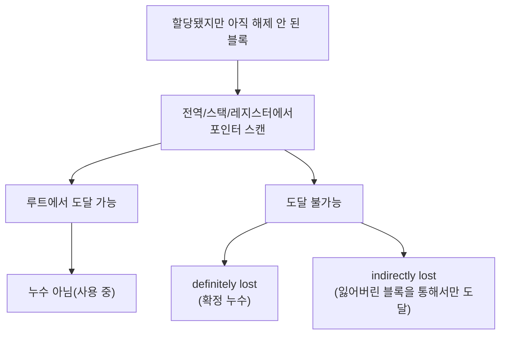

<strong>메모리 누수 탐지(memory leak detection)</strong>란 프로그램이 힙에 할당한 블록 중 어떤 포인터로도 더 이상 도달할 수 없게 되었는데도 해제되지 않은 채 남아 있는 블록을, 실행 중이거나 종료하는 시점에 자동으로 찾아내는 작업을 말합니다. 이 장이 다루는 **Valgrind Memcheck**과 **AddressSanitizer(ASan)** + <strong>LeakSanitizer(LSan)</strong>는 이 작업을 자동화하는 대표 도구이며, 겉보기에는 "실행 후 리포트를 읽으면 끝"인 것처럼 보이지만 실제로는 서로 다른 계측 방식 때문에 오버헤드·정확도·플랫폼 지원이 크게 갈립니다. 이 차이를 모르고 도구를 고르면 CI가 20배 느려지거나, Windows 빌드에서 기대한 리크 리포트가 아예 나오지 않는 상황을 마주하게 됩니다.

## 이 장을 읽기 전에

이 장은 [챕터 12: Stack vs Heap 할당 비용](/post/memory-optimization/stack-vs-heap-allocation-cost/)에서 다룬 "힙 할당은 명시적으로 해제해야 한다"는 전제와, [챕터 02: 할당 전략: 풀·아레나](/post/memory-optimization/pool-arena-allocation-strategy/)에서 다룬 할당자 내부의 free list 개념, [챕터 15: 메모리·수명·캐시 라인 직관](/post/memory-optimization/memory-lifetime-cache-line-intuition-fundamentals/)에서 다룬 객체 수명 개념을 이어받습니다. [챕터 10: 메모리 단편화 분석](/post/memory-optimization/memory-fragmentation-analysis/)이 "RSS가 계속 늘어나는" 증상 중 단편화 쪽을 다뤘다면, 이 장은 같은 증상의 다른 원인인 **진짜 누수**를 진단 도구로 확정하는 절차를 다룹니다.

이 장의 깊이는 **중급**입니다. Valgrind Memcheck과 ASan+LSan이 내부적으로 어떻게 도달 가능성을 추적하는지, 실전에서 어떤 절차로 누수를 재현·확정하는지를 다룹니다. **다루지 않는 것**: 커스텀 할당자를 직접 구현하는 방법([챕터 03](/post/memory-optimization/custom-allocator-patterns/)), 전역 할당자 교체·jemalloc·tcmalloc 튜닝([챕터 16](/post/memory-optimization/global-allocator-jemalloc-tcmalloc-tuning-expert/)), `madvise` 등 가상 메모리 힌트([챕터 13](/post/memory-optimization/virtual-memory-hints-madvise-mte/)), 힙 프로파일링을 통한 할당 핫스팟 분석(별도 프로파일링 트랙의 [메모리 프로파일링: 힙 분석](/post/profiling-analysis/memory-profiling-heap-analysis/))입니다.

## 당신의 수준에 맞는 경로

| 수준 | 읽을 부분 | 핵심 목표 |
|------|---------|---------|
| **초보자** | "누수 탐지 도구의 계보" ~ "도달 가능성으로 정의하는 누수" | 누수가 "도달 불가능한 블록"으로 정의된다는 것을 이해 |
| **중급자** | "Valgrind Memcheck" ~ "실습: 깨진 코드에서 올바른 구현까지" | 두 도구의 동작 방식 차이와 실전 진단 절차를 익힘 |
| **전문가** | "판단 기준" ~ "비판적 시각" | 상황별 도구 선택과 두 도구 공통의 한계를 판단 |

## 누수 탐지 도구의 계보 (역사·배경)

**Valgrind**는 Julian Seward가 1990년대 후반 만들기 시작해 2002년 7월 Valgrind 1.0으로 처음 공개했습니다. 초기에는 **Memcheck** 기능 자체가 곧 "Valgrind"였고, 이후 제네릭 계측 코어와 도구별 로직이 분리되면서 Memcheck은 Valgrind가 제공하는 여러 도구 중 하나(다른 예: Cachegrind, Helgrind)가 되었습니다. Seward는 이 작업으로 2006년 Google-O'Reilly Open Source Award를 받았고, Valgrind는 2026년 5월 기준 3.27.1까지 커뮤니티가 계속 유지·릴리스하고 있습니다.

**AddressSanitizer**는 2012년 Google의 Konstantin Serebryany 등이 USENIX ATC에서 발표한 논문("AddressSanitizer: A Fast Address Sanity Checker")으로 소개되었습니다. Valgrind가 실행 파일을 그대로 바이너리 계측하는 방식과 달리, ASan은 **컴파일 시점에 검사 코드를 직접 삽입**하는 접근을 택해 오버헤드를 크게 낮췄습니다. **LeakSanitizer**는 이후 ASan의 할당 추적 인프라 위에 얹힌 별도 컴포넌트로 추가되어, ASan 없이도 `-fsanitize=leak`만으로 가볍게 쓸 수 있는 독립 모드를 제공합니다. MSVC는 Visual Studio 2019 16.9부터 `/fsanitize=address`로 ASan 계측을 지원하기 시작했지만, 이 글을 쓰는 시점까지도 Windows용 LeakSanitizer는 별도 기능 요청 상태로 남아 있습니다.

## 도달 가능성으로 정의하는 "누수"

두 도구 모두 "누수"를 같은 방식으로 정의합니다. 프로그램이 `malloc`/`new`로 만든 블록의 목록을 추적해 두고, 프로그램 종료 시점(또는 명시적으로 요청한 시점)에 **루트 집합**(전역 변수, 각 스레드의 스택·레지스터, 스레드 로컬 저장소)에서 시작해 포인터로 보이는 값들을 따라가며 어떤 블록에 도달할 수 있는지 스캔합니다. 이 스캔은 정확한 타입 정보 없이 "포인터처럼 생긴 값"을 보수적으로 따라가므로 가비지 컬렉터의 mark 단계와 원리가 비슷하지만, 스캔이 끝난 뒤 메모리를 회수하지는 않고 도달 불가능한 블록을 **보고만** 합니다. 이 과정에서 두 도구는 결과를 몇 가지로 분류합니다. 어떤 포인터로도 전혀 도달할 수 없는 블록은 "definitely lost"(확정 누수)로, 이미 확정 누수로 분류된 다른 블록을 통해서만 도달 가능한 블록은 "indirectly lost"로, 여전히 어딘가에서 가리키고는 있지만 그 포인터가 실제로 다시 쓰일 가능성이 낮아 보이는 경우는 "still reachable"로 나눕니다. 이 분류 체계는 Memcheck 문서 기준이며, LSan은 조금 더 단순화된 "direct leak"/"indirect leak" 구분을 씁니다.



## Valgrind Memcheck: 가상 CPU 위에서 모든 접근을 검사하다

Memcheck은 대상 프로그램을 **다시 컴파일하지 않고** 그대로 실행합니다. 대신 Valgrind 코어가 실행 파일의 각 명령어 블록을 자체 중간 표현(IR)으로 역어셈블한 뒤 검사 코드를 끼워 넣어 다시 JIT 컴파일하고, 이렇게 계측된 코드를 하나의 소프트웨어 가상 CPU 위에서 실행합니다. 이 방식 덕분에 소스나 빌드 스크립트를 건드리지 않고도 서드파티 바이너리까지 검사할 수 있지만, 명령어 하나하나를 해석·재컴파일하는 비용 때문에 대상 프로그램은 평소보다 훨씬 느리게(예: 20~30배) 실행되고 메모리도 더 많이 씁니다.

Memcheck은 메모리의 모든 바이트에 두 종류의 섀도우 비트를 붙여 관리합니다. **A(addressability) 비트**는 그 바이트가 현재 유효하게 할당된 영역에 속하는지를, **V(validity) 비트**는 그 바이트에 담긴 값이 실제로 정의된 값인지(초기화된 값인지)를 추적합니다. 모든 메모리 읽기·쓰기는 이 두 비트와 대조되어, 할당되지 않은 영역에 대한 접근이나 초기화되지 않은 값을 조건문·출력에 사용하는 경우까지 잡아냅니다. `malloc`/`free`, `new`/`delete`는 런타임 라이브러리 경계에서 가로채여 각 블록 앞뒤에 여분의 레드존을 붙이고, `free`된 블록은 즉시 운영체제에 반환하지 않고 한동안 별도 큐에 보관합니다. 이 보관 덕분에 해제 후 재사용(use-after-free)도 함께 잡을 수 있고, 프로그램 종료 시점에 "아직 in-use로 표시된 블록"을 대상으로 앞서 설명한 도달 가능성 스캔을 돌려 누수 여부를 최종 보고합니다.

## AddressSanitizer + LeakSanitizer: 컴파일 계측과 섀도우 메모리

ASan은 Memcheck과 반대 방향의 구현 전략을 씁니다. 프로그램을 실행 중에 통역하는 대신, **컴파일러**(Clang·GCC의 `-fsanitize=address`, MSVC의 `/fsanitize=address`)가 컴파일 시점에 메모리 접근 하나하나 앞에 검사 코드를 직접 삽입합니다. 실제 주소 공간의 8바이트마다 1바이트의 **섀도우 메모리**를 대응시켜 그 8바이트 중 몇 바이트까지 접근 가능한지를 기록하고, 각 힙·스택·전역 할당 앞뒤에는 이 섀도우 바이트가 "오염(poisoned)"으로 표시된 **레드존**을 끼워 넣어 경계를 살짝만 벗어나도 잡아냅니다. 검사 코드가 실행 시점에 해석되는 게 아니라 컴파일 시점에 이미 박혀 있기 때문에, 공식 문서는 전형적인 속도 저하를 "2배" 수준으로 안내합니다. 대신 대상 프로그램 전체(그리고 링크되는 모든 정적 라이브러리·오브젝트)를 같은 플래그로 다시 컴파일해야 하고, 계측된 오브젝트와 계측되지 않은 오브젝트를 섞으면 ODR 위반으로 이어질 수 있습니다.

> Typical slowdown introduced by AddressSanitizer is 2x. — [Clang AddressSanitizer 공식 문서](https://clang.llvm.org/docs/AddressSanitizer.html)

LeakSanitizer는 ASan이 이미 추적하고 있는 할당 정보 위에 얹혀, 프로세스 종료 시점(또는 `__lsan_do_recoverable_leak_check` 같은 API로 명시적으로 요청한 시점)에 모든 스레드를 멈추고 앞서 설명한 것과 같은 방식의 도달 가능성 스캔을 수행합니다. LSan은 `-fsanitize=leak`만 지정해 ASan 계측 없이 단독으로도 쓸 수 있는데, 이 경우 매 접근을 검사하지 않고 할당·해제 호출만 가로채므로 오버헤드가 훨씬 낮습니다. Linux에서는 누수 탐지가 기본으로 켜져 있고, macOS에서는 `ASAN_OPTIONS=detect_leaks=1`로 명시적으로 켜야 하며, Windows의 MSVC ASan 구현에는 이 글을 쓰는 시점 기준으로 LeakSanitizer 자체가 포함되어 있지 않습니다. 즉 "ASan+LSan 조합"은 사실상 Linux·macOS 툴체인 이야기이고, Windows 네이티브 빌드에서는 오버플로·UAF 계열만 ASan으로 잡고 누수는 다른 경로(WSL 위의 Valgrind, CRT 디버그 힙 등)로 보완해야 합니다.

## 실습: 깨진 코드에서 올바른 구현까지

아래 함수는 설정을 로드하다가 유효성 검사에 실패하면 예외를 던지는데, 이 예외가 스택을 되감는 동안 `cfg`가 가리키던 힙 블록은 어떤 포인터로도 더 이상 접근되지 않게 됩니다.

```cpp
#include <string>
#include <stdexcept>

std::string* load_config(bool valid) {
  std::string* cfg = new std::string(1024, '\0');
  if (!valid) {
    throw std::runtime_error("invalid config");  // cfg는 여기서 누수됨: 소유권을 넘길 대상이 없음
  }
  return cfg;
}
```

원인은 원시 포인터가 "예외로 인한 조기 탈출"에 대해 아무런 자동 정리 동작을 갖지 않는다는 점입니다. 정상 경로의 마지막에만 `delete`를 걸어 두는 코드는, 그 마지막 줄에 도달하지 못하는 모든 경로(예외, 조기 `return`, 루프 안의 `break`)에서 블록을 잃어버립니다. `std::unique_ptr`로 소유권을 감싸면 스택이 되감기는 동안에도 소멸자가 호출되어 이 문제 자체가 사라집니다.

```cpp
#include <memory>
#include <string>
#include <stdexcept>

std::unique_ptr<std::string> load_config(bool valid) {
  auto cfg = std::make_unique<std::string>(1024, '\0');
  if (!valid) {
    throw std::runtime_error("invalid config");  // 스택 되감기 중 unique_ptr 소멸자가 자동 해제
  }
  return cfg;
}
```

RAII로 감싼다고 모든 누수가 사라지는 것은 아닙니다. 이 패턴은 "소유자가 명확한데 해제 경로를 놓치는" 버그를 없애 줄 뿐이고, 뒤에서 다룰 "무한정 자라는 캐시" 같은 논리적 누수는 여전히 코드 리뷰와 설계로 잡아야 합니다. 아래는 두 도구로 원본(깨진) 버전을 검증하는 명령입니다. `-std=c++17` 이상, 디버그 정보(`-g`)를 켠 상태로 빌드해야 스택 트레이스에 파일·줄 번호가 남습니다.

```bash
g++ -g -O0 -fsanitize=address,leak -o demo demo.cpp
./demo
```

아래는 대표적인 출력 형태를 보여주는 예시이며, 실제 주소값·오프셋·바이트 수는 컴파일러·플랫폼·최적화 수준에 따라 달라집니다.

```text
=================================================================
==12345==ERROR: LeakSanitizer: detected memory leaks

Direct leak of 1024 byte(s) in 1 object(s) allocated from:
    #0 operator new(unsigned long)
    #1 load_config(bool)
    #2 main

SUMMARY: AddressSanitizer: 1024 byte(s) leaked in 1 allocation(s).
```

같은 프로그램을 재컴파일 없이 Valgrind로 확인하려면 다음과 같이 실행합니다(Linux/macOS, 또는 Windows에서는 WSL 안에서 리눅스용으로 빌드한 바이너리에 대해).

```bash
valgrind --leak-check=full --show-leak-kinds=all ./demo
```

Memcheck은 재컴파일 없이도 같은 블록을 "definitely lost"로 분류해 아래와 같은 형태로 보고합니다.

```text
==23456== HEAP SUMMARY:
==23456==     in use at exit: 1,024 bytes in 1 blocks
==23456==   total heap usage: 2 allocs, 1 frees, 74,752 bytes allocated
==23456==
==23456== 1,024 bytes in 1 blocks are definitely lost in loss record 1 of 1
==23456==    at 0x4C31B25: operator new(unsigned long)
==23456==    by 0x1091A8: load_config(bool)
==23456==    by 0x1091F0: main
==23456==
==23456== LEAK SUMMARY:
==23456==    definitely lost: 1,024 bytes in 1 blocks
==23456==      indirectly lost: 0 bytes in 0 blocks
==23456==        possibly lost: 0 bytes in 0 blocks
==23456==      still reachable: 0 bytes in 0 blocks
```

`unique_ptr` 버전으로 같은 명령을 다시 실행하면 두 도구 모두 "leaked/lost 0 bytes" 요약만 남습니다.

수정할 수 없거나 수정할 필요가 없는 알려진 리크(예: 프로세스 종료 시까지만 살아 있으면 되는 서드파티 라이브러리의 전역 싱글턴)까지 매 실행마다 보고되면 새로 생긴 진짜 누수를 리포트 속에서 놓치기 쉽습니다. 이럴 때는 도구별 **억제(suppression) 파일**로 알려진 항목만 걸러내고 나머지 리포트에 집중합니다. LSan은 함수·라이브러리 이름 패턴으로 간단히 기술하는 반면, Valgrind는 스택 프레임 전체를 매칭하는 더 장황한 형식을 쓰고 `--gen-suppressions=all` 옵션으로 항목을 자동 생성해 줍니다.

```text
# leak.supp (LSAN_OPTIONS=suppressions=leak.supp 로 지정)
leak:ThirdPartyLib::GlobalRegistry

# valgrind.supp (valgrind --suppressions=valgrind.supp 로 지정, --gen-suppressions=all로 초안 생성)
{
   third_party_global_registry
   Memcheck:Leak
   match-leak-kinds: reachable
   fun:_ZN14ThirdPartyLib14GlobalRegistryC1Ev
}
```

억제 항목은 "왜 이 리크를 무시해도 되는지"를 리뷰어가 확인할 수 있도록 최소 범위(구체적인 함수·심볼)로 좁혀 작성하고, 라이브러리 버전을 통째로 억제하는 와일드카드는 피합니다. 그렇지 않으면 억제 파일 자체가 새로운 회귀를 가리는 사각지대가 됩니다.

## 자주 하는 오해

- **"도구가 아무것도 안 잡으면 누수가 없는 것이다"**: 두 도구 모두 도달 가능성 기준으로만 판단하므로, 무한정 자라는 캐시나 지워지지 않는 컨테이너처럼 "여전히 참조는 되지만 사실상 다시 안 쓰이는" 논리적 누수는 잡지 못합니다. 또한 실행되지 않은 코드 경로의 버그는 애초에 관찰 대상이 아니며, suppression 파일이 과도하게 넓으면 진짜 회귀도 함께 가려집니다.
- **"두 도구 중 아무거나 골라도 결과가 같다"**: 재컴파일 필요 여부, 오버헤드 배율, 플랫폼 지원(특히 Windows에서 LeakSanitizer 부재)이 다르므로 도구 선택 자체가 판단해야 할 문제입니다.
- **"Valgrind/ASan을 프로덕션에도 상시 켜 두면 더 안전하다"**: MSVC 공식 문서조차 "AddressSanitizer shouldn't be used in production"이라고 명시합니다. 오버헤드가 지연 예산을 넘어서는 것은 물론, 계측된 빌드는 최적화·메모리 레이아웃이 실제 배포 빌드와 달라 타이밍에 민감한 버그의 재현 여부 자체가 바뀔 수 있습니다.

## 판단 기준 (언제 무엇을 쓸지)

| 상황 | 권장 | 피해야 할 조합 |
|------|------|----------------|
| 소스 빌드 가능, 매 CI 빌드에 통합 | ASan+LSan (`-fsanitize=address,leak`, 약 2배 오버헤드) | Valgrind 전수 실행(20~30배, CI 타임아웃 위험) |
| 소스 없는 바이너리·서드파티 라이브러리 진단 | Valgrind Memcheck(재컴파일 불필요) | ASan(재컴파일 전제라 적용 불가) |
| Windows 네이티브(MSVC) 빌드 | `/fsanitize=address`로 오버플로·UAF 탐지 + WSL의 Valgrind나 별도 도구로 누수 보완 | LeakSanitizer 단독 의존(Windows 미지원) |
| 실서비스 트래픽 상시 모니터링 | 스테이징·카나리에서 주기적으로 실행, 프로덕션은 경량 프로파일러로 대체 | 두 도구 모두 프로덕션에 상시 활성화 |
| 장기 실행 서비스의 "서서히 증가하는 RSS" 진단 | 먼저 [챕터 10: 메모리 단편화 분석](/post/memory-optimization/memory-fragmentation-analysis/)로 단편화 여부를 배제한 뒤 누수 도구 투입 | 단편화 확인 없이 바로 누수로 단정 |

## 비판적 시각: 한계와 트레이드오프

두 도구 모두 **동적 검사**라는 근본적인 한계를 공유합니다. 실제로 실행된 코드 경로만 검사 대상이 되므로, 테스트가 건드리지 않은 분기의 누수는 애초에 관찰되지 않습니다. 도달 가능성 분류도 완벽하지 않습니다. Memcheck은 기본 설정에서 "still reachable" 블록을 출력하지 않으며(`--show-reachable=yes`를 켜야 보입니다), 팀이 반복되는 오탐을 줄이려고 넓혀 온 suppression 파일이 시간이 지나며 진짜 회귀까지 함께 가리는 경우가 드물지 않습니다. ASan은 컴파일 시점에 코드를 바꿔 넣는 접근이라 계측 빌드와 실제 배포 빌드가 서로 다른 바이너리가 되고, 이 차이 때문에 계측 상태에서만 재현되거나 반대로 계측 상태에서는 사라지는 버그가 생길 수 있습니다. 오버헤드와 재현성은 서로 반비례하는 트레이드오프이기도 해서, Valgrind의 20~30배 저하는 타이밍에 민감한 동시성 버그의 재현 자체를 막을 수 있고, ASan의 레드존·격리 큐가 늘리는 메모리 사용량은 원래는 나타나지 않던 메모리 압박 상황을 인위적으로 만들어낼 수 있습니다. 결국 두 도구는 "포인터로 도달할 수 없는 블록"이라는 좁은 정의의 누수만 확정해 줄 뿐, 설계 수준의 자원 관리 책임을 대신해 주지는 않습니다.

## 마무리

- [ ] Valgrind Memcheck과 AddressSanitizer+LeakSanitizer가 각각 어떤 방식(이진 계측 vs 컴파일 계측)으로 누수를 찾는지 설명할 수 있다.
- [ ] "definitely lost"·"indirectly lost"·"still reachable" 분류가 도달 가능성 스캔에서 어떻게 나오는지 이해했다.
- [ ] 재컴파일 가능 여부·오버헤드 배율·플랫폼 지원(Windows에서 LeakSanitizer 부재 포함)을 기준으로 상황에 맞는 도구를 고를 수 있다.
- [ ] 두 도구 모두 논리적 누수(무한 증가 캐시)나 미실행 경로의 버그는 잡지 못한다는 한계를 안다.
- [ ] 프로덕션에 상시 배포하지 않고 CI·스테이징에 배치해야 하는 이유를 말할 수 있다.

**이전 장**: [Virtual Memory 관리 힌트](/post/memory-optimization/virtual-memory-hints-madvise-mte/) (챕터 13)

이 장으로 메모리·할당·데이터 레이아웃 트랙(Tr.04)의 정규 커리큘럼(01~14)을 마칩니다. 할당 횟수를 줄이는 법(01~04), 레이아웃을 캐시에 맞추는 법(05~07), OS·하드웨어 경계의 메모리 정책(08~13)을 거쳐, 이 장에서는 그 모든 최적화가 실제로 자원을 새고 있지 않은지 확정하는 도구를 다뤘습니다. 할당 자체를 더 깊이 파고들고 싶다면 이미 공개된 [전역 할당자·jemalloc·tcmalloc](/post/memory-optimization/global-allocator-jemalloc-tcmalloc-tuning-expert/)으로, 누수 탐지와 짝을 이루는 할당 핫스팟 분석이 필요하다면 프로파일링 트랙의 [메모리 프로파일링: 힙 분석](/post/profiling-analysis/memory-profiling-heap-analysis/)으로 이어가는 것을 권장합니다. 트랙 전체를 다시 조망하려면 [Low-latency 최적화 시리즈 개요](/post/low-latency-optimization-series/getting-started-low-latency-optimization-series-overview/)에서 다음 트랙을 선택하세요.
