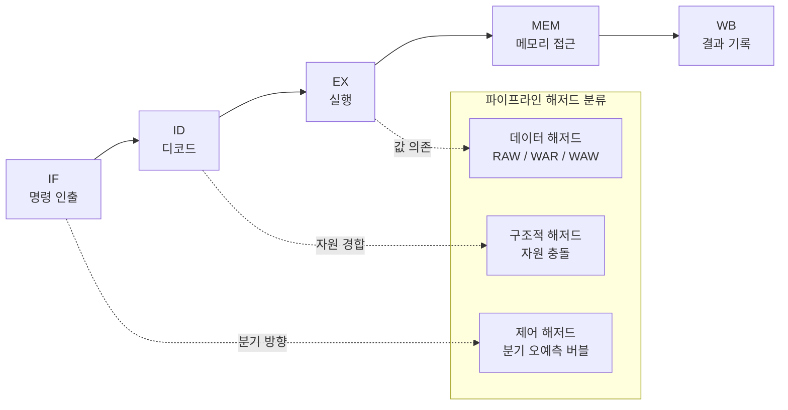

**CPU 파이프라인**이란 하나의 명령어 처리 과정을 여러 단계로 나누고, 서로 다른 명령어의 단계를 매 클럭 사이클마다 겹쳐 실행함으로써 처리량(throughput)을 끌어올리는 하드웨어 구조를 말합니다. 개별 명령어 하나가 끝나는 데 걸리는 시간(latency)은 줄지 않거나 오히려 늘 수 있지만, 여러 명령어를 동시에 "제조 라인"처럼 흘려보내면 사이클당 완료되는 명령어 수는 크게 늘어납니다. µs 단위 지연을 다루는 엔지니어에게 이 모델이 중요한 이유는, 이후 챕터에서 다룰 분기 예측 실패·캐시 미스·포트 경합이 모두 "파이프라인이 어디서 멈추거나 버려지는가"라는 동일한 언어로 설명되기 때문입니다. 이 장은 그 언어의 어휘 — fetch·decode·execute·writeback, 슈퍼스칼라, 해저드(hazard) — 를 정의하는 출발점입니다.

## 이 장을 읽기 전에

이 장은 이 트랙의 첫 본편 챕터이므로 직접적인 선행 챕터는 없지만, [트랙 인트로](/post/cpu-optimization/getting-started-cpu-microarchitecture-performance-tuning/)에서 설명한 "이 트랙이 책임지는 범위"를 먼저 읽어 두면 이 장이 왜 파이프라인 단계와 해저드의 **정의**에만 집중하고 분기 예측·캐시·Out-of-Order 실행의 **메커니즘**은 다루지 않는지 이해하기 쉽습니다. 전제 지식은 C/C++ 수준에서 "명령어가 CPU에서 실행된다"는 정도의 직관이면 충분하며, 어셈블리를 읽어 본 경험이 있으면 해저드 예제를 더 빠르게 이해할 수 있습니다.

**이 장의 깊이**: **기초** 챕터로, 고전적인 5단계 파이프라인 모델과 슈퍼스칼라·해저드의 **개념 정의**까지만 다룹니다. **다루지 않는 것**: 분기 예측기의 내부 동작과 오답 비용(→ [02장: 분기 예측 메커니즘과 비용](/post/cpu-optimization/branch-prediction-mechanisms-cost/)), 캐시 계층의 세부 구조(→ [03장: 캐시 계층 구조](/post/cpu-optimization/cache-hierarchy-l1-l2-l3/)), 명령어 수준 병렬성(ILP)의 이론적 한계와 의존성 체인 분석(→ [05장](/post/cpu-optimization/instruction-level-parallelism-fundamentals/), [18장](/post/cpu-optimization/dependency-chain-port-pressure-analysis/)), Out-of-Order 실행이 해저드를 실제로 어떻게 우회하는지(→ [06장: Out-of-Order 실행과 성능](/post/cpu-optimization/out-of-order-execution-performance/))입니다. 이 장은 그 챕터들이 공유할 용어와 정신 모델을 만드는 데 목적이 있습니다.

## 당신의 수준에 맞는 경로

| 수준 | 읽을 부분 | 핵심 목표 |
|------|---------|---------|
| **초보자** | "파이프라이닝의 역사와 동기" ~ "슈퍼스칼라와 IPC" | 파이프라인이 처리량을 높이는 원리와 IPC 개념 이해 |
| **중급자** | "파이프라인 해저드" ~ "흔한 오개념" | 구조적·데이터·제어 해저드를 구분하고 코드 패턴과 연결 |
| **전문가** | "판단 기준" ~ "비판적 시각" | 고전 모델의 한계를 인식하고 후속 챕터(02·05·06)로 분기할 지점 판단 |

---

## 파이프라이닝의 역사와 동기

명령어 처리를 여러 단계로 나눠 겹쳐 실행하는 아이디어는 범용 컴퓨터로는 1961년 출시된 <strong>IBM 7030(Stretch)</strong>에서 처음 본격적으로 구현되었습니다. Stretch는 명령어를 미리 가져와 두는 lookahead 버퍼와 명령어 디코드·실행을 겹치는 구조를 도입해, 당시 기준으로 이례적인 처리 속도를 냈습니다. 이후 1980년대 RISC 진영(MIPS, DLX 등 학술 모델)이 "각 단계가 정확히 한 클럭을 차지하는" 정형화된 5단계 파이프라인 — fetch, decode, execute, memory access, writeback — 을 교육·설계 표준으로 정착시켰고, 이 모델은 오늘날에도 파이프라인을 설명하는 기본 어휘로 쓰입니다. 실제 현대 CPU의 파이프라인은 이보다 훨씬 깊고(단계가 많고) 순서를 바꿔 실행하지만(Out-of-Order), 그 복잡한 구조도 결국 이 5단계 모델에 단계를 더 세분화하고 스케줄링 로직을 얹은 확장이라고 이해하면 접근하기 쉽습니다.

## 파이프라인 단계: Fetch → Decode → Execute → Writeback

**고전 5단계 모델**은 명령어 하나가 겪는 처리 과정을 다음과 같이 나눕니다. <strong>IF(Instruction Fetch)</strong>는 명령어 캐시에서 다음 명령어를 읽어 오고, <strong>ID(Instruction Decode)</strong>는 그 명령어를 해석해 어떤 연산인지, 어떤 레지스터를 쓰는지 판별하며, <strong>EX(Execute)</strong>는 ALU 등에서 실제 연산을 수행하고, <strong>MEM(Memory Access)</strong>은 필요하면 메모리를 읽거나 쓰며, <strong>WB(Writeback)</strong>는 결과를 레지스터 파일에 기록합니다. 각 단계는 서로 다른 하드웨어 자원을 쓰므로, 명령어 A가 EX 단계에 있는 동안 명령어 B는 ID 단계를, 명령어 C는 IF 단계를 동시에 진행할 수 있습니다. 이 겹침 덕분에 이상적인 조건에서는 매 클럭 사이클마다 새 명령어 하나가 파이프라인에 진입하고 하나가 완료되어, 개별 명령어의 지연(latency)은 5클럭이더라도 정상 상태(steady state)의 처리량은 클럭당 1명령에 가까워집니다.

다음은 4개의 독립적인 명령어가 5단계 파이프라인을 통과하는 이상적인 흐름을 사이클 단위로 나타낸 것입니다. 해저드가 없다는 가정 하에서만 이렇게 매끈하게 겹치며, 실제로는 다음 절에서 다룰 이유들로 빈 칸(버블)이 자주 생깁니다.

```text
사이클     1    2    3    4    5    6    7    8
명령어1   IF   ID   EX   MEM  WB
명령어2        IF   ID   EX   MEM  WB
명령어3             IF   ID   EX   MEM  WB
명령어4                  IF   ID   EX   MEM  WB
```

클럭 주파수는 파이프라인 단계 중 가장 느린 단계의 지연에 맞춰 정해지므로, 단계를 더 잘게 쪼갤수록(파이프라인을 깊게 만들수록) 이론적으로는 더 높은 클럭을 낼 수 있습니다. 다만 단계를 쪼갤수록 파이프라인이 비었을 때(버블) 다시 채우는 데 걸리는 사이클 수도 늘어나므로, 깊은 파이프라인은 분기 예측 실패 같은 사건의 비용을 키우는 트레이드오프를 갖습니다 — 이 비용 계산은 [02장](/post/cpu-optimization/branch-prediction-mechanisms-cost/)과 [11장: CPU 주파수 스케일링과 성능](/post/cpu-optimization/cpu-frequency-scaling-performance/)에서 이어집니다.

## 슈퍼스칼라와 IPC

<strong>슈퍼스칼라(superscalar)</strong>란 한 클럭 사이클에 하나가 아니라 여러 명령어를 동시에 인출·디코드·실행할 수 있도록 파이프라인 각 단계를 폭(width)으로 복제한 설계를 말합니다. 예를 들어 디코더가 4-wide이면 한 사이클에 최대 4개 명령어를 해석할 수 있고, 실행 유닛이 여러 개의 포트(port)로 나뉘어 있으면 서로 의존성이 없는 여러 연산을 같은 사이클에 처리할 수 있습니다. 이때 실제로 사이클당 몇 개의 명령어가 완료되는지를 나타내는 지표가 <strong>IPC(Instructions Per Cycle)</strong>이며, 이론적 최대 IPC는 파이프라인의 디코드·발행(issue) 폭으로 정해지지만, 실제 IPC는 코드의 명령어 간 의존성과 자원 경합에 따라 이보다 훨씬 낮게 나오는 경우가 흔합니다.

IPC는 `perf stat`으로 직접 측정할 수 있는 값입니다. 아래는 누산기 하나에 의존적인 연산을 반복하는 프로그램으로, 이런 구조가 실제로 IPC를 얼마나 제한하는지 확인하기 위한 최소 예시입니다.

```cpp
// ipc_demo.cpp — 빌드: g++ -O2 -march=native -o ipc_demo ipc_demo.cpp
#include <cstdint>
#include <cstdio>

int main() {
  uint64_t acc = 0;
  for (uint64_t i = 0; i < 500'000'000ULL; ++i) {
    acc += i ^ (i >> 3);  // 매 반복이 이전 반복의 acc 값에 의존
  }
  std::printf("%llu\n", static_cast<unsigned long long>(acc));
  return 0;
}
```

이 코드를 위 플래그로 빌드한 뒤 Linux `perf stat`으로 실행하면 명령어 수·사이클 수·IPC를 함께 얻을 수 있습니다.

```text
$ perf stat -e instructions,cycles ./ipc_demo
# Linux, GCC 13, x86-64(Zen4 계열), -O2 -march=native 기준 예시 값. 마이크로아키텍처·컴파일러에 따라 달라짐.

     3,004,821,112      instructions              #    1.02  insn per cycle
     2,945,006,733      cycles

       1.203456789 seconds time elapsed
```

IPC가 슈퍼스칼라 폭(보통 4–6)에 한참 못 미치는 약 1.0에 머무는 이유는, `acc`를 매 반복 갱신하는 단일 의존성 체인이 존재해 다음 덧셈이 이전 덧셈의 결과를 기다려야 하기 때문입니다. 즉 실행 포트가 여러 개 있어도 서로 독립적인 일감이 없으면 슈퍼스칼라 폭을 채울 수 없습니다. 이 의존성 체인을 끊어 IPC를 끌어올리는 구체적인 기법(다중 누산기, 체인 길이 계산)은 [18장: 의존성 체인·포트 압력 분석](/post/cpu-optimization/dependency-chain-port-pressure-analysis/)에서, IPC를 포함한 하드웨어 카운터 전반을 해석하는 절차는 [09장: CPU 하드웨어 카운터 활용](/post/cpu-optimization/cpu-hardware-performance-counters/)과 [Tr.01: 하드웨어 성능 카운터](/post/profiling-analysis/hardware-performance-counters/)에서 다룹니다.

## 파이프라인 해저드: 구조적·데이터·제어

<strong>해저드(hazard)</strong>는 명령어들을 겹쳐 실행할 때 다음 명령어가 정상적으로 진행할 수 없게 만드는 상황을 통칭합니다. 크게 세 가지로 분류합니다.

<strong>구조적 해저드(structural hazard)</strong>는 두 단계가 동시에 같은 하드웨어 자원을 요구할 때 발생합니다. 예를 들어 명령어 캐시와 데이터 캐시가 분리되지 않은 설계에서, 한 명령어의 IF 단계와 다른 명령어의 MEM 단계가 같은 메모리 포트를 두고 경쟁하면 한쪽이 한 사이클 대기해야 합니다. 현대 CPU는 명령어/데이터 캐시 분리, 다중 로드/스토어 포트로 이런 충돌 상당수를 줄이지만 완전히 없애지는 못합니다.

<strong>데이터 해저드(data hazard)</strong>는 한 명령어의 결과를 다른 명령어가 아직 준비되지 않은 시점에 필요로 할 때 생깁니다. 가장 흔한 형태가 <strong>RAW(Read-After-Write)</strong>로, 아래 예시처럼 한 명령어가 레지스터에 쓴 값을 바로 다음 명령어가 읽어야 하는 경우입니다.

```asm
; RAW 데이터 해저드 예시 (x86-64 AT&T 문법, 개념 설명용)
add %rax, %rbx      ; rbx = rbx + rax  (결과가 WB 단계에서야 레지스터에 반영)
sub %rbx, %rcx       ; rcx = rcx - rbx  (직전 명령의 결과를 즉시 읽어야 함)
```

두 번째 명령어가 `rbx`를 읽어야 하는 시점(ID 단계)이 첫 번째 명령어가 `rbx`를 쓰는 시점(WB 단계)보다 파이프라인상 먼저 오기 때문에, 아무 조치가 없다면 파이프라인은 몇 사이클을 비워야 합니다. 실제 CPU는 <strong>포워딩(forwarding/bypassing)</strong>으로 EX 단계의 결과를 바로 다음 명령어의 EX 입력에 연결해 이 지연 상당수를 숨기지만, 체인이 길어지면 포워딩만으로 감출 수 없는 지연이 누적됩니다 — 그 정량적 분석은 [05장: ILP 기초](/post/cpu-optimization/instruction-level-parallelism-fundamentals/)와 [18장](/post/cpu-optimization/dependency-chain-port-pressure-analysis/)의 몫입니다.

<strong>제어 해저드(control hazard)</strong>는 분기 명령어 때문에 다음에 인출할 명령어의 주소가 분기 결과가 나오기 전까지 확정되지 않아 생깁니다. 파이프라인은 분기 방향을 추측해 미리 명령어를 채워 넣는데(추측 인출), 추측이 틀리면 이미 파이프라인에 들어간 명령어들을 모두 버리고 처음부터 다시 채워야 합니다. 이 비용은 파이프라인이 깊을수록 커지며, 이를 줄이기 위한 분기 예측기의 설계와 실측 비용은 [02장: 분기 예측 메커니즘과 비용](/post/cpu-optimization/branch-prediction-mechanisms-cost/)에서 전담합니다.



세 해저드 모두 결과적으로 "파이프라인에 빈 사이클(버블)이 생긴다"는 같은 증상으로 나타나지만, 원인과 해결 방식이 다르므로 프로파일링 결과를 해석할 때는 어떤 종류인지 먼저 구분하는 습관이 필요합니다.

## 흔한 오개념

<strong>"파이프라인은 깊을수록(단계가 많을수록) 항상 빠르다"</strong>는 자주 보이는 오해입니다. 2000년대 초 Intel NetBurst(Pentium 4) 세대는 파이프라인을 대폭 늘려 높은 클럭을 노렸지만, 세대가 지날수록 분기 오예측 하나의 비용이 커져 실제 체감 성능은 기대만큼 오르지 않았고, 이후 Core 마이크로아키텍처는 파이프라인을 다시 얕게 설계해 클럭당 처리량(IPC)을 회복하는 방향으로 선회했습니다. 파이프라인 깊이는 클럭 상한과 버블 비용 사이의 트레이드오프이지 일방적으로 좋아지는 값이 아니며, 세대별 정확한 단계 수는 마이크로아키텍처마다 달라 [08장: 현대 CPU 아키텍처 비교](/post/cpu-optimization/modern-cpu-architecture-comparison/)에서 다룹니다.

<strong>"IPC는 1을 넘을 수 없다"</strong>도 흔한 오해입니다. 고전 5단계 모델을 스칼라(단일 발행) 파이프라인으로만 배우면 이런 인상을 받기 쉽지만, 슈퍼스칼라 설계에서는 서로 독립적인 명령어가 충분하면 사이클당 여러 명령어가 완료되어 IPC가 2, 3 이상으로 측정되는 경우가 흔합니다. 앞서 본 `perf stat` 예시에서 IPC가 1.0 근처에 머문 것은 하드웨어의 한계가 아니라 코드의 의존성 체인이 만든 한계였습니다.

<strong>"파이프라인 해저드는 하드웨어만의 문제이고 코드와 무관하다"</strong>는 인식도 정확하지 않습니다. 컴파일러의 명령어 스케줄링(instruction scheduling)과 프로그래머가 작성한 데이터 의존성 구조 모두 해저드 발생 빈도에 직접 영향을 주며, 같은 알고리즘도 의존성 체인을 짧게 재배치하면 실행 포트를 더 잘 채울 수 있습니다. 이 관계는 [05장](/post/cpu-optimization/instruction-level-parallelism-fundamentals/)에서 본격적으로 다룹니다.

## 판단 기준: 언제 파이프라인 관점으로 코드를 봐야 하는가

| 상황 | 파이프라인 관점에서 볼 이유 | 다음 확인 단계 |
|------|---------------------------|---------------|
| 핫패스에서 `perf stat` IPC가 이론적 발행 폭보다 크게 낮음 | 의존성 체인 또는 포트 경합이 슈퍼스칼라 폭을 못 채움 | [05장](/post/cpu-optimization/instruction-level-parallelism-fundamentals/), [18장](/post/cpu-optimization/dependency-chain-port-pressure-analysis/) |
| 조건 분기가 많은 루프에서 지연 변동(p99)이 큼 | 제어 해저드로 인한 분기 오예측 버블 가능성 | [02장](/post/cpu-optimization/branch-prediction-mechanisms-cost/) |
| 메모리 접근이 잦은 코드에서 명령어 발행이 정체됨 | 캐시 미스가 파이프라인을 정체시킬 수 있음 | [03장](/post/cpu-optimization/cache-hierarchy-l1-l2-l3/), [04장](/post/cpu-optimization/cache-miss-analysis-hint-instructions/) |
| 카운터상 문제가 없는데도 p99 지연이 나쁨 | 파이프라인 모델만으로는 설명 안 되는 OS·스케줄링 요인일 가능성 | Tr.01 프로파일링, Tr.06 OS 트랙 |
| 아키텍처 세대·벤더 간 파이프라인 폭 비교가 필요함 | 고전 5단계 모델은 세대별 실제 폭을 담지 않음 | [08장](/post/cpu-optimization/modern-cpu-architecture-comparison/) |

## 비판적 시각: 고전 파이프라인 모델의 한계

고전 5단계 모델은 가르치고 이야기하기 좋은 도구이지만 현대 CPU를 있는 그대로 기술하지는 않습니다. 실제 서버·데스크톱 CPU는 순서대로 실행하지 않고(Out-of-Order), 십수 개에서 수백 개에 이르는 명령어를 재정렬 버퍼에 담아 동시에 진행 상태로 유지하며, 파이프라인 단계 수도 세대·벤더마다 달라 5단계보다 훨씬 세분화되어 있습니다. 이 차이는 사소하지 않습니다 — 고전 모델만으로 "이 코드가 느린 이유"를 추론하면 실제로는 OoO 스케줄러가 이미 상당 부분을 숨겼거나, 반대로 재정렬 버퍼·실행 포트 용량 한계에 부딪혀 고전 모델이 예측하지 못하는 지점에서 정체가 생길 수 있습니다. 이런 실제 동작의 상세는 [06장: Out-of-Order 실행과 성능](/post/cpu-optimization/out-of-order-execution-performance/)과 [15장: μOp 캐시와 DSB](/post/cpu-optimization/uop-cache-decoded-stream-buffer/)로 넘어갑니다. 또한 추측 인출·추측 실행은 성능 이득과 별개로 Spectre 계열 부채널 취약점의 근본 원인이 되었다는 점에서, "빠르게 추측하고 틀리면 버린다"는 설계 철학 자체가 보안 트레이드오프를 안고 있습니다 — 자세한 내용은 [10장: 추측 실행과 보안 영향](/post/cpu-optimization/speculative-execution-security-impact/)에서 다룹니다. 실무에서는 이 장의 모델을 "왜 카운터가 이렇게 나오는지"에 대한 첫 가설로만 쓰고, 실제 결론은 항상 프로파일러 실측으로 검증해야 합니다.

## 더 읽을 거리

- [Intel® 64 and IA-32 Architectures Optimization Reference Manual, Volume 1](https://cdrdv2-public.intel.com/814198/248966-Optimization-Reference-Manual-V1-049.pdf) — 마이크로아키텍처별 파이프라인·프런트엔드·백엔드 구조를 다루는 Intel 공식 최적화 참조 문서
- [Wikipedia: IBM 7030 Stretch](https://en.wikipedia.org/wiki/IBM_7030_Stretch) — 범용 컴퓨터 최초의 본격적인 파이프라이닝·명령어 lookahead 구현 사례
- [Wikipedia: Instruction pipelining](https://en.wikipedia.org/wiki/Instruction_pipelining) — 고전 5단계 파이프라인과 구조적·데이터·제어 해저드의 표준적인 정의

## 마무리

- [ ] fetch·decode·execute·writeback 4–5단계가 어떻게 겹쳐 처리량을 높이는지 설명할 수 있다.
- [ ] 파이프라인 깊이와 클럭·버블 비용 사이의 트레이드오프를 말로 설명할 수 있다.
- [ ] 슈퍼스칼라와 IPC의 관계를 이해하고, IPC가 낮게 측정된 코드에서 의존성 체인을 의심할 수 있다.
- [ ] 구조적·데이터·제어 해저드를 구분하고 각각 어느 챕터가 해결 메커니즘을 다루는지 안다.
- [ ] "파이프라인이 깊을수록 빠르다"·"IPC는 1을 못 넘는다" 같은 오개념을 스스로 교정할 수 있다.

**다음 장에서는** 이 장에서 정의한 제어 해저드를 이어받아, 분기 예측기가 실제로 어떻게 다음 명령어 주소를 추측하는지, 그리고 예측이 틀렸을 때의 비용을 어떻게 실측하는지를 다룹니다.

→ [분기 예측 메커니즘과 비용](/post/cpu-optimization/branch-prediction-mechanisms-cost/) (다음 장)
