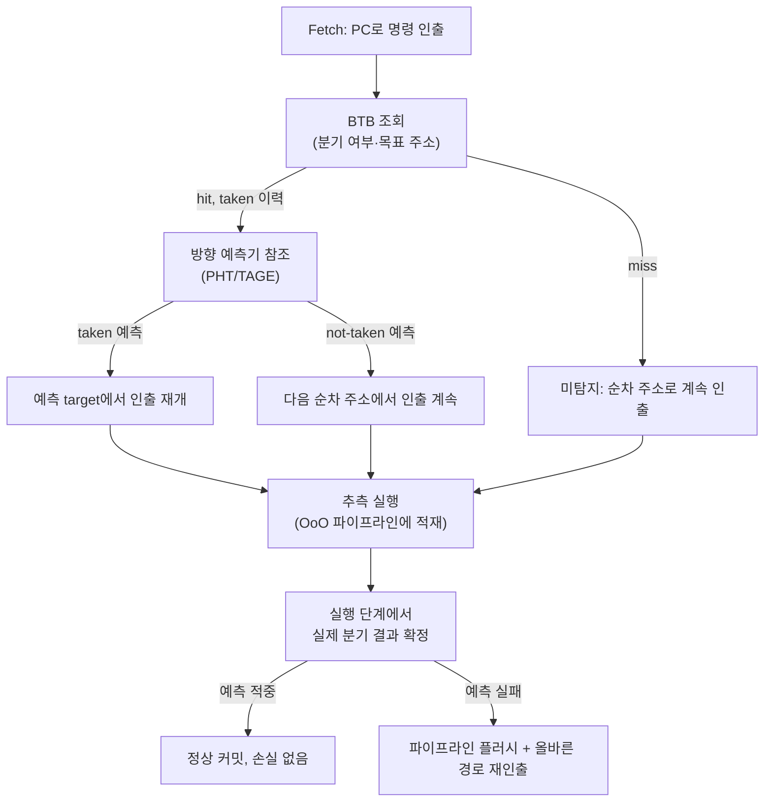

**분기 예측(branch prediction)**이란 CPU가 조건 분기의 결과(taken/not-taken)와 목표 주소를 명령이 실제로 실행되기 전에 추측해, 파이프라인이 비지 않도록 다음 명령을 미리 가져오고 실행하는 하드웨어 메커니즘입니다. 현대 CPU는 파이프라인 깊이와 명령창(instruction window)이 커서 분기 하나가 확정될 때까지 기다리면 프론트엔드가 수십 사이클을 놀리게 되므로, 예측이 없으면 파이프라이닝의 이득 대부분이 사라집니다. 문제는 예측이 항상 옳지 않다는 데 있습니다. 예측이 틀리면 CPU는 잘못 추측한 경로를 따라 이미 실행해 둔 명령들을 전부 버리고 올바른 경로에서 처음부터 다시 인출해야 하며, 이 비용은 분기 하나당 십여 사이클에서 많게는 수십 사이클에 이릅니다. 데이터 의존적인 분기가 핫패스 루프 안에 있으면 이 비용이 반복 횟수만큼 누적되어 p99 지연을 흔드는 주요 원인이 됩니다.

## 이 장을 읽기 전에

이 장은 [01장: CPU 파이프라인 기초](/post/cpu-optimization/cpu-pipeline-fundamentals/)에서 다룬 **인출(fetch)-디코드-실행-커밋** 파이프라인 단계와 "추측 실행이 왜 필요한가"라는 전제를 그대로 사용합니다. 파이프라인이 여러 단계로 나뉘어 있고 각 단계가 서로 다른 명령을 동시에 처리한다는 개념을 모른다면 01장을 먼저 읽는 것이 좋습니다.

**이 장의 깊이**: **중급**입니다. 분기 예측기가 내부적으로 어떤 구조(BTB, 패턴 히스토리 테이블, 리턴 주소 스택)를 쓰는지, 예측이 틀렸을 때 비용이 왜 그만큼 드는지, 그리고 `__builtin_expect`/`[[likely]]`/`[[unlikely]]`로 컴파일러에 힌트를 주는 것이 실제로 언제 의미가 있는지를 다룹니다. **다루지 않는 것**: Out-of-Order 실행의 내부 자료구조(ROB, RS, 리네이밍)는 [06장: Out-of-Order 실행과 성능](/post/cpu-optimization/out-of-order-execution-performance/)에서, TopDown 방법론에서 분기 예측 실패를 Frontend/Bad Speculation 중 어디로 분류하는지는 [17장: Frontend vs Backend Bound 개념](/post/cpu-optimization/frontend-backend-bound-topdown-basics/)에서, 추측 실행이 만드는 보안 취약점(Spectre 계열)은 [10장: 추측 실행과 보안 영향](/post/cpu-optimization/speculative-execution-security-impact/)에서 각각 다룹니다.

## 당신의 수준에 맞는 경로

| 수준 | 읽을 부분 | 핵심 목표 |
|------|---------|---------|
| **초보자** | "분기 예측의 역사와 배경" ~ "분기 예측기의 구조" | 왜 예측이 필요하고 무엇을 예측하는지 이해 |
| **중급자** | "예측 실패의 비용" ~ "흔한 오개념" | 미스프리딕션 비용의 원인과 대표적 착각 교정 |
| **전문가** | "판단 기준" ~ "비판적 시각" | 컴파일러 힌트·PGO·분기 제거 중 무엇을 언제 쓸지 판단 |

## 분기 예측의 역사와 배경

초기 CPU는 분기를 정적으로만 다뤘습니다. 가장 단순한 정책은 "분기는 항상 taken이 아니다(not-taken)"라고 가정하고 순차 주소를 계속 인출하는 것이었고, 이는 파이프라인이 얕던 시절에는 손실이 적었지만 파이프라인이 깊어질수록 손실이 커졌습니다. James E. Smith는 1981년 논문에서 **2비트 포화 카운터(2-bit saturating counter)** 기반 동적 예측을 제안했고, 이는 이후 수십 년간 대부분의 상용 CPU 방향 예측기의 뼈대가 되었습니다. Tse-Yu Yeh와 Yale Patt는 1991년 **2-레벨 적응 예측(two-level adaptive predictor)**을 제안해 분기 이력(history)을 인덱스로 써서 패턴을 학습하는 방식을 열었고, Scott McFarling은 1993년 전역 이력과 주소를 섞는 **gshare** 기법을 정리했습니다. 이후 예측기는 여러 이력 길이를 동시에 참조하는 방향으로 발전했는데, Daniel Jiménez와 Calvin Lin이 2001년 제안한 **퍼셉트론 예측기(perceptron predictor)**는 신경망 스타일의 선형 가중합으로 분기를 예측하는 접근을 보여줬고, André Seznec이 2006년 제안한 **TAGE(TAgged GEometric history length)**는 서로 다른 길이의 이력을 참조하는 여러 테이블을 태그로 구분해 조합하는 방식으로 현재까지 최상위권 예측 정확도를 내는 설계로 남아 있습니다. 현대 Intel·AMD CPU의 정확한 예측기 구조는 공개되지 않지만, 업계에서는 TAGE 계열과 그 변형이 널리 쓰이는 것으로 알려져 있습니다(구현 세부는 **구현 정의**로 남겨둡니다).

## 분기 예측기의 구조

분기 예측은 하나의 통합된 표가 아니라 **서로 다른 질문에 답하는 여러 구조의 조합**입니다. 프론트엔드가 매 사이클 다음 인출 주소를 정하려면 최소 세 가지를 알아야 하는데, 지금 인출하는 명령이 분기인지, 분기라면 taken인지 not-taken인지, taken이라면 목표 주소가 어디인지입니다. 이 세 질문을 각각 다른 하드웨어가 나눠서 처리합니다.

- **BTB(Branch Target Buffer)**: 과거에 실행된 분기 명령의 PC를 키로, 그 분기의 목표 주소를 캐시처럼 저장하는 구조입니다. BTB에 히트하면 분기임을 알 수 있을 뿐 아니라 목표 주소도 즉시 얻어 그 주소에서 계속 인출할 수 있습니다. BTB는 유한한 엔트리 수를 가진 캐시이므로, 참조하는 분기 개수가 용량을 넘으면 축출(eviction)이 일어나 미스가 늘어납니다. Matt Godbolt는 [2016년경 Skylake 세대 Intel CPU를 대상으로 한 분석](https://xania.org/201602/bpu-part-three)에서 성능 카운터 기반 실험을 통해 BTB가 약 2048개 엔트리를 4-way set-associative 구조로 갖는다는 것을 역추적했습니다. 이 수치는 특정 세대의 예시일 뿐이며 세대마다 달라지고 공식적으로 공개되지 않는 경우가 많으므로, 코드에 특정 엔트리 수를 전제한 가정을 넣는 것은 피해야 합니다.
- **방향 예측기(direction predictor / pattern history table)**: BTB가 "목표가 어디인가"에 답한다면, 방향 예측기는 "taken인가 not-taken인가"에 답합니다. 2비트 카운터부터 TAGE·퍼셉트론까지 위에서 언급한 알고리즘들이 여기에 해당하며, 분기의 과거 이력(local history)이나 최근 여러 분기의 전역 이력(global history)을 인덱스로 패턴 히스토리 테이블(PHT)을 참조합니다.
- **RAS(Return Address Stack)**: 함수 호출(`call`)의 리턴 주소는 대응하는 `ret`가 거의 항상 그 주소로 돌아온다는 규칙성이 있어, 별도의 소형 스택 구조로 예측합니다. `call`마다 리턴 주소를 push하고 `ret`마다 pop해 예측하므로 정확도가 매우 높지만, 재귀 깊이가 스택 용량을 넘거나 longjmp·코루틴처럼 호출·복귀 짝이 어긋나면 RAS 미스가 발생합니다.
- **간접 분기 예측기(indirect branch predictor)**: 가상 함수 호출, 함수 포인터, switch-case의 점프 테이블처럼 목표 주소가 여러 개일 수 있는 분기는 별도의 이력 기반 구조(ITTAGE 계열)로 다룹니다. 같은 호출 지점(call site)이 실행마다 다른 대상으로 분기하면 이 예측기의 정확도가 떨어집니다.

아래는 프론트엔드가 매 사이클 어떤 구조를 거쳐 다음 인출 주소를 정하고, 실제 결과가 실행 단계에서 확정된 뒤 예측이 틀렸을 때 무슨 일이 벌어지는지를 정리한 흐름입니다.



## 예측 실패(misprediction)의 비용

분기가 실행 단계에서 실제 결과를 확정하는 순간, 그 사이 프론트엔드가 예측을 따라 인출·디코드·추측 실행해 둔 이후의 모든 명령은 잘못된 경로일 수 있습니다. 예측이 틀렸다면 이 명령들은 커밋되지 않고 폐기되어야 하고, 프론트엔드는 올바른 경로의 주소부터 다시 인출을 시작해야 합니다. 이 손실의 크기는 대체로 "분기가 확정되는 파이프라인 단계"와 "프론트엔드가 재인출을 시작하는 단계" 사이의 거리, 즉 파이프라인 깊이에 비례합니다. 파이프라인이 얕은 고전적인 설계에서는 십여 사이클, 깊은 추측 실행 파이프라인을 가진 현대 x86 코어에서는 십여~20여 사이클 수준의 손실이 보고되어 왔으며, 정확한 수치는 마이크로아키텍처 세대와 분기가 확정되는 단계(정수 ALU에서 조기 확정되는지, 더 늦은 단계에서 확정되는지)에 따라 달라집니다. 이 수치를 코드에 단정적으로 적용하기보다는 "플랫폼·세대에 따라 달라지는 값"으로 취급하고, 실제 코드에서는 하드웨어 카운터로 직접 측정하는 것이 안전합니다.

이 비용을 추정이 아니라 실측으로 확인하려면 하드웨어 성능 카운터가 필요합니다. 리눅스에서는 `perf stat`으로 `branches`와 `branch-misses` 이벤트를 함께 보면 전체 분기 중 몇 퍼센트가 잘못 예측됐는지 직접 확인할 수 있습니다.

```text
$ perf stat -e branches,branch-misses,cycles,instructions ./branch_bench

   1,203,456,789      branches
      42,318,205      branch-misses             #    3.52% of all branches
   2,004,112,933      cycles
   1,890,442,110      instructions              #    0.94  insn per cycle

# 참고: 위 수치는 형식을 보여주기 위한 예시값입니다.
# Linux perf(x86-64), 실제 값은 CPU 세대·컴파일러·데이터 분포에 따라 달라지므로 직접 재현해 확인합니다.
```

`branch-misses` 비율이 몇 퍼센트만 되어도 핫루프 안에서는 상당한 사이클 손실로 이어질 수 있는데, 예측 실패 한 번의 비용이 십여 사이클 이상이고 루프가 수백만 번 반복되면 그 비용이 그대로 곱해지기 때문입니다. 이 비용을 직접 격리해 보려면 데이터 패턴만 다르고 로직은 동일한 두 벤치마크를 비교하는 것이 유용합니다. 아래는 정렬된 배열(분기가 예측 가능한 패턴)과 무작위 배열(분기가 거의 랜덤한 패턴)에서 같은 임계값 비교를 반복하는 Google Benchmark 코드입니다.

```cpp
#include <algorithm>
#include <cstdint>
#include <random>
#include <vector>
#include <benchmark/benchmark.h>

static std::vector<int> make_data(size_t n, bool sorted, unsigned seed) {
  std::mt19937 rng(seed);
  std::uniform_int_distribution<int> dist(0, 255);
  std::vector<int> data(n);
  for (auto& v : data) v = dist(rng);
  if (sorted) std::sort(data.begin(), data.end());
  return data;
}

static void BM_BranchPredictable(benchmark::State& state) {
  auto data = make_data(1 << 16, /*sorted=*/true, 42);
  for (auto _ : state) {
    long sum = 0;
    for (int v : data) {
      if (v >= 128) sum += v;   // 정렬됨: taken/not-taken이 긴 구간으로 뭉침
    }
    benchmark::DoNotOptimize(sum);
  }
}
BENCHMARK(BM_BranchPredictable);

static void BM_BranchUnpredictable(benchmark::State& state) {
  auto data = make_data(1 << 16, /*sorted=*/false, 42);
  for (auto _ : state) {
    long sum = 0;
    for (int v : data) {
      if (v >= 128) sum += v;   // 무작위: taken/not-taken이 거의 랜덤
    }
    benchmark::DoNotOptimize(sum);
  }
}
BENCHMARK(BM_BranchUnpredictable);

BENCHMARK_MAIN();
```

`g++ -O2 bench.cpp -lbenchmark -lpthread`로 빌드한 뒤(x86-64, GCC 13, `-O2` 기준), `perf stat -e branch-misses ./bench`로 두 벤치마크의 미스 비율을 함께 확인하면 `BM_BranchUnpredictable`이 `BM_BranchPredictable`보다 눈에 띄게 느리게 나오는 경우가 흔합니다. 두 함수의 로직과 데이터 분포는 동일하고 **원소 순서만 다르므로** 차이는 분기 예측 정확도에서만 옵니다. 배율은 CPU 세대·데이터 크기·컴파일러 버전에 따라 달라지므로, 판단은 반드시 대상 플랫폼에서 직접 재현한 뒤 내립니다.

## 컴파일러에 힌트 주기: `__builtin_expect`와 `[[likely]]`/`[[unlikely]]`

컴파일러는 프로파일 정보 없이 소스만 보고서는 어떤 분기가 자주 taken되는지 알 수 없습니다. GCC와 Clang은 이 정보를 프로그래머가 직접 알려줄 수 있도록 [`long __builtin_expect(long exp, long c)` 빌트인](https://gcc.gnu.org/onlinedocs/gcc/Other-Builtins.html)을 제공하며, `exp == c`가 참일 확률이 높다는 것을 컴파일러에 전달합니다. C++20부터는 이를 표준화한 `[[likely]]`/`[[unlikely]]` 문(statement) 속성이 추가되어, 컴파일러 확장 없이 이식 가능한 방식으로 같은 의도를 표현할 수 있습니다. 이 속성들은 [WG21 P0479 제안](https://www.open-std.org/jtc1/sc22/wg21/docs/papers/2017/p0479r2.html)에서 정리된 대로, 리눅스 커널이 `likely`/`unlikely` 매크로를 수천 곳에서 이미 쓰고 있다는 선례를 배경으로 표준화되었습니다.

```cpp
#include <cstdio>

// C 스타일: GCC/Clang 확장
int process_gcc_style(int x) {
  if (__builtin_expect(x < 0, 0)) {   // x < 0은 드물다고 힌트
    std::fputs("error path\n", stderr);
    return -1;
  }
  return x * 2;
}

// C++20: 표준 속성
int process_cpp20_style(int x) {
  if (x < 0) [[unlikely]] {
    std::fputs("error path\n", stderr);
    return -1;
  }
  return x * 2;
}
```

이 힌트가 실제로 하는 일은 분기 예측기의 동작을 바꾸는 것이 아니라, 컴파일러가 **정적으로 코드를 배치하는 방식**을 바꾸는 것입니다. 자주 실행되는 경로를 분기 없이 이어지는 순차 코드(fall-through)로 배치하고 드문 경로를 멀리 떨어뜨려, 명령 캐시·μOp 캐시에 자주 쓰는 경로만 남기고 조건부 이동(`cmov`) 대신 분기를 쓸지 여부도 이 정보로 결정할 수 있습니다. 현대 CPU의 동적 예측기는 이미 반복 실행을 통해 실제 패턴을 스스로 학습하므로, 힌트가 동적 예측 자체를 대체하지는 않습니다.

## 흔한 오개념

**"분기가 많으면 무조건 느리다"**는 정확하지 않습니다. 어떤 분기가 90% 이상의 확률로 같은 방향으로 가는 **예측 가능한(predictable)** 분기라면, 현대 예측기는 이를 거의 완벽하게 맞히고 비용은 사실상 0에 가깝습니다. 문제가 되는 것은 분기의 개수가 아니라 **데이터에 의존해 결과가 거의 무작위로 흔들리는** 분기이며, 위 벤치마크의 정렬-미정렬 비교가 이를 직접 보여줍니다.

**"`__builtin_expect`/`[[likely]]`를 붙이면 항상 빨라진다"**는 것도 오개념입니다. 힌트가 실제 실행 패턴과 어긋나면 오히려 코드 배치가 나빠져 손해를 볼 수 있고, 최신 컴파일러의 **PGO(Profile-Guided Optimization)**는 실제 실행 데이터를 기반으로 하므로 수작업 힌트보다 신뢰도가 높은 경우가 많습니다. 힌트는 어디까지나 "프로파일 정보가 없을 때의 대체 수단"으로 접근하는 것이 안전합니다.

**"분기 예측기는 하나의 통합 표"**라는 가정도 흔한 착각입니다. 위에서 정리했듯 BTB(목표 주소), 방향 예측기(taken/not-taken), RAS(리턴), 간접 분기 예측기(다중 목표)는 서로 다른 질문에 답하는 별개 구조입니다. 예를 들어 재귀 함수가 깊어 RAS 용량을 넘기면 direction predictor는 멀쩡해도 리턴 주소 예측만 깨질 수 있으며, 이는 "분기 예측이 나쁘다"는 뭉뚱그린 진단으로는 원인을 찾을 수 없습니다.

## 판단 기준

| 상황 | 권장 | 비권장 |
|------|------|--------|
| 프로파일 데이터를 뽑을 수 있는 빌드 파이프라인이 있음 | PGO(`-fprofile-use` 등)로 컴파일러가 스스로 배치하게 함 | 수작업 힌트로 PGO를 대체 |
| 에러 처리·assert 실패처럼 명백히 드문 경로 | `[[unlikely]]`/`__builtin_expect`로 컴파일러에 알림 | 힌트 없이 방치해 콜드 경로가 핫패스에 섞이게 둠 |
| 분기 결과가 데이터에 따라 거의 무작위 | 분기 자체를 없애는 branchless 기법(비트 연산, `cmov`, 조회 테이블) 검토 | 힌트만으로 해결하려 시도 |
| 힌트를 넣었지만 실행 패턴이 바뀔 수 있는 코드 | 변경 후 `perf stat -e branch-misses`로 재검증 | 넣고 재측정 없이 방치 |
| 이식성이 중요한 코드베이스 | 표준 `[[likely]]`/`[[unlikely]]` | 컴파일러 전용 매크로만 사용 |

## 비판적 시각: 한계와 트레이드오프

분기 힌트는 만능 최적화가 아닙니다. Aaron Ballman은 [2020년 글](https://blog.aaronballman.com/2020/08/dont-use-the-likely-or-unlikely-attributes/)에서 `[[likely]]`/`[[unlikely]]`가 표준상 컴파일러마다 다르게 구현될 수 있고, `if`-`else`의 양쪽에 서로 다른 힌트를 동시에 붙이는 등 오용하기 쉬우며, 예외 처리·삼항 연산자처럼 속성을 붙이기 애매한 지점이 많다는 점을 근거로 "가급적 쓰지 말라"는 강한 입장을 취합니다. 이 주장에 모두 동의할 필요는 없지만, 핵심 시사점은 유효합니다. 힌트가 틀리면 도움이 아니라 손해가 될 수 있고, 그 손해는 눈에 잘 띄지 않는다는 것입니다. 또한 TAGE·퍼셉트론 계열의 현대 동적 예측기는 이미 매우 높은 정확도를 내므로, 정적 힌트가 실질적인 차이를 만드는 범위는 생각보다 좁습니다. 콜드 에러 경로를 핫패스에서 물리적으로 떼어내는 코드 배치 효과, 그리고 프로파일 데이터가 없는 초기 개발 단계의 임시 근사치 정도로 기대치를 낮추는 것이 현실적입니다. BTB 용량이나 미스프리딕션 사이클 수 같은 구체적인 수치도 세대마다 달라지고 벤더가 공식적으로 공개하지 않는 경우가 많아, 특정 세대에서 관찰한 값을 다른 플랫폼에 그대로 적용하는 것은 위험합니다. 결국 이 장의 힌트·구조 지식은 "왜 특정 코드 패턴이 느려지는지"를 설명하는 모델로 쓰고, 실제 개선 여부는 항상 대상 플랫폼에서 하드웨어 카운터로 확인해야 합니다.

## 마무리

이 장을 읽고 나면 다음을 스스로 점검할 수 있어야 합니다.

- [ ] BTB, 방향 예측기(PHT/TAGE), RAS, 간접 분기 예측기가 각각 어떤 질문에 답하는지 구분해 설명할 수 있다.
- [ ] 예측 실패 시 파이프라인 플러시가 왜 일어나고, 그 비용이 왜 파이프라인 깊이와 연결되는지 설명할 수 있다.
- [ ] "분기가 많다"와 "분기가 예측 불가능하다"를 구분하고, `perf stat -e branch-misses`로 실제 미스율을 측정할 수 있다.
- [ ] `__builtin_expect`/`[[likely]]`/`[[unlikely]]`가 실제로 바꾸는 것(코드 배치)과 바꾸지 않는 것(동적 예측기 자체)을 구분할 수 있다.
- [ ] 힌트를 넣을지, PGO에 맡길지, branchless로 분기 자체를 없앨지를 상황에 맞게 판단할 수 있다.

**이전 장**: [CPU 파이프라인 기초](/post/cpu-optimization/cpu-pipeline-fundamentals/) (챕터 01)

**다음 장에서는 캐시 계층 구조**를 다룹니다. 분기 예측 실패가 프론트엔드 손실이라면, 캐시 미스는 데이터·명령 접근 지연으로 발생하는 또 다른 축의 손실입니다. L1/L2/L3 계층과 각 단계의 미스 비용을 이 장의 미스프리딕션 비용 모델과 같은 방식(하드웨어 카운터로 원인까지 추적)으로 다룹니다.

→ [캐시 계층 구조](/post/cpu-optimization/cache-hierarchy-l1-l2-l3/) (챕터 03)
