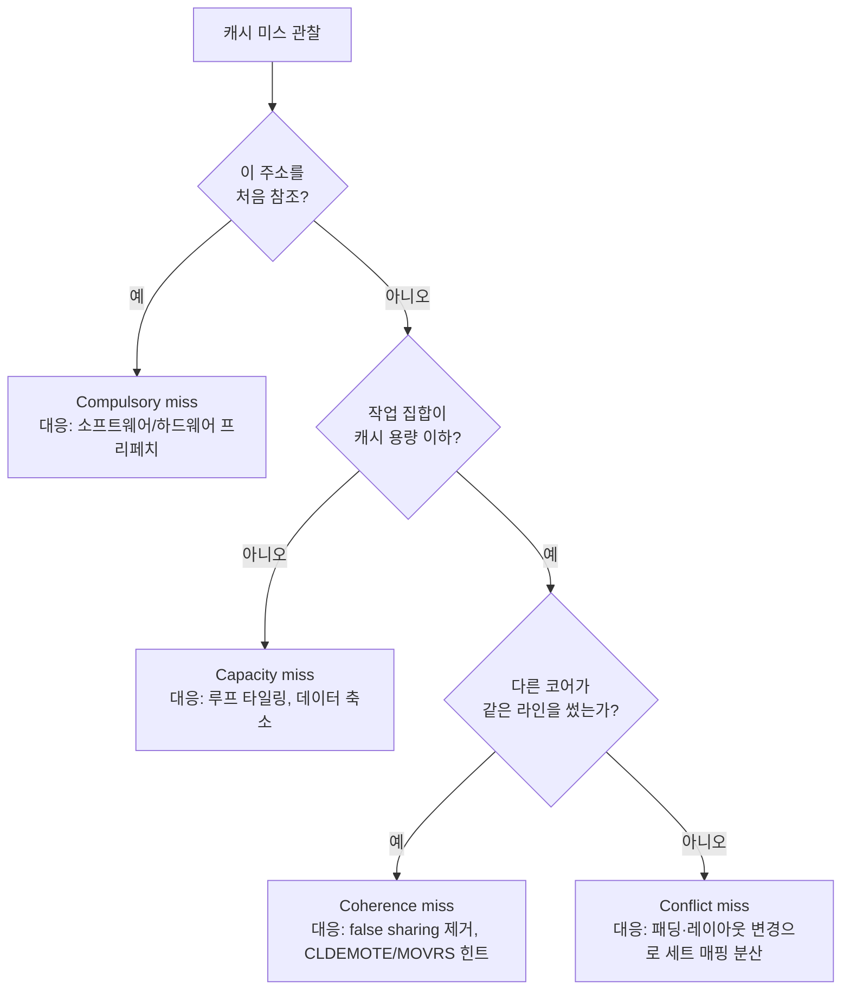

**캐시 미스 분석**이란 캐시 미스를 원인별로 구분해 "왜 이 접근이 캐시에 없었는가"에 정확히 답하고, 그 원인에 맞는 대응책(데이터 레이아웃 변경, 프리페치, 캐시 힌트 명령)을 고르는 작업을 말합니다. 캐시 미스율은 프로파일러가 쉽게 보여주지만, 미스율 숫자 하나만으로는 무엇을 고쳐야 할지 알 수 없습니다. 같은 미스율이라도 원인이 "애초에 처음 접근하는 데이터라 피할 수 없는 것"인지, "작업 집합이 캐시보다 커서"인지, "매핑이 겹쳐서"인지, "다른 코어가 같은 라인을 건드려서"인지에 따라 해법이 완전히 달라지기 때문입니다. 이 장에서는 미스를 네 유형으로 분류하는 표준적인 사고 틀을 정리하고, 2025~2026년 인텔 아키텍처에 새로 추가된 CLDEMOTE, PREFETCHRST2, MOVRS 같은 캐시 힌트 명령이 이 분류 중 어떤 유형을 겨냥하는지 연결합니다.

## 이 장을 읽기 전에

**선행 챕터**: [캐시 계층 구조](/post/cpu-optimization/cache-hierarchy-l1-l2-l3/)에서 다룬 L1/L2/L3 계층별 지연시간과 inclusive/exclusive 정책을 전제로 합니다. 그 장이 "캐시가 어떻게 계층을 이루는가"를 다뤘다면, 이 장은 "그 계층에서 왜 실패(미스)가 나는가"를 다룹니다.

**전제 지식**: 캐시 라인 크기(보통 64바이트)와 세트 연관(set-associative) 매핑의 기본 개념, `perf stat` 또는 유사 도구로 하드웨어 카운터를 읽어본 경험이 있으면 충분합니다.

**이 장의 깊이**: **심화**입니다. 미스 유형 분류의 이론적 배경부터 시작해, 실무에서 원인을 추정하는 방법, 그리고 2025~2026년에 문서화된 신규 캐시 힌트 명령의 사용 시점 판단까지 다룹니다.

**다루지 않는 것**: MESI/MOESI 코히런시 프로토콜의 상태 전이 세부(별도 동시성 자료), 하드웨어 프리페처 자체의 패턴 인식 알고리즘(벤더 마이크로아키텍처 매뉴얼 영역), `perf`/VTune 카운터 활용의 전반적인 방법론([09장: CPU 하드웨어 카운터 활용](/post/cpu-optimization/cpu-hardware-performance-counters/)에서 다룸), false sharing의 상세 패턴과 정렬 기법([Tr.04: 캐시 친화적 접근 패턴](/post/memory-optimization/cache-friendly-access-patterns/)에서 다룸), TLB 미스([07장](/post/cpu-optimization/tlb-miss-optimization/)에서 별도로 다룸).

## 당신의 수준에 맞는 경로

| 수준 | 읽을 부분 | 핵심 목표 |
|------|---------|---------|
| **중급자** | "미스 분류의 역사" ~ "네 가지 미스 유형" | compulsory/capacity/conflict/coherence를 구분해 말할 수 있다 |
| **심화** | "미스 유형별 대응 전략" ~ "캐시 힌트 명령" | 원인별 대응 코드를 작성하고, CLDEMOTE와 MOVRS/PREFETCHRST2의 용도 차이를 설명할 수 있다 |
| **전문가** | "판단 기준" ~ "비판적 시각" | 언제 힌트 명령을 도입하고 언제 데이터 레이아웃 재설계로 충분한지 판단할 수 있다 |

---

## 미스 분류의 역사와 배경

캐시 미스를 원인별로 나누는 **3C 모델**(compulsory, capacity, conflict)은 Mark D. Hill이 1987년 UC Berkeley 박사논문에서 정리하고, Mark D. Hill과 Alan Jay Smith가 1989년 발표한 논문 "Evaluating Associativity in CPU Caches"(*IEEE Transactions on Computers*)에서 널리 알려진 형태로 발표한 분류법입니다. 이 논문은 캐시 시뮬레이션에서 관찰되는 미스를 세 원인으로 나눠, 각 원인이 캐시 크기·연관도·블록 크기 중 어떤 파라미터에 반응하는지 분리해서 볼 수 있게 했습니다. 이후 공유 메모리 멀티프로세서가 보편화되면서 다른 코어의 쓰기로 인해 라인이 무효화되는 미스를 <strong>네 번째 C(coherence miss)</strong>로 추가하는 확장이 자리 잡았습니다.

소프트웨어 프리페치 힌트 명령의 역사는 이보다 늦게 시작됩니다. `PREFETCHNTA`/`PREFETCHT0`/`PREFETCHT1`/`PREFETCHT2`는 1999년 SSE와 함께 도입되어, 컴파일러나 개발자가 "이 주소를 곧 쓸 것"이라는 힌트를 미리 줄 수 있게 했습니다. `CLDEMOTE`는 방향이 반대인 힌트로, Intel Tremont 마이크로아키텍처(2019년, Atom 계열)부터 문서화되었고 이후 Alder Lake·Sapphire Rapids까지 확장되었습니다([TechPowerUp, 2019](https://www.techpowerup.com/268096/intel-sapphire-rapids-alder-lake-and-tremont-feature-cldemote-instruction)). 가장 최근에는 "읽기-공유(read-shared)" 힌트를 실어 나르는 `MOVRS`와 `PREFETCHRST2`가 Intel Architecture Instruction Set Extensions 문서에 추가되어 Panther Lake와 Diamond Rapids 세대를 향하고 있습니다. 다만 Diamond Rapids 자체는 2027년으로 출시가 미뤄졌다는 보도가 여러 매체에서 나온 상태라([ServeTheHome](https://www.servethehome.com/intel-xeon-7-diamond-rapids-now-slated-for-2027/) 등), 이 명령들은 아직 실제 하드웨어 벤치마크보다 사양 문서와 컴파일러 지원이 앞서 있는 단계로 취급하는 것이 안전합니다.

## 네 가지 미스 유형

<strong>Compulsory miss(cold miss)</strong>는 어떤 주소를 프로그램 실행 중 처음 참조할 때 발생하는 미스입니다. 캐시가 무한히 크더라도 피할 수 없으며, 유일한 대응은 그 데이터가 필요해지기 *전에* 미리 캐시에 올려두는 것, 즉 프리페치입니다. 순차 접근 패턴에서는 하드웨어 프리페처가 이미 이 역할을 상당 부분 대신하므로, 소프트웨어 프리페치가 추가로 기여할 여지는 접근 패턴이 하드웨어 프리페처가 예측하기 어려운 형태(포인터 체이싱, 불규칙한 인덱스)일 때로 좁혀집니다.

**Capacity miss**는 작업 집합(working set)의 크기가 캐시 용량을 넘어서서, 연관도가 충분해도(완전 연관 캐시라 해도) 이전에 올린 라인이 밀려나면서 생기는 미스입니다. 이 경우 유일한 근본 해법은 한 번에 다루는 데이터의 범위를 캐시 크기 이하로 줄이는 것이며, 루프 타일링(블로킹)이 대표적인 기법입니다. 캐시를 키우거나 연관도를 높이는 것은 개발자가 할 수 있는 일이 아니므로, capacity miss는 반드시 코드·알고리즘 쪽에서 풀어야 합니다.

**Conflict miss**는 작업 집합 전체는 캐시보다 작지만, 특정 세트(set)에 매핑되는 라인들이 몰려서 그 세트의 연관도(way 수)를 넘는 바람에 발생하는 미스입니다. 전형적인 예는 2의 거듭제곱 stride로 배열에 접근할 때, 서로 다른 배열의 같은 오프셋이 우연히 같은 세트로 매핑되는 경우입니다. 대응은 패딩을 추가해 stride를 세트 크기와 어긋나게 만들거나, 데이터 레이아웃을 바꿔 매핑이 몰리지 않게 하는 것입니다.

<strong>Coherence miss(invalidation miss)</strong>는 멀티코어 환경에서 다른 코어가 같은 라인을 쓰기(write)해 자신의 사본이 무효화되면서 발생하는 미스입니다. 이는 캐시 용량이나 매핑과 무관하게, 순전히 코어 간 데이터 공유 패턴에서 비롯됩니다. false sharing(서로 다른 변수가 같은 라인에 있어 불필요하게 무효화되는 경우)은 이 유형의 특수 사례이며, 정렬·패딩을 통한 예방은 [Tr.04의 캐시 친화적 접근 패턴](/post/memory-optimization/cache-friendly-access-patterns/)에서 자세히 다룹니다. 이 장에서 다루는 CLDEMOTE와 MOVRS/PREFETCHRST2는 바로 이 coherence miss, 정확히는 "코어 간 핸드오프 지연"을 줄이는 힌트 명령입니다.



하드웨어 성능 카운터는 이 네 유형을 직접 이름표 붙여 알려주지 않습니다. `cache-misses`, `LLC-load-misses` 같은 이벤트는 "미스가 있었다"는 사실만 세고, 원인은 코드의 접근 패턴과 작업 집합 크기를 함께 추론해야 알 수 있습니다. 아래는 그런 추론의 출발점이 되는 `perf stat` 출력 예시이며, 실제 수치는 CPU 세대·컴파일러 플래그·입력 크기에 따라 달라집니다.

```text
$ perf stat -e cache-references,cache-misses,L1-dcache-load-misses,LLC-load-misses ./matmul_naive
 Performance counter stats for './matmul_naive':

     842,193,004      cache-references
     301,558,221      cache-misses             #   35.81% of all cache refs
     512,004,113      L1-dcache-load-misses
      88,214,905      LLC-load-misses

       1.842301340 seconds time elapsed
```

이 출력에서 L1 미스는 많지만 LLC 미스 비중이 상대적으로 낮다면, 데이터가 L2/L3에는 남아 있다는 뜻이므로 capacity miss보다는 L1 크기에 비해 작업 집합이 큰 경우(블로킹으로 L1에 맞추면 개선)로 의심할 수 있습니다. 반대로 LLC 미스 비중까지 높다면 작업 집합이 LLC보다도 크거나, 멀티코어 공유 패턴으로 라인이 계속 밀려나는 상황을 의심해야 하며, 이때는 [09장](/post/cpu-optimization/cpu-hardware-performance-counters/)에서 다루는 세분화된 이벤트로 더 파고들어야 합니다.

## 미스 유형별 대응: 루프 타일링으로 capacity miss 줄이기

행렬 곱셈처럼 같은 데이터를 여러 번 재사용하는 코드에서, 순진하게 3중 루프를 돌면 안쪽 루프가 매 반복 다른 캐시 라인을 건드려 재사용 전에 이미 밀려나는 경우가 흔합니다. <strong>루프 타일링(블로킹)</strong>은 전체 배열을 캐시(주로 L2)에 맞는 작은 블록 단위로 나눠 처리해, 한 블록을 완전히 재사용한 뒤 다음 블록으로 넘어가게 만드는 기법입니다.

```cpp
#include <algorithm>
#include <cstddef>
#include <vector>

// 순진한 3중 루프: N이 커지면 안쪽 루프에서 B의 열 접근이
// 캐시 라인 재사용 전에 밀려나 capacity miss가 누적된다.
void matmul_naive(const std::vector<float>& A, const std::vector<float>& B,
                   std::vector<float>& C, std::size_t N) {
  for (std::size_t i = 0; i < N; ++i)
    for (std::size_t j = 0; j < N; ++j)
      for (std::size_t k = 0; k < N; ++k)
        C[i * N + j] += A[i * N + k] * B[k * N + j];
}

// 타일링 버전: BS(블록 크기)를 L2 캐시에 맞게 잡아, 블록 안에서
// A/B/C 서브행렬이 재사용되는 동안 밀려나지 않게 한다.
void matmul_tiled(const std::vector<float>& A, const std::vector<float>& B,
                   std::vector<float>& C, std::size_t N, std::size_t BS) {
  for (std::size_t ii = 0; ii < N; ii += BS)
    for (std::size_t jj = 0; jj < N; jj += BS)
      for (std::size_t kk = 0; kk < N; kk += BS)
        for (std::size_t i = ii; i < std::min(ii + BS, N); ++i)
          for (std::size_t j = jj; j < std::min(jj + BS, N); ++j)
            for (std::size_t k = kk; k < std::min(kk + BS, N); ++k)
              C[i * N + j] += A[i * N + k] * B[k * N + j];
}
```

블록 크기 `BS`는 "블록 3개(A, B, C 각 서브행렬)가 L2에 동시에 들어가는가"를 기준으로 잡습니다. 예를 들어 L2가 1MB이고 `float` 4바이트를 쓴다면 `3 * BS * BS * 4 <= 1MB` 근방에서 `BS`를 실험적으로 조정하는 것이 일반적이며, 정확한 최적값은 캐시 크기·연관도·다른 데이터 동시 사용량에 따라 달라지므로 반드시 대상 하드웨어에서 스윕(sweep)해 확인해야 합니다. 아래는 두 버전의 실행 시간을 격리 측정하는 Google Benchmark 스켈레톤입니다(x86-64, GCC 13, `-O2 -march=native` 기준 예시).

```cpp
#include <benchmark/benchmark.h>
#include <vector>

void matmul_naive(const std::vector<float>&, const std::vector<float>&,
                   std::vector<float>&, std::size_t);
void matmul_tiled(const std::vector<float>&, const std::vector<float>&,
                   std::vector<float>&, std::size_t, std::size_t);

static void BM_MatmulNaive(benchmark::State& state) {
  std::size_t N = 512;
  std::vector<float> A(N * N, 1.0f), B(N * N, 2.0f), C(N * N, 0.0f);
  for (auto _ : state) {
    matmul_naive(A, B, C, N);
    benchmark::DoNotOptimize(C.data());
  }
}
BENCHMARK(BM_MatmulNaive);

static void BM_MatmulTiled(benchmark::State& state) {
  std::size_t N = 512;
  std::vector<float> A(N * N, 1.0f), B(N * N, 2.0f), C(N * N, 0.0f);
  for (auto _ : state) {
    matmul_tiled(A, B, C, N, /*BS=*/64);
    benchmark::DoNotOptimize(C.data());
  }
}
BENCHMARK(BM_MatmulTiled);

BENCHMARK_MAIN();
```

`g++ -O2 -march=native bench.cpp -lbenchmark -lpthread`로 빌드하면 `perf stat`로 `cache-misses`를 함께 측정할 수 있으며(`perf stat -e cache-misses ./a.out`), N이 캐시 크기 대비 충분히 크면 타일링 버전의 LLC 미스가 뚜렷이 줄어드는 것을 확인할 수 있습니다. 배율은 N, BS, 캐시 크기, 컴파일러 자동 벡터화 여부에 따라 크게 달라지므로 절대적인 숫자보다 대상 환경에서의 재현을 우선합니다.

## 캐시 힌트 명령: CLDEMOTE와 MOVRS/PREFETCHRST2

앞서 분류한 coherence miss는 "한 코어가 만든 데이터를 다른 코어가 곧 쓸 것"이라는 사실을 하드웨어가 미리 알면 완화할 여지가 생깁니다. CLDEMOTE와 MOVRS/PREFETCHRST2는 정확히 이 지점을 겨냥한 힌트 명령이며, 서로 반대 방향에서 접근합니다.

**`CLDEMOTE`**는 "생산자(producer)" 쪽 힌트입니다. 한 코어가 데이터를 다 쓴 뒤 다른 코어가 곧 읽을 것을 안다면, 그 라인을 L1/L2 같은 코어 전용 캐시에 남겨 두는 대신 공유 캐시(주로 LLC)로 미리 밀어내라고 하드웨어에 알려줍니다. Felix Cloutier의 x86 참조 문서는 이를 "캐시 라인을 코어에 가까운 캐시에서 더 먼 레벨로 이동시키라는 힌트"라고 설명합니다([Felix Cloutier, x86 Reference: CLDEMOTE](https://www.felixcloutier.com/x86/cldemote)). 락프리 큐나 SPSC 링 버퍼처럼 한 코어가 쓰고 다른 코어가 읽는 구조에서, 쓰기가 끝난 직후 `CLDEMOTE`를 걸면 소비자 코어가 그 라인을 요청할 때 자신의 L1/L2까지 거슬러 오는 스누프(snoop) 왕복 대신 이미 공유 레벨에 있는 사본을 더 빨리 받을 수 있습니다.

**`MOVRS`와 `PREFETCHRST2`**는 반대로 "소비자(reader)" 쪽 힌트입니다. 이 데이터가 자신뿐 아니라 다른 프로세서에서도 곧 읽힐 것("read-shared")이라는 정보를 실어, 하드웨어가 그 라인을 불필요하게 배타적(Exclusive/Modified) 상태로 가져오지 않고 여러 코어가 동시에 읽기 좋은 상태로 유지하도록 유도합니다. `MOVRS`는 일반 로드와 동일하게 동작하되 이 힌트만 추가하고, `PREFETCHRST2`는 같은 힌트를 실은 소프트웨어 프리페치입니다. 이 두 명령은 Diamond Rapids 서버 마이크로아키텍처와 Panther Lake 하이브리드 아키텍처를 대상으로 문서화되었으며, RCU 스타일로 갱신되는 공유 조회 테이블처럼 "여러 코어가 반복해서 읽지만 쓰기는 드문" 데이터 구조를 겨냥합니다.

```cpp
#include <immintrin.h>
#include <atomic>
#include <cstdint>

// 생산자 코어: 링 버퍼 슬롯에 값을 쓴 뒤 CLDEMOTE로
// "이 라인은 곧 다른 코어(소비자)가 읽는다"는 힌트를 준다.
struct RingSlot {
  std::atomic<uint64_t> sequence;
  uint64_t payload;
};

void producer_publish(RingSlot& slot, uint64_t value) {
  slot.payload = value;
  slot.sequence.store(slot.sequence.load(std::memory_order_relaxed) + 1,
                       std::memory_order_release);
#if defined(__CLDEMOTE__)
  _mm_cldemote(&slot);  // 라인을 LLC 쪽으로 밀어내는 힌트; CPU가 무시해도 정상 동작
#endif
}
```

`_mm_cldemote`는 `<immintrin.h>`에 선언되어 있고, GCC/Clang에서 `-mcldemote` 플래그를 켜야 활성화됩니다. `MOVRS` 계열 내장 함수(`_movrs_i8`/`_movrs_i16`/`_movrs_i32`/`_movrs_i64`, `_m_prefetchrs`)는 GCC 15(2025)부터 `-mmovrs` 플래그로 노출되었으며, 지원 CPU에서 CPUID 확인 후 사용하는 것이 안전합니다. 코드에서 쓴 `__CLDEMOTE__`/`__MOVRS__` 같은 활성화 매크로의 정확한 이름은 컴파일러·버전마다 구현 정의이므로, 실제 빌드에서는 `echo | g++ -mcldemote -dM -E -x c++ - | grep -i cldemote`처럼 직접 대상 컴파일러에서 확인하는 것이 안전합니다. 아래는 소비자 쪽에서 공유 읽기 힌트를 쓰는 스케치입니다.

```cpp
#include <cstdint>

// 소비자 코어: 여러 스레드가 반복해서 읽는 설정 테이블을
// "read-shared" 힌트로 프리페치한다. MOVRS 계열 내장 함수는
// 컴파일러·CPUID 지원이 있을 때만 활성화하고, 없으면 일반 로드로 대체한다.
struct SharedConfig {
  uint64_t version;
  uint64_t flags;
};

uint64_t read_shared_flags(const SharedConfig& cfg) {
#if defined(__MOVRS__)
  return _movrs_i64(reinterpret_cast<const long long*>(&cfg.flags));
#else
  return cfg.flags;  // MOVRS 미지원 환경: 일반 로드로 폴백
#endif
}
```

두 예시 모두 매크로 가드 뒤에 일반 로드/스토어로 폴백하는데, 이는 이 명령들이 지원하지 않는 CPU에서 **NOP으로 처리되도록 설계**되어 있어 폴백이 없어도 크래시는 나지 않지만, 컴파일 자체가 대상 플래그 없이는 실패하기 때문입니다. 실제 배포 코드에서는 빌드 타임에 `-mcldemote`/`-mmovrs`를 무조건 켜기보다, 대상 플릿의 CPU 세대를 확인한 뒤 함수 멀티버저닝(`__attribute__((target_clones(...)))`)이나 별도 바이너리로 나누는 편이 안전합니다.

## 흔한 오개념

**"미스율이 낮을수록 항상 빠르다"는 오해**가 있습니다. 미스율은 하나의 신호일 뿐이며, 미스당 지연시간(레벨별로 다름)과 메모리 수준 병렬성(memory-level parallelism, 여러 미스가 겹쳐서 처리되는 정도)이 함께 작용합니다. 미스율이 조금 늘어도 미스들이 서로 겹쳐 실행되면 전체 지연시간은 오히려 줄어들 수 있으므로, 미스율 단독이 아니라 실제 실행 시간·p99 지연으로 검증해야 합니다.

**"CLDEMOTE는 캐시 라인을 지운다(flush)"는 오해**도 흔합니다. 이 명령은 라인을 무효화하거나 메모리에 flush하는 것이 아니라, 유효한 사본을 더 먼 캐시 레벨로 옮기라는 힌트입니다. 데이터는 여전히 캐시 어딘가에 남아 있고, 다음 접근이 그 레벨에서 서비스됩니다.

**"conflict miss는 캐시를 늘리면 해결된다"는 오해**도 부정확합니다. conflict miss는 연관도(way 수) 부족이 원인이므로, 같은 연관도에서 캐시 총 용량만 키우면 세트 수가 늘어나 우연히 완화될 수는 있지만, 근본 해법은 매핑이 몰리지 않도록 데이터 레이아웃이나 stride를 바꾸는 것입니다. 하드웨어 스펙은 개발자가 바꿀 수 있는 변수가 아니므로 코드 쪽 대응을 우선해야 합니다.

## 판단 기준

| 관찰된 상황 | 의심할 미스 유형 | 우선 대응 |
|------|---------|---------|
| 첫 접근에서만 느림, 반복 접근은 빠름 | Compulsory | 소프트웨어 프리페치, 접근 패턴 규칙화 |
| 작업 집합이 캐시보다 큼, 반복 접근에도 미스 지속 | Capacity | 루프 타일링, 데이터 축소·압축 |
| 작업 집합은 작은데 특정 stride에서만 미스 급증 | Conflict | 패딩, 배열 레이아웃 변경 |
| 단일 스레드에선 빠른데 멀티스레드에서 느려짐 | Coherence | false sharing 점검, CLDEMOTE/MOVRS 힌트 검토 |
| 생산자-소비자 코어 간 핸드오프 지연이 병목 | Coherence(handoff) | 생산자 측 `CLDEMOTE` |
| 다수 코어가 반복적으로 같은 읽기 전용에 가까운 데이터를 읽음 | Coherence(read-shared) | 소비자 측 `MOVRS`/`PREFETCHRST2` |

### 힌트 명령 도입 전 체크리스트

- [ ] `perf`/VTune으로 실제 coherence 관련 이벤트(다른 미스 유형이 아님)를 확인했는가?
- [ ] 대상 배포 환경의 CPU 세대가 해당 명령을 지원하는가, 미지원 시 폴백 경로가 있는가?
- [ ] 컴파일러가 `-mcldemote`/`-mmovrs`를 지원하는 버전인가?
- [ ] 힌트를 넣기 전후로 처리량뿐 아니라 p99 지연을 함께 측정했는가?
- [ ] false sharing처럼 코드 구조 변경만으로 해결되는 더 단순한 원인은 아닌가?

## 비판적 시각: 한계와 트레이드오프

캐시 힌트 명령은 실행에 실패해도 오류를 내지 않는다는 점이 양날의 검입니다. 지원하지 않는 CPU에서는 조용히 NOP으로 처리되므로, "넣었는데 효과가 없다"와 "넣었는데 애초에 실행조차 안 됐다"를 구분하려면 반드시 대상 하드웨어에서 CPUID로 지원 여부를 확인하고 벤치마크로 검증해야 합니다. 이런 특성 때문에 도입 후 회귀 테스트에서 "성능이 그대로"라는 결과만으로는 힌트가 무해한지 무의미한지 판단할 수 없습니다.

3C(+coherence) 모델 자체도 완벽한 도구는 아닙니다. 이 모델은 원래 단일 레벨의 완전 연관/직접 매핑 캐시를 가정한 시뮬레이션 분석에서 나온 것이라, non-inclusive 다단계 캐시와 P-코어/E-코어가 다른 캐시 정책을 쓰는 하이브리드 아키텍처([08장: 현대 CPU 아키텍처 비교](/post/cpu-optimization/modern-cpu-architecture-comparison/)에서 다룸)에서는 미스 하나를 네 유형 중 하나로 깔끔하게 분류하기 어려운 경우가 늘어납니다. 실무에서는 정확한 유형 분류보다 "이 접근 패턴을 바꾸면 미스가 준다"는 실험적 확인이 더 실용적일 때가 많습니다.

또한 CLDEMOTE와 MOVRS/PREFETCHRST2는 x86 전용 힌트로, ARM이나 RISC-V([16장](/post/cpu-optimization/risc-v-architecture-performance-fundamentals/))에는 직접 대응되는 명령이 없어 이식성 있는 코드에서는 플랫폼별 분기가 필요합니다. 마지막으로, MOVRS/PREFETCHRST2가 겨냥하는 Diamond Rapids는 2027년으로 출시가 밀렸다는 보도가 나온 상태이므로, 이 명령들에 대한 실제 프로덕션 벤치마크 근거는 이 글 작성 시점(2026년 중반)까지 제한적이며, 사양 문서와 컴파일러 지원이 하드웨어 가용성보다 앞서 있다는 점을 감안해 도입 시점을 판단해야 합니다.

## 마무리

- [ ] Compulsory/capacity/conflict/coherence 네 유형을 각각의 원인과 대응 기법으로 구분해 설명할 수 있다.
- [ ] `perf stat`의 캐시 이벤트만으로는 미스 유형이 직접 드러나지 않는다는 점을 이해하고, 레벨별 미스 비중으로 원인을 추론할 수 있다.
- [ ] 루프 타일링으로 capacity miss를 줄이는 코드를 작성하고 벤치마크로 검증할 수 있다.
- [ ] CLDEMOTE(생산자 측 힌트)와 MOVRS/PREFETCHRST2(소비자 측 read-shared 힌트)의 방향성 차이를 설명할 수 있다.
- [ ] 힌트 명령 도입 전 CPU 지원 여부·폴백 경로·p99 검증을 체크리스트로 확인할 수 있다.

**이전 장**: [캐시 계층 구조](/post/cpu-optimization/cache-hierarchy-l1-l2-l3/) (챕터 03)

**다음 장**에서는 [명령 수준 병렬성(ILP) 기초](/post/cpu-optimization/instruction-level-parallelism-fundamentals/)를 다룹니다. 캐시 미스로 인한 대기 시간이 실제로 파이프라인에서 어떻게 흡수되거나 정체를 유발하는지는 ILP와 실행 포트 관점을 알아야 온전히 이해할 수 있으며, 이 장에서 다룬 미스 대응이 실행 자원과 어떻게 맞물리는지 이어서 살펴봅니다.

→ [명령 수준 병렬성(ILP) 기초](/post/cpu-optimization/instruction-level-parallelism-fundamentals/) (챕터 05)
