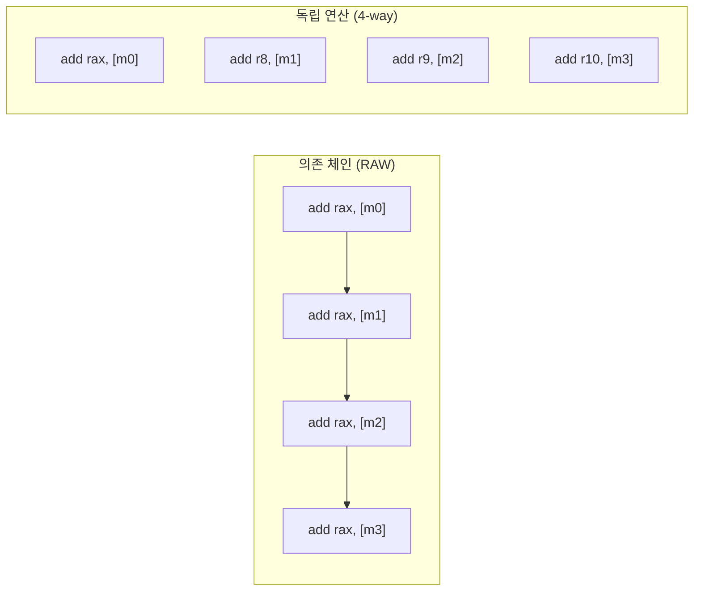
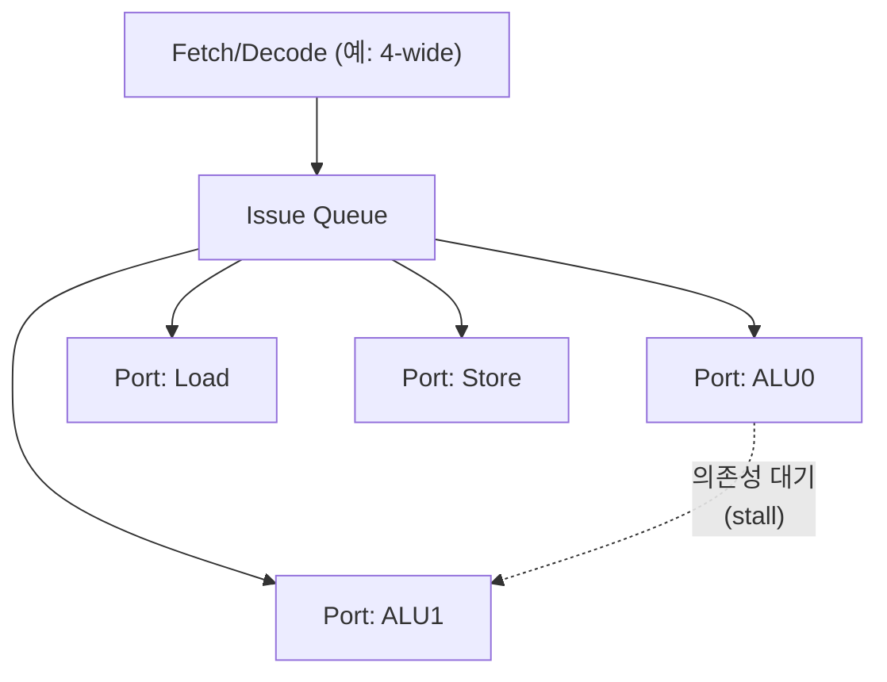

<strong>명령 수준 병렬성(ILP, Instruction-Level Parallelism)</strong>이란 서로 데이터 의존이 없는 명령들을 한 코어 안에서 동시에 겹쳐 실행해, 프로그램 순서상 순차적으로 보이는 코드에서 실질적인 동시성을 뽑아내는 능력을 말합니다. 단일 스레드 코드를 고치지 않아도 CPU가 알아서 여러 명령을 병렬로 처리해 준다는 인식은 절반만 맞습니다. 실제로는 코드에 남아 있는 <strong>데이터 의존성(data dependency)</strong>의 형태가 하드웨어가 뽑아낼 수 있는 병렬성의 상한을 정하고, 그 상한을 이해하지 못하면 "왜 코어를 넓혀도, 컴파일러 최적화 옵션을 올려도 IPC(초당 명령 처리량, Instructions Per Cycle)가 그대로인가"라는 질문에 답할 수 없습니다. 이 장은 ILP가 무엇을 뜻하는지, 슈퍼스칼라(superscalar) 실행기가 어떻게 여러 명령을 동시에 처리하는지, 그리고 명령 스케줄링과 의존성이 어떤 방식으로 병렬성을 제약하는지를 다룹니다.

## 이 장을 읽기 전에

이 장은 [01장: CPU 파이프라인 기초](/post/cpu-optimization/cpu-pipeline-fundamentals/)에서 다룬 fetch–decode–execute–writeback 단계 구분과, [04장: 캐시 미스 분석과 대응](/post/cpu-optimization/cache-miss-analysis-hint-instructions/)에서 다룬 "메모리 지연이 실행을 막을 수 있다"는 감각을 전제로 합니다. 파이프라인이 한 번에 한 명령만 처리하는 것이 아니라 여러 단계를 겹쳐 처리한다는 것, 그리고 로드 결과가 늦게 도착하면 그 결과를 쓰는 명령이 기다려야 한다는 것만 알면 충분합니다.

**이 장의 깊이**: **중급**입니다. ILP의 정의, 슈퍼스칼라 실행의 원리, 데이터 의존성이 병렬성을 어떻게 제약하는지를 코드·어셈블리 수준에서 다룹니다. **다루지 않는 것**: 레지스터 리네이밍·예약 스테이션(reservation station)·재정렬 버퍼(ROB) 같은 실제 비순차 실행(Out-of-Order execution) 하드웨어의 내부 동작은 [06장: Out-of-Order 실행과 성능](/post/cpu-optimization/out-of-order-execution-performance/)에서, 실행 포트 경합과 의존성 체인의 정량적 분석은 [18장: 의존성 체인·포트 압력 분석](/post/cpu-optimization/dependency-chain-port-pressure-analysis/)에서, 디코딩된 μop을 재사용하는 μop 캐시는 [15장: μOp 캐시와 DSB](/post/cpu-optimization/uop-cache-decoded-stream-buffer/)에서 각각 깊게 다룹니다. 이 장은 그 세 장을 읽기 위한 개념적 토대를 만드는 역할입니다.

## 당신의 수준에 맞는 경로

| 수준 | 읽을 부분 | 핵심 목표 |
|------|---------|---------|
| **입문자** | "ILP 개념의 등장과 배경" ~ "명령 수준 병렬성이란 무엇인가" | ILP가 "동시에 실행 가능한 독립 명령의 양"이라는 정의 이해 |
| **중급자** | "데이터 의존성이 병렬성을 제약하는 방식" ~ "정적 스케줄링과 동적 스케줄링" | RAW/WAR/WAW 의존성을 코드에서 식별하고 의존 체인을 재구성 |
| **실무 적용** | "판단 기준" ~ "비판적 시각" | 언제 의존 체인 분할이 유효하고 언제 무의미한지 판단 |

---

## ILP 개념의 등장과 배경

명령을 순서대로 하나씩 처리하는 단순 파이프라인의 한계는 1960년대 후반부터 이미 알려져 있었습니다. IBM은 1966년 System/360 Model 91을 발표했는데, 이 기종의 부동소수점 유닛은 <strong>로버트 토마술로(Robert Tomasulo)</strong>가 설계한 동적 명령 스케줄링 알고리즘을 채택해 프로그램 순서와 다르게 명령을 실행하면서도 결과의 정확성을 보장했습니다. 이 알고리즘은 레지스터 리네이밍과 예약 스테이션이라는 개념을 처음으로 하드웨어에 구현했고, 여러 실행 유닛에 걸쳐 명령이 동시에 진행될 수 있는 길을 열었습니다. Model 91 자체는 상업적으로는 성공하지 못했지만, 토마술로의 접근은 오늘날 거의 모든 고성능 코어가 쓰는 비순차 실행의 원형이 되었고, 그는 1997년 Eckert–Mauchly Award를 받았습니다. "여러 명령을 한 사이클에 처리 시작할 수 있다"는 뜻의 <strong>슈퍼스칼라(superscalar)</strong>라는 용어는 1980년대 후반 IBM 연구진의 문헌에서 자리 잡았고, 곧 여러 제조사의 상용 프로세서 설계에 반영되었습니다. 이후 컴퓨터 구조 연구자들은 "실제 프로그램에서 뽑아낼 수 있는 ILP는 이론상 얼마나 되는가"를 정량적으로 따지기 시작했는데, 그 대표적인 결과가 뒤에서 다룰 David Wall의 연구입니다.

## 명령 수준 병렬성이란 무엇인가

ILP는 한 프로그램의 명령 스트림 안에서, 서로 결과를 주고받지 않는 명령들이 얼마나 많은지를 나타내는 척도입니다. 이상적인 하드웨어(무한한 실행 유닛, 완벽한 분기 예측, 즉시 완료되는 메모리 접근)를 가정했을 때 한 사이클에 동시에 처리를 시작할 수 있는 명령의 평균 개수가 곧 그 코드의 ILP 상한입니다. 실제 CPU는 이 이상적인 상한에 훨씬 못 미치는데, 이유는 세 가지로 나뉩니다. 첫째, 명령들 사이에 실제 데이터 의존성이 있어 순서를 지켜야 하는 경우, 둘째, 분기 예측이 틀려 잘못된 경로의 명령을 버려야 하는 경우, 셋째, 캐시 미스나 TLB 미스처럼 메모리 계층에서 지연이 발생해 그 결과를 기다리는 명령들이 줄줄이 막히는 경우입니다. 이 장은 그중 첫 번째, 즉 **데이터 의존성이 만드는 제약**에 초점을 맞춥니다. 분기 예측 실패의 비용은 [02장](/post/cpu-optimization/branch-prediction-mechanisms-cost/)이, 캐시·메모리 지연은 [03장](/post/cpu-optimization/cache-hierarchy-l1-l2-l3/)과 [04장](/post/cpu-optimization/cache-miss-analysis-hint-instructions/)이 각각 다룹니다. 실무에서 IPC(사이클당 처리 명령 수)를 프로파일러로 측정했을 때 1–2 언저리에 머무는 경우가 흔한데, 이는 코어의 최대 이슈 폭(issue width)이 4–8임에도 실제 코드에 존재하는 ILP가 그보다 훨씬 작다는 뜻입니다.

## 데이터 의존성이 병렬성을 제약하는 방식

두 명령 사이의 관계는 세 가지 하자드(hazard)로 분류됩니다. <strong>RAW(Read-After-Write, 진짜 의존성)</strong>는 한 명령이 쓴 값을 다음 명령이 읽는 경우로, 이것만은 실행 순서를 반드시 지켜야 하는 유일한 하자드입니다. <strong>WAR(Write-After-Read)</strong>와 <strong>WAW(Write-After-Write)</strong>는 같은 레지스터를 재사용해서 생기는 "이름 충돌"일 뿐 실제 데이터가 오가지는 않으며, 레지스터 리네이밍으로 대부분 제거할 수 있습니다(리네이밍의 하드웨어 동작은 06장에서 다룹니다). 따라서 ILP를 실질적으로 제한하는 것은 RAW로 이어진 <strong>의존 체인(dependency chain)</strong>의 길이입니다. 체인 안의 각 명령은 이전 명령의 결과가 레지스터에 쓰인 뒤에야 실행을 시작할 수 있으므로, 그 체인 전체의 실행 시간은 (체인 길이) × (각 명령의 지연시간, latency)로 정해지고, 아무리 실행 포트가 많아도 이 시간 아래로는 줄어들지 않습니다.

다음은 같은 연산(64비트 정수 합)을 의존 체인으로 계산하는 코드와, 체인을 4개로 쪼개 서로 독립시킨 코드입니다.

```cpp
#include <cstdint>
#include <cstddef>

// 의존 체인: acc(i)는 acc(i-1)이 완료된 뒤에만 계산 가능 → 체인 길이 = n
std::uint64_t sum_dependent(const std::uint64_t* data, std::size_t n) {
  std::uint64_t acc = 0;
  for (std::size_t i = 0; i < n; ++i) {
    acc += data[i];
  }
  return acc;
}
```

이 코드는 반복마다 하나의 RAW 의존성으로 이어져 있어, 덧셈의 지연시간(예: 1사이클)만큼 매 반복이 그대로 누적됩니다. 아래 코드는 누산기 4개를 두어 서로 다른 RAW 체인 4개로 나눕니다.

```cpp
#include <cstdint>
#include <cstddef>

// 독립 누산기 4개: acc0~acc3은 서로 의존하지 않으므로 슈퍼스칼라 실행기가 동시에 진행 가능
std::uint64_t sum_independent(const std::uint64_t* data, std::size_t n) {
  std::uint64_t acc0 = 0, acc1 = 0, acc2 = 0, acc3 = 0;
  std::size_t i = 0;
  for (; i + 4 <= n; i += 4) {
    acc0 += data[i];
    acc1 += data[i + 1];
    acc2 += data[i + 2];
    acc3 += data[i + 3];
  }
  std::uint64_t acc = acc0 + acc1 + acc2 + acc3;
  for (; i < n; ++i) acc += data[i];
  return acc;
}
```

`sum_independent`는 각 반복에서 4개의 독립된 RAW 체인을 동시에 진행시키므로, 체인 하나의 지연시간은 그대로지만 4배 많은 원소를 같은 시간에 처리합니다. 다만 결과 값 자체는 두 코드가 동일한 합을 내야 하므로 함수 시그니처와 의미는 바꾸지 않았고, 성능 차이는 오직 의존 구조에서만 옵니다.

두 코드의 어셈블리 골격을 보면 차이가 더 분명합니다.

```asm
; 의존 체인: 각 add가 이전 add의 결과(rax)를 그대로 이어받음
add rax, [rdi]
add rax, [rdi+8]
add rax, [rdi+16]
add rax, [rdi+24]

; 독립 연산: 서로 다른 레지스터에 누적 → 실행 유닛이 동시에 처리 가능
add rax, [rdi]
add r8,  [rdi+8]
add r9,  [rdi+16]
add r10, [rdi+24]
```

의존 체인 쪽은 각 `add`가 바로 앞 `add`의 결과를 읽으므로 실행 유닛이 여러 개라도 한 번에 하나씩만 진행되고, 독립 연산 쪽은 네 `add`가 서로의 결과를 기다릴 필요가 없어 슈퍼스칼라 이슈 폭 안에서 동시에 실행을 시작할 수 있습니다.



이 차이를 격리해서 측정하려면 아래와 같은 Google Benchmark 스켈레톤을 쓸 수 있습니다(x86-64, GCC 13, `-O2` 기준). 자동 벡터화가 개입하면 ILP만의 효과와 SIMD 효과가 섞이므로, 스칼라 의존성 효과만 보고 싶다면 `-fno-tree-vectorize`를 추가해 벡터화를 끈 상태로 비교합니다.

```cpp
#include <benchmark/benchmark.h>
#include <cstdint>
#include <vector>

std::uint64_t sum_dependent(const std::uint64_t* data, std::size_t n) {
  std::uint64_t acc = 0;
  for (std::size_t i = 0; i < n; ++i) acc += data[i];
  return acc;
}

std::uint64_t sum_independent(const std::uint64_t* data, std::size_t n) {
  std::uint64_t acc0 = 0, acc1 = 0, acc2 = 0, acc3 = 0;
  std::size_t i = 0;
  for (; i + 4 <= n; i += 4) {
    acc0 += data[i]; acc1 += data[i + 1];
    acc2 += data[i + 2]; acc3 += data[i + 3];
  }
  std::uint64_t acc = acc0 + acc1 + acc2 + acc3;
  for (; i < n; ++i) acc += data[i];
  return acc;
}

static void BM_SumDependent(benchmark::State& state) {
  std::vector<std::uint64_t> data(1 << 16, 1);
  for (auto _ : state) {
    auto r = sum_dependent(data.data(), data.size());
    benchmark::DoNotOptimize(r);
  }
}
BENCHMARK(BM_SumDependent);

static void BM_SumIndependent(benchmark::State& state) {
  std::vector<std::uint64_t> data(1 << 16, 1);
  for (auto _ : state) {
    auto r = sum_independent(data.data(), data.size());
    benchmark::DoNotOptimize(r);
  }
}
BENCHMARK(BM_SumIndependent);

BENCHMARK_MAIN();
```

`g++ -O2 -fno-tree-vectorize bench.cpp -lbenchmark -lpthread`로 빌드해 실행하면, 정수 덧셈의 지연시간이 처리량(throughput)보다 큰 아키텍처에서 `BM_SumIndependent`가 `BM_SumDependent`보다 눈에 띄게(수 배 수준, 정확한 배율은 코어의 실행 포트 수·덧셈 지연시간에 따라 다름) 빠르게 나오는 경우가 흔합니다. `perf stat`로 두 버전을 각각 실행해 IPC를 비교하면 의존 체인 쪽의 IPC가 이론적 이슈 폭에 크게 못 미치고, 독립 연산 쪽의 IPC가 더 높게 나오는 경향을 볼 수 있습니다(수치는 플랫폼·컴파일러·최적화 플래그에 따라 달라지므로 직접 재현해 확인합니다).

```text
# perf stat -e task-clock,cycles,instructions ./a.out (예시 형태, 실제 수치는 환경마다 다름)
 Performance counter stats for './a.out':
        1,204.31 msec task-clock
   3,912,500,112      cycles
   4,201,300,050      instructions              #    1.07  insn per cycle   <- 의존 체인 버전
```

## 슈퍼스칼라 실행: 여러 명령을 동시에 처리하는 방법

슈퍼스칼라 코어는 한 사이클에 명령 하나만 페치·디코드·실행하는 대신, 프런트엔드가 매 사이클 여러 명령을 페치·디코드하고(이슈 폭, issue width), 백엔드의 여러 실행 포트(execution port)에 나눠 보냅니다. 이슈 폭이 4라는 것은 이상적인 조건에서 한 사이클에 최대 4개 명령이 실행을 시작할 수 있다는 뜻이지, 실제로 매 사이클 4개가 처리된다는 뜻은 아닙니다. 실제 처리량은 (a) 그 사이클에 서로 독립적인 명령이 4개나 준비되어 있는지, (b) 그 명령들이 필요로 하는 실행 포트가 서로 겹치지 않는지에 따라 갈립니다. 정수 ALU 연산, 부동소수점/벡터 연산, 로드, 스토어는 보통 서로 다른 포트에 배정되므로, 같은 포트를 요구하는 명령이 몰리면 포트 자체가 병목이 되기도 합니다. 이 포트 배정과 경합을 정량적으로 분석하는 방법(예: `perf`의 포트 압력 이벤트, uops.info류 데이터)은 [18장: 의존성 체인·포트 압력 분석](/post/cpu-optimization/dependency-chain-port-pressure-analysis/)에서, 프런트엔드가 디코드한 결과를 재사용하는 μop 캐시는 [15장](/post/cpu-optimization/uop-cache-decoded-stream-buffer/)에서 다룹니다. 여기서 기억할 것은 하나입니다 — <strong>이슈 폭은 병렬성의 상한일 뿐, 그 상한을 채우는 것은 코드에 남아 있는 독립 명령의 수(ILP)</strong>라는 점입니다.



## 정적 스케줄링과 동적 스케줄링

명령의 실행 순서를 재배치해 의존 체인 사이의 간격을 벌리는 작업은 두 층위에서 일어날 수 있습니다. <strong>정적 스케줄링(static scheduling)</strong>은 컴파일러가 빌드 시점에 명령 순서를 재배열하는 것으로, 명령어 스케줄링 패스가 레지스터 압력과 지연시간 추정치를 바탕으로 순서를 정합니다. <strong>동적 스케줄링(dynamic scheduling)</strong>은 하드웨어가 실행 시점에 준비된 명령을 골라 실행하는 것으로, 앞서 언급한 토마술로 알고리즘 계열의 비순차 실행이 여기에 해당합니다. 두 층위는 서로 대체 관계가 아니라 보완 관계입니다. 정적 스케줄링만으로 동작하는 인오더(in-order) 코어(임베디드·일부 저전력 코어)에서는 컴파일러가 만든 순서가 곧 실행 순서이므로 컴파일러의 스케줄링 품질이 성능에 직접 반영되지만, 비순차 실행 코어에서도 컴파일러가 좋은 순서를 만들어 두면 하드웨어의 스케줄링 창(scheduling window)이 더 먼 미래의 독립 명령까지 볼 필요가 줄어 리소스 압박이 완화됩니다. VLIW(Very Long Instruction Word)처럼 병렬 실행 여부를 컴파일러가 전적으로 결정하는 설계도 있지만, 이는 범용 서버·클라이언트 CPU보다는 DSP·특정 임베디드 영역에서 주로 쓰입니다.

## 흔한 오개념

### "실행 포트가 많으면 무조건 더 빨라진다"

실행 포트 수는 한 사이클에 처리를 시작할 수 있는 명령의 **상한**일 뿐, 의존 체인으로 묶인 코드는 포트를 아무리 늘려도 체인의 지연시간 총합 아래로 내려가지 않습니다. 위에서 본 `sum_dependent`는 포트가 8개인 코어에서 실행해도 결국 "덧셈 지연시간 × n번"의 시간이 걸립니다. 포트 수를 늘려서 이득을 보려면 애초에 서로 독립적인 명령이 충분히 있어야 하며, 그렇지 않다면 포트 확장은 그 코드에 아무 영향을 주지 못합니다.

### "컴파일러가 순서를 바꾸면 하드웨어 비순차 실행은 필요 없다"

정적 스케줄링은 컴파일 시점에 알 수 있는 지연시간 추정치에 기반하지만, 실제 실행 시점의 캐시 히트/미스, 분기 결과, 메모리 주소 충돌 여부는 런타임에만 확정됩니다. 비순차 실행 하드웨어는 이런 런타임 정보를 바탕으로 그때그때 준비된 명령을 골라 실행하므로, 아무리 잘 짜인 정적 스케줄이라도 동적 스케줄링이 주는 유연성을 완전히 대체하지 못합니다. 반대로 동적 스케줄링이 있다고 해서 정적 스케줄링이 무의미한 것도 아닙니다 — 스케줄링 창의 크기는 유한하므로, 컴파일러가 애초에 의존 체인을 짧게 만들어 두면 하드웨어가 볼 수 있는 범위 안에서 더 많은 독립 명령을 찾아낼 수 있습니다.

### "코드를 잘 짜기만 하면 ILP는 계속 늘어난다"

실제 프로그램에서 뽑아낼 수 있는 ILP는 무한하지 않습니다. 분기, 진짜 데이터 의존성, 메모리 접근 패턴이 만드는 제약은 코드를 아무리 재배치해도 완전히 사라지지 않으며, 이상적인 하드웨어를 가정한 연구조차 실제 프로그램의 평균 ILP가 예상보다 훨씬 낮게 나온다는 결론에 이르렀습니다(자세한 배경은 아래 "비판적 시각" 참고). 의존 체인을 나누는 기법은 "이미 존재하는 독립성을 하드웨어가 보기 쉽게 만드는 것"이지, "없던 병렬성을 만들어내는 것"이 아닙니다.

## 판단 기준: 언제 의존 체인을 재구성할까

| 상황 | 권장 | 비권장 |
|------|------|--------|
| 리덕션(합계·곱·최댓값 등) 반복 루프 | 프로파일링 후 다중 누산기(2–4개)로 체인 분할 | 프로파일링 없이 무조건 언롤·다중화 |
| 반복 간 진짜 데이터 의존이 없는 계산 | 컴파일러 자동 벡터화·언롤 여부를 어셈블리로 확인 | 이미 최적화된 코드에 불필요한 수동 언롤 추가 |
| 부동소수점 합계에서 재현성이 중요한 경우 | 순서 변경이 결과에 미치는 오차를 검증한 뒤 적용 | 오차 검증 없이 다중 누산기로 교체 |
| 캐시 미스·메모리 지연이 지배적인 루프 | ILP 재구성보다 접근 패턴(03·04장) 개선을 우선 | 병목 원인을 확인하지 않고 ILP 기법부터 적용 |
| 반복 수가 적은 짧은 루프 | 실측 후 적용(오버헤드가 이득보다 클 수 있음) | 벤치마크 없이 프로덕션 코드에 바로 반영 |

부동소수점 리덕션에서 다중 누산기로 나누면 덧셈 순서가 바뀌므로, IEEE 754 부동소수점의 비결합성(non-associativity) 때문에 결과 값이 원래 순차 합과 마이크로 단위로 달라질 수 있습니다. 정확도 재현성이 요구되는 코드(회계·과학 계산 검증 등)에서는 이 차이가 허용 범위 안인지 먼저 확인해야 합니다.

## 비판적 시각: ILP의 실질적 한계

1990년대 초 David Wall은 실제 프로그램의 명령 트레이스를 이상적인 하드웨어(무한 실행 유닛, 완벽한 분기 예측, 매우 넓은 스케줄링 창)로 시뮬레이션해 평균 ILP를 추정하는 연구를 발표했습니다. 결론은 "하드웨어 제약을 극단적으로 완화해도 대부분의 실제 프로그램은 이론적으로 기대할 만한 수준만큼 병렬성을 내주지 않는다"는 것이었고, 이 발견은 이후 "ILP 벽(ILP wall)"이라는 표현으로 자주 인용됩니다. 이 결과는 왜 프로세서 설계가 2000년대 이후 단일 스레드 이슈 폭을 무한정 늘리는 대신 SMT([14장](/post/cpu-optimization/smt-hyperthreading-performance/))와 멀티코어로 방향을 튼 배경 중 하나이기도 합니다. 이슈 폭을 늘리는 데 드는 하드웨어 비용(포트, 리네이밍 테이블, 스케줄링 창, 배선 복잡도)은 폭에 비례하지 않고 훨씬 가파르게 늘어나는 경향이 있어, 실제로 뽑아낼 수 있는 ILP가 제한적이라면 그 비용 대비 이득이 급격히 줄어듭니다. 또한 의존 체인 분할 같은 기법은 "코드에 이미 존재하는 독립성을 드러내는 것"일 뿐이며, 알고리즘 자체가 순차적인 문제(예: 진짜 순환 의존을 가진 재귀 계산)에는 적용할 여지가 거의 없습니다. 세부 실행 유닛·포트 구성은 세대·벤더마다 다르므로, 특정 수치(포트 개수, 지연시간)에 대한 판단은 항상 대상 마이크로아키텍처의 실측 자료(Agner Fog의 [명령어 지연시간·처리량 표](https://www.agner.org/optimize/)나 [Intel 최적화 참조 매뉴얼](https://cdrdv2-public.intel.com/814198/248966-Optimization-Reference-Manual-V1-049.pdf) 같은 1차 자료)로 확인하는 것이 안전합니다.

## 마무리

- [ ] ILP가 "동시에 실행 가능한 독립 명령의 양"을 뜻하며, 실제 처리량이 이슈 폭보다 항상 낮게 나오는 이유를 설명할 수 있다.
- [ ] RAW/WAR/WAW 하자드를 구분하고, 병렬성을 실질적으로 제약하는 것이 RAW로 이어진 의존 체인의 길이임을 설명할 수 있다.
- [ ] 의존 체인을 다중 누산기로 나누는 코드 패턴을 작성하고, 그 효과를 벤치마크·`perf stat`의 IPC로 검증할 수 있다.
- [ ] 정적 스케줄링과 동적 스케줄링의 역할 차이를 설명하고, 어느 쪽도 다른 쪽을 완전히 대체하지 못하는 이유를 말할 수 있다.
- [ ] "포트를 늘리면 무조건 빠르다", "ILP는 무한히 늘릴 수 있다" 같은 오개념을 근거를 들어 반박할 수 있다.
- [ ] ILP 재구성이 유효한 상황(리덕션 루프)과 무의미한 상황(메모리 바운드, 짧은 루프, 순차 의존 알고리즘)을 판단 기준 표로 구분할 수 있다.

**이전 장**: [캐시 미스 분석과 대응](/post/cpu-optimization/cache-miss-analysis-hint-instructions/) (챕터 04)

다음 장에서는 이 장에서 다룬 ILP의 상한을 실제로 채우는 하드웨어, 즉 <strong>비순차 실행(Out-of-Order execution)</strong>을 다룹니다. 레지스터 리네이밍이 WAR/WAW 하자드를 어떻게 제거하는지, 예약 스테이션과 재정렬 버퍼가 명령을 어떻게 대기·완료시키는지, 그리고 비순차 실행의 창(window) 크기가 실제로 뽑아낼 수 있는 ILP에 어떤 한계를 두는지를 살펴봅니다.

→ [Out-of-Order 실행과 성능](/post/cpu-optimization/out-of-order-execution-performance/) (챕터 06)
