**Out-of-Order(OoO) 실행**이란 프로그램에 적힌 명령어 순서가 아니라 피연산자가 준비된 순서대로 명령어를 실행하고, 그 결과만 프로그램 순서대로 다시 정렬해 아키텍처 상태(레지스터·메모리)에 반영하는 하드웨어 기법입니다. 순수 in-order 파이프라인에서는 캐시 미스나 긴 나눗셈 하나가 뒤이은 독립적인 명령어까지 통째로 멈춰 세우지만, 실제 코드에는 그 정지 구간 바로 뒤에 곧바로 실행할 수 있는 무관한 작업이 흔히 존재합니다. OoO 엔진은 이 "뒤에 있지만 준비된" 명령어를 찾아 먼저 실행함으로써 파이프라인을 계속 채우는 문제를 하드웨어 차원에서 해결하며, 이 장에서는 그 엔진을 구성하는 reorder buffer(ROB)와 reservation station/scheduler, 레지스터 리네이밍이 실제로 어떻게 맞물려 동작하고 지연시간에 얼마나 영향을 주는지를 다룹니다.

## 이 장을 읽기 전에

**선행 지식**: [05장: 명령 수준 병렬성(ILP) 기초](/post/cpu-optimization/instruction-level-parallelism-fundamentals/)에서 다룬 ILP·RAW/WAR/WAW 의존성·슈퍼스칼라 발행 폭 개념을 전제로 합니다. [01장: CPU 파이프라인 기초](/post/cpu-optimization/cpu-pipeline-fundamentals/)의 fetch-decode-execute-writeback 단계 구분도 알고 있으면 좋습니다.

**이 장의 깊이**: 이 장은 **심화**입니다. OoO 엔진 내부의 ROB·reservation station·레지스터 리네이밍이 명령어 하나하나를 어떻게 통과시키는지, 그리고 ROB 점유량이 실제 지연시간·처리량에 어떻게 반영되는지를 다룹니다. **다루지 않는 것**: 실행 포트 경합·의존성 체인 길이의 정량적 분석([18장](/post/cpu-optimization/dependency-chain-port-pressure-analysis/)), 분기 예측 실패 시 파이프라인 플러시의 세부 메커니즘([02장](/post/cpu-optimization/branch-prediction-mechanisms-cost/)), 캐시 미스 자체의 지연시간·프리페치 전략([03](/post/cpu-optimization/cache-hierarchy-l1-l2-l3/)·[04장](/post/cpu-optimization/cache-miss-analysis-hint-instructions/)), SMT에서 ROB가 스레드 간 분할되는 문제([14장](/post/cpu-optimization/smt-hyperthreading-performance/)), 추측 실행이 만드는 보안 영향([10장](/post/cpu-optimization/speculative-execution-security-impact/))입니다.

## 당신의 수준에 맞는 경로

| 수준 | 읽을 부분 | 핵심 목표 |
|------|---------|---------|
| **초보자** | "OoO 엔진의 등장 배경" ~ "레지스터 리네이밍" | OoO가 왜 필요한지, ROB·리네이밍의 기본 개념 이해 |
| **중급자** | "OoO 엔진 내부 동작" ~ "OoO가 실제 성능에 미치는 영향" | 명령어가 파이프라인 단계를 통과하는 흐름과 ROB 점유가 성능에 미치는 영향 이해 |
| **전문가** | "판단 기준" ~ "비판적 시각" | ROB 크기·메모리 수준 병렬성·SMT 파티셔닝을 고려한 실무 판단 |

---

## OoO 엔진의 등장 배경 (역사·배경)

명령어를 프로그램 순서와 다르게 실행하는 아이디어 자체는 1967년 Robert Tomasulo가 IBM System/360 Model 91의 부동소수점 유닛을 위해 고안한 **Tomasulo 알고리즘**까지 거슬러 올라갑니다. 이 알고리즘은 오늘날 OoO 엔진의 세 가지 핵심 요소 — 하드웨어 레지스터 리네이밍, 각 실행 유닛에 붙은 reservation station, 계산 결과를 대기 중인 모든 유닛에 동시에 방송하는 공용 데이터 버스(common data bus) — 를 이미 갖추고 있었습니다. 다만 이 설계는 소수의 대형 메인프레임 부동소수점 유닛에 한정된 기법이었고, 범용 x86 코어에 OoO 실행이 들어온 것은 그로부터 거의 30년 뒤인 1995년 Intel Pentium Pro(P6 마이크로아키텍처)에서였습니다. Pentium Pro는 40-entry ROB와 20-µop 용량의 통합 reservation station으로 x86 명령어를 내부 µop으로 변환해 순서와 무관하게 디스패치했고, 이후 모든 주류 고성능 x86·ARM 코어가 이 구조를 계승했습니다.

ROB 크기는 이후 30년 동안 꾸준히 커져 왔습니다. Anton Ertl이 유지하는 [ROB 크기 측정 자료](http://www.complang.tuwien.ac.at/anton/robsize/)에 따르면 Intel 계열은 Pentium Pro의 40-entry에서 Skylake(2015) 224-entry, Golden Cove(2021) 512-entry, Lion Cove(2024) 576-entry로 커졌고, AMD Zen 계열도 Zen(2017) 192-entry에서 Zen4(2022) 320-entry, Zen5(2024) 448-entry로 확장되었습니다. 이 성장은 임의로 커진 것이 아니라 코어 클럭과 메모리 지연시간 사이의 격차가 벌어진 결과에 가깝습니다 — 캐시 미스 하나가 수백 사이클을 잡아먹는 동안 파이프라인을 계속 채우려면, 그만큼 더 많은 "아직 폐기되지 않은" 명령어를 창(window) 안에 들고 있어야 하기 때문입니다.

## OoO 엔진 내부 동작

**레지스터 리네이밍**은 명령어가 참조하는 아키텍처 레지스터(예: x86의 RAX)를 훨씬 많은 물리 레지스터 중 하나에 동적으로 매핑하는 단계입니다. 같은 아키텍처 레지스터에 두 번 쓰는 명령어가 있어도, 리네이밍 후에는 서로 다른 물리 레지스터를 가리키게 되므로 WAR(Write-After-Read)·WAW(Write-After-Write) 하자드가 사라지고 진짜 데이터 의존성인 RAW(Read-After-Write)만 남습니다. 이 덕분에 프로그램에 우연히 같은 레지스터 이름이 재사용되었다는 이유만으로 명령어가 대기하는 가짜 정지가 없어집니다.

리네이밍이 끝난 µop은 두 곳에 동시에 들어갑니다. 하나는 **ROB**로, 프로그램 순서 그대로 한 슬롯씩 할당되어 "이 명령어가 아직 완료·폐기(retire)되지 않았다"는 사실을 표시하는 원형 큐입니다. 다른 하나는 **reservation station(또는 통합 스케줄러)**으로, 각 µop이 자신의 입력 피연산자가 준비될 때까지 대기하는 곳입니다. 피연산자가 모두 준비되면 해당 µop은 "ready" 상태가 되어 실행 포트를 두고 다른 ready µop들과 경쟁하며, 승인되면 실행 유닛에서 계산이 이뤄지고 결과가 우회망(bypass network)을 통해 이를 기다리던 다른 µop들에게 즉시 전달됩니다. 이 wakeup-select 루프가 Tomasulo의 공용 데이터 버스를 계승한 부분이며, 여기서 실행 순서는 완전히 프로그램 순서와 무관합니다. Intel의 [Optimization Reference Manual](https://cdrdv2-public.intel.com/814198/248966-Optimization-Reference-Manual-V1-049.pdf)도 자사 코어의 아웃 오브 오더 엔진을 이와 같은 할당(allocate)-디스패치(dispatch)-실행-폐기 단계로 설명합니다.

**폐기(retire)는 항상 프로그램 순서대로** 일어난다는 점이 OoO 엔진에서 가장 중요한 규칙입니다. ROB는 헤드(head)에 있는 항목, 즉 프로그램 순서상 가장 오래된 명령어부터 순서대로만 완료 처리를 허용하며, 헤드 항목이 아직 실행 중이면 그보다 늦게 실행이 끝난 항목도 대기해야 합니다. 이 규칙 때문에 인터럽트나 예외, 분기 예측 실패가 발생해도 프로세서는 "마지막으로 폐기된 명령어까지의 상태"로 항상 정확히 되돌릴 수 있고, 소프트웨어와 운영체제 입장에서는 내부적으로 무슨 순서로 실행되었든 명령어가 하나씩 순서대로 끝난 것처럼 관찰됩니다. 이것이 **정밀 예외(precise exception)**이며, OoO 실행이 겉으로는 순차 실행처럼 "보이게" 만드는 장치가 바로 ROB입니다.

```mermaid
flowchart LR
  fetch["Fetch"] --> decode["Decode</br>(macro-op → μop)"]
  decode --> rename["Register Rename</br>(WAR/WAW 제거)"]
  rename --> alloc["ROB Allocate</br>(program order)"]
  alloc --> disp["Dispatch to</br>Reservation Station"]
  disp --> issue["Issue</br>(피연산자 ready)"]
  issue --> exec["Execute</br>(Out-of-Order)"]
  exec --> wb["Writeback</br>(bypass 방송)"]
  wb --> retire["Retire</br>(in-order, ROB head)"]
  retire --> arch["Architectural State"]
```



ROB가 큐 형태로 프로그램 순서를 유지하는 동안, 그 안에 아직 폐기되지 못한 명령어가 많이 쌓여 있을수록 코어는 "더 멀리 있는" 독립적인 명령어까지 미리 찾아 실행할 여지를 갖습니다. 특히 캐시 미스처럼 결과가 늦게 오는 연산이 ROB 헤드 근처를 막고 있을 때, ROB 뒤쪽에 대기 중인 서로 다른 미스들이 동시에 진행될 수 있는지가 **메모리 수준 병렬성(MLP, Memory-Level Parallelism)**을 좌우합니다. 즉 ROB 크기는 단순히 "명령어를 몇 개 더 들고 있는가"의 문제가 아니라, outstanding 메모리 요청을 몇 개까지 동시에 진행시킬 수 있는가와 직결되며, 이 부분은 [04장의 캐시 미스 분석](/post/cpu-optimization/cache-miss-analysis-hint-instructions/)에서 다루는 미스 비용과 맞물려 작동합니다.

## OoO가 실제 성능에 미치는 영향

OoO 엔진이 있어도 만능은 아닙니다. 명령어 사이에 **진짜 데이터 의존성(RAW)**이 연속으로 이어지는 체인이 있으면, 그 체인의 각 단계는 이전 단계의 결과가 나올 때까지 물리적으로 기다려야 하므로 아무리 큰 reservation station과 ROB가 있어도 실행 순서를 앞당길 수 없습니다. 반대로 서로 완전히 독립적인 여러 연산이 코드에 섞여 있으면, OoO 스케줄러는 이들을 여러 실행 포트에 동시에 밀어 넣어 개별 연산의 지연시간을 서로 겹치게 만듭니다. 아래 벤치마크는 이 차이를 같은 반복 횟수·같은 데이터 크기로 격리해 비교합니다.

```cpp
#include <benchmark/benchmark.h>
#include <vector>
#include <numeric>
#include <random>
#include <algorithm>

// 의존 체인: next[cur]가 다음 cur를 결정하므로 각 반복이 이전 결과에 의존한다.
// OoO 스케줄러가 아무리 크더라도 이 체인 자체를 앞당겨 실행할 수는 없다.
static void BM_DependentChain(benchmark::State& state) {
  const size_t n = 1 << 16;
  std::vector<int> next(n);
  std::vector<size_t> idx(n);
  std::iota(idx.begin(), idx.end(), 0);
  std::mt19937 rng(42);
  std::shuffle(idx.begin(), idx.end(), rng);
  for (size_t i = 0; i + 1 < n; ++i) next[idx[i]] = static_cast<int>(idx[i + 1]);
  next[idx[n - 1]] = static_cast<int>(idx[0]);

  for (auto _ : state) {
    int cur = 0;
    for (size_t i = 0; i < n; ++i) cur = next[cur];  // 각 반복이 직전 결과에 의존
    benchmark::DoNotOptimize(cur);
  }
}
BENCHMARK(BM_DependentChain);

// 독립 스트림: 네 누산기는 서로 어떤 데이터도 공유하지 않는다.
// OoO 스케줄러가 네 스트림을 여러 실행 포트에 겹쳐 실행할 수 있다.
static void BM_IndependentStreams(benchmark::State& state) {
  const size_t n = 1 << 16;
  std::vector<int> a(n), b(n), c(n), d(n);
  std::iota(a.begin(), a.end(), 1);
  std::iota(b.begin(), b.end(), 2);
  std::iota(c.begin(), c.end(), 3);
  std::iota(d.begin(), d.end(), 4);

  for (auto _ : state) {
    int sa = 0, sb = 0, sc = 0, sd = 0;
    for (size_t i = 0; i < n; ++i) {
      sa += a[i]; sb += b[i]; sc += c[i]; sd += d[i];  // 네 누적은 서로 독립
    }
    benchmark::DoNotOptimize(sa + sb + sc + sd);
  }
}
BENCHMARK(BM_IndependentStreams);

BENCHMARK_MAIN();
```

`g++ -O2 -std=c++17 bench.cpp -lbenchmark -lpthread`(x86-64, GCC 13 기준 예시)로 빌드해 실행하면, `BM_DependentChain`이 `BM_IndependentStreams`보다 반복당 사이클 수가 여러 배 더 크게 나오는 경우가 흔합니다. 두 벤치마크는 메모리 접근 총량이 비슷하므로 그 차이는 대부분 "OoO가 앞당겨 실행할 독립적인 다음 작업이 있는가"에서 옵니다 — 정확한 배율은 캐시 적중률·메모리 지연시간·컴파일러 벡터화 여부에 따라 크게 달라지므로 대상 플랫폼에서 직접 재현해 확인해야 합니다.

벤치마크 결과만으로는 "왜" 느린지 원인이 캐시 미스인지 의존성 자체인지 구분하기 어려우므로, 실제로는 하드웨어 카운터로 한 번 더 확인하는 과정이 필요합니다. `perf stat`으로 두 실행을 비교하면 이 차이가 IPC(Instructions Per Cycle)와 자원 정체 카운터에 그대로 드러납니다.

```text
$ perf stat -e cycles,instructions,resource_stalls.any -- ./bench_dependent
$ perf stat -e cycles,instructions,resource_stalls.any -- ./bench_independent
```

의존 체인 쪽은 IPC가 1에 크게 못 미치고 `resource_stalls`가 높게 나오는 경향이 있는데, 이는 ROB/reservation station이 비어 있지 않아서가 아니라 헤드 근처에서 다음에 실행 가능한 명령어 자체가 없어 파이프라인이 비는 상황을 반영합니다. 독립 스트림 쪽은 상대적으로 IPC가 높게 나와 여러 실행 포트가 동시에 가동되고 있음을 보여줍니다. 카운터 이름과 하이브리드 코어별 분리(`perf --cpu-type`) 등 세부 해석은 [09장: CPU 하드웨어 카운터 활용](/post/cpu-optimization/cpu-hardware-performance-counters/)에서 다루며, 의존성 체인 길이와 포트 압력을 정량적으로 쪼개는 방법은 [18장](/post/cpu-optimization/dependency-chain-port-pressure-analysis/)에서 이어집니다.

## 흔한 오개념

**"OoO 실행은 프로그램의 최종 결과 순서도 바꾼다"**는 틀린 생각입니다. 실행 자체는 순서와 무관하게 일어나지만, ROB는 완료된 결과를 반드시 프로그램 순서대로만 아키텍처 상태에 반영합니다. 소프트웨어가 관찰하는 한 명령어는 항상 하나씩 순서대로 끝난 것처럼 보이며, 이 보장이 정밀 예외와 디버깅 가능성을 유지시켜 줍니다.

**"ROB를 더 키우면 항상 빨라진다"**도 흔한 오해입니다. ROB 확장은 병목이 "창(window)이 좁아서 뒤쪽의 독립 명령어를 못 보는 상황"일 때만 도움이 됩니다. 병목이 실행 포트 처리량이나 프런트엔드 디코드 대역폭에 있다면(이 구분은 [17장의 Frontend/Backend Bound](/post/cpu-optimization/frontend-backend-bound-topdown-basics/) 참고) ROB를 더 늘려도 이미 꽉 찬 자원을 그대로 기다릴 뿐입니다.

**"ROB와 reservation station은 같은 구조다"**라는 혼동도 자주 나옵니다. ROB는 프로그램 순서를 보존하며 폐기 시점을 관리하는 큐이고, reservation station(또는 통합 스케줄러)은 피연산자 준비 여부만 보고 실행 순서를 완전히 자유롭게 정하는 별도의 자료구조입니다. 한 µop은 두 구조 모두에 동시에 존재하며, ROB 슬롯은 실행이 끝난 뒤에도 폐기될 때까지 남아 있는 반면 reservation station 슬롯은 실행이 시작되는 즉시 반납됩니다.

## 판단 기준

| 상황 | OoO/ROB가 관련되는 이유 | 실무 대응 |
|------|--------------------------|-----------|
| 포인터 체이싱 등 긴 RAW 의존 체인이 핫패스 | ROB가 커도 체인 자체를 앞당길 수 없음 | 알고리즘에서 체인을 끊거나 소프트웨어 프리페치 검토([04장](/post/cpu-optimization/cache-miss-analysis-hint-instructions/)) |
| 캐시 미스가 잦고 지연시간이 도미넌트 | ROB 크기가 동시 outstanding 미스 수(MLP)를 제한 | 04장의 미스 분석과 함께 outstanding 미스 개수를 확인 |
| SMT(하이퍼스레딩)를 활성화한 코드 | ROB가 두 스레드로 분할되어 스레드당 실질 창이 줄어듦 | [14장 SMT 챕터](/post/cpu-optimization/smt-hyperthreading-performance/)에서 파티셔닝 영향 확인 |
| 임베디드·저전력 인오더 코어가 대상 | OoO 자체가 없어 컴파일러 명령 순서가 성능을 좌우 | [08장](/post/cpu-optimization/modern-cpu-architecture-comparison/)에서 대상 코어의 OoO 여부를 먼저 확인 |
| p99 지연시간 튜닝 | resource_stalls 등 카운터로 어떤 자원이 포화됐는지 구분 필요 | [09장](/post/cpu-optimization/cpu-hardware-performance-counters/) 카운터로 ROB/포트/프런트엔드 중 병목 확인 |

## 비판적 시각: 한계와 트레이드오프

OoO 엔진은 공짜가 아닙니다. ROB·물리 레지스터 파일·reservation station의 CAM(content-addressable memory) 기반 wakeup 로직은 엔트리 수가 늘어날수록 면적과 전력이 선형 이상으로 증가하는 경향이 있고, 이 비용은 실제로 코어 설계에서 ROB 확장 속도를 제약하는 요인 중 하나입니다. [Chips and Cheese의 Golden Cove 분석](https://chipsandcheese.com/p/popping-the-hood-on-golden-cove)은 ROB를 키우는 이유가 늘어난 캐시·메모리 지연시간을 흡수하기 위해서라고 설명하면서도, 정수 레지스터 파일 크기가 함께 늘지 않으면 커진 ROB가 오히려 다른 자원의 병목에 막혀 온전히 쓰이지 못할 수 있다고 지적합니다. 설계·검증 복잡성도 커서, OoO 코어의 추측 실행 부산물(투기적으로 실행된 뒤 롤백되는 명령어의 캐시·분기 예측기 상태 변화)은 Spectre 계열 사이드채널 공격의 근본 원인이 되었으며, 이는 성능과 보안이 정면으로 충돌한 대표 사례로 [10장](/post/cpu-optimization/speculative-execution-security-impact/)에서 다룹니다. 또한 모든 코어가 OoO는 아닙니다 — 저전력·임베디드용 인오더 코어나 일부 효율 코어는 훨씬 작은 창이나 부분적 순서 유지 구조를 택하므로, 대상 플랫폼이 실제로 OoO 코어인지, ROB가 어느 정도 규모인지를 먼저 확인하지 않으면 이 장의 논의가 그대로 적용되지 않을 수 있습니다.

## 마무리

- [ ] 레지스터 리네이밍이 WAR/WAW 하자드를 어떻게 제거하는지 설명할 수 있다.
- [ ] ROB와 reservation station/scheduler의 역할 차이를 설명할 수 있다.
- [ ] "실행은 OoO, 폐기는 in-order"라는 원칙이 정밀 예외와 어떻게 연결되는지 설명할 수 있다.
- [ ] ROB 크기가 메모리 수준 병렬성(MLP)과 왜 연결되는지 설명할 수 있다.
- [ ] 긴 의존 체인이 있는 코드에서 OoO 엔진이 왜 한계를 갖는지 판단할 수 있다.

**이전 장**: [명령 수준 병렬성(ILP) 기초](/post/cpu-optimization/instruction-level-parallelism-fundamentals/) (챕터 05)

**다음 장에서는** 가상 주소를 물리 주소로 변환하는 TLB(Translation Lookaside Buffer)가 미스를 일으켰을 때의 비용과, 이를 줄이는 huge page·접근 패턴 정렬 같은 대응 기법을 다룹니다. OoO 엔진이 아무리 커도 TLB 미스로 인한 페이지 테이블 워크는 그 자체로 수십~수백 사이클의 지연을 더할 수 있어, 이 장에서 본 ROB의 한계와 함께 이해하면 지연시간 원인을 더 폭넓게 진단할 수 있습니다.

→ [TLB 미스 최적화](/post/cpu-optimization/tlb-miss-optimization/) (챕터 07)
