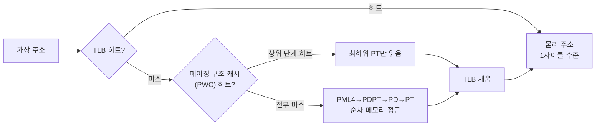

**TLB(Translation Lookaside Buffer) 미스 최적화**란 가상 주소를 물리 주소로 바꾸는 하드웨어 캐시인 TLB가 필요한 매핑을 갖고 있지 않아 발생하는 페이지 테이블 워크(page walk) 비용을 줄이는 작업을 말합니다. CPU가 메모리에 접근할 때마다 프로그램이 다루는 가상 주소는 실제 물리 주소로 변환되어야 하는데, 이 변환표(페이지 테이블)를 매번 메모리에서 읽는다면 접근 하나당 수 회의 추가 메모리 왕복이 필요해집니다. TLB는 이 변환 결과를 캐싱해 대부분의 접근을 한 사이클 수준으로 끝내지만, 작업집합이 TLB가 덮는 범위보다 커지거나 접근 패턴이 무작위에 가까우면 TLB 미스가 누적되고, 그때마다 하드웨어가 다단계 페이지 테이블을 순차적으로 걸어 내려가는 비용이 그대로 지연시간에 얹힙니다. 이 장에서는 TLB가 정확히 무엇을 캐싱하는지, huge page가 왜 이 문제를 구조적으로 완화하는지, 그리고 이 비용을 프로파일링으로 실제 확인하는 방법을 다룹니다.

## 이 장을 읽기 전에

**선행 지식**: [03장: 캐시 계층 구조](/post/cpu-optimization/cache-hierarchy-l1-l2-l3/)에서 다룬 "캐시 히트도 계층에 따라 지연시간이 다르다"는 감각과, [06장: Out-of-Order 실행과 성능](/post/cpu-optimization/out-of-order-execution-performance/)에서 다룬 "메모리 접근 지연이 파이프라인을 어떻게 흔드는가"를 전제로 합니다. 가상 메모리와 페이지(대개 4KB)라는 개념을 알고 있으면 충분하고, 페이지 테이블의 내부 구조를 몰라도 이 장을 따라올 수 있습니다.

**이 장의 깊이**: 이 장은 **심화**입니다. TLB의 계층 구조와 페이지 워크 메커니즘, huge page가 TLB 압력을 줄이는 원리, 그리고 perf 카운터·`/proc/vmstat`으로 TLB 미스와 THP 동작을 진단하는 절차까지 다룹니다. **다루지 않는 것**: 캐시 미스 자체의 지연시간과 원인 분류는 [03](/post/cpu-optimization/cache-hierarchy-l1-l2-l3/)·[04장](/post/cpu-optimization/cache-miss-analysis-hint-instructions/)에서, 하드웨어 카운터 수집의 일반 방법론은 [09장](/post/cpu-optimization/cpu-hardware-performance-counters/)·[Tr.01 8장](/post/profiling-analysis/hardware-performance-counters/)에서, 할당자·NUMA 배치 관점의 huge page 적용은 [Tr.04](/post/memory-optimization/getting-started-memory-allocation-data-layout-tuning/)에서 각각 다룹니다. 가상화 환경의 nested paging(EPT/NPT)이 TLB 미스 비용을 어떻게 배가시키는지도 이 장의 범위 밖입니다.

## 당신의 수준에 맞는 경로

| 수준 | 읽을 부분 | 핵심 목표 |
|------|---------|---------|
| **초보자** | "TLB의 등장 배경과 필요성" ~ "주소 변환과 페이지 워크" | TLB가 왜 필요하고 미스가 왜 비싼지 이해 |
| **중급자** | "TLB 계층 구조" ~ "Huge Page가 TLB 압력을 줄이는 원리" | huge page가 TLB 커버리지를 늘리는 구조적 이유 이해 |
| **전문가** | "TLB 미스 진단" ~ "비판적 시각" | perf/vmstat으로 TLB·THP 동작을 측정하고 도입 여부를 판단 |

---

## TLB의 등장 배경과 필요성 (역사·배경)

가상 메모리는 1960년대 후반부터 여러 시스템(맨체스터 Atlas, IBM System/370 등)에 도입되기 시작했지만, 프로그램이 참조하는 모든 가상 주소를 페이지 테이블을 통해 매번 메모리에서 변환한다면 가상 메모리의 유연성이 성능을 심각하게 갉아먹었습니다. 이 문제를 풀기 위해 "최근 사용한 주소 변환 결과를 작은 연관 메모리(associative memory)에 캐싱해 두자"는 아이디어가 나왔고, 이 캐시는 당시 맨체스터 Atlas 팀이 캐시를 부르던 표현인 "lookaside buffer"에서 이름을 따 **translation lookaside buffer**로 불리게 되었습니다. 1977년 출시된 DEC VAX-11/780은 이 개념을 상용 미니컴퓨터급에서 대중화한 초기 사례로 꼽히며, 당시 문헌에는 수십~백여 엔트리 규모의 연관(associative) translation buffer를 탑재했다고 기록되어 있습니다(정확한 엔트리 수·연관도는 문헌마다 차이가 있어 단정하지 않습니다).

TLB의 기본 발상은 이후 거의 바뀌지 않았지만, 구현 방식은 두 갈래로 갈렸습니다. x86과 대부분의 ARM 코어는 **하드웨어 관리 TLB(hardware-managed TLB)** 방식을 택해, TLB 미스가 나면 CPU 내부의 전용 회로(page miss handler, PMH)가 자동으로 페이지 테이블을 걸어 내려가 결과를 채웁니다. 반면 초기 MIPS·SPARC 같은 아키텍처는 **소프트웨어 관리 TLB(software-managed TLB)** 방식을 택해, TLB 미스가 발생하면 트랩을 걸어 OS의 예외 처리 루틴이 페이지 테이블을 직접 읽고 TLB를 채우도록 위임했습니다. 소프트웨어 관리 방식은 페이지 테이블 형식을 OS가 자유롭게 정의할 수 있다는 유연성이 있지만, 미스 하나마다 예외 진입·복귀 오버헤드가 그대로 얹히므로 미스가 잦은 워크로드에서는 하드웨어 관리 방식보다 불리한 경우가 많습니다. 오늘날 서버·클라이언트 주류인 x86-64와 대부분의 ARMv8 이후 코어는 하드웨어 관리 TLB를 쓰므로, 이 장의 논의도 그 전제를 따릅니다.

## 주소 변환과 페이지 워크: TLB가 캐싱하는 것

x86-64는 표준적으로 **4단계 페이지 테이블**을 사용합니다 — CR3 레지스터가 가리키는 최상위 테이블(PML4)부터 PDPT, PD, PT까지 4단계를 거쳐야 4KB 페이지 하나의 물리 주소를 얻을 수 있고, 각 단계는 그 자체로 메모리에 있는 별도의 테이블이므로 캐시에 없다면 각각이 별도의 메모리 접근입니다. 즉 TLB 미스 하나는 캐시 미스 하나와 같은 무게가 아니라, 최악의 경우 **캐시 미스가 4번 연쇄**될 수 있는 사건입니다. 매우 큰 메모리(2^48바이트, 256TB)를 다루는 서버·HPC 플랫폼을 위해 Intel은 **5-level paging(LA57)** 을 추가해 PML5 단계를 하나 더 두고 가상 주소 공간을 57비트(128PB)까지 확장했는데, 이는 페이지 워크가 5단계로 늘어날 수 있다는 뜻이기도 합니다 — 활성화 여부와 실제 사용은 커널·플랫폼 설정에 따른 구현 정의 사항입니다.

이 비용을 완화하기 위해 현대 CPU는 TLB 미스가 나도 곧바로 4단계를 전부 메모리에서 읽지 않습니다. PML4·PDPT·PD 같은 상위 테이블 항목은 **페이징 구조 캐시(paging-structure cache, 흔히 PWC라 부름)** 라는 별도의 작은 캐시에 저장되어, 최하위 PT 단계만 다시 읽으면 되는 경우가 많습니다. 그리고 페이지 워크 자체도 결국 메모리 접근이므로, 상위 테이블이 이미 L1/L2 데이터 캐시에 올라와 있다면 워크 전체가 캐시 히트만으로 끝나 수십 사이클 안에 마무리되기도 합니다. 반대로 워크 도중 어느 단계에서든 DRAM까지 내려가야 한다면 그 자체가 수백 사이클짜리 지연이 되고, 이 값은 [03장](/post/cpu-optimization/cache-hierarchy-l1-l2-l3/)에서 다룬 캐시 계층별 지연시간이 그대로 적용됩니다. 아래 다이어그램은 이 흐름을 정리한 것입니다.



## TLB 계층 구조: L1/L2와 세대별 변화

현대 x86 코어는 명령어용 iTLB와 데이터용 dTLB를 L1에 따로 두고, 그 아래 통합된 L2 TLB(Intel은 흔히 STLB, second-level TLB라 부름)를 공유합니다. L1 TLB는 페이지 크기별(4KB/2MB/1GB)로 엔트리가 나뉘는 경우가 많은데, 이는 큰 페이지일수록 물리적으로 더 넓은 태그 비교 회로가 필요해 완전히 통합하기보다 전용 슬롯을 두는 편이 회로 설계상 유리하기 때문입니다. L2 TLB는 보통 4KB 페이지를 중심으로 훨씬 많은 엔트리를 수용해, L1에서 놓친 변환을 L2에서라도 잡아 완전한 페이지 워크까지 가지 않도록 하는 안전망 역할을 합니다.

세대별 변화를 보면 이 계층이 왜 계속 커지는지 감을 잡을 수 있습니다. AMD Zen4는 Zen3 대비 L1 DTLB를 64-entry에서 72-entry로, L2 TLB를 2048-entry에서 3072-entry로 늘렸는데, Chips and Cheese의 분석에 따르면 이로써 Zen4의 L2 TLB는 추가 지연 없이 288KB(72×4KB)를, 7~8사이클의 약간의 페널티를 감수하면 12MB(3072×4KB) 상당의 주소 공간을 캐싱할 수 있게 되었습니다. Intel Lion Cove(2024)는 반대로 L1 dTLB의 4KB 로드 전용 슬롯을 Redwood Cove의 96-entry에서 128-entry로 늘렸지만 다른 TLB 크기는 그대로 두었고, L2 TLB 미스 시 추가 지연은 7사이클로 측정되었는데 이는 같은 세대의 AMD Zen5와 거의 같은 수치입니다. 다만 Chips and Cheese는 AMD 쪽이 L2 TLB에 더 많은 주소 변환을 캐싱할 수 있어 값비싼 전체 페이지 워크를 피할 확률 자체는 여전히 더 높다고 지적합니다. 이 수치들은 세대마다 계속 바뀌므로, 배포 대상 CPU의 정확한 TLB 크기는 `cpuid` 리프(0x2 또는 0x18)나 벤더 최적화 매뉴얼로 직접 확인하는 것이 안전합니다.

## Huge Page가 TLB 압력을 줄이는 원리

TLB 엔트리 하나가 4KB 페이지 하나만 가리킬 수 있다면, TLB가 실제로 "커버"하는 메모리 범위는 **엔트리 수 × 페이지 크기**로 정해집니다. 앞서 본 Zen4의 12MB급 L2 TLB 커버리지도 대용량 인메모리 데이터베이스나 캐시 서버의 작업집합(수십~수백 GB)에 비하면 미미한 수준이고, 작업집합이 이 범위를 넘어서는 순간부터 접근마다 TLB 미스가 날 확률이 급격히 올라갑니다. **huge page**(x86에서는 보통 2MB, 서버급에서는 1GB)를 쓰면 엔트리 하나가 512배(2MB/4KB) 또는 262144배(1GB/4KB) 넓은 범위를 가리키므로, 같은 엔트리 수로 덮을 수 있는 메모리 양이 그만큼 늘어나 TLB 미스율 자체가 구조적으로 줄어듭니다. 페이지 워크 단계도 최하위 PT 레벨을 아예 건너뛰므로(2MB 페이지는 PD 엔트리가 곧 최종 매핑), 미스가 나더라도 워크 자체가 한 단계 짧아진다는 부수 효과도 있습니다.

Linux에서 huge page를 확보하는 방법은 두 가지로 나뉩니다. **hugetlbfs**는 부팅 시 커널 커맨드라인의 `hugepages=N` 옵션이나 런타임에 `/proc/sys/vm/nr_hugepages`에 값을 써서 huge page 풀을 정적으로 예약하는 방식으로, hugetlbfs를 마운트해 파일로 다루거나 `mmap`에 `MAP_HUGETLB` 플래그를 줘서 접근합니다. 이 방식은 예약된 페이지가 항상 huge page임을 보장하지만, 애플리케이션이 명시적으로 요청해야 하고 미리 예약한 만큼 다른 용도로 쓸 메모리가 줄어듭니다. **THP(Transparent Huge Pages)**는 반대로 커널이 백그라운드에서(khugepaged 데몬을 통해) 인접한 4KB 페이지들을 자동으로 huge page로 병합해 애플리케이션 코드 수정 없이 혜택을 주려는 접근입니다. `/sys/kernel/mm/transparent_hugepage/enabled`를 `madvise`로 설정하면 애플리케이션이 `madvise(addr, len, MADV_HUGEPAGE)`를 호출한 영역에서만 THP가 시도되고, `always`로 설정하면 시스템 전역에서 THP 할당을 우선 시도합니다.

아래는 hugetlbfs와 일반 4KB 페이지를 각각 매핑해 무작위 포인터 체이싱으로 접근 지연을 비교하는 최소 벤치마크입니다. 포인터 체이싱을 쓰는 이유는 순차 접근이면 하드웨어 프리페처가 TLB 미스 비용 상당 부분을 미리 가려 버리기 때문입니다.

```cpp
#include <sys/mman.h>
#include <chrono>
#include <cstdio>
#include <cstdint>
#include <vector>
#include <random>
#include <algorithm>

constexpr size_t kBufBytes = 1ull << 30;  // 1GiB: 일반 TLB 커버리지를 확실히 넘김
constexpr size_t kStride = 4096;          // 페이지 하나당 한 번만 접근

// 각 페이지 시작 지점에 "다음에 방문할 페이지 오프셋"을 심어 포인터 체인을 만든다.
// 무작위 순서로 체인을 구성해야 순차 프리페처가 무력화된다.
static uint64_t walk_chain(char* buf, size_t bytes) {
  size_t steps = bytes / kStride;
  std::vector<uint64_t> order(steps);
  for (size_t i = 0; i < steps; ++i) order[i] = i;
  std::shuffle(order.begin(), order.end(), std::mt19937_64(42));
  for (size_t i = 0; i < steps; ++i) {
    uint64_t next = order[(i + 1) % steps] * kStride;
    *reinterpret_cast<uint64_t*>(buf + order[i] * kStride) = next;
  }
  uint64_t cursor = 0;
  auto t0 = std::chrono::steady_clock::now();
  for (size_t i = 0; i < steps; ++i) cursor = *reinterpret_cast<uint64_t*>(buf + cursor);
  auto t1 = std::chrono::steady_clock::now();
  printf("checksum=%llu\n", (unsigned long long)cursor);  // 최적화 제거 방지용 관찰
  return std::chrono::duration_cast<std::chrono::nanoseconds>(t1 - t0).count() / steps;
}

int main(int argc, char** argv) {
  bool use_huge = argc > 1;
  int flags = MAP_PRIVATE | MAP_ANONYMOUS | (use_huge ? MAP_HUGETLB : 0);
  char* buf = static_cast<char*>(mmap(nullptr, kBufBytes, PROT_READ | PROT_WRITE, flags, -1, 0));
  if (buf == MAP_FAILED) { perror("mmap"); return 1; }
  uint64_t ns = walk_chain(buf, kBufBytes);
  printf("%s: %llu ns/access\n", use_huge ? "huge(2MB)" : "regular(4KB)", (unsigned long long)ns);
  munmap(buf, kBufBytes);
}
```

빌드는 `g++ -O2 -std=c++17 tlb_walk.cpp -o tlb_walk` (Linux x86-64 기준)이고, huge page 실행 전에는 반드시 풀을 예약해야 합니다(1GiB를 2MB 페이지로 덮으려면 `sudo sysctl -w vm.nr_hugepages=512`). `./tlb_walk`(일반)와 `./tlb_walk 1`(huge)을 각각 여러 번 실행해 `ns/access`를 비교하면 됩니다. 정확한 배율은 CPU 세대·메모리 대역폭·동시 실행 중인 다른 프로세스의 TLB 압력에 따라 달라지므로, 이 코드가 주는 것은 "측정 방법"이지 특정 배율에 대한 보장이 아닙니다 — 반드시 대상 플랫폼에서 직접 재현해 확인해야 합니다.

## 흔한 오개념 바로잡기

**"huge page는 켜 두면 항상 이득이다"**는 위험한 단순화입니다. THP를 `always` 모드로 설정하면 커널 공식 문서가 명시하듯 huge page 할당에 실패했을 때 애플리케이션이 직접 회수(reclaim)와 메모리 압축(compaction)을 거쳐서라도 huge page를 즉시 확보하려고 멈춰 서게 되며, 이 압축 과정 자체가 수 ms 단위의 지연 스파이크를 만들 수 있습니다. 실제로 Redis·MongoDB 등 지연시간에 민감한 소프트웨어들이 배포 가이드에서 THP를 `madvise` 또는 `never`로 낮추도록 권고해 온 이력은, "자동으로 켜지는 최적화"가 p99 관점에서는 오히려 위험 요소가 될 수 있음을 보여 줍니다.

**"TLB 미스는 캐시 미스 하나와 비슷한 비용이다"**도 틀린 직관입니다. TLB 미스는 그 자체로 페이지 테이블을 걸어 내려가는 여러 번의 순차적 메모리 접근을 유발하며, 이 각각의 접근이 다시 캐시 미스일 수 있습니다. 즉 TLB 미스 하나의 실제 비용은 페이징 구조 캐시(PWC) 히트 여부에 따라 크게 달라지는 **조건부 비용**이며, 최악의 경우 데이터 캐시 미스 하나보다 몇 배 더 비쌀 수 있습니다.

**"THP를 켜면 huge page가 실제로 쓰이는지 신경 쓸 필요가 없다"**도 오개념입니다. THP는 어디까지나 휴리스틱이라, 메모리 단편화가 심하면 khugepaged가 huge page 병합에 계속 실패하면서도 애플리케이션에는 아무 오류도 보이지 않습니다. `/proc/vmstat`의 `thp_fault_fallback`·`thp_collapse_alloc_failed` 값이 계속 늘어나는데도 huge page가 쓰이는 줄 알고 방치하면, 기대한 TLB 압력 완화 효과가 조용히 사라진 상태로 운영하게 됩니다.

## TLB 미스 진단: 프로파일링으로 확인하기

TLB 미스를 코드 수정 전에 먼저 확인해야 하는 이유는 단순합니다 — 캐시 미스·분기 예측 실패·포트 경합이 뒤섞인 상황에서 TLB가 실제 병목인지 모른 채 huge page부터 도입하면, 별 효과 없이 배포 복잡도(정적 예약 관리, THP 파라미터 튜닝)만 늘어날 수 있습니다. Linux에서는 `perf stat`으로 dTLB/iTLB 관련 하드웨어 이벤트를 직접 셀 수 있습니다. 아래는 출력 **형식**을 보여주기 위한 예시이며, 실제 절대 수치·비율은 CPU 세대와 워크로드에 따라 크게 달라지므로 대상 시스템에서 직접 실행해 확인해야 합니다.

```text
$ perf stat -e dTLB-loads,dTLB-load-misses,iTLB-loads,iTLB-load-misses,page-faults -- ./tlb_walk

 Performance counter stats for './tlb_walk':

       842,193,441      dTLB-loads
        41,208,732      dTLB-load-misses          #    4.89% of all dTLB cache accesses
        12,847,205      iTLB-loads
           184,332      iTLB-load-misses          #    1.44% of all iTLB cache accesses
               612      page-faults

       3.812394512 seconds time elapsed
```

`dTLB-load-misses`의 절대 횟수보다 **`dTLB-loads` 대비 비율**을 보는 것이 중요합니다. 같은 미스 횟수라도 전체 로드가 적은 워크로드에서는 비율이 훨씬 크게 나타나 병목일 가능성이 높다는 신호가 되기 때문입니다. Intel CPU에서는 여기서 한 단계 더 들어가 `DTLB_LOAD_MISSES.WALK_DURATION`이나 `DTLB_LOAD_MISSES.WALK_COMPLETED_4K/2M/1G` 같은 uarch 전용 이벤트로 실제 몇 사이클이 페이지 워크에 쓰였는지, 그리고 어떤 페이지 크기의 워크가 완료됐는지까지 구분할 수 있습니다(정확한 이벤트 이름은 세대마다 다르므로 `perf list | grep -i tlb`로 대상 CPU에서 지원하는 이벤트를 먼저 확인해야 합니다).

THP가 실제로 huge page를 만들어 내고 있는지는 `/proc/vmstat`으로 별도 확인해야 합니다. `thp_fault_alloc`(요청 시점에 성공적으로 확보한 huge page 수)과 `thp_fault_fallback`(huge page 확보에 실패해 일반 페이지로 대체된 횟수)을 나란히 보면 THP가 "켜져만 있고 실질적으로 동작하지 않는" 상태인지 판단할 수 있고, `thp_collapse_alloc`·`thp_collapse_alloc_failed`는 khugepaged가 이미 매핑된 4KB 페이지들을 병합하려다 성공·실패한 횟수를 보여 줍니다. 이 카운터들이 페이지 워크 지연 자체를 알려주지는 않지만, "huge page 도입 효과가 왜 예상보다 작은가"를 진단할 때 `perf stat`의 TLB 미스율과 함께 봐야 하는 짝입니다.

## 판단 기준

| 상황 | 권장 | 비권장 |
|------|------|--------|
| 작업집합이 크고(수십 GB↑) `dTLB-load-misses` 비율이 눈에 띄게 높을 때 | hugetlbfs 정적 예약 또는 THP `madvise` + 해당 영역만 `MADV_HUGEPAGE` | 원인 확인 없이 전역 THP `always`부터 켜기 |
| 지연시간 민감 서비스(p99 SLA 있음)에서 huge page를 도입할 때 | THP `madvise`로 범위를 좁히고 `thp_fault_fallback` 추이를 모니터링 | THP `always`로 전역 적용 후 방치 |
| 작은 작업집합(수 MB 이하)이거나 TLB 미스율이 이미 낮을 때 | 다른 병목(캐시·분기·포트 경합)부터 확인 | 효과 검증 없이 huge page부터 도입 |
| 배포 환경이 컨테이너·클라우드 인스턴스라 메모리 단편화 이력을 모를 때 | `/proc/vmstat`의 `thp_fault_fallback`으로 실제 huge page 확보 성공률 확인 | THP가 "켜져 있으니 되겠지"라고 가정 |
| 정적 예약(hugetlbfs)이 가능한 배치성·장기 실행 서버 워크로드 | 부팅 시 `nr_hugepages` 예약 + `MAP_HUGETLB` | 런타임 단편화에 노출되는 THP 동적 병합에 의존 |

## 비판적 시각: 한계와 트레이드오프

huge page는 공짜 점심이 아닙니다. hugetlbfs 정적 예약은 시스템 전체 메모리 계획에 huge page 풀을 미리 박아 넣어야 해서 유연성이 떨어지고, 예약한 만큼 다른 용도로 쓸 일반 메모리가 줄어듭니다. THP는 그 유연성 문제를 풀지만 대가로 khugepaged의 백그라운드 스캔·병합 비용과, `always` 모드에서 직접 회수·압축까지 거치는 할당 경로의 지연 스파이크 위험을 떠안습니다. 두 방식 모두 "메모리를 2MB/1GB 단위로만 다룬다"는 제약 때문에 실제 필요한 양보다 더 많은 메모리를 커밋하게 되는 내부 단편화(internal fragmentation)도 피할 수 없는 대가입니다. 또한 이 장에서 다룬 페이지 워크·TLB 크기 수치는 특정 세대(Zen4, Lion Cove)의 공개된 예시일 뿐이며, 벤더·세대마다 계속 바뀌므로 이 장의 숫자를 근거로 삼기보다는 대상 플랫폼에서 직접 측정한 값을 기준으로 판단해야 합니다. 가상화 환경에서는 게스트의 페이지 워크가 EPT/NPT로 인해 중첩되어 최악의 경우 페이지 워크 단계 수가 곱절로 늘어날 수 있다는 점도, 클라우드 배포를 고려한다면 별도로 확인해야 할 변수입니다. huge page로 TLB 미스율을 낮췄는데도 p99 지연이 그대로라면, 병목이 애초에 TLB가 아니었거나 huge page 확보 실패(THP fallback)가 조용히 일어나고 있을 가능성을 먼저 의심해야 합니다.

## 마무리

이 장을 읽은 뒤 다음을 스스로 점검해 보세요.

- [ ] TLB 미스가 왜 캐시 미스 하나보다 비쌀 수 있는지, 페이지 워크·페이징 구조 캐시(PWC) 관점에서 설명할 수 있다.
- [ ] hardware-managed TLB와 software-managed TLB의 차이, 그리고 x86-64가 어느 쪽인지 안다.
- [ ] huge page(2MB/1GB)가 TLB 커버리지를 늘리는 계산(엔트리 수 × 페이지 크기)을 직접 할 수 있다.
- [ ] hugetlbfs 정적 예약과 THP(`madvise`/`always`)의 차이와 각각의 위험을 설명할 수 있다.
- [ ] `perf stat`의 dTLB/iTLB 미스율과 `/proc/vmstat`의 THP 카운터를 함께 읽고 huge page 도입 효과를 검증할 수 있다.
- [ ] "지표(TLB 미스율)는 좋아졌는데 p99는 그대로"인 경우를 의심하고 재확인하는 절차를 안다.

**이전 장**: [Out-of-Order 실행과 성능](/post/cpu-optimization/out-of-order-execution-performance/) (챕터 06)

다음 장에서는 지금까지 다룬 파이프라인·분기·캐시·ILP·OoO·TLB 개별 지식을 Intel/AMD/ARM 최신 세대(Clearwater Forest, Diamond Rapids, Zen6, Nova Lake) 아키텍처 비교라는 하나의 관점으로 묶어, 벤더·세대마다 이 장에서 다룬 TLB 계층 수치가 왜 계속 달라지는지를 더 큰 그림에서 정리합니다.

→ [현대 CPU 아키텍처 비교](/post/cpu-optimization/modern-cpu-architecture-comparison/) (챕터 08)

### 참고 자료

- [Linux kernel: Transparent Hugepage Support](https://docs.kernel.org/admin-guide/mm/transhuge.html) — THP의 enabled 모드(always/madvise/never)와 `/proc/vmstat` 모니터링 카운터를 다루는 커널 공식 문서
- [Linux kernel: HugeTLB Pages](https://www.kernel.org/doc/html/latest/admin-guide/mm/hugetlbpage.html) — hugetlbfs 정적 예약(`nr_hugepages`)과 `MAP_HUGETLB` 사용법을 다루는 커널 공식 문서
- [madvise(2) man page](https://man7.org/linux/man-pages/man2/madvise.2.html) — `MADV_HUGEPAGE`를 포함한 `madvise` 시스템 콜 전체 옵션을 다루는 Linux man 페이지
- [Chips and Cheese: Lion Cove, Intel's P-Core Roars](https://chipsandcheese.com/p/lion-cove-intels-p-core-roars) — Lion Cove의 L1 dTLB 확장과 L2 TLB 페널티를 Zen5와 비교 분석한 자료
- [Chips and Cheese: AMD's Zen 4, Part 2](https://chipsandcheese.com/p/amds-zen-4-part-2-memory-subsystem-and-conclusion) — Zen4의 L1 DTLB·L2 TLB 확장과 커버리지 계산을 다룬 자료
