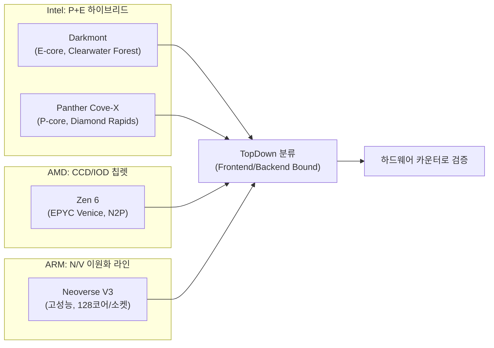

**현대 CPU 아키텍처 비교**란 Intel·AMD·ARM이 같은 시기에 서로 다른 설계 철학(하이브리드 P/E 코어, 칩렛, 서버/모바일 이원화 코어)으로 수렴하거나 갈라지는 지점을 정리해, 특정 워크로드에 어떤 세대·계열이 유리한지 판단하는 것을 말합니다. 프로파일러가 "이 함수가 느리다"를 알려줘도, 그 원인이 코어의 프런트엔드 폭 때문인지 캐시 계층 때문인지 벤더별로 답이 달라질 수 있고, 2025–2026년 사이 Intel 18A 세대(Clearwater Forest, Panther Cove)와 AMD Zen 6(EPYC Venice), ARM Neoverse V3 세대가 거의 동시에 등장하면서 이 격차는 더 벌어졌습니다. 이 장은 개별 메커니즘(파이프라인·캐시·분기 예측)을 다시 설명하지 않고, 그 메커니즘들이 벤더·세대별로 어떤 조합으로 나타나는지, 그리고 그 조합이 왜 벤치마크 숫자만으로는 판단하기 어려운지를 다룹니다.

## 이 장을 읽기 전에

이 장은 [01장: CPU 파이프라인 기초](/post/cpu-optimization/cpu-pipeline-fundamentals/), [03장: 캐시 계층 구조](/post/cpu-optimization/cache-hierarchy-l1-l2-l3/), [06장: Out-of-Order 실행과 성능](/post/cpu-optimization/out-of-order-execution-performance/)에서 다룬 파이프라인 단계·캐시 레벨·비순차 실행의 기본 개념을 전제로 합니다. 그 메커니즘들이 무엇인지 모른다면 이 장의 비교표가 추상적으로 느껴질 수 있으니 먼저 해당 장을 읽는 것을 권합니다. **이 장의 깊이**는 **중급**이며, 각 벤더의 최신 세대가 "무엇을 다르게 하는지"를 구조적으로 비교하는 데 집중합니다. **다루지 않는 것**: SMT/Hyper-Threading의 내부 동작(→ [14장](/post/cpu-optimization/smt-hyperthreading-performance/)), μOp 캐시·DSB의 세부 구조(→ [15장](/post/cpu-optimization/uop-cache-decoded-stream-buffer/)), Apple Silicon M시리즈의 통합 메모리·P/E 코어 심화(→ [13장](/post/cpu-optimization/apple-silicon-m-series-architecture/)), RISC-V ISA 자체(→ [16장](/post/cpu-optimization/risc-v-architecture-performance-fundamentals/)), 하드웨어 카운터로 실제 병목을 측정하는 방법(→ [09장](/post/cpu-optimization/cpu-hardware-performance-counters/))입니다. 이 장은 그 챕터들을 읽기 전에 "지금 어떤 CPU 세대들이 있고 왜 서로 다른가"라는 지도를 그리는 역할을 합니다.

## 당신의 수준에 맞는 경로

| 수준 | 읽을 부분 | 핵심 목표 |
|------|---------|---------|
| **초보자** | "왜 지금 아키텍처 비교가 다시 중요해졌나" ~ "세 가지 설계 철학" | 하이브리드 코어·칩렛·N/V 이원화라는 세 가지 큰 그림 이해 |
| **중급자** | "ISA 확장 경쟁" ~ "흔한 오개념" | AVX10.2/APX·SVE2 등 최신 ISA 확장이 실제로 뭘 바꾸는지, 흔한 착각 교정 |
| **전문가** | "판단 기준" ~ "비판적 시각" | 워크로드별 벤더 선택 기준과 벤더 벤치마크를 읽는 법 |

---

## 왜 지금 아키텍처 비교가 다시 중요해졌나

2010년대 중반까지 x86 서버 CPU는 "코어를 늘리고 클록을 올리는" 단일 궤적을 따랐습니다. 이 궤적이 흔들린 첫 계기는 Intel의 14nm 공정이 예상보다 오래 유지되면서 tick-tock 리듬이 깨진 것이었고, 그 사이 AMD는 2019년 Zen 2부터 CCD(Core Complex Die)와 IOD(I/O Die)를 분리하는 칩렛 설계로 전환해 공정 미스매치를 우회했습니다. 두 번째 계기는 코어 자체의 분화였습니다. Intel은 2021년 Alder Lake부터 성능 코어(P-core)와 효율 코어(E-core)를 한 다이에 섞는 하이브리드 설계를 데스크톱에 들여왔고, 서버 라인에서도 Sierra Forest 같은 E-core 전용 제품을 별도로 두기 시작했습니다. 세 번째 계기는 ARM 서버 생태계의 성숙으로, AWS Graviton과 NVIDIA Grace 같은 커스텀 실리콘이 ARM Neoverse V-시리즈를 채택하면서 "ARM은 모바일용" 이라는 가정이 서버 시장에서도 깨졌습니다. 2026년 현재는 이 세 흐름이 동시에 새 세대로 갱신되는 시점입니다 — Intel 18A 공정의 Clearwater Forest(Xeon 6+)와 차기 Panther Cove 계열, AMD의 2nm(TSMC N2P) Zen 6, ARM Neoverse V3 기반 커스텀 실리콘이 거의 같은 시기에 로드맵에 오르면서, "어떤 벤더가 어떤 워크로드에 맞는가"라는 질문이 다시 실무적으로 중요해졌습니다.

## 세 가지 설계 철학: 하이브리드 코어, 칩렛, N/V 이원화

세 벤더는 "트랜지스터 예산을 어디에 쓸 것인가"라는 같은 문제에 서로 다른 답을 내놓고 있습니다. Intel은 코어 종류를 나눠(P/E) 워크로드에 맞는 코어에 배정하는 쪽을, AMD는 코어 설계는 하나로 통일하되 다이를 쪼개 수율과 공정 조합을 최적화하는 쪽을, ARM은 아예 다른 두 계열(N-시리즈, V-시리즈)을 만들어 라이선스 고객이 목적에 맞는 코어를 골라 쓰게 하는 쪽을 택했습니다. 아래 다이어그램은 이 세 철학이 결국 같은 TopDown 분류(Frontend/Backend Bound) 위에서 측정된다는 점을 보여줍니다 — 설계는 다르지만 병목을 해석하는 언어는 공유합니다.



이 분류 언어 자체는 [17장: Frontend vs Backend Bound 개념](/post/cpu-optimization/frontend-backend-bound-topdown-basics/)에서 다루고, 실제 카운터로 측정하는 방법은 [09장](/post/cpu-optimization/cpu-hardware-performance-counters/)에서 이어집니다.

### Intel: P/E 하이브리드와 18A 세대

Intel의 2026년 서버 로드맵은 두 갈래로 나뉩니다. 하나는 E-core 전용 라인으로, Xeon 6+ "Clearwater Forest"가 Intel 18A 공정의 컴퓨트 타일에 **Darkmont** E-core를 태워 소켓당 최대 288코어까지 구성합니다. Darkmont는 이전 세대 Crestmont 대비 디코드 클러스터를 3배(9-wide, 3x3 구성)로 넓히고, μop 큐를 64엔트리에서 96엔트리로 늘렸으며, 4코어 클러스터당 4MB 통합 L2와 클러스터당 8MB LLC(소켓 전체 576MB)를 갖춰 이전 세대보다 약 17%의 IPC 향상을 보고했습니다([Chips and Cheese, Hot Chips 2025](https://chipsandcheese.com/p/intels-clearwater-forest-e-core-server); [wccftech, 2025](https://wccftech.com/intel-clearwater-forest-xeon-6-cpus-up-to-288-darkmont-cores-576-mb-cache-18a/)). 이 수치는 2026년 정식 출시 전 Hot Chips 발표 자료 기준이며, 실제 출하 제품에서는 조정될 수 있습니다. Intel은 288코어 Xeon 6990E+를 AMD의 192코어 EPYC 9965와 비교해 평균 스레드당 성능 30%, 전력 효율 30% 우위를 주장하고 있는데([Intel Newsroom, 2025](https://newsroom.intel.com/data-center/postcard-from-intel-tech-tour-arizona-intel-data-center-group-leader-kevork-kechichian-shows-off-xeon-6)), 이는 벤더 자체 벤치마크이므로 뒤의 "비판적 시각"에서 다시 짚습니다. 다른 한 갈래는 P-core 전용 라인으로, 차기 **Panther Cove-X** 코어를 얹은 Diamond Rapids가 PCIe 6.0과 Granite Rapids 대비 2배 메모리 대역폭을 목표로 하지만, 발표 시점 기준 SMT와 E-core를 갖추지 않은 첫 세대로 설계되었고 출시도 2026년에서 2027년으로 밀린 상태입니다 — SMT 재도입은 후속 세대(코드명 Coral Rapids)로 예정되어 있습니다. 소비자용으로는 **Coyote Cove** P-core와 **Arctic Wolf** E-core를 조합한 Nova Lake가 2026년 하반기 출시를 목표로 하며, ISA 확장은 뒤에서 별도로 다룹니다.

### AMD: CCD/IOD 칩렛과 Zen 6

AMD는 Zen 2 이후 이어온 칩렛 전략을 유지하면서 공정만 세대마다 갱신하는 방식을 택했습니다. Zen 6는 CCD(연산 다이)를 TSMC N2P(2nm급)로, IOD(I/O 다이)를 N3C로 제작해 두 다이를 각각 최적 공정에 배치하며, CCD당 최대 12코어 구성으로 서버 EPYC "Venice"가 소켓당 코어 수를 크게 늘릴 것으로 알려져 있습니다. AMD는 2026년 5월 공식 발표에서 Venice가 TSMC 2nm 공정에서 양산을 시작한 첫 HPC 제품이라고 밝혔고, 데이터센터용 EPYC Venice는 2026년 하반기(Advancing AI 행사 시점) 출시를, 데스크톱·모바일 Zen 6 제품은 2027년 이후를 목표로 하고 있습니다([Wikipedia: Zen 6](https://en.wikipedia.org/wiki/Zen_6)). Panther Cove-X와 마찬가지로 Zen 6의 정확한 프런트엔드 폭이나 디코더 세부 구성은 이 글 작성 시점에 공식 문서로 확정 공개되지 않았으므로, 벤더가 수치를 공개하기 전까지는 "구현 정의"로 남겨두고 IPC·전력 주장은 출시 후 독립 리뷰로 재확인하는 것이 안전합니다. AMD의 칩렛 전략이 Intel의 P/E 하이브리드와 다른 점은, 코어 자체의 종류를 나누지 않고 "얼마나 많은 CCD를 붙이는가"로 스케일을 조절한다는 것입니다 — 이는 스케줄러가 이종 코어를 구분할 필요가 없다는 장점과, 모든 코어가 같은 실리콘 예산(전력·다이 면적)을 요구한다는 제약을 동시에 만듭니다.

### ARM: 서버 N/V 이원화와 소비자 빅.리틀

ARM은 Intel·AMD와 달리 코어 설계 자체를 라이선스로 판매하기 때문에, "설계 철학"이 곧 "제품 계열 구분"으로 나타납니다. 서버용 Neoverse는 범용 데이터센터를 겨냥한 N-시리즈와, 고성능 컴퓨팅을 겨냥한 V-시리즈로 나뉩니다. 최신 V-시리즈인 Neoverse V3는 소켓당 최대 128코어, SVE2·BFloat16·INT8 MatMul 지원, 12채널 DDR5/LPDDR5와 HBM 메모리 컨트롤러, PCIe Gen5 64레인·CXL 지원을 갖추고 있으며, 이전 세대 Neoverse V2 대비 일반 연산에서 최대 13% 높은 IPC를 보고합니다. NVIDIA Grace, AWS Graviton4, Google Axion 같은 커스텀 실리콘이 V2/V3 계열을 기반으로 하고 있어([Wikipedia: ARM Neoverse](https://en.wikipedia.org/wiki/ARM_Neoverse)), ARM 서버 생태계는 이제 "실험적 대안"이 아니라 하이퍼스케일러의 표준 옵션 중 하나로 자리잡았습니다. 반면 Apple Silicon M시리즈처럼 소비자·워크스테이션용 ARM 구현은 성능 코어와 효율 코어를 통합 메모리 아키텍처 위에서 조합하는 전혀 다른 트레이드오프를 가지는데, 그 세부 내용은 [13장](/post/cpu-optimization/apple-silicon-m-series-architecture/)에서 다룹니다. 여기서 기억할 요점은, "ARM"이라는 이름 아래에도 서버(N/V)와 모바일/데스크톱(빅.리틀 계열) 설계가 서로 다른 목표함수를 최적화한다는 것입니다.

## ISA 확장 경쟁: AVX10.2/APX 대 SVE2 대 AVX-512

명령어 집합 확장은 코어 마이크로아키텍처만큼이나 세대 간 성능 차이를 만듭니다. Intel은 Nova Lake부터 **AVX10.2**와 <strong>APX(Advanced Performance Extensions)</strong>를 데스크톱·모바일에 처음 들여오는데, AVX10.2는 P-core(Coyote Cove)와 E-core(Arctic Wolf) 양쪽에서 동일한 512비트 벡터 폭을 지원하도록 통일해 이전 세대처럼 "E-core에서는 AVX-512가 꺼진다" 는 비일관성을 없애는 방향입니다. APX는 범용 레지스터 수를 늘리고 3-operand 형태의 새 인코딩을 추가해 레지스터 압박(register pressure)을 줄이고 명령어당 처리량을 높이는 것을 목표로 하며, Intel은 Nova Lake를 이 두 확장을 지원하는 첫 소비자 플랫폼으로 공식화했습니다([Wikipedia: Nova Lake](https://en.wikipedia.org/wiki/Nova_Lake_%28microprocessor%29)). AMD는 Zen 4/5부터 이미 512비트 AVX-512를 지원해 왔고 Zen 6에서도 이어갈 것으로 예상되지만, 공식 세부 스펙은 아직 확정 공개되지 않았습니다. ARM 진영은 SVE2(Scalable Vector Extension 2)로 응답하는데, x86의 AVX 계열이 고정 폭(128/256/512비트) 명령어를 따로 인코딩하는 것과 달리 SVE는 벡터 길이를 하드웨어 구현에 위임하는 "길이 비종속(length-agnostic)" 설계라 같은 바이너리가 다른 벡터 폭의 코어에서도 재컴파일 없이 동작하도록 의도되었습니다. 실무 관점에서 중요한 것은 ISA 확장 자체가 아니라, 컴파일러가 그 확장을 활용하도록 코드를 생성하는지입니다 — 벡터화 여부와 `-march`/`-mavx512f`류 컴파일러 플래그의 관계는 [Tr.03: 컴파일러·빌드 최적화](/post/compiler-optimization/getting-started-compiler-build-performance-tuning/)에서 더 깊이 다룹니다.

실제 배포 환경에서 어떤 ISA 확장이 켜져 있는지 확인하는 것은 벤더 발표 자료를 읽는 것보다 신뢰도가 높습니다. 아래는 Linux에서 현재 코어가 지원하는 플래그를 직접 확인하는 방법입니다.

```bash
# /proc/cpuinfo의 flags 필드에서 avx512, avx10, apx 관련 플래그를 확인
grep -m1 flags /proc/cpuinfo | tr ' ' '\n' | grep -iE 'avx512|avx10|apx_f'

# lscpu는 벤더·모델·플래그를 요약해서 보여줌(util-linux 2.38+ 기준)
lscpu | grep -iE 'Model name|Flags' 
```

이 명령은 실행 중인 커널·CPU가 실제로 노출하는 플래그만 보여주므로, 벤더가 "지원 예정"이라고 발표한 확장이 아직 실리콘에 없거나 BIOS/마이크로코드로 꺼져 있는 경우를 걸러낼 수 있습니다. 다만 커널 버전에 따라 신규 플래그(`avx10`, `apx_f` 등) 이름이 아직 반영되지 않았을 수 있으므로, 플래그가 안 보인다고 곧바로 "미지원"이라 단정하지 말고 커널·마이크로코드 버전을 함께 확인해야 합니다.

## 흔한 오개념

<strong>"코어 수가 많을수록 무조건 빠르다"</strong>는 처리량(throughput) 워크로드에서나 성립하는 이야기입니다. Clearwater Forest의 288 E-core는 스레드당 성능이 아니라 코어당 전력·면적 효율을 최적화한 설계이므로, 단일 요청의 꼬리 지연(p99 latency)이 중요한 워크로드에서는 오히려 P-core 중심 제품(Panther Cove-X, Zen 6의 고클록 SKU)이 유리할 수 있습니다. 코어 수와 지연시간의 관계는 [11장: CPU 주파수 스케일링과 성능](/post/cpu-optimization/cpu-frequency-scaling-performance/)에서 다루는 클록·전력 곡선과 함께 봐야 의미가 생깁니다.

<strong>"ARM은 항상 저전력, x86은 항상 고성능"</strong>이라는 이분법도 더 이상 정확하지 않습니다. Neoverse V3는 고성능 컴퓨팅을 정면으로 겨냥한 설계이고, 반대로 Intel의 E-core 라인(Darkmont)은 전력·밀도를 최우선 목표로 설계되었습니다. 두 축(성능 대 효율)은 이제 벤더가 아니라 제품 계열(N 대 V, P 대 E) 단위로 갈립니다.

<strong>"신규 ISA 확장을 지원하면 자동으로 빨라진다"</strong>도 틀린 가정입니다. AVX10.2·SVE2 같은 확장은 컴파일러가 해당 명령을 생성하고, 코드가 실제로 벡터화 가능한 형태여야 이득을 봅니다. 게다가 넓은 벡터 명령을 쓰면 일부 코어에서 클록이 일시적으로 낮아지는 현상(AVX-512 다운클로킹과 유사한 패턴)이 세대에 따라 여전히 남아 있을 수 있으므로, 벡터 폭을 넓히는 선택이 항상 순이득인지는 해당 세대에서 직접 측정해야 합니다.

## 판단 기준

| 워크로드 특성 | 유리한 경향 | 근거 |
|------|------|------|
| 단일 요청 꼬리 지연(p99)이 SLA인 경우 | P-core/V-시리즈 중심 제품(고클록, 넓은 프런트엔드) | 코어당 IPC·클록이 지연시간을 직접 좌우 |
| 초당 요청 수(throughput), 컨테이너 밀도 우선 | E-core 전용/코어 수 극대화 제품(Clearwater Forest류) | 코어당 전력·면적 효율이 총처리량을 좌우 |
| 벡터·AI 커널이 핫패스인 경우 | 최신 ISA 확장(AVX10.2, SVE2, 최신 AVX-512) 지원 세대 | 벡터 폭·명령 확장이 커널 처리량에 직접 반영 |
| 레거시 SMT 의존 소프트웨어 | 초기 Panther Cove-X 세대는 피하고 Zen 6 또는 이전 Xeon 세대 검토 | 첫 세대 Panther Cove-X는 SMT 미지원으로 발표됨 |
| 멀티벤더 이식성이 중요한 경우 | 표준 확장(AVX2, SVE2 기본 프로파일) 중심 설계 | 벤더 전용 확장 의존은 이식성을 낮춤 |

## 비판적 시각: 벤더 벤치마크와 로드맵의 함정

벤더가 공개하는 "30% 빠르다" 류의 숫자는 대개 특정 SKU·특정 워크로드·특정 컴파일러 플래그 조합에서 나온 결과이며, 비교 대상 제품도 벤더가 고른 것입니다. Intel이 Xeon 6990E+를 AMD EPYC 9965와 비교한 수치나, AMD가 자사 발표에서 강조하는 수치 모두 같은 함정을 공유합니다 — 발표 시점의 우호적인 벤치마크 스위트를 근거로 하므로, 실제 프로덕션 워크로드에서는 독립 리뷰와 자체 재현이 필요합니다. 로드맵 자체도 불확실성을 안고 있습니다. Diamond Rapids는 애초 2026년으로 거론되다 2027년으로 밀렸고, Panther Cove-X의 SMT 제외는 설계 결정이라기보다 첫 세대의 제약으로 보이며 후속 세대(Coral Rapids)에서 뒤집힐 예정이라는 점도 로드맵이 도중에 바뀔 수 있음을 보여줍니다. ARM 진영도 라이선스 기반이라 실제 실리콘 성능은 커스텀 실리콘 제작사(AWS, Google, NVIDIA)의 구현 품질에 좌우되므로, "Neoverse V3"라는 이름만으로 특정 클라우드 인스턴스의 실제 성능을 예단할 수 없습니다. 마지막으로, 이 장에서 인용한 코어 수·캐시 용량·대역폭 수치 다수는 2026년 상반기 발표 시점의 공개 자료를 기반으로 하며, 정식 출시 이후 스테핑·마이크로코드 업데이트로 조정될 수 있다는 점을 감안해야 합니다.

## 마무리

- Intel(P/E 하이브리드), AMD(CCD/IOD 칩렛), ARM(N/V 이원화)이 같은 문제에 다른 방식으로 답한다는 것을 설명할 수 있다.
- Clearwater Forest(Darkmont E-core, 288코어)와 Diamond Rapids(Panther Cove-X, SMT 미지원 첫 세대)의 차이가 "코어 수 대 스레드당 성능" 트레이드오프에서 나온다는 것을 안다.
- AVX10.2/APX, SVE2 같은 ISA 확장이 컴파일러·코드 형태와 함께 작동해야 이득이 생긴다는 것을 설명할 수 있다.
- 벤더 벤치마크 수치를 볼 때 SKU·워크로드·비교 대상 선택 편향을 의심하는 습관을 갖는다.
- 워크로드 특성(꼬리 지연 대 처리량, 벡터 의존도, 이식성 요구)에 따라 벤더·제품 계열을 선택하는 기준을 적용할 수 있다.

**이전 장**: [TLB 미스 최적화](/post/cpu-optimization/tlb-miss-optimization/) (챕터 07)

다음 장에서는 이 장에서 비교한 아키텍처 차이를 실제로 관측하는 도구, 즉 **CPU 하드웨어 성능 카운터**를 다룹니다. `perf`·VTune으로 벤더별 이벤트를 어떻게 읽고, 하이브리드 코어에서 코어 타입별로 카운터를 분리해 측정하는지가 핵심입니다.

→ [CPU 하드웨어 카운터 활용](/post/cpu-optimization/cpu-hardware-performance-counters/) (챕터 09)
