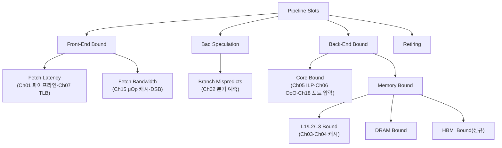

**CPU 하드웨어 카운터 활용**이란 PMU(Performance Monitoring Unit)가 세는 사이클·캐시 미스·분기 실패 같은 원값을 이 트랙에서 배운 파이프라인·분기 예측·캐시·ILP·Out-of-Order 메커니즘에 되짚어 연결하는 작업을 말합니다. TopDown Microarchitecture Analysis(TMA)는 그 연결을 트리 구조로 자동화해 주지만, 트리의 각 가지가 실제로 어떤 하드웨어 유닛의 어떤 실패 모드를 가리키는지 모르면 "Back-End Bound 68%"라는 숫자는 그저 큰 숫자일 뿐입니다. 게다가 2021년 이후 하이브리드 코어(P-core/E-core)가 클라이언트 CPU의 기본값이 되고 HBM을 얹은 서버 CPU가 등장하면서, 카운터를 코어 타입별로 분리하고 새로운 메모리 계층을 별도 메트릭으로 읽어야 하는 상황이 생겼습니다. 이 장은 TMA 트리를 이 트랙의 챕터 지도에 겹쳐 놓고, `perf --cputype`으로 하이브리드 코어의 카운터를 분리하는 법과 TMA의 신규 메트릭 `HBM_Bound`를 심화 수준으로 다룹니다.

## 이 장을 읽기 전에

**선행 챕터**: 이 장은 [CPU 파이프라인 기초](/post/cpu-optimization/cpu-pipeline-fundamentals/), [분기 예측 메커니즘과 비용](/post/cpu-optimization/branch-prediction-mechanisms-cost/), [캐시 계층 구조](/post/cpu-optimization/cache-hierarchy-l1-l2-l3/), [명령 수준 병렬성(ILP) 기초](/post/cpu-optimization/instruction-level-parallelism-fundamentals/), [Out-of-Order 실행과 성능](/post/cpu-optimization/out-of-order-execution-performance/), [현대 CPU 아키텍처 비교](/post/cpu-optimization/modern-cpu-architecture-comparison/)에서 다룬 하드웨어 메커니즘을 전제로 합니다. PMU 카운터의 물리적 구조(고정/범용 카운터), IPC·MPKI 읽는 법, TMA의 4대 카테고리와 멀티플렉싱 원리 자체는 이 장에서 되풀이하지 않고 [Tr.01 하드웨어 성능 카운터](/post/profiling-analysis/hardware-performance-counters/)로 위임합니다. 해당 장을 먼저 읽지 않았다면 이 장의 절반은 전제 지식 없이 읽는 셈이 됩니다.

**이 장의 깊이**: 심화입니다. "카운터를 어떻게 읽는가"가 아니라 "TMA가 지목한 병목을 이 트랙의 어느 챕터가 설명하는가", 그리고 "하이브리드 코어·HBM처럼 카운터 자체가 여러 갈래로 쪼개지는 최신 플랫폼에서 무엇을 먼저 고정해야 하는가"를 다룹니다.

**다루지 않는 것**: `perf`·`toplev`의 명령어 문법과 멀티플렉싱 대처법은 [Tr.01 하드웨어 성능 카운터](/post/profiling-analysis/hardware-performance-counters/), VTune GUI 조작은 [Tr.01 Intel VTune 심화](/post/profiling-analysis/intel-vtune-deep-dive/), uOp 캐시·DSB 내부 동작은 [μOp 캐시와 DSB](/post/cpu-optimization/uop-cache-decoded-stream-buffer/), 실행 포트 경합의 세부 분석은 [의존성 체인·포트 압력 분석](/post/cpu-optimization/dependency-chain-port-pressure-analysis/), SMT가 카운터 귀속에 미치는 영향은 [SMT/Hyper-Threading 성능 영향](/post/cpu-optimization/smt-hyperthreading-performance/)에 위임합니다.

## 당신의 수준에 맞는 경로

| 수준 | 읽을 부분 | 핵심 목표 |
|------|---------|---------|
| **중급자** | "하이브리드와 HBM이 카운터 해석에 요구한 변화" ~ "TMA 트리를 하드웨어 원인에 연결하기" | TMA 각 가지가 이 트랙의 어느 챕터·메커니즘에 대응하는지 지도 그리기 |
| **심화 학습자** | "하이브리드 코어의 PMU" ~ "TMA의 신규 메트릭 HBM_Bound" | `--cputype` 분리와 `HBM_Bound` 해석 |
| **전문가** | "판단 기준" ~ "비판적 시각" | 하이브리드·HBM 환경에서 카운터 해석의 전제 조건과 한계 판단 |

---

## 하이브리드와 HBM이 카운터 해석에 요구한 변화

TMA 트리는 2014년 Ahmad Yasin의 논문 이후로도 계속 개정되어 왔지만, 두 차례의 하드웨어 변화가 트리 자체보다 "트리를 어떻게 측정할 것인가"라는 앞단 문제를 만들었습니다. 첫 번째는 2021년 Alder Lake입니다. Golden Cove(P-core)와 Gracemont(E-core)를 한 다이에 올린 이 칩은 두 코어가 카운터 개수·지원 이벤트·TMA 지원 레벨이 서로 달랐고, 커널 `perf` 서브시스템은 이를 다루기 위해 코어 타입마다 독립된 PMU(`cpu_core`, `cpu_atom`)를 등록하는 구조로 확장되었습니다([Alder Lake 하이브리드 지원 패치셋](https://lwn.net/Articles/848991/)). 이 구조는 이후 Meteor Lake·Lunar Lake·Arrow Lake로 이어지는 클라이언트 라인의 기본값이 되었고, `perf stat`은 코어 타입을 지정하지 않으면 `cpu_core`·`cpu_atom` 양쪽에 같은 이벤트를 중복으로 걸어 두 배의 행을 출력하도록 바뀌었습니다.

두 번째는 2023년 Sapphire Rapids HBM(제품명 Xeon CPU Max Series)입니다. 소켓당 4개의 HBM 스택을 DDR5와 함께 얹은 이 칩은 Flat 모드(HBM과 DDR을 서로 다른 주소 공간으로 노출)와 Cache 모드(HBM을 DDR 앞의 투명한 캐시로 사용)를 지원하는데, 기존 TMA의 `DRAM_Bound`만으로는 정체가 HBM 접근인지 DDR 접근인지 구분할 수 없었습니다([Aurora 슈퍼컴퓨터의 Xeon Max HBM 성능 분석](https://arxiv.org/html/2504.03632v1) 논문이 두 모드의 대역폭·지연 차이를 정량적으로 다룹니다). TMA 4.x대에서 Memory Bound 하위에 `HBM_Bound`가 추가된 것은 이 간극을 메우기 위해서이며, [pmu-tools](https://github.com/andikleen/pmu-tools) 릴리스 노트는 이를 "로드에 의한 HBM 접근으로 인한 스톨"로 정의합니다. 두 변화 모두 "카운터가 무엇을 세는가"는 그대로 두고 "어느 PMU/어느 계층에서 세는가"를 새로 물어야 한다는 공통점이 있습니다.

## TMA 트리를 하드웨어 원인에 연결하기

TMA의 4대 카테고리(Retiring, Bad Speculation, Front-End Bound, Back-End Bound)와 슬롯 개념 자체는 [Tr.01 하드웨어 성능 카운터](/post/profiling-analysis/hardware-performance-counters/)에서 다뤘으므로, 이 장에서는 그 트리의 각 leaf가 이 트랙의 어느 챕터가 설명하는 메커니즘과 대응하는지를 지도로 정리합니다. 이 지도가 없으면 toplev가 "Backend_Bound.Memory_Bound 63%, DRAM_Bound 40%"를 출력해도 다음에 무엇을 읽어야 할지 알 수 없고, 반대로 이 지도가 있으면 TMA 출력이 곧 "이 트랙의 몇 번 챕터를 펼쳐야 하는가"에 대한 답이 됩니다.



이 지도를 표로 옮기면 다음과 같습니다. **TopDown에서 처음 병목의 종류(Frontend/Backend Bound)를 분류하는 최소 직관**은 이 트랙의 [Frontend vs Backend Bound 개념](/post/cpu-optimization/frontend-backend-bound-topdown-basics/)에서 다루므로, 아래 표는 그 직관을 전제로 한 심화 지도입니다.

| TMA leaf | 가리키는 하드웨어 실패 모드 | 이 트랙에서 위임할 챕터 |
|------|------|------|
| Fetch Latency | I-cache/ITLB 미스, 분기 리스티어로 프런트엔드가 통째로 비는 구간 | [CPU 파이프라인 기초](/post/cpu-optimization/cpu-pipeline-fundamentals/), [TLB 미스 최적화](/post/cpu-optimization/tlb-miss-optimization/) |
| Fetch Bandwidth | 디코더 폭 부족, μOp 캐시(DSB) 미스로 레거시 디코드 경로 사용 | [μOp 캐시와 DSB](/post/cpu-optimization/uop-cache-decoded-stream-buffer/) |
| Branch Mispredicts / Machine Clears | 분기 예측기 오답, 메모리 순서 위반으로 인한 파이프라인 플러시 | [분기 예측 메커니즘과 비용](/post/cpu-optimization/branch-prediction-mechanisms-cost/) |
| Core Bound | 실행 포트 포화, 짧은 의존 체인이 ILP 상한을 못 채움 | [ILP 기초](/post/cpu-optimization/instruction-level-parallelism-fundamentals/), [Out-of-Order 실행과 성능](/post/cpu-optimization/out-of-order-execution-performance/), [의존성 체인·포트 압력 분석](/post/cpu-optimization/dependency-chain-port-pressure-analysis/) |
| L1/L2/L3 Bound | 로드가 상위 캐시에서 해소되지 못하고 하위 계층까지 내려감 | [캐시 계층 구조](/post/cpu-optimization/cache-hierarchy-l1-l2-l3/), [캐시 미스 분석과 대응](/post/cpu-optimization/cache-miss-analysis-hint-instructions/) |
| DRAM Bound / HBM_Bound | 로드가 DDR 또는 HBM까지 내려가 수백 사이클급 지연을 그대로 흡수 | 이 장의 "TMA의 신규 메트릭" 절 |

**지배적인 가지만 내려간다는 원칙**(Tr.01 ch08에서 다룬 규칙)을 여기서도 그대로 적용합니다 — 예를 들어 toplev가 `Backend_Bound.Memory_Bound` 63%, `Frontend_Bound` 8%를 보고했다면, 8%짜리 Fetch Bandwidth를 붙잡고 uOp 캐시를 튜닝하는 것은 순서가 잘못된 최적화입니다. 지배 가지가 Core Bound인지 Memory Bound인지를 먼저 확정한 뒤, 위 표를 따라 해당 챕터로 이동하는 것이 이 지도의 실질적 용도입니다.

## 하이브리드 코어의 PMU: cpu_core·cpu_atom과 --cputype

Alder Lake 이후 클라이언트 CPU에서 `perf stat`을 코어 타입 지정 없이 실행하면, 커널은 소프트웨어 이벤트 외에 `cpu_core/cycles/`, `cpu_atom/cycles/`, `cpu_core/instructions/`, `cpu_atom/instructions/` 같은 이벤트 쌍을 자동으로 만들어 둘 다 출력합니다. 이는 P-core와 E-core가 최대 발행 폭·파이프라인 깊이·지원 이벤트가 서로 달라 하나의 카운터 값으로 합칠 수 없기 때문입니다 — Golden Cove급 P-core는 6-wide 디코드에 범용 카운터가 코어당 8개(SMT 비활성 기준, 세대·구현에 따라 다름) 수준인 반면, Gracemont·Skymont급 E-core는 SMT가 없고 카운터 구성과 지원 이벤트 목록이 더 좁습니다. 이 차이 때문에 스레드가 스케줄러에 의해 P-core와 E-core 사이를 오가며 실행되면, 같은 스레드의 "IPC"는 측정 구간 동안 어느 코어에 얼마나 머물렀는지에 따라 물리적으로 다른 두 분포가 섞인 값이 됩니다.

`--cputype` 옵션은 이 문제를 측정 시점에 통제합니다. 코어 타입을 하나로 고정해 이벤트를 등록하므로, 비교하려는 코드가 항상 같은 종류의 코어에서 실행된다는 전제를 측정 자체가 강제합니다.

```bash
# 하이브리드 시스템에서 코어 종류를 지정하지 않으면 core/atom 이벤트가 각각 만들어짐
perf stat ./pmu_bench r

# P-core에서만 카운트: 비교 실험의 전제(같은 코어 종류)를 측정 단계에서 강제
perf stat --cputype=core -e cycles,instructions,cache-misses ./pmu_bench r

# E-core에서만 카운트: 백그라운드·저전력 스레드의 프로파일이 궁금할 때
perf stat --cputype=atom -e cycles,instructions,cache-misses ./pmu_bench r

# 특정 이벤트만 코어 종류를 명시해 섞어 쓸 수도 있음
perf stat -e cpu_core/cycles/,cpu_atom/cycles/ ./pmu_bench r
```

첫 번째 명령(코어 타입 미지정)을 실행하면 다음과 같이 `cpu_core`·`cpu_atom` 이벤트 쌍이 각각의 관측 비율과 함께 출력됩니다.

```text
# --cputype 없이 실행한 하이브리드 perf stat 출력 예시 (Alder Lake 계열, Linux 6.x)
       233,066,666      cpu_core/cycles/                 (0.43%)
       604,097,080      cpu_atom/cycles/                 (99.57%)
       118,240,552      cpu_core/instructions/            #  0.51  insn per cycle  (0.43%)
       301,884,207      cpu_atom/instructions/            #  0.50  insn per cycle  (99.57%)
```

이 출력에서 괄호 안 백분율은 각 이벤트가 관측된 시간 비율이 아니라, 스레드가 그 코어 타입에서 실행된 시간의 비중에 가깝게 읽힙니다. 위 예시처럼 대부분의 실행 시간이 `cpu_atom`에 몰려 있다면 스케줄러가 이 워크로드를 E-core에 배치했다는 뜻이고, `--cputype=core`로 강제 고정하지 않는 한 두 코어 타입의 IPC를 단순 비교하는 것은 의미가 없습니다. toplev도 동일한 문제를 겪으므로 `pmu-tools`는 `cputop core cpuset`이라는 헬퍼로 특정 코어 타입의 CPU 마스크를 생성해 `taskset`과 함께 쓰도록 안내합니다. Apple Silicon의 P코어/E코어(Firestorm/Icestorm 계열, [Apple Silicon 아키텍처](/post/cpu-optimization/apple-silicon-m-series-architecture/) 참고)에서도 개념은 동일하지만, Linux `perf`가 아닌 `powermetrics`·Instruments의 코어 클러스터별 카운터로 같은 문제를 다룬다는 점은 플랫폼 차이로 유의해야 합니다.

## TMA의 신규 메트릭: HBM_Bound

기존 TMA의 `DRAM_Bound`는 "로드가 캐시를 모두 벗어나 메인 메모리까지 내려갔다"는 사실만 알려줄 뿐, 그 메인 메모리가 DDR인지 HBM인지는 구분하지 않았습니다. Xeon Max처럼 두 메모리 계층이 공존하는 칩에서는 이 구분이 실질적입니다. Flat 모드에서는 HBM과 DDR이 서로 다른 NUMA 노드로 노출되므로, 애플리케이션이 뜨거운 데이터를 실수로 DDR 노드에 배치하면 대역폭이 남아도는 HBM은 놀고 코드는 `DRAM_Bound`로만 잡혀 원인이 "메모리가 느리다"로 뭉뚱그려집니다. `HBM_Bound`는 이 경우를 분리해 "HBM 접근 자체가 스톨의 원인인가"를 별도로 보여주고, Cache 모드에서는 HBM이 DDR의 캐시로 동작하므로 그 캐시에서 미스가 나서 결국 DDR까지 내려가는 구간을 식별하는 데 씁니다.

```bash
# HBM 탑재 서버에서 Memory Bound를 HBM/DDR로 분리 (toplev, Sapphire Rapids HBM 이상)
./pmu-tools/toplev -l3 --nodes '+HBM_Bound,+DRAM_Bound' ./pmu_bench r

# Flat 모드에서 데이터가 어느 NUMA 노드(HBM/DDR)에 있는지 먼저 고정
numactl --membind=1 ./pmu_bench r   # 노드 번호는 lscpu/numactl -H로 HBM 노드를 먼저 확인
```

첫 번째 명령을 실행하면 다음과 같이 `DRAM_Bound`와 `HBM_Bound`가 각각 별도의 % Slots 값으로 분리되어 출력됩니다.

```text
# toplev -l3 출력 예시 (요약, Xeon Max, Flat 모드, SNC4 클러스터링 — 수치는 배치·워크로드에 따라 다름)
BE/Mem/DRAM        Backend_Bound.Memory_Bound.DRAM_Bound       % Slots    9.8
BE/Mem/HBM         Backend_Bound.Memory_Bound.HBM_Bound        % Slots   58.2  <==
```

이 결과가 나온다면 원인은 "메모리가 느리다"가 아니라 "HBM 대역폭 자체가 병목"이라는 뜻이며, 대응은 접근 패턴을 더 넓혀 대역폭을 실제로 채우고 있는지, 아니면 작업 집합이 HBM 용량(Xeon Max 기준 소켓당 64GB)을 넘어 DDR로 스필되고 있는지를 가르는 방향으로 이어집니다. 캐시 미스로 인한 계층 이동 자체의 원리는 이 장에서 다시 설명하지 않고 [캐시 미스 분석과 대응](/post/cpu-optimization/cache-miss-analysis-hint-instructions/)에 위임하며, 이 절은 그 분석 대상이 DDR인지 HBM인지를 먼저 가르는 역할만 합니다. `HBM_Bound`는 TMA 트리 버전(4.6~4.7대) 사이에서도 정의·노드 위치가 조정되어 왔으므로, 사용하는 `toplev`·VTune 버전의 릴리스 노트를 확인하는 습관이 필요합니다.

## 흔한 오개념 교정

**"신형 Xeon은 다 하이브리드니까 --cputype이 필요하다."** 틀렸습니다. Sierra Forest·Clearwater Forest 계열은 E-core만으로 이루어진 동형(homogeneous) 서버 칩이라 코어 타입 분리 문제 자체가 없습니다([현대 CPU 아키텍처 비교](/post/cpu-optimization/modern-cpu-architecture-comparison/) 참고). `--cputype`이 실질적으로 필요한 대상은 P-core/E-core를 한 다이에 섞은 클라이언트 라인(Alder Lake~Arrow Lake)입니다.

**"HBM_Bound가 낮으면 메모리는 문제없다."** `HBM_Bound`는 HBM 접근으로 인한 스톨만 봅니다. Flat 모드에서 데이터가 DDR 노드에 있다면 `HBM_Bound`는 0에 가깝고 `DRAM_Bound`가 대신 높게 나오므로, 두 메트릭을 함께 보지 않으면 "메모리 계층 전체가 병목이 아니다"라는 잘못된 결론에 도달합니다.

**"코어 타입을 고정하지 않아도 반복 측정하면 평균이 맞춰진다."** 스케줄러의 코어 배치는 반복 실행 사이에도 시스템 부하·전력 정책(터보 상태)에 따라 달라지므로, 반복 횟수를 늘리는 것은 분산을 줄일 뿐 P-core와 E-core라는 질적으로 다른 두 모집단을 하나로 섞는 문제 자체를 해결하지 않습니다. 비교 실험은 `--cputype`이나 `taskset`으로 코어 종류를 먼저 고정한 뒤에만 반복 측정의 통계가 의미를 가집니다.

## 판단 기준

| 상황 | 권장 | 이유 |
|------|------|------|
| 하이브리드 클라이언트 칩에서 벤치마크 비교 | `--cputype=core`로 P-core 고정 | 코어 종류가 섞이면 IPC·미스율 비교 자체가 무의미 |
| 백그라운드·저전력 경로 프로파일링 | `--cputype=atom` | 실제 배치되는 코어 기준으로 측정 |
| SMT 켠 상태에서 코어 단위 집계 필요 | `--per-core` + [SMT 챕터](/post/cpu-optimization/smt-hyperthreading-performance/) | 두 스레드가 자원을 공유해 개별 스레드 값이 왜곡됨 |
| HBM 탑재 서버에서 Memory Bound 확정 후 | `toplev`로 `HBM_Bound`/`DRAM_Bound` 분리 | 계층별 원인 없이는 대역폭 문제와 배치 문제를 못 나눔 |
| Flat/Cache 모드 실험 | `numactl`로 노드 고정 후 재측정 | 모드·배치를 통제하지 않으면 재현 불가 |
| 동형 서버(Sierra/Clearwater Forest 등)·일반 데스크톱 | 이 장의 확장 없이 [Tr.01 기본 TMA](/post/profiling-analysis/hardware-performance-counters/) | 코어 타입 분리·HBM 계층 문제가 애초에 없음 |

## 비판적 시각: 하이브리드·HBM이 늘리는 해석 비용

하이브리드 PMU는 코어 타입 간 이벤트 그룹화를 지원하지 않으므로, `cpu_core`와 `cpu_atom` 이벤트를 하나의 그룹(`{}`)으로 묶어 시간 정합성을 보장하는 Tr.01의 멀티플렉싱 대처법이 코어 타입을 넘어서는 적용되지 않습니다. 결과적으로 하이브리드 환경에서는 "코어 타입 고정 + 그룹화"라는 두 겹의 통제가 필요해지고, 측정 설계의 복잡도가 배가됩니다. `HBM_Bound`는 아직 소수 SKU(Sapphire Rapids HBM, 일부 Granite Rapids AP 계열)에서만 의미가 있고 트리 버전마다 정의가 조정되어 왔으므로, 이 메트릭 하나에 과도한 확신을 갖기보다는 STREAM류의 대역폭 벤치마크나 Memory Latency Checker 같은 직접 측정과 교차 검증하는 편이 안전합니다. 두 확장 모두 Intel 벤더 종속적이라는 한계도 있습니다 — AMD·ARM 플랫폼에는 대응하는 하이브리드 PMU 분리나 HBM_Bound 동급 메트릭이 다른 이름·다른 구조로 존재하거나 아예 없을 수 있으므로, 플랫폼을 옮길 때는 이 장의 구체적인 옵션명이 아니라 "코어 종류를 먼저 고정하고, 메모리 계층을 먼저 가른다"는 원칙만 이식해야 합니다.

## 마무리

- [ ] TMA 트리의 각 leaf(Fetch Latency/Bandwidth, Core Bound, L1-L3/DRAM/HBM Bound)가 이 트랙의 어느 챕터가 설명하는 메커니즘인지 짚을 수 있다.
- [ ] 하이브리드 코어에서 `cpu_core`/`cpu_atom` PMU가 분리되어야 하는 이유와 `--cputype`의 용법을 설명할 수 있다.
- [ ] `HBM_Bound`가 `DRAM_Bound`와 무엇이 다른지, Flat/Cache 모드에서 왜 두 메트릭을 함께 봐야 하는지 설명할 수 있다.
- [ ] 하이브리드·HBM 환경에서는 카운터 해석 전에 코어 종류·메모리 노드를 먼저 고정해야 한다는 원칙을 적용할 수 있다.
- [ ] 신규 메트릭이 벤더·SKU 종속적이라는 한계를 인지하고, 대역폭 벤치마크 같은 직접 측정으로 교차 검증할 수 있다.

**이전 장**: [현대 CPU 아키텍처 비교](/post/cpu-optimization/modern-cpu-architecture-comparison/) (챕터 08)

**다음 장**(챕터 10)에서는 TMA의 `Bad Speculation` 가지가 단순한 성능 손실을 넘어 보안 문제로 이어지는 지점을 다룹니다. 추측 실행이 잘못된 경로의 데이터를 캐시에 남기는 현상과 Spectre/Meltdown류 공격이 그 흔적을 읽어내는 방식, 완화 기법이 다시 카운터 수치(특히 Bad Speculation·Core Bound)에 남기는 비용을 살펴봅니다.

→ [추측 실행과 보안 영향](/post/cpu-optimization/speculative-execution-security-impact/)
