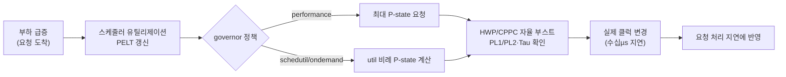

**CPU 주파수 스케일링**은 운영체제와 하드웨어가 코어의 동작 클럭(과 전압)을 실행 시점의 부하·전력·온도 여건에 맞춰 동적으로 바꾸는 동작을 말하며, 이 메커니즘을 통칭해 <strong>DVFS(Dynamic Voltage and Frequency Scaling)</strong>라고 부릅니다. 처리량 관점에서는 주파수가 높을수록 유리하지만, µs 단위 지연시간을 다루는 시스템에서는 이야기가 달라집니다. 요청이 도착한 순간 코어가 아직 낮은 P-state에 머물러 있거나 깊은 idle C-state에서 깨어나는 중이라면, 같은 코드라도 실행 시간이 요청마다 크게 달라집니다. 이 장은 왜 같은 함수가 어떤 실행에서는 빠르고 어떤 실행에서는 느린지—흔히 "지터(jitter)"라고 부르는 현상—를 주파수 스케일링의 동작 원리로 설명하고, governor 정책이 그 지터의 크기를 어떻게 좌우하는지 다룹니다.

## 이 장을 읽기 전에

**선행 장**: [추측 실행과 보안 영향](/post/cpu-optimization/speculative-execution-security-impact/) (챕터 10)에서 파이프라인이 성능을 위해 예측·추측을 활용하는 방식을 다뤘습니다. 이 장은 그 파이프라인이 **어떤 클럭에서** 도는지를 다루므로, [CPU 파이프라인 기초](/post/cpu-optimization/cpu-pipeline-fundamentals/) (챕터 01)의 "사이클"이라는 단위 개념을 전제로 합니다.

**전제 지식**: 클럭 사이클과 명령 처리량의 관계, ACPI라는 이름 정도를 들어본 적이 있으면 충분합니다. Linux 커널 내부 스케줄러 구현을 알 필요는 없습니다.

**이 장의 깊이**: DVFS의 원리부터 Intel Turbo Boost·AMD Precision Boost 2의 동작 방식, Linux governor의 선택 기준까지 **중급** 수준으로 다룹니다. **다루지 않는 것**: RAPL 기반 전력 제한(power capping)과 유휴 시 소비 전력 최적화 자체는 [전력 관리가 성능에 미치는 영향](/post/cpu-optimization/power-management-performance-impact/) (챕터 12)에서 다룹니다. 벤더별 부스트 알고리즘의 세부 구현 차이는 [현대 CPU 아키텍처 비교](/post/cpu-optimization/modern-cpu-architecture-comparison/) (챕터 08)로, 주파수 변화를 실측하는 하드웨어 카운터 사용법은 [CPU 하드웨어 카운터 활용](/post/cpu-optimization/cpu-hardware-performance-counters/) (챕터 09)으로 미룹니다.

## 당신의 수준에 맞는 경로

| 수준 | 읽을 부분 | 핵심 목표 |
|------|---------|---------|
| **초보자** | "DVFS의 기원" ~ "P-state와 C-state" | 주파수·전압·전력의 관계와 상태 구분을 이해 |
| **중급자** | "Turbo Boost와 Precision Boost" ~ "Linux governor 정책" | 벤더별 부스트 메커니즘과 governor가 지연시간에 미치는 영향을 이해 |
| **전문가** | "판단 기준" ~ "비판적 시각" | 워크로드 특성에 맞는 governor·부스트 정책을 선택하고 한계를 판단 |

---

## DVFS의 기원 (역사·배경)

주파수·전압을 동적으로 조절하는 아이디어는 원래 배터리 수명이 목적이었습니다. Intel은 1999년 모바일 Pentium III에 **SpeedStep**을 도입해 배터리 구동 시 전압과 클럭을 함께 낮췄고, AMD는 2000년대 초 노트북용 <strong>PowerNow!</strong>와 데스크톱용 **Cool'n'Quiet**로 대응했습니다. 이후 ACPI(Advanced Configuration and Power Interface) 표준이 **P-state**(성능 상태)와 **C-state**(유휴 상태)라는 용어를 정의하면서, 운영체제가 벤더 중립적인 인터페이스로 주파수·유휴 상태를 제어할 길이 열렸습니다.

성능 방향의 전환점은 2008년 Nehalem 세대에 도입된 **Turbo Boost**였습니다. 이전까지 DVFS는 "전력을 아끼기 위해 클럭을 낮추는" 기술이었지만, Turbo Boost는 반대로 "여유 전력·열 예산이 있으면 정격 클럭 이상으로 올리는" 기술이었습니다. 2016년 Broadwell-E에서는 코어별로 부스트 한도를 다르게 주는 **Turbo Boost Max 3.0**이 추가되어 "가장 좋은 코어"라는 개념이 하드웨어 차원에서 명시됩니다. AMD 진영에서는 2017년 Ryzen(Zen)이 **Precision Boost**를, 2018년 Zen+ 세대가 **Precision Boost 2**를 도입해 이산적인 부스트 구간 대신 연속적인 곡선으로 주파수를 조절하는 방식으로 전환했습니다.

## DVFS 기본 원리

CMOS 회로의 동적 전력 소비는 대략 "전력 ∝ 정전용량 × 전압² × 주파수"로 근사됩니다. 전압을 낮추면 전력이 제곱으로 줄고, 여기에 전압을 낮춰야 클럭도 낮출 수 있다는 물리적 제약(전압이 낮으면 트랜지스터 스위칭이 느려짐)이 겹쳐, 주파수를 낮추는 것만으로도 전력 절감 효과가 크게 나타납니다. 반대 방향으로 보면, 코어를 정격 이상으로 밀어붙이려면 전압도 함께 올려야 하고, 그러면 전력·발열이 세제곱에 가깝게 늘어납니다. 이 비선형 관계가 "왜 모든 코어를 동시에 최고 클럭으로 못 돌리는가"의 물리적 근거입니다.

**P-state**는 코어가 실행 중일 때의 성능 등급을 가리키며, P0가 가장 높은 성능(가장 높은 클럭·전압)이고 번호가 커질수록 낮은 클럭입니다. **C-state**는 코어가 유휴 상태로 들어갈 때의 절전 등급으로, C0는 실행 중, C1은 얕은 유휴(클럭 게이팅 정도), C6 이상은 코어 전압을 거의 0까지 내리는 깊은 유휴 상태입니다. 두 상태는 서로 다른 축입니다—P-state는 "일할 때 얼마나 빠르게", C-state는 "쉴 때 얼마나 깊이 절전할지"를 결정합니다. 지연시간 관점에서 중요한 것은, 상태 전이 자체에 시간이 걸린다는 점입니다. P-state 전환은 하드웨어·펌웨어에 따라 수 마이크로초에서 수십 마이크로초가 걸리며, 3세대 Intel Xeon Scalable 이후로는 BIOS에서 0/50/500µs 중 선택할 수 있게 되었습니다. C-state는 더 심각한데, 깊은 C-state(C6 등)에서 깨어나는 데는 수십~수백 마이크로초가 걸릴 수 있어, 그 자체가 µs 단위 요청 예산을 잠식하는 지연 원인이 됩니다. 정확한 수치는 세대·벤더·BIOS 설정에 따라 다르므로 대상 플랫폼에서 `cpupower idle-info`, `turbostat` 등으로 직접 확인해야 합니다.

## Turbo Boost와 Precision Boost 2

Intel Turbo Boost는 코어가 **PL1**(지속 전력 한도, sustained power limit)과 **PL2**(단시간 초과 허용 전력 한도, short-term power limit) 사이에서 동작하도록 설계됩니다. PL2는 **Tau**라는 시간 창(보통 수 초~수십 초, 플랫폼 구현에 따라 다름) 동안만 허용되고, 그 시간을 넘기면 PL1 수준으로 클럭을 낮춰 지속 가능한 상태로 돌아갑니다. 즉 "터보 클럭"은 항상 유지되는 값이 아니라 전력·온도 예산이 허용하는 동안만 유지되는 일시적 상태이며, 활성 코어 수가 늘어날수록 코어당 배정 가능한 부스트 배수는 줄어드는 것이 일반적입니다. AMD의 **Precision Boost 2**는 이를 이산적인 몇 개 구간이 아니라 연속적인 곡선으로 표현합니다—전력·전류·온도 세 가지 텔레메트리를 초당 최대 1000회 수준으로 읽어 그 순간 허용 가능한 최고 클럭을 계산하며, 코어가 하나만 바빠도 나머지가 완전히 유휴라면 그 코어에 더 많은 부스트 여유를 줄 수 있습니다.

두 벤더 모두 최근에는 운영체제에 세부 스케줄링을 맡기지 않고 하드웨어가 자율적으로 P-state를 고르는 방향으로 이동했습니다. Intel의 <strong>HWP(Hardware P-States, Speed Shift)</strong>는 Skylake(2015)부터 지원되며, OS는 EPP(Energy Performance Preference)로 "성능 우선"과 "효율 우선" 사이의 힌트만 주고 실제 P-state 선택은 하드웨어가 수행합니다. AMD의 <strong>CPPC(Collaborative Processor Performance Control)</strong>는 ACPI 5.0에서 표준화된 개념으로, OS가 원하는 성능 수준을 절대 주파수가 아니라 상대적인 QoS 목표로 전달하면 펌웨어가 전력·온도 제약 안에서 실제 클럭을 결정합니다. 이 자율 제어 방식은 하드웨어가 훨씬 빠르게(마이크로초 단위로) 반응할 수 있다는 장점이 있는 반면, OS·운영자 입장에서는 "정확히 몇 GHz로 실행되고 있는가"를 예측하기 어려워진다는 트레이드오프를 동반합니다.



## Linux governor 정책

Linux는 `cpufreq` 서브시스템을 통해 governor라는 정책 모듈로 주파수 요청을 추상화합니다. **performance**는 항상 `scaling_max_freq` 한도의 최고 P-state를 요청하고, **powersave**는 반대로 최저 P-state를 유지합니다. **ondemand**는 유휴 시간 비율로 부하를 추정해 임계값을 넘으면 즉시 최고 클럭으로 뛰고, **conservative**는 같은 방식이되 단계적으로만 클럭을 올려 급격한 전력 변화를 피합니다. **schedutil**은 커널 4.7 이후 도입되었고 스케줄러의 PELT(Per-Entity Load Tracking) 유틸리제이션 값을 직접 읽어 `f = 1.25 * f_0 * util / max` 형태의 공식으로 목표 주파수를 계산하며, 여러 배포판에서 기본 governor로 채택되었습니다. `intel_pstate`나 `amd_pstate`가 **active(HWP/CPPC autonomous) 모드**로 동작할 때는 이 governor 계층을 우회하고 하드웨어가 직접 P-state를 고르며, OS는 EPP·성능 힌트만 전달하는 **passive/guided 모드**로 전환할 수도 있습니다.

```bash
# 현재 governor와 유휴 상태 설정 확인
cat /sys/devices/system/cpu/cpu0/cpufreq/scaling_governor
cpupower frequency-info
cpupower idle-info

# 지연시간이 중요한 코어를 performance governor로 고정
sudo cpupower -c 0-3 frequency-set -g performance

# 얕은 C-state만 허용하고 깊은 유휴 상태(C6 등)는 비활성화
sudo cpupower idle-set -d 3   # 예: 상태 인덱스 3을 비활성화(플랫폼마다 인덱스 의미가 다름)
```

`cpupower` 명령은 Linux `tuned`/`linux-tools` 패키지에 포함된 표준 도구로, governor 전환과 idle state 제어를 한 번에 다룰 수 있습니다. 다만 idle state 인덱스와 이름은 CPU 세대·벤더마다 다르므로, 적용 전에 반드시 `cpupower idle-info`로 대상 시스템의 상태 목록을 확인해야 합니다.

## 주파수 변동을 직접 관찰하기

주파수 스케일링이 지연시간 지터를 만든다는 주장은 말로 설명하기보다 직접 측정해 확인하는 편이 신뢰도가 높습니다. 아래는 동일한 바쁜 루프를 반복 실행하며 반복별 소요 시간의 분산을 기록하는 최소 벤치마크 스켈레톤입니다. governor를 `performance`와 `powersave`(또는 `schedutil`)로 바꿔가며 같은 바이너리를 실행하면 최솟값은 비슷해도 꼬리 분포(p99, p99.9)가 크게 달라지는 것을 관찰할 수 있습니다.

```cpp
// jitter_bench.cpp — g++ -O2 -o jitter_bench jitter_bench.cpp
#include <chrono>
#include <cstdio>
#include <vector>
#include <algorithm>

// 부동소수점 연산 위주의 고정 작업량: 컴파일러가 통째로 없애지 못하도록
// 결과를 누적해 반환값으로 사용한다.
static double busy_work(int iterations) {
  double x = 1.0000001;
  for (int i = 0; i < iterations; ++i) x = x * 1.0000001 + 1e-12;
  return x;
}

int main() {
  const int kRepeats = 20000;
  const int kIterationsPerRepeat = 20000;
  std::vector<double> samples_us;
  samples_us.reserve(kRepeats);
  volatile double sink = 0.0;

  for (int r = 0; r < kRepeats; ++r) {
    auto t0 = std::chrono::steady_clock::now();
    sink += busy_work(kIterationsPerRepeat);
    auto t1 = std::chrono::steady_clock::now();
    samples_us.push_back(std::chrono::duration<double, std::micro>(t1 - t0).count());
  }

  std::sort(samples_us.begin(), samples_us.end());
  auto pct = [&](double p) { return samples_us[(size_t)(p * (samples_us.size() - 1))]; };
  std::printf("min=%.2fus p50=%.2fus p99=%.2fus p999=%.2fus max=%.2fus\n",
              samples_us.front(), pct(0.50), pct(0.99), pct(0.999), samples_us.back());
  return 0;
}
```

이 코드를 `taskset -c 3 ./jitter_bench`처럼 특정 코어에 고정해 실행하고, 그 사이에 `sudo cpupower -c 3 frequency-set -g performance`와 `sudo cpupower -c 3 frequency-set -g powersave`를 번갈아 적용하며 반복하면 p50 대비 p99/p999가 벌어지는 정도의 차이를 직접 볼 수 있습니다(x86-64, Linux, GCC 기준 예시이며 실제 배율은 CPU 세대·BIOS 전력 설정에 따라 다릅니다). 함께 `perf stat`으로 사이클과 실행시간을 보면 실제 도달한 평균 클럭도 추정할 수 있습니다.

```text
$ perf stat -e cycles,instructions,task-clock -- taskset -c 3 ./jitter_bench

 Performance counter stats for 'taskset -c 3 ./jitter_bench':

     8,241,552,110      cycles
    16,483,004,221      instructions              #    2.00  insn per cycle
       2,801.34 msec    task-clock

       2.802345318 seconds time elapsed
```

`cycles / task-clock(ns)`로 나누면 실행 구간의 평균 클럭(GHz)을 근사할 수 있습니다(위 예시에서는 약 2.94GHz). 이 값이 `cpupower frequency-info`가 보여주는 최대 P-state보다 뚜렷이 낮게 나온다면, 실행 도중 주파수가 자주 떨어졌거나 애초에 목표 P-state에 도달하지 못했다는 신호이며, 이는 [CPU 하드웨어 카운터 활용](/post/cpu-optimization/cpu-hardware-performance-counters/) (챕터 09)에서 다루는 카운터 기반 분석으로 더 정밀하게 좁힐 수 있습니다.

## 흔한 오개념 교정

<strong>"Turbo Boost/Precision Boost는 항상 표기된 최대 클럭까지 올라간다"</strong>는 틀렸습니다. 부스트 클럭은 그 순간의 전력·전류·온도 여유가 있을 때만, 그리고 Intel의 경우 PL2·Tau라는 시간 제한 안에서만 도달합니다. 여러 코어가 동시에 바쁘거나 냉각이 부족하면 부스트는 짧게 끝나고 정격(base) 클럭 근처로 수렴합니다.

<strong>"governor를 performance로 고정하면 항상 최고 주파수로 실행된다"</strong>도 정확하지 않습니다. `intel_pstate`가 HWP active 모드로 동작하는 시스템에서는 governor 설정이 EPP 힌트 정도로만 반영되고, 실제 P-state는 여전히 하드웨어가 그 순간의 전력·온도 상황에 맞춰 결정합니다. performance governor는 "최고 P-state를 요청한다"는 뜻이지 "물리적으로 항상 최고 클럭이 나온다"는 보장이 아닙니다.

<strong>"주파수만 높이면 지연시간이 준다"</strong>는 절반만 맞습니다. 처리량 관점에서는 대체로 맞지만, 상태 전이 자체(P-state 전환 지연, 깊은 C-state에서 깨어나는 지연)가 지연시간 지터의 원인이 되기도 합니다. 유휴와 실행을 빈번하게 오가는 워크로드에서는 최고 클럭에 도달하기 전에 작업이 끝나 버려 "이론상 최대 클럭"이 체감 지연시간에 반영되지 않는 경우가 흔합니다.

## 판단 기준

| 상황 | 권장 | 비권장 |
|------|------|--------|
| 거래 시스템 등 p99/p999가 SLA인 요청 처리 코어 | `performance` governor + 깊은 C-state 비활성화 + 코어 고정(pinning) | `ondemand`/`powersave`, 깊은 C-state 방치 |
| 배치·처리량 위주 작업, 전력 비용이 민감 | `schedutil` 또는 `ondemand`, HWP active 모드 | 상시 `performance` 고정(불필요한 전력·발열) |
| 짧은 버스트가 드물게 발생하는 대화형 워크로드 | HWP/CPPC 자율 부스트에 맡기고 EPP를 성능 쪽으로 설정 | 수동 P-state 고정으로 유연성 제거 |
| 벤치마크·회귀 테스트로 성능을 비교할 때 | governor·C-state 설정을 고정하고 매 실행 동일 조건 유지 | governor 기본값 상태로 측정해 결과가 매번 달라짐 |
| 클라우드 vCPU 환경 | 호스트 정책을 먼저 확인(테넌트가 governor를 못 바꾸는 경우가 흔함) | 게스트에서 설정했다고 실제로 적용됐다고 가정 |

## 비판적 시각: 한계와 트레이드오프

`performance` governor를 모든 코어에 상시 고정하는 것이 만능 해법은 아닙니다. 유휴 코어까지 높은 P-state를 유지하면 전력·발열이 늘고, 밀도 높은 서버 환경에서는 오히려 열 스로틀링(thermal throttling)을 유발해 지속 성능이 더 나빠질 수 있습니다. Turbo Boost의 PL2·Tau 메커니즘 자체도 "짧게는 빠르지만 길게는 정격으로 수렴"하는 설계이므로, 지속적으로 부하가 많은 워크로드에서는 애초에 부스트 클럭을 유지 가능한 성능으로 기대해서는 안 됩니다. HWP·CPPC 같은 하드웨어 자율 제어는 반응 속도는 빠르지만, OS와 운영자가 "지금 정확히 몇 GHz인지"를 예측·통제하기 어렵게 만들어 디버깅과 성능 재현성을 떨어뜨리는 트레이드오프가 있습니다. 클라우드 가상화 환경에서는 이 문제가 더 심해지는데, 하이퍼바이저가 governor 설정 자체를 게스트에게 노출하지 않거나 무시하는 경우가 있고, vCPU steal time과 주파수 변동이 뒤섞여 어느 쪽이 지연시간 저하의 원인인지 구분하기 어려울 수 있습니다. 결국 주파수 스케일링 튜닝은 "항상 최고로 고정"이 아니라, 워크로드의 지연시간 요구사항과 전력·열 예산 사이에서 명시적으로 트레이드오프를 선택하는 문제입니다.

## 마무리

- [ ] DVFS가 무엇이며 "전력 ∝ 전압² × 주파수" 관계가 왜 주파수·전압을 함께 낮추게 만드는지 설명할 수 있다.
- [ ] P-state와 C-state의 차이, 그리고 상태 전이 자체가 지연시간 지터의 원인이 될 수 있음을 설명할 수 있다.
- [ ] Intel Turbo Boost(PL1/PL2/Tau)와 AMD Precision Boost 2가 왜 "항상 최대 클럭"이 아닌지 설명할 수 있다.
- [ ] Linux governor(performance/powersave/ondemand/schedutil)와 HWP/CPPC autonomous 모드의 관계를 구분할 수 있다.
- [ ] 지연시간 SLA가 있는 코어와 처리량 위주 코어에 서로 다른 governor·C-state 정책을 선택할 수 있다.
- [ ] `cpupower`, `perf stat`으로 실제 도달한 클럭과 지연시간 분포(p50/p99)를 측정해 governor 선택을 검증할 수 있다.

**다음 장에서는** 이 장에서 다룬 주파수 결정 메커니즘의 이면에 있는 **전력 관리** 자체—RAPL 기반 전력 제한(power capping), C-state 정책이 유휴 전력에 미치는 영향, 전력 예산과 성능 사이의 시스템 차원 트레이드오프—를 다룹니다.

→ [전력 관리가 성능에 미치는 영향](/post/cpu-optimization/power-management-performance-impact/) (챕터 12)

### 참고 자료

- [The Linux Kernel: CPU Performance Scaling](https://docs.kernel.org/admin-guide/pm/cpufreq.html) — cpufreq governor(performance/powersave/ondemand/conservative/schedutil)의 공식 커널 문서
- [The Linux Kernel: intel_pstate CPU Performance Scaling Driver](https://docs.kernel.org/admin-guide/pm/intel_pstate.html) — HWP active/passive 모드와 Turbo P-state 제어 방식
- [The Linux Kernel: amd-pstate CPU Performance Scaling Driver](https://docs.kernel.org/admin-guide/pm/amd-pstate.html) — CPPC 기반 active/guided/passive 모드 설명
