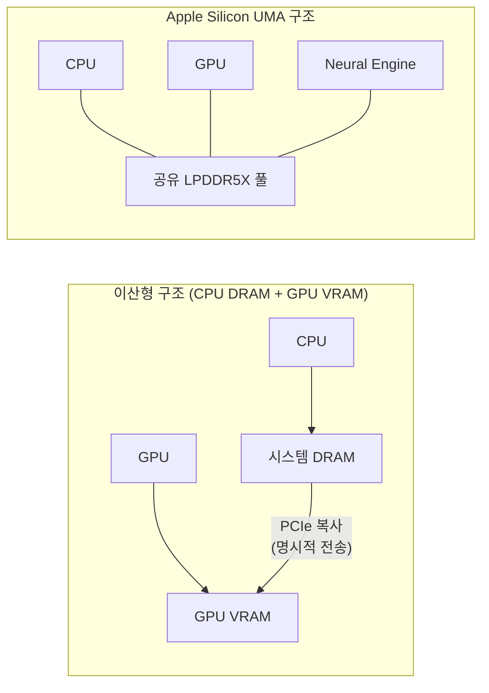

**Apple Silicon 아키텍처**란 Apple이 자체 설계한 ARM 기반 SoC(M 시리즈)가 성능·효율 코어의 비대칭 멀티프로세싱(asymmetric multiprocessing)과 CPU·GPU·Neural Engine이 하나의 메모리 풀을 공유하는 Unified Memory Architecture(UMA)로 지연시간·대역폭 특성을 결정하는 방식을 말합니다. x86 SMP(Symmetric Multiprocessing) 서버나 개별 VRAM을 가진 이산형 GPU 환경에 익숙한 엔지니어에게는 "코어마다 성능이 다르고, CPU와 GPU가 메모리를 나눠 쓴다"는 전제 자체가 낯설 수 있습니다. 이 장은 그 전제가 지연시간 분포와 처리량에 실제로 어떤 영향을 주는지, 어디까지가 마케팅 서사이고 어디부터가 측정 가능한 트레이드오프인지를 가릅니다.

## 이 장을 읽기 전에

**선행 지식**: [01장: CPU 파이프라인 기초](/post/cpu-optimization/cpu-pipeline-fundamentals/)의 명령 처리 흐름과 [03장: 캐시 계층 구조](/post/cpu-optimization/cache-hierarchy-l1-l2-l3/)의 L1/L2/L3 개념, [12장: 전력 관리가 성능에 미치는 영향](/post/cpu-optimization/power-management-performance-impact/)의 DVFS(Dynamic Voltage and Frequency Scaling) 개념을 전제로 합니다. 이 세 개념이 P/E 코어와 UMA를 이해하는 데 필요한 최소 배경입니다.

**이 장의 깊이**: 이 장은 **심화** 난이도로, Apple M 시리즈의 코어 비대칭성과 UMA가 왜 존재하고 실측 가능한 지연·대역폭에 어떤 영향을 주는지를 다룹니다. **다루지 않는 것**: ARM 명령어 집합 자체의 일반론과 다른 벤더와의 비교는 [08장: 현대 CPU 아키텍처 비교](/post/cpu-optimization/modern-cpu-architecture-comparison/)로 위임하고, GPU/Neural Engine 내부 연산 파이프라인이나 Metal API 활용은 이 트랙 범위 밖입니다. SMT처럼 하나의 코어가 여러 스레드를 동시 실행하는 방식은 [14장: SMT/Hyper-Threading 성능 영향](/post/cpu-optimization/smt-hyperthreading-performance/)에서 다루며, Apple P/E 코어는 SMT를 쓰지 않는 별개의 이기종 코어 방식이라는 점만 이 장에서 구분합니다.

## 당신의 수준에 맞는 경로

| 수준 | 읽을 부분 | 핵심 목표 |
|------|---------|---------|
| **중급자** | "Apple Silicon으로의 전환" ~ "P코어/E코어 비대칭 멀티프로세싱" | 비대칭 코어가 왜 존재하고 스케줄러가 무엇을 기준으로 배치하는지 이해 |
| **심화 학습자** | "Unified Memory Architecture와 지연·대역폭" ~ "흔한 오개념" | UMA가 대역폭·지연 트레이드오프에 미치는 실제 영향을 수치로 파악 |
| **전문가** | "판단 기준" ~ "비판적 시각" | Apple Silicon 특성을 근거로 이식성·측정 전략을 판단 |

---

## Apple Silicon으로의 전환과 마이크로아키텍처 계보

Apple은 2020년 11월 M1을 시작으로 Mac 제품군의 CPU를 Intel x86-64에서 자체 설계 ARM 기반 SoC로 전환했습니다. 이 전환의 핵심은 단순히 명령어 집합을 ARMv8/ARMv9로 바꾼 것이 아니라, ARM이 제공하는 표준 Cortex 코어 대신 Apple이 A 시리즈 모바일 칩(iPhone/iPad)에서 축적한 자체 마이크로아키텍처 설계(코드네임 Firestorm/Icestorm 계열로 알려진 M1의 성능·효율 코어)를 데스크톱·노트북급으로 확장한 데 있습니다. 이 자체 설계 덕분에 Apple은 코어별 파이프라인 깊이, 캐시 크기, 프론트엔드 폭을 세대마다 독자적으로 조정할 수 있었고, 이는 ARM 진영의 다른 벤더가 채택한 표준 big.LITTLE 구성과는 다른 궤적을 만들었습니다.

M1부터 M4까지는 4개의 고성능(P, Performance) 코어와 가변 개수의 저전력(E, Efficiency) 코어로 구성된 4P+nE 구조를 유지했습니다(M1~M3는 4E, M4는 6E). [2025년 10월 발표된 base M5](https://www.apple.com/newsroom/2025/10/apple-unleashes-m5-the-next-big-leap-in-ai-performance-for-apple-silicon/)는 같은 4P+6E 구성을 유지하되 GPU 코어마다 Neural Accelerator를 내장해 AI 워크로드의 메모리 왕복을 줄였고, [2026년 3월 발표된 M5 Pro/M5 Max](https://www.apple.com/newsroom/2026/03/apple-debuts-m5-pro-and-m5-max-to-supercharge-the-most-demanding-pro-workflows/)는 E 코어라는 이름 자체를 버리고 "6개의 Super Core + 12개의 새로운 Performance Core"로 구성을 재편했습니다. Apple은 이 재편을 두고 두 개의 3nm(3세대) 다이를 저지연 패키징으로 연결하는 **Fusion Architecture**를 함께 발표했는데, 이는 코어 비대칭성의 축이 "고성능 vs 저전력"에서 "제어 흐름 복잡도가 높은 워크로드 vs 멀티스레드 처리량 워크로드"로 옮겨가고 있음을 보여줍니다. 이 계보를 아는 것이 중요한 이유는, 이 트랙의 다른 챕터가 다루는 "코어" 개념이 x86 SMP처럼 동질적이라는 가정을 Apple Silicon에서는 그대로 쓸 수 없기 때문입니다.

## P코어/E코어 비대칭 멀티프로세싱

### 코어 설계가 다르다는 것의 의미

Apple Silicon의 P코어와 E코어는 같은 ARM64 명령어 집합을 지원하지만 내부 마이크로아키텍처는 완전히 다른 설계입니다. P코어는 더 깊은 파이프라인, 더 넓은 프론트엔드(디코드/디스패치 폭), 더 큰 Out-of-Order 실행 윈도우와 더 높은 클럭(M5 Max 기준 Super Core 최대 4.6GHz)을 갖도록 최적화되어 있고, E코어는 좁은 파이프라인과 낮은 클럭(유휴 시 약 1GHz 안팎)으로 동작하되 전력당 처리량이 우수하도록 설계됩니다. 이는 [01장](/post/cpu-optimization/cpu-pipeline-fundamentals/)에서 다룬 파이프라인 폭·깊이가 코어마다 다르게 튜닝된 결과이며, 같은 코드를 P코어에서 실행할 때와 E코어에서 실행할 때 사이클당 명령 처리량(IPC)과 절대 지연시간이 모두 달라집니다. 따라서 "코어 개수"만으로 처리량을 추정하면 실제 성능을 과대·과소평가하기 쉽습니다.

### macOS QoS 스케줄러가 배치를 결정한다

이 비대칭성이 실제 지연시간에 반영되려면 운영체제 스케줄러가 스레드를 어느 코어에 놓을지 결정해야 합니다. macOS는 스레드마다 QoS(Quality of Service) 등급을 부여하고, 이 등급이 코어 배치를 좌우합니다. 포그라운드로 분류된 높은 QoS 스레드는 P코어를 우선 사용하되 P코어가 모두 점유되면 E코어로도 넘어갈 수 있지만, 백그라운드로 분류된 낮은 QoS 스레드는 P코어가 비어 있어도 원칙적으로 P코어에 올라가지 않습니다.

> "While foreground threads will be run on P cores when they're available, they can also be scheduled on E cores when necessary. But background threads aren't normally allowed to run on P cores, even if they're delayed by the load on the E cores they're restricted to." — Howard Oakley, [Last Week on My Mac: Why E cores make Apple silicon fast](https://eclecticlight.co/2026/02/08/last-week-on-my-mac-why-e-cores-make-apple-silicon-fast/), eclecticlight.co (2026)

이 정책의 실무적 함의는, 유휴 상태의 Mac에서도 수백 개의 백그라운드 프로세스(Spotlight 색인, 미디어 분석 등)가 E코어에 격리되어 실행되므로 사용자 애플리케이션이 요청하는 순간 P코어는 대부분 비어 있다는 점입니다. 지연시간에 민감한 애플리케이션을 macOS에서 개발·벤치마크한다면, 스레드의 QoS 등급을 명시적으로 지정하지 않으면 기본 등급에 따라 예상과 다른 코어에 배치되어 벤치마크 결과가 실행마다 흔들릴 수 있습니다. 아래는 pthread 기반 QoS API로 스레드를 P코어 우선 등급으로 고정하는 예시입니다.

```c
#include <pthread.h>
#include <pthread/qos.h>
#include <stdio.h>

// macOS 전용 API: 현재 스레드의 QoS 등급을 지정해 P코어 우선 배치를 요청한다.
// QOS_CLASS_USER_INTERACTIVE가 가장 높은 우선순위이며, P코어 가용 시 그쪽으로 스케줄된다.
void* latency_sensitive_work(void* arg) {
  int ret = pthread_set_qos_class_self_np(QOS_CLASS_USER_INTERACTIVE, 0);
  if (ret != 0) {
    perror("pthread_set_qos_class_self_np");
  }
  // 실제 지연시간 민감 작업 수행
  return NULL;
}
```

이 API는 코어를 직접 지정(pinning)하는 것이 아니라 "이 스레드가 얼마나 중요한지"를 스케줄러에 알리는 힌트일 뿐이므로, 시스템 전체 부하가 높으면 여전히 대기가 발생할 수 있다는 한계가 있습니다. 크로스 플랫폼 저지연 코드에서는 이 API가 Linux의 `sched_setaffinity`나 `SCHED_FIFO`와 동등하지 않다는 점을 감안해 별도의 플랫폼 분기가 필요합니다.

## Unified Memory Architecture와 지연·대역폭

### 하나의 메모리 풀, 그러나 무한하지 않은 대역폭

전통적인 이산형(discrete) 구성에서는 CPU가 시스템 DRAM을, GPU가 별도의 VRAM을 쓰고 두 메모리 사이의 데이터 이동은 PCIe를 통한 명시적 복사로 처리됩니다. Apple Silicon의 <strong>Unified Memory Architecture(UMA)</strong>는 CPU, GPU, Neural Engine이 패키지 내부의 LPDDR5X 메모리 풀을 물리적으로 공유하게 해 이 복사 단계 자체를 없앱니다. Hübner 등(KTH, 2025)의 측정 연구는 이 구조를 다음과 같이 요약합니다.

> "This memory is not just a traditional RAM but is tightly coupled with the CPU, GPU, Neural Engine, and other components within the chip, forming a shared, high-bandwidth memory pool." — Hübner, Hu, Peng, Markidis, [Apple vs. Oranges: Evaluating the Apple Silicon M-Series SoCs for HPC Performance and Efficiency](https://arxiv.org/html/2502.05317v1), arXiv:2502.05317 (2025)

이 논문이 STREAM 벤치마크로 실측한 유효 대역폭은 이론치의 약 85% 수준이었고(M1 CPU 약 59GB/s, M4 CPU 약 103GB/s), Apple이 공개한 이론 최대치는 M4 120GB/s, M5 153.6GB/s(LPDDR5X 9600MT/s, M4 대비 약 30% 증가), M5 Pro 307GB/s, M5 Max 614GB/s입니다. 중요한 것은 이 대역폭이 CPU·GPU·Neural Engine이 **나눠 쓰는** 하나의 자원이라는 점입니다. CPU가 대역폭 집약 작업을 돌리는 동시에 GPU가 AI 추론을 수행하면 각 엔진이 실제로 확보하는 대역폭은 이론치보다 낮아지고, 지연시간 분포의 꼬리(p99)가 늘어질 수 있습니다. 이는 [04장: 캐시 미스 분석](/post/cpu-optimization/cache-miss-analysis-hint-instructions/)에서 다룬 미스 비용 모델에 "공유 자원 경합"이라는 변수를 추가로 얹어야 한다는 뜻입니다.



### Fusion Architecture와 다이 간 통신

M5 Pro/M5 Max의 **Fusion Architecture**는 3nm 다이 두 개를 고대역·저지연 패키징으로 연결해 하나의 SoC처럼 보이게 만드는 설계입니다. 이는 단일 다이 설계보다 수율·수익성 면에서 유리하지만, 다이 경계를 넘는 접근은 같은 다이 내부 접근보다 물리적으로 더 먼 거리를 거치므로 SoC 내부에서도 완전히 균일하지 않은 지연시간 특성이 생길 수 있습니다. Apple은 정확한 다이 간 지연 수치를 공개하지 않으므로, 이 부분은 **구현 정의**로 보고 필요하다면 실제 하드웨어에서 스레드·메모리 배치를 바꿔가며 직접 측정해야 합니다. 아울러 M5 세대는 SRAM 공정 미세화가 트랜지스터 밀도만큼 따라가지 못하는 상황에서 CPU 클러스터별 L2와 SoC 전체의 SLC(System Level Cache) 용량을 늘리는 방향을 택했는데, 이는 [03장: 캐시 계층 구조](/post/cpu-optimization/cache-hierarchy-l1-l2-l3/)에서 다룬 "더 큰 캐시가 대역폭 압박을 줄인다"는 일반 원칙이 UMA 환경에서 더 강하게 작동한다는 뜻이기도 합니다.

측정을 실제로 재현하려면 아래와 같은 최소한의 순차 접근 대역폭 스켈레톤을 각 플랫폼에서 직접 돌려 비교하는 것이 좋습니다. 절대 수치는 위에서 인용한 값과 다를 수 있으므로(펌웨어·열 상태·동시 부하에 따라 변함), 이 코드는 상대 비교용 뼈대로만 사용합니다.

```cpp
// clang -O2 -arch arm64 bandwidth_probe.cpp -o bandwidth_probe (Apple clang, macOS)
#include <chrono>
#include <cstdint>
#include <cstdio>
#include <vector>

int main() {
  constexpr size_t kBytes = 256ull * 1024 * 1024;  // 256MB: LLC보다 충분히 큰 워킹셋
  std::vector<uint8_t> buf(kBytes, 1);
  volatile uint64_t sink = 0;

  auto t0 = std::chrono::steady_clock::now();
  for (int rep = 0; rep < 20; ++rep) {
    uint64_t acc = 0;
    for (size_t i = 0; i < kBytes; i += 64) acc += buf[i];  // 캐시라인 단위 순차 접근
    sink = acc;
  }
  auto t1 = std::chrono::steady_clock::now();

  double sec = std::chrono::duration<double>(t1 - t0).count();
  double gb = (double)kBytes * 20 / (1ull << 30);
  std::printf("effective bandwidth: %.2f GB/s (sink=%llu)\n", gb / sec, (unsigned long long)sink);
  return 0;
}
```

## 흔한 오개념

<strong>"E코어는 성능이 낮으니 항상 손해다"</strong>는 정확하지 않습니다. E코어의 목적은 절대 성능이 아니라 백그라운드 작업을 P코어에서 격리해 사용자 워크로드가 요청하는 순간 P코어를 비워두는 것입니다. 유휴 Mac에서 수백 개 프로세스가 E코어에 머무르는 구조 자체가 P코어의 체감 반응성을 끌어올리는 장치이므로, E코어 존재를 "저성능 코어의 타협"이 아니라 "지연시간 격리 장치"로 이해해야 판단 기준이 맞습니다.

<strong>"Unified Memory는 대역폭이 사실상 무한하고 지연도 0에 가깝다"</strong>는 마케팅 문구에서 비롯된 과장입니다. UMA는 CPU-GPU 간 명시적 복사를 없애 <strong>왕복 비용(round-trip)</strong>을 줄이는 것이지, 대역폭 자체를 늘리거나 경합을 없애는 것이 아닙니다. CPU와 GPU가 동시에 대역폭을 많이 쓰면 각자가 받는 실효 대역폭은 줄어들고, 이는 STREAM 실측치가 이론 최대치의 약 85%에 그친 이유 중 하나이기도 합니다.

<strong>"Apple Silicon은 표준 ARM big.LITTLE을 그대로 쓴다"</strong>도 오해입니다. big.LITTLE이라는 이름 자체는 ARM이 제공하는 표준 IP 코어(Cortex-A 시리즈)를 전제로 하지만, Apple의 P/E 코어는 Apple이 자체 설계한 마이크로아키텍처이고 macOS의 QoS 기반 스케줄링 정책도 Linux의 EAS(Energy Aware Scheduling)나 sched_ext 기반 정책과 스케줄링 결정 기준이 다릅니다. "ARM = big.LITTLE = Apple 방식"이라는 등식은 세 가지를 뭉뚱그린 것입니다.

## 판단 기준

| 상황 | 권장 | 비권장 |
|------|------|--------|
| macOS에서 지연 민감 스레드 실행 | QoS를 `QOS_CLASS_USER_INTERACTIVE`로 명시 지정 | 기본 QoS에 맡기고 배치를 가정 |
| CPU·GPU·NPU 동시 대역폭 집약 작업 | 동시 실행 시 실효 대역폭 하락을 벤치마크로 확인 | 이론 최대 대역폭을 그대로 용량 계획에 사용 |
| 크로스 플랫폼 저지연 코드 이식 | 플랫폼별 스케줄링 API(QoS vs `sched_setaffinity`)를 분기 처리 | Linux 코어 고정 로직을 그대로 이식 |
| Apple Silicon 벤치마크 결과 해석 | 세대(M4/M5/M5 Pro/Max)와 발표일을 명시하고 재현 조건 기록 | "Apple Silicon은 빠르다"로 뭉뚱그려 인용 |
| 서버·클러스터 저지연 시스템 설계 | x86/ARM 서버 SoC(08장) 비교 후 결정 | macOS 개발 편의성만으로 프로덕션 아키텍처 결정 |

## 비판적 시각: 한계와 논란

Apple Silicon의 마이크로아키텍처는 대부분 비공개이며, 위에서 인용한 KTH 연구처럼 외부 연구자는 STREAM 같은 표준 벤치마크로 유효 대역폭을 **역산**하는 방식에 의존합니다. Linux의 `perf`에 준하는 표준화된 하드웨어 카운터 접근이 macOS에는 없고, `powermetrics`나 Instruments 같은 Apple 자체 도구를 써야 하므로 이 트랙의 다른 챕터에서 다루는 `perf`/VTune 기반 분석([09장](/post/cpu-optimization/cpu-hardware-performance-counters/))과 방법론이 어긋납니다. 이는 재현 가능한 정량 분석을 어렵게 만드는 실질적 제약입니다.

"E코어가 있어서 더 빠르다"는 설명도 절반만 맞습니다. 이는 P코어의 **체감 반응성**을 지키는 데는 효과적이지만, CPU 바운드 배치(batch) 작업이나 순수 처리량 지표에서는 여전히 P코어 개수와 클럭이 지배적입니다. M5 Pro/Max가 E코어라는 이름을 버리고 "Performance Core"로 재명명한 것도, 저전력 격리라는 원래 역할에서 멀티스레드 처리량 기여로 무게중심이 이동했다는 신호로 읽을 수 있습니다. 또한 Fusion Architecture 같은 칩렛(chiplet) 설계는 수율 이점이 있지만 다이 경계를 넘는 접근의 정확한 지연 패널티를 Apple이 공개하지 않아 검증이 제한적이고, UMA의 "복사 제거" 이점도 CPU·GPU·NPU가 동시에 대역폭을 다투는 워크로드에서는 상쇄될 수 있어 워크로드 특성에 따라 체감 효과가 크게 갈립니다.

## 마무리

- [ ] P코어와 E코어가 같은 ISA를 쓰면서도 파이프라인·클럭·전력 곡선이 다른 별개의 마이크로아키텍처임을 설명할 수 있다.
- [ ] macOS QoS 스케줄러가 포그라운드/백그라운드 구분으로 코어 배치를 결정하는 원리와, 그것이 P코어를 지연시간 민감 작업에 비워두는 장치라는 점을 설명할 수 있다.
- [ ] Unified Memory Architecture가 CPU-GPU 복사를 없애지만 대역폭 자체는 공유 자원이라 경합이 발생할 수 있다는 점을 수치(이론치 vs STREAM 실측치)로 뒷받침해 설명할 수 있다.
- [ ] "E코어는 손해", "UMA는 무한 대역폭", "Apple = 표준 big.LITTLE" 세 오개념을 교정할 수 있다.
- [ ] Apple Silicon 특유의 QoS·UMA 특성을 근거로 크로스 플랫폼 저지연 코드에서 무엇을 플랫폼 분기해야 하는지 판단할 수 있다.

**다음 장에서는** 하나의 물리 코어가 여러 하드웨어 스레드를 동시에 실행하는 **SMT(Simultaneous Multithreading)/Hyper-Threading**을 다룹니다. Apple의 P/E 코어가 "서로 다른 코어를 나눠 쓰는" 이기종 방식이라면, SMT는 "같은 코어를 여러 스레드가 공유"하는 방식이라는 점에서 이 장과 대비해 읽으면 코어 자원 공유의 두 축(이기종 코어 분리 vs 동종 코어 내부 공유)을 함께 정리할 수 있습니다.

→ [SMT/Hyper-Threading 성능 영향](/post/cpu-optimization/smt-hyperthreading-performance/) (챕터 14)
