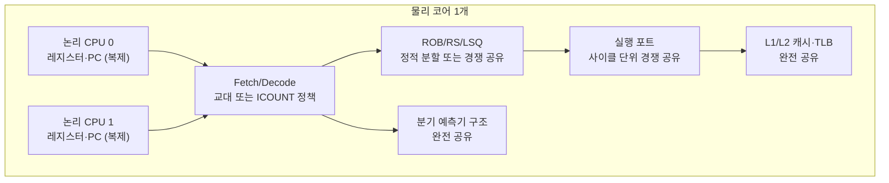

**동시 멀티스레딩(Simultaneous Multithreading, SMT)**, 인텔 구현 기준으로는 **Hyper-Threading**이란, 물리 코어 하나의 실행 자원을 두 개(또는 그 이상)의 논리 프로세서가 사이클 단위로 나눠 쓰게 만들어 운영체제에는 마치 코어가 두 배로 늘어난 것처럼 보이게 하는 하드웨어 기법입니다. [05장: ILP 기초](/post/cpu-optimization/instruction-level-parallelism-fundamentals/)에서 다룬 명령 수준 병렬성과 [06장: Out-of-Order 실행과 성능](/post/cpu-optimization/out-of-order-execution-performance/)에서 다룬 비순차 실행은 한 스레드 안에서 병렬성을 최대한 끌어내려 하지만, 실제 코드는 의존성 체인·캐시 미스·분기 예측 실패로 자주 멈춰(stall) 서고 그 시간 동안 실행 포트는 비어 있습니다. SMT는 이 빈 슬롯을 다른 스레드의 명령어로 채워 처리량을 끌어올리자는 아이디어에서 출발했지만, 바로 그 "자원을 나눠 쓴다"는 성질이 지연시간에 민감한 워크로드에는 예측 불가능한 간섭(jitter)으로 되돌아옵니다. 이 장에서는 SMT가 물리 코어의 어떤 자원을 복제하고 어떤 자원을 공유하는지, 그 공유가 실제로 어떤 성능 간섭을 만드는지, 그리고 저지연 시스템에서 SMT를 켜 둘지 끄거나 격리할지를 판단하는 기준을 다룹니다.

## 이 장을 읽기 전에

**선행 챕터**: 이 장은 [CPU 파이프라인 기초](/post/cpu-optimization/cpu-pipeline-fundamentals/)의 페치·디코드·실행 단계 개념, [분기 예측 메커니즘과 비용](/post/cpu-optimization/branch-prediction-mechanisms-cost/)의 BTB·예측기 구조, [캐시 계층 구조](/post/cpu-optimization/cache-hierarchy-l1-l2-l3/)의 L1/L2 공유 원리, [ILP 기초](/post/cpu-optimization/instruction-level-parallelism-fundamentals/)와 [Out-of-Order 실행과 성능](/post/cpu-optimization/out-of-order-execution-performance/)에서 다룬 ROB·예약 스테이션·실행 포트 개념, [TLB 미스 최적화](/post/cpu-optimization/tlb-miss-optimization/)의 주소 변환 캐시 개념을 전제로 합니다. 이 여섯 장의 메커니즘이 "물리 코어 하나 안에서 무엇을 공유하는가"의 재료이기 때문입니다.

**이 장의 깊이**: 이 장은 **심화**입니다. SMT가 복제하는 자원과 공유하는 자원을 구분하고, 그 공유가 저지연 워크로드에 어떤 간섭을 만드는지, 언제 SMT를 켜고 끌지를 판단하는 기준까지 다룹니다. **다루지 않는 것**: 벤더·세대별 SMT 폭(SMT2/SMT4/SMT8)의 구체적 스펙 비교는 [현대 CPU 아키텍처 비교](/post/cpu-optimization/modern-cpu-architecture-comparison/), 하이브리드 코어·TopDown 카운터 해석 방법론은 [CPU 하드웨어 카운터 활용](/post/cpu-optimization/cpu-hardware-performance-counters/), SMT 형제 스레드 사이의 사이드채널·STIBP 완화는 [추측 실행과 보안 영향](/post/cpu-optimization/speculative-execution-security-impact/), 프론트엔드 페치·디코드·μOp 캐시의 내부 동작은 [μOp 캐시와 DSB](/post/cpu-optimization/uop-cache-decoded-stream-buffer/), 실행 포트 경합의 정량 분석은 [의존성 체인·포트 압력 분석](/post/cpu-optimization/dependency-chain-port-pressure-analysis/)에서 각각 다루므로 이 장에서는 반복하지 않습니다. `isolcpus`·`nohz_full` 같은 OS 스케줄러 격리 기법의 구체적 튜닝도 이 트랙의 경계 밖(OS/런타임 트랙)이라 개념만 언급합니다.

## 당신의 수준에 맞는 경로

| 수준 | 읽을 부분 | 핵심 목표 |
|------|---------|---------|
| **초보자** | "SMT의 역사와 설계 철학" ~ "물리 코어를 둘로 보이게 하는 메커니즘" | SMT가 무엇을 복제하고 무엇을 공유하는지 이해 |
| **중급자** | "공유 자원이 만드는 성능 간섭" ~ "흔한 오개념" | 공유 자원 경합이 지연시간에 미치는 실제 경로 이해 |
| **전문가** | "판단 기준" ~ "비판적 시각" | 워크로드 특성에 따라 SMT를 켜고 끄는 결정을 직접 내리기 |

---

## SMT의 역사와 설계 철학

동시 멀티스레딩이라는 아이디어는 상용 제품보다 학계 연구가 먼저였습니다. 1995년 워싱턴 대학의 Dean Tullsen, Susan Eggers, Henry Levy는 슈퍼스칼라 프로세서가 한 사이클 안에서 여러 독립된 스레드의 명령어를 동시에 발행(issue)할 수 있다는 구조를 ISCA(International Symposium on Computer Architecture)에서 발표했고, 시뮬레이션으로 이 구조가 단일 스레드 슈퍼스칼라 대비 최대 4배에 가까운 처리량을 낼 수 있음을 보였습니다.

> "Simultaneous multithreading ... permitting several independent threads to issue instructions to a superscalar's multiple functional units in a single cycle." — Tullsen, Eggers, Levy, "Simultaneous Multithreading: Maximizing On-Chip Parallelism"(ISCA, 1995), [워싱턴 대학 SMT 프로젝트 논문 초록](https://dada.cs.washington.edu/smt/papers/isca95abstract.html)

상용화는 2002년 인텔이 Pentium 4·Xeon에 얹은 **Hyper-Threading Technology**로 처음 이뤄졌습니다. 물리 코어 하나를 운영체제에 두 개의 논리 프로세서로 보이게 만든 이 구현 이후 "SMT"(일반 명칭)와 "Hyper-Threading"(인텔의 상표명)은 사실상 같은 개념을 가리키는 말로 함께 쓰입니다. 비슷한 시기 IBM도 독자적으로 SMT를 채택했지만 방향은 더 공격적이었습니다 — POWER5(2004)가 코어당 2스레드(SMT2)로 시작해 POWER7의 SMT4를 거쳐 POWER8·POWER9·POWER10에서는 코어당 최대 8스레드(SMT8)까지 확장했고, Sun(이후 Oracle)의 SPARC T-시리즈("Niagara")는 "스루풋 컴퓨팅"을 설계 철학으로 내세워 코어당 최대 8스레드로 개별 스레드의 지연시간보다 코어 전체의 처리량을 우선했습니다.

이 흐름은 최근 다시 갈립니다. 2021년 인텔 Alder Lake는 P-core(Golden Cove)에만 Hyper-Threading을 남기고 E-core에는 애초에 SMT를 넣지 않았으며([현대 CPU 아키텍처 비교](/post/cpu-optimization/modern-cpu-architecture-comparison/) 참고), Lion Cove 기반 Lunar Lake·Arrow Lake(2024)에서는 P-core에서도 Hyper-Threading을 완전히 제거했습니다. 2025년 출시된 Panther Lake 역시 SMT 없이 나왔고, 인텔은 향후 경쟁력 확보를 위해 SMT를 다시 도입할 가능성을 공개적으로 시사했지만 구체적 시점은 아직 확정되지 않았습니다. 이 방향 전환 자체가 "SMT는 항상 이득"이라는 명제가 아니라 다이 면적·설계 검증 복잡도·단일 스레드 성능 사이의 트레이드오프임을 보여줍니다. 반대로 AMD Zen 계열은 2017년 첫 세대부터 지금까지 코어당 2스레드(SMT2) 구성을 유지하고 있습니다(세대별 세부 차이는 [현대 CPU 아키텍처 비교](/post/cpu-optimization/modern-cpu-architecture-comparison/)에 위임). 앞 장에서 다룬 [Apple Silicon M시리즈](/post/cpu-optimization/apple-silicon-m-series-architecture/)가 SMT 없이 넓은 디코더와 큰 ROB로 단일 스레드 성능을 끌어올리는 길을 택한 것도 같은 트레이드오프에 대한 또 다른 답입니다.

## 물리 코어를 둘로 보이게 하는 메커니즘

SMT/Hyper-Threading이 운영체제에 두 개(또는 그 이상)의 논리 프로세서로 보이게 만드는 방법은 "코어를 복제"하는 것이 아니라 **극히 일부 상태만 복제하고 나머지는 그대로 공유**하는 것입니다. 복제되는 것은 레지스터 파일, 프로그램 카운터, 일부 제어 레지스터 같은 **아키텍처 상태(architectural state)** — 소프트웨어 관점에서 "이 스레드가 어디까지 실행했는가"를 나타내는 최소한의 정보뿐입니다. 그 외의 모든 실행 하드웨어, 즉 명령어 페치·디코드 대역폭, 마이크로op 큐, ROB·예약 스테이션·로드/스토어 큐, 실행 포트, L1/L2 캐시, TLB, 분기 예측기 구조는 물리 코어 하나에 하나씩만 있고 두 논리 스레드가 그것을 나눠 씁니다.

[CPU 파이프라인 기초](/post/cpu-optimization/cpu-pipeline-fundamentals/)에서 다룬 페치·디코드 단계와 [μOp 캐시와 DSB](/post/cpu-optimization/uop-cache-decoded-stream-buffer/)에서 다룰 프론트엔드 대역폭은, SMT 상태에서는 매 사이클(또는 정책에 따라 몇 사이클 단위로) 두 스레드 중 하나에만 배정되거나 ICOUNT 계열 정책처럼 "명령어가 덜 밀려 있는" 스레드에 우선권을 주는 방식으로 나뉩니다. [Out-of-Order 실행과 성능](/post/cpu-optimization/out-of-order-execution-performance/)에서 다룬 ROB·예약 스테이션·로드/스토어 큐는 마이크로아키텍처마다 처리 방식이 다릅니다 — 어떤 세대는 두 스레드 몫을 정적으로 절반씩 고정 분할(static partitioning)해 한쪽이 자원을 독점하지 못하게 보장하고, 어떤 세대는 경쟁적 공유(competitive sharing)를 택해 필요한 쪽이 더 많이 가져가게 하되 한 스레드가 다른 스레드를 굶길 위험을 남깁니다. 실행 포트는 [의존성 체인·포트 압력 분석](/post/cpu-optimization/dependency-chain-port-pressure-analysis/)에서 다루는 것처럼 사이클마다 두 스레드의 준비된 마이크로op이 경쟁적으로 배정되고, L1/L2 캐시([캐시 계층 구조](/post/cpu-optimization/cache-hierarchy-l1-l2-l3/))와 TLB([TLB 미스 최적화](/post/cpu-optimization/tlb-miss-optimization/))는 완전히 공유되어 두 스레드의 워킹셋이 서로를 밀어냅니다. 분기 예측기의 BTB·패턴 히스토리 테이블([분기 예측 메커니즘과 비용](/post/cpu-optimization/branch-prediction-mechanisms-cost/))도 공유되며, 이 공유가 성능 간섭을 넘어 [추측 실행과 보안 영향](/post/cpu-optimization/speculative-execution-security-impact/)에서 다룬 사이드채널의 통로가 되기도 합니다.



## 공유 자원이 만드는 성능 간섭

공유 자체는 나쁜 것이 아닙니다. 한 스레드가 캐시 미스나 의존성 체인 때문에 스톨하면 그 사이클의 실행 포트는 원래 비어 있었을 텐데, 형제 스레드가 그 슬롯에 자신의 준비된 마이크로op을 채워 넣으면 물리 코어 전체의 처리량(throughput)은 올라갑니다. 인텔이 처음 Hyper-Threading을 도입한 동기도, IBM·Sun이 SMT4·SMT8까지 밀어붙인 동기도 바로 이 "빈 슬롯을 낭비하지 않는다"는 처리량 극대화였습니다. 문제는 저지연 워크로드가 원하는 것이 처리량 평균이 아니라 <strong>개별 요청의 예측 가능한 지연시간(p99·p999)</strong>이라는 데 있습니다.

같은 물리 코어의 형제 스레드에서 무엇이 실행되고 있는지는 매 순간 달라지고, 그 형제 스레드가 캐시를 얼마나 채우고 실행 포트를 얼마나 점유하는지는 예측 대상이 되는 스레드 입장에서는 완전히 외부 요인입니다. 캐시 라인이 형제 스레드에 의해 축출(eviction)되면 원래 L1 히트였을 접근이 L2·L3까지 내려가고, 실행 포트가 형제 스레드의 부하로 포화되면 같은 코드가 어떤 순간에는 즉시 실행되고 어떤 순간에는 몇 사이클을 대기합니다. 이 변동성은 평균 처리량 지표에는 잘 드러나지 않지만 p99·p999 꼬리 지연시간에는 직접 반영되므로, "이웃 스레드"가 하는 일에 따라 같은 코드의 실행 시간이 흔들리는 **노이즈 네이버(noisy neighbor)** 문제로 나타납니다.

이 간섭은 [CPU 하드웨어 카운터 활용](/post/cpu-optimization/cpu-hardware-performance-counters/)에서 예고한 것처럼 카운터 해석 자체도 복잡하게 만듭니다. `perf stat`이 논리 CPU 단위로 찍는 사이클·IPC·캐시 미스 카운터는 실제로는 물리 코어 하나를 관통하는 활동의 일부만 그 논리 CPU에 귀속시킨 값입니다. 형제 스레드가 활발히 실행 중이면 측정 대상 스레드의 "IPC"에는 형제 스레드와의 자원 경합으로 인한 손실이 섞여 들어가고, 형제 스레드가 유휴 상태면 같은 코드가 사실상 전체 코어 자원을 독점해 더 높은 IPC를 보입니다. 즉 SMT가 켜진 상태에서 논리 CPU 하나의 카운터만 보고 "이 코드는 IPC가 낮다"고 단정하면, 코드 자체의 문제인지 형제 스레드와의 경합인지를 구분하지 못한 채 잘못된 결론에 도달할 수 있습니다.

```text
# 같은 물리 코어(형제 스레드)에서 측정한 논리 CPU별 perf stat 예시 — 수치는 워크로드·세대에 따라 다름
# 형제(CPU1)가 유휴 상태일 때 CPU0
     1,000,000,000      cycles
       850,000,000      instructions              #    0.85  insn per cycle

# 형제(CPU1)에서 캐시·포트 부하가 큰 스레드가 동시 실행될 때 CPU0 (같은 코드, 같은 반복 횟수)
     1,000,000,000      cycles
       520,000,000      instructions              #    0.52  insn per cycle
```

**두 상황의 지연시간 분산을 직접 재현해 측정**하면 노이즈 네이버 효과를 정량적으로 볼 수 있습니다. 아래는 측정 대상 스레드를 특정 논리 CPU에 고정하고, "이웃" 스레드를 SMT 형제(같은 물리 코어) 또는 별도의 물리 코어 중 하나에 고정해 지연시간 백분위수를 비교하는 벤치마크 뼈대입니다.

```cpp
#include <algorithm>
#include <atomic>
#include <chrono>
#include <cstdio>
#include <cstdlib>
#include <pthread.h>
#include <sched.h>
#include <thread>
#include <vector>

std::atomic<bool> stop{false};

// 이웃 스레드: 캐시 라인과 부동소수점 실행 포트를 계속 점유해 "노이즈 네이버"를 흉내낸다.
void noisy_neighbor(double* buf, std::size_t n) {
  while (!stop.load(std::memory_order_relaxed)) {
    for (std::size_t i = 0; i < n; ++i) buf[i] = buf[i] * 1.0000001 + 1.0;
  }
}

void pin_thread(std::thread& t, int cpu) {
  cpu_set_t set;
  CPU_ZERO(&set);
  CPU_SET(cpu, &set);
  pthread_setaffinity_np(t.native_handle(), sizeof(set), &set);
}

int main(int argc, char** argv) {
  if (argc < 3) { std::fprintf(stderr, "usage: %s measure_cpu neighbor_cpu\n", argv[0]); return 1; }
  int measureCpu = std::atoi(argv[1]);   // 측정 스레드가 실행될 논리 CPU (고정)
  int neighborCpu = std::atoi(argv[2]);  // 비교 대상: SMT 형제 CPU 또는 다른 물리 코어의 CPU

  constexpr std::size_t kBufN = 1 << 16;
  std::vector<double> buf(kBufN, 1.0);
  std::thread neighbor(noisy_neighbor, buf.data(), kBufN);
  pin_thread(neighbor, neighborCpu);

  cpu_set_t self_set;
  CPU_ZERO(&self_set);
  CPU_SET(measureCpu, &self_set);
  sched_setaffinity(0, sizeof(self_set), &self_set);  // 현재(측정) 스레드 고정

  std::vector<long> samples;
  samples.reserve(200000);
  volatile double x = 1.0;
  for (int i = 0; i < 200000; ++i) {
    auto t0 = std::chrono::steady_clock::now();
    for (int j = 0; j < 200; ++j) x = x * 1.0000001 + 1.0;  // 측정 대상 "작업" 대리
    auto t1 = std::chrono::steady_clock::now();
    samples.push_back(std::chrono::duration_cast<std::chrono::nanoseconds>(t1 - t0).count());
  }
  stop = true;
  neighbor.join();

  std::sort(samples.begin(), samples.end());
  auto pct = [&](double p) { return samples[static_cast<std::size_t>(samples.size() * p)]; };
  std::printf("p50=%ldns p99=%ldns p999=%ldns\n", pct(0.50), pct(0.99), pct(0.999));
  return 0;
}
```

`g++ -O2 -pthread -std=c++17 bench_smt.cpp -o bench_smt`(Linux, GCC 13 기준)로 빌드합니다. `lscpu -e`로 어떤 논리 CPU끼리 같은 `CORE`에 속하는지 먼저 확인한 뒤, `./bench_smt 0 1`(0·1이 SMT 형제인 경우)과 `./bench_smt 0 4`(4가 다른 물리 코어인 경우)를 각각 실행해 p99·p999를 비교합니다. `pthread_setaffinity_np`는 POSIX 전용이라 이 코드는 Linux/macOS 계열에서만 그대로 컴파일되며, Windows에서는 `SetThreadAffinityMask` 계열 API로 바꿔야 합니다. 이 벤치마크는 절대적인 나노초 수치를 얻으려는 것이 아니라 "형제 스레드 유무·부하"에 따라 p99·p999가 벌어지는 정도를 같은 하드웨어에서 상대 비교하는 데 목적이 있으므로, 실제 배포 전 판단 근거로 쓰려면 대상 워크로드의 실제 코드로 반드시 재현해야 합니다.

## 흔한 오개념

<strong>"SMT/Hyper-Threading은 코어가 2개로 늘어나는 것과 같다"</strong>는 틀린 생각입니다. 논리 CPU마다 복제되는 것은 레지스터 파일·프로그램 카운터 같은 아키텍처 상태뿐이고, 디코더 대역폭·실행 포트·ROB/RS/LSQ·L1/L2 캐시·TLB·분기 예측기 구조는 여전히 하나뿐인 물리 자원을 두 스레드가 나눠 씁니다. 논리 CPU 개수를 물리 코어 개수처럼 취급해 스레드 풀 크기를 정하면 자원 경합을 과소평가하게 됩니다.

<strong>"SMT를 커널/BIOS에서 끄는 것과 형제 스레드에 그냥 아무것도 스케줄하지 않는 것은 성능상 완전히 동일하다"</strong>는 것도 항상 참은 아닙니다. ROB·예약 스테이션·로드/스토어 큐 같은 일부 구조는 SMT가 켜져 있으면 두 스레드 몫으로 정적 분할된 채 유지될 수 있고, 형제 스레드가 유휴(idle) 상태여도 그 절반을 단독 스레드에 돌려주는지는 마이크로아키텍처 구현에 따라 다릅니다(구현 정의). 두 구성이 이론적으로 비슷해 보여도 실제로는 격리된 환경에서 직접 측정해 비교해야 합니다.

<strong>"SMT를 끄면 항상 지연시간이 좋아진다"</strong>는 것도 지나친 일반화입니다. 실행 포트가 이미 포화 상태가 아니고 캐시 미스로 자주 스톨하는 코드라면 형제 스레드가 그 빈 슬롯을 채워 처리량을 크게 높일 수 있습니다. SMT의 이득과 손실은 워크로드의 포트 압력([의존성 체인·포트 압력 분석](/post/cpu-optimization/dependency-chain-port-pressure-analysis/) 참고)·캐시 풋프린트·지연시간 목표(평균 처리량 vs p99 꼬리)에 따라 달라지므로, "SMT는 무조건 나쁘다"는 결론도 "무조건 좋다"는 결론만큼이나 위험합니다.

## 판단 기준: 언제 켜고 언제 끌 것인가

| 상황 | 권장 | 이유 |
|------|------|------|
| 단일 테넌트, p99·p999가 SLA인 매칭 엔진·시장 데이터 처리 스레드 | SMT 끄기 또는 형제 논리 CPU에 아무것도 스케줄하지 않기 | 캐시·포트·분기 예측기 경합이 곧 지연시간 분산으로 나타남 |
| 배치 처리·컴파일·분석처럼 총 처리량이 목표인 워크로드 | SMT 켜기 | 한 스레드의 스톨(캐시 미스·의존성 대기)을 다른 스레드 명령으로 채워 처리량 상승 |
| 혼합 신뢰 수준의 스레드가 같은 물리 코어의 형제로 배치될 가능성 | SMT 끄거나 동일 신뢰 그룹으로만 배치 | 캐시·예측기 상태 공유가 정보 유출 경로가 될 수 있음([추측 실행과 보안 영향](/post/cpu-optimization/speculative-execution-security-impact/)) |
| 카운터 기반 튜닝(TopDown 등) 진행 중 | 먼저 SMT를 끄고 측정한 뒤, 필요 시 켠 상태로 재측정 | 논리 CPU별 카운터가 형제 스레드 활동과 뒤섞여 해석이 어려움([CPU 하드웨어 카운터 활용](/post/cpu-optimization/cpu-hardware-performance-counters/)) |
| 실행 포트가 이미 포화 상태인 코드(포트 압력 높음) | SMT로 얻는 처리량 이득이 작을 가능성이 큼 | 형제 스레드가 쓸 여유 포트 슬롯 자체가 부족 |

Linux에서는 어떤 논리 CPU끼리 형제인지부터 확인해야 판단이 가능합니다.

```bash
lscpu -e   # CORE 열이 같은 행끼리 SMT 형제
cat /sys/devices/system/cpu/cpu0/topology/thread_siblings_list   # 예: "0,1"
```

실행하면 다음과 같이 CORE 열이 같은 논리 CPU끼리 SMT 형제임을 확인할 수 있습니다.

```text
$ lscpu -e
CPU NODE SOCKET CORE L1d:L1i:L2:L3 ONLINE MAXMHZ MINMHZ
  0    0      0    0 0:0:0:0          yes 5600.0000  800.0000
  1    0      0    0 0:0:0:0          yes 5600.0000  800.0000
  2    0      0    1 1:1:1:0          yes 5600.0000  800.0000
  3    0      0    1 1:1:1:0          yes 5600.0000  800.0000
```

CPU0과 CPU1이 같은 `CORE 0`이므로 SMT 형제이고, 저지연 스레드를 CPU0에 고정했다면 CPU1에는 다른 워크로드를 두지 않아야 노이즈 네이버를 피할 수 있습니다. 시스템 전체에서 SMT 자체를 끄려면 Linux 6.6부터는 스레드 수까지 지정할 수 있는 `/sys/devices/system/cpu/smt/control` 인터페이스를 씁니다.

```bash
cat /sys/devices/system/cpu/smt/control     # on | off | forceoff | notsupported | <N>
echo off | sudo tee /sys/devices/system/cpu/smt/control
cat /sys/devices/system/cpu/smt/active      # SMT가 실제로 활성 상태인지(0/1)
```

커널 문서는 `control` 파일의 가능한 값을 다음과 같이 정의합니다 — `on`은 "SMT is enabled", `off`는 "SMT is disabled", `forceoff`는 "SMT is force disabled. Cannot be changed."이며, `notsupported`·`notimplemented`는 각각 하드웨어·아키텍처가 런타임 전환을 지원하지 않는 경우입니다([kernel.org, sysfs-devices-system-cpu ABI 문서](https://www.kernel.org/doc/Documentation/ABI/testing/sysfs-devices-system-cpu)). BIOS/UEFI에서 SMT를 끄는 방법도 있지만, 재부팅 없이 실험하려면 이 인터페이스가 더 실용적입니다. 저지연 튜닝 가이드를 정리한 Erik Rigtorp는 SMT를 끄는 이유를 다음과 같이 요약합니다.

> "Since HT/SMT increases contention on processor resources it's recommended to turn it off if you want to reduce jitter introduced by contention on processor resources." — Erik Rigtorp, [Low latency tuning guide](https://rigtorp.se/low-latency-guide/)

SMT를 끄는 방법 자체(BIOS vs `smt/control` vs CPU 오프라인)와 그 뒤에 이어지는 `isolcpus`·`nohz_full`·IRQ 친화도 같은 OS 레벨 격리는 이 트랙의 경계 밖(OS/런타임 트랙)이므로, 여기서는 "SMT를 끌지 말지"와 "형제 CPU의 존재를 확인하는 법"까지만 다룹니다.

## 비판적 시각: 한계와 트레이드오프

SMT를 둘러싼 논쟁에서 가장 눈에 띄는 사실은 업계의 방향이 하나로 수렴하지 않는다는 점입니다. 인텔은 클라이언트 P-core에서 Hyper-Threading을 걷어냈다가 경쟁력을 위해 재도입을 검토하고, AMD는 Zen 첫 세대부터 지금까지 SMT2를 유지하며, IBM은 서버 워크로드에서 SMT8까지 밀어붙이고, Apple Silicon은 SMT 없이 넓은 파이프라인으로 답합니다. 이는 SMT의 이득이 다이 면적·검증 복잡도·목표 워크로드(단일 스레드 지연 vs 집계 처리량)에 따라 완전히 다른 트레이드오프 곡선을 그린다는 뜻이며, 어느 한쪽이 "정답"이라고 단정할 근거는 없습니다.

저지연 시스템 엔지니어 입장에서 더 실질적인 한계는 정적 분할과 경쟁 공유 중 어느 쪽이 적용되는지가 마이크로아키텍처마다 다르고 공개 문서에 상세히 나오지 않는 경우가 많다는 점입니다(구현 정의). 그 결과 "SMT를 끄면 정확히 얼마나 개선되는가"라는 질문에는 문헌적으로 확정된 단일 수치가 없고, 워크로드의 캐시 풋프린트·포트 압력·측정 대상 백분위수(평균 vs p99 vs p999)에 따라 결과가 크게 달라집니다. 게다가 SMT를 끄는 결정은 그 자체로 끝나지 않습니다 — 형제 CPU가 완전히 비어 있어도 운영체제 스케줄러가 그 자리에 다른 작업을 배치하지 않는다는 보장은 별도의 CPU 격리·인터럽트 친화도 설정으로 뒷받침해야 하며, 이 부분은 이 트랙이 아니라 OS/런타임 트랙의 책임입니다. 따라서 이 장에서 다루는 판단 기준은 "SMT를 켤지 끌지"에 대한 하드웨어 관점의 근거이지, 그것만으로 저지연 시스템의 격리가 완성된다는 뜻은 아닙니다.

## 마무리

- [ ] SMT/Hyper-Threading이 아키텍처 상태만 복제하고 프론트엔드·ROB·실행 포트·캐시·TLB·분기 예측기는 공유한다는 것을 설명할 수 있다.
- [ ] 정적 분할과 경쟁 공유의 차이, 그리고 이것이 구현마다 다르다는 점을 설명할 수 있다.
- [ ] 노이즈 네이버 효과가 평균 처리량이 아니라 p99·p999 꼬리 지연시간에 어떻게 반영되는지 설명할 수 있다.
- [ ] SMT 상태에서 논리 CPU별 하드웨어 카운터를 해석할 때 왜 형제 스레드 활동을 함께 고려해야 하는지 안다.
- [ ] `lscpu -e`·`thread_siblings_list`로 SMT 형제를 확인하고 `/sys/devices/system/cpu/smt/control`로 상태를 제어할 수 있다.
- [ ] 워크로드 특성(단일 테넌트 저지연 vs 배치 처리량)에 따라 SMT를 켜고 끄는 판단을 스스로 내릴 수 있다.

**이전 장**: [Apple Silicon 아키텍처](/post/cpu-optimization/apple-silicon-m-series-architecture/) (챕터 13)

**다음 장에서는** 프론트엔드가 이미 디코드한 마이크로op을 캐시해 두는 μOp 캐시(Decoded Stream Buffer)를 다룹니다. 이 장에서 "SMT 상태의 프론트엔드는 두 스레드가 페치·디코드 대역폭을 나눠 쓴다"고만 짚었던 부분을, μOp 캐시가 어떻게 그 병목 자체를 우회하는지로 이어서 살펴봅니다.

→ [μOp 캐시와 DSB](/post/cpu-optimization/uop-cache-decoded-stream-buffer/) (챕터 15)
