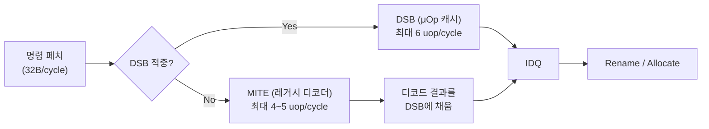

**μOp 캐시(micro-op cache)**, 인텔 구현에서는 <strong>DSB(Decoded Stream Buffer)</strong>라 부르는 이 구조는 한 번 디코드된 x86 명령을 원본 바이트가 아니라 **디코드 결과(micro-op)** 형태로 캐싱해, 같은 코드 경로를 다시 실행할 때 프리디코드·디코드 단계를 건너뛰게 해 준다. x86 명령은 1~15바이트로 길이가 가변적이고 필드 해석이 복잡해서, 매 사이클 여러 명령을 동시에 디코드하는 회로는 트랜지스터·전력 비용이 크다. 반복 실행되는 루프·핫 함수에서 매번 이 비싼 디코드를 다시 하는 대신, 디코드 결과를 캐시에 저장해 두었다가 그대로 재생하면 프런트엔드가 백엔드에 uop를 공급하는 속도가 크게 개선된다. 이 장은 DSB의 내부 구조, 코드 배치가 적중률에 미치는 영향, 그리고 이를 perf 카운터로 확인하는 방법을 다룬다.

## 이 장을 읽기 전에

이 장은 [01장: CPU 파이프라인 기초](/post/cpu-optimization/cpu-pipeline-fundamentals/)에서 다룬 "페치 → 디코드 → 실행" 흐름과, [17장: Frontend vs Backend Bound](/post/cpu-optimization/frontend-backend-bound-topdown-basics/)에서 다룬 "프런트엔드가 백엔드에 uop를 충분히 공급하지 못하는 상태"라는 개념을 전제로 한다. 이 두 장을 먼저 읽지 않았다면, 여기서 다루는 "DSB 적중"이 왜 프런트엔드 바운드를 줄이는 일인지 연결하기 어렵다. **이 장의 깊이**는 **전문가** 수준이다 — DSB/μOp 캐시의 내부 구조, way·32바이트 윈도우 제약, 코드 배치와의 상호작용을 실제 perf 카운터로 확인하는 수준까지 다룬다. **다루지 않는 것**: 분기 예측기 자체의 동작([02장](/post/cpu-optimization/branch-prediction-mechanisms-cost/)), L1/L2/L3 데이터 캐시 계층과 미스 비용([03장](/post/cpu-optimization/cache-hierarchy-l1-l2-l3/), [04장](/post/cpu-optimization/cache-miss-analysis-hint-instructions/)), 명령 의존성 체인·포트 압력([18장](/post/cpu-optimization/dependency-chain-port-pressure-analysis/))이다. 컴파일러가 코드 배치를 어떻게 재정렬하는지(PGO, BOLT)의 빌드 파이프라인 자체는 컴파일러 트랙의 몫이며, 이 장은 그 결과가 DSB 적중률에 미치는 영향만 다룬다.

## 당신의 수준에 맞는 경로

| 수준 | 읽을 부분 | 핵심 목표 |
|------|---------|---------|
| **중급자** | "디코더가 병목이 되는 순간" ~ "DSB와 μOp 캐시의 구조" | 왜 디코더가 병목이 되고 DSB가 이를 어떻게 우회하는지 이해 |
| **심화** | "코드 배치가 DSB 적중률을 좌우하는 이유" ~ "자주 하는 오해 세 가지" | 32바이트 윈도우·way 제약과 코드 배치의 상호작용 이해 |
| **전문가** | "판단 기준: 언제 DSB를 신경 써야 하는가" ~ "비판적 시각" | perf 카운터로 DSB/MITE 비율을 측정하고 투자 여부를 판단 |

---

## 디코더가 병목이 되는 순간과 DSB의 등장

x86 명령의 가변 길이 인코딩은 명령 경계를 찾는 것 자체가 순차적인 작업이라, 폭넓은(wide) 병렬 디코더를 만들수록 회로 복잡도와 전력 소비가 급격히 늘어난다. 인텔은 이 문제를 단계적으로 완화해 왔다. Core 2(Merom, 2006)는 짧은 루프의 명령 바이트를 캐싱하는 **명령 루프 버퍼**를 두었고, Nehalem(2008)은 이를 **디코드된 uop 루프 버퍼**로 발전시켰다. Sandy Bridge(2011)에 와서야 특정 루프에 한정되지 않는 범용 **DSB**, 즉 지금 말하는 μOp 캐시가 처음 등장했다. Sandy Bridge의 DSB는 32세트 × 8웨이 구조에 웨이당 최대 6개 uop를 저장해 총 1,536개 uop를 담을 수 있었고, 이 용량과 구조는 이후 여러 세대에서 그대로 유지되었다.

> "Sandy Bridge's frontend inherits features from Nehalem, but gets a new 1536 entry, 8-way micro-op cache." — [Chipsandcheese: Sandy Bridge — Setting Intel's Modern Foundation](https://chipsandcheese.com/p/sandy-bridge-setting-intels-modern-foundation)

AMD도 비슷한 길을 걸었다. Zen(2017)의 op cache는 2,048개 uop였고, Zen2에서 4,096개로 두 배가 되었으며, Zen4(2022)에서는 6,750개로 늘었다. 흥미롭게도 Zen5(2024)의 op cache 엔트리 수는 6,000개로 Zen4보다 오히려 줄었는데, 대신 L1 명령 캐시를 32KB로 키워 op cache와 역할을 분담하는 쪽으로 설계 방향이 바뀌었다. 이 흐름은 μOp 캐시 용량이 "클수록 무조건 좋다"는 단순한 함수가 아니라, L1 명령 캐시·디코더 폭·전력 예산과 함께 조정되는 설계 변수임을 보여준다.

## DSB와 μOp 캐시의 구조

DSB가 캐싱하는 것은 **원본 명령 바이트가 아니라 디코드가 끝난 uop**라는 점이 L1 명령 캐시(L1i)와의 근본적인 차이다. 매핑 단위는 개별 명령이 아니라 **32바이트로 정렬된 코드 구간**이며, 하나의 32바이트 구간이 통째로 디코드되어 백엔드로 넘어갈 때 그 결과가 DSB에도 함께 채워진다. 인텔 문서는 DSB가 6KB 명령 캐시처럼 동작하며 평균 80% 안팎의 적중률을 보인다고 설명하는데, 이는 DSB 자체가 L1i보다 작은 대신 "이미 해석까지 끝난" 결과를 주기 때문에 같은 용량이라도 훨씬 효율적으로 작동한다는 뜻이다. DSB에 적중하면 프리디코드·디코드 회로 전체가 클록 게이팅되어 전력도 아낄 수 있다.



세대별 차이도 실무에서 자주 참조하게 되므로 표로 정리해 둔다.

| 마이크로아키텍처 | μOp 캐시 용량 | 구조 | IDQ 전달 폭 |
|------|------|------|------|
| Sandy Bridge (2011) | 1,536 uop | 32세트 × 8웨이 × 6uop | 최대 4 uop/cycle |
| Skylake (2015) | 1,536 uop | 32세트 × 8웨이 × 6uop, 64B 윈도우 병합 | 최대 6 uop/cycle |
| AMD Zen (2017) | 2,048 uop | — | 구현 정의 |
| AMD Zen2 (2019) | 4,096 uop | — | 구현 정의 |
| AMD Zen4 (2022) | 6,750 uop | — | 구현 정의 |
| AMD Zen5 (2024) | 6,000 uop (32KB L1i와 역할 분담) | — | 구현 정의 |

Skylake 이후 세대에서도 DSB 총 용량 자체는 크게 늘지 않았고, 대신 IDQ 전달 폭이 넓어지거나 32바이트 단위 매핑이 64바이트로 병합되는 등 주변 구조가 조정되었다. 인텔의 정확한 웨이 수·세대별 미세 조정은 마이크로아키텍처마다 다르므로, 배포 대상 CPU 세대에서 `cpuid`나 `perf`로 직접 확인하는 것이 안전하다.

## 코드 배치가 DSB 적중률을 좌우하는 이유

DSB의 매핑 단위가 32바이트 코드 구간이라는 사실에서 실무에 중요한 제약이 나온다. [인텔 최적화 레퍼런스 매뉴얼](https://cdrdv2-public.intel.com/814198/248966-Optimization-Reference-Manual-V1-049.pdf)과 이를 정리한 [Agner Fog의 마이크로아키텍처 매뉴얼](https://www.agner.org/optimize/microarchitecture.pdf)에 따르면, **하나의 32바이트 코드 구간은 한 세트 안에서 최대 3개 웨이(최대 18 uop)까지만 차지할 수 있다.** 또한 한 DSB 라인은 하나의 32바이트 구간에 속한 명령만 담을 수 있고, 그 구간 안에서 실행되는(taken) 분기를 만나면 그 지점에서 라인이 끝난다. 즉 같은 바이트 수라도 **분기가 촘촘한 코드**는 32바이트 구간 하나에 여러 개의 짧은 DSB 라인을 소모하게 되어, 3웨이 한도를 넘기면 나머지는 DSB에 담기지 못하고 매번 MITE(레거시 디코더) 경로로 다시 디코드된다. 이것이 "코드 크기가 작아도 DSB 적중률이 낮을 수 있는" 근본 원인이다 — 문제는 바이트 수가 아니라 32바이트 윈도우당 분기 밀도와 웨이 소비량이다.

코드 정렬도 같은 맥락에서 영향을 준다. 컴파일러가 루프 시작 주소를 32바이트 경계에 맞추면(GCC의 `-falign-loops=32` 등) 루프 본문이 DSB 윈도우 경계를 가로지르며 쪼개지는 상황을 줄일 수 있다. 반대로 정렬이 어긋나 루프가 두 개의 32바이트 윈도우에 걸치면, 각 윈도우가 별도의 DSB 라인을 요구하고 웨이를 더 많이 소비한다.

```asm
    .text
    .p2align 5              # 32바이트 경계에 루프 시작 정렬
hot_loop:
    add    %rax, (%rdi)
    add    $8, %rdi
    cmp    %rsi, %rdi
    jl     hot_loop
```

이 GAS 구문은 `as hot_loop.s -o hot_loop.o`로 그대로 어셈블할 수 있다. `.p2align 5`는 다음 레이블(`hot_loop`)을 2^5=32바이트 경계에 맞추라는 지시자이며, 컴파일러 출력에서도 `-falign-loops=32`나 PGO 빌드가 유사한 정렬을 자동으로 넣는다. DSB에 적중하지 못한 구간이 매번 MITE로 전환될 때는 **DSB-to-MITE 전환 페널티**가 추가로 붙는데, 일반적으로 전환당 0~2사이클 수준이지만 이런 전환이 핫 루프 안에서 자주 반복되면 누적 비용이 무시할 수 없는 수준이 된다.

## LSD(Loop Stream Detector)와 DSB는 다르다

DSB와 자주 혼동되는 구조가 <strong>LSD(Loop Stream Detector)</strong>다. LSD는 IDQ 자체에 있는 아주 작은 루프 캐시로, 반복 조건을 만족하는 극히 짧은 루프의 uop 스트림을 재생하면서 페치·디코드·심지어 DSB 접근까지 건너뛴다는 점에서 DSB보다 한 단계 더 앞선 최적화다. 하지만 LSD는 하드웨어 결함으로 실제 배포에서 발목을 잡힌 이력이 있다. Skylake와 Kaby Lake 일부 스테핑에서는 SKL150/KBL095로 알려진 에라타(하이퍼스레딩과 LSD의 상호작용에서 발생하는 예측 불가능한 동작)가 발견되어, 인텔이 마이크로코드 업데이트로 LSD 자체를 비활성화했다. 그 결과 해당 CPU에서는 원래 LSD가 처리했을 짧은 루프도 DSB 경로로 넘어가며, 일부 워크로드는 소폭 느려지고 전력 소비가 늘었다. 이 사례는 "이 세대는 LSD가 있으니 짧은 루프는 공짜"라는 가정이 마이크로코드 리비전에 따라 깨질 수 있음을 보여주는 실제 사례이며, LSD/DSB의 활성 여부는 배포 대상 CPU의 마이크로코드 버전까지 확인해야 확정할 수 있는 **구현 정의** 영역이다.

## 흔한 오개념 세 가지

<strong>"μOp 캐시는 L1 명령 캐시와 같은 것이다"</strong>는 틀렸다. L1i는 원본 명령 바이트를 캐싱하고, DSB는 디코드가 끝난 uop를 캐싱한다. DSB는 사실상 L1i의 부분집합(inclusive)으로 동작하며, L1i에 없는 코드는 애초에 DSB에도 있을 수 없다.

<strong>"코드가 작으면 DSB 적중률이 자동으로 높다"</strong>도 오해다. 앞서 본 것처럼 결정 요인은 총 바이트 수가 아니라 32바이트 윈도우당 분기 밀도와 3웨이 한도다. 크기는 작지만 분기가 촘촘한 디스패치 테이블·스위치문은 DSB 웨이를 낭비하며 적중률이 낮을 수 있다.

<strong>"DSB가 있으면 디코드 병목이 완전히 사라진다"</strong>는 것도 지나치다. 콜드 스타트(처음 실행되는 코드), DSB 용량을 초과하는 큰 핫 루프, DSB-MITE 전환 페널티, 그리고 위에서 본 LSD 에라타 같은 마이크로코드 이슈 때문에 DSB가 있어도 MITE 경로가 완전히 사라지지는 않는다. TopDown 분석에서 `Frontend Bound`가 여전히 높게 나온다면 DSB 적중률부터 확인해야 한다.

## 판단 기준: 언제 DSB를 신경 써야 하는가

| 상황 | 권장 | 비권장 |
|------|------|--------|
| 초당 수십억 회 실행되는 타이트한 핫 루프 | DSB 적중률을 perf로 먼저 측정 후 코드 배치·정렬 검토 | 측정 없이 코드 재배치부터 시도 |
| 드물게 호출되는 콜드 패스 | 신경 쓰지 않음(디코드 비용이 실행 빈도에 묻힘) | DSB 튜닝에 시간 투자 |
| 분기 많은 조밀한 디스패치/스위치 코드 | 32B 윈도우당 분기 밀도를 줄이거나 PGO/BOLT로 레이아웃 재배치 | 분기 밀도를 그대로 두고 다른 최적화만 반복 |
| E-core(Atom 계열)·모바일 SoC 배포 | DSB 부재를 가정하고 실측(Gracemont/Skymont류는 μOp 캐시가 없음) | P-core에서 얻은 DSB 적중률을 그대로 가정 |
| 인텔↔AMD 크로스 벤더 배포 | 벤더별 op cache 용량 차이를 인지하고 perf 이벤트로 각각 실측 | 한 벤더에서 측정한 수치를 다른 벤더에 그대로 적용 |

## perf로 프런트엔드 딜리버리 경로 측정하기

DSB 적중률은 추측이 아니라 하드웨어 카운터로 확인하는 것이 원칙이다. 아래는 정렬 플래그를 바꿔가며 반복 실행하는 간단한 핫 루프와, 그 결과를 `perf stat`으로 관찰하는 최소 예시다.

```cpp
#include <cstdint>

// 빌드 예시(Linux x86-64, GCC 13, -O2):
//   g++ -O2 -falign-loops=32 hot_loop.cpp -o hot_loop_aligned
//   g++ -O2 -falign-loops=1  hot_loop.cpp -o hot_loop_unaligned
int main() {
  constexpr std::uint64_t kIters = 2'000'000'000ULL;
  volatile std::uint64_t sum = 0;
  for (std::uint64_t i = 0; i < kIters; ++i) {
    sum += i ^ (i >> 3);  // 디코더가 반복 처리할 단순 연산
  }
  return static_cast<int>(sum);
}
```

정렬 플래그가 다른 두 바이너리를 각각 만든 뒤, 같은 이벤트 조합으로 `perf stat`을 돌려 DSB/MITE 공급 비율을 비교한다. 아래는 정렬된 빌드(`hot_loop_aligned`)에 대해 실행한 예시 출력이다.

```text
$ perf stat -e idq.dsb_uops,idq.mite_uops,dsb2mite_switches.penalty_cycles,cycles \
    ./hot_loop_aligned

 Performance counter stats for './hot_loop_aligned':

   18,203,441,102      idq.dsb_uops
      412,338,120      idq.mite_uops
        3,110,442      dsb2mite_switches.penalty_cycles
    6,004,221,880      cycles
```

`idq.dsb_uops`가 `idq.mite_uops`보다 압도적으로 크면 해당 루프는 대부분 DSB에서 공급된 것이고, 반대로 `mite_uops` 비중이 높거나 `dsb2mite_switches.penalty_cycles`가 눈에 띄게 크면 코드 배치·정렬 문제를 의심할 근거가 된다(Linux perf, Intel Skylake/Ice Lake 계열 이벤트명 기준이며, 마이크로아키텍처·perf 버전에 따라 이벤트 이름이 달라질 수 있다). 이 수치는 절대값보다 **정렬 플래그를 바꾼 두 빌드 사이의 상대 비교**로 활용할 때 신뢰도가 높다. 절대 수치를 인용하려면 반드시 자신의 하드웨어·컴파일러·플래그 조합에서 재현해 확인해야 한다.

## 비판적 시각: 한계와 트레이드오프

DSB는 프로그래머가 직접 켜고 끄거나 내용물을 지정할 수 있는 구조가 아니다. 실질적으로 통제 가능한 레버는 코드 배치(함수 순서, 인라이닝 정도, 정렬)뿐이며, 이는 컴파일러의 PGO·[BOLT](/post/compiler-optimization/getting-started-compiler-build-performance-tuning/) 같은 빌드 후 레이아웃 최적화에 크게 의존한다. 마이크로아키텍처마다 용량·정책이 달라(인텔은 1,536 uop로 여러 세대 고정, AMD는 세대마다 2K에서 6.75K까지 요동) 한 세대에서 얻은 최적화가 다른 세대·다른 벤더에서는 무의미하거나 역효과일 수 있다. E-core/Atom 계열은 애초에 DSB가 없으므로, 하이브리드 P/E 코어 배포 환경([08장](/post/cpu-optimization/modern-cpu-architecture-comparison/), [09장](/post/cpu-optimization/cpu-hardware-performance-counters/)의 `perf --cpu-type` 참고)에서는 코어 종류별로 다른 그림이 나온다는 점을 감안해야 한다. 나아가 [ISCA 2021의 "I See Dead μops" 연구](https://www.cs.virginia.edu/venkat/papers/isca2021a.pdf)는 μOp 캐시의 웨이 충돌 패턴 자체가 실행 흐름에 대한 정보를 흘리는 사이드채널로 악용될 수 있음을 보였는데, 이런 보안 연구는 향후 마이크로코드·마이크로아키텍처 완화책이 DSB의 동작이나 성능 특성을 바꿀 가능성을 시사한다. 결론적으로 DSB 관련 최적화는 "코드를 재배치하면 항상 이득"이라는 단정이 아니라, 대상 하드웨어·컴파일러·마이크로코드 리비전에서 직접 측정한 뒤에만 유효한 국소적 판단으로 다뤄야 한다.

## 마무리

- [ ] DSB가 원본 바이트가 아니라 디코드 결과(uop)를 캐싱한다는 점과 L1i와의 관계를 설명할 수 있다.
- [ ] 32바이트 코드 구간·3웨이(18 uop) 제약이 코드 배치·분기 밀도와 어떻게 상호작용하는지 설명할 수 있다.
- [ ] LSD와 DSB의 차이를 구분하고, LSD가 마이크로코드 에라타로 비활성화될 수 있다는 사례를 알고 있다.
- [ ] `idq.dsb_uops`/`idq.mite_uops`/`dsb2mite_switches.penalty_cycles` 같은 perf 카운터로 DSB 적중률을 실측할 수 있다.
- [ ] E-core/Atom 계열처럼 DSB가 없는 코어가 존재한다는 한계를 인지하고, 코드 배치 최적화를 벤더·세대별로 재검증할 수 있다.

**이전 장**: [SMT/Hyper-Threading 성능 영향](/post/cpu-optimization/smt-hyperthreading-performance/) (14장)

**다음 장에서는** x86 계열을 벗어나 **RISC-V 아키텍처 기초**를 다룬다. RISC-V는 고정 길이 명령과 단순한 인코딩을 지향해, 이 장에서 본 "가변 길이 디코드 병목을 우회하기 위한 μOp 캐시"라는 문제 설정 자체가 상당 부분 완화되는 대조적인 사례다. 임베디드·니치 플랫폼을 다루는 만큼, 이 장에서 얻은 "디코더 비용은 ISA 설계에 좌우된다"는 관점을 가지고 넘어가면 두 아키텍처의 프런트엔드 설계 철학 차이가 더 선명하게 보인다.

→ [RISC-V 아키텍처 기초](/post/cpu-optimization/risc-v-architecture-performance-fundamentals/) (16장)
